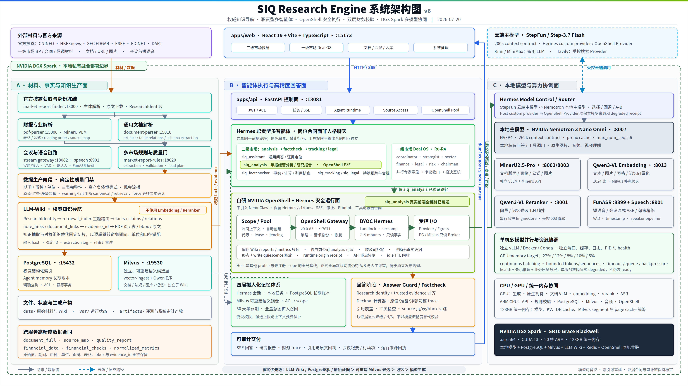

# SIQ Research Engine



SIQ Research Engine 是一套面向投研机构的可审计智能研究生产线。项目把官方披露下载、财报与通用文档解析、结构化证据包、PostgreSQL / Milvus 沉淀、Hermes 多智能体协作，以及 NVIDIA OpenShell 安全运行面组合成一个可复核、可回放、可持续扩展的投研系统。

当前产品心智分为三块：

1. 二级市场投研分析智能体集群。
2. 一级市场投研决策智能体集群。
3. 应用中心，包括文档解析、会议转写和向量入库。

SIQ 的核心目标不是“让模型写一篇像研报的文章”，而是让数字、判断、风险提示、引用和行动建议都能回到官方披露、PDF 页码、XBRL facts、表格单元格、Markdown 行、数据库记录、会议时间轴或投委会证据对象。对 SIQ 来说，证据先于回答，质量门禁先于入库，审计链先于流畅表达。

## 项目定位

SIQ 不是普通 RAG、Chatbot 或单文件 PDF 问答工具，而是“从可信材料到结构化证据，再到受控智能体结论”的全链路系统。

它服务三类高价值场景：

| 产品域 | 主要用户 | 核心问题 | SIQ 交付 |
| --- | --- | --- | --- |
| 二级市场投研分析智能体集群 | 研究员、基金经理、投研数据团队、合规团队 | 多市场披露难找、PDF/XBRL 难解析、模型答案难追溯 | 官方披露检索、财报解析、LLM Wiki evidence package、分析/核查/跟踪/法务智能体 |
| 一级市场投研决策智能体集群 | 投资经理、行业专家、财务/法务/风控、投委会主席 | 尽调材料分散、专家结论难对齐、投委会过程难审计 | Deal OS、材料中心、证据构建、R0-R4 工作流、投委会多角色决策链 |
| 应用中心 | 研究运营、数据工程、会议协作、知识库管理员 | 文档、会议和知识库沉淀成本高 | 通用文档解析、会议实时/导入转写、Milvus 向量入库与知识库治理 |

三块能力共享同一个事实层、权限模型、质量门禁和审计语言。二级市场的披露证据、一级市场的尽调材料、会议陈述、智能体判断和最终决策可以在同一套 evidence / source / memory 体系中互相引用。

## 当前状态

截至 2026-07-18，项目已从多服务技术验证进入“可演示、可复核、可扩展”的平台化阶段。

2026-07-20 的本轮 README 深度审计继续核对了实际代码、模型启动脚本、DGX Spark 运行状态、OpenShell 完成度门禁和主要数据服务；新增章节中的动态状态以各自标注的采样日期为准。

| 方向 | 当前状态 | 说明 |
| --- | --- | --- |
| 二级市场商业样板 | A 股全链路样板成熟，多市场证据包继续扩展 | 上汽集团 `600104` 作为当前主样板，已覆盖 PDF 解析、三表指标、证据、事实图谱、分析、核查、跟踪、法律意见和 OpenShell 灰度验证 |
| 官方披露入口 | CN / HK / US / EU / JP / KR 六市场入口 | US 已支持中文 alias，例如“英伟达”到 `NVDA / CIK 1045810`，且遵守市场选择边界 |
| 多市场解析与规则 | A 股 PDF、HK PDF package、SEC XBRL/iXBRL、ESEF、EDINET、DART | `services/market-report-rules` 和 `packages/market-contracts` 统一 financial data、quality gates 和 load plan |
| 一级市场 Deal OS | R0-R4 投委会工作流、材料中心、专家角色、审计链持续完善 | chairman、strategist、sector、finance、legal、risk、coordinator 等 profiles 形成决策集群 |
| 应用中心 | 文档解析、会议转写、向量入库均有独立链路 | 通用文档 artifact、meeting speech/gateway、Milvus ingest 支撑跨业务复用 |
| 智能体记忆 | Hermes 原生会话记忆 + 本地临时任务记忆 + PostgreSQL 权威长期记忆 + Milvus 语义索引 + reranker | 支持拟人化连续性、全量记忆、半衰期衰减、按需全量召回，以及 `user_private` / `project_shared` / `system_shared` 隔离 |
| NVIDIA OpenShell 安全运行面 | `siq_analysis` 分析助手 OpenShell 全链路已跑通并通过真实前端验证；正式生产质量发布门仍为 `NO_GO` | 已真实使用 OpenShell 网关、沙箱、Provider、策略、服务转发、公司范围自动创建、对话沙箱代际、资源池租约/隔离/恢复、空闲 TTL 回收和 Host 回退；`NO_GO` 只表示正式 A/B、人工评审和质量发布证据尚未满足，不表示分析助手集成未跑通 |

## 为什么 SIQ 难

真正难点不在“接入大模型”，而在投研事实生产的工程复杂性。

| 难点 | 说明 | SIQ 的应对 |
| --- | --- | --- |
| 官方源异构 | CNINFO、HKEXnews、SEC EDGAR、ESEF、EDINET、DART 的标识、格式和请求策略完全不同 | `market-report-finder` 按市场隔离实体解析、官方查询、下载目录和限速策略 |
| 文档形态异构 | PDF、HTML、iXBRL、XBRL、ESEF ZIP、EDINET/DART XML、Office、图片和网页需要不同解析路径 | `pdf-parser`、`document-parser` 与市场 adapters 分层处理，不把所有材料粗暴切成 chunk |
| 证据要求高 | 投研结论必须追到页码、表格、行列、bbox、anchor、XBRL tag 或 hash | `document_full.json`、`source_map.json`、`quality_report.json`、evidence package 统一表达 |
| 质量风险高 | 低质量解析一旦进入数据库或向量库，会长期污染问答和报告 | warning/fail package 默认阻断 PostgreSQL import 和 Milvus dry-run，force override 需要显式确认 |
| 多角色协作难 | 分析、核查、跟踪、法务、投委会角色需要共享事实层，又不能越权 | Hermes profiles 按岗位职责建模，输出路径、禁止行为、证据要求和升级条件可审阅 |
| 运行安全难 | 智能体需要终端、文件、代码和网络能力，但不能改源码、Prompt、固化事实或泄露凭据 | 自研 NVIDIA OpenShell+Hermes 方案将执行面放入受控沙箱，并保留 Host 回退和 A/B 质量门 |

## 核心创新

### 1. 官方披露直连

SIQ 优先连接官方披露源，而不是依赖二手聚合站。系统先解决“来源可信”问题，再解决解析、检索和智能体消费问题。

### 2. LLM Wiki 证据包

SIQ 的事实底座不是一组来源不明的向量 chunk，而是按市场、公司、报告期和披露来源组织的文件型证据包。典型 package 包含 manifest、quality、source map、metrics、tables、parser artifact、artifact hash 和 stable id。

这使 Wiki package 成为权威事实层，PostgreSQL 是结构化索引，Milvus 是可重建的语义索引。向量库失效可以重建，事实源不丢。

需要明确一个容易被误解的边界：**LLM-Wiki 本身不调用 embedding 模型、ranker 模型或 Milvus**。Wiki 的 `semantic/` 是结构化语义对象和逻辑路由目录，不是向量索引；Qwen3-VL Embedding/Reranker 只服务 Milvus 的跨模态候选、Agent memory 和其他可重建语义检索，不参与 Wiki 权威事实的定位与排序。

### 2.1 LLM-Wiki：非切片知识工程与逻辑跳转检索

LLM-Wiki 是本项目为 LLM/智能体建立的**知识抽取、组织和跳转查询层**。它的目标不是把年报切成若干相似文本片段，而是把“公司、报告、主题、事实、关系、指标、判断、附注和证据”组织成可寻址、可校验、可回溯的知识对象，让模型沿着业务逻辑读取证据。

#### 与传统 RAG 的根本差异

传统 RAG 通常是 `文档切片 -> embedding -> 向量召回 -> top-k 拼接 -> LLM 回答`。它对一般知识问答有效，但上市公司年报和尽调材料存在跨页表格、主表与附注、同名指标、多期间、多单位、多币种和强证据约束；固定长度切片会把一个完整事实拆开，也可能把相似但不相同的期间、主体或口径放在同一上下文中。

SIQ LLM-Wiki 采用 `身份冻结 -> 知识抽取 -> 对象组织 -> 主题路由 -> 逻辑跳转 -> 证据回链`，不以相似度决定权威事实。对财务问题，系统先定位准确的 `market/company_id/filing_id/parse_run_id`，再根据问题类型读取三大表、指标、附注、全文或证据对象；只有在需要补充未结构化描述时，才进行受控全文回溯或调用独立的向量能力。

| 维度 | 传统 RAG | SIQ LLM-Wiki |
| --- | --- | --- |
| 基本单元 | 固定长度文本 chunk | 公司、报告、segment、fact、relation、claim、note_link、document_link、evidence |
| 召回机制 | embedding 相似度和 top-k | `ResearchIdentity` + topic alias + 对象 ID + priority files + 逻辑跳转 |
| 财务事实 | 从片段中猜期间、单位和口径 | raw/normalized/value/unit/currency/period/source 一起保存，先结构化再回答 |
| 跨页/附注 | 切片边界可能截断表格和上下文 | `note_links.json`、`document_links.json` 显式连接主表项目、附注标题、附注表格和源页 |
| 证据定位 | 只能返回片段或向量命中 | 直接回到 `evidence_id`、PDF 页、table index、Markdown line、bbox、task_id |
| 生成策略 | LLM 对 top-k 文本即时概括 | rule-first 抽取 facts/claims，LLM 仅在已授权对象上解释、比较和组合 |
| 更新与复现 | chunk/embedding 版本变化难审计 | 输入文件 hash、规则版本、manifest、extraction log 和稳定 ID 可重建 |
| 多智能体复用 | 每个 Agent 重复切片和召回 | 所有 Hermes profile 共享同一套对象、路由和证据合同 |

#### 知识抽取和组织的核心技术

1. **身份与命名空间冻结**：从官方披露和解析产物生成稳定的公司、报告、市场和解析运行身份；`_meta/company_catalog.json`、`report_catalog.json` 和公司目录防止串公司、串报告期。
2. **解析产物保真**：MinerU/VLM、PDF/XBRL 和市场 adapter 先产出 `document_full`、`content_list_enhanced`、表格、图片、`source_map`、质量报告和 artifact hash，保留页码、表格、行列、bbox 和 Markdown 行。
3. **Rule-first 语义抽取**：按市场词典和主题别名生成 `segments.json`；从结构化财务数据生成 `facts.json`、`relations.json` 和可验证 `claims.json`，保留原始值与归一值、单位、币种、期间、极性和 evidence IDs。
4. **财务关系显式化**：`note_links.json` 维护报表项目到附注、附注表格和页码的关系；`document_links.json` 进一步生成主表到附注表格的通用跳转边，避免模型在长文本中自行寻找构成关系。
5. **主题路由索引**：`retrieval_index.json` 为每类问题记录 `query_aliases`、优先文件、segment/fact/claim/evidence IDs 和推荐读取顺序。它是面向智能体的逻辑路由表，不是向量 top-k 结果。
6. **受控语义增强**：对经营画像、风险和重大事项可以生成 `semantic/llm/` 候选，但候选必须带 `needs_review`、`source_segment_ids` 和 `evidence_ids`，且不能成为财务数值的权威来源；最终回答仍回链到原始语义对象和证据。

#### 一次查询如何在 Wiki 内跳转

```text
问题 + ResearchIdentity
  -> 精确 company/report 目录
  -> retrieval_index 主题与别名路由
  -> facts / metrics / claims / segments 对象
  -> document_links / note_links 主表-附注逻辑跳转
  -> evidence_index / report.md / document_full 原文定位
  -> citation + financial trace + answer audit
```

这条路径的价值是让检索从“找相似文字”变成“按知识结构导航”：查询“商誉减值构成”会先命中商誉事实，再沿 `document_links` 找到对应附注表格；查询“资产负债率同比”会读取带期间和单位的指标事实并调用确定性计算器；查询“经营风险变化”则进入主题 segment、claims 和受控语义候选。模型不需要从相邻 chunk 的偶然共现中猜测关系。

#### 与 Embedding/Reranker/Milvus 的边界

| 组件 | 是否属于 LLM-Wiki 查询 | 实际职责 |
| --- | --- | --- |
| LLM-Wiki | 是 | 文件型权威知识对象、主题路由、事实和证据逻辑跳转 |
| Qwen3-VL Embedding | 否 | Milvus 中的文本/图片/表格/法规/记忆向量化 |
| Qwen3-VL Reranker | 否 | 对 Milvus 或 Agent memory 的候选做精排；不重排 Wiki 已确定的权威事实 |
| Milvus | 否 | 可重建的跨模态/记忆向量索引；失效可重建，不替代 Wiki 权威层 |

因此，本项目的高精度不是依赖“更大的向量模型”，而是先通过 LLM-Wiki 把知识组织正确，再把向量检索限制在适合相似度的补充场景。这样既避免传统 RAG 的切片损失，又保留图片、法规、开放文本和长期记忆的语义召回能力。

### 3. 多市场规则与质量门禁

`services/market-report-rules` 把市场差异留在 `markets/<code>` 模块中，输出统一的 `financial_data`、`financial_checks` 和 `load_plan`。`packages/market-contracts` 再把 package 校验、summary/detail reader、stable id、source map 和 value polarity 变成跨服务合同。

### 4. 职责型智能体集群

Hermes profiles 不是“多个人格聊天”，而是岗位合同：分析负责形成研究判断，核查负责拆错，跟踪负责持续观察，法务负责依据和合规，一级市场 IC profiles 负责 R0-R4 决策链。每个角色共享同一证据底座，但职责和禁止行为不同。

### 5. 拟人化全量记忆系统

SIQ 的智能体记忆不是简单聊天摘要，而是让研究助手具备“长期共事感”的拟人化记忆系统。它由四层组成：

| 记忆层 | 保存内容 | 作用 |
| --- | --- | --- |
| Hermes 原生记忆 | 会话、响应、profile runtime、checkpoint、短期上下文 | 保持同一 profile 的对话连续性和工具执行状态 |
| 本地临时任务记忆 | 当前任务工作目录、报告草稿、临时 evidence、intermediate artifacts | 支撑长任务分阶段推理、重试和恢复 |
| PostgreSQL 权威长期记忆 | 用户明确偏好、纠错、项目结论、IC 阶段产物、权限、来源和有效期 | 作为可审计、可删除、可授权的长期记忆账本 |
| Milvus 语义索引 | profile 知识 chunk、动态 memory item 向量、scope metadata | 用于语义召回和泛化检索，可从权威层重建 |

这套系统支持四个关键能力：

- 拟人化连续性：助手能记住用户偏好、历史纠错、项目上下文和角色协作方式，但不会把记忆当作未经验证的事实。
- 全量记忆：长期记忆不是只保留最近几轮摘要，而是按用户、项目、profile、agent group 和可见性沉淀完整记忆项。
- 记忆半衰期30天：动态记忆默认按时间衰减，近期经验自然优先，旧偏好不会永久污染新任务。
- 按需全量召回：当用户明确要求“全量检索”“完整历史”“不要遗忘”时，系统绕过半衰期，但仍保留 ACL、scope 和上下文长度保护。

核心原则是：**记忆提供连续性，证据决定事实。** 对财务数字、法律条款、投资判断和投委会结论，当前 evidence package、数据库事实和原始材料始终优先于模型记忆。

### 6. 自研 NVIDIA OpenShell + Hermes 组合方案

SIQ 没有安装或运行 NemoClaw / NemoHermes，也没有把 Hermes 简单放进普通 Docker。项目基于 NVIDIA OpenShell `v0.0.83`、上游 commit `e3d26dd3ae0dee247bbc5db368545832757ac493` 和冻结的 Hermes `0.13.0`，构建了直接面向 SIQ 投研契约的原生集成：

```text
FastAPI Agent Runtime
  -> 运行面选择 / 公司上下文校验
  -> 对话沙箱代际
  -> 公司范围自动创建
  -> 资源池注册表 / 租约 / 隔离 / 恢复
  -> NVIDIA OpenShell gateway
  -> OpenShell sandbox / BYOC Hermes image
  -> Hermes /v1/runs
  -> OpenShell Provider / Broker / 受控外部服务
  -> 终态确认 / 写入静默后释放
  -> 空闲 TTL 清理 / Host 回退
```

这套方案保留 SIQ 现有 `/v1/runs`、SSE、停止、报告输出路径、公司 Wiki、Hermes profile、业务 Prompt 和工具流程，同时实际使用 OpenShell 网关控制面、沙箱数据面、Landlock 文件边界、进程/seccomp 边界、Provider 凭据隔离、受控服务转发、宿主出网/数据 broker、请求身份、当前公司写入边界、跨公司拒写探测、多沙箱资源池、请求级租约、API 重启恢复、运行来源回执和 Host 回退。

最新状态已经从“长期驻留手工灰度”升级为：有效公司上下文触发自动创建公司级沙箱，同一前端对话内同公司复用沙箱代际，切换公司生成隔离代际，请求结束后租约归零，空闲 TTL 后自动销毁。当前可准确表述为：**针对 SIQ 投研业务合同定制的、非 NemoClaw 路径的原生 NVIDIA OpenShell + Hermes 集成；其中 `siq_analysis` 分析助手的真实前端全链路已经跑通并实际使用**。它是项目技术壁垒之一；`check_v06_completion.py` 的 `NO_GO` 只代表正式生产质量发布门尚未满足，不代表分析助手 OpenShell 集成未完成。正式质量证据、A/B、人工安全评审和受控生产切流仍需按 `docs/runbooks/openshell/no-go-to-go-readiness-matrix.md` 执行。

### 7. 从解析到回答的高精度证据闭环

SIQ 不把“模型回答得像”视为准确。高精度来自一条可验证的工程链：原始材料保真、文档结构恢复、市场口径归一、证据定位、问题路由、确定性计算、回答后审计和前端回跳。每一层都保留上一层的原始值与定位信息，避免清洗后的方便值覆盖真实披露。

问答请求优先绑定 `ResearchIdentity = market / company_id / filing_id / parse_run_id`，再按问题类型选择三大表、附注、全文、PostgreSQL 或 Milvus。财务主表值遵循 Wiki-first / PostgreSQL fallback；附注明细走 note/document links；混合口径问题必须双路召回。回答中的财务 trace 还要把输入 `evidence_id`、期间、单位、币种和 ResearchIdentity 与 trusted evidence 集合对齐，后端使用 `Decimal` 重新计算，不接受只靠模型文本声称“已校验”。

### 8. 财务勾稽与确定性计算双层校验

SIQ 把财务正确性拆成两层：数据生产阶段验证报表自身是否自洽，回答阶段验证模型使用的数字和公式是否自洽。

- 数据层校验：检查三大表完整性、必需指标、资产负债恒等式、流动/非流动分项、权益归属、毛利与净利润桥、现金流变动与期末现金桥，并把结果写入 `financial_checks.json` / `validation.json`。
- 问答层校验：所有同比、占比、CAGR、人均、单位/币种换算和原值-准备-净额勾稽必须调用共享计算器或同源后端函数；输入逐项绑定证据，输出进入 answer audit trace。
- 风险门禁：hard failure 可停留在 draft/review，但阻断 canonical、retrieval 和 production；soft warning 要求 review；缺证据时输出缺口或 N/A，不以语言流畅掩盖不确定性。

这使“解析质量”“财务事实质量”和“最终回答质量”成为三个可分别度量、又能串联追责的质量面。

### 9. 本地原生多模态智能体

SIQ 的多模态不是把图片 OCR 后当普通文本，也不是只做会议录音转文字。系统按媒介保留不同的原始证据和处理合同：

| 模态 | 已落地路径 | 智能体如何消费 | 关键边界 |
| --- | --- | --- | --- |
| 文本 / 结构化数据 | PDF/Office/HTML、XBRL/iXBRL、LLM-Wiki、PostgreSQL、Milvus | Wiki 逻辑跳转与 PostgreSQL 精确查询；Milvus 独立语义检索；报告与问答 | 保留原始值、期间、单位、来源定位和 hash；向量能力不参与 Wiki 内部查询 |
| 图片 | Chat 图片附件 -> 本机 `Nemotron 3 Nano Omni` OpenAI-compatible vision 请求；parser 页图/figure/bbox -> source map | 原生识别文字、数字、表格、图表和关键对象，再与结构化证据交叉验证 | 默认 `temperature=0.1`；模型不可确定时必须标明，图片分析不自动升级为财务事实 |
| 语音 | Chat 短语音 -> FFmpeg 归一 -> FunASR；会议 PCM stream -> meeting gateway -> Paraformer/VAD/标点/说话人链路 | 语音提问、实时/导入转写、会议纪要、行动项和后续知识沉淀 | 浏览器不直连模型；音频、声纹与会议对象有独立授权、留存和删除边界 |
| 跨模态检索 | Qwen3-VL Embedding / Reranker、Milvus metadata、文档图像与文本 chunk | 文本查图、图文混合召回、记忆与法规知识精排 | Milvus 是可重建索引，权威事实仍在 evidence package / PostgreSQL |

本机 `Nemotron 3 Nano Omni` 服务默认位于 `http://127.0.0.1:8007/v1`，对外模型名为 `nemotron_3_nano_omni`。API 的图片附件链路直接发送 OpenAI vision 格式的 `image_url` data URL，因此是模型原生图片理解，而不是先经外部 OCR 服务转写；当本地模型不可用时，链路显式回退到 Hermes 附件处理，不把空结果伪装成识别成功。LLM-Wiki 的公司事实查询仍走逻辑跳转，不会因为图片链路启用了视觉 embedding/reranker 就改成向量化 Wiki 查询。

## 产品架构

```text
官方披露 / 尽调材料 / 会议音频 / 本地文档 / URL
  -> 应用中心
       document-parser / pdf-parser / meeting speech / vector ingest
  -> 证据层
       LLM Wiki evidence package / PostgreSQL / Milvus / artifacts
  -> 控制面
       apps/api / 鉴权 / 任务 / 来源访问 / 记忆 / 运行面选择
  -> 智能体集群
       二级市场 analysis/factcheck/tracking/legal/assistant
       一级市场 IC chairman/strategy/sector/finance/legal/risk/coordinator
  -> NVIDIA OpenShell 安全运行面
       网关 / 沙箱 / Provider / Broker / 策略 / 灰度 / 回滚
  -> Web 工作台
       二级市场 / 一级市场 / 应用中心 / 系统管理
```

## 二级市场投研分析智能体集群

二级市场集群围绕“公开披露事实到研究结论”工作。

| Profile / 能力 | 默认入口 | 职责 |
| --- | --- | --- |
| `siq_assistant` | `/chat` | 通用问答、指标解释、证据定位、报告导航 |
| `siq_analysis` | `/analysis` | 年报经营分析、风险链条、投资研究报告 |
| `siq_analysis_multi_market` | 多市场分析链路 | 面向 US/HK/EU/JP/KR 等跨市场 package 的分析和渲染 |
| `siq_factchecker` | `/verify` | 对分析报告做事实、计算、引用和风险遗漏核查 |
| `siq_factchecker_multi_market` | 多市场核查链路 | 针对多市场 artifact、XBRL/PDF 证据和 normalized metrics 做核查 |
| `siq_tracking` | `/tracking` | 持续跟踪、事件更新、预警和后续研究记录 |
| `siq_tracking_multi_market` | 多市场跟踪链路 | 多市场事件、指标和报告更新跟踪 |
| `siq_legal` | `/legal` | 法规检索、合规分析和法律意见草稿 |

典型闭环：

```text
官方披露下载
  -> 财报解析 / market package build
  -> quality gates / evidence package
  -> PostgreSQL + Milvus + Wiki
  -> analysis
  -> factcheck
  -> tracking / legal
  -> 可回溯报告与审计记录
```

## 一级市场投研决策智能体集群

一级市场集群围绕“材料、证据、专家意见、争议和投委会决策”工作。它不是把公开市场分析搬到项目尽调里，而是建立一套面向 Deal OS 的 R0-R4 过程模型。

| Profile | 职责 |
| --- | --- |
| `siq_ic_master_coordinator` | 项目编排、材料完整性、证据门禁、专家任务收口 |
| `siq_ic_chairman` | 投委会最终裁决、条件化投决、分歧处理和决策签核 |
| `siq_ic_strategist` | 战略适配、基金 thesis、宏观与入场时点 |
| `siq_ic_sector_expert` | 行业格局、产品、客户、竞争和市场判断 |
| `siq_ic_finance_auditor` | 财务一致性、预测、估值和压力测试 |
| `siq_ic_legal_scanner` | 法务尽调、条款风险、监管暴露 |
| `siq_ic_risk_controller` | 下行情景、红黄线、保护条款和风险阈值 |

一级市场的核心价值是把尽调和投委会从散落文档、口头判断和人工会议纪要，转成可回放、可签核、可复核的决策链。

## 应用中心

应用中心提供跨业务复用的基础能力。

| 应用 | 路径 | 价值 |
| --- | --- | --- |
| 文档解析 | `apps/document-parser`、Web `/documents` | 将 PDF、Office、HTML、URL、图片和既有 MinerU 目录归一为 artifact、source map、table relations 和 schema extraction |
| 财报 PDF 解析 | `apps/pdf-parser`、Web `/parse*` | 将财报 PDF 转成 Markdown、document_full、quality、financial_data、source map 和 page/table evidence |
| 会议转写 | `apps/api` meeting routers、`infra/model-services/meeting-speech`、Web `/meetings` | 实时/导入转写、说话人、术语库、声纹、纪要、行动项、音频回放和导出 |
| 向量入库 | `scripts/vector-index/milvus-ingestion`、Web `/vector-ingest` | 将 Wiki package、通用文档、法规库和项目知识转成可重建语义索引 |

应用中心的定位是“材料生产和知识沉淀能力”，它服务二级市场和一级市场，但不直接替代业务智能体集群。

## 能力矩阵

| 能力层 | 二级市场 | 一级市场 | 应用中心 |
| --- | --- | --- | --- |
| 输入材料 | 官方披露、年报、中报、公告、XBRL facts | BP、财务模型、合同、访谈、第三方报告、会议材料 | PDF、Office、HTML、URL、图片、音频、既有解析目录 |
| 事实层 | LLM Wiki package、metrics、evidence、graph facts | Deal evidence、data room、R1-R4 artifacts、project memory | document_full、source map、table relations、transcript segments、chunks |
| 存储层 | Wiki、PostgreSQL、Milvus | Wiki deals、PostgreSQL、Milvus、project_shared memory | 文件 artifact、PostgreSQL、Milvus、artifacts |
| 智能体 | assistant、analysis、factchecker、tracking、legal | coordinator、chairman、strategy、sector、finance、legal、risk | 不直接给投资结论，提供材料和知识工具 |
| 质量门禁 | parser/rules warning、evidence coverage、hash、financial checks | 材料完整性、证据充分性、争议和人工确认 | artifact contract、source map、ASR readiness、chunk metadata |
| 审计回放 | source page/table/line、report manifest、factcheck | deal audit、decision record、phase artifacts | task id、artifact hash、meeting cursor、ingest metadata |

## 极致高精度：从原文件到最终回答

```text
官方披露 / 尽调材料 / 图片 / 语音
  -> 原始文件 hash + 市场/公司/报告身份冻结
  -> MinerU/VLM/XBRL/市场 adapter 多路径解析
  -> document_full + source_map + quality_report
  -> normalized facts + raw value/unit/currency/period/provenance
  -> financial_checks + quality gate
  -> Wiki 权威包 / PostgreSQL 结构化索引 / Milvus 可重建索引
  -> ResearchIdentity 约束下的主表/附注/全文分路召回
  -> Hermes 岗位智能体 + 记忆上下文 + OpenShell 受控工具执行
  -> evidence-bound calculation/reconciliation trace
  -> answer audit + 引用回跳 + validation cards
```

| 精度控制点 | 机制 | 防止的问题 |
| --- | --- | --- |
| 身份精度 | 四字段 ResearchIdentity、市场隔离 schema、公司/报告稳定 ID | 串市场、串公司、串报告期、误用旧 parse run |
| 版面精度 | page/table/cell/bbox/anchor/Markdown line 多粒度 source map | 只命中文本却无法确认表格或页码 |
| 数值精度 | raw value 与 normalized value 并存，币种、倍率、期间、审计状态独立字段 | 千元/百万元/亿元误乘、括号负数、QTD/YTD 混淆 |
| 召回精度 | 主表、附注、全文、数据库按问题类型路由，embedding 后 rerank | 相似文本替代权威财务事实，主表净额与附注原值混用 |
| 计算精度 | `Decimal`、确定性公式、输入 evidence ID、后端重算 | LLM 心算、负基数同比、除零、币种/数量分母误算 |
| 输出精度 | citation contract、claim verifier、financial guard、answer audit trace | 有数字无来源、有引用但证据不支持、有 trace 但身份不一致 |
| 退化策略 | warning/fail/degraded/N/A/证据缺口显式状态 | 模型在证据不足时编造“精确答案” |

高精度并不意味着对任何问题都给出一个精确数字；它意味着系统能证明数字来自哪里、怎么算出、是否通过校验，以及在不能证明时可靠地拒绝伪精确。

## 财务校验体系

| 层级 | 代表校验 | 产物 / 执行点 | 对下游的影响 |
| --- | --- | --- | --- |
| 抽取完整性 | 资产负债表、利润表、现金流量表是否齐全；行业必需指标是否存在 | rules `validation.py`、`quality_report.json` | 缺失进入 warning/fail，不静默发布 |
| 报表勾稽 | 资产=负债+可赎回权益+权益；资产=负债及权益合计；流动+非流动；归母+少数股东 | `financial_checks.json` / `validation.json` | hard/soft/observe 风险分级 |
| 利润与现金桥 | 毛利=收入-成本；净利润=税前利润-所得税；现金净变动与期末现金桥 | source-aware bridge checks | 使用同一报表来源族，减少跨表误拼 |
| 附注净额勾稽 | 商誉/应收/存货/固定资产等原值-准备=净额 | `financial_reconciliation_validator.py` | 把主表净额与附注原值、减值准备分别引用 |
| 派生计算 | 同比、占比、CAGR、人均、单位与外汇换算 | `financial_calculator.py` / answer trace | 状态化处理负基数、除零、缺汇率和 N/A |
| 最终回答守卫 | trusted evidence 对齐、ResearchIdentity 一致、公式重算、期/币种/单位核对 | API financial claim verifier / guard / audit | 不完整 trace 被拒绝、降级或展示校验告警 |

## 商业价值与可复制壁垒

| 商业价值 | 对机构工作流的改变 | 可量化抓手 |
| --- | --- | --- |
| 缩短材料到结论周期 | 自动完成官方材料发现、解析、结构化、证据定位和初稿生产 | 单份报告处理时长、人工翻页次数、首稿交付时间 |
| 降低事实与合规风险 | 数字、公式、引用、权限和运行来源形成审计链 | 引用覆盖率、财务校验通过率、人工复核问题数 |
| 复用组织知识 | 用户/项目/系统记忆与 Wiki/PostgreSQL/Milvus 分层沉淀 | 历史纠错复用率、重复研究减少量、召回命中率 |
| 支持私有化交付 | 本地 Nemotron、Qwen、Gemma、FunASR、Milvus 与 OpenShell 组合 | 外发数据量、模型替换成本、内网可用性 |
| 产品化一级/二级市场流程 | 同一事实和审计底座支撑公开市场研究、尽调和投委会 | 项目并发数、阶段交付完整率、决策回放时间 |

SIQ 的壁垒不是某一个 prompt 或模型，而是市场 adapter、解析 artifact、证据合同、财务规则、记忆 ACL、多智能体岗位合同和安全运行面长期协同形成的系统资产。更换底层模型不会丢失这些机构级工作流与数据治理能力。

## 自研 NVIDIA OpenShell + Hermes 安全智能体运行面

SIQ 直接基于 NVIDIA OpenShell 构建了面向投研业务的 Hermes 安全运行面，**没有引入、安装或运行 NemoClaw / NemoHermes**。这里的“自研”不指重新实现 OpenShell，而是指 SIQ 自行完成了 OpenShell 与现有 Hermes、FastAPI、公司 Wiki、PostgreSQL、Milvus、模型 Provider、报告目录和前端会话之间的业务级集成与控制面。

项目真实使用 NVIDIA OpenShell 的 Gateway、Sandbox、Provider、service forwarding、Landlock、进程/seccomp、网络策略和凭据隔离能力；SIQ 在其上实现公司级 scope、对话沙箱代际、资源池、租约、单写者、请求身份、数据 broker、Host 回退、API 重启恢复、TTL 清理和正式质量门禁。它不是“用 Docker 包了一层 Hermes”，也不是只把 OpenShell 当命令行启动器。

### 为什么不引入 NemoClaw

NemoClaw 提供通用的 agent onboarding、blueprint 和运行编排能力，但 SIQ 已经有稳定的 Hermes profiles、`/v1/runs` API、SSE、停止协议、报告路径、公司 Wiki、Agent memory 和业务前端。如果再引入一层通用 agent orchestration，需要同时迁移或适配身份、Prompt、插件、状态、输出与运维控制面，反而会扩大变化范围。

SIQ 选择直接集成 OpenShell，主要基于以下工程判断：

| 设计目标 | 不引入 NemoClaw 的直接收益 | SIQ 自己承担的责任 |
| --- | --- | --- |
| 保持产品协议稳定 | Web/API 继续使用原 `/v1/runs`、SSE、stop 和报告读取合同 | 自行实现 OpenShell forward、运行面选择和回执适配 |
| 保持 Hermes 岗位资产稳定 | 继续使用现有 assistant/analysis/factcheck/tracking/legal/IC profiles、Prompt 和工具 | 冻结 Hermes 版本并维护 BYOC image/runtime snapshot |
| 精确表达投研权限 | policy 直接绑定 market/company/profile/conversation，而不是使用通用 agent workspace | 自行编译 mount、write boundary、broker ACL 和删除守卫 |
| 避免双控制面 | SIQ API 仍是用户、任务、公司、记忆和审计的唯一业务控制面 | 自行维护 gateway、pool、lease、recovery、TTL 和 rollback |
| 渐进灰度 | Host 与 OpenShell 共享同一业务合同，可按公司/会话灰度和 A/B | 自行建立正式 evidence、质量绝对线和人工安全评审门禁 |
| 减少迁移风险 | 不需要为了采用 OpenShell 重写已验证的报告生产链 | 需要持续跟随固定 OpenShell 上游版本审计补丁与兼容性 |

这一路线的优势是控制精度高、业务改动小、可以增量放量；代价是 SIQ 团队必须自行负责通用框架原本可能提供的生命周期、供应链、升级、发布证据和运维工具。README 不把这种选择描述成“零成本”，而是把它视为核心工程能力与长期维护责任。

### 自研控制面全景

```text
SIQ Web / API Client
  -> FastAPI Agent Runtime
       -> 用户/权限/会话/profile 校验
       -> market/company/ResearchIdentity 校验
       -> Host / OpenShell 运行面选择
       -> conversation sandbox generation
       -> company scope 自动 provision
       -> pool registry + slot reservation
       -> lease + fencing + single writer
  -> SIQ 专用 OpenShell Gateway
       -> mTLS / 独立 XDG state / gateway database
       -> policy / provider / sandbox lifecycle
       -> service forwarding
  -> OpenShell Sandbox
       -> BYOC Hermes 0.13.0 image
       -> Landlock filesystem boundary
       -> process / seccomp boundary
       -> company Wiki read-only mounts
       -> current company analysis write boundary
       -> Hermes /v1/runs + SSE + stop
  -> Provider / Broker
       -> StepFun / MiniMax / Kimi / Tavily credential isolation
       -> read-only PostgreSQL broker
       -> allowlisted Milvus broker
       -> controlled egress / signed request identity
  -> terminal state + write quiescence
       -> lease release
       -> runtime origin receipt
       -> idle TTL cleanup / recovery / Host fallback
```

业务请求仍由 SIQ API 管理，OpenShell 负责不可信执行面的隔离与能力授权，Hermes 负责岗位推理和工具调用。三层职责明确：API 决定“谁可以对哪家公司做什么”，OpenShell 决定“这个执行环境实际能访问什么”，Hermes 决定“如何在被授权能力内完成研究任务”。

### 上游版本与供应链冻结

当前集成冻结到：

| 组件 | 固定版本 / 身份 | 目的 |
| --- | --- | --- |
| NVIDIA OpenShell | `v0.0.83` | 避免控制面、policy schema 和 sandbox 行为隐式漂移 |
| OpenShell upstream commit | `e3d26dd3ae0dee247bbc5db368545832757ac493` | 让构建、补丁和审计能回到确定源码 |
| Hermes | `0.13.0` | 保持 profiles、gateway、工具和 `/v1/runs` 行为稳定 |
| BYOC image/runtime snapshot | image/context/runtime config SHA-256 | 确保 A/B、回滚和正式证据指向同一候选运行面 |
| Landlock patch | `infra/openshell/patches/v0.0.83/` | 在当前 ARM64/OpenShell 组合上固化文件访问边界 |

`infra/openshell/upstream-version.json` 记录上游 release、commit、binary、patch 和摘要。项目不运行 OpenShell 官方就地升级脚本，也不会在未审查的情况下自动跟随 latest；升级必须重新构建 supervisor/BYOC、跑策略回归、生成新 A/B 和重新进行人工评审。

### 独立 Gateway，而不是共享未知控制面

SIQ 使用项目专用 Gateway `siq-openshell-dev`，当前固定端点为 `https://127.0.0.1:17671`。它拥有独立的 XDG config/state/cache、mTLS、gateway database、Provider inventory、maintenance lock、Docker CLI 配置和日志。

所有管理脚本都显式设置 SIQ 的 XDG 根，并在检测到 `nemoclaw` 或其他非 SIQ gateway 时失败关闭。这样可以避免：

- 开发机上已有其他 OpenShell/NemoClaw 状态被 SIQ 脚本误修改。
- 两套 gateway 共享 TLS、Provider、sandbox registry 或数据库。
- 一次清理/升级动作跨项目删除未知沙箱。
- 调试时因用户全局 CLI 配置不同而得到不可复现结果。

SIQ 并没有模拟 OpenShell Gateway；sandbox 创建、Provider、策略下发、service forwarding 和生命周期都由真实 OpenShell Gateway 执行。自研部分是它与 SIQ 业务对象之间的映射和控制逻辑。

### BYOC Hermes 与协议零迁移

SIQ 将冻结的 Hermes 和现有 `siq_analysis` profile 构建进自定义 OpenShell sandbox image。宿主 API 不直接访问容器端口，而是通过 OpenShell service forwarding 到 sandbox loopback Hermes gateway：

```text
FastAPI / local pool port
  -> OpenShell Gateway forward
  -> sandbox loopback :28651
  -> Hermes POST /v1/runs
  -> GET events / stop / terminal receipt
```

因此 Host 与 OpenShell 两个运行面保留同一组业务能力：

- 同样的 `/v1/runs` 请求和状态模型。
- 同样的 SSE 增量事件和停止语义。
- 同样的公司 Wiki、报告文件名和 `analysis/` 输出目录。
- 同样的 Hermes profile、Prompt、shared financial tools 和 citation contract。
- 同样的前端会话、source links 和 answer audit。

这种“协议零迁移”让安全运行面可以做真正的 Host/OpenShell A/B。如果 OpenShell 路径失败，API 可以返回可解释的 Host fallback，而不是要求前端切换另一套 agent 产品协议。

### 公司级文件系统安全边界

SIQ 把 OpenShell mount/policy 编译为投研语义，而不是只设置一个容器工作目录。单公司 sandbox 的文件权限遵循：

| 文件域 | 权限 | 业务原因 |
| --- | --- | --- |
| 当前公司 `company.json`、reports、metrics、evidence、semantic | 只读 | 智能体可研究事实，但不能修改权威证据 |
| 当前公司 `analysis/` | 受控可写 | 允许报告、图表、checkpoint 和派生产物沿原业务路径生成 |
| 当前 Hermes session/memory 临时路径 | 受控可写 | 支撑长任务、重试、SSE、恢复和会话连续性 |
| 其他公司 Wiki / analysis | 不挂载或拒绝 | 防止跨公司读取、引用和写入 |
| 项目源码、Prompt、workflow、配置 | 只读或不可见 | 防止智能体修改自身规则或安全控制面 |
| 宿主 secret、TLS、数据库文件、模型凭据 | 不可见 | 凭据通过 Provider/Broker 使用，不交给 Agent |

边界由 OpenShell mount、Landlock 和进程/seccomp 多层共同执行。测试不只验证“允许路径可写”，还包含固化输入拒写、其他公司拒写、跨根删除、批量删除、symlink/path traversal 和唯一派生目录写入等负向探测。

### 对话沙箱代际与公司隔离

普通容器池通常按进程或用户复用；SIQ 的 sandbox generation 同时绑定：

```text
owner/user + profile + conversation + market + company scope
```

生命周期规则：

1. 请求先解析有效公司上下文；没有单公司 scope 时不自动创建公司沙箱。
2. 同一用户、同一 profile、同一对话、同一公司可以复用热沙箱 generation，保留 Hermes 临时状态并减少冷启动。
3. 同一对话切换公司时必须生成新的隔离 generation，不继承旧公司的 mount、session 和可写目录。
4. owner 或 profile 改变时不能复用原 binding。
5. API 重启后从持久 registry/runtime coordination 恢复可验证 binding；身份或健康不一致的槽位进入隔离而不是直接复用。

该机制同时解决性能和隔离问题：在安全范围不变时复用热环境，在事实范围改变时强制更换环境。

### 资源池、租约、fencing 与恢复

公司级沙箱不是一次请求启动一个临时容器。SIQ 在 OpenShell 之上实现了多槽位资源池：

- pool registry 保存 sandbox、forward endpoint、scope、owner、generation、状态和 provenance。
- 请求获取 lease 后才可执行；同一公司写路径遵循单写者约束。
- waiter、active lease 和 orphan lease 分开记录，避免请求中断后永久占用资源。
- fencing 防止旧 lease 或旧 API 进程继续向已经重新分配的 sandbox 写入。
- 只有 Hermes 到达 terminal state 且写入进入 quiescence 才释放 lease，避免 SSE 已结束但文件仍在落盘。
- API 重启执行 recovery，验证 sandbox、forward、身份和 lease 后再决定复用、隔离或回收。
- idle sweeper 只在没有 active/waiting/orphan lease 时按 TTL 删除 scope，默认 TTL 可配置且有上下限。

这让 OpenShell 从单次沙箱工具变成适合长耗时研究任务的可恢复执行平台，同时避免无界常驻沙箱消耗 DGX Spark 资源。

### Provider 凭据隔离与模型访问

OpenShell Gateway 当前按 SIQ 合同管理模型与搜索 Provider，例如：

```text
siq-minimax-cn-pool
siq-stepfun
siq-kimi-coding
siq-tavily-search
```

真实 API key 不写入 Hermes profile、sandbox image、Git 或前端。sandbox 只接收 OpenShell credential placeholder，Gateway 在受控请求上完成凭据处理。SIQ 的 Provider provisioner 还校验：

- endpoint 必须是审阅过的精确 DNS/port。
- REST method/path 必须在 allow rules 内。
- credential style、header/body rewrite 和环境变量名必须符合固定 schema。
- Provider 只能绑定审阅过的 Hermes Python 可执行文件。
- profile、instance、credential 和 endpoint 名称保持唯一稳定。
- provisioning 窗口持有 maintenance lock，避免 sandbox 生命周期并发修改 Provider。

这充分使用了 OpenShell Provider 的核心优势：Agent 获得“调用某种能力”的授权，而不是获得“读取该能力密钥”的权限。

### PostgreSQL、Milvus 与宿主数据 Broker

SIQ 不把 PostgreSQL socket、Milvus token或数据库文件直接暴露给 sandbox，而是运行宿主只读 broker，并要求 OpenShell 转发携带签名请求身份。

| Broker | 允许能力 | 强制限制 |
| --- | --- | --- |
| PostgreSQL | 查询公司事实、报告、指标和证据 | 专用只读角色、SELECT-only grammar、禁 `SELECT INTO`/锁/危险函数、statement timeout、row/response size 上限 |
| Milvus | 在批准 collection 做 search/query | collection allowlist、output field allowlist、向量/ID 数量限制、固定 filter grammar、operator/field 校验 |
| Egress/Search | 调用批准的模型或搜索服务 | host/port/method/path/content type/body size、DNS/IP/SSRF 判断和审计 |

Broker 根据签名 identity 获取 profile、sandbox、session/run 和 policy digest，并写入最小安全审计记录。即使 Hermes 工具生成了错误 SQL、任意 Milvus expression 或恶意 URL，也必须先通过 broker 的固定语法与 allowlist。

该设计把 SIQ 本地 PostgreSQL、Milvus、LLM Wiki 与 OpenShell 安全边界连接起来：智能体能充分使用本地数据服务进行研究，但不能获得数据库写权限、任意 collection 访问或横向移动能力。

### 受控出网、上传与服务转发

OpenShell network policy 与 SIQ egress broker 共同限制 sandbox 外部访问：

- 默认不允许任意公网直连。
- 只允许批准 Provider 或 broker endpoint。
- 校验 DNS 解析结果，拒绝 loopback、link-local、私网和 metadata SSRF 目标。
- 校验 method、path、content type 和请求体大小。
- 未知文件上传、任意 multipart 和未经批准的媒体出站进入负向门禁。
- service forwarding 只公开 Hermes 所需的 loopback 服务，不把 sandbox 全端口暴露给宿主或浏览器。

因此 OpenShell 的网络隔离不是静态“有网/没网”开关，而是被编译成模型推理、搜索、数据库查询和业务服务四类最小能力。

### Host 回退与运行来源回执

OpenShell 是受控运行面，不是单点依赖。API 保留 Host Hermes，并在运行选择、scope 创建、sandbox health、forward、lease 或 policy 失败时按固定规则拒绝或回退。

每次运行保留：

- requested/effective runtime。
- profile、company scope 和 sandbox generation。
- sandbox/pool/lease identity。
- image、policy、mount 和 runtime config digest。
- fallback 是否发生及稳定原因码。
- terminal state、清理和恢复结果。

前端和审计系统可以知道回答究竟来自 Host 还是 OpenShell，避免安全灰度悄悄改变执行路径。fallback 只保障可用性，不能跳过证据、财务计算、citation 和报告质量门禁。

### 相比普通容器化的核心优势

| 能力 | 普通长期运行 Docker | SIQ 自研 OpenShell + Hermes |
| --- | --- | --- |
| 文件权限 | 启动时静态 volume 与 Unix 权限 | 公司 scope 动态 mount + Landlock + 固化输入/派生输出语义 |
| 凭据 | 常见做法是环境变量注入容器 | Gateway Provider 持有凭据，sandbox 使用 placeholder/受控调用 |
| 公司隔离 | 依赖应用代码自觉过滤路径 | conversation/company generation、跨公司拒写和独立工作空间 |
| 数据访问 | 容器直连 PostgreSQL/Milvus | 签名身份 + 只读 broker + SQL/filter/field/size/timeout allowlist |
| 出网 | bridge 网络或粗粒度 allow/deny | host/port/method/path/content/body/SSRF 多维 policy |
| 并发写入 | 多请求共享目录，容易覆盖 | pool lease、single writer、fencing、terminal/quiescence release |
| 重启恢复 | 常依赖容器仍在或外部脚本猜测 | registry/runtime coordination 校验 binding、lease 和 provenance |
| 回收 | 固定常驻或请求结束即删 | 同 scope 热复用，切 scope 强隔离，无租约后 idle TTL 回收 |
| 审计 | 进程/容器日志 | runtime origin、policy/image/mount digest、broker identity、sanitized evidence |
| 灰度 | 通常整服务切换 | 同一 `/v1/runs` 合同下 Host/OpenShell A/B、公司级灰度和明确回退 |

核心优势不只是“更安全”，而是把安全、业务身份、并发和可恢复性放入同一个机器可执行合同。

### 对 SIQ 实际业务的作用

| SIQ 场景 | OpenShell 发挥的实际作用 |
| --- | --- |
| 上市公司深度分析 | 只读当前公司报告/metrics/evidence，只写当前公司 analysis，防止报告任务修改事实层 |
| 多公司连续研究 | 对话切换公司自动换 generation，减少串公司引用、临时文件和记忆污染 |
| 财务计算与图表 | 允许执行共享确定性脚本和写派生产物，不允许修改 calculator、Prompt 或原始指标 |
| 云端 StepFun/搜索 | 通过 Provider 调用，Hermes 不接触 API key，出网路径和请求类型可审计 |
| PostgreSQL/Milvus 查证 | 通过只读 broker 获取结构化事实和语义候选，拒绝写库、危险 SQL 和任意 collection |
| 长任务/SSE/停止 | 保留现有前端体验，终态与写入静默后才释放资源，支持停止和 API 重启恢复 |
| 私有化部署 | OpenShell 与 DGX Spark 本地模型/数据服务协作，敏感事实不必暴露给通用 SaaS agent 平台 |
| 合规与交付 | 运行来源、策略摘要、拒绝事件、A/B 和回滚证据可进入客户安全审查 |

这也是不引入 NemoClaw 后最重要的产品收益：SIQ 没有为了安全运行面改变用户工作流，而是让现有投研生产线获得了更细粒度的执行隔离和审计能力。

### 分析助手已跑通，正式发布门独立管理

`siq_analysis` 分析助手的 OpenShell 应用已经全面跑通。这里的“跑通”不是只验证 sandbox 启动或 `/health`，而是已经通过真实前端同源接口 `POST /api/analysis/chat/stream` 验证了 API 鉴权、公司上下文、scope 自动创建、OpenShell sandbox 内 Hermes `/v1/runs`、SSE 完整返回、正确 active lease、runtime provenance、terminal/write-quiesced 释放、同对话跨公司 generation 隔离和空闲 TTL 自动销毁。

| 状态面 | 当前结论 | 含义 |
| --- | --- | --- |
| OpenShell + Hermes 技术集成 | **已完成** | Hermes 真实运行于 OpenShell sandbox，Gateway/Provider/Policy/Forwarding/Broker 均为真实路径 |
| `siq_analysis` 分析助手端到端业务链 | **已全面跑通并真实验证** | 真实前端请求经过 OpenShell，支持公司 scope、对话复用/隔离、租约、SSE、恢复和回收 |
| 分析助手运行选择 | **已支持 `target=openshell`** | 有效单公司上下文可按策略进入 OpenShell；不匹配 scope 仍安全回退 Host |
| Formal production quality gate | **`NO_GO`** | 仅表示正式 A/B 质量线、发布证据和人工安全评审尚未全部达到发布标准 |
| 全局默认切流 | `default_runtime=host`、`cutover_performed=false` | 没有把所有 profile、所有请求和多公司任务全局强制切到 OpenShell |

因此，“分析助手 OpenShell 已全面跑通”和“全局正式生产质量门仍为 `NO_GO`”可以同时成立。前者是功能与真实链路结论，后者是更严格的生产发布治理结论；不能用后者否定已经完成的分析助手集成。

2026-07-20 实际执行正式发布门检查：

```bash
python3 scripts/openshell/check_v06_completion.py --json
```

得到：

```text
decision=NO_GO
passed_count=1/13
default_runtime=host
cutover_performed=false
```

当前通过项是 tracked-state/secret scan；其余 blocker 覆盖正式 Host/OpenShell A/B、API/输出路径证据、固化路径拒写、正常 analysis/memory 写入、Provider/service preflight、上传边界、质量绝对线、Host rollback、文档/审计证据、人工架构安全评审、可复现脱敏证据和删除守卫。这些是从“已跑通的分析助手”晋升到“可发布的正式生产候选”所需证据，不是重新实现分析助手链路的待办。

正式质量发布的第一阶段只申请 `siq_analysis` 的 Limited GO：有效单公司上下文、公司级 sandbox、Host 仍为全局默认运行面、`cutover_performed=false`。以下已跑通结果不能单独代替正式发布 GO：

- observe PoC、wide pilot 或 canary 存活。
- sandbox 能启动、Hermes 能返回或 SSE 能完成。
- filesystem/network 单项探测通过。
- mock/组件测试通过。
- 非正式前端 smoke 或人工主观判断“结果正常”。

只有 `13/13` 机器门禁、正式 A/B 质量线、同一 provenance 的 filesystem/egress/delete/rollback 证据、Git index/secret scan 和人工安全评审全部齐备，OpenShell 才能进入受控生产灰度。这种门禁体现 SIQ 自研方案的另一项优势：安全隔离是否工作、业务质量是否达标、是否已经切流是三个独立状态，不会因为“沙箱跑通了”就自动升级生产结论。

### 代码与运维入口

| 层 | 主要路径 | 职责 |
| --- | --- | --- |
| API 运行选择 | `apps/api/services/agent_chat_runtime.py`、`runtime_security.py` | 选择 Host/OpenShell、校验公司上下文、生成运行回执 |
| Scope lifecycle | `openshell_scope_lifecycle.py` | 自动 provision、热复用、idle sweeper 和 TTL 回收 |
| Pool / lease | `openshell_pool_adapter.py`、`runtime_coordination.py` | binding、slot、lease、fencing、single writer 和 release |
| Recovery | `openshell_pool_recovery.py` | API 重启后的 sandbox/forward/lease 恢复和隔离 |
| OpenShell 基础设施 | `infra/openshell/` | upstream pin、patch、policy、BYOC、Provider、Broker、guard、audit、eval |
| 生命周期工具 | `scripts/openshell/` | gateway、sandbox、pool、scope、canary、A/B、fallback、proof 和 completion gate |
| 私有运行态 | `var/openshell/` | mTLS、gateway DB、registry、lease、raw receipts；默认不进入 Git |
| 脱敏证据 | `artifacts/openshell/` | allowlist、manifest、secret scan 后可版本化的审计证据 |

详细实现和运维说明见 [OpenShell 基础设施](infra/openshell/README.md)、[OpenShell 工具](scripts/openshell/README.md)、[OpenShell + Hermes 集成现状](docs/siq-openshell-hermes-integration-status.md) 和 [NO_GO 到 GO 差距矩阵](docs/runbooks/openshell/no-go-to-go-readiness-matrix.md)。

## 技术栈

| 层 | 选型 | 作用 |
| --- | --- | --- |
| 前端 | React 19、React Router 7、Vite 8、TypeScript 6、Tailwind CSS 4、Radix UI、lucide-react | Web 工作台、二级市场、一级市场、应用中心和系统管理 |
| 控制面 | FastAPI、SQLModel、SSE Starlette、Uvicorn、Redis、JWT / HttpOnly cookie | 鉴权、任务编排、Agent stream、source access、Deal OS、会议、系统状态 |
| 解析面 | Flask、pypdf、MinerU bridge、VLM 上游、table relation、schema extraction | PDF 和通用文档解析、质量产物、表格/页图/source map |
| 市场服务 | FastAPI、Pydantic、market adapters、shared contracts | 官方披露发现、下载、market rules、financial checks、load plan |
| 数据层 | PostgreSQL、SQLite、Milvus、文件系统 Wiki、artifact hash | 权威事实账本、结构化查询、语义索引、文件型证据包 |
| 智能体 | Hermes profiles、`/v1/runs` gateway、Hermes 原生记忆、本地临时记忆、PostgreSQL/Milvus memory、reranker | 多角色分析、核查、跟踪、法务和投委会协作 |
| NVIDIA / GPU 运行面 | NVIDIA OpenShell `v0.0.83`、BYOC 沙箱、Landlock、Provider/Broker、范围自动创建、沙箱代际、vLLM、Nemotron 3 Nano Omni、Gemma NVFP4、Qwen FP8/VL 检索 | 安全执行隔离、本地/私有模型服务、GPU 推理、embedding、reranking |
| 运维 | Docker Compose、systemd user units、shell scripts、OpenShell runbooks、sanitized artifacts | 本地私有化启动、模型服务管理、安全证据和回滚 |

## 模型体系与 DGX Spark 单机并行架构

SIQ 不是“一个大模型加一个向量库”，而是在一台 NVIDIA DGX Spark 上并行部署生成、视觉文档解析、embedding、reranking 和语音识别模型，并让它们与云端主模型及本地事实服务协同完成任务。模型按职责拆分为独立 vLLM/HTTP 进程，避免一个通用模型同时承担所有精度、延迟和吞吐目标。

### 主模型与专用模型矩阵

| 层级 | 模型 / 服务 | 真实管理入口与默认接口 | 当前默认配置 | 系统职责 |
| --- | --- | --- | --- | --- |
| 本地主模型 | NVIDIA `Nemotron-3-Nano-Omni-30B-A3B-Reasoning-NVFP4`，服务名 `nemotron_3_nano_omni` | `/home/maoyd/modles_setup/start_nemotron3_nano_omni_vllm.sh`；`http://127.0.0.1:8007/v1` | vLLM `0.20.0`、NVFP4、`max_model_len=262144`、GPU memory target `0.27`、`max_num_seqs=6`、batched tokens `32768`、FP8 KV cache | 本地私有问答、推理、工具调用、长上下文、原生图片/音频/视频理解；Chat 图片默认由它直接识别 |
| 云端主模型 | StepFun / `Step-3.7 Flash`，模型名 `step-3.7-flash` | `https://api.stepfun.com/v1`；由 Hermes custom provider、Web 设置与 OpenShell Provider 管理 | context contract `200000`、temperature `0.2`；API key 仅从受控环境读取 | 云端高质量生成与复杂推理主路径；与本地 Nemotron 形成可选择、可回退、可做质量 A/B 的双主模型结构 |
| 文档解析模型 | `MinerU2.5-Pro-2604-1.2B` | `/home/maoyd/modles_setup/MinerU2.5-Pro-2604-1.2B_up.py`；vLLM `127.0.0.1:8002` + MinerU API `127.0.0.1:8003` | `max_model_len=4096`、GPU memory target `0.12`，独立 Conda + API venv/systemd user units | PDF/扫描件版面、段落、表格、公式、图片与 reading order 恢复，为 `document_full/source_map` 提供视觉解析底座 |
| Embedding 模型 | `Qwen3-VL-Embedding-2B` | `/home/maoyd/modles_setup/Qwen3-VL-Embedding-2B_up.py`；`http://127.0.0.1:8013/v1/embeddings` | pooling runner、BF16、`max_model_len=4096`、GPU memory target `0.08`、Matryoshka、当前输出维度 `1024` | 文本、图片、表格、法规、项目知识和 Agent memory 的本地多模态向量化 |
| Reranker 模型 | `Qwen3-VL-Reranker-2B` | `/home/maoyd/modles_setup/Qwen3-VL-Reranker-2B_up.py`；`http://127.0.0.1:8001/rerank` | `max_model_len=8192`、GPU memory target `0.10`，独立 HTTP wrapper | 对 Milvus/关键词/记忆候选做精排，提升相关证据进入有限上下文的概率 |
| 语音识别模型 | `FunAudioLLM/Fun-ASR-Nano-2512` + FSMN VAD + ERes2NetV2 speaker model | `/home/maoyd/modles_setup/start_funasr_vllm.sh`；`http://127.0.0.1:8899/asr` | BF16、`max_model_len=4096`、GPU memory target `0.05`、eager mode；支持 timestamp 与 speaker | Chat 短语音、会议句末高精度 ASR、VAD、时间戳和可选说话人特征 |

上述 `GPU memory target` 是各服务启动时的 vLLM 配额目标，不是固定显存占用，也不能简单相加当作容量承诺。请求长度、并发序列、KV cache、CUDA graph、模型量化和 DGX Spark 统一内存压力都会改变实际驻留与吞吐，生产放量必须用真实 workload 做容量评测。

### 项目内模型启动脚本归档

为避免模型运行能力只存在于工作机 `/home/maoyd/modles_setup/`，上述五个本地模型的启动/管理脚本已经按模型归档到 `infra/model-services/`：

| 模型 | 项目内归档入口 | 必要配套归档 |
| --- | --- | --- |
| Nemotron 3 Nano Omni | `infra/model-services/nemotron3/start_nemotron3_nano_omni_vllm.sh` | `Dockerfile.nemotron3-nano-omni-vllm` |
| MinerU2.5-Pro | `infra/model-services/mineru/MinerU2.5-Pro-2604-1.2B_up.py` | systemd user units 位于 `infra/model-services/systemd-user/` |
| Qwen3-VL Embedding | `infra/model-services/qwen-vl-retrieval/Qwen3-VL-Embedding-2B_up.py` | 使用 vLLM pooling runner |
| Qwen3-VL Reranker | `infra/model-services/qwen-vl-retrieval/Qwen3-VL-Reranker-2B_up.py` | `qwen3_vl_reranker_http.py` |
| FunASR Nano | `infra/model-services/funasr/start_funasr_vllm.sh` | `serve_vllm.py` |

归档文件不包含模型权重、缓存、密钥或运行日志，并保留机器级脚本的环境变量与默认路径。`infra/model-services/launcher-sources.sha256` 固定当前来源摘要；详细映射和校验方法见 `infra/model-services/README.md`。

### DGX Spark 硬件利用

当前本机采样为 NVIDIA GB10、CUDA `13.0`、aarch64、20 核 ARM CPU 和约 128 GB 统一内存。DGX Spark 的优势不是“单模型跑得动”这一点，而是 CPU、GPU 与大容量统一内存共同承载多模型和数据服务，减少传统离散 GPU 环境下的模型装载门槛与 CPU/GPU 数据搬运压力。

SIQ 对这一硬件能力的利用方式包括：

- NVFP4 Nemotron 与 FP8 KV cache 降低本地主模型权重/KV 占用，为解析、检索和语音模型保留并发空间。
- MinerU、Embedding、Reranker、FunASR 分别配置独立 GPU memory target，避免小模型按大模型方式吞满资源。
- 每个模型拥有独立端口、缓存目录、容器/Conda 环境、日志、PID/health 和启动脚本，单个模型重启不要求停止整个研究平台。
- vLLM continuous batching、Nemotron prefix caching、`max_num_seqs` 和 `max_num_batched_tokens` 控制生成吞吐；API/job/meeting gateway 在上层施加超时、队列和有界输入。
- GPU 负责生成、视觉编码、向量化、精排和 ASR 的高密度计算，ARM CPU 同时承担 FastAPI/Flask、MinerU API、PostgreSQL、Milvus、文件 hash、规则校验、音频编解码和 OpenShell 控制面。

这种单机融合部署非常适合数据不宜出内网、又要求低延迟多模态处理的投研机构。它也带来真实复杂度：统一内存意味着 GPU 与 CPU 服务会竞争同一资源池，模型预算、数据库 cache、Milvus segment、Docker page cache 和并发任务必须整体规划，而不能分别按“机器还有内存”判断。

### 多模型协同工作流

```text
                         +--------------------------+
用户文本/结构化问题 ---->| StepFun 3.7 Flash 云端主模型 |
       |                 +-------------+------------+
       |                               | provider policy / fallback / A-B
       |                 +-------------v------------+
用户图片/本地私有问题 -->| Nemotron 3 Nano Omni 本地主模型 |
       |                 +-------------+------------+
       |                               |
PDF/扫描件 --> MinerU --> document_full/source_map/figures/tables
       |                               |
       +--> Qwen3-VL Embedding --> Milvus semantic candidates
                                         |
PostgreSQL facts / LLM Wiki logical route ---------+
                                                   |
Milvus vector candidates / Agent memory --> Qwen3-VL Reranker
                                                   |
语音 --> FunASR --> transcript/user query ---------+
                                                   v
                               Hermes 岗位智能体 + 确定性财务工具
                                                   |
                               citation/financial guard/answer audit
                                                   |
                               Web source 回跳 / 报告 / 纪要 / 行动项
```

典型任务会并行而不是严格串行。例如财报进入后，parser 生成 artifact 的同时可准备 PostgreSQL load plan 和独立 Milvus 向量索引；问答阶段可并发获取 LLM-Wiki 逻辑命中的结构化 facts、Milvus candidates、长期记忆和附件视觉结果，其中 Qwen3-VL Reranker 只精排向量/记忆候选，不重排 Wiki 的权威事实顺序；会议阶段实时 ASR、音频持久化、speaker tracking 与后续纪要任务分离运行。系统通过稳定 ID、artifact hash、ResearchIdentity、task/job 状态和幂等写入保证这些异步分支最终收敛到同一个证据对象。

### 本地模型与本地数据服务协同

| 本地服务 | 定位 | 与模型协同方式 |
| --- | --- | --- |
| LLM Wiki | 文件型权威 evidence package + 逻辑跳转索引 | 保存官方披露、parser artifact、metrics、quality、source map、hash、主题路由和主表/附注关系；不调用 embedding/ranker/Milvus，模型只读消费，不以生成结果覆盖 |
| PostgreSQL | 权威结构化索引与长期记忆账本 | 支撑精确事实查询、market schema、Deal OS、会议状态、Agent memory、审计和幂等任务 |
| Milvus | 可重建语义索引 | 保存 Qwen3-VL embedding 与 scope metadata，为跨模态文档/法规/Agent memory 提供向量召回；不承载 LLM-Wiki 权威查询 |
| MinIO / 文件 artifact | 大对象、页图、音频和批处理产物 | 避免将大二进制塞入数据库，同时保留 hash、权限和生命周期合同 |
| Redis / job state | 短期协调和服务状态 | 支撑长任务、流式运行、取消、恢复和并发控制 |
| OpenShell Gateway/Broker | 智能体安全执行与受控数据访问 | 沙箱内 Hermes 通过 Provider 调模型，通过只读 broker 查 PostgreSQL/Milvus，不能直接获取凭据或任意宿主数据 |

模型层、事实层和执行层彼此解耦：模型可以更换，Milvus 可以重建，OpenShell 可以灰度回退，但 LLM Wiki/PostgreSQL 中的权威身份、原始证据、质量状态和审计链保持稳定。尤其是 LLM-Wiki 的逻辑路由不依赖 embedding/ranker 版本，向量服务升级不会改变 Wiki 的事实定位结果。这是 SIQ 能从单机模型演示升级为机构级系统的关键。

### 并发协调与工程复杂性

| 协调难题 | SIQ 的工程处理 |
| --- | --- |
| GPU/统一内存争用 | 分模型 memory target、量化、FP8 KV、context/sequence/token 上限；真实 workload 做容量门禁 |
| 异构运行时 | Nemotron 固定 vLLM 0.20/CUDA 13 ARM64 image；MinerU/FunASR 使用隔离 Conda/venv；Embedding/Reranker 使用独立 Docker |
| 服务发现与健康 | 固定端口、`/v1/models`/`/health`/最小推理，区分 liveness、readiness 和模型质量 |
| 突发并发 | vLLM batching、API timeout、任务队列、meeting backpressure、bounded frame/window、rerank candidate limit |
| 数据一致性 | task ID、ResearchIdentity、manifest/hash、quality gate、PostgreSQL transaction、Milvus metadata 和可重建索引 |
| 模型选择与降级 | StepFun/Nemotron 作为云端/本地双主模型，Hermes model control 和 immutable meeting target 保留来源；失败显式 degraded/fallback |
| 安全隔离 | API 鉴权、附件归属、source token、OpenShell Provider/Broker、公司 scope、只读事实层与最小写路径 |
| 可观测与恢复 | 独立日志/PID/systemd/Docker、job status、SSE terminal、lease recovery、runtime receipt、sanitized artifacts |

当前部分启动脚本默认监听 `0.0.0.0`（Nemotron、Embedding、Reranker、FunASR），这是单机开发/内网环境的可达性选择，不等于生产网络边界。正式部署必须结合主机防火墙、可信网段、反向代理或改为 loopback，并坚持浏览器只访问 SIQ API/gateway、不直连模型端口。

### 当前工作机运行采样

以下是 2026-07-20 对本机的只读检查，用于说明真实并行拓扑和当前运维风险，不是跨机器 SLA：

| 服务/资源 | 采样状态 | 结论 |
| --- | --- | --- |
| Nemotron `8007` | Docker 运行，`/v1/models` 返回 `nemotron_3_nano_omni` 与 `max_model_len=262144` | 本地主模型 ready |
| MinerU `8002/8003` | systemd user 管理，VLM 与 MinerU API 均报告运行 | 文档解析双层服务 ready |
| Qwen3-VL Embedding `8013` | Docker 运行，模型 health 正常 | 向量化服务 ready |
| Qwen3-VL Reranker `8001` | Docker/HTTP health 正常，最小相关性排序通过，6 路并发 `/v1/rerank` 全部返回 200 | **服务 ready**；wrapper 以单次 1:N 调用批处理候选，并串行保护同一 vLLM EngineCore；空/不完整输出受控返回 503，上层仍保留未精排降级 |
| FunASR `8899` | `siq-funasr-vllm.service` active，`/openapi.json` 为 200，近期 ASR 请求成功 | 服务 ready；独立 manager 的 PID 文件已陈旧，脚本 `status` 会误报，运维应以 systemd + HTTP 为准并修复 PID 协调 |
| PostgreSQL / Milvus / MinIO / Redis | 容器/本机进程与模型并行运行，Milvus standalone health 正常 | 事实、向量、对象与协调服务共同占用统一资源池 |
| 统一内存 | 约 128 GB online；采样时系统内存与 swap 均接近满载 | 已体现 DGX Spark 的高密度承载能力，同时说明当前容量余量有限，长上下文/批量解析/并发会议必须限流和压测 |

这一采样体现 SIQ 运维判断的三个层次：`process/container exists` 只证明进程存在，HTTP readiness 证明接口可接受请求，真实图片/文档/排序/音频/问答评测才证明模型质量。任何一层失败都不能被“多个模型已经启动”掩盖。README 记录稳定的部署合同与检查口径，不固化某一次瞬时故障；当前运行状态应通过下方管理命令实时确认。

### 运维入口

```bash
# 本地主模型
/home/maoyd/modles_setup/start_nemotron3_nano_omni_vllm.sh status

# 文档解析 VLM + MinerU API
python3 /home/maoyd/modles_setup/MinerU2.5-Pro-2604-1.2B_up.py status

# 多模态 embedding / reranker
python3 /home/maoyd/modles_setup/Qwen3-VL-Embedding-2B_up.py status
python3 /home/maoyd/modles_setup/Qwen3-VL-Reranker-2B_up.py status

# 语音识别
/home/maoyd/modles_setup/start_funasr_vllm.sh status
systemctl --user status siq-funasr-vllm.service --no-pager
```

云端 StepFun 通过 SIQ 设置页、Hermes profile 或 OpenShell Provider 配置，不在 README/源码中保存 API key。模型端口健康仅表示服务可调用；发布前仍需分别验证文本/工具、真实图片、文档版面、embedding 维度、rerank 排序、授权音频 CER/说话人和端到端回答质量。

## 基础环境与测试情况

SIQ 面向本地私有化和单机/内网部署设计，推荐从 Linux + Docker + Python + Node 的基础环境起步。当前仓库在这台工作机上的采样基线如下，跨机器部署时以各服务 README 和 `infra/env/local.example` 为准。

| 项目 | 当前采样 | 说明 |
| --- | --- | --- |
| OS / Kernel | Linux aarch64，kernel `6.17.0-1014-nvidia` | 当前开发机带 NVIDIA kernel 变体，适合本地 GPU / vLLM / OpenShell 验证 |
| Python | `3.13.12` | 项目服务要求 Python `>=3.11`，部分运行环境可使用独立 venv |
| Node / npm | Node `v22.22.2`，npm `10.9.7` | 前端与 iOS meeting capture 合同使用 TypeScript / Vite / Capacitor |
| uv | `0.11.7` | Python 服务推荐使用 uv 管理依赖和测试 |
| Docker | `29.1.3` | Compose、OpenShell BYOC、模型服务和 sandbox 验证依赖 Docker |
| OpenShell | 固定 NVIDIA OpenShell `v0.0.83` | 项目内使用独立 gateway、patched supervisor、BYOC image 和脱敏证据目录 |

当前仓库测试资产规模：

| 测试资产 | 当前数量 | 覆盖重点 |
| --- | ---: | --- |
| Python 测试文件 | 469 | API、parser、market services、contracts、db imports、Hermes、OpenShell、model-services |
| TypeScript / Playwright / Node 测试文件 | 115 | Web 路由、工作台交互、meeting 前端协议、E2E smoke、iOS capture 合同 |
| Shell 脚本 | 69 | 启动、运维、OpenShell、Hermes、模型服务和 smoke 入口 |
| OpenShell 专项回归 | 最新状态文档记录 `78 passed` | 运行面选择、资源池绑定、租约、范围自动创建、对话沙箱代际、TTL、恢复、Host 回退和运行来源回执 |

2026-07-20 采用 `rg --files` 并排除 `data/var/artifacts/runtimes/.venv/node_modules` 后重新计数：Python test 文件 `493`、TypeScript/Playwright test/spec 文件 `115`、`.sh` 文件 `77`。该结果是对上表 2026-07-18 采样的增量审计；数量会随分支合并变化，质量判断仍应以实际测试命令与通过结果为准，而不是以文件数替代覆盖率。

测试体系按风险分层：

| 层级 | 命令 | 用途 |
| --- | --- | --- |
| 全仓基础门禁 | `scripts/check_all.sh` | 聚合 Python、前端、脚本、market contract 和工程 hygiene 检查 |
| 控制面 | `cd apps/api && uv run python -m pytest tests` | 鉴权、Agent runtime、Deal OS、会议、market package、source access |
| 前端 | `cd apps/web && npm run check:frontend` | ESLint、TypeScript build、Vite build |
| 前端 E2E | `cd apps/web && npm run e2e` | Playwright smoke，默认使用 mock API，不强依赖真实后端 |
| PDF / 文档解析 | `pytest -q apps/pdf-parser/tests apps/document-parser/tests` | parser artifact、source map、quality、table relation、bridge |
| 市场服务 | `uv run pytest` in `services/*` and `packages/market-contracts` | 官方披露入口、规则服务、package contract |
| PostgreSQL 入库 | `pytest -q db/imports/tests` | 多市场 schema、quality gate、幂等写入、持久化校验 |
| OpenShell 专项回归 | 见 `docs/siq-openshell-hermes-integration-status.md` | 最近记录 `78 passed`，覆盖运行面选择、资源池、租约、自动创建、对话沙箱代际、TTL 和恢复 |
| OpenShell 发布门禁 | `python3 scripts/openshell/check_v06_completion.py --json` | 当前正式生产门禁仍为 `NO_GO`；逐项路线见 `docs/runbooks/openshell/no-go-to-go-readiness-matrix.md`，只在正式证据、A/B、质量门禁和人工评审齐全后才能 GO |

README 更新本身通常只要求 `git diff --check` 和必要的文档关键词检查；涉及代码、接口、路由、contract、OpenShell 或模型运行面变更时，应运行对应层级测试。

## 关键数据合同

| 产物 | 常见位置 | 作用 |
| --- | --- | --- |
| `document_full.json` | `data/pdf-parser/results/<task_id>/`、`data/document-parser/results/<task_id>/` | 文档级统一事实合同 |
| `quality_report.json` | parser result 或 package `qa/` | 质量门禁、告警、coverage 和解析可信度 |
| `source_map.json` | parser result 或 package `qa/` | 页面、块、表格、bbox、anchor 和来源映射 |
| `financial_data.json` | package `metrics/` | 结构化财务事实 |
| `financial_checks.json` | package `metrics/` | 勾稽、校验、缺口和风险告警 |
| `normalized_metrics.json` | package `metrics/` | 跨市场统一口径指标入口 |
| market `evidence package` | `data/wiki/<market>/companies/.../reports/...` | 入库、检索、回放、Agent 消费和离线交付单元 |
| meeting transcript/event | `apps/api` meeting tables 与 artifacts | 会议时间轴、稳定片段、行动项和导出 |
| agent memory | Hermes runtime memory、local task memory、PostgreSQL `agent_memory`、Milvus `siq_agent_memory*` | 拟人化连续性、长期记忆、半衰期衰减、按需全量召回、用户私有/项目共享/系统共享知识 |

这些文件不是“导出结果”，而是跨服务协作边界。Web、API、rules、importer、Milvus 和 Hermes 都围绕这些合同消费或增强事实层。

## 仓库地图

| 路径 | 职责 |
| --- | --- |
| `apps/web` | Web 工作台，承载二级市场、一级市场、应用中心和系统管理 |
| `apps/api` | 控制面后端，鉴权、任务、Agent runtime、source access、Deal OS、会议和 OpenShell pool adapter |
| `apps/pdf-parser` | 财报 PDF 解析、质量报告、财务抽取、source map 和人工修正 |
| `apps/document-parser` | 通用文档解析、artifact 合同、table relations、schema extraction 和 source 预览 |
| `apps/ios-meeting-capture` | iOS 原生会议采集候选链路和 Capacitor 插件合同 |
| `services/market-report-finder` | 多市场官方披露搜索、主体解析和原始文件下载 |
| `services/market-report-rules` | 多市场 extraction、validation、load plan 和市场规则注册 |
| `packages/market-contracts` | evidence package shared contract、reader、hash、stable id 和 value polarity |
| `agents/hermes` | 二级市场与一级市场智能体 profiles、共享规则和岗位合同 |
| `db/imports` | PostgreSQL 导入、市场隔离 schema、持久化校验和只读查询 |
| `scripts` | 运维、批处理、评测、Hermes、OpenShell 和向量入库脚本 |
| `infra/model-services` | MinerU、vLLM、embedding、reranker、Nemotron、meeting-speech 等模型服务入口 |
| `infra/openshell` | OpenShell policy、BYOC、provider、broker、schema、patch 和参考文档 |
| `docs` | 架构设计、runbooks、任务书、状态报告和运维说明 |
| `datasets` | 新增稳定样本、fixtures 和可版本化小数据 |
| `eval_datasets` | 历史评测语料和回归集 |
| `data` | 历史兼容运行态和 Wiki 事实资产默认路径 |
| `var` | 新增本地运行态推荐目录，含 OpenShell 私有运行状态 |
| `artifacts` | 构建、测试、评测、批处理和脱敏 OpenShell 证据产物 |

## 快速启动

### 本地一键启动

```bash
cd /home/maoyd/siq-research-engine
cp infra/env/local.example infra/env/local.env
export SIQ_AUTH_SECRET_KEY="${SIQ_AUTH_SECRET_KEY:-$(openssl rand -hex 32)}"
export SIQ_SOURCE_TOKEN_SECRET="${SIQ_SOURCE_TOKEN_SECRET:-$(openssl rand -hex 32)}"
./start_all.sh
```

默认 Web 入口：

```text
http://127.0.0.1:15173
```

未安装 Hermes 或只想启动核心应用时：

```bash
SIQ_START_HERMES_GATEWAYS=0 ./start_all.sh
```

不启动 OpenShell gateway / brokers：

```bash
SIQ_START_OPENSHELL_GATEWAY=0 SIQ_START_OPENSHELL_BROKERS=0 ./start_all.sh
```

### Docker Compose

```bash
cd /home/maoyd/siq-research-engine
docker compose -f infra/docker/docker-compose.yml --env-file infra/env/local.env up
```

按需启用外部服务 profile：

```bash
docker compose -f infra/docker/docker-compose.yml \
  --env-file infra/env/local.env \
  --profile external-services \
  --profile monitoring \
  up
```

## 健康检查

```bash
curl -s http://127.0.0.1:15173
curl -s http://127.0.0.1:18081/health
curl -s http://127.0.0.1:15000/api/ready
curl -s http://127.0.0.1:15010/api/ready
curl -s http://127.0.0.1:18000/health
curl -s http://127.0.0.1:18020/healthz
curl -s http://127.0.0.1:18642/health
curl -s http://127.0.0.1:18651/health
curl -s http://127.0.0.1:18649/health
curl -s http://127.0.0.1:18650/health
curl -s http://127.0.0.1:18652/health
python3 scripts/openshell/check_v06_completion.py --json
```

OpenShell 完成度检查当前真实门禁仍应显示 `decision=NO_GO`，不要把灰度链路存活误读成正式切流完成。

## 关键环境变量

| 变量 | 默认值 | 用途 |
| --- | --- | --- |
| `SIQ_PROJECT_ROOT` | 仓库根目录 | 项目路径锚点 |
| `SIQ_LOCAL_STATE_ROOT` | 仓库根目录 | 本地状态根 |
| `SIQ_DATA_ROOT` | `$SIQ_LOCAL_STATE_ROOT/data` | 历史兼容运行态根 |
| `SIQ_RUNTIME_ROOT` | `$SIQ_LOCAL_STATE_ROOT/var` | 新增本地运行态推荐根 |
| `SIQ_ARTIFACTS_ROOT` | `$SIQ_LOCAL_STATE_ROOT/artifacts` | 生成产物目录 |
| `SIQ_WIKI_ROOT` | `$SIQ_DATA_ROOT/wiki` | LLM Wiki 事实层目录 |
| `SIQ_REPORT_DOWNLOADS_ROOT` | `$SIQ_DATA_ROOT/market-report-finder/downloads` | 官方披露下载目录 |
| `SIQ_PDF2MD_API_BASE` | `http://127.0.0.1:15000` | PDF 解析服务地址 |
| `SIQ_DOCUMENT_PARSER_API_BASE` | `http://127.0.0.1:15010` | 通用文档解析服务地址 |
| `SIQ_REPORT_FINDER_BASE` | `http://127.0.0.1:18000` | 官方披露下载服务地址 |
| `SIQ_MARKET_REPORT_RULES_BASE` | `http://127.0.0.1:18020` | 市场规则服务地址 |
| `SIQ_HERMES_HOME` | `$SIQ_DATA_ROOT/hermes/home` | Hermes runtime home |
| `SIQ_HERMES_RUNTIME` | `host` | 默认仍为 Host；OpenShell 正式门禁通过前不自动切流 |
| `SIQ_START_OPENSHELL_GATEWAY` | `1` | 随主项目启动或复用 SIQ 专用 OpenShell gateway |
| `SIQ_START_OPENSHELL_BROKERS` | `auto` | reader secret 存在时启动/复用 brokers |
| `SIQ_AUTH_SECRET_KEY` | 无 | API 鉴权密钥，至少 32 字符 |
| `SIQ_SOURCE_TOKEN_SECRET` | 回退到 `SIQ_AUTH_SECRET_KEY` | source access token 签名密钥 |
| `SIQ_AUTH_COOKIE_MODE` | `0` | 启用 HttpOnly cookie 登录兼容模式 |
| `SIQ_MEETINGS_ENABLED` | `0` | 会议应用中心功能开关 |
| `SIQ_AGENT_MEMORY_ENABLED` | `true` | Agent memory 总开关 |
| `SIQ_AGENT_MEMORY_MILVUS_COLLECTION` | `siq_agent_memory_active` | Agent memory 语义索引 collection |

## 验证命令

```bash
cd /home/maoyd/siq-research-engine
scripts/check_all.sh
git diff --check
```

局部验证：

```bash
cd apps/api && uv run python -m pytest tests
cd apps/web && npm run check:frontend
cd apps/pdf-parser && pytest -q tests
cd apps/document-parser && pytest -q tests
cd services/market-report-finder && uv run pytest
cd services/market-report-rules && uv run pytest
cd packages/market-contracts && uv run python -m pytest tests
```

## 延伸阅读

- [API 聚合后端](apps/api/README.md)
- [Web 工作台](apps/web/README.md)
- [PDF 解析服务](apps/pdf-parser/README.md)
- [通用文档解析服务](apps/document-parser/README.md)
- [统一市场公告搜索下载服务](services/market-report-finder/README.md)
- [多市场财报规则服务](services/market-report-rules/README.md)
- [共享证据包合同](packages/market-contracts/README.md)
- [Hermes 智能体体系](agents/hermes/README.md)
- [OpenShell 运维入口](docs/runbooks/openshell/README.md)
- [OpenShell 基础设施](infra/openshell/README.md)
- [OpenShell + Hermes 集成现状](docs/siq-openshell-hermes-integration-status.md)
- [智能体记忆架构](docs/site/architecture/memory.md)
- [Nemotron 3 Nano Omni 本地多模态服务](infra/model-services/nemotron3/README.md)
- [会议语音服务](infra/model-services/meeting-speech/README.md)
- [Milvus 多模态向量入库](scripts/vector-index/milvus-ingestion/README.md)
- [PostgreSQL 入库工具](db/imports/README.md)
- [本地开发操作说明](docs/operations/local-development.md)
