[PDF_PAGE: 4]


# 八、是否存在违反规定决策程序对外提供担保的情况

否

# 九、是否存在半数以上董事无法保证公司所披露年度报告的真实性、准确性和完整性

否

# 十、重大风险提示

公司在经营过程中面临的主要风险包括市场风险、信用风险、流动性风险、操作风险及声誉风险，具体体现为：因市场价格的不利变动而使公司可能发生损失的风险；证券发行人、交易对手、债务人未能履行合同所规定的义务或由于信用评级的变动、履约能力的变化导致债务的市场价值变动，从而对公司造成损失的风险；公司无法以合理成本及时获得充足资金，以偿付到期债务、履行其他支付义务和满足正常业务开展的资金需求的风险；由于内部制度流程失效、员工行为不当、信息技术风险，以及外部事件影响所造成损失的风险；及因公司经营、管理及其他行为或外部事件导致对公司声誉产生负面评价的风险等。

公司建立了有效的内部控制体系、合规管理体系和动态的风险控制指标监管体系，以使公司经营在风险可测、可控、可承受的范围内开展。

有关公司经营面临的风险，请投资者认真阅读本报告“第三节 管理层讨论与分析”的相关内容。

# 十一、其他

□适用√不适用

[PDF_PAGE: 5]
# 目录


<details>


# 董事长致辞


[PDF_PAGE: 7]


Man in suit and red scarf holding red folder at podium against a gradient blue-purple background (no visible text or symbols)
</details>

# 董事长致辞

# 各位股东：

2025年，是“十四五”规划收官之年，也是“十五五”规划蓄势之年。面对国内外形势深刻复杂变化，我国经济展现出顶压前行的韧性和向新向优的活力，资本市场投融资综合改革纵深推进，韧性和活力显著增强，回稳向好态势不断巩固。这一年，是国泰海通发展历程中意义非凡的一年。作为中国资本市场史上规模最大的A+H双边市场吸收合并案例，我们高效完成交易交割、有序推进整合融合，立足合并后更强大的禀赋能力，积极服务国家和上海重大发展战略，扎实做好金融“五篇大文章”，着力提升经营管理质效，资产规模和经营业绩均创历史新高，初步实现“1+1>2”的成效。2025年，期末合并总资产超2.1万亿元，归母净资产3,304亿元，均跃居行业首位，资本实力更为雄厚稳健；实现营业收入631亿元，归母净利润278亿元，扣非归母净利润214亿元，经纪业务收入、股基交易额、两融余额、IPO承销及年末在审家数等多项业务指标位居行业第一，服务能力更为专业综合；合规风控能力业内领先，保持中资券商最高国际信用评级，成功入选中证A500、上证50、富时中国A50和富时中国50等重要指数，运营管理更为集约高效。

[PDF_PAGE: 8]
我们坚持“金融报国”，服务实体经济提质增效。把功能性放在首位，坚守主责、深耕主业，做实做优金融“五篇大文章”，服务国家战略和实体经济的能级实现跃升。科技金融赋能彰显，强化投资、投行、投研联动，为科创企业提供全链条全生命周期金融服务，助力新质生产力发展，累计构建近700亿元科创主题基金矩阵，新增投资硬科技规模超60亿元，服务36家科创类企业股权融资近440亿元，“两创板”IPO业务持续领跑同业。绿色金融引领示范，系统提升“融资、投资、交易、跨境、风控”绿色金融服务能力，绿色债券承销规模排名行业第二，碳金融业务累计成交量近1亿吨，MSCI ESG评级保持全球同业最高AAA评级。普惠金融增量扩面，加快推动财富管理转型，零售客户服务平台合并平均月活排名行业第一，小微企业债、乡村振兴债等普惠主题债券承销规模排名行业前三。养老金融积厚成势，不断丰富产品服务，养老金业务管理规模超8,000亿元，代销个人养老金产品上架率保持行业领先。数字金融加速推进，坚定向“SMART投行”迈进，提升“线上化、数据化、智能化”发展水平，推动打造具有中国特色的一流新型资产管理服务平台。

我们坚守 “客户为本”，提升综合金融服务水平。以客户需求为导向，优化升级三大客户服务体系，客户经营初步实现增量扩面、提质增效，业务指标创出多项历史新高。零售客户服务体系分类分层，资产配置和交易服务双轮驱动初现成效，服务零售客户数量、经纪业务市场份额均排名行业首位，领先优势进一步扩大，产品保有和资产配置规模高速增长。机构客户服务体系深耕细作，“1+N”综合经营模式深入推进，公募席位租赁收入排名行业第一，QFI业务规模大幅增长，资产托管与基金服务保持领先地位，“一所一院”研究体系建设稳步开局，核心客户研究排名创历史新高。企业客户服务体系开放协同，“投行+”生态圈不断完善，IPO承销业务保持行业领先，再融资承销市占率大幅提升，债券承销规模创历史新高，融资租赁、质押业务协同带动效应逐渐释放。

我们拥抱 “出海浪潮”，助力资本市场互联互通。积极当好高水平对外开放的重要 “连接者”，提升跨境金融综合服务能力，不断增强在全球资本配置和资产定价中的话语权。夯实国际业务竞争优势，打造全球资产一站式财富管理平台，主动对接客户多元化理财需求，孖展融资余额显著增长；把握全球产业链重构战略机遇，更好服务 “中国投资” 和 “投资中国”，港股配售项目承销家数位居行业首位，中资离岸债券承销单数排名中资券商第一。蹄疾步稳海外业务布局，不断优化覆盖 17 个国家和地区的全球服务网络，聚焦东南亚等重点区域 “开疆拓土”，稳步推进境外子公司收购印尼证券公司进程。优化跨境协同联动机制，加强 “两个市场、两种资源” 高效联动，积极服务客户跨境资产配置与业务布局，更好满足全球客户各类投融资需求，跨境投行及交易投资一体化建设成效彰显，通过推进跨境租赁项目支持 “中国制造” 出海，服务 “走出去” “引进来” 能力持续提升。

我们加强 “数智赋能”，深化金融科技领先实践。坚定向 “SMART 投行” 转型，引领证券行业智能化应用创新突破，将前沿科技转化为推动业务发展的内生动力。以创新应用驱动业务变革，践行 “All in AI” 战略，打造 “1+N” 大模型可信可控技术架构，行业首家监管获批大模型面客服务，业内首发新一代全 AI 智能 APP 灵犀并跨越升级至 2.0 版本，并实现大模型在多个业务领域的全场景、规模化应用。以技术禀赋护航整合融合，凭借长期积累的领先科技能力，顺利实施法人切换，圆满完成客户迁移，实现业内客户规模最大、推进效率最快的一次客户体系重构，为系统整合升级提供行业实践范例。以智能平台构筑数字生态，完成企业级数据库搭建，升级一体化数智展业平台 OneLink，促进提升服务能力、释放协同效能，有力推动集团平台化、数智化、集约化运营。

[PDF_PAGE: 9]
我们强调 “以义为先”，勇担金融国企社会责任。坚持以长期主义践行 ESG 理念，争当 “金融为民” 和 “金融向善” 的排头兵、先行者。牢固树立股东回报意识，不断增强分红稳定性、持续性和可预期性，连续第二年开展中期分红，全年现金分红总额将达 88 亿元，并以集中竞价交易方式回购公司 A 股股份 12 亿元，分红比例保持较高水平，有力维护股东权益、提振市场信心。主动承担企业公民责任，围绕助力人民城市建设、参与应急救灾、倡导志愿服务等领域，积极开展各类公益活动，深化 “一总一分一县” 结对帮扶工作，以实际行动助力乡村全面振兴，自 2012 年公益基金会成立以来，累计对外捐赠超 5.7 亿元，助力 10 个国家级贫困县脱贫摘帽。全面推进文化融合焕新，贯彻落实中国特色金融文化要求，构建新文化理念体系，秉持 “合规诚信、稳健致远” “长期陪伴、价值共赢” 等企业理念，以文化赋能高质量发展，连续五年获评行业文化建设实践评估最高评级。

往昔已展千重锦，明朝更进百尺竿。“十五五”是推进中国式现代化、加快建设金融强国的关键时期，也是全面深化资本市场改革、加快打造一流投资银行的关键时期。面对新形势、新要求，我们立足大局、对标一流，制定了新一轮三年战略规划，明确了“国内全面领先、国际特色卓越”的发展目标。2026年，是国泰海通开启新三年战略规划、深化整合融合发展的关键之年。我们将乘时代东风、聚奋进之势，锚定“成为具备国际竞争力与市场引领力的一流投资银行”愿景，牢记“头部机构”角色定位，紧扣服务国家战略和实体经济主线，紧抓全面深化资本市场改革机遇，以宣贯新战略新文化为契机纵深推进整合融合，以优化协同联动机制为契机全面提升服务能级，以持续深化改革创新为契机激活内生增长动力，积极做好金融“五篇大文章”，努力当好直接融资“服务商”、资本市场“看门人”、社会财富“管理者”，为中国式现代化和金融强国建设贡献更大力量！


[PDF_PAGE: 21]
# 七、其他相关资料

<table><tr><td rowspan="3">公司聘请的会计师事务所(境内)</td><td>名称</td><td>毕马威华振会计师事务所(特殊普通合伙)</td></tr><tr><td>办公地址</td><td>北京市东城区东长安街1号东方广场东2座办公楼8层</td></tr><tr><td>签字会计师姓名</td><td>张楠、虞京京</td></tr><tr><td rowspan="3">公司聘请的会计师事务所(境外)</td><td>名称</td><td>毕马威会计师事务所</td></tr><tr><td>办公地址</td><td>香港中环遮打道10号太子大厦8楼</td></tr><tr><td>签字会计师姓名</td><td>彭成初</td></tr><tr><td rowspan="4">报告期内履行持续督导职责的财务顾问</td><td>名称</td><td>东方证券股份有限公司</td></tr><tr><td>办公地址</td><td>上海市黄浦区中山南路119号东方证券大厦</td></tr><tr><td>签字的财务顾问主办人姓名</td><td>邵荻帆、石昌浩、游言栋</td></tr><tr><td>持续督导的期间</td><td>2025年3月14日至2026年12月31日</td></tr><tr><td>中国内地法律顾问</td><td colspan="2">北京市海问律师事务所</td></tr><tr><td>香港法律顾问</td><td colspan="2">高伟绅律师行</td></tr><tr><td>A股股份登记处</td><td colspan="2">中国证券登记结算有限责任公司上海分公司</td></tr><tr><td>H股股份登记处</td><td colspan="2">香港中央证券登记有限公司</td></tr></table>

# 八、近三年主要会计数据和财务指标

# （一）主要会计数据

单位：元 币种：人民币

<table><tr><td rowspan="2">主要会计数据</td><td rowspan="2">2025年</td><td colspan="2">2024年</td><td rowspan="2">本期比上年同期增减(%)</td><td colspan="2">2023年</td></tr><tr><td>调整后</td><td>调整前</td><td>调整后</td><td>调整前</td></tr><tr><td>营业收入</td><td>63,107,440,954</td><td>33,675,485,600</td><td>43,397,126,485</td><td>87.40</td><td>28,460,231,606</td><td>36,141,292,021</td></tr><tr><td>利润总额</td><td>38,553,845,072</td><td>16,662,241,192</td><td>16,662,241,192</td><td>131.38</td><td>12,147,898,479</td><td>12,147,898,479</td></tr><tr><td>归属于母公司所有者的净利润</td><td>27,809,205,680</td><td>13,024,084,673</td><td>13,024,084,673</td><td>113.52</td><td>9,374,143,632</td><td>9,374,143,632</td></tr><tr><td>归属于母公司所有者的扣除非经常性损益的净利润</td><td>21,388,466,654</td><td>12,439,955,582</td><td>12,439,955,582</td><td>71.93</td><td>8,717,649,895</td><td>8,717,649,895</td></tr><tr><td>经营活动产生的现金流量净额</td><td>81,138,252,377</td><td>56,105,124,362</td><td>56,105,124,362</td><td>44.62</td><td>7,203,619,058</td><td>7,203,619,058</td></tr><tr><td>其他综合收益</td><td>2,105,899,010</td><td>1,467,713,808</td><td>1,467,713,808</td><td>43.48</td><td>256,678,156</td><td>256,678,156</td></tr><tr><td rowspan="2"></td><td rowspan="2">2025年末</td><td colspan="2">2024年末</td><td rowspan="2">本期末比上年同期末增减(%)</td><td colspan="2">2023年末</td></tr><tr><td>调整后</td><td>调整前</td><td>调整后</td><td>调整前</td></tr><tr><td>资产总额</td><td>2,114,338,135,017</td><td>1,047,745,412,851</td><td>1,047,745,412,851</td><td>101.80</td><td>925,402,484,366</td><td>925,402,484,366</td></tr><tr><td>负债总额</td><td>1,768,135,150,450</td><td>870,271,715,318</td><td>870,271,715,318</td><td>103.17</td><td>752,024,473,921</td><td>752,024,473,921</td></tr><tr><td>归属于母公司所有者的权益</td><td>330,416,848,728</td><td>170,775,389,621</td><td>170,775,389,621</td><td>93.48</td><td>166,969,253,616</td><td>166,969,253,616</td></tr><tr><td>所有者权益总额</td><td>346,202,984,567</td><td>177,473,697,533</td><td>177,473,697,533</td><td>95.07</td><td>173,378,010,445</td><td>173,378,010,445</td></tr><tr><td>归属于母公司普通股股东的每股净资产</td><td>18.30</td><td>17.50</td><td>17.50</td><td>4.57</td><td>16.51</td><td>16.51</td></tr></table>

注：本集团于2025年3月14日完成非同一控制下企业合并，可比期间数据为原国泰君安的财务数据。

[PDF_PAGE: 22]
# (二) 主要财务指标

<table><tr><td rowspan="2">主要财务指标</td><td rowspan="2">2025 年</td><td colspan="2">2024 年</td><td rowspan="2">本期比上年同期增减 (%)</td><td colspan="2">2023 年</td></tr><tr><td>调整后</td><td>调整前</td><td>调整后</td><td>调整前</td></tr><tr><td>基本每股收益(元 / 股)</td><td>1.74</td><td>1.39</td><td>1.39</td><td>25.18</td><td>0.98</td><td>0.98</td></tr><tr><td>稀释每股收益(元 / 股)</td><td>1.74</td><td>1.39</td><td>1.39</td><td>25.18</td><td>0.97</td><td>0.97</td></tr><tr><td>扣除非经常性损益后的基本每股收益(元 / 股)</td><td>1.33</td><td>1.32</td><td>1.32</td><td>0.76</td><td>0.91</td><td>0.91</td></tr><tr><td>加权平均净资产收益率(%)</td><td>9.78</td><td>8.14</td><td>8.14</td><td>上升 1.64个百分点</td><td>6.02</td><td>6.02</td></tr><tr><td>扣除非经常性损益后的加权平均净资产收益率(%)</td><td>7.49</td><td>7.75</td><td>7.75</td><td>下降 0.26个百分点</td><td>5.56</td><td>5.56</td></tr></table>

报告期末公司前三年主要会计数据和财务指标的说明

会计政策变更及比较期财务数据的说明：

2025 年 7 月，财政部发布了标准仓单交易相关会计处理实施问答，公司根据相关规定进行了会计政策变更，具体参见 “第八节 财务报告 三、重要会计政策及会计估计 37. 会计政策变更”。因本集团对部分会计政策进行了变更以及为提高财务信息在会计期间的可比性，对可比期间数字按规定进行了追溯调整。本次追溯调整对公司各比较期利润总额、净利润、总资产、净资产均没有影响。

[PDF_PAGE: 23]


# （三）境内外会计准则差异的说明：

□适用√不适用

[PDF_PAGE: 24]
# 十、2025年分季度主要财务数据

单位：元 币种：人民币

<table><tr><td></td><td>第一季度(1-3月份)</td><td>第二季度(4-6月份)</td><td>第三季度(7-9月份)</td><td>第四季度(10-12月份)</td></tr><tr><td>营业收入</td><td>10,214,854,390</td><td>13,657,584,546</td><td>22,019,291,518</td><td>17,215,710,500</td></tr><tr><td>归属于母公司所有者的净利润</td><td>12,242,053,407</td><td>3,495,152,579</td><td>6,337,025,054</td><td>5,734,974,640</td></tr><tr><td>归属于母公司所有者的扣除非经常性损益后的净利润</td><td>3,292,931,299</td><td>3,986,547,913</td><td>9,024,887,230</td><td>5,084,100,212</td></tr><tr><td>经营活动产生的现金流量净额</td><td>-49,793,362,224</td><td>63,112,586,018</td><td>19,148,969,619</td><td>48,670,058,964</td></tr></table>

季度数据与已披露定期报告数据差异说明

2025 年 7 月，财政部发布了标准仓单交易相关会计处理实施问答，公司根据相关规定进行了会计政策变更，因此对 2025 年第一季度的营业收入进行了调整。

# 十一、非经常性损益项目和金额

单位：元 币种：人民币

<table><tr><td>非经常性损益项目</td><td>2025年金额</td><td>附注(如适用)</td><td>2024年金额</td><td>2023年金额</td></tr><tr><td>非流动性资产处置损益,包括已计提资产减值准备的冲销部分</td><td>-92,802,505</td><td></td><td>-7,611,933</td><td>-2,920,035</td></tr><tr><td>计入当期损益的政府补助,但与公司正常经营业务密切相关、符合国家政策规定、按照确定的标准享有、对公司损益产生持续影响的政府补助除外</td><td>761,212,207</td><td>主要是财政专项扶持资金</td><td>786,658,151</td><td>963,357,126</td></tr><tr><td>非同一控制下企业合并的成本小于合并中取得的被购买方可辨认净资产公允价值产生的收益</td><td>8,826,623,005</td><td>吸收合并海通证券产生的负商誉</td><td>-</td><td>-</td></tr><tr><td>除上述各项之外的其他营业外收入和支出</td><td>86,801,492</td><td></td><td>51,248,940</td><td>23,763,334</td></tr><tr><td>减:所得税影响额</td><td>3,099,204,494</td><td></td><td>208,867,278</td><td>246,932,894</td></tr><tr><td>少数股东权益影响额(税后)</td><td>61,890,679</td><td></td><td>37,298,789</td><td>80,773,794</td></tr><tr><td>合计</td><td>6,420,739,026</td><td></td><td>584,129,091</td><td>656,493,737</td></tr></table>

对公司将《公开发行证券的公司信息披露解释性公告第1号——非经常性损益》未列举的项目认定为非经常性损益项目且金额重大的，以及将《公开发行证券的公司信息披露解释性公告第1号——非经常性损益》中列举的非经常性损益项目界定为经常性损益的项目，应说明原因。

□适用√不适用

[PDF_PAGE: 25]
# 十二、采用公允价值计量的项目

单位：元 币种：人民币

<table><tr><td>项目名称</td><td>期初余额</td><td>期末余额</td><td>当期变动</td><td>对当期利润的影响金额</td></tr><tr><td>交易性金融工具</td><td>333,189,433,322</td><td>590,558,038,684</td><td>257,368,605,362</td><td>32,067,216,990</td></tr><tr><td>其他债权投资</td><td>86,027,717,556</td><td>145,669,490,724</td><td>59,641,773,168</td><td>3,655,621,817</td></tr><tr><td>其他权益工具投资</td><td>22,021,314,908</td><td>65,549,379,376</td><td>43,528,064,468</td><td>2,293,827,753</td></tr><tr><td>衍生金融工具</td><td>-374,791,684</td><td>-4,717,865,879</td><td>-4,343,074,195</td><td>-9,889,677,329</td></tr><tr><td>合计</td><td>440,863,674,102</td><td>797,059,042,905</td><td>356,195,368,803</td><td>28,126,989,231</td></tr></table>

# 十三、财务报表主要项目

# 1、合并数据


[PDF_PAGE: 46]


# 未来展望

2026 年，海通恒信将锚定 “十五五” 规划蓝图，坚守租赁本源，深耕实体经济，围绕新能源、科技创新等重点赛道加速产业化转型，深化集团协同与区域布局，持续提升资产质量，加速金融科技智能化迭代，为服务国家战略注入更强金融动能。

# 四、报告期内核心竞争力分析

国泰海通作为中国资本市场长期、持续、全面领先的综合金融服务商，已形成雄厚经营基础、卓越客户服务、高效管理体系、领先数字科技和稳健合规文化五项核心竞争力，为建设具备国际竞争力与市场引领力的一流投资银行奠定坚实基础。

# (一) 雄厚经营基础

公司深度整合原国泰君安与海通证券各项资源，在资本、客户、牌照、网点等方面形成竞争优势。资本实力领先，资产规模突破2万亿元，资产负债表结构相对均衡、抗风险能力较强，主动资产配置能力和资本运用效能持续提升。客户规模庞大，零售客户数量跃升至行业第一，重点机构客户基本实现全覆盖，企业客户覆盖程度与触达能力明显提高。业务牌照齐备，经营范围覆盖中国证监会管辖的全部市场，并获得中国人民银行、国家外汇管理局、银行间市场交易商协会、中国外汇交易中心等部门批准的多项资质。分支布局广泛，截至2025年12月31日，在境内共设有44家分公司、640家营业部和68家期货网点，遍布全国31个省市自治区，构建了覆盖中国香港、中国澳门、美国、英国、新加坡、日本等 17 个国家和地区的全球服务网络，国内同业中境外布局最广。

[PDF_PAGE: 47]


<details>
<summary>text_image</summary>

波兰
英国
爱尔兰
西班牙
葡萄牙
开曼群岛（英）
美国
中国


</details>

# (二)卓越客户服务

公司不断健全 “以客户为中心” 的业务模式，针对不同客群开展精准分层定位与深度价值挖掘，实现客户经营 “增量扩面、提质增效”。公司持续构建差异化、立体化的三大客群服务体系，零售客户服务积极建设买方模式，深入推进投资顾问队伍体系化建设，形成财富管理特色优势；机构客户服务大力推动资本类业务与中介类服务双向赋能、良性互动，构建专业化、特色化、综合化的服务生态圈；企业客户服务升级打造一站式服务体系，聚焦重点产业、重点区域，不断深化服务价值链，为客户提供多元综合金融服务。同时，公司着力完善客户服务协同机制，探索构建全价值链服务集团军作战模式，初步形成横跨条线、纵贯总分、打通境内外的综合化服务体系。

# (三) 高效管理体系

公司持续提升集团化、集约化、精细化管理能力，充分践行“提质增效、集约降本”理念，推动资源高效利用，激发高质量发展活力动力。构建具有行业引领性的“大司库”体系，提高资本运营效率、降低融资成本、防控流动性风险，推动公司资产负债表高质量发展。加快战略财务、业务财务、智慧财务一体化建设，发挥财务管理“支撑战略、支持决策、服务业务、创造价值”的功能作用。提升营运核心功能、业务流程、系统平台、合规风控和管控机制五大能力，加快构建与一流投行战略目标相适配的营运底座，实现营运管理水平和服务能级的迭代跃升。深入推进“人才强司”战略，加快实施战略性人力资源管理，不断集聚人才、培养人才、成就人才，打造深耕本土、服务全球、富有战斗力和凝聚力的一流人才队伍。

[PDF_PAGE: 48]
# (四) 领先数字科技

公司坚持科技引领战略，业内首创提出打造“SMART投行”的全面数智化转型愿景及“开放证券”生态化发展理念，以前瞻视野与坚定投入持续推进金融科技自主创新，致力于将科技转化为驱动业务高质量发展的新质生产力和迈向一流投资银行的核心竞争力。推动经营管理平台化、数智化转型，成功打造一系列业内首创或业内领先的证券业务应用平台，构建以君弘、道合为核心的客户服务平台体系，形成全连接、投行数智平台、智慧投研平台、OneLink数智展业等业务工作平台，业内首家完成全链路全栈信创分布式证券核心交易体系的建设和切换，客户体系重构规模与效率创下国内券商行业整合之最，技术指标国际领先。实现人工智能全场景、规模化应用，业内最早提出从“AI in ALL”到“ALL in AI”的人工智能应用策略，发布行业首个千亿参数多模态证券垂类大模型“君弘灵犀”，创新“1+N”大模型可信可控技术架构，连续迭代发布两代全AI灵犀APP，实现多个AI落地应用行业首创，实现大模型在各领域的创新应用，着力打造面向未来的AI原生组织能力。公司拥有包含行业首个高等级数据中心、行业首家上榜的国家绿色数据中心在内的多活多中心新型基础设施，多次承担国家科技支撑计划、国家重点研发计划、发改委示范工程等国家级研究课题，累计荣获省部级科技大奖59项，获奖等级、数量均位居行业首位。2025年，公司信息技术投入总额32.35亿元。

# (五) 稳健合规文化

公司积极贯彻落实中国特色金融文化要求，践行“风险管理创造价值，合规经营才有未来”理念，坚持稳健审慎、依法合规经营，持续打造制度完备、机制顺畅、运行有效的合规风控体系，不断强化制度和人才建设，以数智化手段推动合规管理和风险防控能力全面升级，持续完善“业务单元、合规风控、内控审计”三道防线，健全“事前预防、事中控制、事后监督”的闭环管理模式，构建横向协同、纵向贯通的一体化“大监督”格局，推动合规风控由事后惩治向前瞻研判、从被动管理向主动赋能转变，牢牢守住不发生系统性风险底线，赋能业务全面可持续发展。公司在行业内唯一连续18年获评中国证监会A类AA级分类评价，保持中资券商最高的国际信用评级，连续5年获得行业文化建设实践评估最高评级。

# 五、报告期内主要经营情况

截至 2025 年末，本集团总资产为 21,143.38 亿元，较上年末增加 101.80%；归属于母公司所有者的权益为 3,304.17 亿元，较上年末增加 93.48%。2025 年度，本集团营业收入 631.07 亿元，同比增加 87.40%；归属于母公司所有者的净利润 278.09 亿元，同比增加 113.52%；加权平均净资产收益率为 9.78%，较上年上升 1.64 个百分点。

[PDF_PAGE: 49]
# (一) 主营业务分析

# 1、利润表及现金流量表相关科目变动分析表

单位：元 币种：人民币

<table><tr><td>科目</td><td>本期数</td><td>上年同期数</td><td>变动比例(%)</td></tr><tr><td>营业收入</td><td>63,107,440,954</td><td>33,675,485,600</td><td>87.40</td></tr><tr><td>经纪业务手续费净收入</td><td>15,137,966,892</td><td>7,842,952,642</td><td>93.01</td></tr><tr><td>投资银行业务手续费净收入</td><td>4,657,250,498</td><td>2,921,909,698</td><td>59.39</td></tr><tr><td>资产管理业务手续费净收入</td><td>6,393,499,378</td><td>3,892,575,033</td><td>64.25</td></tr><tr><td>利息净收入</td><td>8,277,948,370</td><td>2,357,067,525</td><td>251.20</td></tr><tr><td>投资收益</td><td>26,700,096,895</td><td>13,019,942,193</td><td>105.07</td></tr><tr><td>公允价值变动损益</td><td>-142,505,997</td><td>2,032,639,435</td><td>-107.01</td></tr><tr><td>营业支出</td><td>33,409,147,721</td><td>17,016,124,101</td><td>96.34</td></tr><tr><td>业务及管理费</td><td>28,183,130,181</td><td>16,462,296,793</td><td>71.20</td></tr><tr><td>信用减值损失</td><td>3,863,344,238</td><td>249,973,085</td><td>1,445.50</td></tr><tr><td>经营活动产生的现金流量净额</td><td>81,138,252,377</td><td>56,105,124,362</td><td>44.62</td></tr><tr><td>投资活动产生的现金流量净额</td><td>123,201,693,913</td><td>-22,659,014,171</td><td>不适用</td></tr><tr><td>筹资活动产生的现金流量净额</td><td>63,811,062,133</td><td>7,508,793,978</td><td>749.82</td></tr></table>

注：本集团于2025年3月14日完成非同一控制下企业合并，可比期间数据为原国泰君安的财务数据。

营业收入变动原因说明：2025年，本集团实现营业收入631.07亿元，同比增加294.32亿元，增幅87.40%。其中主要变动为：经纪业务手续费净收入同比增加72.95亿元，增幅93.01%，主要是股基交易量同比增加，以及吸收合并海通证券使得代理买卖证券业务规模扩大；投资银行业务手续费净收入同比增加17.35亿元，增幅59.39%，主要是吸收合并海通证券使得投行业务规模扩大，以及股票承销收入增加；资产管理业务手续费净收入同比增加25.01亿元，增幅64.25%，主要是吸收合并海通证券使得资产管理和基金管理规模增长；利息净收入同比增加59.21亿元，增幅251.20%，主要是吸收合并海通证券新增融资租赁业务，以及融资融券利息收入增加；投资收益同比增加136.80亿元，增幅105.07%，主要是交易性金融工具投资收益增加；公允价值变动损益同比减少21.75亿元，主要是衍生金融工具公允价值变动。

营业支出变动原因说明：2025年，本集团营业支出334.09亿元，同比增加163.93亿元，增幅 $96.34\%$ ，其中主要变动为：业务及管理费同比增加117.21亿元，增幅 $71.20\%$ ，主要是吸收合并海通证券，集团规模扩大所致；信用减值损失增加36.13亿元，增幅 $1,445.50\%$ ，主要是吸收合并海通证券新增融资租赁业务，以及按照非同一控制下的企业合并会计准则计提信用减值损失所致。

[PDF_PAGE: 50]
经营活动产生的现金流量净额变动原因说明：本年经营活动产生的现金流量净额为811.38亿元，同比增加250.33亿元。现金流入方面：回购业务资金净流入同比增加1,143.98亿元，收取利息、手续费及佣金的现金流入同比增加400.66亿元，代理买卖证券款净流入同比增加669.92亿元。现金流出方面：取得交易性金融资产净流出同比增加1,242.20亿元，融出资金净流出同比增加527.97亿元，存出保证金净流出增加199.79亿元。

投资活动产生的现金流量净额变动原因说明: 本年投资活动产生的现金流量净额为 1,232.02 亿元，同比增加 1,458.61 亿元。主要是非同一控制下吸收合并取得的现金净额增加 1,820.41 亿元，收回投资收到的现金流入同比增加 405.46 亿元，而投资支付的现金流出同比增加 782.06 亿元。

筹资活动产生的现金流量净额变动原因说明：本年筹资活动产生的现金流量净额为 638.11 亿元，同比增加 563.02 亿元。现金流入方面：取得借款收到的现金同比增加 644.52 亿元，发行债券收到的现金同比增加 1,489.51 亿元。现金流出方面：偿还债务支付的现金同比增加 1,590.04 亿元。

本期公司业务类型、利润构成或利润来源发生重大变动的详细说明

□适用√不适用

# 2、收入和成本分析

2025 年度，本集团实现营业收入 631.07 亿元，较上年增加 294.32 亿元，增幅为 87.40%，其中手续费及佣金净收入 269.49 亿元，占营业收入的 42.70%；投资收益 267.00 亿元，占营业收入的 42.31%；利息净收入 82.78 亿元，占营业收入的 13.12%。本集团营业支出 334.09 亿元，较上年增加 163.93 亿元，增幅为 96.34%，其中业务及管理费 281.83 亿元，占比 84.36%；信用减值损失 38.63 亿元，占比 11.56%。2025 年度，费用收入比 44.66%，较上年下降 4.23 个百分点。

# (1) 主营业务分行业、分地区情况

单位：元 币种：人民币

<table><tr><td colspan="7">主营业务分行业情况</td></tr><tr><td>分行业</td><td>营业收入</td><td>营业成本</td><td>毛利率(%)</td><td>营业收入比上年增减(%)</td><td>营业成本比上年增减(%)</td><td>毛利率比上年增减(%)</td></tr><tr><td>财富管理</td><td>24,949,618,551</td><td>11,473,627,072</td><td>54.01</td><td>114.77</td><td>62.29</td><td>上升14.87个百分点</td></tr><tr><td>投资银行</td><td>4,746,946,908</td><td>3,506,154,336</td><td>26.14</td><td>60.21</td><td>92.33</td><td>下降12.34个百分点</td></tr><tr><td>机构及交易</td><td>19,594,461,418</td><td>6,077,693,137</td><td>68.98</td><td>43.99</td><td>104.26</td><td>下降9.16个百分点</td></tr><tr><td>投资管理</td><td>7,615,891,734</td><td>4,344,579,610</td><td>42.95</td><td>63.18</td><td>54.84</td><td>上升3.07个百分点</td></tr><tr><td>融资租赁</td><td>5,490,588,613</td><td>3,644,797,892</td><td>33.62</td><td>不适用</td><td>不适用</td><td>不适用</td></tr><tr><td>其他</td><td>709,933,730</td><td>4,362,295,674</td><td>-514.47</td><td>-13.38</td><td>86.24</td><td>下降328.69个百分点</td></tr><tr><td>合计</td><td>63,107,440,954</td><td>33,409,147,721</td><td>47.06</td><td>87.40</td><td>96.34</td><td>下降2.41个百分点</td></tr></table>


<details>
<summary>pie</summary>

营业收入
| Category | Percentage (%) |
|---|---|
| Blue Segment | 40 |
| Orange Segment | 31 |
| Light Blue Segment | 12 |
| Dark Blue Segment | 9 |
| Green Segment | 1 |
</details>

[PDF_PAGE: 51]
财富管理

投资银行

机构及交易


融资租赁

其他

单位：元 币种：人民币

主营业务分地区情况

<table><tr><td>分地区</td><td>营业收入</td><td>营业成本</td><td>毛利率(%)</td><td>营业收入比上年增减(%)</td><td>营业成本比上年增减(%)</td><td>毛利率比上年增减(%)</td></tr><tr><td>上海地区</td><td>2,370,638,102</td><td>851,635,972</td><td>64.08</td><td>171.03</td><td>97.43</td><td>上升13.40个百分点</td></tr><tr><td>广东地区</td><td>1,853,957,885</td><td>857,905,242</td><td>53.73</td><td>94.20</td><td>65.10</td><td>上升8.16个百分点</td></tr><tr><td>浙江地区</td><td>1,134,202,259</td><td>438,557,160</td><td>61.33</td><td>142.91</td><td>90.84</td><td>上升10.55个百分点</td></tr><tr><td>北京地区</td><td>1,081,511,170</td><td>483,093,597</td><td>55.33</td><td>58.63</td><td>55.56</td><td>上升0.88个百分点</td></tr><tr><td>江苏地区</td><td>770,730,625</td><td>368,306,379</td><td>52.21</td><td>165.58</td><td>87.99</td><td>上升19.72个百分点</td></tr><tr><td>其他地区</td><td>6,807,720,573</td><td>2,905,619,150</td><td>57.32</td><td>88.13</td><td>66.14</td><td>上升5.65个百分点</td></tr><tr><td>公司本部及境内子公司</td><td>39,502,831,100</td><td>20,010,391,958</td><td>49.34</td><td>65.43</td><td>62.16</td><td>上升1.02个百分点</td></tr><tr><td>境内小计</td><td>53,521,591,714</td><td>25,915,509,458</td><td>51.58</td><td>73.96</td><td>64.27</td><td>上升2.86个百分点</td></tr><tr><td>境外子公司及分支机构</td><td>9,585,849,240</td><td>7,493,638,263</td><td>21.83</td><td>229.49</td><td>504.45</td><td>下降35.56个百分点</td></tr><tr><td>合计</td><td>63,107,440,954</td><td>33,409,147,721</td><td>47.06</td><td>87.40</td><td>96.34</td><td>下降2.41个百分点</td></tr></table>

注：本集团于2025年3月14日完成非同一控制下企业合并，可比期间数据为原国泰君安的财务数据。

# 主营业务分行业情况的说明

2025 年，公司吸收合并海通证券后，有序推动整合融合，优化升级三大客户服务体系，全面落地分支机构标准化和投顾队伍体系化建设，创建机构销售联盟，通过提升综合能力增强经营效能，资产规模及经营业绩创历史新高。财富管理分部营业收入 249.50 亿元，同比增加 114.77%，市场股基交易量增长，公司持续推进高质量拓客，强化分客群精细化经营，领先优势进一步扩大，产品保有和资产配置规模显著增长。投资银行分部营业收入 47.47 亿元，同比增加 60.21%，公司深耕重点行业和核心区域，做深企业客户服务价值链，主要业务排名保持领先。机构及交易分部营业收入 195.94 亿元，同比增加 43.99%，公司持续提升客户经营广度和深度，丰富投资品种和策略，客需业务规模大幅增长，投资收益率表现突出。投资管理分部营业收入 76.16 亿元，同比增加 63.18%，公司持续强化投研能力体系建设，推进产品创新和多元化发展，打造差异化竞争力，管理规模创历史新高。融资租赁分部营业收入 54.91 亿元，占营业收入的 8.70%，主要系并表海通恒信所致，公司融资租赁业务保持稳健态势，盈利能力保持稳定，客户层级显著提升，风险管控持续增强，资产质量稳步夯实。

[PDF_PAGE: 52]
# (2) 营业支出分析表

单位：元 币种：人民币

<table><tr><td>构成项目</td><td>本年金额</td><td>本年占总支出比例(%)</td><td>上年金额</td><td>上年占总支出比例(%)</td><td>本年金额较上年变动比例(%)</td><td>情况说明</td></tr><tr><td>税金及附加</td><td>497,574,471</td><td>1.49</td><td>197,148,749</td><td>1.16</td><td>152.39</td><td>/</td></tr><tr><td>业务及管理费</td><td>28,183,130,181</td><td>84.36</td><td>16,462,296,793</td><td>96.75</td><td>71.20</td><td>主要是吸收合并海通证券,集团规模扩大所致</td></tr><tr><td>信用减值损失</td><td>3,863,344,238</td><td>11.56</td><td>249,973,085</td><td>1.47</td><td>1,445.50</td><td>主要是吸收合并海通证券新增融资租赁业务,以及按照非同一控制下的企业合并会计准则计提信用减值损失所致</td></tr><tr><td>其他资产减值损失</td><td>74,570,896</td><td>0.22</td><td>41,602,429</td><td>0.24</td><td>79.25</td><td>/</td></tr><tr><td>其他业务成本</td><td>790,527,935</td><td>2.37</td><td>65,103,045</td><td>0.38</td><td>1,114.27</td><td>主要是投资性房地产处置成本及出租成本</td></tr><tr><td>合计</td><td>33,409,147,721</td><td>100.00</td><td>17,016,124,101</td><td>100.00</td><td>96.34</td><td></td></tr></table>

注：本集团于2025年3月14日完成非同一控制下企业合并，可比期间数据为原国泰君安的财务数据。

# (3) 主要销售客户及主要供应商情况

本集团以客户需求为驱动，打造了零售、机构及企业客户服务体系，为各类客户提供证券产品及综合金融服务。2025年，本集团的前五大客户所贡献的收入约为营业总收入的1%，前五大客户均非关联方。公司董事、监事（任职期间）及其各自联系人及持股5%以上的股东未在公司前五大客户中拥有任何权益。

由于业务性质的原因，本集团没有主要供应商。


# 3、费用

报告期内，本集团的业务及管理费情况请参见本报告“第八节 财务报告 五、合并财务报表主要项目注释 54. 业务及管理费”。

[PDF_PAGE: 53]
# 4、现金流

2025 年度，本集团现金及现金等价物净增加 2,677.50 亿元。

# （1）经营活动产生的现金流量净额

经营活动产生的现金流量净额为 811.38 亿元。其中：

现金流入 4,162.94 亿元，占现金流入总量的 36.46%。主要为：回购业务资金净增加 1,511.57 亿元，占经营活动现金流入的比例为 36.31%；收取利息、手续费及佣金收到的现金 824.78 亿元，占比 19.81%；代理买卖证券款净增加 1,087.97 亿元，占比 26.13%。

现金流出 3,351.56 亿元，占现金流出总量的 38.37%。主要为：交易性金融资产净增加产生的流出 1,524.13 亿元，占经营活动现金流出的比例为 45.48%；融出资金净增加产生的流出 699.89 亿元，占比 20.88%；支付利息、手续费及佣金的现金 232.88 亿元，占比 6.95%。

# (2) 投资活动产生的现金流量净额

投资活动产生的现金流量净额为 1,232.02 亿元。其中：

现金流入 3,176.82 亿元，占现金流入总量的 27.82%。主要为收回投资收到的现金 1,293.32 亿元，占投资活动现金流入的比例为 40.71%；非同一控制下吸收合并取得的现金净额 1,820.41 亿元，占比 57.30%。

现金流出 1,944.80 亿元，占现金流出总量的 22.26%。主要为投资支付的现金 1,788.60 亿元，占投资活动现金流出的比例为 91.97%。

# (3) 筹资活动产生的现金流量净额

筹资活动产生的现金流量净额为 638.11 亿元。其中：

现金流入 4,077.51 亿元，占现金流入总量的 35.71%。主要为：取得借款收到的现金 1,558.83 亿元，占筹资活动现金流入的比例为 38.23%；发行债券收到的现金 2,401.82 亿元，占比 58.90%。

现金流出 3,439.40 亿元，占现金流出总量的 39.37%。主要为：偿还债务支付的现金 3,163.01 亿元，占筹资活动现金流出的比例为 91.96%。

# （二）非主营业务导致利润重大变化的说明

报告期内，本集团因吸收合并海通证券产生负商誉 88.27 亿元，计入营业外收入，该非经常性损益对集团合并利润产生重大影响。

[PDF_PAGE: 54]
# （三）资产、负债情况分析

# 1、资产及负债状况

单位：元 币种：人民币

<table><tr><td>项目名称</td><td>本期期末数</td><td>本期期末数占总资产的比例(%)</td><td>上期期末数</td><td>上期期末数占总资产的比例(%)</td><td>本期期末金额较上期期末变动比例(%)</td><td>情况说明</td></tr><tr><td>货币资金</td><td>460,461,649,300</td><td>21.78</td><td>211,019,554,181</td><td>20.14</td><td>118.21</td><td>主要是吸收合并海通证券所致</td></tr><tr><td>融出资金</td><td>253,571,798,741</td><td>11.99</td><td>106,268,255,145</td><td>10.14</td><td>138.61</td><td>主要是吸收合并海通证券,以及市场交投活跃,信用业务规模增长</td></tr><tr><td>买入返售金融资产</td><td>91,864,994,510</td><td>4.34</td><td>60,645,701,466</td><td>5.79</td><td>51.48</td><td>主要是吸收合并海通证券所致</td></tr><tr><td>存出保证金</td><td>121,709,477,918</td><td>5.76</td><td>65,505,730,486</td><td>6.25</td><td>85.80</td><td>同上</td></tr><tr><td>交易性金融资产</td><td>688,562,568,570</td><td>32.57</td><td>408,473,404,861</td><td>38.99</td><td>68.57</td><td>同上</td></tr><tr><td>其他债权投资</td><td>145,669,490,724</td><td>6.89</td><td>86,027,717,556</td><td>8.21</td><td>69.33</td><td>同上</td></tr><tr><td>其他权益工具投资</td><td>65,549,379,376</td><td>3.10</td><td>22,021,314,908</td><td>2.10</td><td>197.66</td><td>主要是吸收合并海通证券,以及非交易性权益投资规模增加</td></tr><tr><td>长期应收款</td><td>75,519,073,319</td><td>3.57</td><td>-</td><td>-</td><td>不适用</td><td>主要是吸收合并海通证券新增融资租赁业务</td></tr><tr><td>应付短期融资款</td><td>85,419,707,094</td><td>4.04</td><td>47,491,065,343</td><td>4.53</td><td>79.86</td><td>主要是吸收合并海通证券,以及根据公司资金情况并结合业务发展需要,增加了应付短期融资款的规模</td></tr><tr><td>交易性金融负债</td><td>98,004,529,886</td><td>4.64</td><td>75,283,971,539</td><td>7.19</td><td>30.18</td><td>主要是吸收合并海通证券所致</td></tr><tr><td>卖出回购金融资产款</td><td>466,345,064,663</td><td>22.06</td><td>244,937,517,145</td><td>23.38</td><td>90.39</td><td>主要是吸收合并海通证券,以及根据公司资金情况并结合业务发展需要,增加了卖出回购金融资产款的规模</td></tr><tr><td>代理买卖证券款</td><td>514,586,676,515</td><td>24.34</td><td>252,069,517,261</td><td>24.06</td><td>104.14</td><td>主要是吸收合并海通证券,以及市场交投活跃,代理买卖证券款增加</td></tr><tr><td>应付款项</td><td>115,534,224,822</td><td>5.46</td><td>72,832,976,244</td><td>6.95</td><td>58.63</td><td>主要是吸收合并海通证券,以及应付经纪商款项增加</td></tr><tr><td>应付债券</td><td>336,918,491,939</td><td>15.93</td><td>133,998,464,210</td><td>12.79</td><td>151.43</td><td>主要是吸收合并海通证券所致</td></tr></table>

# (1) 资产结构

截至 2025 年 12 月 31 日，本集团资产总额为 21,143.38 亿元，较上年末增加 101.80%。其中，货币资金为 4,604.62 亿元，占总资产的 21.78%；融出资金为 2,535.72 亿元，占总资产的 11.99%；买入返售金融资产为 918.65 亿元，占总资产的 4.34%；存出保证金为 1,217.09 亿元，占总资产的 5.76%；交易性金融资产为 6,885.63 亿元，占总资产的 32.57%；其他债权投资为 1,456.69 亿元，占总资产的 6.89%。本集团资产流动性良好、结构合理。此外，本集团已充分计提了金融资产的信用减值准备及其他资产减值准备，资产质量较高。

# (2) 负债结构


[PDF_PAGE: 56]


# (4) 报告期内重大资产重组整合的具体进展情况

```mermaid
graph LR
    A["2025/01/17<br>【监管】获得中国证监会关于同意国泰君安吸收合并海通证券的批复"] --> B["2025/03/14<br>【交易】完成换股交割（交割日），全面启动业务、管理及系统整合"]
    B --> C["2025/04/03<br>【管理】换领新证照，更名为国泰海通"]
    C --> D["2025/04/03<br>【管理】选举产生新董事会成员、聘任新领导班子、重塑组织架构、完成人岗匹配"]
    D --> E["2025/04/07<br>【业务】上线新官网、新官微、新版客户端，以新名称对外展业"]
    E --> F["2025/04/11<br>【管理】举行重组更名上市仪式，召开挂牌成立大会、第一次干部职工大会"]
    F --> G["2025/04/11<br>【子公司】采用国泰君安资管更名为国泰海通资管，在子公司中率先启动整合"]
    G --> H["2025/07/25<br>【子公司】国泰君安资管更名为国泰海通资管，在子公司中率先启动整合"]
    H --> I["2025/07/17<br>【系统】法人切换方案获得中国结算批复"]
    I --> J["2025/05/06<br>【业务】完成全国营业网点证照换领"]
    J --> K["2025/04/30<br>【子公司】完成子公司股东或股东名称变更"]
    K --> L["2026/01/09<br>【系统】完成内部切换收尾，实现原海通证券全部超2000万客户圆满迁移"]
    L --> M["2026/01/15<br>【管理】平稳高效实现母公司整合，完成海通证券证照注销"]
    M --> N["2026/01/15<br>【系统】完成内部切换（即客户及业务迁移）实施，完成首家试点营业部首批客户切换"]
    N --> O["2025/09/13-14<br>【系统】完成中国结算与证券交易所法人切换通关测试，顺利实施存管银行法人切换"]
    O --> P["2025/09/19<br>【系统】启动内部切换（即客户及业务迁移）实施，完成首家试点营业部首批客户切换"]
```


<summary>flowchart</summary>


</details>

2025 年 3 月 14 日，公司完成合并重组交易交割。根据证监会批复要求，公司紧密筹备制定整合融合方案与时间表，第一时间启动各项工作。截至目前，已平稳高效实现母公司整合融合，完成海通证券工商注销登记并上交《经营证券期货业务许可证》，正有序推进各类子公司整合发展。

坚持客户至上，平稳实现业务整合。完整承接资质与业务，第一时间完成母公司和全国营业网点证照换领，顺利承继各项牌照资质和业务额度，无缝承接各类业务协议，完成交易投资主要资产迁移，实现所有业务连续稳定运行。全面统一客户服务，系统梳理原有两家公司客户服务体系，及时有效统一零售、机构与企业等各类客户的适当性管理、服务标准、业务流程与系统平台等，实现客户账户互联互通，为客户提供标准一致、可靠稳定的服务体验。焕新对客品牌形象，同步上线新官网、新官微、APP等全渠道客户端，正式以新名称对外经营展业，向市场展示统一、崭新的品牌形象。有序推进子公司整合发展，研究论证以不同形式解决子公司同业竞争、“一参一控”等问题，率先启动资管子公司整合。

[PDF_PAGE: 57]
坚持风控先行，有效达成管理统一。统一合规风控与财务资债管理，率先制定合规风控整合方案，更新制度超700项，统一合规管理、风险政策、授权体系与监管报送标准等，强化子公司管控，有效化解境外风险。完成人力资源统一与组织架构重塑，整合设立7个业务或管理委员会、41个总部部门、44家分公司，迅速完成干部配备及人岗匹配，平稳实现员工劳动合同衔接与职级薪酬统一。焕新战略规划与文化体系，组织制定新战略规划体系，明确“国内全面领先、国际特色卓越”发展目标，形成以“金融报国、金融向善”为精神共识的企业文化理念体系，进一步强化内部凝聚力与向心力。实现职场与物业管理整合，分批次推进职场搬迁，同步完成物业管理整合与定位优化，完成内部管理系统上线，实现办公资源的集约化利用与共享。

坚持系统筹谋，圆满完成系统切换。2025年9月，公司成功实施法人切换，实现45%业务切换方案较行业过往案例创新突破，大幅缩短受影响业务范围和影响时长；切换后，在中国证券登记结算有限责任公司及其京沪深分公司、沪深北交易所、全国中小企业股份转让系统、中国证券投资者保护基金有限公司、21家签约存管银行及上海黄金交易所等外部单位的法人主体统一切换至国泰海通，顺利实现单一主体运营。2026年1月，公司顺利完成客户及业务迁移（即内部切换），实现上百套IT系统整合，并通过21批次将超2,000万原海通证券客户及相关业务数据完整迁移切换至公司已成熟的下一代分布式核心交易体系。切换后，公司核心交易体系承载近4,000万客户，成为行业客户规模最大的全栈信创核心系统，并经受住巨量市场交易的压力考验，有力筑牢未来发展根基。

本次合并重组后，公司具备更加雄厚、稳健的资本实力，更加专业、综合的服务能力，并实现更集约、高效的运营管理，有望加快释放整合融合效能，持续激发高质量发展动力与活力。

# (六) 重大资产和股权出售

□适用√不适用

# (七) 主要控股参股公司分析

注1：2025年7月25日，上海国泰君安证券资产管理有限公司（国泰君安资管）更名为上海国泰海通证券资产管理有限公司（国泰海通资管）。
单位：亿元 币种：人民币
注2：上表列示了相关控股子公司自纳入公司财务报表合并范围起至报告期末的营业收入、营业利润和净利润。

<table><tr><td>公司名称</td><td>公司类型</td><td>主要业务</td><td>注册资本</td><td>总资产</td><td>净资产</td><td>营业收入</td><td>营业利润</td><td>净利润</td></tr><tr><td>国泰海通资管 $^{注1}$ </td><td>子公司</td><td>许可项目:公募基金管理业务。一般项目:证券资产管理业务</td><td>20</td><td>86.12</td><td>67.38</td><td>20.57</td><td>5.37</td><td>4.08</td></tr><tr><td>海通资管 $^{注2}$ </td><td>子公司</td><td>证券资产管理业务</td><td>22</td><td>51.21</td><td>49.72</td><td>2.78</td><td>0.82</td><td>0.62</td></tr><tr><td>国泰君安期货</td><td>子公司</td><td>商品期货经纪、金融期货经纪、期货投资咨询、资产管理</td><td>60</td><td>2,183.20</td><td>129.40</td><td>29.91</td><td>12.29</td><td>9.36</td></tr><tr><td>海通期货 $^{注2}$ </td><td>子公司</td><td>商品期货经纪、金融期货经纪、期货投资咨询、资产管理、基金销售</td><td>13.015</td><td>604.06</td><td>40.04</td><td>6.97</td><td>1.30</td><td>1.55</td></tr><tr><td>华安基金</td><td>子公司</td><td>基金设立、基金业务管理及中国证监会批准的其他业务</td><td>1.5</td><td>87.50</td><td>62.92</td><td>34.93</td><td>12.74</td><td>9.61</td></tr><tr><td> $海富通基金^{注2}$ </td><td>子公司</td><td>基金募集、基金销售、资产管理和中国证监会许可的其他业务</td><td>3</td><td>49.71</td><td>31.57</td><td>13.33</td><td>6.48</td><td>4.85</td></tr><tr><td>国泰君安创投</td><td>子公司</td><td>从事股权投资业务及中国证监会允许的其他业务</td><td>75</td><td>83.64</td><td>80.42</td><td>2.35</td><td>1.06</td><td>0.76</td></tr><tr><td> $海通开元^{注2}$ </td><td>子公司</td><td>一般项目:从事股权投资业务及中国证监会允许的其他业务</td><td>55</td><td>91.78</td><td>83.50</td><td>10.88</td><td>8.51</td><td>6.60</td></tr><tr><td>国泰君安证裕</td><td>子公司</td><td>股权投资、金融产品投资</td><td>45</td><td>80.50</td><td>71.79</td><td>11.58</td><td>11.11</td><td>8.28</td></tr><tr><td> $海通创新^{注2}$ </td><td>子公司</td><td>证券投资、金融产品投资、股权投资</td><td>115</td><td>207.58</td><td>205.36</td><td>16.09</td><td>15.56</td><td>12.64</td></tr><tr><td> $国泰海通金融控股^{注3}$ </td><td>子公司</td><td>投资控股</td><td>65.1198亿港币</td><td>2,701.98亿港币</td><td>253.83亿港币</td><td>102.41亿港币</td><td>32.48亿港币</td><td>26.31亿港币</td></tr><tr><td> $海通国际控股^{注2}$ </td><td>子公司</td><td>投资控股</td><td>189.5077亿港币</td><td>785.65亿港币</td><td>-155.32亿港币</td><td>21.58亿港币</td><td>-31.28亿港币</td><td>-32.68亿港币</td></tr><tr><td> $恒信金融集团^{注2}$ </td><td>子公司</td><td>投资控股</td><td>41.4616亿港币</td><td>1,095.45</td><td>219.07</td><td>56.29</td><td>19.82</td><td>14.69</td></tr><tr><td>上海证券</td><td>参股公司</td><td>许可项目:证券业务;证券投资咨询;证券公司为期货公司提供中间介绍业务;公募证券投资基金销售;公募证券投资基金服务业务。</td><td>53.26532</td><td>957.68</td><td>198.05</td><td>34.25</td><td>15.98</td><td>13.24</td></tr><tr><td> $富国基金^{注4}$ </td><td>参股公司</td><td>公开募集证券投资基金管理、基金销售、特定客户资产管理</td><td>5.2</td><td>180.86</td><td>102.94</td><td>68.51</td><td>25.54</td><td>19.21</td></tr><tr><td> $国智技术^{注5}$ </td><td>参股公司</td><td>人工智能应用软件开发;互联网数据服务;基于云平台的业务外包服务</td><td>10.5</td><td>6.16</td><td>5.95</td><td>0.02</td><td>-0.13</td><td>-0.13</td></tr></table>

注3：2025年12月1日，国泰君安金融控股有限公司在香港公司注册处完成注册登记，更名为国泰海通金融控股有限公司。
注4：上表列示了该参股公司自作为联营企业起至报告期末的营业收入、营业利润和净利润。
注5：2025年6月，公司参与发起设立上海国智技术有限公司，截至2025年底，注册资本10.5亿元，公司认缴出资3.5亿元，持股比例 $33.33\%$

报告期内取得和处置子公司的情况

<table><tr><td>公司名称</td><td>报告期内取得和处置子公司方式</td><td>对整体生产经营和业绩的影响</td></tr><tr><td>海通国际控股</td><td rowspan="8">原国泰君安吸收合并原海通证券,并承继原海通证券下属公司一切权利与义务。</td><td rowspan="8">合并后,公司的主营业务保持不变,在资本实力、客户基础、服务能力和运营管理等多方面显著增强核心竞争力。</td></tr><tr><td>海通资管注</td></tr><tr><td>海通期货</td></tr><tr><td>海通开元</td></tr><tr><td>海通创新</td></tr><tr><td>海富通基金</td></tr><tr><td>恒信金融集团</td></tr><tr><td>惟泰置业</td></tr></table>

注：2025年7月25日，公司以通讯表决方式召开第七届董事会第五次会议（临时会议），审议通过了《关于上海国泰君安证券资产管理有限公司与上海海通证券资产管理有限公司合并的议案》，同意公司全资子公司国泰君安资管吸收合并海通资管及相关工作方案，授权公司经营管理层具体办理合并工作相关事宜。

其他说明

□适用√不适用

# (八) 公司控制的结构化主体情况

截至 2025 年 12 月 31 日，本集团合并了 174 家结构化主体，这些主体包括资产管理计划、投资基金及有限合伙企业。对于本集团作为管理人或持有的投资基金或资产管理计划，以及作为普通合伙人或投资管理人的有限合伙企业，在综合考虑对其拥有的投资决策权及可变回报的敞口等因素后，认定对部分投资基金、资产管理计划及部分有限合伙企业拥有控制权，并将其纳入合并范围。2025 年 12 月 31 日，上述纳入合并范围的结构化主体对集团合并总资产、合并营业收入和合并净利润的影响分别为 65.94 亿元、2.32 亿元和 0.85 亿元。

# (九) 分支机构设立和处置情况

# 1、分公司及营业部设立和处置情况

报告期内，本集团在境内完成了8家证券分公司、26家证券营业部的同城迁址；撤销了33家分公司及2家证券营业部。分支机构设立和处置情况请参见附录四。

<table><tr><td>分公司新设</td><td>营业部新设</td><td>分公司迁址</td><td>营业部迁址</td><td>分公司撤销</td><td>营业部撤销</td></tr><tr><td>-</td><td>-</td><td>8</td><td>26</td><td>33</td><td>2</td></tr></table>

# （十）主要的融资渠道、长短期负债结构以及为维持流动性水平所采取的措施和相关的管理政策，融资能力、或有事项及其对财务状况的影响

# 1、融资渠道

公司在境内主要采用同业拆借、债券回购、短期融资券、金融债、公司债、次级债、收益凭证、转融资、永续债、可转债、增发、配股等融资品种，依据有关政策、法规，根据市场环境和自身需求，通过交易所、银行间和柜台市场等场所进行短期融资和中长期融资。同时公司还可以在境外通过配售、可转债、供股、发行中期票据等方式融入资金，支持公司业务的发展。


# (3) 流动性风险


公司建立并持续完善流动性风险应急计划，包括采取转移、分散化、减少风险暴露等措施降低流动性风险水平，以及建立针对自然灾害、系统故障和其他突发事件的应急处理或备用系统、程序和措施，以减少公司可能发生的损失和公司声誉可能受到的损害，并定期对应急计划进行演练和评估，不断更新和完善应急处理方案。

2025 年全年，市场流动性整体合理充裕，有效应对了关键时点流动性冲击；公司流动性覆盖率、净稳定资金率均满足监管要求，日均现金管理池净规模高于公司设定的规模下限，整体流动性状况良好。

# (4) 操作风险

操作风险是指由于内部制度流程失效、人员失误或不当行为、信息系统缺陷或故障，以及外部事件影响等原因给公司造成损失的风险。

公司梳理各业务关键风险点和控制流程，运用操作风险管理系统开展日常操作风险管理工作，制定操作风险与控制自我评估程序，各部门、分支机构与子公司主动识别存在于内部制度、流程、员工行为、信息技术系统等的操作风险，确保存续业务、新业务以及管理工作中的操作风险得到充分评估。公司系统收集、整理操作风险事件及损失数据，建立操作风险关键风险指标体系，并监控指标运行情况，提供定期报告。对于重大操作风险事件，提供专项评估报告，确保及时、充分了解操作风险状况，利于作出风险决策或启动应急预案。

公司持续加强信息系统安全建设，制定了完善的信息安全事件应急预案，定期对应急主预案、子预案开展评估，每年安排公司总部及全部分支机构参加覆盖全部重要信息系统的故障类、灾难类多项场景演练，并结合演练的结果和发现的问题，对系统和应急方案进行完善、改进和优化。

2025 年公司信息技术、营运事务工作平稳安全运行，未发生重大操作风险事件。各项信息系统应急演练的故障备份恢复时间均达到设定目标，验证了公司重要信息系统已具备符合要求的故障、灾难应对能力。

# (5) 声誉风险

声誉风险是指由于公司行为或外部事件、及其工作人员违反廉洁规定、职业道德、业务规范、行规行约等相关行为，导致投资者、发行人、监管机构、自律组织、社会公众、媒体等对公司形成负面评价，从而损害其品牌价值，不利其正常经营，甚至影响到市场稳定和社会稳定的风险。

公司将声誉风险管理纳入全面风险管理体系，建立声誉风险管理机制，在党群工作部（党委宣传部）下设品牌中心（二级部）作为公司声誉风险牵头管理部门，要求各部门、分公司、营业部、子公司主动有效地防范声誉风险和应对声誉风险事件，对经营管理过程中存在的声誉风险进行准确识别、审慎评估、动态监控、及时应对和全程管理，全力维护公司声誉，构建优质品牌形象。

2025 年，公司进一步完善声誉风险管理各项工作，报告期内公司未发生重大声誉风险事件。

# (六) 其他


# 三、股东会情况简介

[PDF_PAGE: 58]


# 四、董事和高级管理人员的情况

# （一）现任及报告期内离任董事和高级管理人员持股变动及薪酬情况

注：上表中部分合计数与各明细数相加之和在尾数上如有差异，系四舍五入所致。
单位：股

<table><tr><td>姓名</td><td>职务</td><td>性别</td><td>年龄</td><td>任期起始日期</td><td>任期终止日期</td><td>年初持股数</td><td>年末持股数</td><td>年度内股份增减变动量</td><td>增减变动原因</td><td>报告期内从公司获得的税前薪酬总额(万元)</td><td>是否在公司关联方获取薪酬</td></tr><tr><td>朱健</td><td>董事长、执行董事</td><td>男</td><td>1971年6月</td><td>2023年12月29日</td><td>至届满</td><td>-</td><td>-</td><td>-</td><td>-</td><td>90.95</td><td>否</td></tr><tr><td>周杰</td><td>副董事长、非执行董事</td><td>男</td><td>1967年12月</td><td>2025年4月3日</td><td>至届满</td><td>-</td><td>-</td><td>-</td><td>-</td><td>-</td><td>是</td></tr><tr><td rowspan="2">李俊杰</td><td>执行董事</td><td rowspan="2">男</td><td rowspan="2">1975年8月</td><td>2024年3月20日</td><td>至届满</td><td rowspan="2">599,686</td><td rowspan="2">599,686</td><td rowspan="2">-</td><td rowspan="2">-</td><td rowspan="2">75.00</td><td rowspan="2">否</td></tr><tr><td>总裁</td><td>2024年1月23日</td><td>至届满</td></tr><tr><td rowspan="3">聂小刚</td><td>执行董事</td><td rowspan="3">男</td><td rowspan="3">1972年5月</td><td>2025年4月3日</td><td>至届满</td><td rowspan="3">315,000</td><td rowspan="3">315,000</td><td rowspan="3">-</td><td rowspan="3">-</td><td rowspan="3">66.00</td><td rowspan="3">否</td></tr><tr><td>副总裁、首席风险官</td><td>2021年6月28日</td><td>至届满</td></tr><tr><td>董事会秘书</td><td>2024年7月5日</td><td>至届满</td></tr><tr><td>管蔚</td><td>非执行董事</td><td>女</td><td>1971年8月</td><td>2019年7月25日</td><td>至届满</td><td>-</td><td>-</td><td>-</td><td>-</td><td>-</td><td>是</td></tr><tr><td>钟茂军</td><td>非执行董事</td><td>男</td><td>1969年4月</td><td>2015年6月1日</td><td>至届满</td><td>-</td><td>-</td><td>-</td><td>-</td><td>-</td><td>是</td></tr><tr><td>陈航标</td><td>非执行董事</td><td>男</td><td>1971年7月</td><td>2025年4月3日</td><td>至届满</td><td>-</td><td>-</td><td>-</td><td>-</td><td>-</td><td>是</td></tr><tr><td>吕春芳</td><td>非执行董事</td><td>女</td><td>1979年4月</td><td>2025年4月3日</td><td>至届满</td><td>-</td><td>-</td><td>-</td><td>-</td><td>-</td><td>是</td></tr><tr><td>哈尔曼</td><td>非执行董事</td><td>女</td><td>1975年6月</td><td>2025年4月3日</td><td>至届满</td><td>-</td><td>-</td><td>-</td><td>-</td><td>-</td><td>是</td></tr><tr><td>孙明辉</td><td>非执行董事</td><td>男</td><td>1981年9月</td><td>2023年12月29日</td><td>至届满</td><td>-</td><td>-</td><td>-</td><td>-</td><td>-</td><td>是</td></tr><tr><td>陈一江</td><td>非执行董事</td><td>男</td><td>1973年8月</td><td>2024年9月27日</td><td>至届满</td><td>-</td><td>-</td><td>-</td><td>-</td><td>-</td><td>是</td></tr><tr><td>吴红伟</td><td>非执行董事(职工董事)</td><td>男</td><td>1966年9月</td><td>2025年7月3日</td><td>至届满</td><td>-</td><td>-</td><td>-</td><td>-</td><td>81.86</td><td>否</td></tr><tr><td>李仁杰</td><td>独立非执行董事</td><td>男</td><td>1955年3月</td><td>2021年6月28日</td><td>至届满</td><td>-</td><td>-</td><td>-</td><td>-</td><td>36.25</td><td>否</td></tr><tr><td>王国刚</td><td>独立非执行董事</td><td>男</td><td>1955年11月</td><td>2023年5月29日</td><td>至届满</td><td>-</td><td>-</td><td>-</td><td>-</td><td>31.75</td><td>否</td></tr><tr><td>浦永灏</td><td>独立非执行董事</td><td>男</td><td>1957年10月</td><td>2023年11月30日</td><td>至届满</td><td>-</td><td>-</td><td>-</td><td>-</td><td>31.75</td><td>否</td></tr><tr><td>毛付根</td><td>独立非执行董事</td><td>男</td><td>1963年10月</td><td>2025年4月3日</td><td>至届满</td><td>-</td><td>-</td><td>-</td><td>-</td><td>26.24</td><td>否</td></tr><tr><td>陈方若</td><td>独立非执行董事</td><td>男</td><td>1965年9月</td><td>2025年4月3日</td><td>至届满</td><td>-</td><td>-</td><td>-</td><td>-</td><td>24</td><td>否</td></tr><tr><td>江宪</td><td>独立非执行董事</td><td>男</td><td>1954年12月</td><td>2025年4月3日</td><td>至届满</td><td>-</td><td>-</td><td>-</td><td>-</td><td>24</td><td>否</td></tr><tr><td>毛宇星</td><td>副总裁</td><td>男</td><td>1971年3月</td><td>2025年4月3日</td><td>至届满</td><td>-</td><td>-</td><td>-</td><td>-</td><td>57.46</td><td>否</td></tr><tr><td>谢乐斌</td><td>副总裁</td><td>男</td><td>1967年8月</td><td>2021年6月28日</td><td>至届满</td><td>595,000</td><td>595,000</td><td>-</td><td>-</td><td>67.50</td><td>否</td></tr><tr><td>潘光韬</td><td>副总裁</td><td>男</td><td>1971年7月</td><td>2025年4月3日</td><td>至届满</td><td>-</td><td>-</td><td>-</td><td>-</td><td>56.79</td><td>否</td></tr><tr><td>张信军</td><td>副总裁、首席财务官</td><td>男</td><td>1975年10月</td><td>2025年4月3日</td><td>至届满</td><td>-</td><td>-</td><td>-</td><td>-</td><td>56.17</td><td>否</td></tr><tr><td>陈忠义</td><td>副总裁</td><td>男</td><td>1970年10月</td><td>2024年5月24日</td><td>至届满</td><td>211,050</td><td>211,050</td><td>-</td><td>-</td><td>67.50</td><td>否</td></tr><tr><td>韩志达</td><td>副总裁</td><td>男</td><td>1982年9月</td><td>2024年7月17日</td><td>至届满</td><td>71,400</td><td>71,400</td><td>-</td><td>-</td><td>67.50</td><td>否</td></tr><tr><td>赵宏</td><td>总审计师</td><td>男</td><td>1966年9月</td><td>2024年10月30日</td><td>至届满</td><td>522,300</td><td>522,300</td><td>-</td><td>-</td><td>120.58</td><td>否</td></tr><tr><td>俞枫</td><td>首席信息官</td><td>男</td><td>1969年3月</td><td>2025年4月3日</td><td>至届满</td><td>595,000</td><td>595,000</td><td>-</td><td>-</td><td>93.58</td><td>否</td></tr><tr><td rowspan="2">赵慧文</td><td>合规总监</td><td rowspan="2">女</td><td rowspan="2">1977年1月</td><td>2025年5月22日</td><td>至届满</td><td rowspan="2">-</td><td rowspan="2">-</td><td rowspan="2">-</td><td rowspan="2">-</td><td rowspan="2">111.63</td><td rowspan="2">否</td></tr><tr><td>总法律顾问</td><td>2025年4月3日</td><td>至届满</td></tr><tr><td>李俊杰</td><td>原副董事长</td><td>男</td><td>1975年8月</td><td>2024年3月20日</td><td>2025年4月3日</td><td>-</td><td>-</td><td>-</td><td>-</td><td>-</td><td>否</td></tr><tr><td>聂小刚</td><td>原首席财务官</td><td>男</td><td>1972年5月</td><td>2021年6月28日</td><td>2025年4月3日</td><td>-</td><td>-</td><td>-</td><td>-</td><td>-</td><td>否</td></tr><tr><td>刘信义(离任)</td><td>原非执行董事</td><td>男</td><td>1965年7月</td><td>2020年6月15日</td><td>2025年4月3日</td><td>-</td><td>-</td><td>-</td><td>-</td><td>-</td><td>是</td></tr><tr><td>陈华(离任)</td><td>原非执行董事</td><td>男</td><td>1974年6月</td><td>2021年6月28日</td><td>2025年4月3日</td><td>-</td><td>-</td><td>-</td><td>-</td><td>-</td><td>是</td></tr><tr><td>张满华(离任)</td><td>原非执行董事</td><td>男</td><td>1975年2月</td><td>2024年3月20日</td><td>2025年4月3日</td><td>-</td><td>-</td><td>-</td><td>-</td><td>-</td><td>是</td></tr><tr><td>王韬(离任)</td><td>原非执行董事</td><td>男</td><td>1973年7月</td><td>2024年9月27日</td><td>2025年4月3日</td><td>-</td><td>-</td><td>-</td><td>-</td><td>-</td><td>是</td></tr><tr><td>丁玮(离任)</td><td>原独立非执行董事</td><td>男</td><td>1960年1月</td><td>2021年6月28日</td><td>2025年4月3日</td><td>-</td><td>-</td><td>-</td><td>-</td><td>6.25</td><td>是</td></tr><tr><td>白维(离任)</td><td>原独立非执行董事</td><td>男</td><td>1964年11月</td><td>2021年6月28日</td><td>2025年4月3日</td><td>-</td><td>-</td><td>-</td><td>-</td><td>6.25</td><td>是</td></tr><tr><td>严志雄(离任)</td><td>原独立非执行董事</td><td>男</td><td>1961年4月</td><td>2023年5月29日</td><td>2025年4月3日</td><td>-</td><td>-</td><td>-</td><td>-</td><td>6.25</td><td>否</td></tr><tr><td>罗东原(离任)</td><td>原副总裁</td><td>男</td><td>1968年11月</td><td>2021年6月28日</td><td>2025年11月14日</td><td>595,000</td><td>595,000</td><td>-</td><td>-</td><td>61.88</td><td>否</td></tr><tr><td>张志红(离任)</td><td>原合规总监</td><td>女</td><td>1969年6月</td><td>2018年11月19日</td><td>2025年4月3日</td><td>595,000</td><td>0</td><td>-595,000</td><td>根据个人资金需求减持</td><td>54.14</td><td>否</td></tr><tr><td>合计</td><td>/</td><td>/</td><td>/</td><td>/</td><td>/</td><td>4,099,436</td><td>3,504,436</td><td>-595,000</td><td>/</td><td>1,321.27</td><td>/</td></tr></table>

# 情况说明：

1、连选连任的董事、高级管理人员，其任期起始日为其首次上任日。
2、2025年4月3日，公司召开的2025年第一次临时股东大会审议通过了《关于选举公司第七届董事会非独立董事的议案》和《关于选举公司第七届董事会独立董事的议案》，选举朱健先生、李俊杰先生、聂小刚先生、周杰先生、管蔚女士、钟茂军先生、陈航标先生、吕春芳女士、哈尔曼女士、孙明辉先生、陈一江先生为第七届董事会非独立董事，其中朱健先生、李俊杰先生、管蔚女士、钟茂军先生、孙明辉先生、陈一江先生为连任人选；选举李仁杰先生、王国刚先生、浦永灏先生、毛付根先生、陈方若先生、江宪先生为第七届董事会独立董事，其中李仁杰先生、王国刚先生、浦永灏先生为连任人选。前述董事自2025年4月3日股东大会决议之日起履职。公司第六届董事会董事刘信义先生、陈华先生、张满华先生、王韬先生、丁玮先生、白维先生、严志雄先生不再担任公司董事。
3、2025 年 4 月 3 日，公司召开的第七届董事会第一次会议审议通过了《关于提请选举公司第七届董事会董事长、副董事长的议案》，选举朱健先生担任公司第七届董事会董事长，选举周杰先生担任公司第七届董事会副董事长。李俊杰先生不再担任公司副董事长。
4、2025 年 7 月 3 日，公司第五届第七次职工代表大会选举吴红伟先生为公司第七届董事会职工董事，即日起履行董事职责，任期与公司第七届董事会任期一致。
5、2025年4月3日，公司召开的第七届董事会第一次会议审议通过了《关于提请聘任公司高级管理人员的议案》，聘任李俊杰先生为公司总裁，聘任毛宇星先生、谢乐斌先生、罗东原先生、聂小刚先生、潘光韬先生、张信军先生、陈忠义先生、韩志达先生为公司副总裁，聘任聂小刚先生兼任公司董事会秘书、首席风险官，聘任张信军先生兼任公司首席财务官，聘任赵宏先生为公司总审计师，聘任俞枫先生为公司首席信息官，聘任赵慧文女士为公司合规总监（待取得监管认可后正式履职）、总法律顾问。其中第六届董事会聘任的高级管理人员李俊杰先生、谢乐斌先生、罗东原先生、聂小刚先生、陈忠义先生、韩志达先生、赵宏先生获得第七届董事会的续聘，毛宇星先生、潘光韬先生、张信军先生、俞枫先生、赵慧文女士为第七届董事会新聘任的高级管理人员。上述高级管理人员的任期与第七届董事会任期一致。聂小刚先生不再兼任公司首席财务官，张志红女士不再担任公司合规总监、总法律顾问。
6、2025年5月22日，赵慧文女士担任公司合规总监事宜已获中国证监会相关派出机构认可，即日起正式任职公司合规总监。
7、2025年11月14日，罗东原先生因工作调动原因，辞去公司副总裁职务。
8、董事和高级管理人员报告期内薪酬统计口径为其在公司内担任董事和高管职务期间领取的薪酬。报告期内，在公司领取薪酬的董事和高级管理人员最终薪酬仍在确认过程中，其余部分待确认后再行披露。
9、董事报酬根据2020年年度股东大会审议通过的《关于提请股东大会决定第六届董事会董事和第六届监事会监事报酬的议案》和2025年第一次临时股东大会审议通过的《关于提请股东大会决定公司第七届董事会董事报酬的议案》进行发放。截至本报告披露日，公司董事周杰先生、管蔚女士、钟茂军先生、陈航标先生、吕春芳女士、哈尔曼女士、孙明辉先生、陈一江先生和原董事刘信义先生、陈华先生、张满华先生、王韬先生放弃其报酬安排，在公司内部任职的董事除其在公司领取的薪酬外不再另行支付报酬。
10、报告期内，张志红女士持有公司A股限制性股票，在离任公司高级管理人员6个月后，根据个人资金需求就已解除限售部分进行了减持。
11、2025年5月29日，公司召开的2024年年度股东大会审议通过了《关于撤销公司监事会的议案》。自股东大会决议之日起，公司不再设监事会和监事，由审计委员会行使《公司法》规定的监事会的职权，第六届监事会全体成员吴红伟、周朝晖、沈赟、左志鹏、邵良明、谢闽不再担任公司监事。
12、经全体独立非执行董事充分协商，一致推选李仁杰先生担任公司首席独立非执行董事。李仁杰先生将自2026年3月27日起履行首席独立非执行董事职责。

# 现任董事和高级管理人员主要工作经历

董事会成员


<details>
<summary>natural_image</summary>

Portrait of a man in business attire (no text or symbols visible)
</details>

朱健

朱先生于 2023 年 12 月 29 日起担任本公司董事长、执行董事，2025 年 4 月起担任本公司金融科技委员会主任。朱先生曾先后担任中国证监会上海证管办信息调研处副处长，中国证监会上海监管局信息调研处副处长、处长，中国证监会上海监管局办公室主任、机构二处处长，中国证监会上海监管局局长助理、副局长，本公司副总裁。朱先生于 2020 年 10 月至 2023 年 12 月任上海银行股份有限公司（上交所上市公司，股票代码：601229）副董事长、行长。朱先生分别于 1993 年和 1996 年获得复旦大学法学学士学位和法学硕士学位，并于 2013 年获得上海交通大学高级管理人员工商管理硕士学位。


<details>
<summary>natural_image</summary>

Portrait of a man in formal attire with glasses (no visible text or symbols)
</details>

周杰

周先生于 2025 年 4 月 3 日起担任本公司副董事长、非执行董事。周先生现任上海国际集团有限公司董事长。周先生 1992 年 3 月参加工作，曾先后担任上海上实资产经营有限公司副总经理，上海上实（集团）有限公司执行董事，上海上实资产经营有限公司董事长、总经理，上海实业医药科技（集团）有限公司总经理、董事，上海实业控股有限公司执行董事、副行政总裁，上海实业医药科技（集团）有限公司总经理、董事，上海实业控股有限公司执行董事、副行政总裁，上海上实（集团）有限公司策划总监、副总裁、常务副总裁、执行董事、总裁，海通证券股份有限公司董事长。周先生分别于 1989 年和 1991 年获得上海交通大学工学学士学位和工学硕士学位。


<details>
<summary>natural_image</summary>

Portrait of a man wearing glasses and a suit (no text or symbols visible)
</details>

聂小刚

聂先生于 2025 年 4 月 3 日起担任本公司执行董事，2021 年 6 月 28 日起担任本公司副总裁和首席风险官，2024 年 7 月 5 日起担任本公司董事会秘书。聂先生曾先后担任国泰证券有限公司投资银行部员工；本公司企业融资总部助理业务董事，总裁办公室主管、副经理，营销管理总部副经理，董事会秘书处主任助理、副主任、主任；国泰君安创新投资有限公司总裁；本公司战略管理部总经理兼权益投资部总经理、战略投资部总经理、战略投资及直投业务委员会副总裁，国泰君安证裕投资有限公司总经理、董事长，本公司风险管理部总经理、首席财务官。聂先生分别于 1995 年和 1998 年获得清华大学工学学士学位和工学硕士学位，并于 2006 年获得复旦大学经济学博士学位。


<details>
<summary>natural_image</summary>

Portrait of a woman in business attire (no visible text or symbols)
</details>

管蔚

高级会计师。管女士于2019年7月25日起担任本公司非执行董事。管女士现任上海国际集团有限公司副总经理、财务总监，上海国有资产经营有限公司董事长。管女士1993年7月参加工作，曾先后担任上海申通集团有限公司财务管理部经理助理，上海久事公司财务管理部副经理、经理，纪委委员、审计监察部经理、监事会监事，上海都市旅游卡发展有限公司总经理，上海地产（集团）有限公司财务总监，上海国际集团有限公司财务总监、副总经理。管女士2019年7月至今担任上海浦东发展银行股份有限公司（上交所上市公司，股票代码：600000）董事，2025年8月至今担任上海农村商业银行股份有限公司（上交所上市公司，股票代码：601825）董事。管女士于1993年获得上海工业大学经济学学士学位，并于2003年获得上海财经大学管理学硕士学位。


<details>
<summary>natural_image</summary>

Portrait of a man wearing glasses and a suit (no text or symbols visible)
</details>

吴红伟

曾用名吴红卫，研究员。吴先生于2025年7月3日起担任本公司职工董事，2021年5月起担任本公司党委副书记，2024年8月起担任本公司工会主席。吴先生曾先后担任上海航天局八〇一研究所设计员、工程组长，科研计划处处长助理、副处长，科技处副处长，科技委秘书，人事保卫处处长，所务部主任，党委副书记兼纪委书记，工会主席；上海新光电讯厂党委书记；上海市社会工作党委人力资源处副处长（主持工作）、处长，秘书长；上海市国资委纪委书记、党委委员，上海市纪委驻上海市国资委党委纪检组组长；海通证券股份有限公司党委副书记、纪委书记、监事会副主席、上海市纪委监委驻海通证券股份有限公司纪检监察组组长；本公司监事会副主席、职工监事。吴先生于1990年获得上海交通大学工学学士学位，并于2000年获得复旦大学工商管理硕士学位。


<details>
<summary>natural_image</summary>

Portrait of a man wearing glasses and a suit (no text or symbols visible)
</details>

李仁杰

高级经济师。李先生于2021年6月28日起担任本公司独立非执行董事。李先生曾先后担任中国人民银行福建省分行计划处处长，香港江南财务公司执行董事，长城证券有限责任公司董事长，兴业银行深圳分行行长，兴业银行副行长，兴业银行董事、行长，陆金所控股有限公司（纽约证券交易所上市公司，股票代码：LU）董事长。李先生2023年6月至今担任宁波银行股份有限公司（深交所上市公司，股票代码：002142）独立董事。李先生于1982年获得厦门大学经济学学士学位。


# 其他高级管理人员


<details>
<summary>natural_image</summary>

Portrait of a man in formal suit and tie (no text or symbols visible)
</details>

陈忠义

陈先生于 2024 年 5 月 24 日起担任本公司副总裁，2025 年 4 月起担任本公司研究与机构业务委员会总裁。陈先生曾先后担任君安证券有限责任公司资金计划部组长，清算部总经理助理；本公司深圳分公司计划财务部资金管理总经理助理，计划财务部（深）资金管理总经理助理，财务总部资金管理总经理助理，清算总部总经理助理、副总经理，资金清算总部副总经理，营运中心副总经理；光大证券股份有限公司运营管理总部总经理；本公司资产托管部总经理、数据平台运营部总经理，机构与交易业务委员会联席总裁，营运总监，研究所所长。陈先生 2025 年 4 月至今担任本公司政策和产业研究院院长。陈先生于 1993 年获得中央财政金融学院经济学学士学位，并于 2015 年获得上海交通大学高级管理人员工商管理硕士学位。


<details>
<summary>natural_image</summary>

Portrait of a man wearing glasses and a suit (no text or symbols visible)
</details>

韩志达

韩先生于 2024 年 7 月 17 日起担任本公司副总裁。韩先生自 2005 年 7 月起任职于本公司，曾先后担任固定收益证券总部高级经理、助理董事、董事；收购兼并总部执行董事；并购融资部执行董事、董事总经理；投资银行部北京投行一部行政负责人；国泰君安证裕投资有限公司副董事长、总经理；战略发展部总经理、数字化转型办公室主任，政策研究院院长；国泰君安国际控股有限公司董事。韩先生 2024 年 4 月至今担任国泰君安创新投资有限公司董事长、执行委员会主席，2024 年 11 月至今担任国泰海通金融控股有限公司董事会主席，2025 年 4 月至今担任海通国际控股有限公司董事长，2025 年 4 月至今担任海通国际证券集团有限公司董事会主席，2026 年 2 月至今担任海通开元投资有限公司董事长。韩先生于 2003 年获得中央财经大学管理学学士学位，并于 2005 年获得北京大学管理学硕士学位。


# 2、在其他单位任职情况


<table><tr><td>任职人员姓名</td><td>其他单位名称</td><td>在其他单位担任的职务</td><td>任期起始日期</td><td>任期终止日期</td></tr><tr><td rowspan="2">管蔚</td><td>上海浦东发展银行股份有限公司</td><td>董事</td><td>2019年7月</td><td>至今</td></tr><tr><td>上海农村商业银行股份有限公司</td><td>董事</td><td>2025年8月</td><td>至今</td></tr><tr><td rowspan="3">钟茂军</td><td>华安基金管理有限公司</td><td>董事</td><td>2025年9月</td><td>至今</td></tr><tr><td>上海谐意资产管理有限公司</td><td>董事长</td><td>2016年1月</td><td>2025年7月</td></tr><tr><td>上海国有资产经营有限公司</td><td>监事长</td><td>2020年4月</td><td>2025年9月</td></tr><tr><td rowspan="2">陈航标</td><td>上海集成电路产业投资基金(二期)有限公司</td><td>董事</td><td>2023年9月</td><td>至今</td></tr><tr><td>上海谐意资产管理有限公司</td><td>执行董事、总经理</td><td>2025年9月</td><td>至今</td></tr><tr><td rowspan="10">哈尔曼</td><td>国盛海外控股(香港)有限公司</td><td>董事、董事长</td><td>2018年11月</td><td>至今</td></tr><tr><td>光明食品(集团)有限公司</td><td>董事</td><td>2022年8月</td><td>至今</td></tr><tr><td>海通恒信国际融资租赁股份有限公司</td><td>董事</td><td>2019年11月</td><td>2025年9月</td></tr><tr><td>中国文化产业投资母基金管理有限公司</td><td>董事</td><td>2020年10月</td><td>至今</td></tr><tr><td>中国航发商用航空发动机有限责任公司</td><td>董事</td><td>2024年5月</td><td>至今</td></tr><tr><td>上海盛浦宏元企业发展有限公司</td><td>董事(法定代表人)</td><td>2024年7月</td><td>至今</td></tr><tr><td>国家中小企业发展基金有限公司</td><td>董事</td><td>2024年10月</td><td>至今</td></tr><tr><td>上海君盛协创私募基金管理有限公司</td><td>董事长</td><td>2024年10月</td><td>至今</td></tr><tr><td>中航机载系统有限公司</td><td>董事</td><td>2025年6月</td><td>至今</td></tr><tr><td>上海国盛资本管理有限公司</td><td>董事长</td><td>2025年11月</td><td>至今</td></tr><tr><td rowspan="7">孙明辉</td><td>深圳市城市建设开发(集团)有限公司</td><td>董事</td><td>2024年4月</td><td>至今</td></tr><tr><td>深圳投控国际资本控股有限公司</td><td>董事</td><td>2024年7月</td><td>至今</td></tr><tr><td>深圳市特发集团有限公司</td><td>董事</td><td>2024年8月</td><td>至今</td></tr><tr><td>深圳资产管理有限公司</td><td>董事</td><td>2024年8月</td><td>至今</td></tr><tr><td>国任财产保险股份有限公司</td><td>董事</td><td>2024年9月</td><td>至今</td></tr><tr><td>国泰君安投资管理股份有限公司</td><td>董事</td><td>2023年12月</td><td>2025年4月</td></tr><tr><td>南方基金管理股份有限公司</td><td>监事会主席</td><td>2024年9月</td><td>2025年12月</td></tr><tr><td rowspan="7">陈一江</td><td>新华资产管理股份有限公司</td><td>董事、总经理</td><td>2025年4月</td><td>至今</td></tr><tr><td>新华资本管理有限公司</td><td>董事</td><td>2024年8月</td><td>至今</td></tr><tr><td>汇鑫资本国际有限公司</td><td>董事</td><td>2024年7月</td><td>至今</td></tr><tr><td>中国金茂控股集团有限公司</td><td>董事</td><td>2024年6月</td><td>至今</td></tr><tr><td>新华卓越健康投资管理有限公司</td><td>董事</td><td>2016年1月</td><td>2025年2月</td></tr><tr><td>新华养老保险股份有限公司</td><td>董事</td><td>2017年3月</td><td>2025年2月</td></tr><tr><td>通联支付网络服务股份有限公司</td><td>董事</td><td>2022年7月</td><td>2025年3月</td></tr><tr><td rowspan="3">李仁杰</td><td>厦门国际银行股份有限公司</td><td>独立董事</td><td>2021年12月</td><td>至今</td></tr><tr><td>宁波银行股份有限公司</td><td>独立董事</td><td>2023年6月</td><td>至今</td></tr><tr><td>兴证全球基金管理有限公司</td><td>独立董事</td><td>2025年7月</td><td>至今</td></tr><tr><td rowspan="2">王国刚</td><td>中国人民大学财政金融学院</td><td>教授</td><td>2017年9月</td><td>至今</td></tr><tr><td>兴证证券资产管理有限公司</td><td>独立董事</td><td>2023年12月</td><td>至今</td></tr><tr><td rowspan="4">浦永灏</td><td>弘源资本有限公司</td><td>高级顾问</td><td>2018年2月</td><td>至今</td></tr><tr><td>交银国际控股有限公司</td><td>独立董事</td><td>2025年4月</td><td>至今</td></tr><tr><td>中国邮政储蓄银行股份有限公司</td><td>独立董事</td><td>2026年1月</td><td>至今</td></tr><tr><td>Interra Acquisition Corporation</td><td>独立董事</td><td>2022年9月</td><td>2025年4月</td></tr><tr><td rowspan="4">毛付根</td><td>中国航空科技工业股份有限公司</td><td>独立董事</td><td>2021年5月</td><td>至今</td></tr><tr><td>华泰联合证券有限责任公司</td><td>独立董事</td><td>2019年10月</td><td>至今</td></tr><tr><td>联通智网科技股份有限公司</td><td>独立董事</td><td>2023年4月</td><td>至今</td></tr><tr><td>招联消费金融股份有限公司</td><td>独立董事</td><td>2023年12月</td><td>至今</td></tr><tr><td rowspan="3">陈方若</td><td>上海交通大学安泰经济与管理学院</td><td>院长、教授</td><td>2018年8月</td><td>至今</td></tr><tr><td>健之佳医药连锁集团股份有限公司</td><td>独立董事</td><td>2020年12月</td><td>至今</td></tr><tr><td>国药控股股份有限公司</td><td>独立董事</td><td>2018年12月</td><td>2025年6月</td></tr><tr><td rowspan="5">江宪</td><td>上海市联合律师事务所</td><td>合伙人</td><td>1989年1月</td><td>至今</td></tr><tr><td>上海申通地铁股份有限公司</td><td>独立董事</td><td>2023年5月</td><td>至今</td></tr><tr><td>华光(中国)投资有限公司</td><td>监事</td><td>2018年2月</td><td>至今</td></tr><tr><td>上海华泰房产发展有限公司</td><td>监事</td><td>2020年10月</td><td>至今</td></tr><tr><td>华海(上海)国际货运代理有限公司</td><td>董事</td><td>2009年10月</td><td>至今</td></tr><tr><td>谢乐斌</td><td>上海国智技术有限公司</td><td>董事长</td><td>2025年12月</td><td>至今</td></tr><tr><td rowspan="2">俞枫</td><td>证通股份有限公司</td><td>董事</td><td>2024年4月</td><td>至今</td></tr><tr><td>上海国智技术有限公司</td><td>董事</td><td>2025年10月</td><td>至今</td></tr><tr><td>在其他单位任职情况的说明</td><td>无</td><td></td><td></td><td></td></tr></table>

# （三）董事、高级管理人员薪酬情况

<table><tr><td>董事、高级管理人员薪酬的决策程序</td><td>公司董事会设立薪酬考核与提名委员会,主要负责对董事和高级管理人员的考核与薪酬管理制度进行审议并提出意见,按正规且透明的程序制定薪酬政策,并向董事会提出建议;制定董事、高级管理人员的考核标准,对董事、高级管理人员进行考核并提出建议;根据董事会所定的企业经营方针及目标对高级管理人员的薪酬提出建议。董事会进行审议决策。</td></tr><tr><td>董事在董事会讨论本人薪酬事项时是否回避</td><td>是</td></tr><tr><td>薪酬与考核委员会或独立董事专门会议关于董事、高级管理人员薪酬事项发表建议的具体情况</td><td>详见本节“七、董事会下设专门委员会情况”之“(三)报告期内薪酬考核与提名委员会召开7次会议”。</td></tr><tr><td>董事、高级管理人员薪酬确定依据</td><td>公司董事长等人员的薪酬按照上海市深化国有企业领导人员薪酬制度改革的意见和上级主管部门的有关工作要求执行,年度薪酬由基本年薪、绩效年薪与任期激励收入构成。公司职业经理人依据职业经理人薪酬制度改革实施方案、其他高级管理人员依据公司薪酬管理办法等执行,年度薪酬包括基本薪酬、绩效薪酬和中长期激励收入。</td></tr><tr><td>董事和高级管理人员薪酬的实际支付情况</td><td>详见本节“四、董事和高级管理人员的情况”之“(一)现任及报告期内离任董事和高级管理人员持股变动及薪酬情况”。</td></tr><tr><td>报告期末全体董事和高级管理人员实际获得的薪酬合计</td><td>1,321.27万元</td></tr><tr><td>报告期末全体董事和高级管理人员实际获得薪酬的考核依据和完成情况</td><td>公司董事会薪酬考核与提名委员会负责制定董事、高级管理人员的考核标准并进行考核,在年度结束后按照相应方案和目标任务书等组织实施,具体开展考核。考核指标包含承接公司法定代表人考核的共性指标,体现各自分管领域经营业绩的业绩指标和各岗位分工特点的个性指标,以及合规风控、党建和文化建设考核等内容。董事会薪酬考核与提名委员会依据考核结果,明确董事和高管薪酬与考核结果和公司业绩等的关联情况,提出对董事和高管的薪酬建议,并报董事会审议决策。</td></tr><tr><td>报告期末全体董事和高级管理人员实际获得薪酬的递延支付安排</td><td>公司董事和高级管理人员的绩效薪酬待次年的年度考核后完成清算核定,并按规定做递延支付安排,递延支付期限一般为3年,递延支付发放遵循等分原则;任期或中长期激励收入一般于任期结束或三年后发放。</td></tr><tr><td>报告期末全体董事和高级管理人员实际获得薪酬的止付追索情况</td><td>报告期内无</td></tr></table>

# （四）公司董事、高级管理人员变动情况

<table><tr><td>姓名</td><td>担任的职务</td><td>变动情形</td><td>变动原因</td></tr><tr><td>周杰</td><td>副董事长、董事</td><td>选举</td><td>换届</td></tr><tr><td>聂小刚</td><td>董事</td><td>选举</td><td>换届</td></tr><tr><td>陈航标</td><td>董事</td><td>选举</td><td>换届</td></tr><tr><td>吕春芳</td><td>董事</td><td>选举</td><td>换届</td></tr><tr><td>哈尔曼</td><td>董事</td><td>选举</td><td>换届</td></tr><tr><td>吴红伟</td><td>职工董事</td><td>选举</td><td>换届</td></tr><tr><td>毛付根</td><td>独立董事</td><td>选举</td><td>换届</td></tr><tr><td>陈方若</td><td>独立董事</td><td>选举</td><td>换届</td></tr><tr><td>江宪</td><td>独立董事</td><td>选举</td><td>换届</td></tr><tr><td>毛宇星</td><td>副总裁</td><td>聘任</td><td>换届</td></tr><tr><td>潘光韬</td><td>副总裁</td><td>聘任</td><td>换届</td></tr><tr><td>张信军</td><td>副总裁、首席财务官</td><td>聘任</td><td>换届</td></tr><tr><td>俞枫</td><td>首席信息官</td><td>聘任</td><td>换届</td></tr><tr><td>赵慧文</td><td>合规总监、总法律顾问</td><td>聘任</td><td>换届</td></tr><tr><td>李俊杰</td><td>原副董事长</td><td>离任</td><td>换届</td></tr><tr><td>刘信义</td><td>原董事</td><td>离任</td><td>换届</td></tr><tr><td>陈华</td><td>原董事</td><td>离任</td><td>换届</td></tr><tr><td>张满华</td><td>原董事</td><td>离任</td><td>换届</td></tr><tr><td>王韬</td><td>原董事</td><td>离任</td><td>换届</td></tr><tr><td>丁玮</td><td>原独立董事</td><td>离任</td><td>换届</td></tr><tr><td>白维</td><td>原独立董事</td><td>离任</td><td>换届</td></tr><tr><td>严志雄</td><td>原独立董事</td><td>离任</td><td>换届</td></tr><tr><td>罗东原</td><td>原副总裁</td><td>离任</td><td>工作调动</td></tr><tr><td>聂小刚</td><td>原首席财务官</td><td>离任</td><td>换届</td></tr><tr><td>张志红</td><td>原合规总监、总法律顾问</td><td>离任</td><td>换届</td></tr></table>

# (五) 近三年受证券监管机构处罚的情况说明

2024 年 4 月，公司原独立非执行董事、原中国国际金融股份有限公司高级管理人员丁玮收到中国证监会北京监管局出具的《关于对丁玮采取出具警示函行政监管措施的决定》（〔2024〕96 号），因中国国际金融股份有限公司存在对子公司业务和投资行为管理不到位的情况，反映出中国国际金融股份有限公司未能有效实施合规管理，违反了《证券公司和证券投资基金管理公司合规管理办法 (2020 年修订)》第三条的规定，丁玮作为时任分管上述业务的高级管理人员，负有责任，被中国证监会北京监管局采取出具警示函的行政监管措施。

# (六) 董事服务合约

公司所有董事均未与公司或公司附属公司订立任何在一年内不能终止，或除法定补偿外还须支付任何补偿方可终止的服务合约。

# （七）董事在与本公司构成竞争的业务所占权益

本公司非执行董事陈一江先生2023年10月起担任新华资产管理（香港）有限公司董事长，由于新华资产管理（香港）有限公司现持有《证券及期货条例》下从事第4类（就证券提供意见）和第9类（提供资产管理）受规管业务牌照，其已经或可能与国泰海通金融控股有限公司及其子公司的某些业务直接或间接构成竞争。陈一江先生并无涉及本公司日常管理及营运。因此，陈一江先生于新华资产管理（香港）有限公司担任的董事职务不会引致香港上市规则第8.10条项下的任何重大竞争。除上述所披露者外，于本报告日期，概无本公司董事或彼等各自的紧密联系人（犹如彼等均被视作香港上市规则第8.10条项下的控股股东）于与本集团业务构成或可能构成竞争（无论直接或间接）的业务中拥有任何权益。

# (八) 董事在重大合约中的权益


# （三）董事对公司有关事项提出异议的情况

□适用√不适用

# (四) 其他

# 董事培训情况

公司持续开展对董事的培训工作。报告期内，公司聘请了中介机构对新任董事进行了任前培训，新任董事均已取得香港上市规则第3.09D条所述的法律意见，确认明白彼等作为本公司董事的责任。公司对董事进行了反洗钱、廉洁诚信从业等方面的培训；聘请中介机构对董事进行了专题培训；组织董事参加了上交所、证券业协会、上市公司协会等机构举办的专业培训。同时公司向董事发送经营管理情况月度报告、相关法律法规制定及修订等阅读学习资料，帮助董事及时了解行业最新动态、法律法规和政策，掌握公司经营管理、风险合规、财务等方面的重大事项。董事培训具体情况如下：

<table><tr><td>姓名</td><td>职务</td><td>培训方式及内容</td></tr><tr><td>朱健</td><td>董事长、执行董事</td><td>2025年9月参加海问律师事务所关于境内监管政策变化及重点关注内容的培训,参加高伟绅律师事务所关于香港上市公司董事工作手册及香港上市公司合规系列培训;2025年11月参加中国上市公司协会2025年度上市公司董事长总经理专题培训,参加中国证券业协会2025年证券从业人员后续培训;2025年12月参加上海上市公司协会上海辖区2025年上市公司董事、高管培训,参加公司2025年廉洁、诚信从业制度修订要点及案例分析培训和反洗钱专项培训。</td></tr><tr><td>周杰</td><td>副董事长、非执行董事</td><td>2025年4月参加富而德律师事务所董事任前培训;2025年9月参加海问律师事务所关于境内监管政策变化及重点关注内容的培训,参加高伟绅律师事务所关于香港上市公司董事工作手册及香港上市公司合规系列培训;2025年12月参加上海上市公司协会上海辖区2025年上市公司董事、高管培训,参加公司2025年廉洁、诚信从业制度修订要点及案例分析培训和反洗钱专项培训。</td></tr><tr><td>李俊杰</td><td>执行董事、总裁</td><td>2025年9月参加海问律师事务所关于境内监管政策变化及重点关注内容的培训,参加高伟绅律师事务所关于香港上市公司董事工作手册及香港上市公司合规系列培训;2025年11月参加中国上市公司协会2025年度上市公司董事长总经理专题培训,参加中国证券业协会2025年证券从业人员后续培训;2025年12月参加上海上市公司协会上海辖区2025年上市公司董事、高管培训,参加公司2025年廉洁、诚信从业制度修订要点及案例分析培训和反洗钱专项培训。</td></tr><tr><td>聂小刚</td><td>执行董事、副总裁、首席风险官、董事会秘书</td><td>2025年4月参加富而德律师事务所董事任前培训;2025年7月参加上交所市值管理专题线上培训;2025年9月参加海问律师事务所关于境内监管政策变化及重点关注内容的培训,参加高伟绅律师事务所关于香港上市公司董事工作手册及香港上市公司合规系列培训;2025年11月参加中国证券业协会2025年证券从业人员后续培训;2025年12月参加上海上市公司协会上海辖区2025年上市公司董事、高管培训,参加公司2025年廉洁、诚信从业制度修订要点及案例分析培训和反洗钱专项培训。</td></tr><tr><td>管蔚</td><td>非执行董事</td><td>2025年9月参加海问律师事务所关于境内监管政策变化及重点关注内容的培训,参加高伟绅律师事务所关于香港上市公司董事工作手册及香港上市公司合规系列培训;2025年12月参加上海上市公司协会上海辖区2025年上市公司董事、高管培训,参加公司2025年廉洁、诚信从业制度修订要点及案例分析培训和反洗钱专项培训。</td></tr><tr><td>钟茂军</td><td>非执行董事</td><td>2025年9月参加海问律师事务所关于境内监管政策变化及重点关注内容的培训,参加高伟绅律师事务所关于香港上市公司董事工作手册及香港上市公司合规系列培训;2025年12月参加上海上市公司协会上海辖区2025年上市公司董事、高管培训,参加公司2025年廉洁、诚信从业制度修订要点及案例分析培训和反洗钱专项培训。</td></tr><tr><td>陈航标</td><td>非执行董事</td><td>2025年4月参加富而德律师事务所董事任前培训;2025年6月参加上交所2025年第2期上市公司董事、监事和高管初任培训;2025年9月参加海问律师事务所关于境内监管政策变化及重点关注内容的培训,参加高伟绅律师事务所关于香港上市公司董事工作手册及香港上市公司合规系列培训;2025年12月参加公司2025年廉洁、诚信从业制度修订要点及案例分析培训和反洗钱专项培训</td></tr><tr><td>吕春芳</td><td>非执行董事</td><td>2025年4月参加富而德律师事务所董事任前培训;2025年6月参加上交所2025年第2期上市公司董事、监事和高管初任培训;2025年9月参加海问律师事务所关于境内监管政策变化及重点关注内容的培训,参加高伟绅律师事务所关于香港上市公司董事工作手册及香港上市公司合规系列培训;2025年12月参加公司2025年廉洁、诚信从业制度修订要点及案例分析培训和反洗钱专项培训。</td></tr><tr><td>哈尔曼</td><td>非执行董事</td><td>2025年4月参加富而德律师事务所董事任前培训;2025年9月参加海问律师事务所关于境内监管政策变化及重点关注内容的培训,参加高伟绅律师事务所关于香港上市公司董事工作手册及香港上市公司合规系列培训;2025年12月参加上海上市公司协会上海辖区2025年上市公司董事、高管培训,参加公司2025年廉洁、诚信从业制度修订要点及案例分析培训和反洗钱专项培训。</td></tr><tr><td>孙明辉</td><td>非执行董事</td><td>2025年9月参加海问律师事务所关于境内监管政策变化及重点关注内容的培训,参加高伟绅律师事务所关于香港上市公司董事工作手册及香港上市公司合规系列培训;2025年12月参加上海上市公司协会上海辖区2025年上市公司董事、高管培训,参加公司2025年廉洁、诚信从业制度修订要点及案例分析培训和反洗钱专项培训。</td></tr><tr><td>陈一江</td><td>非执行董事</td><td>2025年9月参加海问律师事务所关于境内监管政策变化及重点关注内容的培训,参加高伟绅律师事务所关于香港上市公司董事工作手册及香港上市公司合规系列培训;2025年12月参加上海上市公司协会上海辖区2025年上市公司董事、高管培训,参加公司2025年廉洁、诚信从业制度修订要点及案例分析培训和反洗钱专项培训。</td></tr><tr><td>吴红伟</td><td>非执行董事(职工董事)</td><td>2025年7月参加高伟绅律师事务所董事任前培训;2025年9月参加海问律师事务所关于境内监管政策变化及重点关注内容的培训,参加高伟绅律师事务所关于香港上市公司董事工作手册及香港上市公司合规系列培训;2025年11月参加中国证券业协会2025年证券从业人员后续培训、第11期证券公司董监高系列培训班;2025年12月参加上海上市公司协会上海辖区2025年上市公司董事、高管培训,参加公司2025年廉洁、诚信从业制度修订要点及案例分析培训、反洗钱专项培训和证券从业人员利用未公开信息交易与违规买卖股票典型案例培训。</td></tr><tr><td>李仁杰</td><td>独立非执行董事</td><td>2025年9月参加海问律师事务所关于境内监管政策变化及重点关注内容的培训,参加高伟绅律师事务所关于香港上市公司董事工作手册及香港上市公司合规系列培训;2025年11月参加上交所2025年第5期上市公司独立董事后续培训;2025年12月参加公司2025年廉洁、诚信从业制度修订要点及案例分析培训和反洗钱专项培训。</td></tr><tr><td>王国刚</td><td>独立非执行董事</td><td>2025年9月参加海问律师事务所关于境内监管政策变化及重点关注内容的培训,参加高伟绅律师事务所关于香港上市公司董事工作手册及香港上市公司合规系列培训;2025年11月参加上交所2025年第5期上市公司独立董事后续培训;2025年12月参加公司2025年廉洁、诚信从业制度修订要点及案例分析培训和反洗钱专项培训。</td></tr><tr><td>浦永灏</td><td>独立非执行董事</td><td>2025年9月参加海问律师事务所关于境内监管政策变化及重点关注内容的培训,参加高伟绅律师事务所关于香港上市公司董事工作手册及香港上市公司合规系列培训;2025年11月参加上交所2025年第5期上市公司独立董事后续培训;2025年12月参加公司2025年廉洁、诚信从业制度修订要点及案例分析培训和反洗钱专项培训。</td></tr><tr><td>毛付根</td><td>独立非执行董事</td><td>2025年4月参加富而德律师事务所董事任前培训;2025年9月参加海问律师事务所关于境内监管政策变化及重点关注内容的培训,参加高伟绅律师事务所关于香港上市公司董事工作手册及香港上市公司合规系列培训;2025年11月参加上交所2025年第5期上市公司独立董事后续培训;2025年12月参加公司2025年廉洁、诚信从业制度修订要点及案例分析培训和反洗钱专项培训。</td></tr><tr><td>陈方若</td><td>独立非执行董事</td><td>2025年4月参加富而德律师事务所董事任前培训;2025年9月参加海问律师事务所关于境内监管政策变化及重点关注内容的培训,参加高伟绅律师事务所关于香港上市公司董事工作手册及香港上市公司合规系列培训;2025年11月参加上交所2025年第5期上市公司独立董事后续培训;2025年12月参加公司2025年廉洁、诚信从业制度修订要点及案例分析培训和反洗钱专项培训。</td></tr><tr><td>江宪</td><td>独立非执行董事</td><td>2025年4月参加富而德律师事务所董事任前培训;2025年9月参加海问律师事务所关于境内监管政策变化及重点关注内容的培训,参加高伟绅律师事务所关于香港上市公司董事工作手册及香港上市公司合规系列培训;2025年11月参加上交所2025年第5期上市公司独立董事后续培训;2025年12月参加公司2025年廉洁、诚信从业制度修订要点及案例分析培训和反洗钱专项培训。</td></tr></table>

# 七、董事会下设专门委员会情况

# (一) 董事会下设专门委员会成员情况

2025 年 4 月 3 日，公司召开的 2025 年第一次临时股东大会审议通过了《关于选举公司第七届董事会非独立董事的议案》《关于选举公司第七届董事会独立董事的议案》，公司完成董事会换届工作。同日，公司召开了第七届董事会第一次会议，审议通过了关于设立董事会专门委员会的相关议案。

◆ 公司第七届董事会下设四个专门委员会，各委员会及成员如下：

<table><tr><td>专门委员会类别</td><td>成员姓名</td></tr><tr><td>战略及 ESG 委员会</td><td>朱健(主任委员)、周杰(委员)、哈尔曼(委员)、陈一江(委员)、浦永灏(委员)</td></tr><tr><td>薪酬考核与提名委员会</td><td>李仁杰(主任委员)、管蔚(委员)、孙明辉(委员)、王国刚(委员)、陈方若(委员)</td></tr><tr><td>审计委员会</td><td>毛付根(主任委员)、吴红伟(委员) $^{注}$ 、陈航标(委员)、王国刚(委员)、浦永灏(委员)</td></tr><tr><td>风险控制委员会</td><td>李仁杰(主任委员)、李俊杰(委员)、聂小刚(委员)、钟茂军(委员)、江宪(委员)</td></tr></table>

注：吴红伟先生作为公司职工董事自2025年7月3日起履行董事职责，根据公司第七届董事会第一次会议决议，吴红伟先生于同日起担任公司第七届董事会审计委员会委员。

◆ 公司第六届董事会下设四个专门委员会，各委员会及其成员如下：

<table><tr><td>专门委员会类别</td><td>成员姓名</td></tr><tr><td>战略及 ESG 委员会</td><td>朱健(主任委员)、刘信义(委员)、陈一江(委员)、丁玮(委员)</td></tr><tr><td>薪酬考核与提名委员会</td><td>李仁杰(主任委员)、管蔚(委员)、丁玮(委员)、王国刚(委员)、</td></tr><tr><td>审计委员会</td><td>严志雄(主任委员)、陈华(委员)、孙明辉(委员)、白维(委员)、浦永灏(委员)</td></tr><tr><td>风险控制委员会</td><td>李仁杰(主任委员)、李俊杰(委员)、钟茂军(委员)、王韬(委员)、白维(委员)</td></tr></table>

# （二）报告期内战略及 ESG 委员会召开 6 次会议

<table><tr><td>召开日期</td><td>会议内容</td><td>重要意见和建议</td><td>其他履行职责情况</td></tr><tr><td>2025年3月28日</td><td>审议通过《关于提请审议公司2024年度可持续发展报告的议案》</td><td>委员会按照监管法规和工作细则等,同意议案并对相关工作提出意见和建议。</td><td>无</td></tr><tr><td>2025年4月9日</td><td>审议通过《关于以集中竞价交易方式回购公司A股股份方案的议案》</td><td>委员会按照监管法规和工作细则等,同意议案并对相关工作提出意见和建议。</td><td>无</td></tr><tr><td>2025年5月26日</td><td>审议通过《关于公司向国泰君安期货有限公司增资的议案》</td><td>委员会按照监管法规和工作细则等,同意议案并对相关工作提出意见和建议。</td><td>无</td></tr><tr><td>2025年7月24日</td><td>审议通过《关于上海国泰君安证券资产管理有限公司与上海海通证券资产管理有限公司合并的议案》</td><td>委员会按照监管法规和工作细则等,同意议案并对相关工作提出意见和建议。</td><td>无</td></tr><tr><td>2025年8月28日</td><td>审议通过《关于修订公司&lt;董事会战略及ESG委员会工作规则&gt;的议案》</td><td>委员会按照监管法规和工作细则等,同意议案并对相关工作提出意见和建议。</td><td>无</td></tr><tr><td>2025年11月14日</td><td>审议通过《关于公司境外子公司收购印尼证券公司的议案》</td><td>委员会按照监管法规和工作细则等,同意议案并对相关工作提出意见和建议。</td><td>无</td></tr></table>

# ◆ 战略及 ESG 委员会主要职责：

对公司中长期发展战略进行研究并提供咨询建议；对须经董事会批准的重大投融资方案进行研究并提出建议；对其他影响公司发展的重大事项进行研究并提出建议；就公司的 ESG 战略向董事会提供决策咨询建议，包括 ESG 愿景、目标、策略、政策等；监督公司对 ESG 战略的执行情况及目标完成进度，评估 ESG 工作对公司业务模式的潜在影响和相关风险，听取内部及外部对于 ESG 工作的反馈意见，并就下一步的 ESG 工作提出改善建议；监督 ESG 相关法规及规则要求之遵守，检讨并就年度 ESG 报告向董事会提供意见以供批准，确保及时公布；监督公司加强与投资者、监管机构以及其他利益相关方沟通，评估公司 ESG 治理效果及影响，推动建立 ESG 文化等；研究推进公司法治建设、文化建设等重要工作；对以上事项的实施进行检查、评价，并适时提出调整建议；相关规则、《公司章程》规定和董事会授予的其他职责。

◆ 报告期内，第六届董事会战略及 ESG 委员会召开 1 次会议、第七届董事会战略及 ESG 委员会召开 5 次会议。


# ◆ 薪酬考核与提名委员会主要职责：

拟定董事、高级管理人员的选任标准和程序，搜寻具备合适资格的董事和高级管理人员人选，对董事和高级管理人员人选的资格条件进行审查并提出建议；对董事和高级管理人员的考核与薪酬管理制度进行审议并提出意见；支持公司定期评估董事会表现；制定董事、高级管理人员的考核标准，对董事、高级管理人员进行考核并提出建议；相关规则、《公司章程》规定和董事会授予的其他职责。

为符合及落实香港上市规则关于董事会多元化的有关规定，使董事会的构成更加科学合理，公司制定了《国泰海通证券股份有限公司董事会成员多元化政策》，公司董事候选人的选举基于一系列多元化角度观察，包括但不限于候选人的性别、年龄、种族、民族、文化及教育背景、专业经验、技能、知识及/或服务年限。公司董事会薪酬考核与提名委员会按年度讨论并制定可计量目标（例如目标数字和时间表）及为建立一个可以达到性别多元化的潜在董事继任人人才库所采取的措施，致力于推动执行董事会多元化政策，并建议董事会依照可计量目标行事。董事会的构成符合公司制定的多元化政策。公司视提升董事会层面的多元化为达到集团战略目标及达致可持续均衡发展的关键元素。作为董事会继任计划的一部分，薪酬考核与提名委员会每年至少审查一次董事会的架构、人数及人员组成情况（包括技能、知识和经验等方面）、协助董事会编制董事会技能表，并就因配合公司策略而对董事会作出的变动提出建议。在提名董事候选人时，应考虑候选人的品格、资格（包括专业资格、技巧、知识及与本公司业务和策略相关的经验）、为实现董事会多元化政策而采纳的任何可计量目标、挂牌上市证券交易所及上市地监管机关规定的条件等。

董事会目前共有 18 名董事，其中 3 名女士，占董事会成员约 16.7%，董事会将充分顾及董事会成员多元化的裨益，尽最大努力积极甄别有资格成为公司董事会成员的女性，促使董事会构成符合公司的战略目标和可持续发展要求。在董事继任方面，薪酬考核与提名委员会在有需要时会聘请独立专业寻聘机构协助物色潜在非执行董事人选。

公司恪守平等雇佣、同工同酬的用工政策，制定了雇员（包括高级管理层）多元化的政策。公司定期跟踪分析员工多元化构成情况，将相关指标纳入公司管理驾驶舱；在人才招聘过程中关注员工多元化构成，积极落实《中国妇女发展纲要（2021—2030）》关于“城镇单位就业人员中的女性比例达到40%左右”的量化目标；倡导多元包容工作氛围，将多元化相关内容纳入培训范围。为保障女性员工权益，为女性员工提供公平、公正的就业机会和发展平台，促进员工构成在性别、年龄、专业背景等方面的多元化，并在《女职工特殊权益保护专项集体合同》专门约定女职工劳动权益保护事项，报告期末，公司高级管理人员的男女比例为10:1，公司全体员工（不包括高级管理人员）的男女比例为1.2:1。

◆ 报告期内，第六届董事会薪酬考核与提名委员会召开 3 次会议、第七届董事会薪酬考核与提名委员会召开 4 次会议。

第六届董事会薪酬考核与提名委员会委员出席会议情况：

<table><tr><td>委员姓名</td><td>应出席次数</td><td>实际出席次数</td></tr><tr><td>李仁杰</td><td>3</td><td>3</td></tr><tr><td>管蔚</td><td>3</td><td>3</td></tr><tr><td>丁玮</td><td>3</td><td>3</td></tr><tr><td>王国刚</td><td>3</td><td>3</td></tr></table>

第七届董事会薪酬考核与提名委员会委员出席会议情况：

<table><tr><td>委员姓名</td><td>应出席次数</td><td>实际出席次数</td></tr><tr><td>李仁杰</td><td>4</td><td>4</td></tr><tr><td>管蔚</td><td>4</td><td>4</td></tr><tr><td>孙明辉</td><td>4</td><td>4</td></tr><tr><td>王国刚</td><td>4</td><td>4</td></tr><tr><td>陈方若</td><td>4</td><td>4</td></tr></table>

# (四)报告期内审计委员会召开5次会议

<table><tr><td>召开日期</td><td>会议内容</td><td>重要意见和建议</td><td>其他履行职责情况</td></tr><tr><td>2025年3月28日</td><td>审议通过《关于提请审议公司2024年年度报告的议案》《公司2024年度审计报告》《公司内部控制审计报告》《关于提请审议公司2024年度备考合并财务报表审阅报告的议案》《关于提请审议公司2024年度利润分配预案的议案》《关于提请审议董事会审计委员会2024年度履职情况报告的议案(含2024年度外部审计机构履职情况评估报告及董事会审计委员会对外部审计机构履行监督职责情况的报告)》《关于提请审议公司2024年度内部控制评价报告的议案(含合规管理有效性评估报告)》和《关于提请审议公司2024年度反洗钱专项审计报告的议案》</td><td>委员会按照监管法规和工作细则等,同意议案并对相关工作提出意见和建议。</td><td>委员会听取了毕马威华振会计师事务所(特殊普通合伙)关于公司2024年度审计情况的报告、集团稽核审计中心关于内部审计2024年度工作总结及2025年度工作计划的报告。</td></tr><tr><td>2025年4月3日</td><td>审议通过《关于提请审议聘任公司首席财务官的建议》《关于提请修订公司内部审计管理办法的建议》和《关于提请审议公司2025年度审计计划的议案》</td><td>委员会按照监管法规和工作细则等,同意议案并对相关工作提出意见和建议。</td><td>无</td></tr><tr><td>2025年4月28日</td><td>审议通过《关于预计公司2025年度日常关联交易的议案》《公司2025年第一季度报告》《关于公司续聘会计师事务所的议案》《关于提请股东大会授权董事会决定2025年度中期利润分配方案的议案》</td><td>委员会按照监管法规和工作细则等,同意议案并对相关工作提出意见和建议。</td><td>无</td></tr><tr><td>2025年8月29日</td><td>审议通过《公司2025年半年度报告》《关于公司2025年中期利润分配方案的议案》《关于公司会计政策变更的议案》《公司关于2025年半年度募集资金存放、管理与实际使用情况的专项报告》《关于修订公司&lt;董事会审计委员会工作规则&gt;的议案》《关于修订&lt;国泰海通证券股份有限公司内部审计管理办法&gt;的议案》《关于修订&lt;国泰海通证券股份有限公司内部审计质量评估办法&gt;的议案》</td><td>委员会按照监管法规和工作细则等,同意议案并对相关工作提出意见和建议。</td><td>委员会听取了毕马威华振会计师事务所(特殊普通合伙)关于公司2025年半年度审阅情况的报告,听取了公司规范运作事项定期检查报告,听取了集团审计部2025年上半年工作总结及下半年工作总结的报告,审阅了公司关联人名单。</td></tr><tr><td>2025年10月30日</td><td>审议通过《公司2025年第三季度报告》《关于计提资产减值准备的议案》《关于公司与上海国际集团有限公司签署2026-2028年度证券及金融产品交易及服务框架协议的议案》《关于公司与华安基金管理有限公司签署2026-2028年度证券及金融产品交易及服务框架协议的议案》</td><td>委员会按照监管法规和工作细则等,同意议案并对相关工作提出意见和建议。</td><td>委员会审阅了《国泰海通证券股份有限公司2025年前三季度内部审计工作报告》。</td></tr></table>


# (六) 存在异议事项的具体情况

□适用√不适用

# 八、审计委员会发现公司存在风险的说明

□适用√不适用

审计委员会对报告期内的监督事项无异议。

# 九、报告期末母公司和主要子公司的员工情况

# (一) 员工情况

<table><tr><td>母公司在职员工的数量(人)</td><td>18,126</td></tr><tr><td>主要子公司在职员工的数量(人)</td><td>8,102</td></tr><tr><td>在职员工的数量合计(人)</td><td>26,228</td></tr><tr><td>母公司及主要子公司需承担费用的离退休职工人数</td><td>-</td></tr></table>

<table><tr><td colspan="2">专业构成</td></tr><tr><td>专业构成类别</td><td>专业构成人数</td></tr><tr><td>业务人员</td><td>18,125</td></tr><tr><td>业务支持人员</td><td>5,920</td></tr><tr><td>管理人员</td><td>2,183</td></tr><tr><td>合计</td><td>26,228</td></tr></table>

教育程度

<table><tr><td>教育程度类别</td><td>数量(人)</td></tr><tr><td>博士</td><td>291</td></tr><tr><td>硕士及研究生班</td><td>11,645</td></tr><tr><td>本科</td><td>12,398</td></tr><tr><td>大专及以下</td><td>1,894</td></tr><tr><td>合计</td><td>26,228</td></tr></table>


<details>
<summary>pie</summary>

专业构成类别
| 类别 | 数值 |
|---|---|
| Top Segment | 100 |
| Bottom Segment | 50 |
</details>


<details>
<summary>pie</summary>

教育程度类别
| 类别 | 数值 |
|---|---|
| 1年 | 0.5 |
| 2年 | 0.8 |
| 3年 | 0.6 |
</details>


<details>
<summary>bar</summary>

| 类别 | 数值 |
|---|---|
| 博士 | 291 |
| 硕士及研究生班 | 11,645 |
| 本科 | 12,398 |
| 大专及以下 | 1,894 |
</details>

# (二) 薪酬政策

公司根据国家法律法规、公司章程等制定了一系列符合公司实际情况的薪酬管理等制度，包括：《薪酬管理办法》《绩效管理办法》《专业职级管理办法》等。公司构建以综合价值创造为导向的市场化薪酬激励机制，以绩效成绩为牵引，建立激励与约束对称、效率与公平兼顾的薪酬体系，提高薪酬资源的使用效率，激励绩效优秀员工，达到凝聚和吸引优秀人才的目的。公司根据国家法律法规，制定并实施了A股限制性股票激励计划，进一步加强对公司核心骨干员工的激励与保留。公司依据国家法律法规，为员工建立并缴纳各项社会保险（养老保险、医疗保险、失业保险、工伤保险及生育保险）、住房公积金和企业年金。

# (三) 培训计划

公司持续构建并优化“广覆盖、多层次”的集团培训体系，紧密围绕战略导向与文化引领，推动整合融合深化，筑牢集团化人才发展基础，实现对各类人群的培训覆盖。立足业务发展需求与人才成长路径，系统推进业务赋能、管理提升与创新突破类重点项目，有力促进组织能力与绩效水平提升。聚焦核心人才梯队建设，面向管理人员、业务骨干、青年人才以及国际化、数智化人才等关键领域实施专项培养计划，持续强化组织核心竞争力。充分发挥党校教育主阵地作用，不断加强党性修养与理论素养，巩固思想根基，提升履职能力。积极丰富培训内涵与形式，在深化专业能力建设的同时，融入ESG治理、员工关怀等多元化内容，全面提升员工综合素质与组织凝聚力。深化与高校及专业机构合作，推动教学模式创新与资源平台共建，实现学习体验与培训实效同步跃升。2025年度，公司累计开展线上线下培训209.8万小时，培训项目整体满意度达96%。

# (四) 劳务外包情况

公司总部个别部门及分支机构采用劳务外包形式从事非核心的、事务性的及辅助性的工作。公司遵照《中华人民共和国民法典》等国家法律法规的要求，与劳务外包公司签订服务协议并对服务质量进行规范管理。

# (五) 经纪人情况

2025 年集团合并后，稳步推进经纪人整合管理。截至 2025 年末，本集团共有证券经纪人 1,610 人，较上年末减少 434 人。集团严格按照《证券经纪人管理暂行规定》及内部制度等有关规定，通过完善规章制度、健全内控机制、优化系统平台，对证券经纪人实施统一、规范管理。集团构建了涵盖证券经纪人展业的“事前、事中、事后”全流程管理体系，通过持续加强对经纪人的合规展业培训和执业行为管控，规范证券经纪人业务管理，有效控制业务风险，同时持续完善市场化机制，业务发展稳健有序。

# 十、利润分配或资本公积金转增预案

# (一) 现金分红政策的制定、执行或调整情况

根据公司章程，公司明确制定了利润分配政策包括现金分红政策，即“公司应重视对股东的合理投资回报，实施积极、持续、稳定的利润分配政策。公司可以采取现金、股票或现金与股票相结合的方式分配股利，在符合现金分红的条件下，公司优先采取现金方式分配股利。公司实施现金分红时，应综合考虑内外部因素、董事的意见和股东的期望，在无重大投资计划或重大现金支出等事项发生时，在不影响公司正常经营的基础上以及在公司当年实现的净利润为正数、当年末公司累计未分配利润为正数且资本公积为正情况下，公司董事会根据公司的资金情况提议公司进行年度或中期现金分配，公司的现金股利政策目标为每年以现金方式分配的利润（包括年度分配和中期分配）应不低于当年实现的可分配利润（根据相关规定扣除公允价值变动收益等部分）的15%。公司采取股票方式分配股利的，应结合公司的经营状况和股本规模，充分考虑成长性、每股净资产摊薄等因素。”


# （四）本报告期利润分配及资本公积金转增股本预案


注2：归属于上市公司普通股股东的净利润为归属于母公司所有者的净利润扣除其他权益工具股息影响及限制性股票红利后的金额。以本年度归属于母公司所有者的净利润计算的当年合计分红占比为 $35.84\%$ 。

# (五) 最近三个会计年度现金分红情况

单位：元 币种：人民币

<table><tr><td>最近三个会计年度累计现金分红金额(含税)(1)</td><td>18,557,677,647</td></tr><tr><td>最近三个会计年度累计回购并注销金额(2)</td><td>-</td></tr><tr><td>最近三个会计年度现金分红和回购并注销累计金额(3)=(1)+(2)</td><td>18,557,677,647</td></tr><tr><td>最近三个会计年度年均净利润金额(4)</td><td>16,735,811,328</td></tr><tr><td>最近三个会计年度现金分红比例(%)(5)=(3)/(4)</td><td>110.89</td></tr><tr><td>最近一个会计年度合并报表中归属于上市公司普通股股东的净利润</td><td>27,416,072,017</td></tr><tr><td>最近一个会计年度母公司报表年度末未分配利润</td><td>53,687,453,118</td></tr></table>

# 十一、公司股权激励计划、员工持股计划或其他员工激励措施的情况及其影响

# （一）相关激励事项已在临时公告披露且后续实施无进展或变化的

<table><tr><td>事项概述</td><td>查询索引</td></tr><tr><td>1、公司A股限制性股票激励计划首次授予部分第三个限售期解除限售及预留授予部分第二个限售期解除限售并上市</td><td></td></tr><tr><td rowspan="3">2025年2月14日,公司召开第六届董事会第三十一次临时会议及第六届监事会第八次临时会议,审议通过了《关于提请审议公司A股限制性股票激励计划首次授予部分第三个限售期解除限售条件成就并解除限售的议案》和《关于提请审议公司A股限制性股票激励计划预留授予部分第二个限售期解除限售条件成就并解除限售的议案》,公司A股限制性股票激励计划首次授予部分第三个限售期解除限售条件已成就,公司按照相关规定为406名激励对象合计持有的24,888,697股限制性股票办理了解除限售相关手续;公司A股限制性股票激励计划预留授予部分第二个限售期解除限售条件已成就,公司按照相关规定为50名激励对象合计持有的2,910,410股限制性股票办理了解除限售相关手续。上述股份于2025年5月8日解除限售上市流通。</td><td>2025-019</td></tr><tr><td>2025-020</td></tr><tr><td>2025-067</td></tr><tr><td>2、部分A股限制性股票回购注销</td><td>2026-001</td></tr><tr><td rowspan="2">2025年5月29日,公司召开2024年年度股东大会,审议并通过了《关于回购注销部分A股限制性股票的议案》,因公司A股限制性股票激励计划的468名激励对象中共有24名激励对象存在解除劳动合同或绩效考核未完全达标等情况,公司于2025年8月15日对其获授的全部或部分限制性股票共计782,867股予以回购注销,其中以5.32元/股回购首次授予的585,123股,以6.19元/股回购预留授予的197,744股,回购金额合计为4,336,889.72元。</td><td>2026-002</td></tr><tr><td>2026-006</td></tr><tr><td>3、公司A股限制性股票激励计划预留授予部分第三个限售期解除限售并上市</td><td></td></tr><tr><td>2026年1月20日,公司召开第七届董事会第十次会议(临时会议),审议通过了《关于公司A股限制性股票激励计划预留授予部分第三个限售期解除限售条件成就并解除限售的议案》,公司A股限制性股票激励计划预留授予部分第三个限售期解除限售条件已成就,公司将按照相关规定为49名激励对象合计持有的2,916,898股限制性股票办理解除限售相关手续。上述股份于2026年2月12日解除限售上市流通。</td><td></td></tr></table>

# （二）临时公告未披露或有后续进展的激励情况

股权激励情况

□适用√不适用

[PDF_PAGE: 59]
其他说明

□适用√不适用

员工持股计划情况

□适用√不适用

其他激励措施

□适用√不适用

# （三）董事、高级管理人员报告期内被授予的股权激励情况

□适用√不适用

# （四）报告期内对高级管理人员的考评机制，以及激励机制的建立、实施情况

报告期内，公司 A 股限制性股票预留授予第三个限售期解除限售的公司业绩条件已成就。公司将按照《A 股限制性股票激励计划》，根据公司层面和个人层面的解除限售业绩条件达成情况对高级管理人员的股票进行解锁，将高级管理人员中长期激励与公司战略、股东回报紧密挂钩，推动公司高质量发展。


[PDF_PAGE: 60]


# 7、举办乡村振兴“头雁计划”培训班

与浙江大学合作，连续第3年面向帮扶地区村书记、村主任、创业带富能手举办乡村振兴“头雁计划”培训班，帮助学员学习借鉴先进经验，着力培育扎根乡土、引领发展的“领头雁”队伍。

# （二）深化“筑梦希望”教育帮扶

# 1、持续援助6所希望学校

平稳有序推进希望学校更名工作，及时联络6所原冠名希望学校，推动年内完成更名备案，并进一步加强与全部希望学校的援建关系。公司挂牌后第二个工作日，即赴国泰海通麦塹镇希望学校，与全校师生共同举办首场新校名更名挂牌仪式，现场捐赠新校服，开展“走进AI新时代”公益课程和“同心同行”趣味运动会。9月新学期伊始，前往国泰海通丹丹希望小学、王家塘国泰海通小学、西畴国泰海通幼儿园开展“2025学年开学季公益助学行”系列活动，将员工爱心善款购置的科学实验用品、绘本、篮球等礼物送达三所学校。年内累计向希望学校捐赠四季校服3205套、心愿小屋5个，发放奖教金、奖学金、助学金18.15万元，惠及师生涉及近千人次，组织开展志愿服务7次，召开教师座谈会5次。

# 2、开展“燃灯计划”乡村教师赋能培训项目

与浙江大学合作，举办第8期“燃灯计划”乡村教师赋能培训项目，来自结对帮扶地区及希望学校的52位教师参加为期十天的集中学习。面向“燃灯计划”参训教师开展“燃灯行动”，通过教师申报和专家评审，新筛选无人机教学、中草药种植课程、学生心理健康干预等5个特色项目予以支持。

# 3、携手多方合作伙伴

与上海广播电视台东方广播中心合作，共同开展面向乡村学生的“大眼看世界”公益项目，开展“小小科学家”科技探索公益课程、“童心援”小儿先心病公益筛查、“少儿武剧”及“小小朗读者”等公益活动，为乡村学生打开看世界的窗口。携手兰州大学，走进国泰海通渭源希望小学开展爱心助学，开设“航天筑梦、AI领航”公益课程，捐赠爱心物资和师生饮用水等。

# 4、设立“筑梦强国”奖学金

持续第 3 年在北京大学、浙江大学等高校设立 “筑梦强国” 奖学金，激励优秀研究生投身科研创新，勇担 “强国有我” 的时代使命。连续第三年面向安徽潜山应届高考生设立 “筑梦强国” 国防生奖学金，支持国家军事人才培养，鼓励青年投身国防、报效祖国，累计获奖 40 人。持续支持复旦大学文化校历项目，助力大学校园文化建设。

# （三）助力上海人民城市建设


# 3、支持课题研究

开展《证券行业青年从业者心理健康现状及心理韧性提升》课题研究，依托上海证券同业公会和上证研究院，深入调研行业青年心理状况，探索心理赋能解决方案，助力打造有温度的行业人才发展环境。

# 4、助力企业文化建设

以 “金融向善” 为主题，在上观新闻、中国新闻网、中国证券报、券商中国、上海国资等主流媒体刊发报道超 40 篇，阅读量超百万人次。同步编制基金会年度报告，运营基金会公众号，系统梳理年度公益足迹与帮扶成效，生动呈现 “金融向善” 精神共识引领下的实践成果。

# （六）倡导和践行“金融向善”公益文化

# 1、组织开展员工爱心义卖活动

联动公司各职场组织开展员工爱心义卖活动，吸引 600 余名员工通过义捐、义买方式参与，共筹集善款超过 2.5 万元。

# 2、开展“粒粒花椒”志愿公益主题活动

“12·5”国际志愿者日之际，在上海地区六大职场同步开展“粒粒花椒 暖暖丹心”志愿公益主题活动，通过同吃一道菜、书写“金融向善”寄语、传播“丹小椒”公益形象等方式，吸引2,000余名员工热情参与，超800名员工现场加入志愿社群。活动后拍摄制作《一粒种子的回响》宣传片，发布后引发广泛传播和良好反响。

# 3、开展“邻里守护”项目

连续第 3 年开展 “邻里守护” 项目，年内支持 12 家分公司在当地开展扶贫助弱、救灾助学等 18 个公益项目。首次尝试在新员工培训中融入公益元素，组织新员工在奉贤区分水墩村和南宋村开展助老公益活动。

# 4、构建常态化志愿服务体系

[PDF_PAGE: 61]
持续开展员工志愿者招募，鼓励员工用好公益假积极参与志愿服务，员工全年参与志愿公益服务总时长超过1万小时。组建上海地区6个志愿服务社群，提供志愿服务对接渠道、项目发布平台与活动组织保障，形成“人人愿参与、处处可参与”的志愿服务格局。提炼发布“国泰海通，心心相融”志愿服务口号，通过公益活动加速促进整合融合。志愿者联盟下属财商教育分队走进上海七宝明强小学、同济大学附属嘉定实验小学，开设常态化青少年财商课堂，累计开展公益课程40余场。组织志愿者参与“共赴文明之约”市级专场活动，参与第三十二届“蓝天下的至爱”上海市老年基金会专场慈善活动，开展金融知识科普志愿服务，将专业能力转化为服务社会的实际行动。

# 十九、合规管理体系建设情况，合规、稽核部门报告期内完成的检查稽核情况

# （一）合规管理体系建设情况

公司建立由董事会、经营管理层、合规部门、下属各单位（包括各业务条线、各部门、各分支机构、各层级子公司）合规管理人员等构成的合规管理组织体系。公司设立合规总监，合规总监为公司高级管理人员，是公司的合规负责人，直接向董事会负责，对公司及员工的经营管理和执业行为的合规性进行审查、监督和检查。公司设专职合规管理部门，按照公司规定和在合规总监的领导下有效识别、评估和防范公司合规风险，履行合规管理职责。公司总部配备专职合规管理人员，并且在公司总部相关部门和分支机构设置一线合规风控人员，负责对各单位进行合规检查、合规培训、合规咨询、合规审核、合规监测等工作。

公司高度重视合规管理工作，不断健全集团合规管理体系。2025年，公司聚焦整合融合，系统修订公司级制度，从制度、系统、数据等方面推动落实法律合规条线的整合融合，修订发布公司合规管理基本制度及系列配套制度，为集团统一合规管理提供清晰依据。合规管理主动靠前响应，全过程赋能业务发展，保障核心业务与创新业务规范发展。公司加强合规文化建设，开展多元化合规宣导培训，组织全员学习与签署新版员工合规手册。公司持续夯实投资者保护工作，创新协同联动，探索投资者保护新机制；公司持续完善法治国企建设，高效做好基层立法联系点各项工作，营造良好法治文化氛围。

# （二）合规检查情况

2025 年公司坚持以问题和风险为导向，针对重点业务及重点环节，组织开展合规检查，提出整改意见，并对检查所发现的问题及隐患严格督促整改。

# （三）稽核审计工作开展情况

公司根据《审计署关于内部审计工作的规定》《证券公司内部审计指引》等规范性文件要求，有序开展各类审计监督工作。完成与海通证券的合并重组后，公司对内部审计制度体系、作业流程、信息系统进行持续优化，加大审计信息化转型的资源投入，提升数字资源分析利用的水平。报告期内，公司审计部门根据全覆盖原则组织实施各类审计项目380余个，审计对象涵盖公司总部部门、分支机构、子公司。通过实施上述审计，公司对被审计单位合规管理、风险管理和内部控制的健全性和有效性进行检查评价，对存在的主要问题和风险进行揭示，促进各部门、分支机构、子公司提升风险防范意识和管理水平。

# 二十、其他

# (一) 股东权利

股东会是公司的最高权力机构，股东通过股东会行使权力。公司严格按照公司章程和股东会议事规则等相关规定召集、召开股东会，确保所有股东，特别是中小股东享有平等的地位，能够充分行使自己的权利。在公司章程的指引下，公司有序运行并保持健康稳定的发展，切实保护了公司及股东的利益。


[PDF_PAGE: 63]


# （五）董事及审计师就账目之责任

董事会已确认其承担编制本集团截至 2025 年 12 月 31 日止年度报告的责任。

董事会负责就年度及中期报告、股价敏感资料及其他根据《香港上市规则》等监管规定所需披露事项，呈报清晰而明确的评估。管理层已向董事会提供有关必要的解释及资料，以便董事会就本集团的财务数据及状况作出知情评估，以供董事会审批。

公司并无面临可能对本公司持续经营业务之能力产生重大疑虑的重大不确定事件或情况。另外，公司已就董事和高级管理人员可能的法律行动及责任作出了适当的投保安排。

# (六) 管理层职责

公司管理层由董事会聘任，对董事会负责。管理层主要负责实施董事会决议；负责公司日常经营管理；负责内部员工选聘管理，并决定员工报酬等。根据本公司章程规定，总裁职权包括主持公司的生产经营管理工作，组织实施董事会决议，并向董事会报告工作；组织实施公司年度计划和投资方案；拟订公司的内部管理机构设置方案；拟订公司的基本管理制度；制定公司的具体规章；提请董事会聘任或者解聘公司副总裁、首席财务官、首席信息官和其他高级管理人员（董事会秘书、首席风险官、合规总监、总法律顾问、总审计师除外）；决定聘任或者解聘除应由董事会聘任或者解聘以外的管理人员；落实董事会文化建设工作要求，开展公司文化建设工作；公司章程或董事会授予的其他职权。

# (七) 公司秘书

本公司联席公司秘书为聂小刚先生与曾颖雯女士。聂小刚先生兼任本公司执行董事、副总裁、首席风险官、董事会秘书，为本公司内部的主要联络人。曾颖雯女士为方圆企业服务集团（香港）有限公司的经理。报告期内，聂小刚先生和曾颖雯女士均接受了超过15个小时的专业培训。

# (八) 遵守相关法律法规

作为在中国大陆和香港两地上市的公众公司，公司严格按照《公司法》、《证券法》、《证券公司监督管理条例》、《证券公司治理准则》、《上市公司治理准则》、《香港上市规则》附录 C1《企业管治守则》等境内外上市地的法律、法规以及规范性文件的要求与公司章程的规定，制定并不断完善各项规章制度，以规范公司运作，致力于不断维护和提升公司良好的市场形象。报告期内，公司被处罚和公开谴责等情况请参见本报告“第五节 重要事项”之“十、上市公司及其董事、高级管理人员、控股股东、实际控制人涉嫌违法违规、受到处罚及整改情况”。

# (九) 内幕信息知情人登记管理情况

公司严格按照《证券法》、中国证监会《上市公司监管指引第5号——上市公司内幕信息知情人登记管理制度》、上交所《上海证券交易所上市公司自律监管指引第2号——信息披露事务管理》及《公司章程》、《内幕信息知情人登记管理制度》等法律法规，做好公司在回购A股股票、编制定期报告等重大事项的过程中内幕信息知情人的登记和报备工作，不存在因内幕信息泄露导致公司股价异常波动的情形。《内幕信息知情人登记管理制度》规范内幕信息保密和登记工作，强化内幕信息保密及内幕信息知情人管理；《信息披露事务管理制度》和《投资者关系管理制度》维护信息披露的公平原则；这一机制涵盖了内幕信息生成、收集、传递、审核、保密、公平披露等各个关键控制环节，并通过加强制度培训、规范工作要求、完善责任追究、强化信息披露意识等确保制度的执行力。

# 05|第五节


[PDF_PAGE: 72]


# 十、上市公司及其董事、高级管理人员、控股股东、实际控制人 $^{注}$ 涉嫌违法违规、受到处罚及整改情况


针对上述问题，公司已采取下列整改措施，包括开展针对性培训，通过典型案例分析、项目经验交流、业务规则培训等方式，不断提高业务人员的专业水平和风险意识；严格执行项目重大问题及时汇报制度，强化项目执行跟踪，提升对项目风险和质量的把控能力；提高项目执行电子化底稿工作要求，加强项目的全过程管理。

3.2025 年 7 月，海通期货大连营业部因未对会议活动过程实施有效管控等问题，被大连证监局采取责令改正的行政监管措施。

针对上述问题，海通期货已及时进行整改，包括暂停营业部与第三方机构办会活动；进一步完善相应的办会机制；对相关责任人员严肃问责。

4.2025 年 8 月，上海普陀区大渡河路证券营业部因未能严格规范工作人员执业行为，在开展融资融券业务过程中，存在为客户融资融券绕标的不正当交易活动提供便利的情形，被上海证监局采取出具警示函的行政监管措施。

针对上述问题，公司已采取下列整改措施，包括加强对绕标套现行为的事前限制、事中监控和事后风险处置；严控两融绕标套现交易，完善征授信业务管理机制；对责任员工严肃追责；开展员工宣导教育，提升员工执业的专业性及合规性，并加强内部监督检查。

5.2025年8月，海富通基金因私募资管业务投资管理不规范，个别私募资产管理计划主动管理不足，私募资产管理业务投资权限管理制度执行不到位等问题，被上海证监局采取出具警示函的行政监管措施。

针对上述问题,海富通基金已及时进行整改,包括开展内部严肃问责,加强合规培训,强调主动管理,完善私募资管业务内控措施。

6.2025 年 11 月，华安基金在内控管理、投资管理、销售管理等方面存在不足，被上海证监局采取责令改正并暂停受理固定收益类公募基金产品注册申请的行政监管措施。

针对上述问题，华安基金已及时进行整改，包括对相关责任人员进行问责；完善有关内部控制制度，强化制度执行力度；进一步加强执业人员的管理和合规考核。

7.2025 年 12 月，公司黑龙江分公司因对员工管理不到位等问题，被黑龙江证监局采取出具警示函的行政监管措施。

针对上述问题，公司已采取下列整改措施，包括在分公司辖区开展风险隐患排查；进一步强化合规管控；加强问责与警示教育，压实各层级合规管理责任。

# 十一、报告期内公司及其控股股东、实际控制人 $^{注}$ 诚信状况的说明

本报告期内，公司、公司控股股东国资公司、公司实际控制人国际集团均不存在未履行法院生效判决或者所负数额较大的债务到期未清偿等不良诚信的状况。

# 十二、重大关联交易

# （一）与日常经营相关的关联交易

# 1、已在临时公告披露且后续实施无进展或变化的事项

□适用√不适用


# （一）正确处理好功能性和盈利性关系，不断增强服务经济社会发展质效


助力提升上市公司质量。坚决压实看门人责任，严把 IPO 入口关，着力强化产业服务能力，持续提升保荐能力和尽调水平，夯实质控合规体系建设，强化全链条问责，全面提高投行执业质量。同时，积极拓展股东回购增持、并购重组、财务顾问、股权激励、企业理财等综合服务，新增落地股权激励项目73 单，助力多家企业提升 ESG 评级，推动上市公司不断强化市值管理、提升投资价值。

高质量推进零售、机构和企业三类客户服务体系建设。坚持以客户为中心，持续完善一站式综合金融服务，构建面向三类客户的协同服务模式和综合价值计量体系，持续释放产业联盟、机构销售联盟、ETF生态圈等平台的协同效应，推动实现客户经营“增量扩面、提质增效”。零售客户数量跃升至行业第一，重点机构客户基本实现全覆盖，企业客户覆盖程度与触达能力明显提高

# （二）加快推进“线上化、数据化、智能化”发展，持续夯实数智科技领先优势

全面提升数智化水平。围绕公司“SMART投行”的全面数智化转型愿景，依托平台优势持续推动三类客户服务体系智慧化升级。面向零售客户，升级君弘APP，推动服务模式从标准供给向智能定制转变，注册用户突破4,500万。面向机构客户，加速推进一站式专业投资者服务平台建设，道合平台月活、智慧投研平台用户数显著增长，量化交易、QFII交易、境内债券互换成交金额大幅提升。面向企业客户，拓展基于大模型的投行全流程数智应用，打造投行统一AI平台“智鉴”，显著提升投行智能化应用与数智化水平。以平台化支撑公司国际化布局，推进区块链等新技术在全业务线布局，君弘全球通月活显著增长。数字技术赋能公司运营管理效率大幅跃升，开户时长明显缩短，实时清算、投行合规审查、风险预警等多场景处理效率显著优化。公司数智化能力成熟度评估位居行业第一。

深化数据要素价值挖掘与应用。建成企业级数据库，实现全域数据汇聚和全量数据分类分级；强化管理驾驶舱实时指标体系，推动经营决策科学化、精准化，实现收入等数据从底层核算到考核分配的全链路贯通。全面升级集团一体化数智展业服务平台 OneLink，为一线员工提供覆盖展业全周期、贯通全客群管理的展业平台，以数智化闭环管理显著提升分支机构组织与协同效能。坚持以数据治理驱动规范运营，实现风险穿透式管理，全面筑牢个人信息保护防线，成功获批上海市首家人脸识别技术应用备案。

率先实现 AI 大模型规模化全场景应用。坚定践行 “All in AI” 策略，推出业内首个千亿参数多模态证券垂类大模型 “君弘灵犀”，通过私有化部署和 “1+N” 应用架构创新，打造行业独有的模型可控、内容可信、输出可靠、服务专业的全链路体系化架构。引领大模型应用全面深入，实现大模型在多个业务和管理领域的全场景、规模化应用。应用实效突出：行业首家上线大模型面客服务，发布行业首个新一代全 AI 智能 APP 灵犀并完成 2.0 升级，实现从投资工具向智慧陪伴伙伴的跨越式升级。

公司始终坚持科技引领驱动业务创新转型。全年新增获得省部级科技奖8项，提前实现了整合融合后的核心交易体系、业务规则、客户服务的全面统一，通过行业规模最大的、技术指标国际领先的低时延交易体系为客户带来毫秒级交易体验。始终筑牢安全底线，普通客户系统和核心交易系统安全运行率达到100%，以高水平科技自立自强护航公司高质量发展。

# （三）全面深化“集约、降本、提质、增效”，有力赋能业务高质量发展

健全战略管理机制。修订战略规划管理办法，形成涵盖研究论证、制定发布、宣贯实施、评估调整于一体的全链条闭环管理流程。构建“总规划+2项专题规划+16项业务管理单元分规划+30项分公司分规划”的战略规划体系，加强与年度经营管理工作的耦合衔接，充分发挥对公司提升核心竞争力、实现高质量发展的引领作用。

提升精细化管理水平。完善管理会计体系，进一步提升费用管控规范化和精细化水平，持续强化费用预算管理。以赋能高质量扩表为导向优化集团资本资产配置，聚焦重点领域加强资源保障，提升资金使用效率、压降低效无效支出。夯实集团授信及融资额度储备，统筹做好流动性管理，持续优化内部资金利率政策，精细化赋能各类业务发展。

加强集团化集约化管控。通过财务共享中心承接全部网点共享财务工作，提升集约运作效能；有效提升采购管理规范性与效率，集中采购金额占比超过80%。持续完善分支机构管理机制，提升集中营运服务效能，扎实推进分支机构标准化和投资顾问体系化改革实施。修订子公司管理办法，完善法人治理结构，强化主要职能部门的垂直管理或统筹管理。

全面筑牢 “业务单元、合规风控、内控审计” 三道防线。持续优化健全合规风控管理机制，强化重点领域管控，完善指标体系与预警预判。公司连续 18 年获得中国证监会 A 类 AA 级分类评价，连续 5 年获得行业文化建设实践评估最高评级，保持中资券商最高国际信用评级。

# （四）完善公司治理体系，筑牢高质量发展根基

以治理现代化赋能提质增效重回报核心目标，持续优化治理架构、夯实治理基础、提升治理能力，为公司高质量发展、为股东创造长期可持续价值筑牢根本保障。2025年，公司依法合规完成第七届董事会换届选举，新一届董事会成员构成进一步优化专业背景与行业经验覆盖，同步调整董事会下设战略及ESG委员会、审计委员会、薪酬考核与提名委员会及风险控制委员会成员，强化专业领域配置，提升董事会对公司重大战略和风险事项的前瞻性研判能力；根据《公司法》要求，修订《公司章程》，取消公司监事会，将监事会职权并入独立董事主导的董事会审计委员会，并设置职工董事任审计委员会委员，完善审计委员会职能与构成，精简了治理层级，提高了监督效率；协调内外部资源，做好新任董事任职培训及董事履职持续培训，提升董事履职能力；强化董事会各专门委员会的咨询建议职能，继续提升董事会战略决策与战略管理能力，2025年，累计召开战略及ESG委员会6次、薪酬考核与提名委员会7次、审计委员会5次、风险控制委员会5次；深入落实上市公司独立董事管理办法要求，进一步完善独立董事专门会议机制及独立董事履职工作流程，累计召开独立董事专门会议4次，充分发挥了独立董事职能；坚持党的领导与公司治理深度融合，牢牢把握董事会“定战略、把方向、防风险”职责使命，统筹平衡支持大股东有效管控与中小股东利益保护，以高水平公司治理推动公司战略全面落地、提质增效纵深推进、价值创造持续提升，为公司行稳致远、高质量发展筑牢坚实根基。

# （五）加强沟通交流，重视股东诉求和投资者呼声

持续贯彻 “投资者为本” 理念，不断完善投资者关系管理制度，提升境内外信息披露质量，积极传递公司价值。继续通过境内外路演、出席卖方机构投资策略会或投资论坛、接待分析师调研等方式，不断深化与股东、投资者、分析师等利益相关方沟通，增强投资者关系管理的主动性和针对性；积极参与网上业绩说明会，悉心接听投资者来电，畅通常态化、多元化沟通渠道，扩大投资者服务的覆盖面，增加了公司的透明度，保证了投资者能够及时、准确和全面地了解公司情况，持续落实和完善中小投资者保护机制。

# （六）重视股东回报，提升投资者获得感

公司一直高度重视投资者回报，始终致力于通过打造公司内在价值创造能力提升公司长期投资价值，并综合运用常态化分红、并购重组、股权激励、股份回购等多种方式促进公司投资价值合理反映公司质量，打造“长期、稳定、可持续”的股东价值回报机制。为维护公司价值及股东权益，公司2025年4月至7月以集中竞价交易方式回购公司A股股份，累计回购A股股份6,751.68万股，支付金额12.11亿元。公司已连续第二年开展中期分红，2025年10月完成中期分红工作，每股分配现金红利0.15元（含税），2025年度分红预案为每股分配现金红利0.35元（含税），年度每股现金分红总额0.50元（含税），较上一年度大幅度提升。

# （七）强化“关键少数”履职担当，凝聚价值创造合力

2025 年，公司紧扣提质增效重回报发展导向，强化董事、高管等“关键少数”履职担当，健全多元化、市场化激励机制和科学考核评价体系，将董事、高管考核和薪酬情况提请股东大会审阅，充分保障股东的知情权与监督权，构建“风险共担、利益共享、发展共进”的责任共同体。常态化组织董事、高管参加中国证监会、证券交易所等监管机构举办的专项培训，及时传递资本市场最新法规要求、监管动态与行业讯息，持续加强“关键少数”对资本市场相关法律法规、专业知识的学习把握，不断提升其自律意识与专业履职能力，以“关键少数”的规范运作与高效履职，引领公司整体治理水平提升，保障公司依法合规、稳健经营，切实推动提质增效重回报目标落地见效。

下一步，国泰海通将坚持“以客户为中心”理念，加快释放整合融合效能，持续提升核心能力，努力通过良好的业绩表现、规范的公司治理、稳健的投资者回报，切实履行上市公司的责任和义务，回馈投资者的信任，维护公司市场形象，共同促进资本市场平稳运行。主要有以下几方面措施：

一是凝心聚力、争创一流，激发融合发展强劲效能。体系化宣贯新文化新战略，让以“金融报国、金融向善”为精神共识的企业文化理念体系成为全体员工的行动自觉，让以“国内全面领先、国际特色卓越”为目标的战略规划成为迈向一流投资银行的建设指南。全方位释放整合融合红利，以精细资本运用提高用表质效，以一体运营管理实现成本节降，同时有序推进各专业子公司的全面融合发展。

二是提升能力、发挥功能，融入国家上海发展大局。推动三大客户服务体系建设取得新突破，完善零售客户分层服务，打造资产配置、交易服务核心能力；强化机构客户联动服务，促进资本类业务与中介类服务双向赋能、互动提升；健全企业客户综合服务，持续提升“全生命周期陪伴+产业链穿透+战略资源整合”服务能级。推动国际化发展实现新提升，优化国际业务目标管控模式，提高各部位国际化运营水平，深化集团跨境一体化发展。推动整体服务成效迈上新台阶，扎实做好金融“五篇大文章”，全力以赴服务上海“五个中心”建设。

三是深化改革、提质增效，增强一流投行建设动力。全面深化数智化转型，深入实施“ALL in AI”策略，大力推进集团AI应用一号工程和集团数据治理与应用二号工程，纵深推进平台化建设与国际化布局，赋能高质量发展与一体化运营。实施“人才强司”战略，健全“选育管用”体系，完善激励约束机制，全面激发干事创业活力。加强精细化管理，突出ROE导向，实施更加灵活有效的资产负债经营，加大对高效及功能性领域的战略性资源投入；强化投资者沟通，持续提升市值管理水平和价值创造能力。完善体系化内控，在强化管控、守住底线的基础上，更加精准赋能业务发展。

# 股份变动及股东情况


# 企业理念 CORPORATE PHILOSOPHIES

\- 服务理念 Service Philosophy
客户至上、真诚专业、长期陪伴、价值共赢
We put clients first, serve with sincerity and professionalism, stay for the long-term, and create shared value.


[PDF_PAGE: 73]


# （一）截至报告期内证券发行情况


□适用√不适用

# （二）公司股份总数及股东结构变动及公司资产和负债结构的变动情况

公司股份总数及股东结构变动情况详见本节 “一、股本变动情况” 之 “1、股份变动情况表” 和 “2、股份变动情况说明”。

公司资产和负债结构的变动情况详见本报告“第三节 管理层讨论与分析”之“六、报告期内主要经营情况”之“（三）资产、负债情况分析”。

# （三）现存的内部职工股情况

□适用√不适用

# 三、股东和实际控制人情况

# (一) 股东总数

[PDF_PAGE: 74]
<table><tr><td>截至报告期末普通股股东总数(户)</td><td>287,615</td></tr><tr><td>年度报告披露日前上一月末的普通股股东总数(户)</td><td>305,817</td></tr><tr><td>截至报告期末表决权恢复的优先股股东总数(户)</td><td>不适用</td></tr><tr><td>年度报告披露日前上一月末表决权恢复的优先股股东总数(户)</td><td>不适用</td></tr></table>

注：公司股东总数包括A股普通股股东和H股登记股东。报告期末A股股东287,342户，H股登记股东273户。年度报告披露日前上一月末的股东总数A股股东305,548户，H股登记股东269户。

# （二）截至报告期末前十名股东、前十名流通股东（或无限售条件股东）持股情况表

单位：股


[PDF_PAGE: 76]


# 十、董事及最高行政人员于本公司及相联法团的股份、相关股份或债券之权益及淡仓


<table><tr><td>姓名</td><td>职务</td><td>权益性质</td><td>类别</td><td>直接或间接持有的股份数量/所持股份性质</td><td>占股份有关类别的概约股权百分比(%)</td><td>占已发行总股本的概约股权百分比(%)</td></tr><tr><td>李俊杰</td><td>执行董事、总裁</td><td>实益持有人</td><td>A股</td><td>599,686/好仓</td><td>0.0042</td><td>0.0034</td></tr><tr><td>聂小刚</td><td>执行董事、副总裁、首席风险官、董事会秘书</td><td>实益持有人</td><td>A股</td><td>315,000/好仓</td><td>0.0022</td><td>0.0018</td></tr></table>

除上述披露者外，本公司并不知悉本公司董事及最高行政人员在本公司或其相联法团的股份、相关股份或债权证中拥有任何根据《证券及期货条例》第 XV 部及第 7 及 8 分部须通知本公司及香港联交所的权益及淡仓（包括根据《证券及期货条例》的该等条文被当作或视为拥有的权益或淡仓），或根据《证券及期货条例》第 352 条规定须在存置之权益登记册中记录，或根据《标准守则》的规定需要通知本公司和香港联交所之权益或淡仓。

# 十一、购回、出售或赎回本公司及附属公司的上市证券

# 1、回购注销部分 A 股限制性股票

详见本报告 “第四节 公司治理、环境与社会” 之 “十一、公司股权激励计划、员工持股计划或其他员工激励措施的情况及其影响”。

# 2、公司回购 A 股股份

详见本节“八、股份回购在报告期的具体实施情况”。

# 3、国泰君安国际回购股份

根据国泰君安国际股东大会回购股份的一般授权，截至2025年12月31日止年度，国泰君安国际于香港联交所回购20,055,000股股份，资金总额21,988,689港元（含交易费用）。国泰君安国际回购股份的每月报告如下：

<table><tr><td>月份</td><td>回购数量(股)</td><td>最高成交价(港元/股)</td><td>最低成交价(港元/股)</td><td>资金总额(港元,含交易费用)</td></tr><tr><td>2025年1月</td><td>500,000</td><td>1.06</td><td>1.04</td><td>543,823</td></tr><tr><td>2025年3月</td><td>1,000,000</td><td>1.11</td><td>1.05</td><td>1,079,749</td></tr><tr><td>2025年4月</td><td>4,500,000</td><td>1.08</td><td>0.86</td><td>4,403,012</td></tr><tr><td>2025年5月</td><td>8,640,000</td><td>1.16</td><td>1.02</td><td>9,519,281</td></tr><tr><td>2025年6月</td><td>5,415,000</td><td>1.22</td><td>1.11</td><td>6,442,824</td></tr><tr><td>合计</td><td>20,055,000</td><td>-</td><td>-</td><td>21,988,689</td></tr></table>

年内，合计 23,009,000 股股份（包括于 2024 年 12 月 31 日已购回但尚未被注销的 2,954,000 股）悉数被注销。

# 4、永续次级债券赎回选择权执行情况


# （八）报告期内违反法律法规、公司章程、信息披露事务管理制度规定的情况以及债券募集说明书约定或承诺的情况对债券投资者权益的影响

□适用√不适用

# （九）截至报告期末公司近2年的会计数据和财务指标

单位：元 币种：人民币

<table><tr><td>主要指标</td><td>2025年</td><td>2024年</td><td>本期比上年同期增减(%)</td><td>变动原因</td></tr><tr><td>归属于母公司所有者的扣除非经常性损益的净利润</td><td>21,388,466,654</td><td>12,439,955,582</td><td>71.93</td><td>主要是营业收入同比增加</td></tr><tr><td>流动比率(%)</td><td>129</td><td>122</td><td>上升7个百分点</td><td>/</td></tr><tr><td>速动比率(%)</td><td>129</td><td>122</td><td>上升7个百分点</td><td>/</td></tr><tr><td>资产负债率(%)</td><td>78.36</td><td>77.69</td><td>上升0.67个百分点</td><td>/</td></tr><tr><td>EBITDA全部债务比</td><td>0.052</td><td>0.043</td><td>20.93</td><td>/</td></tr><tr><td>利息保障倍数</td><td>2.82</td><td>2.31</td><td>22.08</td><td>/</td></tr><tr><td>现金利息保障倍数</td><td>5.76</td><td>5.69</td><td>1.23</td><td>/</td></tr><tr><td>EBITDA利息保障倍数</td><td>2.96</td><td>2.44</td><td>21.31</td><td>/</td></tr><tr><td>贷款偿还率(%)</td><td>100</td><td>100</td><td>-</td><td>/</td></tr><tr><td>利息偿付率(%)</td><td>100</td><td>100</td><td>-</td><td>/</td></tr></table>

# 二、可转换公司债券情况

□适用√不适用

# 三、收益凭证相关情况

2025 年 1 月至 12 月，公司共发行收益凭证 1,050 只，发行规模总计人民币 118,937,077,650 元。累计兑付收益凭证 1,362 只，兑付规模总计人民币 67,288,067,224.31 元，报告期内公司到期收益凭证均按约定完成兑付。截至 2025 年 12 月末，公司收益凭证存续 573 只，存续规模人民币 98,208,198,871 元。

# 财务报告


# 企业理念 CORPORATE PHILOSOPHIES


# 审计报告

毕马威华振审字第 2602666 号

国泰海通证券股份有限公司全体股东：

# 一、审计意见

我们审计了后附的国泰海通证券股份有限公司（以下简称“国泰海通”）的财务报表，包括2025年12月31日的合并及母公司资产负债表，2025年度的合并及母公司利润表、合并及母公司所有者权益变动表、合并及母公司现金流量表以及相关财务报表附注。

我们认为，后附的国泰海通财务报表在所有重大方面按照中华人民共和国财政部颁布的企业会计准则（以下简称“企业会计准则”）的规定编制，公允反映了国泰海通2025年12月31日的合并及母公司财务状况以及2025年度的合并及母公司经营成果和现金流量。

# 二、形成审计意见的基础

我们按照中国注册会计师审计准则（以下简称“审计准则”）的规定执行了审计工作。审计报告的“注册会计师对财务报表审计的责任”部分进一步阐述了我们在这些准则下的责任。按照中国注册会计师职业道德守则和《中国注册会计师独立性准则第1号——财务报表审计和审阅业务对独立性的要求》中适用于公众利益实体财务报表审计业务的独立性要求，我们独立于国泰海通，并履行了职业道德方面的其他责任。我们相信，我们获取的审计证据是充分、适当的，为发表审计意见提供了基础。

# 三、关键审计事项

关键审计事项是我们根据职业判断，认为对本年财务报表审计最为重要的事项。这些事项的应对以对财务报表整体进行审计并形成审计意见为背景，我们不对这些事项单独发表意见。

# 结构化主体合并范围的确定

请参阅财务报表附注“三、重要会计政策及会计估计”5所述的会计政策及“七、在其他主体中的权益”。


# 在审计中如何应对该事项


● 了解和评价与估值、独立价格验证及金融工具估值模型审批相关的关键财务报告内部控制的设计和运行有效性。
- 就第三层次公允价值计量的金融工具，选取金融工具，查阅本年度签署的投资协议，了解相关投资条款，并识别与金融工具估值相关的条件。
- 选取样本，利用毕马威金融工具估值专家的工作，评价第三层次公允价值计量的金融工具估值，主要包括：评价国泰海通采用估值模型的适当性，评价估值参数的合理性和运用的适当性；通过建立独立估值模型或独立获取估值参数，将我们的估值结果与国泰海通的估值结果进行比较。
- 根据相关会计准则，评价与第三层次金融工具公允价值相关的披露的合理性。

# 三、关键审计事项（续）

# 与华安基金管理有限公司（以下简称“华安基金”）有关的商誉减值评估

请参阅财务报表附注“三、重要会计政策及会计估计”19所述的会计政策及“五、合并财务报表主要项目注释”20商誉。

# 关键审计事项

# 在审计中如何应对该事项

截至 2025 年 12 月 31 日，国泰海通因收购子公司产生的商誉为人民币 40.52 亿元，主要来自收购华安基金产生的商誉人民币 40.50 亿元。

管理层每年度对商誉进行减值测试。减值评估基于国泰海通各资产组的可收回金额进行测算。

管理层将华安基金确认为单个资产组。华安基金可收回金额是采用预计未来现金流量的现值计算所得。确定预计未来现金流量的现值涉及重大的管理层判断和估计，关键假设包括收入增长率、永续增长率及折现率等参数。

由于商誉的账面价值对财务报表的重要性，同时商誉减值测试涉及管理层的重大判断和估计，这些判断存在固有不确定性，并且可能受到管理层偏向的影响，因此，我们将评价与华安基金有关的商誉减值评估识别为关键审计事项。

与评价与华安基金有关的商誉减值评估相关的审计程序中包括以下程序：

● 了解和评价与华安基金有关的商誉减值评估相关的关键财务报告内部控制的设计和运行有效性。
- 基于我们对国泰海通业务的了解和相关会计准则的规定，评价管理层对相关资产组的识别以及将商誉分摊至相关资产组的方法和依据。
● 利用毕马威估值专家的工作，基于企业会计准则的要求，评价华安基金预计未来现金流现值时管理层所采用的方法和假设，包括评价管理层计算预计未来现金流量现值时采用的折现率。
● 通过将关键参数，包括预测收入，长期平均增长率、永续增长率与经批准的财务预算及行业统计数据进行比较，评价管理层在预计华安基金未来现金流量时采用的假设和关键判断的适当性。
- 对国泰海通采用的折现率和其他关键假设进行敏感性分析，以评价关键假设的变化对减值评估结果的影响以及对关键假设的选择是否存在管理层偏向的迹象。
- 评价财务报表中有关商誉减值评估的相关披露是否符合相关会计准则的要求。

# 吸收合并海通证券股份有限公司（以下简称“海通证券”）收益的确认

请参阅财务报表附注“三、重要会计政策及会计估计”4所述的会计政策及“六、合并范围的变更”1非同一控制下企业合并。

# 关键审计事项

# 在审计中如何应对该事项

于 2025 年 3 月，原国泰君安证券股份有限公司通过换股方式吸收合并海通证券，合并后更名为国泰海通，合并对价约为人民币 1,335.49 亿元，海通证券可辨认净资产公允价值约为人民币 1,423.76 亿元，于 2025 年合并层面确认的营业外收入（以下简称“吸收合并收益”）为人民币 88.27 亿元。国泰海通根据相关会计准则对于非同一控制下的企业合并要求，对于取得的可辨认资产及承担的负债，按照其在购买日的公允价值进行初始计量。可辨认资产存在活跃市场的，根据活跃市场中的报价确定其公允价值；不存在活跃市场，但同类或类似资产存在活跃市场的，参照同类或类似资产的市场价格确定其公允价值；对于同类或类似资产不存在活跃市场的上述资产，则主要采用现金流折现法、市场比较法等确定其公允价值；可辨认负债主要根据应支付的金额和第三方的报价等确定其公允价值。上述现金流折现法、市场比较法等估值技术涉及重大的管理层判断和估计，关键假设包括折现率、收益率和价格调整因素等。合并对价小于上述购买日可辨认净资产公允价值的差额，计入合并当期的营业外收入。由于上述吸收合并收益金额重大，且购买日可辨认净资产公允价值的评估涉及管理层采用的关键假设及作出的重大判断，因此我们将吸收合并收益的确认作为关键审计事项。

与吸收合并海通证券收益的确认相关的审计程序中包括以下程序：

- 了解和评价与吸收合并收益的确认相关的关键财务报告内部控制的设计和运行有效性。
- 获取与换股吸收合并交易的相关协议、证券登记证明等文件和公开信息，检查国泰君安换股吸收合并海通证券发行的股份数量，以及购买日的股票收盘价，评价以发行股票作为对价的合并成本的计算是否符合相关会计准则的规定。


# 六、注册会计师对财务报表审计的责任（续）


张楠（项目合伙人）

中国 北京

虞京京

日期：2026年3月27日

# 合并资产负债表

2025年12月31日

(金额单位：人民币元)

<table><tr><td></td><td>附注五</td><td>2025年12月31日</td><td>2024年12月31日</td></tr><tr><td>资产</td><td></td><td></td><td></td></tr><tr><td>货币资金</td><td>1</td><td>460,461,649,300</td><td>211,019,554,181</td></tr><tr><td>其中:客户资金存款</td><td></td><td>380,282,305,154</td><td>184,305,902,688</td></tr><tr><td>结算备付金</td><td>2</td><td>57,318,638,849</td><td>28,075,487,488</td></tr><tr><td>其中:客户备付金</td><td></td><td>36,136,406,041</td><td>18,262,317,687</td></tr><tr><td>拆出资金</td><td>3</td><td>1,068,279,187</td><td>-</td></tr><tr><td>融出资金</td><td>4</td><td>253,571,798,741</td><td>106,268,255,145</td></tr><tr><td>衍生金融资产</td><td>5</td><td>12,975,583,118</td><td>9,016,783,022</td></tr><tr><td>买入返售金融资产</td><td>6</td><td>91,864,994,510</td><td>60,645,701,466</td></tr><tr><td>应收款项</td><td>7</td><td>40,968,218,428</td><td>17,269,475,847</td></tr><tr><td>存出保证金</td><td>8</td><td>121,709,477,918</td><td>65,505,730,486</td></tr><tr><td>金融投资:</td><td></td><td>908,864,718,410</td><td>520,517,741,610</td></tr><tr><td>其中:交易性金融资产</td><td>9</td><td>688,562,568,570</td><td>408,473,404,861</td></tr><tr><td>债权投资</td><td>10</td><td>9,083,279,740</td><td>3,995,304,285</td></tr><tr><td>其他债权投资</td><td>11</td><td>145,669,490,724</td><td>86,027,717,556</td></tr><tr><td>其他权益工具投资</td><td>12</td><td>65,549,379,376</td><td>22,021,314,908</td></tr><tr><td>应收融资租赁款</td><td>13</td><td>12,252,907,362</td><td>-</td></tr><tr><td>长期应收款</td><td>13</td><td>75,519,073,319</td><td>-</td></tr><tr><td>长期股权投资</td><td>14</td><td>26,382,763,879</td><td>13,221,829,208</td></tr><tr><td>投资性房地产</td><td>15</td><td>2,717,437,707</td><td>1,033,780,990</td></tr><tr><td>固定资产</td><td>16</td><td>19,039,890,179</td><td>3,853,939,364</td></tr><tr><td>在建工程</td><td>17</td><td>617,483,414</td><td>260,221,620</td></tr><tr><td>使用权资产</td><td>18</td><td>1,844,562,829</td><td>1,457,935,787</td></tr><tr><td>无形资产</td><td>19</td><td>2,984,189,767</td><td>1,609,143,320</td></tr><tr><td>其中:数据资源</td><td></td><td>9,015,249</td><td>6,328,474</td></tr><tr><td>商誉</td><td>20</td><td>4,052,356,186</td><td>4,070,761,462</td></tr><tr><td>递延所得税资产</td><td>21</td><td>4,447,890,408</td><td>1,424,446,073</td></tr><tr><td>其他资产</td><td>22</td><td>15,676,221,506</td><td>2,494,625,782</td></tr><tr><td>资产总计</td><td></td><td>2,114,338,135,017</td><td>1,047,745,412,851</td></tr></table>

本集团于 2025 年 3 月 14 日完成非同一控制下企业合并，可比期间数据为原国泰君安的财务数据。后附财务报表附注为本财务报表的组成部分。

# 合并资产负债表（续）

2025年12月31日

(金额单位：人民币元)

<table><tr><td></td><td>附注五</td><td>2025年12月31日</td><td>2024年12月31日</td></tr><tr><td>负债</td><td></td><td></td><td></td></tr><tr><td>短期借款</td><td>23</td><td>26,657,957,091</td><td>9,196,389,529</td></tr><tr><td>应付短期融资款</td><td>24</td><td>85,419,707,094</td><td>47,491,065,343</td></tr><tr><td>拆入资金</td><td>25</td><td>21,206,724,441</td><td>5,416,271,406</td></tr><tr><td>交易性金融负债</td><td>26</td><td>98,004,529,886</td><td>75,283,971,539</td></tr><tr><td>衍生金融负债</td><td>5</td><td>17,693,448,997</td><td>9,391,574,706</td></tr><tr><td>卖出回购金融资产款</td><td>27</td><td>466,345,064,663</td><td>244,937,517,145</td></tr><tr><td>代理买卖证券款</td><td>28</td><td>514,586,676,515</td><td>252,069,517,261</td></tr><tr><td>代理承销证券款</td><td>29</td><td>155,246,526</td><td>173,733,941</td></tr><tr><td>应付职工薪酬</td><td>30</td><td>11,229,678,013</td><td>8,072,898,102</td></tr><tr><td>应交税费</td><td>31</td><td>5,278,987,406</td><td>1,028,220,695</td></tr><tr><td>应付款项</td><td>32</td><td>115,534,224,822</td><td>72,832,976,244</td></tr><tr><td>预计负债</td><td>33</td><td>596,429,007</td><td>281,620,951</td></tr><tr><td>长期借款</td><td>34</td><td>37,637,077,996</td><td>539,494,553</td></tr><tr><td>应付债券</td><td>35</td><td>336,918,491,939</td><td>133,998,464,210</td></tr><tr><td>合同负债</td><td>36</td><td>81,414,986</td><td>22,075,807</td></tr><tr><td>租赁负债</td><td>37</td><td>1,984,365,481</td><td>1,641,585,147</td></tr><tr><td>递延所得税负债</td><td>21</td><td>1,032,565,305</td><td>397,060,137</td></tr><tr><td>其他负债</td><td>38</td><td>27,772,560,282</td><td>7,497,278,602</td></tr><tr><td>负债合计</td><td></td><td>1,768,135,150,450</td><td>870,271,715,318</td></tr></table>

本集团于 2025 年 3 月 14 日完成非同一控制下企业合并，可比期间数据为原国泰君安的财务数据。后附财务报表附注为本财务报表的组成部分。

# 合并资产负债表（续）

2025年12月31日

(金额单位：人民币元)

<table><tr><td></td><td>附注五</td><td>2025年12月31日</td><td>2024年12月31日</td></tr><tr><td>所有者权益</td><td></td><td></td><td></td></tr><tr><td>股本</td><td>39</td><td>17,628,925,829</td><td>8,903,730,620</td></tr><tr><td>其他权益工具</td><td>40</td><td>9,975,283,019</td><td>14,946,981,132</td></tr><tr><td>其中:永续债</td><td></td><td>9,975,283,019</td><td>14,946,981,132</td></tr><tr><td>资本公积</td><td>41</td><td>182,127,438,224</td><td>47,334,374,068</td></tr><tr><td>减:库存股</td><td>42</td><td>(1,275,870,299)</td><td>(173,321,592)</td></tr><tr><td>其他综合收益</td><td>43</td><td>3,436,789,361</td><td>1,565,736,582</td></tr><tr><td>盈余公积</td><td>44</td><td>9,768,346,646</td><td>7,172,530,796</td></tr><tr><td>一般风险准备</td><td>45</td><td>33,439,581,574</td><td>27,745,738,986</td></tr><tr><td>未分配利润</td><td>46</td><td>75,316,354,374</td><td>63,279,619,029</td></tr><tr><td>归属于母公司所有者权益合计</td><td></td><td>330,416,848,728</td><td>170,775,389,621</td></tr><tr><td>少数股东权益</td><td></td><td>15,786,135,839</td><td>6,698,307,912</td></tr><tr><td>所有者权益合计</td><td></td><td>346,202,984,567</td><td>177,473,697,533</td></tr><tr><td>负债及所有者权益总计</td><td></td><td>2,114,338,135,017</td><td>1,047,745,412,851</td></tr></table>

本财务报表由以下人士签署：

[PDF_PAGE: 77]
# 现任董事和高级管理人员主要工作经历

董事会成员


朱健

朱先生于 2023 年 12 月 29 日起担任本公司董事长、执行董事，2025 年 4 月起担任本公司金融科技委员会主任。朱先生曾先后担任中国证监会上海证管办信息调研处副处长，中国证监会上海监管局信息调研处副处长、处长，中国证监会上海监管局办公室主任、机构二处处长，中国证监会上海监管局局长助理、副局长，本公司副总裁。朱先生于 2020 年 10 月至 2023 年 12 月任上海银行股份有限公司（上交所上市公司，股票代码：601229）副董事长、行长。朱先生分别于 1993 年和 1996 年获得复旦大学法学学士学位和法学硕士学位，并于 2013 年获得上海交通大学高级管理人员工商管理硕士学位。


周杰

周先生于 2025 年 4 月 3 日起担任本公司副董事长、非执行董事。周先生现任上海国际集团有限公司董事长。周先生 1992 年 3 月参加工作，曾先后担任上海上实资产经营有限公司副总经理，上海上实（集团）有限公司执行董事，上海上实资产经营有限公司董事长、总经理，上海实业医药科技（集团）有限公司总经理、董事，上海实业控股有限公司执行董事、副行政总裁，上海实业医药科技（集团）有限公司总经理、董事，上海实业控股有限公司执行董事、副行政总裁，上海上实（集团）有限公司策划总监、副总裁、常务副总裁、执行董事、总裁，海通证券股份有限公司董事长。周先生分别于 1989 年和 1991 年获得上海交通大学工学学士学位和工学硕士学位。


李俊杰

李先生于 2024 年 3 月 20 日起担任本公司执行董事，2024 年 1 月 23 日起担任本公司总裁，2025 年 11 月起担任本公司固定收益业务委员会总裁。李先生曾先后担任中国银联股份有限公司办公室助理主任；上海国际集团有限公司行政管理总部总经理助理、金融管理总部副总经理；本公司董事会办公室副主任、主任兼公司证券事务代表；上海证券有限责任公司总经理、副董事长、董事长；本公司副总裁、人力资源总监，期间兼任投行事业部总裁、执行委员会主任；本公司副董事长、财富管理委员会总裁。李先生于 1999 年获得中国人民大学文学学士学位，并于 2002 年获得中国人民银行金融研究所经济学硕士学位。
[PDF_PAGE: 78]


聂小刚

聂先生于 2025 年 4 月 3 日起担任本公司执行董事，2021 年 6 月 28 日起担任本公司副总裁和首席风险官，2024 年 7 月 5 日起担任本公司董事会秘书。聂先生曾先后担任国泰证券有限公司投资银行部员工；本公司企业融资总部助理业务董事，总裁办公室主管、副经理，营销管理总部副经理，董事会秘书处主任助理、副主任、主任；国泰君安创新投资有限公司总裁；本公司战略管理部总经理兼权益投资部总经理、战略投资部总经理、战略投资及直投业务委员会副总裁，国泰君安证裕投资有限公司总经理、董事长，本公司风险管理部总经理、首席财务官。聂先生分别于 1995 年和 1998 年获得清华大学工学学士学位和工学硕士学位，并于 2006 年获得复旦大学经济学博士学位。


管蔚

高级会计师。管女士于2019年7月25日起担任本公司非执行董事。管女士现任上海国际集团有限公司副总经理、财务总监，上海国有资产经营有限公司董事长。管女士1993年7月参加工作，曾先后担任上海申通集团有限公司财务管理部经理助理，上海久事公司财务管理部副经理、经理，纪委委员、审计监察部经理、监事会监事，上海都市旅游卡发展有限公司总经理，上海地产（集团）有限公司财务总监，上海国际集团有限公司财务总监、副总经理。管女士2019年7月至今担任上海浦东发展银行股份有限公司（上交所上市公司，股票代码：600000）董事，2025年8月至今担任上海农村商业银行股份有限公司（上交所上市公司，股票代码：601825）董事。管女士于1993年获得上海工业大学经济学学士学位，并于2003年获得上海财经大学管理学硕士学位。


钟茂军

钟先生于 2015 年 6 月 1 日起担任本公司非执行董事。钟先生现任上海国际集团有限公司董事、总法律顾问、总审计师。钟先生 1994 年 7 月参加工作，曾先后担任东方证券股份有限公司投资银行部总经理助理、改制办副主任，上海市金融服务办公室金融机构处副处长、金融稳定处副处长（主持工作）、金融稳定处处长、金融机构服务处处长、市属金融国资监管服务处处长，上海国际集团有限公司战略研究部总经理、资本运营部总经理、运营总监，上海国有资产经营有限公司监事长。钟先生分别于 1991 年和 1994 年获得北京大学法学学士学位和法学硕士学位。
[PDF_PAGE: 79]


[PDF_PAGE: 80]


陈一江

陈先生于 2024 年 9 月 27 日起担任本公司非执行董事。陈先生现任新华资产管理（香港）有限公司董事长，新华资产管理股份有限公司董事、总经理，中国保险资产管理业协会机构投资者委员会副秘书长、风控专家委员会委员及中保保险资产登记交易系统有限公司资管计划外部专家。陈先生自 2003 年 4 月加入新华人寿保险股份有限公司（A 股于上交所上市，股票代码：601336；H 股于香港联交所上市，股份代号：01336），曾担任财务管理部财务管理处经理、总经理助理，资金运用管理部总经理助理、副总经理及总经理，投资部总经理。陈先生 2024 年 6 月至今担任中国金茂控股集团有限公司（香港联交所上市公司，股份代号：00817）非执行董事。陈先生于 1996 年获得中国人民大学经济学学士学位，于 1999 年获得厦门大学财务会计系管理学硕士学位，并于 2002 年获得美国伊利诺伊大学高级工商管理硕士学位（EMBA）。


吴红伟

曾用名吴红卫，研究员。吴先生于2025年7月3日起担任本公司职工董事，2021年5月起担任本公司党委副书记，2024年8月起担任本公司工会主席。吴先生曾先后担任上海航天局八〇一研究所设计员、工程组长，科研计划处处长助理、副处长，科技处副处长，科技委秘书，人事保卫处处长，所务部主任，党委副书记兼纪委书记，工会主席；上海新光电讯厂党委书记；上海市社会工作党委人力资源处副处长（主持工作）、处长，秘书长；上海市国资委纪委书记、党委委员，上海市纪委驻上海市国资委党委纪检组组长；海通证券股份有限公司党委副书记、纪委书记、监事会副主席、上海市纪委监委驻海通证券股份有限公司纪检监察组组长；本公司监事会副主席、职工监事。吴先生于1990年获得上海交通大学工学学士学位，并于2000年获得复旦大学工商管理硕士学位。
[PDF_PAGE: 81]


李仁杰

高级经济师。李先生于2021年6月28日起担任本公司独立非执行董事。李先生曾先后担任中国人民银行福建省分行计划处处长，香港江南财务公司执行董事，长城证券有限责任公司董事长，兴业银行深圳分行行长，兴业银行副行长，兴业银行董事、行长，陆金所控股有限公司（纽约证券交易所上市公司，股票代码：LU）董事长。李先生2023年6月至今担任宁波银行股份有限公司（深交所上市公司，股票代码：002142）独立董事。李先生于1982年获得厦门大学经济学学士学位。


王国刚

中国社科院学部委员，政府特殊津贴获得者。王先生于2023年5月29日起担任本公司独立非执行董事。王先生现任中国人民大学财政金融学院一级教授，曾任中国社会科学院金融研究所所长，中国华夏证券有限公司副总裁。王先生现兼任国家社科基金规划评审组专家、中国金融学会常务理事、中国城市金融学会常务理事、中国农村金融学会常务理事等职。王先生于1979年毕业于福建师范大学政教专业，于1985年获得福建师范大学经济学硕士学位，并于1988年获得中国人民大学经济学博士学位。


# 其他高级管理人员


[PDF_PAGE: 84]


本集团于 2025 年 3 月 14 日完成非同一控制下企业合并，可比期间数据为原国泰君安的财务数据。后附财务报表附注为本财务报表的组成部分。

# 合并利润表

2025 年度

(金额单位：人民币元)

<table><tr><td></td><td>附注五</td><td>2025年度</td><td>2024年度</td></tr><tr><td>营业收入</td><td></td><td></td><td></td></tr><tr><td>手续费及佣金净收入</td><td>47</td><td>26,949,073,386</td><td>15,127,093,803</td></tr><tr><td>其中:经纪业务手续费净收入</td><td></td><td>15,137,966,892</td><td>7,842,952,642</td></tr><tr><td>投资银行业务手续费净收入</td><td></td><td>4,657,250,498</td><td>2,921,909,698</td></tr><tr><td>资产管理业务手续费净收入</td><td></td><td>6,393,499,378</td><td>3,892,575,033</td></tr><tr><td>利息净收入</td><td>48</td><td>8,277,948,370</td><td>2,357,067,525</td></tr><tr><td>其中:利息收入</td><td></td><td>28,355,766,574</td><td>15,064,409,139</td></tr><tr><td>融资租赁收入</td><td></td><td>1,133,150,376</td><td>-</td></tr><tr><td>利息支出</td><td></td><td>21,210,968,580</td><td>12,707,341,614</td></tr><tr><td>投资收益</td><td>49</td><td>26,700,096,895</td><td>13,019,942,193</td></tr><tr><td>其中:对联营企业和合营企业的投资收益</td><td></td><td>1,153,176,900</td><td>305,817,938</td></tr><tr><td>以摊余成本计量的金融资产终止确认收益</td><td></td><td>28,150,890</td><td>-</td></tr><tr><td>公允价值变动(损失)/收益</td><td>50</td><td>(142,505,997)</td><td>2,032,639,435</td></tr><tr><td>汇兑(损失)/收益</td><td></td><td>(834,777,537)</td><td>172,142,571</td></tr><tr><td>资产处置损失</td><td></td><td>(88,238,382)</td><td>(6,757,399)</td></tr><tr><td>其他收益</td><td>51</td><td>814,520,742</td><td>834,172,864</td></tr><tr><td>其他业务收入</td><td>52</td><td>1,431,323,477</td><td>139,184,608</td></tr><tr><td>营业总收入</td><td></td><td>63,107,440,954</td><td>33,675,485,600</td></tr><tr><td>营业支出</td><td></td><td></td><td></td></tr><tr><td>税金及附加</td><td>53</td><td>497,574,471</td><td>197,148,749</td></tr><tr><td>业务及管理费</td><td>54</td><td>28,183,130,181</td><td>16,462,296,793</td></tr><tr><td>信用减值损失</td><td>55</td><td>3,863,344,238</td><td>249,973,085</td></tr><tr><td>其他资产减值损失</td><td></td><td>74,570,896</td><td>41,602,429</td></tr><tr><td>其他业务成本</td><td>56</td><td>790,527,935</td><td>65,103,045</td></tr><tr><td>营业总支出</td><td></td><td>33,409,147,721</td><td>17,016,124,101</td></tr></table>

本集团于 2025 年 3 月 14 日完成非同一控制下企业合并，可比期间数据为原国泰君安的财务数据。后附财务报表附注为本财务报表的组成部分。

# 合并利润表（续）

2025 年度

(金额单位：人民币元)

<table><tr><td>附注五</td><td>2025年度</td><td>2024年度</td></tr><tr><td>营业利润</td><td>29,698,293,233</td><td>16,659,361,499</td></tr><tr><td>加:营业外收入 57</td><td>8,872,812,332</td><td>5,397,551</td></tr><tr><td>减:营业外支出 58</td><td>17,260,493</td><td>2,517,858</td></tr><tr><td>利润总额</td><td>38,553,845,072</td><td>16,662,241,192</td></tr><tr><td>减:所得税费用 59</td><td>9,383,631,521</td><td>3,113,480,946</td></tr><tr><td>净利润</td><td>29,170,213,551</td><td>13,548,760,246</td></tr><tr><td>按所有权归属分类</td><td></td><td></td></tr><tr><td>归属于母公司所有者的净利润</td><td>27,809,205,680</td><td>13,024,084,673</td></tr><tr><td>少数股东损益</td><td>1,361,007,871</td><td>524,675,573</td></tr><tr><td>其他综合收益的税后净额</td><td>2,105,899,010</td><td>1,467,713,808</td></tr><tr><td>归属于母公司所有者的其他综合收益的税后净额</td><td>2,277,283,108</td><td>1,382,594,212</td></tr><tr><td>不能重分类进损益的其他综合收益</td><td></td><td></td></tr><tr><td>权益法下不能转损益的其他综合收益</td><td>49,059,412</td><td>71,639,729</td></tr><tr><td>其他权益工具投资公允价值变动</td><td>1,600,379,675</td><td>687,374,685</td></tr><tr><td>重新计量设定受益计划变动额</td><td>35,914,835</td><td>-</td></tr><tr><td>将重分类进损益的其他综合收益</td><td></td><td></td></tr><tr><td>权益法下可转损益的其他综合收益</td><td>(78,081,998)</td><td>78,261,154</td></tr><tr><td>其他债权投资公允价值变动</td><td>(166,977,279)</td><td>219,682,600</td></tr><tr><td>其他债权投资信用损失准备</td><td>370,111,977</td><td>87,251,873</td></tr><tr><td>现金流量套期储备</td><td>29,839,473</td><td>-</td></tr><tr><td>外币财务报表折算差额</td><td>437,037,013</td><td>238,384,171</td></tr><tr><td>归属于少数股东的其他综合收益的税后净额</td><td>(171,384,098)</td><td>85,119,596</td></tr><tr><td>综合收益总额</td><td>31,276,112,561</td><td>15,016,474,054</td></tr><tr><td>其中:</td><td></td><td></td></tr><tr><td>归属于母公司所有者的综合收益总额</td><td>30,086,488,788</td><td>14,406,678,885</td></tr><tr><td>归属于少数股东的综合收益总额</td><td>1,189,623,773</td><td>609,795,169</td></tr><tr><td>每股收益: 60</td><td></td><td></td></tr><tr><td>基本每股收益</td><td>1.74</td><td>1.39</td></tr><tr><td>稀释每股收益</td><td>1.74</td><td>1.39</td></tr></table>

本集团于 2025 年 3 月 14 日完成非同一控制下企业合并，可比期间数据为原国泰君安的财务数据。后附财务报表附注为本财务报表的组成部分。

# 合并所有者权益变动表


# 合并所有者权益变动表（续）

2024 年度

(金额单位：人民币元)

<table><tr><td rowspan="2"></td><td colspan="8">归属于母公司所有者权益</td><td rowspan="2">少数股东权益</td><td rowspan="2">所有者权益合计</td></tr><tr><td>股本</td><td>其他权益工具-永续债</td><td>资本公积</td><td>减:库存股</td><td>其他综合收益</td><td>盈余公积</td><td>一般风险准备</td><td>未分配利润</td></tr><tr><td>一、2024 年 1 月 1 日余额</td><td>8,904,610,816</td><td>19,918,679,245</td><td>47,315,448,941</td><td>(361,483,735)</td><td>156,459,714</td><td>7,172,530,796</td><td>25,356,764,757</td><td>58,506,243,082</td><td>6,408,756,829</td><td>173,378,010,445</td></tr><tr><td>二、本年增减变动金额</td><td></td><td></td><td></td><td></td><td></td><td></td><td></td><td></td><td></td><td></td></tr><tr><td>(一) 综合收益总额</td><td>-</td><td>-</td><td>-</td><td>-</td><td>1,382,594,212</td><td>-</td><td>-</td><td>13,024,084,673</td><td>609,795,169</td><td>15,016,474,054</td></tr><tr><td>(二) 所有者投入和减少资本</td><td></td><td></td><td></td><td></td><td></td><td></td><td></td><td></td><td></td><td></td></tr><tr><td>1. 赎回永续债</td><td>-</td><td>(4,971,698,113)</td><td>(28,301,887)</td><td>-</td><td>-</td><td>-</td><td>-</td><td>-</td><td>-</td><td>(5,000,000,000)</td></tr><tr><td>2. 股份支付计入股东权益的金额</td><td>-</td><td>-</td><td>46,110,015</td><td>182,610,235</td><td>-</td><td>-</td><td>-</td><td>-</td><td>-</td><td>228,720,250</td></tr><tr><td>3. 回购股份</td><td>-</td><td>-</td><td>-</td><td>-</td><td>-</td><td>-</td><td>-</td><td>-</td><td>(13,505,776)</td><td>(13,505,776)</td></tr><tr><td>4. 注销库存股</td><td>(880,196)</td><td>-</td><td>(4,671,712)</td><td>5,551,908</td><td>-</td><td>-</td><td>-</td><td>-</td><td>-</td><td>-</td></tr><tr><td>(三) 利润分配</td><td></td><td></td><td></td><td></td><td></td><td></td><td></td><td></td><td></td><td></td></tr><tr><td>1. 提取一般风险准备</td><td>-</td><td>-</td><td>-</td><td>-</td><td>-</td><td>-</td><td>2,388,974,229</td><td>(2,388,974,229)</td><td>-</td><td>-</td></tr><tr><td>2. 对股东的分配</td><td>-</td><td>-</td><td>-</td><td>-</td><td>-</td><td>-</td><td>-</td><td>(4,897,051,841)</td><td>-</td><td>(4,897,051,841)</td></tr><tr><td>3. 对其他权益工具持有者的分配</td><td>-</td><td>-</td><td>-</td><td>-</td><td>-</td><td>-</td><td>-</td><td>(938,000,000)</td><td>-</td><td>(938,000,000)</td></tr><tr><td>4. 对少数股东及子公司其他权益工具持有者的分配</td><td>-</td><td>-</td><td>-</td><td>-</td><td>-</td><td>-</td><td>-</td><td>-</td><td>(296,626,106)</td><td>(296,626,106)</td></tr><tr><td>(四) 所有者权益内部结转</td><td></td><td></td><td></td><td></td><td></td><td></td><td></td><td></td><td></td><td></td></tr><tr><td>1. 其他综合收益结转留存收益</td><td>-</td><td>-</td><td>-</td><td>-</td><td>26,682,656</td><td>-</td><td>-</td><td>(26,682,656)</td><td>-</td><td>-</td></tr><tr><td>(五) 其他</td><td>-</td><td>-</td><td>5,788,711</td><td>-</td><td>-</td><td>-</td><td>-</td><td>-</td><td>(10,112,204)</td><td>(4,323,493)</td></tr><tr><td>三、2024 年 12 月 31 日余额</td><td>8,903,730,620</td><td>14,946,981,132</td><td>47,334,374,068</td><td>(173,321,592)</td><td>1,565,736,582</td><td>7,172,530,796</td><td>27,745,738,986</td><td>63,279,619,029</td><td>6,698,307,912</td><td>177,473,697,533</td></tr></table>

本集团于 2025 年 3 月 14 日完成非同一控制下企业合并，可比期间数据为原国泰君安的财务数据。后附财务报表附注为本财务报表的组成部分。

# 合并现金流量表

2025 年度

(金额单位：人民币元)

<table><tr><td>附注五</td><td>2025年度</td><td>2024年度</td></tr><tr><td>一、经营活动产生的现金流量：</td><td></td><td></td></tr><tr><td>回购业务资金净增加额</td><td>151,156,555,757</td><td>36,758,310,534</td></tr><tr><td>代理买卖证券款净增加额</td><td>108,796,893,842</td><td>41,805,012,056</td></tr><tr><td>收取利息、手续费及佣金的现金</td><td>82,478,198,889</td><td>42,412,164,409</td></tr><tr><td>交易性金融负债净增加额</td><td>20,288,110,236</td><td>-</td></tr><tr><td>拆入资金净增加额</td><td>326,659,462</td><td>-</td></tr><tr><td>收到的税费返还</td><td>2,173,296,934</td><td>-</td></tr><tr><td>收到的其他与经营活动有关的现金 61(7)</td><td>51,074,459,209</td><td>50,431,593,794</td></tr><tr><td>经营活动现金流入小计</td><td>416,294,174,329</td><td>171,407,080,793</td></tr><tr><td>为交易目的而持有的金融资产净增加额</td><td>152,413,380,984</td><td>28,193,249,563</td></tr><tr><td>融出资金净增加额</td><td>69,989,113,550</td><td>17,192,537,484</td></tr><tr><td>支付利息、手续费及佣金的现金</td><td>23,288,410,460</td><td>12,975,494,363</td></tr><tr><td>支付给职工以及为职工支付的现金</td><td>16,077,299,624</td><td>10,162,017,653</td></tr><tr><td>支付的各项税费</td><td>16,165,285,041</td><td>4,718,860,107</td></tr><tr><td>拆出资金净增加额</td><td>416,528,496</td><td>-</td></tr><tr><td>代理承销证券款净减少额</td><td>18,487,415</td><td>698,926,999</td></tr><tr><td>拆入资金净减少额</td><td>-</td><td>6,306,934,322</td></tr><tr><td>交易性金融负债净减少额</td><td>-</td><td>5,848,259,687</td></tr><tr><td>支付的其他与经营活动有关的现金 61(8)</td><td>56,787,416,382</td><td>29,205,676,253</td></tr><tr><td>经营活动现金流出小计</td><td>335,155,921,952</td><td>115,301,956,431</td></tr><tr><td>经营活动产生的现金流量净额 61(1)</td><td>81,138,252,377</td><td>56,105,124,362</td></tr></table>

本集团于 2025 年 3 月 14 日完成非同一控制下企业合并，可比期间数据为原国泰君安的财务数据。后附财务报表附注为本财务报表的组成部分。

# 合并现金流量表（续）

2025 年度

(金额单位：人民币元)

[PDF_PAGE: 85]
<table><tr><td></td><td>附注五</td><td>2025年度</td><td>2024年度</td></tr><tr><td>二、投资活动产生的现金流量:</td><td></td><td></td><td></td></tr><tr><td>收回投资收到的现金</td><td></td><td>129,332,351,993</td><td>88,786,686,206</td></tr><tr><td>取得投资收益收到的现金</td><td></td><td>5,534,022,014</td><td>4,553,191,358</td></tr><tr><td>处置固定资产、无形资产和其他长期资产收到的现金</td><td></td><td>773,815,209</td><td>22,014,192</td></tr><tr><td>处置子公司、联营和合营企业收到的现金</td><td></td><td>-</td><td>93,362,145</td></tr><tr><td>收到其他与投资活动有关的现金</td><td></td><td>182,041,492,554</td><td>-</td></tr><tr><td>其中:非同一控制下吸收合并取得的现金净额</td><td>61(3)</td><td>182,041,492,554</td><td>-</td></tr><tr><td>投资活动现金流入小计</td><td></td><td>317,681,681,770</td><td>93,455,253,901</td></tr><tr><td>投资支付的现金</td><td></td><td>178,859,698,131</td><td>100,653,558,116</td></tr><tr><td>定期存款净增加额</td><td></td><td>13,941,372,045</td><td>14,300,714,979</td></tr><tr><td>购建固定资产、无形资产和其他长期资产支付的现金</td><td></td><td>1,644,869,442</td><td>1,159,994,977</td></tr><tr><td>支付其他与投资活动有关的现金</td><td></td><td>34,048,239</td><td>-</td></tr><tr><td>投资活动现金流出小计</td><td></td><td>194,479,987,857</td><td>116,114,268,072</td></tr><tr><td>投资活动产生/(使用)的现金流量净额</td><td></td><td>123,201,693,913</td><td>(22,659,014,171)</td></tr><tr><td>三、筹资活动产生的现金流量:</td><td></td><td></td><td></td></tr><tr><td>发行债券收到的现金</td><td></td><td>240,181,693,939</td><td>91,230,456,110</td></tr><tr><td>取得借款收到的现金</td><td></td><td>155,882,516,472</td><td>91,430,178,940</td></tr><tr><td>吸收投资收到的现金</td><td></td><td>11,686,819,475</td><td>-</td></tr><tr><td>其中:发行A股收到的现金</td><td></td><td>9,984,811,321</td><td>-</td></tr><tr><td>子公司发行权益工具收到的现金</td><td></td><td>1,702,008,154</td><td>-</td></tr><tr><td>筹资活动现金流入小计</td><td></td><td>407,751,029,886</td><td>182,660,635,050</td></tr><tr><td>偿还债务支付的现金</td><td></td><td>316,301,062,000</td><td>157,296,980,742</td></tr><tr><td>赎回永续债支付的现金</td><td></td><td>6,001,208,619</td><td>5,000,000,000</td></tr><tr><td>分配股利、利润或偿付利息支付的现金</td><td></td><td>19,263,326,127</td><td>12,081,095,098</td></tr><tr><td>其中:子公司支付给少数股东及子公司其他权益工具持有者的股利、利润</td><td></td><td>601,090,432</td><td>296,626,106</td></tr><tr><td>回购股份支付的现金</td><td></td><td>1,230,955,343</td><td>13,505,776</td></tr><tr><td>支付其他与筹资活动有关的现金</td><td></td><td>1,143,415,664</td><td>760,259,456</td></tr><tr><td>筹资活动现金流出小计</td><td></td><td>343,939,967,753</td><td>175,151,841,072</td></tr><tr><td>筹资活动产生的现金流量净额</td><td></td><td>63,811,062,133</td><td>7,508,793,978</td></tr><tr><td>四、汇率变动对现金及等价物的影响</td><td></td><td>(400,776,489)</td><td>97,474,586</td></tr><tr><td>五、现金及现金等价物的净增加额</td><td>61(4)</td><td>267,750,231,934</td><td>41,052,378,755</td></tr><tr><td>加:年初现金及现金等价物余额</td><td></td><td>207,654,227,562</td><td>166,601,848,807</td></tr><tr><td>六、年末现金及现金等价物余额</td><td>61(5)</td><td>475,404,459,496</td><td>207,654,227,562</td></tr></table>

本集团于 2025 年 3 月 14 日完成非同一控制下企业合并，可比期间数据为原国泰君安的财务数据。后附财务报表附注为本财务报表的组成部分。

# 母公司资产负债表

2025年12月31日

(金额单位：人民币元)

<table><tr><td>附注八</td><td>2025年12月31日</td><td>2024年12月31日</td></tr><tr><td>资产</td><td></td><td></td></tr><tr><td>货币资金</td><td>264,290,006,368</td><td>114,230,700,158</td></tr><tr><td>其中:客户资金存款</td><td>218,796,610,764</td><td>98,491,294,571</td></tr><tr><td>结算备付金</td><td>59,692,185,425</td><td>29,087,344,930</td></tr><tr><td>其中:客户备付金</td><td>36,123,383,134</td><td>18,239,528,309</td></tr><tr><td>融出资金</td><td>240,988,903,364</td><td>99,094,777,940</td></tr><tr><td>衍生金融资产</td><td>13,764,064,463</td><td>9,190,285,873</td></tr><tr><td>买入返售金融资产</td><td>72,704,343,007</td><td>47,991,388,720</td></tr><tr><td>应收款项</td><td>18,999,764,626</td><td>6,323,316,196</td></tr><tr><td>存出保证金</td><td>15,515,483,579</td><td>9,997,553,547</td></tr><tr><td>金融投资:</td><td>665,221,470,581</td><td>369,602,487,916</td></tr><tr><td>其中:交易性金融资产</td><td>496,127,137,112</td><td>289,107,199,737</td></tr><tr><td>其他债权投资</td><td>104,370,174,436</td><td>59,274,915,695</td></tr><tr><td>其他权益工具投资</td><td>64,724,159,033</td><td>21,220,372,484</td></tr><tr><td>长期股权投资 1</td><td>81,786,800,044</td><td>33,201,685,283</td></tr><tr><td>投资性房地产</td><td>1,252,068,212</td><td>-</td></tr><tr><td>固定资产</td><td>9,606,274,492</td><td>2,258,570,695</td></tr><tr><td>在建工程</td><td>344,105,359</td><td>236,972,145</td></tr><tr><td>使用权资产</td><td>1,318,814,778</td><td>1,113,097,660</td></tr><tr><td>无形资产</td><td>1,258,180,617</td><td>755,632,776</td></tr><tr><td>其中:数据资源</td><td>9,015,249</td><td>6,328,474</td></tr><tr><td>递延所得税资产</td><td>625,052,180</td><td>701,038,165</td></tr><tr><td>其他资产</td><td>21,580,389,543</td><td>6,830,204,956</td></tr><tr><td>资产总计</td><td>1,468,947,906,638</td><td>730,615,056,960</td></tr></table>

本集团于 2025 年 3 月 14 日完成非同一控制下企业合并，可比期间数据为原国泰君安的财务数据。后附财务报表附注为本财务报表的组成部分。

# 母公司资产负债表（续）

2025年12月31日

(金额单位：人民币元)

<table><tr><td>附注八</td><td>2025年12月31日</td><td>2024年12月31日</td></tr><tr><td>负债</td><td></td><td></td></tr><tr><td>应付短期融资款</td><td>72,328,700,664</td><td>40,579,108,690</td></tr><tr><td>拆入资金</td><td>19,238,359,302</td><td>5,416,271,406</td></tr><tr><td>交易性金融负债</td><td>51,789,535,560</td><td>29,017,430,157</td></tr><tr><td>衍生金融负债</td><td>16,658,169,404</td><td>8,871,498,720</td></tr><tr><td>卖出回购金融资产款</td><td>384,552,343,098</td><td>191,447,611,776</td></tr><tr><td>代理买卖证券款</td><td>262,321,397,564</td><td>117,191,423,186</td></tr><tr><td>代理承销证券款</td><td>-</td><td>20,100,000</td></tr><tr><td>应付职工薪酬</td><td>7,569,157,158</td><td>5,891,150,892</td></tr><tr><td>应交税费</td><td>3,358,349,929</td><td>556,849,441</td></tr><tr><td>应付款项</td><td>78,907,366,142</td><td>55,703,089,148</td></tr><tr><td>预计负债</td><td>430,406,745</td><td>281,620,951</td></tr><tr><td>长期借款</td><td>429,363,200</td><td>539,494,553</td></tr><tr><td>应付债券</td><td>261,122,957,526</td><td>118,437,033,267</td></tr><tr><td>合同负债</td><td>11,842,623</td><td>6,120,000</td></tr><tr><td>租赁负债</td><td>1,384,873,169</td><td>1,238,599,542</td></tr><tr><td>其他负债</td><td>5,541,090,795</td><td>8,597,424,358</td></tr><tr><td>负债合计</td><td>1,165,643,912,879</td><td>583,794,826,087</td></tr></table>

本集团于 2025 年 3 月 14 日完成非同一控制下企业合并，可比期间数据为原国泰君安的财务数据。后附财务报表附注为本财务报表的组成部分。

# 母公司资产负债表（续）

2025年12月31日

(金额单位：人民币元)

<table><tr><td>附注八</td><td>2025年12月31日</td><td>2024年12月31日</td></tr><tr><td>所有者权益</td><td></td><td></td></tr><tr><td>股本</td><td>17,628,925,829</td><td>8,903,730,620</td></tr><tr><td>其他权益工具</td><td>9,975,283,019</td><td>14,946,981,132</td></tr><tr><td>其中:永续债</td><td>9,975,283,019</td><td>14,946,981,132</td></tr><tr><td>资本公积</td><td>180,666,279,072</td><td>45,873,160,583</td></tr><tr><td>减:库存股</td><td>(1,275,870,299)</td><td>(173,321,592)</td></tr><tr><td>其他综合收益</td><td>2,533,862,293</td><td>1,955,809,802</td></tr><tr><td>盈余公积</td><td>9,768,346,646</td><td>7,172,530,796</td></tr><tr><td>一般风险准备</td><td>30,319,714,081</td><td>25,128,082,381</td></tr><tr><td>未分配利润</td><td>53,687,453,118</td><td>43,013,257,151</td></tr><tr><td>所有者权益合计</td><td>303,303,993,759</td><td>146,820,230,873</td></tr><tr><td>负债及所有者权益总计</td><td>1,468,947,906,638</td><td>730,615,056,960</td></tr></table>

本集团于 2025 年 3 月 14 日完成非同一控制下企业合并，可比期间数据为原国泰君安的财务数据。后附财务报表附注为本财务报表的组成部分。

# 母公司利润表

2025 年度

(金额单位：人民币元)

<table><tr><td colspan="2">附注八</td><td>2025年度</td><td>2024年度</td></tr><tr><td>营业收入</td><td></td><td></td><td></td></tr><tr><td>手续费及佣金净收入</td><td>2</td><td>18,270,097,053</td><td>10,394,613,858</td></tr><tr><td>其中:经纪业务手续费净收入</td><td></td><td>13,862,014,547</td><td>7,228,838,104</td></tr><tr><td>投资银行业务手续费净收入</td><td></td><td>3,679,028,065</td><td>2,705,591,566</td></tr><tr><td>利息净收入</td><td>3</td><td>4,729,956,495</td><td>2,827,547,336</td></tr><tr><td>其中:利息收入</td><td></td><td>16,587,002,839</td><td>10,778,347,975</td></tr><tr><td>利息支出</td><td></td><td>11,857,046,344</td><td>7,950,800,639</td></tr><tr><td>投资收益</td><td>4</td><td>14,757,382,503</td><td>7,206,569,845</td></tr><tr><td>其中:对联营企业和合营企业的投资收益</td><td></td><td>838,294,238</td><td>234,096,129</td></tr><tr><td>公允价值变动收益</td><td>5</td><td>1,570,275,032</td><td>2,561,210,547</td></tr><tr><td>汇兑(损失)/收益</td><td></td><td>(90,473,059)</td><td>24,283,774</td></tr><tr><td>资产处置损失</td><td></td><td>(64,063,805)</td><td>(6,889,129)</td></tr><tr><td>其他收益</td><td></td><td>405,737,176</td><td>568,515,387</td></tr><tr><td>其他业务收入</td><td></td><td>70,188,066</td><td>21,262,332</td></tr><tr><td>营业总收入</td><td></td><td>39,649,099,461</td><td>23,597,113,950</td></tr><tr><td>营业支出</td><td></td><td></td><td></td></tr><tr><td>税金及附加</td><td></td><td>351,921,159</td><td>146,990,644</td></tr><tr><td>业务及管理费</td><td>6</td><td>17,783,919,699</td><td>11,154,731,715</td></tr><tr><td>信用减值损失</td><td></td><td>684,552,370</td><td>169,867,381</td></tr><tr><td>其他业务成本</td><td></td><td>61,341,420</td><td>-</td></tr><tr><td>营业总支出</td><td></td><td>18,881,734,648</td><td>11,471,589,740</td></tr></table>

本集团于 2025 年 3 月 14 日完成非同一控制下企业合并，可比期间数据为原国泰君安的财务数据。后附财务报表附注为本财务报表的组成部分。

# 母公司利润表（续）

2025 年度

(金额单位：人民币元)

<table><tr><td>附注八</td><td>2025年度</td><td>2024年度</td></tr><tr><td>营业利润</td><td>20,767,364,813</td><td>12,125,524,210</td></tr><tr><td>加:营业外收入</td><td>11,660,383,401</td><td>4,219,743</td></tr><tr><td>减:营业外支出</td><td>45,576,306</td><td>(4,004,476)</td></tr><tr><td>利润总额</td><td>32,382,171,908</td><td>12,133,748,429</td></tr><tr><td>减:所得税费用</td><td>6,424,013,402</td><td>2,129,315,013</td></tr><tr><td>净利润</td><td>25,958,158,506</td><td>10,004,433,416</td></tr><tr><td>其他综合收益的税后净额</td><td>968,395,318</td><td>1,623,204,423</td></tr><tr><td>不能重分类进损益的其他综合收益</td><td></td><td></td></tr><tr><td>其他权益工具投资公允价值变动</td><td>1,266,344,828</td><td>665,375,420</td></tr><tr><td>权益法下被投资单位以后不能重分类进损益的其他综合收益中所享有的份额</td><td>49,218,078</td><td>72,466,932</td></tr><tr><td>将重分类进损益的其他综合收益</td><td></td><td></td></tr><tr><td>权益法下可转损益的其他综合收益</td><td>(78,081,998)</td><td>78,261,154</td></tr><tr><td>其他债权投资公允价值变动</td><td>(569,400,449)</td><td>773,628,643</td></tr><tr><td>其他债权投资信用损失准备</td><td>300,314,859</td><td>33,472,274</td></tr><tr><td>综合收益总额</td><td>26,926,553,824</td><td>11,627,637,839</td></tr></table>

本集团于 2025 年 3 月 14 日完成非同一控制下企业合并，可比期间数据为原国泰君安的财务数据。后附财务报表附注为本财务报表的组成部分。

# 母公司所有者权益变动表


# 母公司所有者权益变动表（续）

2024 年度

(金额单位：人民币元)

<table><tr><td></td><td>附注</td><td>股本</td><td>其他权益工具-永续债</td><td>资本公积</td><td>减:库存股</td><td>其他综合收益</td><td>盈余公积</td><td>一般风险准备</td><td>未分配利润</td><td>所有者权益合计</td></tr><tr><td>一、2024 年 1 月 1 日余额</td><td></td><td>8,904,610,816</td><td>19,918,679,245</td><td>45,859,788,902</td><td>(361,483,735)</td><td>312,808,937</td><td>7,172,530,796</td><td>23,127,195,695</td><td>40,864,558,704</td><td>145,798,689,360</td></tr><tr><td colspan="11">二、本年增减变动金额</td></tr><tr><td>(一) 综合收益总额</td><td></td><td>-</td><td>-</td><td>-</td><td>-</td><td>1,623,204,423</td><td>-</td><td>-</td><td>10,004,433,416</td><td>11,627,637,839</td></tr><tr><td colspan="11">(二) 所有者投入和减少资本</td></tr><tr><td>1. 赎回永续债</td><td></td><td>-</td><td>(4,971,698,113)</td><td>(28,301,887)</td><td>-</td><td>-</td><td>-</td><td>-</td><td>-</td><td>(5,000,000,000)</td></tr><tr><td>2. 股份支付计入所有者权益的金额</td><td></td><td>-</td><td>-</td><td>46,345,280</td><td>182,610,235</td><td>-</td><td>-</td><td>-</td><td>-</td><td>228,955,515</td></tr><tr><td>3. 注销库存股</td><td></td><td>(880,196)</td><td>-</td><td>(4,671,712)</td><td>5,551,908</td><td>-</td><td>-</td><td>-</td><td>-</td><td>-</td></tr><tr><td colspan="11">(三) 利润分配</td></tr><tr><td>1. 提取一般风险准备</td><td></td><td>-</td><td>-</td><td>-</td><td>-</td><td>-</td><td>-</td><td>2,000,886,686</td><td>(2,000,886,686)</td><td>-</td></tr><tr><td>2. 对股东的分配</td><td></td><td>-</td><td>-</td><td>-</td><td>-</td><td>-</td><td>-</td><td>-</td><td>(4,897,051,841)</td><td>(4,897,051,841)</td></tr><tr><td>3. 对其他权益工具持有者的分配</td><td></td><td>-</td><td>-</td><td>-</td><td>-</td><td>-</td><td>-</td><td>-</td><td>(938,000,000)</td><td>(938,000,000)</td></tr><tr><td colspan="11">(四) 所有者权益内部结转</td></tr><tr><td>1. 其他综合收益结转留存收益</td><td></td><td>-</td><td>-</td><td>-</td><td>-</td><td>19,796,442</td><td>-</td><td>-</td><td>(19,796,442)</td><td>-</td></tr><tr><td>三、2024 年 12 月 31 日余额</td><td></td><td>8,903,730,620</td><td>14,946,981,132</td><td>45,873,160,583</td><td>(173,321,592)</td><td>1,955,809,802</td><td>7,172,530,796</td><td>25,128,082,381</td><td>43,013,257,151</td><td>146,820,230,873</td></tr></table>

本集团于 2025 年 3 月 14 日完成非同一控制下企业合并，可比期间数据为原国泰君安的财务数据。后附财务报表附注为本财务报表的组成部分。

# 母公司现金流量表

2025 年度

(金额单位：人民币元)

<table><tr><td colspan="2">附注八</td><td>2025年度</td><td>2024年度</td></tr><tr><td>一、经营活动产生的现金流量</td><td></td><td></td><td></td></tr><tr><td>回购业务资金净增加额</td><td></td><td>135,780,213,427</td><td>7,226,339,807</td></tr><tr><td>收取利息、手续费及佣金的现金</td><td></td><td>48,830,453,452</td><td>28,192,283,031</td></tr><tr><td>代理买卖证券收到的现金净额</td><td></td><td>41,888,764,601</td><td>40,490,451,486</td></tr><tr><td>交易性金融负债净增加额</td><td></td><td>13,468,343,654</td><td>-</td></tr><tr><td>收到的税费返还</td><td></td><td>2,096,783,937</td><td>-</td></tr><tr><td>拆入业务资金净增加额</td><td></td><td>193,698,128</td><td>-</td></tr><tr><td>收到的其他与经营活动有关的现金</td><td>7(5)</td><td>22,178,205,394</td><td>2,465,046,501</td></tr><tr><td>经营活动现金流入小计</td><td></td><td>264,436,462,593</td><td>78,374,120,825</td></tr><tr><td>为交易目的而持有的金融资产净增加额</td><td></td><td>119,699,493,631</td><td>17,189,378,919</td></tr><tr><td>融出资金净增加额</td><td></td><td>69,582,926,561</td><td>15,185,976,449</td></tr><tr><td>支付的各项税费</td><td></td><td>12,564,809,223</td><td>3,140,627,433</td></tr><tr><td>支付给职工以及为职工支付的现金</td><td></td><td>10,965,421,742</td><td>7,182,986,004</td></tr><tr><td>支付利息、手续费及佣金的现金</td><td></td><td>10,449,576,348</td><td>5,652,461,679</td></tr><tr><td>拆入资金净减少额</td><td></td><td>-</td><td>6,306,934,322</td></tr><tr><td>交易性金融负债净减少额</td><td></td><td>-</td><td>6,010,856,327</td></tr><tr><td>支付的其他与经营活动有关的现金</td><td>7(6)</td><td>23,460,911,368</td><td>5,629,421,617</td></tr><tr><td>经营活动现金流出小计</td><td></td><td>246,723,138,873</td><td>66,298,642,750</td></tr><tr><td>经营活动产生的现金流量净额</td><td>7(1)</td><td>17,713,323,720</td><td>12,075,478,075</td></tr></table>

本集团于 2025 年 3 月 14 日完成非同一控制下企业合并，可比期间数据为原国泰君安的财务数据。后附财务报表附注为本财务报表的组成部分。

# 母公司现金流量表（续）

2025 年度

(金额单位：人民币元)

[PDF_PAGE: 86]
<table><tr><td>附注八</td><td>2025年度</td><td>2024年度</td></tr><tr><td>二、投资活动产生的现金流量</td><td></td><td></td></tr><tr><td>收回投资收到的现金</td><td>50,387,505,634</td><td>86,647,809,577</td></tr><tr><td>取得投资收益收到的现金</td><td>4,900,111,306</td><td>2,942,894,171</td></tr><tr><td>定期存款净减少额</td><td>3,500,000,000</td><td>-</td></tr><tr><td>处置固定资产、无形资产和其他长期资产收到的现金</td><td>117,445,237</td><td>6,655,678</td></tr><tr><td>收到其他与投资活动有关的现金</td><td>139,069,773,227</td><td>-</td></tr><tr><td>其中:非同一控制下吸收合并取得的现金净额</td><td>139,069,773,227</td><td>-</td></tr><tr><td>投资活动现金流入小计</td><td>197,974,835,404</td><td>89,597,359,426</td></tr><tr><td>投资支付的现金</td><td>83,854,279,672</td><td>79,168,676,173</td></tr><tr><td>对子公司增资支付的现金</td><td>5,068,340,001</td><td>500,000,000</td></tr><tr><td>购建固定资产、无形资产和其他长期资产支付的现金</td><td>1,273,380,148</td><td>811,353,163</td></tr><tr><td>支付其他与投资活动有关的现金</td><td>34,048,239</td><td>-</td></tr><tr><td>投资活动现金流出小计</td><td>90,230,048,060</td><td>80,480,029,336</td></tr><tr><td>投资活动产生现金流量净额</td><td>107,744,787,344</td><td>9,117,330,090</td></tr><tr><td>三、筹资活动产生的现金流量</td><td></td><td></td></tr><tr><td>发行债券收到的现金</td><td>193,382,090,000</td><td>75,205,930,000</td></tr><tr><td>吸收投资收到的现金</td><td>9,984,811,321</td><td>-</td></tr><tr><td>其中:发行A股收到的现金</td><td>9,984,811,321</td><td>-</td></tr><tr><td>筹资活动现金流入小计</td><td>203,366,901,321</td><td>75,205,930,000</td></tr><tr><td>偿还债务支付的现金</td><td>110,407,074,000</td><td>54,585,000,000</td></tr><tr><td>分配股利、利润或偿付利息支付的现金</td><td>14,194,023,599</td><td>10,061,220,690</td></tr><tr><td>赎回永续债支付的现金</td><td>5,000,000,000</td><td>5,000,000,000</td></tr><tr><td>回购股份支付的现金</td><td>1,210,812,136</td><td>-</td></tr><tr><td>支付其他与筹资活动有关的现金</td><td>748,679,940</td><td>574,913,418</td></tr><tr><td>筹资活动现金流出小计</td><td>131,560,589,675</td><td>70,221,134,108</td></tr><tr><td>筹资活动产生现金流量净额</td><td>71,806,311,646</td><td>4,984,795,892</td></tr><tr><td>四、汇率变动对现金及现金等价物的影响</td><td>(94,267,819)</td><td>36,737,030</td></tr><tr><td>五、现金及现金等价物净增加额 7(3)</td><td>197,170,154,891</td><td>26,214,341,087</td></tr><tr><td>加:年初现金及现金等价物余额</td><td>164,702,876,969</td><td>138,488,535,882</td></tr><tr><td>六、年末现金及现金等价物余额 7(4)</td><td>361,873,031,860</td><td>164,702,876,969</td></tr></table>

本集团于 2025 年 3 月 14 日完成非同一控制下企业合并，可比期间数据为原国泰君安的财务数据。后附财务报表附注为本财务报表的组成部分。

# 财务报表附注

(金额单位：人民币元)

# 一、公司概况


# 4. 同一控制下和非同一控制下企业合并的会计处理方法


当本集团取得了不构成业务的一组资产或净资产时，应将购买成本按购买日所取得各项可辨认资产、负债的相对公允价值基础进行分配，不按照以下企业合并的会计处理方法进行处理。

# (1) 同一控制下的企业合并

参与合并的企业在合并前后均受同一方或相同的多方最终控制且该控制并非暂时性的，为同一控制下的企业合并。合并方在企业合并中取得的资产和负债，按照合并日在最终控制方合并财务报表中的账面价值计量。取得的净资产账面价值份额与支付的合并对价账面价值（或发行股份面值总额）的差额，调整资本公积中的股本溢价；资本公积中的股本溢价不足冲减的，依次冲减盈余公积和未分配利润。为进行企业合并发生的直接相关费用，于发生时计入当期损益。合并日为合并方实际取得对被合并方控制权的日期。

# (2) 非同一控制下的企业合并

参与合并的各方在合并前后不受同一方或相同的多方最终控制的，为非同一控制下的企业合并。本集团作为购买方，为取得被购买方控制权而付出的资产（包括购买日之前所持有的被购买方的股权）、发生或承担的负债以及发行的权益性证券在购买日的公允价值之和，减去合并中取得的被购买方可辨认净资产于购买日公允价值份额的差额，在考虑相关递延所得税影响之后，如为正数则确认为商誉（参见附注三、19）；如为负数则计入当期损益。本集团为进行企业合并发生的各项直接费用计入当期损益。本集团在购买日按公允价值确认所取得的被购买方符合确认条件的各项可辨认资产、负债及或有负债。购买日是指购买方实际取得对被购买方控制权的日期。企业合并发生当期的期末，因合并中取得的各项可辨认资产、负债及或有负债的公允价值或企业合并成本只能暂时确定的，本集团以所确定的暂时价值为基础对企业合并进行确认和计量。购买日后12个月内对确认的暂时价值进行调整的，视为在购买日确认和计量。

通过多次交易分步实现非同一控制企业合并时，对于购买日之前持有的被购买方的股权，本集团会按照该股权在购买日的公允价值进行重新计量，公允价值与其账面价值的差额计入当期投资收益或其他综合收益。购买日之前持有的被购买方的股权涉及的权益法核算下的以后可重分类进损益的其他综合收益及其他所有者权益变动（参见附注三、13(2)(b)）于购买日转入当期投资收益；购买日之前持有的被购买方的股权为以公允价值计量且其变动计入其他综合收益的权益工具投资的，购买日之前确认的其他综合收益于购买日转入留存收益。

# 5. 控制的判断标准和合并财务报表的编制方法

# (1) 总体原则

合并财务报表的合并范围以控制为基础予以确定，包括本公司及本公司控制的子公司。控制，是指本集团拥有对被投资方的权力，通过参与被投资方的相关活动而享有可变回报，并且有能力运用对被投资方的权力影响其回报金额。在判断本集团是否拥有对被投资方的权力时，本集团仅考虑与被投资方相关的实质性权利（包括本集团自身所享有的及其他方所享有的实质性权利）。子公司的财务状况、经营成果和现金流量由控制开始日起至控制结束日止包含于合并财务报表中。

子公司少数股东应占的权益、损益和综合收益总额分别在合并资产负债表的所有者权益中和合并利润表的净利润及综合收益总额项目后单独列示。

如果子公司少数股东分担的当期亏损超过了少数股东在该子公司期初所有者权益中所享有的份额的，其余额仍冲减少数股东权益。

当子公司所采用的会计期间或会计政策与本公司不一致时，合并时已按照本公司的会计期间或会计政策对子公司财务报表进行必要的调整。合并时所有集团内部交易及余额，包括未实现内部交易损益均已抵销。集团内部交易发生的未实现损失，有证据表明该损失是相关资产减值损失的，则全额确认该损失。

# (2) 合并取得子公司

对于通过同一控制下企业合并取得的子公司，在编制合并当期财务报表时，以被合并子公司的各项资产、负债在最终控制方财务报表中的账面价值为基础，视同被合并子公司在本公司最终控制方对其开始实施控制时纳入本公司合并范围，并对合并财务报表的期初数以及前期比较报表进行相应调整。

对于通过非同一控制下企业合并取得的子公司，在编制合并当期财务报表时，以购买日确定的被购买子公司各项可辨认资产、负债的公允价值为基础自购买日起将被购买子公司纳入本公司合并范围。

# (3) 处置子公司

本集团丧失对原有子公司控制权时，由此产生的任何处置收益或损失，计入丧失控制权当期的投资收益。对于剩余股权投资，本集团按照其在丧失控制权日的公允价值进行重新计量，由此产生的任何收益或损失，也计入丧失控制权当期的投资收益。


- 一项交易单独考虑时是不经济的，但是和其他交易一并考虑时是经济的。

如果各项交易不属于一揽子交易的，则在丧失对子公司控制权以前的各项交易，按照不丧失控制权的情况下部分处置对子公司的股权投资的会计政策进行处理（参见附注三、5(4)）。

如果各项交易属于一揽子交易的，则将各项交易作为一项处置原有子公司并丧失控制权的交易进行处理，在丧失控制权之前每一次处置价款与处置投资对应的享有该子公司自购买日开始持续计算的净资产账面价值的份额之间的差额，在合并财务报表中计入其他综合收益，在丧失控制权时一并转入丧失控制权当期的损益。

# (4) 少数股东权益变动

本公司因购买少数股权新取得的长期股权投资成本与按照新增持股比例计算应享有子公司的净资产份额之间的差额，以及在不丧失控制权的情况下因部分处置对子公司的股权投资而取得的处置价款与处置长期股权投资相对应享有子公司净资产的差额，均调整合并资产负债表中的资本公积（股本溢价），资本公积（股本溢价）不足冲减的，调整留存收益。

# 6. 现金及现金等价物的确定标准

现金和现金等价物包括库存现金、可以随时用于支付的存款以及持有期限短、流动性强、易于转换为已知金额现金、价值变动风险很小的投资。

# 7. 外币业务和外币报表折算

本集团收到投资者以外币投入资本时按当日即期汇率折合为人民币，其他外币交易在初始确认时按交易发生日的即期汇率折合为人民币。

于资产负债表日，外币货币性项目采用该日的即期汇率折算。除与购建符合资本化条件资产有关的专门借款本金和利息的汇兑差额（参见附注三、17）外，其他汇兑差额计入当期损益。以历史成本计量的外币非货币性项目，仍采用交易发生日的即期汇率折算。以公允价值计量的外币非货币性项目，采用公允价值确定日的即期汇率折算，由此产生的汇兑差额，属于以公允价值计量且其变动计入其他综合收益的权益工具投资的差额，计入其他综合收益；其他差额计入当期损益。

对境外经营的财务报表进行折算时，资产负债表中的资产和负债项目，采用资产负债表日的即期汇率折算，股东权益项目中除未分配利润及其他综合收益中的外币财务报表折算差额项目外，其他项目采用发生时的即期汇率折算。利润表中的收入和费用项目，采用交易发生日的即期汇率的近似汇率折算。按照上述折算产生的外币财务报表折算差额，在其他综合收益中列示。处置境外经营时，相关的外币财务报表折算差额自其他综合收益转入处置当期损益。

# 8. 金融工具

本集团的金融工具包括货币资金、债券投资、除长期股权投资（参见附注三、13）以外的股权投资、应收款项、应付款项、借款、应付债券及股本等。

# (1) 金融资产及金融负债的确认和初始计量

金融资产和金融负债在本集团成为相关金融工具合同条款的一方时，于资产负债表内确认。

在初始确认时，金融资产及金融负债以公允价值计量。对于以公允价值计量且其变动计入当期损益的金融资产或金融负债，相关交易费用直接计入当期损益；对于其他类别的金融资产或金融负债，相关交易费用计入初始确认金额。对于未包含重大融资成分或不考虑不超过一年的合同中的融资成分的应收账款，本集团按照根据附注三、26的会计政策确定的交易价格进行初始计量。

# (2) 金融资产的分类和后续计量

# (a)本集团金融资产的分类

本集团通常根据管理金融资产的业务模式和金融资产的合同现金流量特征，在初始确认时将金融资产分为不同类别：以摊余成本计量的金融资产、以公允价值计量且其变动计入其他综合收益的金融资产及以公允价值计量且其变动计入当期损益的金融资产。

除非本集团改变管理金融资产的业务模式，在此情形下，所有受影响的相关金融资产在业务模式发生变更后的首个报告期间的第一天进行重分类，否则金融资产在初始确认后不得进行重分类。

本集团将同时符合下列条件且未被指定为以公允价值计量且其变动计入当期损益的金融资产，分类为以摊余成本计量的金融资产：

\- 本集团管理该金融资产的业务模式是以收取合同现金流量为目标；


# (3) 金融负债的分类和后续计量


初始确认后，对于该类金融负债以公允价值进行后续计量，除与套期会计有关外，产生的利得或损失（包括利息费用）计入当期损益。

以摊余成本计量的金融负债

初始确认后，对于该类金融负债采用实际利率法以摊余成本计量。

# (4) 抵销

金融资产和金融负债在资产负债表内分别列示，没有相互抵销。但是，同时满足下列条件的，以相互抵销后的净额在资产负债表内列示：

- 本集团具有抵销已确认金额的法定权利，且该种法定权利是当前可执行的；
- 本集团计划以净额结算，或同时变现该金融资产和清偿该金融负债。

# (5) 金融资产和金融负债的终止确认

满足下列条件之一时，本集团终止确认该金融资产：

- 收取该金融资产现金流量的合同权利终止；
- 该金融资产已转移，且本集团将金融资产所有权上几乎所有的风险和报酬转移给转入方；
- 该金融资产已转移，虽然本集团既没有转移也没有保留金融资产所有权上几乎所有的风险和报酬，但是未保留对该金融资产的控制。

金融资产转移整体满足终止确认条件的，本集团将下列两项金额的差额计入当期损益：

- 被转移金融资产在终止确认日的账面价值；


金融负债（或其一部分）的现时义务已经解除的，本集团终止确认该金融负债（或该部分金融负债）。

# (6) 减值

本集团以预期信用损失为基础，对以摊余成本计量的金融资产及以公允价值计量且其变动计入其他综合收益的债务工具投资进行减值处理并确认损失准备。

对于不含重大融资成分的应收款项以及合同资产，本集团运用简化计量方法，按照相当于整个存续期内的预期信用损失金额计量损失准备。通常本集团按照信用风险特征组合来计量损失准备。若某一客户信用风险特征与组合中其他客户显著不同，或该客户信用风险特征发生显著变化，对应收该客户款项按照单项计提损失准备。

除上述采用简化计量方法以外的金融资产，本集团在每个资产负债表日评估其信用风险自初始确认后是否已经显著增加，如果信用风险自初始确认后未显著增加，处于第一阶段，本集团按照相当于未来12个月内预期信用损失的金额计量损失准备，并按照账面余额和实际利率计算利息收入；如果信用风险自初始确认后已显著增加但尚未发生信用减值的，处于第二阶段，本集团按照相当于整个存续期内预期信用损失的金额计量损失准备，并按照账面余额和实际利率计算利息收入；如果初始确认后发生信用减值的，处于第三阶段，本集团按照相当于整个存续期内预期信用损失的金额计量损失准备，并按照摊余成本和实际利率计算利息收入。对于资产负债表日只具有较低信用风险的金融工具，本集团假设其信用风险自初始确认后未显著增加。

关于本集团对信用风险显著增加判断标准、已发生信用减值资产的定义、预期信用损失计量的参数等披露参见附注十二、4。

# 预期信用损失准备的列报

为反映金融工具的信用风险自初始确认后的变化，本集团在每个资产负债表日重新计量预期信用损失，由此形成的损失准备的增加或转回金额，应当作为减值损失或利得计入当期损益。对于以摊余成本计量的金融资产，损失准备抵减该金融资产在资产负债表中列示的账面价值；对于以公允价值计量且其变动计入其他综合收益的债权投资，本集团在其他综合收益中确认其损失准备，不抵减该金融资产的账面价值。

# 核销

如果本集团不再合理预期金融资产合同现金流量能够全部或部分收回，则直接减记该金融资产的账面余额。这种减记构成相关金融资产的终止确认。这种情况通常发生在本集团确定债务人没有资产或收入来源可产生足够的现金流量以偿还将被减记的金额。但是，被减记的金融资产仍可能受到本集团催收到期款项相关执行活动的影响。

已减记的金融资产以后又收回的，作为减值损失的转回计入收回当期的损益。

# (7) 权益工具

本公司发行权益工具,按实际发行价格计入股东权益,相关交易费用从股东权益(资本公积)中扣减,如资本公积不足冲减的,依次冲减盈余公积和未分配利润。回购本公司权益工具支付的对价和交易费用,减少股东权益。

回购本公司股份时，回购的股份作为库存股管理，回购股份的全部支出转为库存股成本，同时进行备查登记。库存股不参与利润分配，在资产负债表中作为股东权益的备抵项目列示。

库存股注销时，按注销股票面值总额减少股本，库存股成本超过面值总额的部分，应依次冲减资本公积（股本溢价）、盈余公积和未分配利润；库存股成本低于面值总额的，低于面值总额的部分增加资本公积（股本溢价）。

库存股转让时，转让收入高于库存股成本的部分，增加资本公积（股本溢价）；低于库存股成本的部分，依次冲减资本公积（股本溢价）、盈余公积、未分配利润。

# (8) 可转换工具

含权益成分的可转换工具

对于本集团发行的可转换为权益股份且转换时所发行的股份数量和对价的金额固定的可转换工具，本集团将其作为包含负债和权益成分的复合金融工具。

在初始确认时，本集团将相关负债和权益成分进行分拆，先确定负债成分的公允价值（包括其中可能包含的非权益性嵌入衍生工具的公允价值），再从复合金融工具公允价值中扣除负债成分的公允价值，作为权益成分的价值，计入权益。发行复合金融工具发生的交易费用，在负债成分和权益成分之间按照各自占总发行价款的比例进行分摊。

初始确认后，对于没有指定为以公允价值计量且其变动计入当期损益的负债成分，采用实际利率法按摊余成本计量。权益成分在初始计量后不再重新计量。


# (10) 优先股和永续债

本集团根据所发行的优先股、永续债的合同条款及其所反映的经济实质，结合金融资产、金融负债和权益工具的定义，在初始确认时将这些金融工具或其组成部分分类为金融资产、金融负债或权益工具。

本集团对于其发行的同时包含权益成分和负债成分的优先股和永续债，按照与含权益成分的可转换工具相同的会计政策进行处理。本集团对于其发行的不包含权益成分的优先股和永续债，按照与不含权益成分的其他可转换工具相同的会计政策进行处理。

本集团对于其发行的应归类为权益工具的优先股和永续债，按照实际收到的金额，计入权益。存续期间分派股利或利息的，作为利润分配处理。按合同条款约定赎回优先股和永续债的，按赎回价格冲减权益。

# 9. 买入返售金融资产及卖出回购金融资产款

买入返售及卖出回购业务按发生时实际支付或收到的款项入账，并在资产负债表中确认。买入返售的标的资产在表外作备查登记，卖出回购的标的资产仍在资产负债表中确认。

买入返售及卖出回购业务的买卖差价分别按实际利率法在返售或回购期间内确认为利息收入和利息支出。

# 10. 客户交易结算资金核算办法

本集团代理客户买卖证券收到的代理买卖证券款，全额存入本集团指定的银行账户；本集团在收到代理客户买卖证券款的同时确认为一项负债，与客户进行相关的结算。

本集团接受客户委托通过证券交易所代理买卖证券，与客户清算时如买入证券成交总额大于卖出证券成交总额，按清算日买卖证券成交价的差额，加代扣代缴的印花税和应向客户收取的佣金等手续费减少客户交易结算资金；如买入证券成交总额小于卖出证券成交总额，按清算日买卖证券成交价的差额，减代扣代缴的印花税和应向客户收取的佣金等手续费增加客户交易结算资金。

本集团按照《期货公司监督管理办法》的规定，客户保证金与本集团的自有资产相互独立、分别管理。客户保证金是指客户从事期货交易存入本公司的资金。本集团在指定结算银行开设保证金专用账户，用于存放客户保证金。

客户保证金专用账户的资金由本集团总部统一调拨，分支机构无权调拨资金。

# 11. 融资融券


融出资金

本集团将资金出借客户，形成一项应收客户的债权，并根据融资融券协议将收取的手续费确认为利息收入。

融出证券

本集团将自身持有的或融入的证券出借客户，并约定期限和利率，到期收取相同数量的同种证券，并根据融资融券协议将收取的手续费确认为利息收入。此项业务融出的证券不满足终止确认条件，继续确认该金融资产。对于融入的证券，由于其主要收益或风险不由本公司享有或承担，不确认该证券。

本集团在资产负债表日，以预期信用损失模型对融资融券业务计提减值准备详见附注三、8(6)。

# 12. 存货

[PDF_PAGE: 87]
对于频繁买卖标准仓单以赚取差价、不提取标准仓单对应商品实物的交易，按照前述合同约定取得的标准仓单，如果能够消除或显著减少会计错配的，本集团在初始确认时选择以公允价值计量且其变动计入当期损益，并一致应用于符合选择条件的所有仓单。对于初始确认时已选择以公允价值计量且其变动计入当期损益的标准仓单，本集团在后续期间不得撤销该选择。

除上述情形外，本集团持有的其他存货按照成本进行初始计量，存货发出时的成本按个别计价法核算，存货成本包括采购成本和其他成本。于资产负债表日，按照成本与可变现净值敦低计量。存货跌价准备按存货成本高于其可变现净值的差额计提。可变现净值按日常活动中，以存货的估计售价减去估计将要发生的成本、估计的销售费用以及相关税费后的金额确定。

本集团的存货盘存制度采用永续盘存制。

# 13. 长期股权投资

# (1) 长期股权投资投资成本确定

# (a)通过企业合并形成的长期股权投资

\- 对于同一控制下的企业合并形成的对子公司的长期股权投资，本公司按照合并日取得的被合并方所有者权益在最终控制方合并财务报表中的账面价值的份额作为长期股权投资的初始投资成本。长期股权投资初始投资成本与支付对价账面价值之间的差额，调整资本公积中的股本溢价；资本公积中的股本溢价不足冲减时，依次冲减盈余公积和未分配利润。

\- 对于非同一控制下企业合并形成的对子公司的长期股权投资，本公司按照购买日取得对被购买方的控制权而付出的资产、发生或承担的负债以及发行的权益性证券的公允价值，作为该投资的初始投资成本。

# (b)其他方式取得的长期股权投资

\- 对于通过企业合并以外的其他方式取得的长期股权投资，在初始确认时，对于以支付现金取得的长期股权投资，本集团按照实际支付的购买价款作为初始投资成本；对于发行权益性证券取得的长期股权投资，本集团按照发行权益性证券的公允价值作为初始投资成本。

# (2) 长期股权投资后续计量及损益确认方法

# (a)对子公司的投资

在本公司个别财务报表中，本公司采用成本法对子公司的长期股权投资进行后续计量，除非投资符合持有待售的条件（参见附注三、32）。对被投资单位宣告分派的现金股利或利润由本公司享有的部分确认为当期投资收益，但取得投资时实际支付的价款或对价中包含的已宣告但尚未发放的现金股利或利润除外。

对子公司的投资按照成本减去减值准备后在资产负债表内列示。

对子公司投资的减值测试方法及减值准备计提方法参见附注三、21。

在本集团合并财务报表中，对子公司按附注三、5进行处理。

# (b)对合营企业和联营企业的投资

合营企业指本集团与其他合营方共同控制（参见附注三、13(3)）且仅对其净资产享有权利的一项安排。

联营企业指本集团能够对其施加重大影响（参见附注三、13(3)）的企业。

后续计量时，对合营企业和联营企业的长期股权投资采用权益法核算，除非投资符合持有待售的条件（参见附注三、32）。

本集团在采用权益法核算时的具体会计处理包括：


# (3) 确定对被投资单位具有共同控制、重大影响的判断标准


\- 是否任何一个参与方均不能单独控制被投资单位的相关活动；

\- 涉及被投资单位相关活动的决策是否需要分享控制权参与方一致同意。

重大影响指本集团对被投资单位的财务和经营政策有参与决策的权力，但并不能够控制或者与其他方一起共同控制这些政策的制定。

# 14. 投资性房地产

本集团将持有的为赚取租金或资本增值，或两者兼有的房地产划分为投资性房地产。本集团采用成本模式计量投资性房地产，即以成本减累计折旧、摊销及减值准备后在资产负债表内列示。本集团将投资性房地产的成本扣除预计净残值和累计减值准备后在使用寿命内按年限平均法计提折旧，除非投资性房地产符合持有待售的条件（参见附注三、32）。减值测试方法及减值准备计提方法参见附注三、21。

<table><tr><td></td><td>预计使用寿命</td><td>预计净残值率</td><td>年折旧率</td></tr><tr><td>房屋及建筑物</td><td>30 - 42 年</td><td>4.0% - 5.0%</td><td>2.26% - 3.20%</td></tr></table>

# 15. 固定资产

# (1) 固定资产确认条件

固定资产指本集团为经营管理而持有的，使用寿命超过一个会计年度的有形资产。

外购固定资产的初始成本包括购买价款、相关税费以及使该资产达到预定可使用状态前所发生的可归属于该项资产的支出。自行建造固定资产按附注三、16 确定初始成本。

对于构成固定资产的各组成部分，如果各自具有不同使用寿命或者以不同方式为本集团提供经济利益，适用不同折旧率或折旧方法的，本集团分别将各组成部分确认为单项固定资产。

对于固定资产的后续支出，包括与更换固定资产某组成部分相关的支出，在与支出相关的经济利益很可能流入本集团时资本化计入固定资产成本，同时将被替换部分的账面价值扣除；与固定资产日常维护相关的支出在发生时计入当期损益。

固定资产以成本减累计折旧及减值准备后在资产负债表内列示。

# (2) 固定资产的折旧方法

本集团将固定资产的成本扣除预计净残值和累计减值准备后在其使用寿命内按年限平均法计提折旧，除非固定资产符合持有待售的条件（参见附注三、32）。

各类固定资产的使用寿命、残值率和年折旧率分别为：

<table><tr><td></td><td>使用寿命</td><td>残值率</td><td>年折旧率</td></tr><tr><td>房屋及建筑物</td><td>30 - 50 年</td><td>3.0% - 5.0%</td><td>2.26% - 3.23%</td></tr><tr><td>电子通讯设备</td><td>2 - 9 年</td><td>0.0% - 10.0%</td><td>10.56% - 50.00%</td></tr><tr><td>运输工具</td><td>3 - 10 年</td><td>0.0% - 10.0%</td><td>9.50% - 32.00%</td></tr><tr><td>机器设备</td><td>4 - 11 年</td><td>3.0% - 10.0%</td><td>8.18% - 19.40%</td></tr><tr><td>经营租赁固定资产(注)</td><td>18 - 25 年</td><td>15.0%</td><td>3.40% - 4.72%</td></tr><tr><td>其他设备</td><td>2 - 10 年</td><td>0.0% - 10.0%</td><td>9.50% - 32.00%</td></tr></table>

注：经营租赁固定资产为飞机，用于子公司开展经营租赁业务。子公司根据飞机的机型等实际情况，确定折旧方法、折旧年限及预计净残值。

本集团至少于每年年度终了，对固定资产的使用寿命、预计净残值和折旧方法进行复核，必要时进行调整。

# (3) 减值测试方法及减值准备计提方法参见附注三、21。


# 16. 在建工程

自行建造的固定资产的成本包括工程用物资、直接人工、符合资本化条件的借款费用（参见附注三、17）和使该项资产达到预定可使用状态前所发生的必要支出。

自行建造的固定资产于达到预定可使用状态时转入固定资产，此前列于在建工程，且不计提折旧。

各类在建工程结转为固定资产的标准和时点分别：

<table><tr><td></td><td>时点</td><td>标准</td></tr><tr><td>房屋装修工程</td><td>达到预定可使用状态</td><td>达到预定可使用状态</td></tr></table>

在建工程以成本减减值准备（参见附注三、21）在资产负债表内列示。

# 17. 借款费用

本集团发生的可直接归属于符合资本化条件的资产的购建的借款费用，予以资本化并计入相关资产的成本，其他借款费用均于发生当期确认为财务费用。

在资本化期间内，本集团按照下列方法确定每一会计期间的利息资本化金额（包括折价或溢价的摊销）：

- 对于为购建符合资本化条件的资产而借入的专门借款，本集团以专门借款按实际利率计算的当期利息费用，减去将尚未动用的借款资金存入银行取得的利息收入或进行暂时性投资取得的投资收益后的金额确定专门借款应予资本化的利息金额。
- 对于为购建符合资本化条件的资产而占用的一般借款，本集团根据累计资产支出超过专门借款部分的资产支出的加权平均数乘以所占用一般借款的资本化率，计算确定一般借款应予资本化的利息金额。资本化率是根据一般借款加权平均的实际利率计算确定。

本集团确定借款的实际利率时，是将借款在预期存续期间或适用的更短期间内的未来现金流量，折现为该借款初始确认时确定的金额所使用的利率。

在资本化期间内，外币专门借款本金及其利息的汇兑差额，予以资本化，计入符合资本化条件的资产的成本。而除外币专门借款之外的其他外币借款本金及其利息所产生的汇兑差额作为财务费用，计入当期损益。

资本化期间是指本集团从借款费用开始资本化时点到停止资本化时点的期间，借款费用暂停资本化的期间不包括在内。当资本支出和借款费用已经发生及为使资产达到预定可使用状态所必要的购建活动已经开始时，借款费用开始资本化。当购建符合资本化条件的资产达到预定可使用状态时，借款费用停止资本化。对于符合资本化条件的资产在购建过程中发生非正常中断、且中断时间连续超过3个月的，本集团暂停借款费用的资本化。

# 18. 无形资产

无形资产以成本减累计摊销（仅限于使用寿命有限的无形资产）及减值准备（参见附注三、21）后在资产负债表内列示。对于使用寿命有限的无形资产，本集团将无形资产的成本扣除预计净残值和累计减值准备后按直线法在预计使用寿命期内摊销，除非该无形资产符合持有待售的条件（参见附注三、32）。

各项无形资产的使用寿命及其确定依据、摊销方法为：

<table><tr><td></td><td>使用寿命</td><td>摊销方法</td></tr><tr><td>交易席位费</td><td>使用寿命不确定</td><td>不适用</td></tr><tr><td>软件</td><td>3 - 10 年</td><td>直线法</td></tr><tr><td>土地使用权</td><td>44 - 50 年</td><td>直线法</td></tr><tr><td>数据资源</td><td>3 - 5 年</td><td>直线法</td></tr><tr><td>其他</td><td>5 - 10 年</td><td>直线法</td></tr></table>

本集团至少在每年年度终了对使用寿命有限的无形资产的使用寿命及摊销方法进行复核。

本集团将无法预见未来经济利益期限的无形资产视为使用寿命不确定的无形资产，并对这类无形资产不予摊销。

研究阶段的支出，于发生时计入当期损益。开发阶段的支出，如果开发形成的某项产品或工序等在技术和商业上可行，而且本集团有充足的资源和意向完成开发工作，并且开发阶段支出能够可靠计量，则开发阶段的支出便会予以资本化。资本化开发支出按成本减减值准备（参见附注三、21）在资产负债表内列示。其他开发费用则在其产生的期间内确认为费用。

# 19. 商誉

因非同一控制下企业合并形成的商誉，其初始成本是合并成本大于合并中取得的被购买方可辨认净资产公允价值份额的差额。

本集团对商誉不摊销，以成本减累计减值准备（参见附注三、21）在资产负债表内列示。商誉在其相关资产组或资产组组合处置时予以转出，计入当期损益。

# 20. 长期待摊费用

本集团将已发生且受益期在一年以上的各项费用确认为长期待摊费用。长期待摊费用以成本减累计摊销及减值准备在资产负债表内列示。

长期待摊费用在受益期限内分期平均摊销。各项费用的摊销期限分别为：

<table><tr><td></td><td>摊销期</td></tr><tr><td>网络及通讯系统</td><td>5年</td></tr><tr><td>租赁物业装修费</td><td>按剩余租赁期与5年孰短</td></tr></table>

# 21. 除存货及金融资产外的其他资产减值

本集团在资产负债表日根据内部及外部信息以确定下列资产是否存在减值的迹象，包括：

- 固定资产
- 在建工程
- 使用权资产
- 无形资产
- 采用成本模式计量的投资性房地产
- 长期股权投资
- 商誉
- 长期待摊费用等

本集团对存在减值迹象的资产进行减值测试，估计资产的可收回金额。此外，无论是否存在减值迹象，本集团于每年年度终了对商誉及使用寿命不确定的无形资产估计其可收回金额。本集团依据相关资产组或者资产组组合能够从企业合并的协同效应中的受益情况分摊商誉账面价值，并在此基础上进行商誉减值测试。

可收回金额是指资产（或资产组、资产组组合，下同）的公允价值（参见附注三、22）减去处置费用后的净额与资产预计未来现金流量的现值两者之间较高者。

资产组由创造现金流入相关的资产组成，是可以认定的最小资产组合，其产生的现金流入基本上独立于其他资产或者资产组。

资产预计未来现金流量的现值，按照资产在持续使用过程中和最终处置时所产生的预计未来现金流量，选择恰当的税前折现率对其进行折现后的金额加以确定。

可收回金额的估计结果表明，资产的可收回金额低于其账面价值的，资产的账面价值会减记至可收回金额，减记的金额确认为资产减值损失，计入当期损益，同时计提相应的资产减值准备。与资产组或者资产组组合相关的减值损失，先抵减分摊至该资产组或者资产组组合中商誉的账面价值，再根据资产组或者资产组组合中除商誉之外的其他各项资产的账面价值所占比重，按比例抵减其他各项资产的账面价值，但抵减后的各资产的账面价值不得低于该资产的公允价值减去处置费用后的净额（如可确定的）、该资产预计未来现金流量的现值（如可确定的）和零三者之中最高者。

资产减值损失一经确认，在以后会计期间不会转回。

# 22. 公允价值的计量

除特别声明外，本集团按下述原则计量公允价值：

公允价值是指市场参与者在计量日发生的有序交易中，出售一项资产所能收到或者转移一项负债所需支付的价格。

本集团估计公允价值时，考虑市场参与者在计量日对相关资产或负债进行定价时考虑的特征（包括资产状况及所在位置、对资产出售或者使用的限制等），并采用在当前情况下适用并且有足够可利用数据和其他信息支持的估值技术。使用的估值技术主要包括市场法、收益法和成本法。

# 23. 预计负债

如果与或有事项相关的义务是本集团承担的现时义务，且该义务的履行很可能会导致经济利益流出本集团，以及有关金额能够可靠地计量，则本集团会确认预计负债。

预计负债按照履行相关现时义务所需支出的最佳估计数进行初始计量。对于货币时间价值影响重大的，预计负债以预计未来现金流量折现后的金额确定。在确定最佳估计数时，本集团综合考虑了与或有事项有关的风险、不确定性和货币时间价值等因素。所需支出存在一个连续范围，且该范围内各种结果发生的可能性相同的，最佳估计数按照该范围内的中间值确定；在其他情况下，最佳估计数分别下列情况处理：

- 或有事项涉及单个项目的，按照最可能发生金额确定。
- 或有事项涉及多个项目的，按照各种可能结果及相关概率计算确定。

本集团在资产负债表日对预计负债的账面价值进行复核，并按照当前最佳估计数对该账面价值进行调整。

# 24. 股份支付

# (1) 股份支付的种类

股份支付分为以权益结算的股份支付和以现金结算的股份支付。

# (2) 实施股份支付计划的相关会计处理

以权益结算的股份支付

本集团以股份或其他权益工具作为对价换取职工提供服务时，以授予职工权益工具在授予日公允价值计量。对于授予后完成等待期内的服务或达到规定业绩条件才可行权的股份支付交易，本集团在等待期内的每个资产负债表日，根据最新取得的可行权职工人数变动等后续信息对可行权权益工具数量作出最佳估计，以此基础按照权益工具授予日的公允价值，将当期取得的服务计入相关成本或费用，并相应计入资本公积。

当本集团接受服务但没有结算义务，并且授予职工的是本公司最终控制方或其控制的除本集团外的子公司的权益工具时，本集团将此股份支付计划作为权益结算的股份支付处理。

以现金结算的股份支付

对于以现金结算的股份支付，本集团承担以股份或其他权益工具为基础计算确定交付现金或其他资产来换取职工提供服务时，以相关权益工具为基础计算确定的负债的公允价值计量换取服务的价格。

当本集团接受服务且有结算义务，并且授予职工的是本公司最终控制方或其控制的除本集团外的子公司的权益工具时，本集团将此股份支付计划作为现金结算的股份支付处理。

# 25. 客户资产管理业务

客户资产管理业务，指本集团接受委托负责经营管理客户资产的业务，包括基金管理业务、单一资产管理业务、集合资产管理业务和专项资产管理业务。

本集团受托经营资产管理业务，比照证券投资基金核算，独立建账，独立核算。

本集团按合同规定比例计算的应由本集团享有的收益，确认收入。

# 26. 收入

收入是本集团在日常活动中形成的、会导致所有者权益增加且与股东投入资本无关的经济利益的总流入。

本集团在履行了合同中的履约义务，即在客户取得相关商品或服务的控制权时，确认收入。


# (1) 手续费及佣金收入


根据合同条款，受托客户资产管理业务收入和基金管理费收入在本集团履行履约义务的过程中，根据合同或协议约定的收入计算方法，且已确认的累计收入金额很可能不会发生重大转回时，确认为当期收入。

# 27. 合同成本

合同成本包括为取得合同发生的增量成本及合同履约成本。

为取得合同发生的增量成本是指本集团不取得合同就不会发生的成本（如销售佣金等）。该成本预期能够收回的，本集团将其作为合同取得成本确认为一项资产。本集团为取得合同发生的、除预期能够收回的增量成本之外的其他支出于发生时计入当期损益。

# 28. 职工薪酬

# (1) 短期薪酬

本集团在职工提供服务的会计期间，将实际发生或按规定的基准和比例计提的职工工资、奖金、医疗保险费、工伤保险费和生育保险费等社会保险费和住房公积金，确认为负债，并计入当期损益或相关资产成本。

# (2) 离职后福利

本集团将离职后福利计划分类为设定提存计划和设定受益计划。设定提存计划是本集团向独立的基金缴存固定费用后，不再承担进一步支付义务的离职后福利计划；设定受益计划是除设定提存计划以外的离职后福利计划。于报告期内，本集团的离职后福利主要是按照中国有关法规要求，本集团职工参加的由政府机构设立管理的社会保障体系中的基本养老保险。基本养老保险的缴费金额按国家规定的基准和比例计算。本集团在职工提供服务的会计期间，将应缴存的金额确认为负债，并计入当期损益或相关资产成本。

# (3) 辞退福利

本集团在职工劳动合同到期之前解除与职工的劳动关系，或者为鼓励职工自愿接受裁减而提出给予补偿的建议，在下列两者孰早日，确认辞退福利产生的负债，同时计入当期损益：

- 本集团不能单方面撤回因解除劳动关系计划或裁减建议所提供的辞退福利时；
- 本集团有详细、正式的涉及支付辞退福利的重组计划；并且，该重组计划已开始实施，或已向受其影响的各方通告了该计划的主要内容，从而使各方形成了对本集团将实施重组的合理预期时。

# (4) 其他长期职工福利

本集团在职工提供服务的会计期间，根据实际经营情况为职工计提专项递延奖励，确认为负债，并计入当期损益或相关资产成本。

# 29. 政府补助

政府补助是本集团从政府无偿取得的货币性资产或非货币性资产，但不包括政府以投资者身份向本集团投入的资本。

政府补助在能够满足政府补助所附条件，并能够收到时，予以确认。

政府补助为货币性资产的，按照收到或应收的金额计量。政府补助为非货币性资产的，按照公允价值计量。

本集团取得的、用于购建或以其他方式形成长期资产的政府补助作为与资产相关的政府补助。本集团取得的与资产相关之外的其他政府补助作为与收益相关的政府补助。与资产相关的政府补助，本集团将其冲减相关资产的账面价值。与收益相关的政府补助，如果用于补偿本集团以后期间的相关成本费用或损失的，本集团将其确认为递延收益，并在确认相关成本费用或损失的期间，计入其他收益或营业外收入；否则直接计入其他收益或营业外收入。

# 30. 所得税

除因企业合并和直接计入所有者权益（包括其他综合收益）的交易或者事项产生的所得税外，本集团将当期所得税和递延所得税计入当期损益。

当期所得税是按本年度应税所得额，根据税法规定的税率计算的预期应交所得税，加上以往年度应付所得税的调整。

资产负债表日，如果本集团拥有以净额结算的法定权利并且意图以净额结算或取得资产、清偿负债同时进行，那么当期所得税资产及当期所得税负债以抵销后的净额列示。

递延所得税资产与递延所得税负债分别根据可抵扣暂时性差异和应纳税暂时性差异确定。暂时性差异是指资产或负债的账面价值与其计税基础之间的差额，包括能够结转以后年度的可抵扣亏损和税款抵减。递延所得税资产的确认以很可能取得用来抵扣可抵扣暂时性差异的应纳税所得额为限。

如果单项交易不是企业合并,交易发生时既不影响会计利润也不影响应纳税所得额(或可抵扣亏损),且初始确认的资产和负债并未导致产生等额应纳税暂时性差异和可抵扣暂时性差异,则该项交易中产生的暂时性差异不会产生递延所得税。商誉的初始确认导致的暂时性差异也不产生相关的递延所得税。

资产负债表日，本集团根据递延所得税资产和负债的预期收回或结算方式，依据已颁布的税法规定，按照预期收回该资产或清偿该负债期间的适用税率计量该递延所得税资产和负债的账面金额。

资产负债表日，本集团对递延所得税资产的账面价值进行复核。如果未来期间很可能无法获得足够的应纳税所得额用以抵扣递延所得税资产的利益，则减记递延所得税资产的账面价值。在很可能获得足够的应纳税所得额时，减记的金额予以转回。

资产负债表日，递延所得税资产及递延所得税负债在同时满足以下条件时以抵销后的净额列示：

\- 纳税主体拥有以净额结算当期所得税资产及当期所得税负债的法定权利；

\- 递延所得税资产及递延所得税负债是与同一税收征管部门对同一纳税主体征收的所得税相关或者是对不同的纳税主体相关，但在未来每一具有重要性的递延所得税资产及负债转回的期间内，涉及的纳税主体意图以净额结算当期所得税资产和负债或是同时取得资产、清偿负债。

# 31. 租赁

在合同开始日，本集团评估合同是否为租赁或者包含租赁。如果合同中一方让渡了在一定期间内控制一项或多项已识别资产使用的权利以换取对价，则该合同为租赁或者包含租赁。

为确定合同是否让渡了在一定期间内控制已识别资产使用的权利，本集团进行如下评估：

\- 合同是否涉及已识别资产的使用。已识别资产可能由合同明确指定或在资产可供客户使用时隐性指定，并且该资产在物理上可区分，或者如果资产的某部分产能或其他部分在物理上不可区分但实质上代表了该资产的全部产能，从而使客户获得因使用该资产所产生的几乎全部经济利益。如果资产的供应方在整个使用期间拥有对该资产的实质性替换权，则该资产不属于已识别资产；

\- 承租人是否有权获得在使用期间内因使用已识别资产所产生的几乎全部经济利益；


# (2) 终止经营


- 该组成部分是专为转售而取得的子公司。

本集团对于当期列报的终止经营，在当期利润表中分别列示持续经营损益和终止经营损益，并在比较期间的利润表中将原来作为持续经营损益列报的信息重新作为可比会计期间的终止经营损益列报。

# 33. 利润分配

# (1) 对股东的分配

资产负债表日后，经审议批准的利润分配方案中拟分配的股利，不确认为资产负债表日的负债，在附注中单独披露。

# (2) 提取一般风险准备

[PDF_PAGE: 88]
[PDF_PAGE: 89]
本集团根据财政部颁布的《金融企业财务规则》(中华人民共和国财政部令第42号)及其实施指南（财金[2007]23号）的规定以及证监会颁布的《关于证券公司2007年年度报告工作的通知》(证监机构字[2007]320号)，《公开募集证券投资基金风险准备金监督管理暂行办法》(证监会令第94号)等法规的要求，按税后利润及证券投资基金管理费收入的一定比例提取一般风险准备。

# (3) 提取交易风险准备

[PDF_PAGE: 90]
本集团根据《中华人民共和国证券法》以及《关于证券公司2007年年度报告工作的通知》(证监机构字[2007]320号)等法规的要求，按税后利润的一定比例提取交易风险准备。

# 34. 关联方

一方控制、共同控制另一方或对另一方施加重大影响，以及两方或两方以上同受一方控制、共同控制的，构成关联方。关联方可为个人或企业。仅仅同受国家控制而不存在其他关联方关系的企业，不构成关联方。


# 五、合并财务报表主要项目注释


# 5. 衍生金融工具


本集团利用套期工具对利率风险及汇率风险导致的现金流量波动进行套期保值。被套期项目为借款及应付债券。2025年度本集团现金流量套期确认于其他综合收益考虑所得税影响后净盈利金额为人民币35,360,886元，现金流量套期中确认的套期无效部分产生的损益不重大，且不存在由于很可能发生的预期现金流不再预计会发生而导致的终止使用套期会计的情况。

本集团认定为现金流量套期的套期工具如下：

<table><tr><td rowspan="3"></td><td colspan="7">2025年12月31日</td></tr><tr><td colspan="5">名义金额</td><td colspan="2">公允价值</td></tr><tr><td>1个月内</td><td>1个月至3个月</td><td>3个月至1年</td><td>1年至5年</td><td>5年以上</td><td>资产</td><td>负债</td></tr><tr><td>利率衍生工具</td><td>-</td><td>5,298,250</td><td>-</td><td>241,790,720</td><td>-</td><td>36,029</td><td>960,079</td></tr><tr><td>货币衍生工具</td><td>-</td><td>13,442,460</td><td>6,549,790,152</td><td>3,381,565,358</td><td>-</td><td>372,388,851</td><td>1,890,745</td></tr><tr><td>合计</td><td>-</td><td>18,740,710</td><td>6,549,790,152</td><td>3,623,356,078</td><td>-</td><td>372,424,880</td><td>2,850,824</td></tr></table>

本集团在现金流量套期策略中被套期风险敞口及对权益的影响的具体信息列示如下：

<table><tr><td rowspan="3"></td><td colspan="5">2025年12月31日</td></tr><tr><td colspan="2">被套期项目账面价值</td><td rowspan="2">套期工具本年对其他综合收益影响的金额</td><td rowspan="2">套期工具累计计入其他综合收益的金额</td><td rowspan="2">资产负债表项目</td></tr><tr><td>资产</td><td>负债</td></tr><tr><td>债券</td><td>-</td><td>10,438,659,398</td><td>101,381,131</td><td>101,381,131</td><td>应付债券</td></tr><tr><td>借款</td><td>-</td><td>262,655,777</td><td>(66,020,245)</td><td>(66,020,245)</td><td>长期借款</td></tr></table>

# 6. 买入返售金融资产

# (1) 按标的物类别列示：

<table><tr><td></td><td>2025年12月31日</td><td>2024年12月31日</td></tr><tr><td>债券</td><td>57,841,353,787</td><td>39,276,134,015</td></tr><tr><td>股票</td><td>36,336,124,149</td><td>23,010,879,408</td></tr><tr><td>其他</td><td>-</td><td>559,832,030</td></tr><tr><td>减:减值准备(注)</td><td>2,312,483,426</td><td>2,201,143,987</td></tr><tr><td>合计</td><td>91,864,994,510</td><td>60,645,701,466</td></tr></table>

注：本集团按照未来12个月的预期信用损失计量损失准备的买入返售金融资产账面净额为人民币90,213,002,372元(2024年12月31日：人民币60,515,338,223元)，本集团按照整个存续期的预期信用损失计量损失准备的买入返售金融资产账面净额为人民币1,651,992,138元(2024年12月31日：人民币130,363,243元)，相关预期信用损失减值准备情况详见附注五、63。

# (2) 按业务类别列示：

<table><tr><td></td><td>2025年12月31日</td><td>2024年12月31日</td></tr><tr><td>股票质押式回购</td><td>32,769,720,193</td><td>19,084,200,956</td></tr><tr><td>债券质押式回购</td><td>43,226,213,590</td><td>29,352,776,336</td></tr><tr><td>债券买断式回购</td><td>14,614,815,001</td><td>9,923,336,795</td></tr><tr><td>约定购回式证券</td><td>1,254,245,726</td><td>1,726,196,972</td></tr><tr><td>其他买入返售金融资产</td><td>-</td><td>559,190,407</td></tr><tr><td>合计</td><td>91,864,994,510</td><td>60,645,701,466</td></tr></table>

# (3) 担保物公允价值


[PDF_PAGE: 91]


# 12. 金融投资：其他权益工具投资


本集团其他权益工具投资的余额中包含融出证券，详细信息参见附注五、62。

# 13. 应收融资租赁款及长期应收款

<table><tr><td></td><td>2025年12月31日</td></tr><tr><td>应收融资租赁款(1)</td><td>12,252,907,362</td></tr><tr><td>长期应收款(2)</td><td>75,519,073,319</td></tr><tr><td>合计</td><td>87,771,980,681</td></tr></table>

# (1) 应收融资租赁款

<table><tr><td></td><td>2025年12月31日</td></tr><tr><td>资产负债表日后第一年</td><td>6,023,313,142</td></tr><tr><td>资产负债表日后第二年</td><td>3,916,282,750</td></tr><tr><td>资产负债表日后第三年</td><td>2,010,454,953</td></tr><tr><td>资产负债表日后第四年</td><td>1,245,481,206</td></tr><tr><td>资产负债表日后第五年</td><td>847,544,801</td></tr><tr><td>以后年度</td><td>831,541,938</td></tr><tr><td>最低租赁收款额合计</td><td>14,874,618,790</td></tr><tr><td>减:未实现融资收益</td><td>2,047,357,096</td></tr><tr><td>应收融资租赁款余额</td><td>12,827,261,694</td></tr><tr><td>减:减值准备</td><td>574,354,332</td></tr><tr><td>应收融资租赁款净额</td><td>12,252,907,362</td></tr><tr><td>其中:一年内到期的应收融资租赁款净额</td><td>4,806,147,025</td></tr><tr><td>一年后到期的应收融资租赁款净额</td><td>7,446,760,337</td></tr></table>

注1：本集团用于质押的应收融资租赁款情况详见附注五、34。
注2：本集团按照未来12个月的预期信用损失计量损失准备的应收融资租赁款账面净额为人民币10,665,226,776元，本集团按照整个存续期的预期信用损失计量损失准备的应收融资租赁款账面净额为人民币1,587,680,586元，相关预期信用损失减值准备情况详见附注五、63。

# (2) 长期应收款

<table><tr><td></td><td>2025年12月31日</td></tr><tr><td>资产负债表日后第一年</td><td>43,656,620,270</td></tr><tr><td>资产负债表日后第二年</td><td>26,331,779,559</td></tr><tr><td>资产负债表日后第三年</td><td>9,745,628,849</td></tr><tr><td>资产负债表日后第四年</td><td>1,682,352,979</td></tr><tr><td>资产负债表日后第五年</td><td>1,098,609,762</td></tr><tr><td>以后年度</td><td>753,800,171</td></tr><tr><td>长期应收款总额</td><td>83,268,791,590</td></tr><tr><td>减:利息调整</td><td>6,640,573,782</td></tr><tr><td>长期应收款余额</td><td>76,628,217,808</td></tr><tr><td>减:减值准备</td><td>1,109,144,489</td></tr><tr><td>长期应收款净额</td><td>75,519,073,319</td></tr><tr><td>其中:一年内到期的长期应收款净额</td><td>39,465,713,057</td></tr><tr><td>一年后到期的长期应收款净额</td><td>36,053,360,262</td></tr></table>

注1：本集团用于质押的长期应收款情况见附注五、34。
注2：本集团按照未来12个月的预期信用损失计量损失准备的长期应收款账面净额为人民币71,779,244,021元，本集团按照整个存续期的预期信用损失计量损失准备的长期应收款账面净额为人民币3,739,829,298元，相关预期信用损失减值准备情况详见附注五、63。

# 14. 长期股权投资

# (1) 按类别列示

<table><tr><td></td><td>2025年12月31日</td><td>2024年12月31日</td></tr><tr><td>合营企业</td><td>4,985,048,246</td><td>5,067,765,029</td></tr><tr><td>联营企业</td><td>21,397,715,633</td><td>8,154,064,179</td></tr><tr><td>合计</td><td>26,382,763,879</td><td>13,221,829,208</td></tr></table>

(2) 按权益法核算的合营企业

[PDF_PAGE: 92]
# 五、报告期内召开的董事会有关情况


[PDF_PAGE: 96]


# (2) 固定资产增减变动表


# 17. 在建工程

<table><tr><td rowspan="2"></td><td colspan="3">2025年12月31日</td></tr><tr><td>账面余额</td><td>减值准备</td><td>账面价值</td></tr><tr><td>房屋装修工程及设备改造</td><td>350,546,068</td><td>-</td><td>350,546,068</td></tr><tr><td>软件系统开发</td><td>266,937,346</td><td>-</td><td>266,937,346</td></tr><tr><td>合计</td><td>617,483,414</td><td>-</td><td>617,483,414</td></tr></table>

[PDF_PAGE: 97]
<table><tr><td rowspan="2"></td><td colspan="3">2024年12月31日</td></tr><tr><td>账面余额</td><td>减值准备</td><td>账面价值</td></tr><tr><td>房屋装修工程及设备改造</td><td>93,060,072</td><td>-</td><td>93,060,072</td></tr><tr><td>软件系统开发</td><td>167,161,548</td><td>-</td><td>167,161,548</td></tr><tr><td>合计</td><td>260,221,620</td><td>-</td><td>260,221,620</td></tr></table>

注1：本集团在建工程于资产负债表日未发生可收回金额低于账面价值的情况，无需计提在建工程减值准备。
注2：本集团在建工程资金来源均属自有资金，在建工程余额中无资本化利息支出。

18. 使用权资产

<table><tr><td></td><td>房屋及建筑物</td><td>电子通讯设备</td><td>运输工具</td><td>其他</td><td>合计</td></tr><tr><td>原值</td><td></td><td></td><td></td><td></td><td></td></tr><tr><td>2024年1月1日</td><td>3,104,161,716</td><td>-</td><td>-</td><td>-</td><td>3,104,161,716</td></tr><tr><td>新增租赁</td><td>510,337,242</td><td>-</td><td>-</td><td>-</td><td>510,337,242</td></tr><tr><td>本年减少</td><td>(631,582,081)</td><td>-</td><td>-</td><td>-</td><td>(631,582,081)</td></tr><tr><td>汇率及其他</td><td>1,912,970</td><td>-</td><td>-</td><td>-</td><td>1,912,970</td></tr><tr><td>2024年12月31日</td><td>2,984,829,847</td><td>-</td><td>-</td><td>-</td><td>2,984,829,847</td></tr><tr><td>新增租赁</td><td>482,016,038</td><td>262,946</td><td>442,481</td><td>25,239,429</td><td>507,960,894</td></tr><tr><td>非同一控制下企业合并</td><td>969,738,759</td><td>311,003</td><td>702,567</td><td>1,113,122</td><td>971,865,451</td></tr><tr><td>本年减少</td><td>(943,559,253)</td><td>-</td><td>(241,471)</td><td>(99,228)</td><td>(943,899,952)</td></tr><tr><td>汇率及其他</td><td>23,195,246</td><td>107,469</td><td>250,822</td><td>-</td><td>23,553,537</td></tr><tr><td>2025年12月31日</td><td>3,516,220,637</td><td>681,418</td><td>1,154,399</td><td>26,253,323</td><td>3,544,309,777</td></tr><tr><td>累计折旧</td><td></td><td></td><td></td><td></td><td></td></tr><tr><td>2024年1月1日</td><td>(1,482,703,906)</td><td>-</td><td>-</td><td>-</td><td>(1,482,703,906)</td></tr><tr><td>本年计提</td><td>(666,659,718)</td><td>-</td><td>-</td><td>-</td><td>(666,659,718)</td></tr><tr><td>本年减少</td><td>623,353,540</td><td>-</td><td>-</td><td>-</td><td>623,353,540</td></tr><tr><td>汇率及其他</td><td>(883,976)</td><td>-</td><td>-</td><td>-</td><td>(883,976)</td></tr><tr><td>2024年12月31日</td><td>(1,526,894,060)</td><td>-</td><td>-</td><td>-</td><td>(1,526,894,060)</td></tr><tr><td>本年计提</td><td>(895,901,842)</td><td>(149,790)</td><td>(450,175)</td><td>(2,548,655)</td><td>(899,050,462)</td></tr><tr><td>本年减少</td><td>744,917,143</td><td>-</td><td>228,355</td><td>20,016</td><td>745,165,514</td></tr><tr><td>汇率及其他</td><td>(18,699,409)</td><td>(78,635)</td><td>(189,896)</td><td>-</td><td>(18,967,940)</td></tr><tr><td>2025年12月31日</td><td>(1,696,578,168)</td><td>(228,425)</td><td>(411,716)</td><td>(2,528,639)</td><td>(1,699,746,948)</td></tr><tr><td>减值准备</td><td></td><td></td><td></td><td></td><td></td></tr><tr><td>2024年1月1日、2024年12月31日及2025年12月31日</td><td>-</td><td>-</td><td>-</td><td>-</td><td>-</td></tr><tr><td>账面价值</td><td></td><td></td><td></td><td></td><td></td></tr><tr><td>2025年12月31日</td><td>1,819,642,469</td><td>452,993</td><td>742,683</td><td>23,724,684</td><td>1,844,562,829</td></tr><tr><td>2024年12月31日</td><td>1,457,935,787</td><td>-</td><td>-</td><td>-</td><td>1,457,935,787</td></tr></table>

19. 无形资产

<table><tr><td></td><td>软件</td><td>交易席位费</td><td>土地使用权</td><td>数据资源</td><td>其他</td><td>合计</td></tr><tr><td colspan="7">原值</td></tr><tr><td>2024 年 1 月 1 日</td><td>1,997,281,321</td><td>206,289,328</td><td>875,924,998</td><td>-</td><td>14,285,853</td><td>3,093,781,500</td></tr><tr><td>购置及转入</td><td>347,693,974</td><td>-</td><td>30,150,000</td><td>6,435,736</td><td>-</td><td>384,279,710</td></tr><tr><td>处置或报废</td><td>(2,091,686)</td><td>-</td><td>-</td><td>-</td><td>-</td><td>(2,091,686)</td></tr><tr><td>汇率及其他</td><td>-</td><td>99,668</td><td>-</td><td>-</td><td>-</td><td>99,668</td></tr><tr><td>2024 年 12 月 31 日</td><td>2,342,883,609</td><td>206,388,996</td><td>906,074,998</td><td>6,435,736</td><td>14,285,853</td><td>3,476,069,192</td></tr><tr><td>非同一控制下企业合并增加</td><td>603,015,545</td><td>107,444,139</td><td>670,580,000</td><td>6,768,312</td><td>77,699,587</td><td>1,465,507,583</td></tr><tr><td>购置及转入</td><td>455,727,925</td><td>-</td><td>-</td><td>-</td><td>-</td><td>455,727,925</td></tr><tr><td>处置或报废</td><td>(87,994,922)</td><td>-</td><td>-</td><td>(1,942,366)</td><td>(275,706)</td><td>(90,212,994)</td></tr><tr><td>汇率及其他</td><td>15,030,960</td><td>(262,924)</td><td>-</td><td>-</td><td>26,309</td><td>14,794,345</td></tr><tr><td>2025 年 12 月 31 日</td><td>3,328,663,117</td><td>313,570,211</td><td>1,576,654,998</td><td>11,261,682</td><td>91,736,043</td><td>5,321,886,051</td></tr><tr><td colspan="7">累计摊销</td></tr><tr><td>2024 年 1 月 1 日</td><td>(1,231,884,183)</td><td>(126,524,035)</td><td>(185,994,963)</td><td>-</td><td>(3,810,536)</td><td>(1,548,213,717)</td></tr><tr><td>计提</td><td>(285,649,173)</td><td>-</td><td>(19,076,407)</td><td>(107,262)</td><td>-</td><td>(304,832,842)</td></tr><tr><td>处置或报废</td><td>1,568,860</td><td>-</td><td>-</td><td>-</td><td>-</td><td>1,568,860</td></tr><tr><td>汇率及其他</td><td>-</td><td>(45,045)</td><td>-</td><td>-</td><td>-</td><td>(45,045)</td></tr><tr><td>2024 年 12 月 31 日</td><td>(1,515,964,496)</td><td>(126,569,080)</td><td>(205,071,370)</td><td>(107,262)</td><td>(3,810,536)</td><td>(1,851,522,744)</td></tr><tr><td>计提</td><td>(431,659,760)</td><td>-</td><td>(36,831,806)</td><td>(2,520,027)</td><td>(3,956,203)</td><td>(474,967,796)</td></tr><tr><td>处置或报废</td><td>18,750,381</td><td>-</td><td>-</td><td>380,856</td><td>8,811</td><td>19,140,048</td></tr><tr><td>汇率及其他</td><td>(14,975,699)</td><td>52,591</td><td>-</td><td>-</td><td>(19,556)</td><td>(14,942,664)</td></tr><tr><td>2025 年 12 月 31 日</td><td>(1,943,849,574)</td><td>(126,516,489)</td><td>(241,903,176)</td><td>(2,246,433)</td><td>(7,777,484)</td><td>(2,322,293,156)</td></tr><tr><td colspan="7">减值准备</td></tr><tr><td>2024 年 1 月 1 日、2024 年 12 月 31 日及2025 年 12 月 31 日</td><td>-</td><td>(4,927,811)</td><td>-</td><td>-</td><td>(10,475,317)</td><td>(15,403,128)</td></tr><tr><td colspan="7">账面净值</td></tr><tr><td>2025 年 12 月 31 日</td><td>1,384,813,543</td><td>182,125,911</td><td>1,334,751,822</td><td>9,015,249</td><td>73,483,242</td><td>2,984,189,767</td></tr><tr><td>2024 年 12 月 31 日</td><td>826,919,113</td><td>74,892,105</td><td>701,003,628</td><td>6,328,474</td><td>-</td><td>1,609,143,320</td></tr></table>

# 20. 商誉

[PDF_PAGE: 98]
<table><tr><td>被投资单位名称</td><td>注</td><td>2025年12月31日</td><td>2024年12月31日</td></tr><tr><td>华安基金</td><td>(a)</td><td>4,049,865,278</td><td>4,049,865,278</td></tr><tr><td>Guotai Junan Securities (Vietnam) Corporation(以下简称“国泰君安越南”)</td><td>(b)</td><td>18,405,276</td><td>18,405,276</td></tr><tr><td>国泰君安期货有限公司(以下简称“国泰君安期货”)</td><td>(c)</td><td>2,490,908</td><td>2,490,908</td></tr><tr><td>小计</td><td></td><td>4,070,761,462</td><td>4,070,761,462</td></tr><tr><td>减:减值准备</td><td></td><td>18,405,276</td><td>-</td></tr><tr><td>账面价值</td><td></td><td>4,052,356,186</td><td>4,070,761,462</td></tr></table>

(a)本公司于2022年11月通过股权转让的方式取得了华安基金 $8\%$ 的股权，交易完成后本公司持有华安基金的股权比例变更为 $51\%$ ，成为华安基金的控股股东，该交易形成商誉人民币4,049,865,278元。
(b)本公司子公司国泰君安国际控股有限公司（以下简称“国泰君安国际”）于2019年12月向第三方购得国泰君安越南（原“Vietnam Investment Securities Company”）50.97%股权，该交易形成商誉人民币18,405,276元。于2025年12月31日，国泰君安越南的可收回金额低于其包含商誉的资产组的账面价值，本年计入当期损益的金额为人民币18,405,276元。
(c)本公司于2007年7月向第三方购得国泰君安期货100%股权，该交易形成商誉人民币2,490,908元。

# (1) 商誉减值准备测试

对因非同一控制下企业合并形成的商誉账面价值，本集团至少在每年年度终了进行减值测试。本集团按照资产的公允价值减去处置费用后的净额与预计未来现金流量现值孰高计算其可收回金额，可收回金额计算基于管理层批准的财务预算预计的未来现金流预测。其他假设涉及基于过往表现及管理层对市场发展预期的预算收入及毛利率等。于2025年12月31日，除与国泰君安越南相关的商誉外，本集团对可收回金额的预计结果并没有导致确认商誉减值损失。

# (2) 主要商誉所在资产组或资产组组合的相关信息

<table><tr><td>名称</td><td>华安基金</td></tr><tr><td>所属资产组或组合的构成及依据</td><td>本公司于2022年11月通过股权转让的方式取得了华安基金8%的股权,收购时产生的商誉源于华安基金整体的业务价值,故本集团将该等商誉分摊至华安基金整体进行减值测试。</td></tr><tr><td>所属经营分部及依据</td><td>华安基金及其下属公司主要为机构、个人提供资产管理和基金管理服务,根据华安基金的产品和服务,本集团将华安基金确定为投资管理业务分部。</td></tr><tr><td>是否与以前年度保持一致</td><td>是</td></tr></table>

# (3) 可收回金额的具体确定方法

(a) 可收回金额按预计未来现金流量的现值确定

<table><tr><td>项目</td><td>2025年12月31日华安基金</td></tr><tr><td>账面价值</td><td>14,129,625,862</td></tr><tr><td>可收回金额</td><td>14,700,000,000</td></tr><tr><td>减值金额</td><td>-</td></tr><tr><td>预测成长期的年限</td><td>5年</td></tr><tr><td>预测成长期的参数:</td><td></td></tr><tr><td>营业收入增长率</td><td>8.48%-15.20%</td></tr><tr><td>利润率</td><td>34.26%-38.82%</td></tr><tr><td>税前折现率</td><td>12.90%</td></tr><tr><td>预测成长期内的参数的确定依据:</td><td></td></tr><tr><td>营业收入增长率</td><td>根据盈利预测确定</td></tr><tr><td>利润率</td><td>根据盈利预测确定</td></tr><tr><td>税前折现率</td><td>根据资本资产定价模型计算后经调整确定</td></tr><tr><td>稳定期的关键参数:</td><td></td></tr><tr><td>营业收入增长率</td><td>0%</td></tr><tr><td>利润率</td><td>36.86%</td></tr><tr><td>税前折现率</td><td>12.90%</td></tr><tr><td>稳定期的关键参数的确定依据:</td><td></td></tr><tr><td>营业收入增长率</td><td>预计为0%</td></tr><tr><td>利润率</td><td>根据预测指标确定</td></tr><tr><td>税前折现率</td><td>根据资本资产定价模型计算后经调整确定</td></tr></table>

# 21. 递延所得税资产和负债

未经抵销的递延所得税资产和递延所得税负债：

<table><tr><td rowspan="2"></td><td colspan="2">2025年12月31日</td><td colspan="2">2024年12月31日</td></tr><tr><td>可抵扣暂时性差异/(应纳税暂时性差异)</td><td>递延所得税资产/(负债)</td><td>可抵扣暂时性差异/(应纳税暂时性差异)</td><td>递延所得税资产/(负债)</td></tr><tr><td>应付职工薪酬</td><td>8,731,135,419</td><td>2,182,783,854</td><td>6,274,502,048</td><td>1,568,625,513</td></tr><tr><td>资产/信用减值准备</td><td>13,249,386,601</td><td>3,306,174,635</td><td>4,023,062,707</td><td>996,220,634</td></tr><tr><td>公允价值变动</td><td>(11,818,394,040)</td><td>(2,859,083,928)</td><td>(7,254,441,157)</td><td>(1,740,852,160)</td></tr><tr><td>使用权资产</td><td>(2,080,440,101)</td><td>(520,110,027)</td><td>(1,399,268,589)</td><td>(349,817,148)</td></tr><tr><td>租赁负债</td><td>2,096,040,866</td><td>524,010,218</td><td>1,464,636,320</td><td>366,159,080</td></tr><tr><td>可抵扣亏损</td><td>3,398,205,956</td><td>788,160,850</td><td>1,639,802,891</td><td>279,660,093</td></tr><tr><td>吸收合并交易</td><td>670,175,840</td><td>167,543,960</td><td>-</td><td>-</td></tr><tr><td>其他</td><td>(1,145,540,377)</td><td>(174,154,459)</td><td>(385,217,607)</td><td>(92,610,076)</td></tr><tr><td>净额</td><td>13,100,570,164</td><td>3,415,325,103</td><td>4,363,076,613</td><td>1,027,385,936</td></tr></table>

递延所得税资产和递延所得税负债以抵销后的净额列示：

<table><tr><td></td><td>2025年12月31日抵销后余额</td><td>2024年12月31日抵销后余额</td></tr><tr><td>递延所得税资产</td><td>4,447,890,408</td><td>1,424,446,073</td></tr><tr><td>递延所得税负债</td><td>(1,032,565,305)</td><td>(397,060,137)</td></tr></table>

# 22. 其他资产

<table><tr><td></td><td>注</td><td>2025年12月31日</td><td>2024年12月31日</td></tr><tr><td>发放贷款和垫款</td><td>(1)</td><td>6,172,626,778</td><td>-</td></tr><tr><td>其他贷款和应收款</td><td>(2)</td><td>1,273,791,478</td><td>-</td></tr><tr><td>其他应收款</td><td>(3)</td><td>952,244,415</td><td>217,726,239</td></tr><tr><td>政府合作项目长期应收款项</td><td></td><td>1,373,679,868</td><td>-</td></tr><tr><td>其他长期应收款</td><td></td><td>1,333,535,672</td><td>-</td></tr><tr><td>待抵扣税额/预缴税金</td><td></td><td>1,311,745,149</td><td>255,265,811</td></tr><tr><td>大宗商品仓单</td><td></td><td>773,733,192</td><td>1,173,089,209</td></tr><tr><td>长期待摊费用</td><td>(4)</td><td>677,759,160</td><td>286,218,915</td></tr><tr><td>应收股利</td><td></td><td>401,240,231</td><td>36,035,867</td></tr><tr><td>待摊费用</td><td></td><td>91,724,447</td><td>55,484,871</td></tr><tr><td>其他</td><td></td><td>1,314,141,116</td><td>470,804,870</td></tr><tr><td>合计</td><td></td><td>15,676,221,506</td><td>2,494,625,782</td></tr></table>

# (1) 发放贷款和垫款

<table><tr><td></td><td>2025年12月31日</td></tr><tr><td>企业贷款和垫款</td><td>6,323,908,597</td></tr><tr><td>减:贷款损失准备</td><td>151,281,819</td></tr><tr><td>合计</td><td>6,172,626,778</td></tr></table>

# (2) 其他贷款和应收款


[PDF_PAGE: 100]


# 28. 代理买卖证券款

[PDF_PAGE: 101]
<table><tr><td></td><td>2025年12月31日</td><td>2024年12月31日</td></tr><tr><td>普通经纪业务</td><td></td><td></td></tr><tr><td>个人</td><td>236,921,459,741</td><td>106,323,732,785</td></tr><tr><td>机构</td><td>241,727,617,950</td><td>125,587,453,894</td></tr><tr><td>小计</td><td>478,649,077,691</td><td>231,911,186,679</td></tr><tr><td>信用业务</td><td></td><td></td></tr><tr><td>个人</td><td>28,250,961,657</td><td>16,106,465,276</td></tr><tr><td>机构</td><td>7,686,637,167</td><td>4,051,865,306</td></tr><tr><td>小计</td><td>35,937,598,824</td><td>20,158,330,582</td></tr><tr><td>合计</td><td>514,586,676,515</td><td>252,069,517,261</td></tr></table>

# 29. 代理承销证券款

<table><tr><td></td><td>2025年12月31日</td><td>2024年12月31日</td></tr><tr><td>代理承销股票款</td><td>122,761,239</td><td>141,514,668</td></tr><tr><td>代理承销债券款</td><td>32,485,287</td><td>32,219,273</td></tr><tr><td>合计</td><td>155,246,526</td><td>173,733,941</td></tr></table>

# 30. 应付职工薪酬

<table><tr><td>2025年度</td><td>2024年12月31日</td><td>非同一控制下企业合并</td><td>本年增加</td><td>本年减少</td><td>2025年12月31日</td></tr><tr><td>短期薪酬</td><td></td><td></td><td></td><td></td><td></td></tr><tr><td>工资和奖金</td><td>7,924,167,842</td><td>1,173,553,005</td><td>14,179,418,368</td><td>(12,187,711,663)</td><td>11,089,427,552</td></tr><tr><td>职工福利费</td><td>1,319,322</td><td>90,405</td><td>383,382,129</td><td>(379,192,494)</td><td>5,599,362</td></tr><tr><td>社会保险费</td><td>8,369,098</td><td>21,269,033</td><td>629,504,537</td><td>(638,019,339)</td><td>21,123,329</td></tr><tr><td>住房公积金</td><td>24,037,094</td><td>8,701,435</td><td>728,610,015</td><td>(752,911,836)</td><td>8,436,708</td></tr><tr><td>工会经费和职工教育经费</td><td>88,290,306</td><td>2,097,491</td><td>204,718,760</td><td>(220,836,177)</td><td>74,270,380</td></tr><tr><td>其他短期薪酬</td><td>-</td><td>153,354</td><td>334,957</td><td>(488,311)</td><td>-</td></tr><tr><td>离职后福利(设定提存计划)</td><td></td><td></td><td></td><td></td><td></td></tr><tr><td>其中:基本养老保险费</td><td>25,336,637</td><td>9,883,620</td><td>991,430,051</td><td>(1,009,305,477)</td><td>17,344,831</td></tr><tr><td>失业保险费</td><td>1,095,299</td><td>306,550</td><td>30,233,840</td><td>(30,820,550)</td><td>815,139</td></tr><tr><td>企业年金缴费</td><td>282,504</td><td>1,795,517</td><td>806,323,484</td><td>(795,740,793)</td><td>12,660,712</td></tr><tr><td>合计</td><td>8,072,898,102</td><td>1,217,850,410</td><td>17,953,956,141</td><td>(16,015,026,640)</td><td>11,229,678,013</td></tr></table>

<table><tr><td>2024年度</td><td>2023年12月31日</td><td>本年增加</td><td>本年减少</td><td>2024年12月31日</td></tr><tr><td>短期薪酬</td><td></td><td></td><td></td><td></td></tr><tr><td>工资和奖金</td><td>7,543,132,051</td><td>8,183,312,302</td><td>(7,802,276,511)</td><td>7,924,167,842</td></tr><tr><td>职工福利费</td><td>1,319,322</td><td>168,616,063</td><td>(168,616,063)</td><td>1,319,322</td></tr><tr><td>社会保险费</td><td>7,836,973</td><td>368,112,172</td><td>(367,580,047)</td><td>8,369,098</td></tr><tr><td>住房公积金</td><td>23,133,312</td><td>453,486,644</td><td>(452,582,862)</td><td>24,037,094</td></tr><tr><td>工会经费和职工教育经费</td><td>105,419,370</td><td>125,655,481</td><td>(142,784,545)</td><td>88,290,306</td></tr><tr><td>其他短期薪酬</td><td>-</td><td>956,456</td><td>(956,456)</td><td>-</td></tr><tr><td>离职后福利(设定提存计划)</td><td></td><td></td><td></td><td></td></tr><tr><td>其中:基本养老保险费</td><td>25,048,278</td><td>619,238,838</td><td>(618,950,479)</td><td>25,336,637</td></tr><tr><td>失业保险费</td><td>1,029,378</td><td>14,053,467</td><td>(13,987,546)</td><td>1,095,299</td></tr><tr><td>企业年金缴费</td><td>21,925,496</td><td>496,165,471</td><td>(517,808,463)</td><td>282,504</td></tr><tr><td>合计</td><td>7,728,844,180</td><td>10,429,596,894</td><td>(10,085,542,972)</td><td>8,072,898,102</td></tr></table>

# 31. 应交税费

<table><tr><td></td><td>2025年12月31日</td><td>2024年12月31日</td></tr><tr><td>企业所得税</td><td>3,768,614,918</td><td>632,230,623</td></tr><tr><td>增值税</td><td>382,498,610</td><td>141,955,149</td></tr><tr><td>代扣代缴转让限售股个人所得税</td><td>748,870,456</td><td>120,976,098</td></tr><tr><td>个人所得税</td><td>156,240,624</td><td>95,201,312</td></tr><tr><td>城市维护建设税</td><td>35,045,503</td><td>17,734,114</td></tr><tr><td>教育费附加及地方教育费附加</td><td>25,131,675</td><td>12,778,120</td></tr><tr><td>其他</td><td>162,585,620</td><td>7,345,279</td></tr><tr><td>合计</td><td>5,278,987,406</td><td>1,028,220,695</td></tr></table>

# 32. 应付款项

<table><tr><td></td><td>2025年12月31日</td><td>2024年12月31日</td></tr><tr><td>应付客户保证金</td><td>80,729,691,137</td><td>60,142,919,640</td></tr><tr><td>应付经纪商</td><td>27,777,603,644</td><td>9,686,077,896</td></tr><tr><td>应付清算及结算款</td><td>4,526,863,855</td><td>2,413,488,123</td></tr><tr><td>股票回购义务</td><td>17,271,994</td><td>173,321,592</td></tr><tr><td>其他</td><td>2,482,794,192</td><td>417,168,993</td></tr><tr><td>合计</td><td>115,534,224,822</td><td>72,832,976,244</td></tr></table>

注: 于2025年12月31日,本集团因实施限制性股票激励计划确认限制性股票的回购人民币17,271,994元。(2024年12月31日: 人民币173,321,592元)

# 33. 预计负债

<table><tr><td></td><td>2025年12月31日</td><td>2024年12月31日</td></tr><tr><td>未决诉讼</td><td>572,608,091</td><td>281,620,951</td></tr><tr><td>对外提供担保</td><td>23,820,916</td><td>-</td></tr><tr><td>合计</td><td>596,429,007</td><td>281,620,951</td></tr></table>


[PDF_PAGE: 105]


# 40. 其他权益工具


(1)经中国证监会批准，本公司于2020年3月、2022年7月及2023年6月发行了三期永续次级债券（以下统称“永续债”），即“20国君Y1”、“22国君Y1”及“23国君Y1”，债券面值均为人民币100元，票面利率分别为 $3.85\%$ 、 $3.59\%$ 及 $3.53\%$ 。永续债均无到期日，但本公司有权于“20国君Y1”的第5个和其后每个付息日按面值加应付利息（包括所有递延支付的利息及其孳息）赎回该债券；本公司有权于每个重定价周期末将“22国君Y1”及“23国君Y1”的期限延长1个重定价周期，或全额兑付本期债券。截至2025年12月31日，本公司已赎回“20国君Y1”，并兑付全部本息。

[PDF_PAGE: 106]
永续债票面利率在前 5 个计息年度内保持不变。如本公司未行使赎回权或行使续期选择权，自第 6 个计息年度起，永续债每 5 年重置一次票面利率，重置票面利率以当期基准利率加上初始利差再加上 300 个基点确定。当期基准利率为票面利率重置日前 5 个工作日中国债券信息网公布的中债银行间固定利率国债收益率曲线中，待偿期为 5 年的国债收益率算术平均值。

除非发生强制付息事件，债券的每个付息日，本公司可自行选择将当期利息以及已经递延的所有利息及其孳息推迟到下一个付息日支付，且不受任何递延支付利息次数的限制。强制付息事件是指付息日前12个月，本公司向普通股股东分红或减少注册资本。当发生强制付息事件时，本公司不得递延当期利息及已经递延的所有利息及其孳息。

本公司发行的永续次级债券属于权益性工具，在本集团及本公司资产负债表列示于所有者权益中。

# 41. 资本公积

<table><tr><td></td><td>2024 年 12 月 31 日</td><td>本年增减变动</td><td>2025 年 12 月 31 日</td></tr><tr><td>股本溢价</td><td>45,858,106,151</td><td>134,789,991,216</td><td>180,648,097,367</td></tr><tr><td>与少数股东的权益性交易</td><td>506,019,193</td><td>-</td><td>506,019,193</td></tr><tr><td>少数股东投入资本</td><td>667,159,714</td><td>-</td><td>667,159,714</td></tr><tr><td>股份支付计入所有者权益的金额</td><td>(8,400,953)</td><td>3,072,940</td><td>(5,328,013)</td></tr><tr><td>向关联方转让资产溢价</td><td>160,079,213</td><td>-</td><td>160,079,213</td></tr><tr><td>其他</td><td>151,410,750</td><td>-</td><td>151,410,750</td></tr><tr><td>合计</td><td>47,334,374,068</td><td>134,793,064,156</td><td>182,127,438,224</td></tr><tr><td></td><td>2023年12月31日</td><td>本年增减变动</td><td>2024年12月31日</td></tr><tr><td>股本溢价</td><td>45,891,079,750</td><td>(32,973,599)</td><td>45,858,106,151</td></tr><tr><td>与少数股东的权益性交易</td><td>506,019,193</td><td>-</td><td>506,019,193</td></tr><tr><td>少数股东投入资本</td><td>667,159,714</td><td>-</td><td>667,159,714</td></tr><tr><td>股份支付计入所有者权益的金额</td><td>(54,510,968)</td><td>46,110,015</td><td>(8,400,953)</td></tr><tr><td>向关联方转让资产溢价</td><td>160,079,213</td><td>-</td><td>160,079,213</td></tr><tr><td>其他</td><td>145,622,039</td><td>5,788,711</td><td>151,410,750</td></tr><tr><td>合计</td><td>47,315,448,941</td><td>18,925,127</td><td>47,334,374,068</td></tr></table>

# 42. 库存股

<table><tr><td></td><td>注</td><td>2024年12月31日</td><td>本年增加</td><td>本年减少</td><td>2025年12月31日</td></tr><tr><td>限制性股票激励计划</td><td>(1)</td><td>173,321,592</td><td>-</td><td>(156,049,598)</td><td>17,271,994</td></tr><tr><td>股票回购</td><td>(2)</td><td>-</td><td>1,210,812,136</td><td>-</td><td>1,210,812,136</td></tr><tr><td>其他</td><td>(3)</td><td>-</td><td>47,786,169</td><td>-</td><td>47,786,169</td></tr><tr><td>合计</td><td></td><td>173,321,592</td><td>1,258,598,305</td><td>(156,049,598)</td><td>1,275,870,299</td></tr></table>

<table><tr><td></td><td>2023年12月31日</td><td>本年增加</td><td>本年减少</td><td>2024年12月31日</td></tr><tr><td>限制性股票激励计划</td><td>361,483,735</td><td>-</td><td>(188,162,143)</td><td>173,321,592</td></tr><tr><td>合计</td><td>361,483,735</td><td>-</td><td>(188,162,143)</td><td>173,321,592</td></tr></table>

(1)根据公司层面业绩条件达成情况和激励对象个人绩效条件达成情况，于2025年5月，首次授予部分第三个限售期满，预留授予部分第二个限售期满，共有27,799,107股限制性股票解除限售，本公司调整相应回购义务人民币150,423,306元。

于 2025 年 7 月 28 日，本公司向分红派息的股权登记日登记在册的股东派发了 2024 年股利，本公司根据实际派发的股利相应调整了股票回购义务人民币 839,610 元。于 2025 年 10 月 28 日，本公司向分红派息的股权登记日登记在册的股东派发了 2025 年半年度股利，本公司根据实际派发的股利相应调整了股票回购义务人民币 449,792 元。


[PDF_PAGE: 108]


# 52. 其他业务收入


# 53. 税金及附加

<table><tr><td></td><td>2025年度</td><td>2024年度</td></tr><tr><td>城市维护建设税</td><td>218,542,946</td><td>87,557,266</td></tr><tr><td>教育费附加及地方教育费附加</td><td>157,387,555</td><td>61,670,669</td></tr><tr><td>其他</td><td>121,643,970</td><td>47,920,814</td></tr><tr><td>合计</td><td>497,574,471</td><td>197,148,749</td></tr></table>

# 54. 业务及管理费

[PDF_PAGE: 109]
<table><tr><td></td><td>2025年度</td><td>2024年度</td></tr><tr><td>职工薪酬</td><td>17,950,159,115</td><td>10,475,942,174</td></tr><tr><td>销售服务费</td><td>1,187,980,758</td><td>943,875,384</td></tr><tr><td>固定资产折旧</td><td>1,141,217,794</td><td>478,024,233</td></tr><tr><td>使用权资产折旧</td><td>899,050,462</td><td>666,659,718</td></tr><tr><td>业务宣传费</td><td>755,997,687</td><td>484,611,454</td></tr><tr><td>电子设备运转费</td><td>706,937,725</td><td>388,522,438</td></tr><tr><td>软件相关费用</td><td>701,446,583</td><td>365,056,777</td></tr><tr><td>会员席位费</td><td>661,953,279</td><td>337,080,827</td></tr><tr><td>邮电通讯费</td><td>466,650,945</td><td>255,214,148</td></tr><tr><td>无形资产摊销</td><td>458,033,503</td><td>304,832,842</td></tr><tr><td>咨询费</td><td>443,876,175</td><td>323,998,161</td></tr><tr><td>差旅费</td><td>411,001,856</td><td>235,969,763</td></tr><tr><td>行政运营费用</td><td>281,419,059</td><td>212,027,283</td></tr><tr><td>其他</td><td>2,117,405,240</td><td>990,481,591</td></tr><tr><td>合计</td><td>28,183,130,181</td><td>16,462,296,793</td></tr></table>

# 55. 信用减值损失

<table><tr><td></td><td>2025年度</td><td>2024年度</td></tr><tr><td>货币资金</td><td>(11,730,343)</td><td>(2,200,310)</td></tr><tr><td>应收款项和其他应收款</td><td>169,297,087</td><td>17,467,994</td></tr><tr><td>其他债权投资</td><td>530,194,476</td><td>153,929,499</td></tr><tr><td>债权投资</td><td>16,578,826</td><td>-</td></tr><tr><td>融出资金</td><td>120,887,750</td><td>48,145,040</td></tr><tr><td>买入返售金融资产</td><td>111,332,344</td><td>32,630,862</td></tr><tr><td>应收融资租赁款</td><td>611,487,582</td><td>-</td></tr><tr><td>长期应收款</td><td>1,732,479,709</td><td>-</td></tr><tr><td>发放贷款和垫款</td><td>101,242,107</td><td>-</td></tr><tr><td>其他贷款和应收款</td><td>430,838,918</td><td>-</td></tr><tr><td>其他</td><td>50,735,782</td><td>-</td></tr><tr><td>合计</td><td>3,863,344,238</td><td>249,973,085</td></tr></table>

# 56. 其他业务成本

<table><tr><td></td><td>2025年度</td><td>2024年度</td></tr><tr><td>出租成本</td><td>260,445,571</td><td>-</td></tr><tr><td>投资性房地产处置成本</td><td>327,790,419</td><td>-</td></tr><tr><td>投资性房地产折旧</td><td>81,095,930</td><td>26,858,739</td></tr><tr><td>其他</td><td>121,196,015</td><td>38,244,306</td></tr><tr><td>合计</td><td>790,527,935</td><td>65,103,045</td></tr></table>

# 57. 营业外收入

<table><tr><td></td><td>2025年度</td><td>2024年度</td></tr><tr><td>投资成本小于取得的可辨认净资产公允价值产生的收益</td><td>8,826,623,005</td><td>-</td></tr><tr><td>其他</td><td>46,189,327</td><td>5,397,551</td></tr><tr><td>合计</td><td>8,872,812,332</td><td>5,397,551</td></tr></table>

# 58. 营业外支出


# 60. 每股收益

基本每股收益按照归属于本公司普通股股东的当期净利润，除以发行在外普通股的加权平均数计算。新发行普通股股数，根据发行合同的具体条款，从应收对价之日（一般为股票发行日）起计算确定。

稀释每股收益的分子以归属于本公司普通股股东的当期净利润，调整下述因素后确定：(1) 当期分配给预计未来可解锁限制性股票持有者的现金股利；及 (2) 上述调整相关的所得税影响。

稀释每股收益的分母等于下列三项之和：(1) 基本每股收益中母公司已发行普通股的加权平均数；及 (2) 实施限制性股份激励计划后满足解锁条件的限制性股票的加权平均数。

在计算限制性股票激励计划产生的稀释效应时，本公司假设资产负债表日即为解锁日并据以判断资产负债表日的实际业绩情况是否满足解锁要求的业绩条件。并根据判断结果计算产生的稀释效应。

# (1) 基本每股收益

基本每股收益以归属于本公司普通股股东的合并净利润除以本公司发行在外普通股的加权平均数计算：

<table><tr><td></td><td>注</td><td>2025年</td><td>2024年</td></tr><tr><td>归属于本公司普通股股东的合并净利润</td><td>(a)</td><td>27,416,072,017</td><td>12,305,018,632</td></tr><tr><td>本公司发行在外普通股的加权平均数</td><td>(b)</td><td>15,747,636,086</td><td>8,867,532,656</td></tr><tr><td>基本每股收益(元/股)</td><td></td><td>1.74</td><td>1.39</td></tr></table>

(a) 归属于本公司普通股股东的合并净利润的计算过程如下：

<table><tr><td></td><td>2025年</td><td>2024年</td></tr><tr><td>归属于母公司的合并净利润</td><td>27,809,205,680</td><td>13,024,084,673</td></tr><tr><td>减:其他权益工具股息影响(注1)</td><td>391,844,262</td><td>701,696,721</td></tr><tr><td>减:对限制性股票激励计划持有人的分红</td><td>1,289,401</td><td>17,369,320</td></tr><tr><td>归属于本公司普通股股东的合并净利润</td><td>27,416,072,017</td><td>12,305,018,632</td></tr></table>

(b)普通股的加权平均数计算过程如下：

<table><tr><td></td><td>2025年</td><td>2024年</td></tr><tr><td>年初已发行普通股股数</td><td>8,903,730,620</td><td>8,904,610,816</td></tr><tr><td>减:限制性股票的影响</td><td>15,235,312</td><td>37,078,160</td></tr><tr><td>减:回购股份的影响</td><td>37,185,068</td><td>-</td></tr><tr><td>加:发行股份的影响</td><td>6,896,325,846</td><td>-</td></tr><tr><td>年末普通股的加权平均数</td><td>15,747,636,086</td><td>8,867,532,656</td></tr></table>


# (2) 稀释每股收益


(a) 归属于本公司普通股股东的合并净利润（稀释）计算过程如下：

<table><tr><td></td><td>2025年</td><td>2024年</td></tr><tr><td>归属于本公司普通股股东的合并净利润</td><td>27,416,072,017</td><td>12,305,018,632</td></tr><tr><td>稀释调整:</td><td></td><td></td></tr><tr><td>加:对限制性股票激励计划持有人的分红</td><td>1,289,401</td><td>17,369,320</td></tr><tr><td>归属于本公司普通股股东的合并净利润(稀释)</td><td>27,417,361,418</td><td>12,322,387,952</td></tr></table>

(b)普通股的加权平均数（稀释）计算过程如下：

<table><tr><td></td><td>2025年</td><td>2024年</td></tr><tr><td>年末普通股的加权平均数</td><td>15,747,636,086</td><td>8,867,532,656</td></tr><tr><td>稀释调整:</td><td></td><td></td></tr><tr><td>加:实施限制性股票激励计划产生的稀释性影响</td><td>1,537,943</td><td>14,028,873</td></tr><tr><td>年末普通股的加权平均数(稀释)</td><td>15,749,174,029</td><td>8,881,561,529</td></tr></table>

# 61. 现金流量表附注

# (1) 将净利润调节为经营活动现金流量

[PDF_PAGE: 110]
<table><tr><td></td><td>2025年</td><td>2024年</td></tr><tr><td>净利润</td><td>29,170,213,551</td><td>13,548,760,246</td></tr><tr><td>加:信用减值损失</td><td>3,863,344,238</td><td>249,973,085</td></tr><tr><td>其他资产减值损失</td><td>74,570,896</td><td>41,602,429</td></tr><tr><td>固定资产折旧</td><td>1,141,217,794</td><td>478,024,233</td></tr><tr><td>使用权资产折旧</td><td>899,050,462</td><td>666,659,718</td></tr><tr><td>无形资产摊销</td><td>458,033,503</td><td>304,832,842</td></tr><tr><td>长期待摊费用摊销</td><td>198,714,392</td><td>115,498,572</td></tr><tr><td>投资性房地产及经营租赁资产折旧</td><td>327,116,012</td><td>26,858,739</td></tr><tr><td>处置固定资产、无形资产和其他长期资产的损益</td><td>77,237,476</td><td>7,611,933</td></tr><tr><td>公允价值变动收益</td><td>(238,542,405)</td><td>(2,032,639,435)</td></tr><tr><td>汇兑损失/(收益)</td><td>837,189,174</td><td>(132,937,100)</td></tr><tr><td>投资收益</td><td>(4,121,783,126)</td><td>(1,565,164,540)</td></tr><tr><td>利息净支出</td><td>6,541,296,711</td><td>2,183,741,984</td></tr><tr><td>递延所得税</td><td>375,364,633</td><td>873,736,725</td></tr><tr><td>股份支付费用</td><td>3,127,273</td><td>46,345,280</td></tr><tr><td>预计负债转回</td><td>(91,285,123)</td><td>(47,276,615)</td></tr><tr><td>一般风险准备金的增加</td><td>(799,798,806)</td><td>(298,776,808)</td></tr><tr><td>经营性应收项目的增加</td><td>(278,309,610,974)</td><td>(45,109,949,413)</td></tr><tr><td>经营性应付项目的增加</td><td>329,559,419,701</td><td>86,748,222,487</td></tr><tr><td>其他</td><td>(8,826,623,005)</td><td>-</td></tr><tr><td>经营活动产生的现金流量净额</td><td>81,138,252,377</td><td>56,105,124,362</td></tr></table>

# (2) 不涉及现金收支的重大投资和筹资活动

于 2025 年度，本集团不存在债务转资本、一年内到期的可转换公司债券及融资租入固定资产等不涉及现金收支的重大投资和筹资活动。

# (3) 非同一控制下吸收合并的相关信息

<table><tr><td></td><td>2025年</td></tr><tr><td>非同一控制下吸收合并支付的现金或现金等价物</td><td>-</td></tr><tr><td>减:非同一控制下吸收合并取得的现金及现金等价物</td><td>182,041,492,554</td></tr><tr><td>非同一控制下吸收合并取得的现金净额</td><td>182,041,492,554</td></tr></table>

有关非同一控制下吸收合并取得的非现金资产和负债，参见附注六、1(3)。

# (4) 现金及现金等价物净变动情况

<table><tr><td></td><td>2025年</td><td>2024年</td></tr><tr><td>现金的年末余额</td><td>361,419,399,856</td><td>139,805,841,278</td></tr><tr><td>减:现金的年初余额</td><td>139,805,841,278</td><td>105,514,647,628</td></tr><tr><td>加:现金等价物的年末余额</td><td>113,985,059,640</td><td>67,848,386,284</td></tr><tr><td>减:现金等价物的年初余额</td><td>67,848,386,284</td><td>61,087,201,179</td></tr><tr><td>现金及现金等价物净增加额</td><td>267,750,231,934</td><td>41,052,378,755</td></tr></table>


# 62. 融出证券


于 2025 年 12 月 31 日及 2024 年 12 月 31 日，本集团无转融通融入证券。

于 2025 年 12 月 31 日及 2024 年 12 月 31 日，本集团融券业务均未发生违约。

# 63. 其他资产减值准备 / 信用减值准备

[PDF_PAGE: 111]
<table><tr><td></td><td>2024年12月31日</td><td>计提</td><td>转回</td><td>转销及其他</td><td>2025年12月31日</td></tr><tr><td>货币资金</td><td>1,669,646</td><td>93,204</td><td>(11,823,547)</td><td>13,206,169</td><td>3,145,472</td></tr><tr><td>融出资金</td><td>2,167,492,423</td><td>159,165,657</td><td>(38,277,907)</td><td>78,374,645</td><td>2,366,754,818</td></tr><tr><td>买入返售金融资产</td><td>2,201,143,987</td><td>253,718,078</td><td>(142,385,734)</td><td>7,095</td><td>2,312,483,426</td></tr><tr><td>应收款项和其他应收款</td><td>1,175,706,160</td><td>220,094,407</td><td>(50,797,320)</td><td>133,381,611</td><td>1,478,384,858</td></tr><tr><td>债权投资</td><td>-</td><td>18,338,267</td><td>(1,759,441)</td><td>10,852,376</td><td>27,431,202</td></tr><tr><td>其他债权投资</td><td>267,651,714</td><td>531,495,812</td><td>(1,301,336)</td><td>(48,285,649)</td><td>749,560,541</td></tr><tr><td>应收融资租赁款</td><td>-</td><td>611,487,582</td><td>-</td><td>(37,133,250)</td><td>574,354,332</td></tr><tr><td>长期应收款</td><td>-</td><td>1,732,479,709</td><td>-</td><td>(623,335,220)</td><td>1,109,144,489</td></tr><tr><td>发放贷款和垫款</td><td>-</td><td>115,588,483</td><td>(14,346,376)</td><td>50,039,712</td><td>151,281,819</td></tr><tr><td>其他贷款和应收款项</td><td>217,957,349</td><td>430,949,324</td><td>(110,406)</td><td>43,717,921</td><td>692,514,188</td></tr><tr><td>其他</td><td>-</td><td>52,049,177</td><td>(1,313,395)</td><td>88,190,260</td><td>138,926,042</td></tr><tr><td>信用减值准备小计</td><td>6,031,621,279</td><td>4,125,459,700</td><td>(262,115,462)</td><td>(290,984,330)</td><td>9,603,981,187</td></tr><tr><td>投资性房地产</td><td>-</td><td>71,870,547</td><td>-</td><td>(9,648,119)</td><td>62,222,428</td></tr><tr><td>固定资产</td><td>92,252,980</td><td>8,544,512</td><td>-</td><td>(120,133)</td><td>100,677,359</td></tr><tr><td>无形资产</td><td>15,403,128</td><td>-</td><td>-</td><td>-</td><td>15,403,128</td></tr><tr><td>商誉</td><td>-</td><td>18,405,276</td><td>-</td><td>-</td><td>18,405,276</td></tr><tr><td>其他</td><td>95,179,098</td><td>5,653,735</td><td>(29,903,174)</td><td>606</td><td>70,930,265</td></tr><tr><td>其他资产减值准备小计</td><td>202,835,206</td><td>104,474,070</td><td>(29,903,174)</td><td>(9,767,646)</td><td>267,638,456</td></tr><tr><td>合计</td><td>6,234,456,485</td><td>4,229,933,770</td><td>(292,018,636)</td><td>(300,751,976)</td><td>9,871,619,643</td></tr></table>

<table><tr><td></td><td>2023年12月31日</td><td>计提</td><td>转回</td><td>转销及其他</td><td>2024年12月31日</td></tr><tr><td>货币资金</td><td>3,182,478</td><td>-</td><td>(2,200,310)</td><td>687,478</td><td>1,669,646</td></tr><tr><td>融出资金</td><td>2,082,122,021</td><td>184,661,949</td><td>(136,516,909)</td><td>37,225,362</td><td>2,167,492,423</td></tr><tr><td>买入返售金融资产</td><td>2,168,516,477</td><td>135,744,628</td><td>(103,113,766)</td><td>(3,352)</td><td>2,201,143,987</td></tr><tr><td>应收款项和其他应收款</td><td>1,160,349,461</td><td>17,745,444</td><td>(277,450)</td><td>(2,111,295)</td><td>1,175,706,160</td></tr><tr><td>债权投资</td><td>-</td><td>-</td><td>-</td><td>-</td><td>-</td></tr><tr><td>其他债权投资</td><td>160,968,777</td><td>154,251,071</td><td>(321,572)</td><td>(47,246,562)</td><td>267,651,714</td></tr><tr><td>其他贷款和应收款项</td><td>213,292,416</td><td>-</td><td>-</td><td>4,664,933</td><td>217,957,349</td></tr><tr><td>金融工具信用减值准备小计</td><td>5,788,431,630</td><td>492,403,092</td><td>(242,430,007)</td><td>(6,783,436)</td><td>6,031,621,279</td></tr><tr><td>固定资产</td><td>92,252,980</td><td>-</td><td>-</td><td>-</td><td>92,252,980</td></tr><tr><td>无形资产</td><td>15,403,128</td><td>-</td><td>-</td><td>-</td><td>15,403,128</td></tr><tr><td>其他</td><td>53,576,669</td><td>41,602,429</td><td>-</td><td>-</td><td>95,179,098</td></tr><tr><td>其他资产减值准备小计</td><td>161,232,777</td><td>41,602,429</td><td>-</td><td>-</td><td>202,835,206</td></tr><tr><td>合计</td><td>5,949,664,407</td><td>534,005,521</td><td>(242,430,007)</td><td>(6,783,436)</td><td>6,234,456,485</td></tr></table>

其中：期末信用减值准备的阶段分析

<table><tr><td>2025年12月31日</td><td>第一阶段</td><td>第二阶段</td><td>第三阶段</td></tr><tr><td>货币资金</td><td>2,915,050</td><td>-</td><td>230,422</td></tr><tr><td>融出资金</td><td>420,474,351</td><td>32,153,265</td><td>1,914,127,202</td></tr><tr><td>买入返售金融资产(注)</td><td>89,505,732</td><td>75,803,216</td><td>2,147,174,478</td></tr><tr><td>应收款项及其他应收款(一般模型)</td><td>83,021,109</td><td>14,507,281</td><td>1,264,018,202</td></tr><tr><td>应收款项及其他应收款(简化模型)</td><td>-</td><td>116,838,266</td><td>-</td></tr><tr><td>债权投资</td><td>11,665,304</td><td>400,400</td><td>15,365,498</td></tr><tr><td>其他债权投资</td><td>412,599,673</td><td>335,968,239</td><td>992,629</td></tr><tr><td>应收融资租赁款</td><td>81,050,613</td><td>374,371,508</td><td>118,932,211</td></tr><tr><td>长期应收款</td><td>440,247,389</td><td>429,420,282</td><td>239,476,818</td></tr><tr><td>发放贷款和垫款</td><td>13,514,608</td><td>5,773,212</td><td>131,993,999</td></tr><tr><td>其他贷款和应收款项</td><td>529,165</td><td>-</td><td>691,985,023</td></tr><tr><td>其他</td><td>58,567,176</td><td>19,192,490</td><td>61,166,376</td></tr><tr><td>合计</td><td>1,614,090,170</td><td>1,404,428,159</td><td>6,585,462,858</td></tr></table>

<table><tr><td>2024 年 12 月 31 日</td><td>第一阶段</td><td>第二阶段</td><td>第三阶段</td></tr><tr><td>货币资金</td><td>1,669,646</td><td>-</td><td>-</td></tr><tr><td>融出资金</td><td>255,743,727</td><td>23,636,312</td><td>1,888,112,384</td></tr><tr><td>买入返售金融资产(注)</td><td>58,731,444</td><td>155,227</td><td>2,142,257,316</td></tr><tr><td>应收款项及其他应收款(一般模型)</td><td>27,451,486</td><td>-</td><td>1,073,303,184</td></tr><tr><td>应收款项及其他应收款(简化模型)</td><td>-</td><td>74,951,490</td><td>-</td></tr><tr><td>债权投资</td><td>-</td><td>-</td><td>-</td></tr><tr><td>其他债权投资</td><td>180,477,891</td><td>87,173,823</td><td>-</td></tr><tr><td>其他</td><td>-</td><td>-</td><td>217,957,349</td></tr><tr><td>合计</td><td>524,074,194</td><td>185,916,852</td><td>5,321,630,233</td></tr></table>

注：买入返售金融资产的信用减值准备主要为股票质押式回购业务产生，股票质押式回购业务的信用减值准备明细情况详见附注五、6。

# 64. 分部报告

本集团以其产品和服务确定经营分部，以经营分部为基础确定报告分部并披露分部信息。于2025年，管理层根据经修订的经营分部分配资源及评价分部业绩。因此，2024年的分部报告已根据下列新业务分部呈列。


[PDF_PAGE: 112]


补充信息

<table><tr><td rowspan="2"></td><td colspan="7">2025年度</td></tr><tr><td>财富管理</td><td>投资银行</td><td>机构与交易</td><td>投资管理</td><td>融资租赁</td><td>其他</td><td>合计</td></tr><tr><td>折旧和摊销费用</td><td>1,139,304,181</td><td>148,317,570</td><td>318,309,394</td><td>194,079,161</td><td>76,257,330</td><td>901,844,445</td><td>2,778,112,081</td></tr><tr><td>资本性支出</td><td>686,408,985</td><td>3,609,485</td><td>888,704,517</td><td>39,194,628</td><td>10,889,006</td><td>16,062,821</td><td>1,644,869,442</td></tr><tr><td>信用减值损失</td><td>279,571,648</td><td>140,673,790</td><td>1,026,883,741</td><td>36,669,055</td><td>2,381,295,836</td><td>(1,749,832)</td><td>3,863,344,238</td></tr><tr><td>其他资产减值损失</td><td>6,328,332</td><td>-</td><td>60,723,363</td><td>-</td><td>7,519,201</td><td>-</td><td>74,570,896</td></tr></table>

<table><tr><td rowspan="2"></td><td colspan="6">2024年度</td></tr><tr><td>财富管理</td><td>投资银行</td><td>机构与交易</td><td>投资管理</td><td>其他</td><td>合计</td></tr><tr><td>折旧和摊销费用</td><td>754,147,287</td><td>89,587,300</td><td>205,830,935</td><td>137,759,245</td><td>404,549,337</td><td>1,591,874,104</td></tr><tr><td>资本性支出</td><td>459,272,047</td><td>4,432,452</td><td>647,361,381</td><td>44,321,694</td><td>4,607,403</td><td>1,159,994,977</td></tr><tr><td>信用减值损失</td><td>82,900,093</td><td>(87,528)</td><td>159,410,882</td><td>7,749,638</td><td>-</td><td>249,973,085</td></tr><tr><td>其他资产减值损失</td><td>-</td><td>-</td><td>41,602,429</td><td>-</td><td>-</td><td>41,602,429</td></tr></table>

分部间交易收入在合并时进行了抵销。

本集团不存在 10% 以上营业收入来源于某一单一客户（包括已知受该客户控制下的所有主体）的情况。

(b)集团地理信息

<table><tr><td>营业总收入</td><td>2025年度</td><td>2024年度</td></tr><tr><td>中国大陆</td><td>53,521,591,714</td><td>30,766,207,842</td></tr><tr><td>中国香港及境外</td><td>9,585,849,240</td><td>2,909,277,758</td></tr><tr><td>合计</td><td>63,107,440,954</td><td>33,675,485,600</td></tr></table>

# 65. 所有权或使用权受到限制的资产

本集团所有权或使用权受到限制的资产,具体参见附注五、1.货币资金、附注五、9.交易性金融资产、附注五、10.债权投资、附注五、11.其他债权投资、附注五、12.其他权益工具投资、附注五、13.应收融资租赁款及长期应收款以及附注五、16.固定资产。

# 66. 外币货币性项目

中国大陆以外地区经营实体主要报表项目的折算汇率：

<table><tr><td></td><td>2025年12月31日</td><td>2024年12月31日</td></tr><tr><td>美元</td><td>7.02880</td><td>7.18840</td></tr><tr><td>港币</td><td>0.90322</td><td>0.92604</td></tr><tr><td>欧元</td><td>8.23550</td><td>7.52570</td></tr></table>


# 1. 非同一控制下企业合并

# (1) 本期发生的非同一控制下企业合并交易

单位：人民币亿元

<table><tr><td>被购买方</td><td>股权取得时点</td><td>股权取得成本</td><td>股权取得比例</td><td>股权取得方式</td><td>购买日</td><td>购买日确定依据</td></tr><tr><td>海通证券</td><td>2025年3月14日</td><td>1,335.49</td><td>100%</td><td>换股吸收合并</td><td>2025年3月14日</td><td>换股实施完成日</td></tr></table>

# (2) 合并成本及商誉

<table><tr><td rowspan="2">合并成本</td><td colspan="2">海通证券</td></tr><tr><td>账面价值</td><td>公允价值</td></tr><tr><td>发行的权益性证券</td><td>133,549,275,950</td><td>133,549,275,950</td></tr><tr><td>合并成本合计</td><td></td><td>133,549,275,950</td></tr><tr><td>减：取得的可辨认净资产公允价值份额</td><td></td><td>142,375,898,955</td></tr><tr><td>合并成本小于取得的可辨认净资产公允价值份额的金额</td><td></td><td>8,826,623,005</td></tr></table>

2025 年 3 月，国泰君安通过向海通证券的全体 A 股换股股东（含库存股）发行 5,985,871,332 股 A 股股票、向海通证券的全体 H 股换股股东发行 2,113,932,668 股 H 股股票方式换股吸收合并海通证券。合并成本由换股发行的权益性证券的数量乘以 A 股换股实施日和 H 股换股实施日中的较晚者（即 2025 年 3 月 14 日）的收盘价格计算得出。合并成本小于取得的可辨认净资产公允价值份额的金额为人民币 88.27 亿元，确认为本期营业外收入。

# (3) 被购买方于购买日可辨认资产和负债的情况

[PDF_PAGE: 113]
<table><tr><td rowspan="2"></td><td colspan="2">海通证券</td></tr><tr><td>公允价值</td><td>账面价值</td></tr><tr><td>资产：</td><td></td><td></td></tr><tr><td>货币资金</td><td>158,273,484,291</td><td>158,273,484,291</td></tr><tr><td>结算备付金</td><td>19,209,065,958</td><td>19,209,065,958</td></tr><tr><td>融出资金</td><td>76,739,046,294</td><td>76,830,866,779</td></tr><tr><td>衍生金融资产</td><td>5,130,903,189</td><td>5,130,903,189</td></tr><tr><td>买入返售金融资产</td><td>33,981,859,103</td><td>34,093,221,744</td></tr><tr><td>应收款项</td><td>10,510,030,461</td><td>10,483,727,907</td></tr><tr><td>存出保证金</td><td>21,654,716,147</td><td>21,654,716,147</td></tr><tr><td>交易性金融资产</td><td>114,893,272,459</td><td>114,893,272,459</td></tr><tr><td>债权投资</td><td>4,786,498,215</td><td>4,786,498,215</td></tr><tr><td>其他债权投资</td><td>43,889,472,811</td><td>43,889,472,811</td></tr><tr><td>其他权益工具投资</td><td>15,363,250,966</td><td>15,363,250,966</td></tr><tr><td>应收融资租赁款</td><td>14,516,345,896</td><td>14,516,345,896</td></tr><tr><td>长期应收款</td><td>74,320,159,820</td><td>74,320,159,820</td></tr><tr><td>长期股权投资</td><td>10,068,714,230</td><td>8,474,914,808</td></tr><tr><td>投资性房地产</td><td>2,205,862,626</td><td>2,133,809,304</td></tr><tr><td>固定资产</td><td>16,272,193,591</td><td>15,263,414,969</td></tr><tr><td>无形资产</td><td>1,465,507,583</td><td>1,413,042,058</td></tr><tr><td>递延所得税资产</td><td>3,424,888,901</td><td>3,160,728,069</td></tr><tr><td>其他应收款</td><td>9,559,171,533</td><td>9,547,392,846</td></tr><tr><td>其他资产</td><td>5,642,795,446</td><td>5,642,795,446</td></tr><tr><td>负债：</td><td></td><td></td></tr><tr><td>短期借款</td><td>24,209,907,023</td><td>24,209,907,023</td></tr><tr><td>应付短期融资款</td><td>13,495,106,575</td><td>13,495,106,575</td></tr><tr><td>拆入资金</td><td>15,534,893,381</td><td>15,534,893,381</td></tr><tr><td>交易性金融负债</td><td>787,155,309</td><td>787,155,309</td></tr><tr><td>衍生金融负债</td><td>370,329,967</td><td>370,329,967</td></tr><tr><td>卖出回购金融资产款</td><td>69,391,769,042</td><td>69,391,769,042</td></tr><tr><td>代理买卖证券款</td><td>140,861,930,391</td><td>140,861,930,391</td></tr><tr><td>应付职工薪酬</td><td>1,217,850,410</td><td>1,217,850,410</td></tr><tr><td>应交税费</td><td>4,624,157,125</td><td>4,624,157,125</td></tr><tr><td>应付款项</td><td>17,209,536,778</td><td>17,209,536,778</td></tr><tr><td>预计负债</td><td>389,622,969</td><td>389,622,969</td></tr><tr><td>长期借款</td><td>37,259,056,142</td><td>37,259,056,142</td></tr><tr><td>应付债券</td><td>147,765,035,791</td><td>145,880,090,833</td></tr><tr><td>租赁负债</td><td>1,038,515,773</td><td>1,038,515,773</td></tr><tr><td>递延所得税负债</td><td>339,610,631</td><td>339,610,631</td></tr><tr><td>其他负债</td><td>17,240,574,243</td><td>17,240,574,243</td></tr><tr><td>净资产</td><td>150,172,187,970</td><td>149,230,977,090</td></tr><tr><td>减：少数股东权益</td><td>7,796,289,015</td><td>7,842,877,612</td></tr><tr><td>取得的净资产</td><td>142,375,898,955</td><td>141,388,099,478</td></tr></table>

上述可辨认资产存在活跃市场的，根据活跃市场中的报价确定其公允价值；不存在活跃市场，但同类或类似资产存在活跃市场的，参照同类或类似资产的市场价格确定其公允价值；对于同类或类似资产不存在活跃市场的上述资产，则采用估值技术确定其公允价值。

上述可辨认负债按照应付金额、应付金额的现值、第三方的报价或采用估值技术确定其公允价值。

# 七、在其他主体中的权益

# 1. 在子公司中的权益

本集团合并的重要子公司情况如下：

(1) 通过设立或投资等方式取得的子公司

<table><tr><td rowspan="2">子公司名称</td><td rowspan="2">注册地以及主要经营地</td><td rowspan="2">注册资本</td><td rowspan="2">业务性质</td><td colspan="2">2025年12月31日持股比例</td><td colspan="2">2024年12月31日持股比例</td></tr><tr><td>直接</td><td>间接</td><td>直接</td><td>间接</td></tr><tr><td>国泰君安创新投资有限公司(以下简称“国泰君安创投”)</td><td>中国上海</td><td>人民币75亿元</td><td>股权投资</td><td>100%</td><td>-</td><td>100%</td><td>-</td></tr><tr><td>上海国泰海通证券资产管理有限公司(以下简称“国泰海通资管”)</td><td>中国上海</td><td>人民币20亿元</td><td>证券资产管理业务、公募基金管理业务等</td><td>100%</td><td>-</td><td>100%</td><td>-</td></tr><tr><td>国泰君安证裕投资有限公司(以下简称“国泰君安证裕”)</td><td>中国上海</td><td>人民币45亿元</td><td>股权投资、金融产品投资</td><td>100%</td><td>-</td><td>100%</td><td>-</td></tr><tr><td>上海国翔置业有限公司(以下简称“国翔置业”)</td><td>中国上海</td><td>人民币10.5亿元</td><td>房地产开发经营、物业管理等</td><td>100%</td><td>-</td><td>100%</td><td>-</td></tr><tr><td>国泰君安风险管理有限公司</td><td>中国上海</td><td>人民币12亿元</td><td>仓单服务、合作套保、投资管理、企业管理咨询等</td><td>-</td><td>100%</td><td>-</td><td>100%</td></tr><tr><td>上海国泰君安格隆创业投资有限公司</td><td>中国上海</td><td>人民币1亿元</td><td>股权投资</td><td>-</td><td>100%</td><td>-</td><td>100%</td></tr><tr><td>上海国泰君安君彤投资管理有限公司</td><td>中国上海</td><td>人民币2,000万元</td><td>股权投资</td><td>-</td><td>100%</td><td>-</td><td>100%</td></tr><tr><td>Guotai Junan Futures(Singapore) Pte.Ltd.</td><td>新加坡</td><td>新加坡元12,000万元</td><td>商品期货、外汇等经纪业务</td><td>-</td><td>100%</td><td>-</td><td>100%</td></tr><tr><td>国泰海通金融控股有限公司(以下简称“国泰海通金融控股”)</td><td>中国香港</td><td>港币65.1198亿元</td><td>投资业务等</td><td>100%</td><td>-</td><td>100%</td><td>-</td></tr><tr><td>国泰君安证券投资(香港)有限公司</td><td>中国香港</td><td>港币15.335亿元</td><td>投资业务等</td><td>-</td><td>100%</td><td>-</td><td>100%</td></tr><tr><td>国泰君安咨询服务(深圳)有限公司</td><td>中国深圳</td><td>港币1,200万元</td><td>项目投资咨询、市场营销策划、企业管理咨询等</td><td>-</td><td>100%</td><td>-</td><td>100%</td></tr><tr><td>国泰君安控股有限公司</td><td>英属维京群岛</td><td>美元1元</td><td>融资业务等</td><td>-</td><td>100%</td><td>-</td><td>100%</td></tr><tr><td>国泰海通证券(英国)有限公司</td><td>英国</td><td>英镑7,476万元</td><td>投资业务等</td><td>-</td><td>100%</td><td>-</td><td>100%</td></tr><tr><td>国泰君安寰球有限公司</td><td>英属维京群岛</td><td>美元500万元</td><td>投资管理等</td><td>-</td><td>100%</td><td>-</td><td>100%</td></tr><tr><td>Guotai Junan Securities USA Holdings, Inc.</td><td>美国</td><td>美元500万元</td><td>投资管理等</td><td>-</td><td>100%</td><td>-</td><td>100%</td></tr><tr><td>Guotai Junan Securities USA,Inc.</td><td>美国</td><td>美元500万元</td><td>投资管理等</td><td>-</td><td>100%</td><td>-</td><td>100%</td></tr><tr><td>国泰君安国际</td><td>中国香港</td><td>港币109.16亿元</td><td>投资及财务融资业务等</td><td>-</td><td>73.92%</td><td>-</td><td>73.85%</td></tr><tr><td>国泰君安(香港)有限公司</td><td>萨摩亚/中国香港</td><td>美元8.16亿元</td><td>投资及行政管理等</td><td>-</td><td>73.92%</td><td>-</td><td>73.85%</td></tr><tr><td>国泰君安证券(香港)有限公司</td><td>中国香港</td><td>港币75亿元</td><td>证券经纪业务等</td><td>-</td><td>73.92%</td><td>-</td><td>73.85%</td></tr><tr><td>国泰君安数字金融有限公司</td><td>中国香港</td><td>港币17.6亿元</td><td>财务融资及投资业务等</td><td>-</td><td>73.92%</td><td>-</td><td>73.85%</td></tr><tr><td>国泰君安期货(香港)有限公司</td><td>中国香港</td><td>港币5,000万元</td><td>期货经纪业务等</td><td>-</td><td>73.92%</td><td>-</td><td>73.85%</td></tr><tr><td>国泰君安融资有限公司</td><td>中国香港</td><td>港币5,000万元</td><td>投资顾问业务等</td><td>-</td><td>73.92%</td><td>-</td><td>73.85%</td></tr><tr><td>国泰君安资产管理(亚洲)有限公司</td><td>中国香港</td><td>港币5,000万元</td><td>基金管理业务等</td><td>-</td><td>73.92%</td><td>-</td><td>73.85%</td></tr><tr><td>国泰君安外汇有限公司</td><td>中国香港</td><td>港币3,000万元</td><td>外汇业务等</td><td>-</td><td>73.92%</td><td>-</td><td>73.85%</td></tr><tr><td>Guotai Junan International (Singapore) Pte. Limited</td><td>新加坡</td><td>新加坡元930万元</td><td>投资管理等</td><td>-</td><td>73.92%</td><td>-</td><td>73.85%</td></tr><tr><td>Guotai Junan International Asset Management (Singapore) Pte. Limited</td><td>新加坡</td><td>新加坡元2,170万元</td><td>资产管理等</td><td>-</td><td>73.92%</td><td>-</td><td>73.85%</td></tr><tr><td>国泰君安金融产品有限公司</td><td>中国香港</td><td>港币100万元</td><td>投资及证券买卖业务等</td><td>-</td><td>73.92%</td><td>-</td><td>73.85%</td></tr><tr><td>Guotai Junan International Securities (Singapore) Pte. Limited</td><td>新加坡</td><td>新加坡元8,825万元</td><td>证券经纪业务等</td><td>-</td><td>73.92%</td><td>-</td><td>73.85%</td></tr><tr><td>国泰君安证券(越南)股份公司</td><td>越南</td><td>越南盾10,492.33亿元</td><td>证券经纪业务等</td><td>-</td><td>49.81%</td><td>-</td><td>37.64%</td></tr><tr><td>国泰君安证券(澳门)一人有限公司</td><td>中国澳门</td><td>澳门元1亿元</td><td>证券交易、财富管理及投资金融工具产生的融资服务等</td><td>-</td><td>73.92%</td><td>-</td><td>73.85%</td></tr></table>


[PDF_PAGE: 115]


# (d)主要财务信息

下表列示了上述子公司的主要财务信息，这些子公司的主要财务信息是集团内部交易抵销前的金额，但是经过了合并日公允价值以及统一会计政策的调整：

# 华安基金

单位：人民币千元

<table><tr><td></td><td>2025年12月31日(调整前)</td><td>2025年12月31日(调整后)</td><td>2024年12月31日(调整前)</td><td>2024年12月31日(调整后)</td></tr><tr><td>资产合计</td><td>8,750,238</td><td>8,994,002</td><td>7,766,724</td><td>8,031,251</td></tr><tr><td>负债合计</td><td>2,457,812</td><td>2,518,753</td><td>2,079,802</td><td>2,145,934</td></tr></table>

<table><tr><td></td><td>2025年(调整前)</td><td>2025年(调整后)</td><td>2024年(调整前)</td><td>2024年(调整后)</td></tr><tr><td>营业收入</td><td>3,492,779</td><td>3,492,779</td><td>3,109,924</td><td>3,109,924</td></tr><tr><td>净利润</td><td>961,480</td><td>945,907</td><td>909,992</td><td>894,419</td></tr><tr><td>综合收益总额</td><td>955,394</td><td>939,821</td><td>912,120</td><td>896,547</td></tr><tr><td>经营活动现金流量净额</td><td>233,908</td><td>233,908</td><td>313,959</td><td>313,959</td></tr></table>

# 国泰君安国际

单位：人民币千元

<table><tr><td></td><td>2025年12月31日</td><td>2024年12月31日</td></tr><tr><td>资产合计</td><td>138,644,506</td><td>120,545,543</td></tr><tr><td>负债合计</td><td>124,219,503</td><td>106,630,215</td></tr></table>

<table><tr><td></td><td>2025年</td><td>2024年</td></tr><tr><td>营业收入</td><td>3,157,554</td><td>1,465,291</td></tr><tr><td>净利润</td><td>1,233,731</td><td>319,749</td></tr><tr><td>综合收益总额</td><td>1,474,601</td><td>270,486</td></tr><tr><td>经营活动现金流量净额</td><td>(7,607,319)</td><td>1,623,930</td></tr></table>

海通恒信

单位：人民币千元

<table><tr><td></td><td>2025年12月31日(调整前)</td><td>2025年12月31日(调整后)</td></tr><tr><td>资产合计</td><td>107,755,850</td><td>107,940,469</td></tr><tr><td>负债合计</td><td>87,337,025</td><td>87,629,282</td></tr></table>

<table><tr><td rowspan="2"></td><td colspan="2">2025年3月14日至2025年12月31日期间</td></tr><tr><td>(调整前)</td><td>(调整后)</td></tr><tr><td>营业收入</td><td>4,180,851</td><td>5,592,733</td></tr><tr><td>净利润</td><td>1,218,696</td><td>1,444,473</td></tr><tr><td>综合收益总额</td><td>1,085,472</td><td>1,302,366</td></tr><tr><td>经营活动现金流量净额</td><td>5,152,024</td><td>5,152,024</td></tr></table>

2. 在合营企业和联营企业中的权益

注1：虽然本集团于这些被投资企业的持股比例超过 $50\%$ ，然而，根据章程或其他合约中的安排规定，本集团对这些被投资企业仅有共同控制，因而将其作为合营企业核算。
注 2: 虽然本集团于这些被投资企业的持股比例低于 20%，然而，根据章程或其他合约中的安排规定，本集团对这些被投资企业具有共同控制或重大影响，因而将其作为合营企业或联营企业核算。

[PDF_PAGE: 116]
<table><tr><td rowspan="2"></td><td rowspan="2">注册地/主要经营地</td><td rowspan="2">业务性质</td><td colspan="2">持股比例</td><td rowspan="2">会计处理</td></tr><tr><td>直接</td><td>间接</td></tr><tr><td colspan="6">合营企业</td></tr><tr><td>厦门君欣股权投资合伙企业(有限合伙) $^{(2)}$ </td><td>中国厦门</td><td>股权投资、投资咨询等</td><td>-</td><td>10%</td><td>权益法</td></tr><tr><td>上海国君创投隆旭投资管理中心(有限合伙)</td><td>中国上海</td><td>实业投资、投资管理等</td><td>-</td><td>25%</td><td>权益法</td></tr><tr><td>上海国君创投隆盛投资中心(有限合伙)</td><td>中国上海</td><td>实业投资、投资管理等</td><td>-</td><td>20%</td><td>权益法</td></tr><tr><td>上海国君创投隆兆投资管理中心(有限合伙) $^{(1)}$ </td><td>中国上海</td><td>实业投资、投资管理等</td><td>-</td><td>55%</td><td>权益法</td></tr><tr><td>上海君政投资管理有限公司 $^{(1)}$ </td><td>中国上海</td><td>投资管理、投资咨询等</td><td>-</td><td>61%</td><td>权益法</td></tr><tr><td>上海国君创投证鋆二号股权投资合伙企业(有限合伙)</td><td>中国上海</td><td>投资管理、投资咨询等</td><td>-</td><td>25%</td><td>权益法</td></tr><tr><td>上海中兵国泰君安投资中心(有限合伙) $^{(2)}$ </td><td>中国上海</td><td>投资管理、投资咨询等</td><td>-</td><td>16%</td><td>权益法</td></tr><tr><td>上海国泰君安创新股权投资母基金中心(有限合伙)</td><td>中国上海</td><td>股权投资、投资咨询等</td><td>-</td><td>50%</td><td>权益法</td></tr><tr><td>青岛国泰君安新兴一号股权投资基金合伙企业(有限合伙)</td><td>中国青岛</td><td>股权投资、投资咨询等</td><td>-</td><td>48%</td><td>权益法</td></tr><tr><td>盐城国泰君安致远一号股权投资中心(有限合伙)</td><td>中国盐城</td><td>证券投资咨询、股权投资等</td><td>-</td><td>20%</td><td>权益法</td></tr><tr><td>厦门国贸国泰君安创新并购股权投资基金合伙企业(有限合伙)</td><td>中国厦门</td><td>股权投资、投资管理、资产管理等</td><td>-</td><td>30.5%</td><td>权益法</td></tr><tr><td>上海临港国泰海通启航创业投资合伙企业(有限合伙)(2)</td><td>中国上海</td><td>创业投资</td><td>-</td><td>10%</td><td>权益法</td></tr><tr><td colspan="6">联营企业</td></tr><tr><td>上海证券</td><td>中国上海</td><td>证券经纪、自营、承销、投资咨询等</td><td>24.99%</td><td>-</td><td>权益法</td></tr><tr><td>富国基金</td><td>中国上海</td><td>基金管理</td><td>27.775%</td><td>-</td><td>权益法</td></tr><tr><td>中国-比利时直接股权投资基金(2)</td><td>中国北京</td><td>股权投资、债券投资、管理咨询</td><td>10%</td><td>-</td><td>权益法</td></tr><tr><td>上海科创中心股权投资基金管理有限公司(2)</td><td>中国上海</td><td>股权投资管理、投资管理等</td><td>13%</td><td>-</td><td>权益法</td></tr><tr><td>上海国智技术有限公司</td><td>中国上海</td><td>软件和信息技术服务等</td><td>33%</td><td>-</td><td>权益法</td></tr><tr><td>上海集挚咨询管理有限公司(2)</td><td>中国上海</td><td>企业管理咨询、非居住房地产租赁、住房租赁等</td><td>-</td><td>15%</td><td>权益法</td></tr><tr><td>上海城市更新引导私募基金合伙企业(有限合伙)(2)</td><td>中国上海</td><td>股权投资、投资管理等</td><td>-</td><td>0.01%</td><td>权益法</td></tr><tr><td>上海临港国泰君安科技前沿产业私募基金合伙企业(有限合伙)</td><td>中国上海</td><td>股权投资、投资管理、资产管理等</td><td>-</td><td>25%</td><td>权益法</td></tr><tr><td>上海国有资本投资母基金有限公司(2)</td><td>中国上海</td><td>股权投资、投资管理、资产管理等</td><td>-</td><td>4.88%</td><td>权益法</td></tr><tr><td>济南惠建君安智造产业投资基金合伙企业(有限合伙)(2)</td><td>中国济南</td><td>私募股权投资基金管理</td><td>-</td><td>10%</td><td>权益法</td></tr><tr><td>济南惠建君安绿色产业投资基金合伙企业(有限合伙)(2)</td><td>中国济南</td><td>私募股权投资基金管理</td><td>-</td><td>10%</td><td>权益法</td></tr><tr><td>上海浦东引领区国泰君安科创一号私募基金合伙企业(有限合伙)</td><td>中国上海</td><td>股权投资、投资管理等</td><td>-</td><td>29.27%</td><td>权益法</td></tr><tr><td>上海股权托管交易中心股份有限公司</td><td>中国上海</td><td>为权益交易及投融资提供中介服务、股权登记服务等</td><td>-</td><td>20.98%</td><td>权益法</td></tr><tr><td>湖州产投创新引领股权投资合伙企业(有限合伙)</td><td>中国湖州</td><td>股权投资、创业投资等</td><td>-</td><td>20%</td><td>权益法</td></tr><tr><td>上海百联国泰君安创领私募基金合伙企业(有限合伙)</td><td>中国上海</td><td>股权投资、投资管理、资产管理等</td><td>-</td><td>30%</td><td>权益法</td></tr><tr><td>上海君华孚创电子材料产业发展私募投资基金合伙企业(有限合伙)</td><td>中国上海</td><td>股权投资、投资管理、资产管理等</td><td>-</td><td>47.62%</td><td>权益法</td></tr><tr><td>上海金浦志诚私募投资基金合伙企业(有限合伙)(2)</td><td>中国上海</td><td>股权投资、投资管理、资产管理等</td><td>-</td><td>8%</td><td>权益法</td></tr><tr><td>吉林省现代农业和新兴产业投资基金有限公司</td><td>中国长春</td><td>股权投资等</td><td>-</td><td>36%</td><td>权益法</td></tr><tr><td>西安航天新能源产业基金投资有限公司</td><td>中国西安</td><td>股权投资等</td><td>-</td><td>37%</td><td>权益法</td></tr><tr><td>上海文化产业股权投资基金合伙企业(有限合伙)</td><td>中国上海</td><td>股权投资等</td><td>-</td><td>46%</td><td>权益法</td></tr><tr><td>上海并购股权投资基金合伙企业(有限合伙)</td><td>中国上海</td><td>股权投资等</td><td>-</td><td>34%</td><td>权益法</td></tr><tr><td>海通(吉林)现代服务业创业投资基金合伙企业(有限合伙)</td><td>中国长春</td><td>股权投资等</td><td>-</td><td>35%</td><td>权益法</td></tr><tr><td>海通兴泰(安徽)新兴产业投资基金(有限合伙)</td><td>中国合肥</td><td>股权投资等</td><td>-</td><td>29%</td><td>权益法</td></tr><tr><td>海通齐东(威海)股权投资基金合伙企业(有限合伙)</td><td>中国威海</td><td>股权投资等</td><td>-</td><td>40%</td><td>权益法</td></tr><tr><td>海通(吉林)股权投资基金合伙企业(有限合伙)</td><td>中国长春</td><td>股权投资等</td><td>-</td><td>23%</td><td>权益法</td></tr><tr><td>广东南方媒体融合发展投资基金(有限合伙)</td><td>中国珠海</td><td>股权投资等</td><td>-</td><td>28%</td><td>权益法</td></tr><tr><td>嘉兴海通旭初股权投资基金合伙企业(有限合伙) $^{(2)}$ </td><td>中国嘉兴</td><td>股权投资等</td><td>-</td><td>19%</td><td>权益法</td></tr><tr><td>上海并购股权投资基金二期合伙企业(有限合伙) $^{(2)}$ </td><td>中国上海</td><td>股权投资等</td><td>-</td><td>18%</td><td>权益法</td></tr><tr><td>辽宁中德产业股权投资基金合伙企业(有限合伙)</td><td>中国沈阳</td><td>股权投资等</td><td>-</td><td>20%</td><td>权益法</td></tr><tr><td>辽宁海通新动能股权投资基金合伙企业(有限合伙)</td><td>中国沈阳</td><td>股权投资等</td><td>-</td><td>20%</td><td>权益法</td></tr><tr><td>西安军融电子卫星基金投资有限公司 $^{(2)}$ </td><td>中国西安</td><td>股权投资等</td><td>-</td><td>19%</td><td>权益法</td></tr><tr><td>许昌海通创新股权投资基金合伙企业(有限合伙) $^{(2)}$ </td><td>中国许昌</td><td>股权投资等</td><td>-</td><td>19%</td><td>权益法</td></tr><tr><td>吉林海通创新卫星投资中心(有限合伙) $^{(2)}$ </td><td>中国长春</td><td>股权投资等</td><td>-</td><td>19%</td><td>权益法</td></tr><tr><td>合肥市海通徽银股权投资合伙企业(有限合伙)</td><td>中国合肥</td><td>股权投资等</td><td>-</td><td>20%</td><td>权益法</td></tr><tr><td>合肥海通中小基金合伙企业(有限合伙)</td><td>中国合肥</td><td>股权投资等</td><td>-</td><td>40%</td><td>权益法</td></tr><tr><td>西安航天海通创新新材料股权投资合伙企业(有限合伙)</td><td>中国西安</td><td>股权投资等</td><td>-</td><td>20%</td><td>权益法</td></tr><tr><td>央视融媒体产业投资基金(有限合伙) $^{(2)}$ </td><td>中国上海</td><td>股权投资等</td><td>-</td><td>18%</td><td>权益法</td></tr><tr><td>安徽省皖能海通双碳产业并购投资基金合伙企业(有限合伙)</td><td>中国芜湖</td><td>股权投资等</td><td>-</td><td>30%</td><td>权益法</td></tr><tr><td>吉林海创长新投资中心(有限合伙) $^{(2)}$ </td><td>中国长春</td><td>股权投资等</td><td>-</td><td>19%</td><td>权益法</td></tr><tr><td>盐城中韩产业园二期投资基金(有限合伙)</td><td>中国盐城</td><td>股权投资等</td><td>-</td><td>30%</td><td>权益法</td></tr><tr><td>金华市海通重点产业发展招商并购投资合伙企业(有限合伙)</td><td>中国金华</td><td>股权投资等</td><td>-</td><td>20%</td><td>权益法</td></tr><tr><td>上海海通智达私募投资基金合伙企业(有限合伙)</td><td>中国上海</td><td>股权投资等</td><td>-</td><td>20%</td><td>权益法</td></tr><tr><td>上海海通焕新私募投资基金合伙企业(有限合伙)</td><td>中国上海</td><td>股权投资等</td><td>-</td><td>23%</td><td>权益法</td></tr><tr><td>上海海通伊泰一期私募基金合伙企业(有限合伙)</td><td>中国上海</td><td>股权投资等</td><td>-</td><td>30%</td><td>权益法</td></tr><tr><td>安徽海螺海通工业互联网母基金合伙企业(有限合伙)</td><td>中国芜湖</td><td>股权投资等</td><td>-</td><td>38%</td><td>权益法</td></tr><tr><td>上海浦东引领区海通私募投资基金合伙企业(有限合伙)</td><td>中国上海</td><td>股权投资等</td><td>-</td><td>40%</td><td>权益法</td></tr><tr><td>山东省新旧动能转换海通奥咨达健康产业投资合伙企业(有限合伙)</td><td>中国淄博</td><td>股权投资等</td><td>-</td><td>20%</td><td>权益法</td></tr><tr><td>南昌政通股权投资基金合伙企业(有限合伙)</td><td>中国南昌</td><td>股权投资等</td><td>-</td><td>27%</td><td>权益法</td></tr><tr><td>湖北省海通高质量转型升级并购投资基金合伙企业(有限合伙)</td><td>中国襄阳</td><td>股权投资等</td><td>-</td><td>30%</td><td>权益法</td></tr><tr><td>陕西空天创新投资合伙企业(有限合伙)(2)</td><td>中国西安</td><td>股权投资等</td><td>-</td><td>15%</td><td>权益法</td></tr><tr><td>广州海科新创业投资基金合伙企业(有限合伙)</td><td>中国广州</td><td>股权投资等</td><td>-</td><td>38%</td><td>权益法</td></tr><tr><td>宜春市海宜股权投资基金(有限合伙)</td><td>中国宜春</td><td>股权投资等</td><td>-</td><td>30%</td><td>权益法</td></tr><tr><td>江苏泰州海通并购投资合伙企业(有限合伙)</td><td>中国泰州</td><td>股权投资等</td><td>-</td><td>26%</td><td>权益法</td></tr><tr><td>石家庄海通股权投资基金合伙企业(有限合伙)</td><td>中国石家庄</td><td>股权投资等</td><td>-</td><td>30%</td><td>权益法</td></tr><tr><td>龙泉海通新兴产业投资基金合伙企业(有限合伙)</td><td>中国丽水</td><td>股权投资等</td><td>-</td><td>20%</td><td>权益法</td></tr><tr><td>辽宁海通新能源低碳产业股权投资基金有限公司</td><td>中国沈阳</td><td>股权投资等</td><td>-</td><td>50%</td><td>权益法</td></tr><tr><td>山东省数智新动能股权投资基金合伙企业(有限合伙)</td><td>中国济南</td><td>股权投资等</td><td>-</td><td>30%</td><td>权益法</td></tr><tr><td>上海仪享私募基金合伙企业(有限合伙)(2)</td><td>中国上海</td><td>股权投资、投资管理、资产管理等</td><td>-</td><td>2.44%</td><td>权益法</td></tr><tr><td>安徽高投国泰海通健康并购股权投资基金合伙企业(有限合伙)(2)</td><td>中国合肥</td><td>股权投资、投资管理、资产管理等</td><td>-</td><td>15%</td><td>权益法</td></tr><tr><td>江城国泰海通神工(武汉)创业投资基金合伙企业(有限合伙)</td><td>中国武汉</td><td>私募股权投资基金管理、创业投资基金管理等</td><td>-</td><td>20%</td><td>权益法</td></tr><tr><td>宣城国泰开盛正泰绿色私募股权投资基金合伙企业(有限合伙)</td><td>中国宣城</td><td>股权投资、投资管理、资产管理等</td><td>-</td><td>36%</td><td>权益法</td></tr><tr><td>天津海通海河投资基金合伙企业(有限合伙)</td><td>中国天津</td><td>股权投资、投资管理、资产管理等</td><td>-</td><td>29.9%</td><td>权益法</td></tr><tr><td>长三角数智文化产业私募投资基金(上海)合伙企业(有限合伙)</td><td>中国上海</td><td>股权投资、投资管理、资产管理等</td><td>-</td><td>30%</td><td>权益法</td></tr><tr><td>国泰海通中际旭创科技股权投资基金(昆山)合伙企业(有限合伙)</td><td>中国昆山</td><td>股权投资、投资管理、资产管理等</td><td>-</td><td>23.67%</td><td>权益法</td></tr><tr><td>宁波中远海运物流有限公司(2)</td><td>中国宁波</td><td>货物运输、仓储服务等</td><td>-</td><td>12.5%</td><td>权益法</td></tr></table>

# (1)重要联营企业的主要财务信息

下表列示了本集团重要联营企业的主要财务信息，这些联营企业的主要财务信息是在按投资时公允价值为基础的调整以及统一会计政策调整后的金额。此外，下表还列示了这些财务信息按照权益法调整至本集团对联营企业投资账面价值的调节过程：

上海证券

<table><tr><td></td><td>2025年12月31日(未经审计)</td><td>2024年12月31日(经审计)</td></tr><tr><td>资产</td><td>95,767,602,359</td><td>85,534,887,525</td></tr><tr><td>负债</td><td>75,962,515,178</td><td>66,729,606,956</td></tr><tr><td>净资产</td><td>19,805,087,181</td><td>18,805,280,569</td></tr><tr><td>少数股东权益</td><td>-</td><td>-</td></tr><tr><td>归属于母公司普通股股东权益</td><td>19,805,087,181</td><td>18,805,280,569</td></tr><tr><td>按持股比例计算的净资产份额</td><td>4,949,291,286</td><td>4,699,439,614</td></tr><tr><td>其他调整</td><td>1,108,551,259</td><td>1,115,548,609</td></tr><tr><td>对联营企业投资的账面价值</td><td>6,057,842,545</td><td>5,814,988,223</td></tr></table>

[PDF_PAGE: 117]
<table><tr><td></td><td>2025年(未经审计)</td><td>2024年(经审计)</td></tr><tr><td>营业收入</td><td>3,425,397,856</td><td>5,255,678,890</td></tr><tr><td>净利润</td><td>1,323,515,698</td><td>953,461,295</td></tr><tr><td>其他综合收益</td><td>(105,709,086)</td><td>603,153,607</td></tr><tr><td>其他调整</td><td>(28,000,603)</td><td>(28,000,603)</td></tr><tr><td>综合收益总额</td><td>1,189,806,009</td><td>1,528,614,299</td></tr><tr><td>收到的来自联营企业的股利</td><td>54,478,200</td><td>29,238,300</td></tr></table>

富国基金

<table><tr><td></td><td>2025年12月31日</td></tr><tr><td>资产</td><td>18,086,319,787</td></tr><tr><td>负债</td><td>7,792,533,263</td></tr><tr><td>净资产</td><td>10,293,786,524</td></tr><tr><td>少数股东权益</td><td>-</td></tr><tr><td>归属于母公司普通股股东权益</td><td>10,293,786,524</td></tr><tr><td>按持股比例计算的净资产份额</td><td>2,855,234,153</td></tr><tr><td>其他调整</td><td>1,593,799,422</td></tr><tr><td>对联营企业投资的账面价值</td><td>4,449,033,575</td></tr></table>

<table><tr><td></td><td>2025年3月14日至2025年12月31日期间</td></tr><tr><td>营业收入</td><td>6,851,259,885</td></tr><tr><td>净利润</td><td>1,920,541,308</td></tr><tr><td>其他综合收益</td><td>(8,813,504)</td></tr><tr><td>综合收益总额</td><td>1,911,727,804</td></tr><tr><td>收到的来自联营企业的股利</td><td>303,303,000</td></tr></table>

(2) 下表列示了本集团不重要的合营企业和联营企业的汇总财务信息：

<table><tr><td></td><td>2025年12月31日</td><td>2024年12月31日</td></tr><tr><td>投资账面价值</td><td></td><td></td></tr><tr><td>合营企业</td><td>4,985,048,246</td><td>5,067,765,029</td></tr><tr><td>联营企业</td><td>10,890,839,513</td><td>2,339,075,956</td></tr></table>

<table><tr><td></td><td>2025年</td><td>2024年</td></tr><tr><td>净利润</td><td></td><td></td></tr><tr><td>合营企业</td><td>96,044,552</td><td>58,506,259</td></tr><tr><td>联营企业</td><td>225,599,332</td><td>15,559,055</td></tr></table>

<table><tr><td></td><td>2025年</td><td>2024年</td></tr><tr><td>综合收益总额</td><td></td><td></td></tr><tr><td>合营企业</td><td>95,885,885</td><td>57,679,056</td></tr><tr><td>联营企业</td><td>225,599,332</td><td>15,559,055</td></tr></table>

# 3. 在纳入合并范围的结构化主体中的权益

本集团拥有若干合并入账的结构化主体，主要包括投资基金、资产管理计划以及有限合伙企业。为判断是否控制该类结构化主体，本集团主要评估其通过参与设立相关结构化主体时的决策和参与度及相关合同安排等所享有的对该类结构化主体的整体经济利益（包括直接持有产生的收益以及预期管理费）以及对该类结构化主体的决策权范围。若本集团通过投资合同等安排同时对该类结构化主体拥有权力、通过参与该结构化主体的相关活动而享有可变回报以及有能力运用本集团对该类结构化主体的权力影响可变回报，则本集团认为能够控制该类结构化主体，并将此类结构化主体纳入合并财务报表范围。

其他投资者于上述合并的结构化主体中所持权益在合并财务报表中列作指定为以公允价值计量且其变动计入当期损益的金融负债。

# 4. 在未纳入合并财务报表范围的结构化主体中的权益


于 2025 年 12 月 31 日，本集团在上述投资基金、资产管理计划以及有限合伙企业中的投资之账面价值共计人民币 34,696,551,674 元，其中人民币 19,368,793,969 元分类为交易性金融资产，人民币 14,528,617,249 元分类为长期股权投资，人民币 799,140,456 元分类为其他权益工具投资。于 2024 年 12 月 31 日，本集团在上述投资基金、资产管理计划以及有限合伙企业中的投资之账面价值共计人民币 13,112,376,704 元，其中人民币 6,222,124,374 元分类为交易性金融资产，人民币 6,504,576,803 元分类为长期股权投资，人民币 385,675,527 元分类为其他权益工具投资。

截至 2025 年度，本集团从由本集团发起设立但未纳入合并财务报表范围的投资基金、资产管理计划以及有限合伙企业中获取的管理费收入为人民币 6,491,274,624 元（2024 年度：人民币 2,342,860,726 元）。

# 5. 本集团在第三方机构发起设立的结构化主体中享有的权益

本集团通过直接持有投资而在第三方机构发起设立的结构化主体中享有权益，这些结构化主体未纳入本集团的合并财务报表范围，主要包括基金、银行理财产品、信托计划、券商资管产品及合伙企业等。这些结构化主体的性质和目的主要是管理投资者的资产并赚取管理费，其融资方式是向投资者发行投资产品。

于 2025 年 12 月 31 日，合并资产负债表中上述投资的账面金额等同于本集团因持有第三方机构发行的未合并结构化主体而可能存在的最大风险敞口，详情载列如下：

<table><tr><td rowspan="2"></td><td colspan="2">2025年12月31日</td><td colspan="2">2024年12月31日</td></tr><tr><td>账面价值</td><td>最大损失敞口</td><td>账面价值</td><td>最大损失敞口</td></tr><tr><td>交易性金融资产</td><td>186,965,215,090</td><td>186,965,215,090</td><td>103,713,762,177</td><td>103,713,762,177</td></tr><tr><td>其他权益工具投资</td><td>4,684,635,446</td><td>4,684,635,446</td><td>2,539,341,188</td><td>2,539,341,188</td></tr></table>

# 八、母公司财务报表主要项目注释

# 1. 长期股权投资

<table><tr><td></td><td>注</td><td>2025年12月31日</td><td>2024年12月31日</td></tr><tr><td>子公司</td><td>(1)</td><td>71,402,616,789</td><td>27,919,187,385</td></tr><tr><td>联营企业</td><td>(2)</td><td>10,384,183,255</td><td>5,282,497,898</td></tr><tr><td>小计</td><td></td><td>81,786,800,044</td><td>33,201,685,283</td></tr><tr><td>减:减值准备</td><td></td><td>-</td><td>-</td></tr><tr><td>合计</td><td></td><td>81,786,800,044</td><td>33,201,685,283</td></tr></table>

# (1) 子公司

<table><tr><td></td><td>2024 年12 月 31 日</td><td>非同一控制下企业合并</td><td>本年增加</td><td>本年减少</td><td>2025 年12 月 31 日</td><td>减值准备余额</td></tr><tr><td>国泰君安创投</td><td>7,505,778,594</td><td>-</td><td>81,094</td><td>-</td><td>7,505,859,688</td><td>-</td></tr><tr><td>华安基金</td><td>5,036,030,062</td><td>-</td><td>110,882</td><td>-</td><td>5,036,140,944</td><td>-</td></tr><tr><td>国泰君安期货</td><td>5,515,649,512</td><td>-</td><td>1,500,000,000</td><td>-</td><td>7,015,649,512</td><td>-</td></tr><tr><td>国泰君安证裕</td><td>4,503,218,527</td><td>-</td><td>-</td><td>-</td><td>4,503,218,527</td><td>-</td></tr><tr><td>国泰海通金融控股</td><td>2,296,200,582</td><td>-</td><td>3,568,340,000</td><td>-</td><td>5,864,540,582</td><td>-</td></tr><tr><td>国泰海通资管</td><td>2,012,310,108</td><td>-</td><td>-</td><td>-</td><td>2,012,310,108</td><td>-</td></tr><tr><td>国翔置业</td><td>1,050,000,000</td><td>-</td><td>-</td><td>-</td><td>1,050,000,000</td><td>-</td></tr><tr><td>海富通基金</td><td>-</td><td>1,445,793,137</td><td>-</td><td>-</td><td>1,445,793,137</td><td>-</td></tr><tr><td>海通期货</td><td>-</td><td>3,213,491,403</td><td>-</td><td>-</td><td>3,213,491,403</td><td>-</td></tr><tr><td>海通开元</td><td>-</td><td>7,296,370,742</td><td>-</td><td>-</td><td>7,296,370,742</td><td>-</td></tr><tr><td>海通国际控股</td><td>-</td><td>-</td><td>-</td><td>-</td><td>-</td><td>-</td></tr><tr><td>海通创新</td><td>-</td><td>16,047,085,315</td><td>-</td><td>-</td><td>16,047,085,315</td><td>-</td></tr><tr><td>海通资管</td><td>-</td><td>4,909,077,791</td><td>-</td><td>-</td><td>4,909,077,791</td><td>-</td></tr><tr><td>恒信金融集团</td><td>-</td><td>4,890,320,375</td><td>-</td><td>-</td><td>4,890,320,375</td><td>-</td></tr><tr><td>惟泰置业</td><td>-</td><td>612,758,665</td><td>-</td><td>-</td><td>612,758,665</td><td>-</td></tr><tr><td>合计</td><td>27,919,187,385</td><td>38,414,897,428</td><td>5,068,531,976</td><td>-</td><td>71,402,616,789</td><td>-</td></tr></table>

# (2) 联营企业

[PDF_PAGE: 118]


# 3. 利息净收入


5. 公允价值变动收益

<table><tr><td></td><td>2025年</td><td>2024年</td></tr><tr><td>交易性金融资产</td><td>5,320,862,900</td><td>3,245,515,949</td></tr><tr><td>交易性金融负债</td><td>(475,132,898)</td><td>(1,159,535,387)</td></tr><tr><td>其中:指定为以公允价值计量且其变动计入当期损益的金融负债</td><td>(543,089,180)</td><td>(1,141,138,588)</td></tr><tr><td>衍生金融工具</td><td>(3,275,454,970)</td><td>475,229,985</td></tr><tr><td>合计</td><td>1,570,275,032</td><td>2,561,210,547</td></tr></table>

6. 业务及管理费

[PDF_PAGE: 119]
<table><tr><td></td><td>2025年</td><td>2024年</td></tr><tr><td>职工薪酬费用</td><td>12,123,780,605</td><td>7,616,405,741</td></tr><tr><td>固定资产折旧</td><td>776,455,670</td><td>291,468,449</td></tr><tr><td>使用权资产折旧</td><td>649,557,262</td><td>506,068,635</td></tr><tr><td>会员席位费</td><td>609,928,021</td><td>319,323,671</td></tr><tr><td>业务宣传费</td><td>529,532,844</td><td>356,081,740</td></tr><tr><td>软件相关费用</td><td>443,672,720</td><td>244,485,935</td></tr><tr><td>租赁费</td><td>377,665,550</td><td>311,675,792</td></tr><tr><td>邮电通讯费</td><td>360,930,581</td><td>202,365,509</td></tr><tr><td>无形资产摊销</td><td>354,576,575</td><td>252,956,045</td></tr><tr><td>咨询费</td><td>267,417,069</td><td>147,257,168</td></tr><tr><td>差旅费</td><td>254,311,989</td><td>182,358,781</td></tr><tr><td>电子设备运转费</td><td>252,931,689</td><td>158,618,895</td></tr><tr><td>行政运营费用</td><td>151,410,815</td><td>117,898,799</td></tr><tr><td>其他</td><td>631,748,309</td><td>447,766,555</td></tr><tr><td>合计</td><td>17,783,919,699</td><td>11,154,731,715</td></tr></table>

# 7. 现金流量表附注

# (1) 将净利润调节为经营活动现金流量

<table><tr><td></td><td>2025年</td><td>2024年</td></tr><tr><td>净利润</td><td>25,958,158,506</td><td>10,004,433,416</td></tr><tr><td>加:信用减值损失</td><td>684,552,370</td><td>169,867,381</td></tr><tr><td>固定资产折旧</td><td>776,455,670</td><td>291,468,449</td></tr><tr><td>使用权资产折旧</td><td>649,557,262</td><td>506,068,635</td></tr><tr><td>无形资产摊销</td><td>354,576,575</td><td>252,956,045</td></tr><tr><td>长期待摊费用摊销</td><td>154,593,706</td><td>92,453,247</td></tr><tr><td>投资性房地产折旧</td><td>61,341,420</td><td>-</td></tr><tr><td>处置固定资产、无形资产和其他长期资产的损失</td><td>64,063,805</td><td>6,889,129</td></tr><tr><td>公允价值变动收益</td><td>(1,570,275,032)</td><td>(2,561,210,547)</td></tr><tr><td>汇兑损失</td><td>92,884,696</td><td>14,921,696</td></tr><tr><td>投资收益及利息净收入</td><td>251,606,018</td><td>407,316,428</td></tr><tr><td>股份支付费用</td><td>2,935,297</td><td>42,184,729</td></tr><tr><td>递延所得税</td><td>(126,319,893)</td><td>565,040,789</td></tr><tr><td>预计负债转回</td><td>(36,614,983)</td><td>(47,276,615)</td></tr><tr><td>经营性应收项目的增加</td><td>(220,757,499,759)</td><td>(20,073,884,849)</td></tr><tr><td>经营性应付项目的减少</td><td>222,806,046,863</td><td>22,404,250,142</td></tr><tr><td>其他</td><td>(11,652,738,801)</td><td>-</td></tr><tr><td>经营活动产生的现金流量净额</td><td>17,713,323,720</td><td>12,075,478,075</td></tr></table>

# (2) 不涉及现金收支的重大投资和筹资活动

于 2025 年度，本公司不存在债务转资本、一年内到期的可转换公司债券及融资租入固定资产等不涉及现金收支的重大投资和筹资活动。

# (3) 现金及现金等价物净变动情况

<table><tr><td></td><td>2025年</td><td>2024年</td></tr><tr><td>现金的年末余额</td><td>264,169,614,916</td><td>110,509,639,455</td></tr><tr><td>减:现金的年初余额</td><td>110,509,639,455</td><td>81,901,292,720</td></tr><tr><td>加:现金等价物的年末余额</td><td>97,703,416,944</td><td>54,193,237,514</td></tr><tr><td>减:现金等价物的年初余额</td><td>54,193,237,514</td><td>56,587,243,162</td></tr><tr><td>现金及现金等价物净增加额</td><td>197,170,154,891</td><td>26,214,341,087</td></tr></table>

# (4) 现金和现金等价物的构成

<table><tr><td></td><td>2025年12月31日</td><td>2024年12月31日</td></tr><tr><td>一、现金</td><td></td><td></td></tr><tr><td>库存现金</td><td>322,019</td><td>326,878</td></tr><tr><td>可随时用于支付的银行存款</td><td>264,108,023,316</td><td>110,509,312,577</td></tr><tr><td>可随时用于支付的其他货币资金</td><td>61,269,581</td><td>-</td></tr><tr><td>二、现金等价物</td><td></td><td></td></tr><tr><td>结算备付金</td><td>59,688,085,944</td><td>29,075,236,514</td></tr><tr><td>买入返售金融资产</td><td>38,015,331,000</td><td>25,118,001,000</td></tr><tr><td>三、现金及现金等价物余额</td><td>361,873,031,860</td><td>164,702,876,969</td></tr></table>

# (5) 收到其他与经营活动有关的现金


[PDF_PAGE: 120]


# 2. 以权益结算的股份支付情况


截至 2025 年 12 月 31 日，本公司资本公积中确认以权益结算的股份支付的累计金额为人民币 855,275,486 元，2025 年以权益结算的股份支付确认的费用总额为人民币 3,127,273 元。（2024 年 12 月 31 日：确认的累计金额为人民币 852,148,213 元，2024 年确认的费用总额为人民币 46,345,280 元。）

# (1) 授予日权益工具公允价值的确定方法如下：

本公司授予的限制性股票公允价值为授予日当天的收盘价。

# (2) 对可行权权益工具数量的确定依据：

在等待期内每个资产负债表日，根据最新取得的可行权职工人数变动等后续信息做出最佳估计，修正预计可行权的权益工具数量。在可行权日，最终预计可行权权益工具的数量与实际可行权工具的数量一致。

# 十一、或有及承诺事项

# 1. 未决诉讼

本集团开展业务过程中存在因诉讼或仲裁而导致经济利益流出本集团的风险。本集团根据相关会计政策对前述很可能导致经济利益流出的或有负债作出评估并确认预计负债。

# 2. 资本性支出承诺

于 2025 年 12 月 31 日，本集团已签约但未拨付的购建长期资产承诺为人民币 761,263,127 元。

# 十二、与金融工具相关的风险

# 1. 金融工具分类

# (1) 基础分类表

[PDF_PAGE: 121]
<table><tr><td rowspan="3">金融资产项目</td><td colspan="4">2025年12月31日</td></tr><tr><td rowspan="2">以摊余成本计量的金融资产</td><td colspan="2">以公允价值计量且其变动计入其他综合收益的金融资产</td><td rowspan="2">以公允价值计量且其变动计入当期损益的金融资产</td></tr><tr><td>分类为以公允价值计量且其变动计入其他综合收益的金融资产</td><td>指定为以公允价值计量且其变动计入其他综合收益的非交易性权益工具投资</td></tr><tr><td>货币资金</td><td>460,461,649,300</td><td>-</td><td>-</td><td>-</td></tr><tr><td>结算备付金</td><td>57,318,638,849</td><td>-</td><td>-</td><td>-</td></tr><tr><td>拆出资金</td><td>1,068,279,187</td><td>-</td><td>-</td><td>-</td></tr><tr><td>融出资金</td><td>253,571,798,741</td><td>-</td><td>-</td><td>-</td></tr><tr><td>衍生金融资产</td><td>-</td><td>-</td><td>-</td><td>12,975,583,118</td></tr><tr><td>买入返售金融资产</td><td>91,864,994,510</td><td>-</td><td>-</td><td>-</td></tr><tr><td>应收款项</td><td>40,968,218,428</td><td>-</td><td>-</td><td>-</td></tr><tr><td>存出保证金</td><td>121,709,477,918</td><td>-</td><td>-</td><td>-</td></tr><tr><td>交易性金融资产</td><td>-</td><td>-</td><td>-</td><td>688,562,568,570</td></tr><tr><td>债权投资</td><td>9,083,279,740</td><td>-</td><td>-</td><td>-</td></tr><tr><td>其他债权投资</td><td>-</td><td>145,669,490,724</td><td>-</td><td>-</td></tr><tr><td>其他权益工具投资</td><td>-</td><td>-</td><td>65,549,379,376</td><td>-</td></tr><tr><td>长期应收款</td><td>75,519,073,319</td><td>-</td><td>-</td><td>-</td></tr><tr><td>其他资产</td><td>11,507,118,442</td><td>-</td><td>-</td><td>-</td></tr><tr><td>合计</td><td>1,123,072,528,434</td><td>145,669,490,724</td><td>65,549,379,376</td><td>701,538,151,688</td></tr><tr><td rowspan="3">金融资产项目</td><td colspan="4">2024年12月31日</td></tr><tr><td rowspan="2">以摊余成本计量的金融资产</td><td colspan="2">以公允价值计量且其变动计入其他综合收益的金融资产</td><td rowspan="2">以公允价值计量且其变动计入当期损益的金融资产</td></tr><tr><td>分类为以公允价值计量且其变动计入其他综合收益的金融资产</td><td>指定为以公允价值计量且其变动计入其他综合收益的非交易性权益工具投资</td></tr><tr><td>货币资金</td><td>211,019,554,181</td><td>-</td><td>-</td><td>-</td></tr><tr><td>结算备付金</td><td>28,075,487,488</td><td>-</td><td>-</td><td>-</td></tr><tr><td>融出资金</td><td>106,268,255,145</td><td>-</td><td>-</td><td>-</td></tr><tr><td>衍生金融资产</td><td>-</td><td>-</td><td>-</td><td>9,016,783,022</td></tr><tr><td>买入返售金融资产</td><td>60,645,701,466</td><td>-</td><td>-</td><td>-</td></tr><tr><td>应收款项</td><td>17,269,475,847</td><td>-</td><td>-</td><td>-</td></tr><tr><td>存出保证金</td><td>65,505,730,486</td><td>-</td><td>-</td><td>-</td></tr><tr><td>交易性金融资产</td><td>-</td><td>-</td><td>-</td><td>408,473,404,861</td></tr><tr><td>债权投资</td><td>3,995,304,285</td><td>-</td><td>-</td><td>-</td></tr><tr><td>其他债权投资</td><td>-</td><td>86,027,717,556</td><td>-</td><td>-</td></tr><tr><td>其他权益工具投资</td><td>-</td><td>-</td><td>22,021,314,908</td><td>-</td></tr><tr><td>其他资产</td><td>577,676,137</td><td>-</td><td>-</td><td>-</td></tr><tr><td>合计</td><td>493,357,185,035</td><td>86,027,717,556</td><td>22,021,314,908</td><td>417,490,187,883</td></tr></table>

<table><tr><td rowspan="3">金融负债项目</td><td colspan="3">2025年12月31日</td></tr><tr><td rowspan="2">以摊余成本计量的金融负债</td><td colspan="2">以公允价值计量且其变动计入当期损益的金融负债</td></tr><tr><td>分类为以公允价值计量且其变动计入当期损益的金融负债及衍生工具</td><td>指定为以公允价值计量且其变动计入当期损益的金融负债</td></tr><tr><td>短期借款</td><td>26,657,957,091</td><td>-</td><td>-</td></tr><tr><td>应付短期融资款</td><td>85,419,707,094</td><td>-</td><td>-</td></tr><tr><td>拆入资金</td><td>21,206,724,441</td><td>-</td><td>-</td></tr><tr><td>交易性金融负债</td><td>-</td><td>18,438,098,934</td><td>79,566,430,952</td></tr><tr><td>衍生金融负债</td><td>-</td><td>17,693,448,997</td><td>-</td></tr><tr><td>卖出回购金融资产款</td><td>466,345,064,663</td><td>-</td><td>-</td></tr><tr><td>代理买卖证券款</td><td>514,586,676,515</td><td>-</td><td>-</td></tr><tr><td>代理承销证券款</td><td>155,246,526</td><td>-</td><td>-</td></tr><tr><td>应付款项</td><td>115,516,952,828</td><td>-</td><td>-</td></tr><tr><td>长期借款</td><td>37,637,077,996</td><td>-</td><td>-</td></tr><tr><td>应付债券</td><td>336,918,491,939</td><td>-</td><td>-</td></tr><tr><td>租赁负债</td><td>1,984,365,481</td><td>-</td><td>-</td></tr><tr><td>其他负债</td><td>25,392,908,474</td><td>-</td><td>-</td></tr><tr><td>合计</td><td>1,631,821,173,048</td><td>36,131,547,931</td><td>79,566,430,952</td></tr></table>

<table><tr><td rowspan="3">金融负债项目</td><td colspan="3">2024年12月31日</td></tr><tr><td rowspan="2">以摊余成本计量的金融负债</td><td colspan="2">以公允价值计量且其变动计入当期损益的金融负债</td></tr><tr><td>分类为以公允价值计量且其变动计入当期损益的金融负债及衍生工具</td><td>指定为以公允价值计量且其变动计入当期损益的金融负债</td></tr><tr><td>短期借款</td><td>9,196,389,529</td><td>-</td><td>-</td></tr><tr><td>应付短期融资款</td><td>47,491,065,343</td><td>-</td><td>-</td></tr><tr><td>拆入资金</td><td>5,416,271,406</td><td>-</td><td>-</td></tr><tr><td>交易性金融负债</td><td>-</td><td>6,840,859,657</td><td>68,443,111,882</td></tr><tr><td>衍生金融负债</td><td>-</td><td>9,391,574,706</td><td>-</td></tr><tr><td>卖出回购金融资产款</td><td>244,937,517,145</td><td>-</td><td>-</td></tr><tr><td>代理买卖证券款</td><td>252,069,517,261</td><td>-</td><td>-</td></tr><tr><td>代理承销证券款</td><td>173,733,941</td><td>-</td><td>-</td></tr><tr><td>应付款项</td><td>72,208,985,955</td><td>-</td><td>-</td></tr><tr><td>长期借款</td><td>539,494,553</td><td>-</td><td>-</td></tr><tr><td>应付债券</td><td>133,998,464,210</td><td>-</td><td>-</td></tr><tr><td>租赁负债</td><td>1,641,585,147</td><td>-</td><td>-</td></tr><tr><td>其他负债</td><td>7,085,707,061</td><td>-</td><td>-</td></tr><tr><td>合计</td><td>774,758,731,551</td><td>16,232,434,363</td><td>68,443,111,882</td></tr></table>

# 2. 金融资产转移

在日常业务中，本集团部分交易将已确认的金融资产转让给第三方或客户，但本集团尚保留该部分已转让金融资产的风险与回报，因此并未于资产负债表终止确认此类金融资产。

# (1) 卖出回购协议

本集团通过转让交易性金融资产、其他债权投资等从交易对手取得款项，并与其签订回购上述资产的协议。根据协议，交易对手拥有收取上述证券协议期间合同现金流和再次将上述证券用于担保的权利，同时承担在协议规定的到期日将上述证券归还本集团的义务。本集团认为上述金融资产的风险与回报均未转移，因此并未于资产负债表终止确认上述金融资产。于2025年12月31日，上述转让资产的账面价值为人民币96,103,959,011元(2024年12月31日：人民币62,809,831,134元)，相关负债的账面价值为人民币89,596,006,071元(2024年12月31日：人民币58,007,332,100元）。

# (2) 融出证券

本集团与客户订立协议，融出股票及基金予客户，以客户的证券或押金为抵押，由于本集团仍保留有关证券的全部风险，因此并未于资产负债表终止确认这些证券。于2025年12月31日，上述转让资产的账面价值为人民币4,706,236,076元(2024年12月31日：人民币2,088,033,635元）。

# (3) 资产支持证券

本集团发行了以应收融资租赁款和长期应收款为基础资产的资产支持证券。由于本集团持有全部的次级资产并对该资产支持证券提供差额支付承诺，该等资产支持证券的基础资产不符合金融资产终止确认条件，本集团未终止确认已转移的应收融资租赁款和长期应收款，并将收到的对价确认为金融负债。于2025年12月31日，本集团未予终止确认的已转移应收融资租赁款和长期应收款的账面价值为人民币67.13亿元，相关负债的账面价值为人民币73.41亿元。

# 3. 风险管理政策和组织架构

风险管理政策

本集团在日常经营活动中涉及的财务风险主要是信用风险、流动性风险及市场风险。本集团制定了政策和程序来识别及分析这些风险，并设定适当的风险限额及内部控制流程，通过可靠的管理及资讯系统持续监控上述各类风险。本集团的风险管理政策包括两个方面：风险管理的目标、风险管理的原则。

# 风险管理目标

本集团风险管理的总体目标是建立决策科学、运营规范、管理高效和可持续发展的管理体系，维护公司的财务稳健，提高本公司的市场地位和经营效益。具体目标包括：


# 信用风险


[PDF_PAGE: 122]
融资融券、股票质押式回购等业务的信用风险主要涉及客户提供虚假数据、未及时足额偿还负债、持仓规模及结构违反合同约定、交易行为违反监管规定、提供的担保物资产涉及法律纠纷等。本公司及香港子公司信用交易管理部门授权专人负责对客户的保证金额度以及股票质押贷款、融资融券业务的额度进行审批，并根据对客户偿还能力的定期评估对上述额度进行更新。信用和风险管理部门会监控相关的保证金额度以及股票质押贷款额度的使用情况，在必要时要求客户追加保证金。若客户未按要求追加保证金，则通过处置抵押证券以控制相关的风险。对于融资业务、股票质押式回购等业务，本集团基于实践经验及业务历史违约数据估计违约概率，基于行业信息及市场数据设定了违约损失率，结合前瞻性调整因素，确认预期信用损失。

为了控制信用类产品投资的违约风险，对于债券类投资，本集团制定了客户信用评级与授信管理制度，并根据客户信用等级与授信额度制定相应的投资限制；本集团根据信用评级建立评级与违约概率的映射关系，基于行业信息及市场数据设定了违约损失率，结合前瞻性调整因素，确认预期信用损失。

为了控制承租人无法履行合约责任的风险，本集团对包括目标客户选择、尽职调查和申报、授信审批、融资租赁款发放、租后监控和不良应收款管理等环节的业务全流程实行规范化管理。本集团根据信用评级建立评级与违约概率的映射关系，考虑不同业务的违约损失率，结合前瞻性调整因素，确认预期信用损失。

对于应收账款等，本集团基于历史信用损失经验，考虑了与债务人及经济环境等相关信息，采用简化计量方法计量减值准备。

本集团对于按照简化计量方法计量的金融工具之外，初始按照相当于该金融工具未来12个月内预期信用损失的金额计量其损失准备。未来12个月内预期信用损失，是指因资产负债表日后12个月内（若金融工具的预计存续期少于12个月，则为预计存续期）可能发生的金融工具违约事件而导致的预期信用损失，是整个存续期预期信用损失的一部分。如果该金融工具的信用风险自初始确认后已显著增加，本集团将按照相当于该金融工具整个存续期内预期信用损失的金额计量其损失准备。

整个存续期内或未来 12 个月内的预期信用损失均基于金融工具本身的性质，以单项金融工具或是金融工具组合进行计算。

本集团已经制定了相应的预期信用损失政策。于资产负债表日，本集团通过考虑金融工具剩余期间内违约风险的变化，对金融工具的信用风险自初始确认后是否显著增加进行评估。基于以上程序，本集团将债务工具投资分为以下阶段：

第一阶段：当债务工具投资初始确认时，本集团确认未来12个月内的预期信用损失。第一阶段的债务工具投资也包括因信用风险改善而由第二阶段重分类至第一阶段的投资。

第二阶段：当债务工具投资的信用风险自初始确认后已显著增加，本集团确认整个存续期内预期信用损失。第二阶段的债务工具投资也包括因信用风险改善而由第三阶段重分类至第二阶段的投资。

第三阶段：已经发生信用减值的债务工具投资，本集团确认整个存续期内的信用减值。

购买或源生的已发生信用减值：购买或源生的已发生信用减值系在初始确认时即确认信用减值的资产。购买或源生的已发生信用减值的资产在初始确认时以公允价值计量，在后续计量时应基于经信用调整后的实际利率计算利息收入。预期信用损失仅随金融工具在后续期间预期信用风险变化而相应变化。

本集团合理预期金融资产合同现金流量不再能够全部或部分收回的，应当直接减记该金融资产的账面余额。这种减记构成相关金融资产的（部分）终止确认。

估计预期信用损失时，本集团会考虑不同的情景。每种情景与不同的违约概率关联。不同情景的评估考虑了违约债务的偿还方式，包括债务工具偿还的可能性、担保物的价值或者处置资产可能回收的金额。

影响买入返售金融资产及融出资金预期信用损失减值准备的重大变动因素主要是由于股市波动导致用于抵押的有价证券价值下跌，进而担保物价值不能覆盖融资金额。本集团综合考虑债务人信用状况、还款能力、第三方增信措施、担保品实际可变现能力和处置周期等因素后，确认了买入返售金融资产及融出资金信用减值损失。

# 信用风险显著增加判断标准

本集团在每个资产负债表日评估相关金融工具的信用风险自初始确认后是否已显著增加。在确定信用风险自初始确认后是否显著增加时，本集团考虑在无须付出不必要的额外成本或努力即可获得合理且有依据的信息，包括基于本集团历史数据的定性和定量分析、内外部信用风险评级以及前瞻性信息。本集团以单项金融工具或者具有相似信用风险特征的金融工具组合为基础，通过比较金融工具在资产负债表日发生违约的风险与在初始确认日发生违约的风险，以确定金融工具预计存续期内发生违约风险的变化情况。

本集团评估金融工具的信用风险是否已发生显著增加时主要考虑的因素有：报告日剩余存续期违约概率较初始确认时是否显著上升、债务人经营或财务情况是否出现重大不利变化、维持担保比例是否低于平仓线、最新评级是否在投资级以下等。无论采用何种方式评估信用风险是否显著增加，如果合同付款逾期超过（含）30日，则通常可以推定金融资产的信用风险显著增加，除非以合理成本即可获得合理且有依据的信息，证明即使逾期超过30日，信用风险仍未显著增加。

# 已发生信用减值资产的定义

金融资产发生信用减值，有可能是多个事件的共同作用所致，未必是可单独识别的事件所致。为确定是否发生信用减值，本集团主要考虑以下一项或多项定量、定性指标：

◆ 金融资产逾期超过 90 日；
◆ 担保物价值已经不能覆盖融资金额；
◆ 最新评级存在违约级别；
◆ 发行方或债务人发生重大财务困难；
◆ 由于发行方或债务人财务困难导致相关金融资产的活跃市场消失；
◆ 公司出于与债务人财务困难有关的经济或合同考虑，给予债务人在任何其他情况下都不会做出的让步；
◆ 债务人很可能破产或进行其他财务重组；
◆ 其他表明金融资产已发生信用减值的情形。


# 三个阶段的减值计提方法


第一阶段：根据不同的履约保障比例，减值损失率一般不低于 $0.1\%$ ；

第二阶段：根据不同的履约保障比例，减值损失率一般为 0.5% - 10%;

第三阶段：综合考虑质押物总估值、履约保障比例、融资人信用状况及还款能力、其他担保资产价值情况、第三方提供连带担保等定性与定量指标，逐项评估每笔业务的可收回金额，确定减值准备金额。

# 信用风险敞口

下表列示了本集团资产负债表项目的最大信用风险敞口。该最大敞口为考虑担保或其他信用增级方法影响前的金额。

<table><tr><td></td><td>2025年12月31日</td><td>2024年12月31日</td></tr><tr><td>货币资金</td><td>460,461,167,206</td><td>211,019,121,978</td></tr><tr><td>结算备付金</td><td>57,318,638,849</td><td>28,075,487,488</td></tr><tr><td>拆出资金</td><td>1,068,279,187</td><td>-</td></tr><tr><td>融出资金</td><td>253,571,798,741</td><td>106,268,255,145</td></tr><tr><td>衍生金融资产</td><td>12,975,583,118</td><td>9,016,783,022</td></tr><tr><td>买入返售金融资产</td><td>91,864,994,510</td><td>60,645,701,466</td></tr><tr><td>应收款项</td><td>40,968,218,428</td><td>17,269,475,847</td></tr><tr><td>存出保证金</td><td>121,709,477,918</td><td>65,505,730,486</td></tr><tr><td>交易性金融资产</td><td>411,518,939,287</td><td>250,086,828,654</td></tr><tr><td>债权投资</td><td>9,083,279,740</td><td>3,995,304,285</td></tr><tr><td>其他债权投资</td><td>145,669,490,724</td><td>86,027,717,556</td></tr><tr><td>应收融资租赁款</td><td>12,252,907,362</td><td>-</td></tr><tr><td>长期应收款</td><td>75,519,073,319</td><td>-</td></tr><tr><td>其他资产</td><td>11,507,118,442</td><td>577,676,137</td></tr><tr><td>信用风险敞口合计</td><td>1,705,488,966,831</td><td>838,488,082,064</td></tr></table>

对以公允价值计量的金融工具而言，上述金额反映了其当前的风险敞口但并非其最大的风险敞口。其最大的风险敞口将随着其未来公允价值的变化而改变。

表外项目信用风险如下：

单位：人民币万元

<table><tr><td></td><td>2025年12月31日</td></tr><tr><td>保函和备用信用证(1)</td><td>80,655</td></tr><tr><td>不可撤销信贷承诺(2)</td><td>52,455</td></tr><tr><td>合计</td><td>133,110</td></tr></table>

注1：保函和备用信用证属于发生代付情况下才可能导致子公司资本流出的银行业务。
注2：不可撤销信贷承诺为向客户提供信贷协议（如未使用的信贷额度）。这些协议通常约定了固定期限或其他要素，且需要客户支付一定的手续费。所有的信贷承诺在授信时都需要客户维持一定的已核实的条件。

# 流动性风险


[PDF_PAGE: 123]


# 其他价格风险

其他价格风险，是指汇率风险和利率风险以外的市场价格变动而发生波动的风险，无论这些变动是由与单项金融工具或其发行方有关的因素引起的，还是由与市场内交易的所有类似金融工具有关的因素引起的。其他价格风险可源于商品价格、股票市场指数、权益工具价格以及其他风险变量的变化。

本集团主要投资于证券交易所上市的股票、权证、基金和期货等，所面临的最大市场价格风险由所持有的金融工具的公允价值决定。

上述金融工具因其市值变动而面临价格风险，该变动可因只影响个别金融工具或其发行人的因素所致，亦可因影响市场上交易的所有金融工具的因素所致。

下表说明了，在所有其他变量保持不变，本集团的净利润和所有者权益对权益类证券、权益衍生金融资产 / 负债等的公允价值的每 10% 的变动（以资产负债表日的账面价值为基础）的敏感性。

<table><tr><td rowspan="2">2025年12月31日</td><td>公允价值</td><td>净利润</td><td>其他综合收益的税后净额</td><td>所有者权益合计</td></tr><tr><td>增加/(减少)</td><td>增加/(减少)</td><td>增加/(减少)</td><td>增加/(减少)</td></tr><tr><td>金融工具</td><td>10%</td><td>16,103,798,196</td><td>4,925,855,202</td><td>21,029,653,398</td></tr><tr><td>金融工具</td><td>-10%</td><td>(16,103,798,196)</td><td>(4,925,855,202)</td><td>(21,029,653,398)</td></tr></table>

<table><tr><td rowspan="2">2024年12月31日</td><td>公允价值</td><td>净利润</td><td>其他综合收益的税后净额</td><td>所有者权益合计</td></tr><tr><td>增加/(减少)</td><td>增加/(减少)</td><td>增加/(减少)</td><td>增加/(减少)</td></tr><tr><td>金融工具</td><td>10%</td><td>8,135,869,428</td><td>1,656,874,655</td><td>9,792,744,083</td></tr><tr><td>金融工具</td><td>-10%</td><td>(8,135,869,428)</td><td>(1,656,874,655)</td><td>(9,792,744,083)</td></tr></table>

# 利率风险

本集团面临的市场利率变动的风险主要与本集团计息的金融工具有关。

本集团采用敏感性分析衡量利率变化对公司利息净收入，公允价值变动损益和权益的可能影响（税后）。利息净收入的敏感性是基于一定利率变动对期末持有的预计未来一年内进行利率重定的金融资产及负债的影响所产生的利息净收入的影响。公允价值变动损益敏感性和权益敏感性的计算是基于在一定利率变动时对期末持有的固定利率以公允价值计量的金融工具进行重估的影响。

下表列出了 2025 年 12 月 31 日及 2024 年 12 月 31 日按当日资产和负债进行利率敏感性分析结果，反映了在所有其他变量保持不变的假设下，利率发生合理、可能的变动时，将对净利润和其他综合收益的税后净额产生的影响。

[PDF_PAGE: 124]
<table><tr><td rowspan="2">2025年12月31日</td><td>基点</td><td>净利润</td><td>其他综合收益的税后净额</td><td>所有者权益合计</td></tr><tr><td>增加/(减少)</td><td>(减少)/增加</td><td>(减少)/增加</td><td>(减少)/增加</td></tr><tr><td>人民币</td><td>+50</td><td>(4,007,168,512)</td><td>(2,275,998,071)</td><td>(6,283,166,583)</td></tr><tr><td>人民币</td><td>-50</td><td>4,151,059,259</td><td>2,313,326,124</td><td>6,464,385,383</td></tr></table>


# 1. 以公允价值计量的资产和负债


<table><tr><td rowspan="2">2024 年 12 月 31 日</td><td colspan="4">公允价值计量使用的输入值</td></tr><tr><td>活跃市场报价(第一层次)</td><td>重要可观察输入值(第二层次)</td><td>重要不可观察输入值(第三层次)</td><td>合计</td></tr><tr><td>交易性金融资产</td><td></td><td></td><td></td><td></td></tr><tr><td>债券</td><td>1,367,827,531</td><td>248,155,348,952</td><td>563,652,171</td><td>250,086,828,654</td></tr><tr><td>基金</td><td>54,036,796,499</td><td>17,139,840,642</td><td>5,611,435,553</td><td>76,788,072,694</td></tr><tr><td>股票 / 股权</td><td>56,035,021,677</td><td>2,162,088,340</td><td>7,225,762,875</td><td>65,422,872,892</td></tr><tr><td>其他投资</td><td>4,221,042,304</td><td>11,954,588,317</td><td>-</td><td>16,175,630,621</td></tr><tr><td>其他债权投资</td><td>-</td><td>86,027,717,556</td><td>-</td><td>86,027,717,556</td></tr><tr><td>其他权益工具投资</td><td>11,052,633,294</td><td>10,795,149,650</td><td>173,531,964</td><td>22,021,314,908</td></tr><tr><td>衍生金融资产</td><td>1,199,787,494</td><td>7,816,995,528</td><td>-</td><td>9,016,783,022</td></tr><tr><td>资产合计</td><td>127,913,108,799</td><td>384,051,728,985</td><td>13,574,382,563</td><td>525,539,220,347</td></tr><tr><td>交易性金融负债</td><td></td><td></td><td></td><td></td></tr><tr><td>分类为以公允价值计量且其变动计入当期损益的金融负债</td><td></td><td></td><td></td><td></td></tr><tr><td>权益工具</td><td>2,085,885,163</td><td>-</td><td>-</td><td>2,085,885,163</td></tr><tr><td>债务工具</td><td>-</td><td>4,603,563,068</td><td>-</td><td>4,603,563,068</td></tr><tr><td>其他</td><td>-</td><td>151,411,426</td><td>-</td><td>151,411,426</td></tr><tr><td>指定为以公允价值计量且其变动计入当期损益的金融负债</td><td></td><td></td><td></td><td></td></tr><tr><td>债务工具</td><td>-</td><td>56,295,211,718</td><td>5,868,464,154</td><td>62,163,675,872</td></tr><tr><td>其他</td><td>5,555,526,206</td><td>370,025,746</td><td>353,884,058</td><td>6,279,436,010</td></tr><tr><td>衍生金融负债</td><td>1,143,402,358</td><td>8,248,172,348</td><td>-</td><td>9,391,574,706</td></tr><tr><td>负债合计</td><td>8,784,813,727</td><td>69,668,384,306</td><td>6,222,348,212</td><td>84,675,546,245</td></tr></table>

# 2. 公允价值估值

金融资产和金融负债的公允价值，以在公平交易中，熟悉情况的交易双方自愿进行资产交换或者债务清偿的金额确定，而不是被迫出售或清算的情况下的金额。以下方法和假设用于估计公允价值。

# (1) 第一层次公允价值计量项目市价的确定依据

对于存在活跃市场的交易性金融资产及负债、其他债权投资和其他权益工具投资，其公允价值是按资产负债表日的市场报价确定的。

# (2) 第二层次公允价值计量项目采用的估值技术和重要参数的定性及定量信息

对于交易性金融资产及负债和其他债权投资中债券投资的公允价值是采用相关债券登记结算机构估值系统的报价。相关报价机构在形成报价过程中采用了反映市场状况的可观察输入值。

对于交易性金融资产及负债、其他债权投资和其他权益工具投资中不存在公开市场的债务、权益工具投资及结构化主体，其公允价值以估值技术确定。估值技术所需的可观察输入值包括但不限于收益率曲线、资产净值和市盈率等估值参数。

对于衍生金融资产和负债中不存在公开市场报价的，公允价值根据每个合约的条款和到期日，采用市场利率或汇率将未来现金流折现来确定。权益互换合约中嵌入的衍生工具的公允价值采用相关交易所报价计算的相关权益证券回报来确定。

截至 2025 年度，本集团上述持续第二层次公允价值计量所使用的估值技术并未发生变更。

# (3) 第三层次公允价值计量项目采用的估值技术和重要参数的定性及定量信息

对于非上市股权投资、非上市基金投资、债券投资、其他投资、金融负债及衍生金融工具，本集团从交易对手处询价或者采用估值技术来确定其公允价值，估值技术包括现金流折现法和市场比较法等。其公允价值的计量采用了重要的不可观察参数，比如信用价差、波动率、流动性折扣等。第三层次金融工具的公允价值对这些不可观察输入值的合理变动无重大敏感性。


[PDF_PAGE: 125]


# 4. 不以公允价值计量的金融资产和金融负债的公允价值情况


<table><tr><td rowspan="2"></td><td colspan="2">2024年12月31日</td><td colspan="3">2024年12月31日公允价值计量层次</td></tr><tr><td>账面价值</td><td>公允价值</td><td>第一层次</td><td>第二层次</td><td>第三层次</td></tr><tr><td>债权投资</td><td>3,995,305</td><td>4,300,966</td><td>-</td><td>4,300,966</td><td>-</td></tr><tr><td>应付债券</td><td>133,998,465</td><td>137,533,378</td><td>-</td><td>137,533,378</td><td>-</td></tr></table>

# 5. 公允价值层次的转换

对于持续的以公允价值计量的资产和负债，本集团在每个报告期末通过重新评估分类（基于对整体公允价值计量有重大影响的最低层级输入值），判断各层级之间是否存在转换。

于财务报告期间，本集团持有的按公允价值计量的金融工具在第一层次和第二层次之间无重大转换。

# 十四、资产负债表日后事项

# 1. 发行公司债券

于 2025 年 12 月 31 日后至本财务报表批准报出日，本公司发行公司债券 7 期，累计规模为人民币 397 亿元，年利率范围为 1.70% 至 2.00%；海通恒信发行公司债券 1 期，累计规模为人民币 10 亿元，年利率为 2.15%。

# 2. 发行中期票据

于 2025 年 12 月 31 日后至本财务报表批准报出日，国泰君安国际完成 8 笔中期票据的发行，金额按币种合计分别为人民币 25.6 亿元和美元 5.78 亿元。

# 3. 发行短期融资券

于 2025 年 12 月 31 日后至本财务报表批准报出日，本公司发行短期融资券 1 期，累计规模为人民币 40 亿元，年利率为 1.73%。

# 4. 发行超短期融资券


[PDF_PAGE: 126]


# 1. 租赁

作为承租人

<table><tr><td></td><td>2025年度</td><td>2024年度</td></tr><tr><td>租赁负债利息费用</td><td>68,158,259</td><td>59,358,632</td></tr><tr><td>计入当期损益的采用简化处理的短期租赁费用</td><td>65,535,523</td><td>25,569,312</td></tr><tr><td>计入当期损益的采用简化处理的低价值资产租赁费用(短期租赁除外)</td><td>13,396,595</td><td>10,039,304</td></tr><tr><td>与租赁相关的总现金流出</td><td>1,222,347,782</td><td>795,868,072</td></tr></table>

于 2025 年 12 月 31 日，本集团无重大未纳入租赁负债计量的未来潜在现金流出 (2024 年 12 月 31 日：无)。

# 作为出租人

于各资产负债表日，本集团就下列期间的不可撤销之重大租赁协议能收取的最低租金为：

<table><tr><td></td><td>2025年12月31日</td><td>2024年12月31日</td></tr><tr><td>一年以内</td><td>584,646,925</td><td>50,928,115</td></tr><tr><td>一至二年</td><td>511,316,551</td><td>47,080,927</td></tr><tr><td>二至三年</td><td>361,897,624</td><td>44,660,796</td></tr><tr><td>三至四年</td><td>244,940,086</td><td>43,258,180</td></tr><tr><td>四至五年</td><td>219,713,132</td><td>42,590,930</td></tr><tr><td>五年以上</td><td>606,539,488</td><td>112,491,422</td></tr><tr><td>合计</td><td>2,529,053,806</td><td>341,010,370</td></tr></table>

# 2. 公益捐赠

截至 2025 年度，本集团在环保公益项目、救灾捐款、教育资助、慈善捐赠等公益性方面的投入金额共计人民币 54,764,835 元。

# 十七、上年比较数字

因本集团对部分会计政策进行了变更以及为提高财务信息在会计期间的可比性，对可比期间数字按规定进行了追溯调整。

# 十八、财务报表之批准

本财务报表业经本公司董事会于 2026 年 3 月 27 日批准。


# （一）正确处理好功能性和盈利性关系，不断增强服务经济社会发展质效


[PDF_PAGE: 150]


助力提升上市公司质量。坚决压实看门人责任，严把 IPO 入口关，着力强化产业服务能力，持续提升保荐能力和尽调水平，夯实质控合规体系建设，强化全链条问责，全面提高投行执业质量。同时，积极拓展股东回购增持、并购重组、财务顾问、股权激励、企业理财等综合服务，新增落地股权激励项目73 单，助力多家企业提升 ESG 评级，推动上市公司不断强化市值管理、提升投资价值。

高质量推进零售、机构和企业三类客户服务体系建设。坚持以客户为中心，持续完善一站式综合金融服务，构建面向三类客户的协同服务模式和综合价值计量体系，持续释放产业联盟、机构销售联盟、ETF生态圈等平台的协同效应，推动实现客户经营“增量扩面、提质增效”。零售客户数量跃升至行业第一，重点机构客户基本实现全覆盖，企业客户覆盖程度与触达能力明显提高

# （二）加快推进“线上化、数据化、智能化”发展，持续夯实数智科技领先优势

全面提升数智化水平。围绕公司“SMART投行”的全面数智化转型愿景，依托平台优势持续推动三类客户服务体系智慧化升级。面向零售客户，升级君弘APP，推动服务模式从标准供给向智能定制转变，注册用户突破4,500万。面向机构客户，加速推进一站式专业投资者服务平台建设，道合平台月活、智慧投研平台用户数显著增长，量化交易、QFII交易、境内债券互换成交金额大幅提升。面向企业客户，拓展基于大模型的投行全流程数智应用，打造投行统一AI平台“智鉴”，显著提升投行智能化应用与数智化水平。以平台化支撑公司国际化布局，推进区块链等新技术在全业务线布局，君弘全球通月活显著增长。数字技术赋能公司运营管理效率大幅跃升，开户时长明显缩短，实时清算、投行合规审查、风险预警等多场景处理效率显著优化。公司数智化能力成熟度评估位居行业第一。

深化数据要素价值挖掘与应用。建成企业级数据库，实现全域数据汇聚和全量数据分类分级；强化管理驾驶舱实时指标体系，推动经营决策科学化、精准化，实现收入等数据从底层核算到考核分配的全链路贯通。全面升级集团一体化数智展业服务平台 OneLink，为一线员工提供覆盖展业全周期、贯通全客群管理的展业平台，以数智化闭环管理显著提升分支机构组织与协同效能。坚持以数据治理驱动规范运营，实现风险穿透式管理，全面筑牢个人信息保护防线，成功获批上海市首家人脸识别技术应用备案。
[PDF_PAGE: 151]
率先实现 AI 大模型规模化全场景应用。坚定践行 “All in AI” 策略，推出业内首个千亿参数多模态证券垂类大模型 “君弘灵犀”，通过私有化部署和 “1+N” 应用架构创新，打造行业独有的模型可控、内容可信、输出可靠、服务专业的全链路体系化架构。引领大模型应用全面深入，实现大模型在多个业务和管理领域的全场景、规模化应用。应用实效突出：行业首家上线大模型面客服务，发布行业首个新一代全 AI 智能 APP 灵犀并完成 2.0 升级，实现从投资工具向智慧陪伴伙伴的跨越式升级。

公司始终坚持科技引领驱动业务创新转型。全年新增获得省部级科技奖8项，提前实现了整合融合后的核心交易体系、业务规则、客户服务的全面统一，通过行业规模最大的、技术指标国际领先的低时延交易体系为客户带来毫秒级交易体验。始终筑牢安全底线，普通客户系统和核心交易系统安全运行率达到100%，以高水平科技自立自强护航公司高质量发展。

# （三）全面深化“集约、降本、提质、增效”，有力赋能业务高质量发展

健全战略管理机制。修订战略规划管理办法，形成涵盖研究论证、制定发布、宣贯实施、评估调整于一体的全链条闭环管理流程。构建“总规划+2项专题规划+16项业务管理单元分规划+30项分公司分规划”的战略规划体系，加强与年度经营管理工作的耦合衔接，充分发挥对公司提升核心竞争力、实现高质量发展的引领作用。

提升精细化管理水平。完善管理会计体系，进一步提升费用管控规范化和精细化水平，持续强化费用预算管理。以赋能高质量扩表为导向优化集团资本资产配置，聚焦重点领域加强资源保障，提升资金使用效率、压降低效无效支出。夯实集团授信及融资额度储备，统筹做好流动性管理，持续优化内部资金利率政策，精细化赋能各类业务发展。

加强集团化集约化管控。通过财务共享中心承接全部网点共享财务工作，提升集约运作效能；有效提升采购管理规范性与效率，集中采购金额占比超过80%。持续完善分支机构管理机制，提升集中营运服务效能，扎实推进分支机构标准化和投资顾问体系化改革实施。修订子公司管理办法，完善法人治理结构，强化主要职能部门的垂直管理或统筹管理。

全面筑牢 “业务单元、合规风控、内控审计” 三道防线。持续优化健全合规风控管理机制，强化重点领域管控，完善指标体系与预警预判。公司连续 18 年获得中国证监会 A 类 AA 级分类评价，连续 5 年获得行业文化建设实践评估最高评级，保持中资券商最高国际信用评级。

# （四）完善公司治理体系，筑牢高质量发展根基

以治理现代化赋能提质增效重回报核心目标，持续优化治理架构、夯实治理基础、提升治理能力，为公司高质量发展、为股东创造长期可持续价值筑牢根本保障。2025年，公司依法合规完成第七届董事会换届选举，新一届董事会成员构成进一步优化专业背景与行业经验覆盖，同步调整董事会下设战略及ESG委员会、审计委员会、薪酬考核与提名委员会及风险控制委员会成员，强化专业领域配置，提升董事会对公司重大战略和风险事项的前瞻性研判能力；根据《公司法》要求，修订《公司章程》，取消公司监事会，将监事会职权并入独立董事主导的董事会审计委员会，并设置职工董事任审计委员会委员，完善审计委员会职能与构成，精简了治理层级，提高了监督效率；协调内外部资源，做好新任董事任职培训及董事履职持续培训，提升董事履职能力；强化董事会各专门委员会的咨询建议职能，继续提升董事会战略决策与战略管理能力，2025年，累计召开战略及ESG委员会6次、薪酬考核与提名委员会7次、审计委员会5次、风险控制委员会5次；深入落实上市公司独立董事管理办法要求，进一步完善独立董事专门会议机制及独立董事履职工作流程，累计召开独立董事专门会议4次，充分发挥了独立董事职能；坚持党的领导与公司治理深度融合，牢牢把握董事会“定战略、把方向、防风险”职责使命，统筹平衡支持大股东有效管控与中小股东利益保护，以高水平公司治理推动公司战略全面落地、提质增效纵深推进、价值创造持续提升，为公司行稳致远、高质量发展筑牢坚实根基。
[PDF_PAGE: 152]
# （五）加强沟通交流，重视股东诉求和投资者呼声

持续贯彻 “投资者为本” 理念，不断完善投资者关系管理制度，提升境内外信息披露质量，积极传递公司价值。继续通过境内外路演、出席卖方机构投资策略会或投资论坛、接待分析师调研等方式，不断深化与股东、投资者、分析师等利益相关方沟通，增强投资者关系管理的主动性和针对性；积极参与网上业绩说明会，悉心接听投资者来电，畅通常态化、多元化沟通渠道，扩大投资者服务的覆盖面，增加了公司的透明度，保证了投资者能够及时、准确和全面地了解公司情况，持续落实和完善中小投资者保护机制。

# （六）重视股东回报，提升投资者获得感

公司一直高度重视投资者回报，始终致力于通过打造公司内在价值创造能力提升公司长期投资价值，并综合运用常态化分红、并购重组、股权激励、股份回购等多种方式促进公司投资价值合理反映公司质量，打造“长期、稳定、可持续”的股东价值回报机制。为维护公司价值及股东权益，公司2025年4月至7月以集中竞价交易方式回购公司A股股份，累计回购A股股份6,751.68万股，支付金额12.11亿元。公司已连续第二年开展中期分红，2025年10月完成中期分红工作，每股分配现金红利0.15元（含税），2025年度分红预案为每股分配现金红利0.35元（含税），年度每股现金分红总额0.50元（含税），较上一年度大幅度提升。

# （七）强化“关键少数”履职担当，凝聚价值创造合力

2025 年，公司紧扣提质增效重回报发展导向，强化董事、高管等“关键少数”履职担当，健全多元化、市场化激励机制和科学考核评价体系，将董事、高管考核和薪酬情况提请股东大会审阅，充分保障股东的知情权与监督权，构建“风险共担、利益共享、发展共进”的责任共同体。常态化组织董事、高管参加中国证监会、证券交易所等监管机构举办的专项培训，及时传递资本市场最新法规要求、监管动态与行业讯息，持续加强“关键少数”对资本市场相关法律法规、专业知识的学习把握，不断提升其自律意识与专业履职能力，以“关键少数”的规范运作与高效履职，引领公司整体治理水平提升，保障公司依法合规、稳健经营，切实推动提质增效重回报目标落地见效。
[PDF_PAGE: 153]
下一步，国泰海通将坚持“以客户为中心”理念，加快释放整合融合效能，持续提升核心能力，努力通过良好的业绩表现、规范的公司治理、稳健的投资者回报，切实履行上市公司的责任和义务，回馈投资者的信任，维护公司市场形象，共同促进资本市场平稳运行。主要有以下几方面措施：

一是凝心聚力、争创一流，激发融合发展强劲效能。体系化宣贯新文化新战略，让以“金融报国、金融向善”为精神共识的企业文化理念体系成为全体员工的行动自觉，让以“国内全面领先、国际特色卓越”为目标的战略规划成为迈向一流投资银行的建设指南。全方位释放整合融合红利，以精细资本运用提高用表质效，以一体运营管理实现成本节降，同时有序推进各专业子公司的全面融合发展。

二是提升能力、发挥功能，融入国家上海发展大局。推动三大客户服务体系建设取得新突破，完善零售客户分层服务，打造资产配置、交易服务核心能力；强化机构客户联动服务，促进资本类业务与中介类服务双向赋能、互动提升；健全企业客户综合服务，持续提升“全生命周期陪伴+产业链穿透+战略资源整合”服务能级。推动国际化发展实现新提升，优化国际业务目标管控模式，提高各部位国际化运营水平，深化集团跨境一体化发展。推动整体服务成效迈上新台阶，扎实做好金融“五篇大文章”，全力以赴服务上海“五个中心”建设。

三是深化改革、提质增效，增强一流投行建设动力。全面深化数智化转型，深入实施“ALL in AI”策略，大力推进集团AI应用一号工程和集团数据治理与应用二号工程，纵深推进平台化建设与国际化布局，赋能高质量发展与一体化运营。实施“人才强司”战略，健全“选育管用”体系，完善激励约束机制，全面激发干事创业活力。加强精细化管理，突出ROE导向，实施更加灵活有效的资产负债经营，加大对高效及功能性领域的战略性资源投入；强化投资者沟通，持续提升市值管理水平和价值创造能力。完善体系化内控，在强化管控、守住底线的基础上，更加精准赋能业务发展。
[PDF_PAGE: 154]
# 股份变动及股东情况


# 企业理念 CORPORATE PHILOSOPHIES

\- 服务理念 Service Philosophy
客户至上、真诚专业、长期陪伴、价值共赢
We put clients first, serve with sincerity and professionalism, stay for the long-term, and create shared value.
[PDF_PAGE: 155]


# （一）截至报告期内证券发行情况


[PDF_PAGE: 160]


□适用√不适用

# （二）公司股份总数及股东结构变动及公司资产和负债结构的变动情况

公司股份总数及股东结构变动情况详见本节 “一、股本变动情况” 之 “1、股份变动情况表” 和 “2、股份变动情况说明”。

公司资产和负债结构的变动情况详见本报告“第三节 管理层讨论与分析”之“六、报告期内主要经营情况”之“（三）资产、负债情况分析”。

# （三）现存的内部职工股情况

□适用√不适用
[PDF_PAGE: 161]
# 三、股东和实际控制人情况

# (一) 股东总数

<table><tr><td>截至报告期末普通股股东总数(户)</td><td>287,615</td></tr><tr><td>年度报告披露日前上一月末的普通股股东总数(户)</td><td>305,817</td></tr><tr><td>截至报告期末表决权恢复的优先股股东总数(户)</td><td>不适用</td></tr><tr><td>年度报告披露日前上一月末表决权恢复的优先股股东总数(户)</td><td>不适用</td></tr></table>

注：公司股东总数包括A股普通股股东和H股登记股东。报告期末A股股东287,342户，H股登记股东273户。年度报告披露日前上一月末的股东总数A股股东305,548户，H股登记股东269户。

# （二）截至报告期末前十名股东、前十名流通股东（或无限售条件股东）持股情况表

单位：股


[PDF_PAGE: 196]


# （八）报告期内违反法律法规、公司章程、信息披露事务管理制度规定的情况以及债券募集说明书约定或承诺的情况对债券投资者权益的影响

□适用√不适用
[PDF_PAGE: 197]
# （九）截至报告期末公司近2年的会计数据和财务指标

单位：元 币种：人民币

<table><tr><td>主要指标</td><td>2025年</td><td>2024年</td><td>本期比上年同期增减(%)</td><td>变动原因</td></tr><tr><td>归属于母公司所有者的扣除非经常性损益的净利润</td><td>21,388,466,654</td><td>12,439,955,582</td><td>71.93</td><td>主要是营业收入同比增加</td></tr><tr><td>流动比率(%)</td><td>129</td><td>122</td><td>上升7个百分点</td><td>/</td></tr><tr><td>速动比率(%)</td><td>129</td><td>122</td><td>上升7个百分点</td><td>/</td></tr><tr><td>资产负债率(%)</td><td>78.36</td><td>77.69</td><td>上升0.67个百分点</td><td>/</td></tr><tr><td>EBITDA全部债务比</td><td>0.052</td><td>0.043</td><td>20.93</td><td>/</td></tr><tr><td>利息保障倍数</td><td>2.82</td><td>2.31</td><td>22.08</td><td>/</td></tr><tr><td>现金利息保障倍数</td><td>5.76</td><td>5.69</td><td>1.23</td><td>/</td></tr><tr><td>EBITDA利息保障倍数</td><td>2.96</td><td>2.44</td><td>21.31</td><td>/</td></tr><tr><td>贷款偿还率(%)</td><td>100</td><td>100</td><td>-</td><td>/</td></tr><tr><td>利息偿付率(%)</td><td>100</td><td>100</td><td>-</td><td>/</td></tr></table>

# 二、可转换公司债券情况

□适用√不适用

# 三、收益凭证相关情况

2025 年 1 月至 12 月，公司共发行收益凭证 1,050 只，发行规模总计人民币 118,937,077,650 元。累计兑付收益凭证 1,362 只，兑付规模总计人民币 67,288,067,224.31 元，报告期内公司到期收益凭证均按约定完成兑付。截至 2025 年 12 月末，公司收益凭证存续 573 只，存续规模人民币 98,208,198,871 元。
[PDF_PAGE: 198]
# 财务报告


# 企业理念 CORPORATE PHILOSOPHIES


[PDF_PAGE: 199]
# 审计报告

毕马威华振审字第 2602666 号

国泰海通证券股份有限公司全体股东：

# 一、审计意见

我们审计了后附的国泰海通证券股份有限公司（以下简称“国泰海通”）的财务报表，包括2025年12月31日的合并及母公司资产负债表，2025年度的合并及母公司利润表、合并及母公司所有者权益变动表、合并及母公司现金流量表以及相关财务报表附注。

我们认为，后附的国泰海通财务报表在所有重大方面按照中华人民共和国财政部颁布的企业会计准则（以下简称“企业会计准则”）的规定编制，公允反映了国泰海通2025年12月31日的合并及母公司财务状况以及2025年度的合并及母公司经营成果和现金流量。

# 二、形成审计意见的基础

我们按照中国注册会计师审计准则（以下简称“审计准则”）的规定执行了审计工作。审计报告的“注册会计师对财务报表审计的责任”部分进一步阐述了我们在这些准则下的责任。按照中国注册会计师职业道德守则和《中国注册会计师独立性准则第1号——财务报表审计和审阅业务对独立性的要求》中适用于公众利益实体财务报表审计业务的独立性要求，我们独立于国泰海通，并履行了职业道德方面的其他责任。我们相信，我们获取的审计证据是充分、适当的，为发表审计意见提供了基础。
[PDF_PAGE: 200]
# 三、关键审计事项

关键审计事项是我们根据职业判断，认为对本年财务报表审计最为重要的事项。这些事项的应对以对财务报表整体进行审计并形成审计意见为背景，我们不对这些事项单独发表意见。

# 结构化主体合并范围的确定

请参阅财务报表附注“三、重要会计政策及会计估计”5所述的会计政策及“七、在其他主体中的权益”。


[PDF_PAGE: 201]


# 在审计中如何应对该事项


- 就第三层次公允价值计量的金融工具，选取金融工具，查阅本年度签署的投资协议，了解相关投资条款，并识别与金融工具估值相关的条件。

- 选取样本，利用毕马威金融工具估值专家的工作，评价第三层次公允价值计量的金融工具估值，主要包括：评价国泰海通采用估值模型的适当性，评价估值参数的合理性和运用的适当性；通过建立独立估值模型或独立获取估值参数，将我们的估值结果与国泰海通的估值结果进行比较。

- 根据相关会计准则，评价与第三层次金融工具公允价值相关的披露的合理性。
[PDF_PAGE: 202]
# 三、关键审计事项（续）

# 与华安基金管理有限公司（以下简称“华安基金”）有关的商誉减值评估

请参阅财务报表附注“三、重要会计政策及会计估计”19所述的会计政策及“五、合并财务报表主要项目注释”20商誉。

# 关键审计事项

# 在审计中如何应对该事项

截至 2025 年 12 月 31 日，国泰海通因收购子公司产生的商誉为人民币 40.52 亿元，主要来自收购华安基金产生的商誉人民币 40.50 亿元。

管理层每年度对商誉进行减值测试。减值评估基于国泰海通各资产组的可收回金额进行测算。

管理层将华安基金确认为单个资产组。华安基金可收回金额是采用预计未来现金流量的现值计算所得。确定预计未来现金流量的现值涉及重大的管理层判断和估计，关键假设包括收入增长率、永续增长率及折现率等参数。

由于商誉的账面价值对财务报表的重要性，同时商誉减值测试涉及管理层的重大判断和估计，这些判断存在固有不确定性，并且可能受到管理层偏向的影响，因此，我们将评价与华安基金有关的商誉减值评估识别为关键审计事项。

与评价与华安基金有关的商誉减值评估相关的审计程序中包括以下程序：

● 了解和评价与华安基金有关的商誉减值评估相关的关键财务报告内部控制的设计和运行有效性。

- 基于我们对国泰海通业务的了解和相关会计准则的规定，评价管理层对相关资产组的识别以及将商誉分摊至相关资产组的方法和依据。

● 利用毕马威估值专家的工作，基于企业会计准则的要求，评价华安基金预计未来现金流现值时管理层所采用的方法和假设，包括评价管理层计算预计未来现金流量现值时采用的折现率。

● 通过将关键参数，包括预测收入，长期平均增长率、永续增长率与经批准的财务预算及行业统计数据进行比较，评价管理层在预计华安基金未来现金流量时采用的假设和关键判断的适当性。

- 对国泰海通采用的折现率和其他关键假设进行敏感性分析，以评价关键假设的变化对减值评估结果的影响以及对关键假设的选择是否存在管理层偏向的迹象。

- 评价财务报表中有关商誉减值评估的相关披露是否符合相关会计准则的要求。

# 吸收合并海通证券股份有限公司（以下简称“海通证券”）收益的确认

请参阅财务报表附注“三、重要会计政策及会计估计”4所述的会计政策及“六、合并范围的变更”1非同一控制下企业合并。

# 关键审计事项

# 在审计中如何应对该事项

于 2025 年 3 月，原国泰君安证券股份有限公司通过换股方式吸收合并海通证券，合并后更名为国泰海通，合并对价约为人民币 1,335.49 亿元，海通证券可辨认净资产公允价值约为人民币 1,423.76 亿元，于 2025 年合并层面确认的营业外收入（以下简称“吸收合并收益”）为人民币 88.27 亿元。国泰海通根据相关会计准则对于非同一控制下的企业合并要求，对于取得的可辨认资产及承担的负债，按照其在购买日的公允价值进行初始计量。可辨认资产存在活跃市场的，根据活跃市场中的报价确定其公允价值；不存在活跃市场，但同类或类似资产存在活跃市场的，参照同类或类似资产的市场价格确定其公允价值；对于同类或类似资产不存在活跃市场的上述资产，则主要采用现金流折现法、市场比较法等确定其公允价值；可辨认负债主要根据应支付的金额和第三方的报价等确定其公允价值。上述现金流折现法、市场比较法等估值技术涉及重大的管理层判断和估计，关键假设包括折现率、收益率和价格调整因素等。合并对价小于上述购买日可辨认净资产公允价值的差额，计入合并当期的营业外收入。由于上述吸收合并收益金额重大，且购买日可辨认净资产公允价值的评估涉及管理层采用的关键假设及作出的重大判断，因此我们将吸收合并收益的确认作为关键审计事项。

与吸收合并海通证券收益的确认相关的审计程序中包括以下程序：

- 了解和评价与吸收合并收益的确认相关的关键财务报告内部控制的设计和运行有效性。


[PDF_PAGE: 204]
# 六、注册会计师对财务报表审计的责任（续）


张楠（项目合伙人）

中国 北京

虞京京

日期：2026年3月27日
[PDF_PAGE: 205]
# 合并资产负债表

2025年12月31日

(金额单位：人民币元)

<table><tr><td></td><td>附注五</td><td>2025年12月31日</td><td>2024年12月31日</td></tr><tr><td>资产</td><td></td><td></td><td></td></tr><tr><td>货币资金</td><td>1</td><td>460,461,649,300</td><td>211,019,554,181</td></tr><tr><td>其中:客户资金存款</td><td></td><td>380,282,305,154</td><td>184,305,902,688</td></tr><tr><td>结算备付金</td><td>2</td><td>57,318,638,849</td><td>28,075,487,488</td></tr><tr><td>其中:客户备付金</td><td></td><td>36,136,406,041</td><td>18,262,317,687</td></tr><tr><td>拆出资金</td><td>3</td><td>1,068,279,187</td><td>-</td></tr><tr><td>融出资金</td><td>4</td><td>253,571,798,741</td><td>106,268,255,145</td></tr><tr><td>衍生金融资产</td><td>5</td><td>12,975,583,118</td><td>9,016,783,022</td></tr><tr><td>买入返售金融资产</td><td>6</td><td>91,864,994,510</td><td>60,645,701,466</td></tr><tr><td>应收款项</td><td>7</td><td>40,968,218,428</td><td>17,269,475,847</td></tr><tr><td>存出保证金</td><td>8</td><td>121,709,477,918</td><td>65,505,730,486</td></tr><tr><td>金融投资:</td><td></td><td>908,864,718,410</td><td>520,517,741,610</td></tr><tr><td>其中:交易性金融资产</td><td>9</td><td>688,562,568,570</td><td>408,473,404,861</td></tr><tr><td>债权投资</td><td>10</td><td>9,083,279,740</td><td>3,995,304,285</td></tr><tr><td>其他债权投资</td><td>11</td><td>145,669,490,724</td><td>86,027,717,556</td></tr><tr><td>其他权益工具投资</td><td>12</td><td>65,549,379,376</td><td>22,021,314,908</td></tr><tr><td>应收融资租赁款</td><td>13</td><td>12,252,907,362</td><td>-</td></tr><tr><td>长期应收款</td><td>13</td><td>75,519,073,319</td><td>-</td></tr><tr><td>长期股权投资</td><td>14</td><td>26,382,763,879</td><td>13,221,829,208</td></tr><tr><td>投资性房地产</td><td>15</td><td>2,717,437,707</td><td>1,033,780,990</td></tr><tr><td>固定资产</td><td>16</td><td>19,039,890,179</td><td>3,853,939,364</td></tr><tr><td>在建工程</td><td>17</td><td>617,483,414</td><td>260,221,620</td></tr><tr><td>使用权资产</td><td>18</td><td>1,844,562,829</td><td>1,457,935,787</td></tr><tr><td>无形资产</td><td>19</td><td>2,984,189,767</td><td>1,609,143,320</td></tr><tr><td>其中:数据资源</td><td></td><td>9,015,249</td><td>6,328,474</td></tr><tr><td>商誉</td><td>20</td><td>4,052,356,186</td><td>4,070,761,462</td></tr><tr><td>递延所得税资产</td><td>21</td><td>4,447,890,408</td><td>1,424,446,073</td></tr><tr><td>其他资产</td><td>22</td><td>15,676,221,506</td><td>2,494,625,782</td></tr><tr><td>资产总计</td><td></td><td>2,114,338,135,017</td><td>1,047,745,412,851</td></tr></table>

本集团于 2025 年 3 月 14 日完成非同一控制下企业合并，可比期间数据为原国泰君安的财务数据。后附财务报表附注为本财务报表的组成部分。
[PDF_PAGE: 206]
# 合并资产负债表（续）

2025年12月31日

(金额单位：人民币元)

<table><tr><td></td><td>附注五</td><td>2025年12月31日</td><td>2024年12月31日</td></tr><tr><td>负债</td><td></td><td></td><td></td></tr><tr><td>短期借款</td><td>23</td><td>26,657,957,091</td><td>9,196,389,529</td></tr><tr><td>应付短期融资款</td><td>24</td><td>85,419,707,094</td><td>47,491,065,343</td></tr><tr><td>拆入资金</td><td>25</td><td>21,206,724,441</td><td>5,416,271,406</td></tr><tr><td>交易性金融负债</td><td>26</td><td>98,004,529,886</td><td>75,283,971,539</td></tr><tr><td>衍生金融负债</td><td>5</td><td>17,693,448,997</td><td>9,391,574,706</td></tr><tr><td>卖出回购金融资产款</td><td>27</td><td>466,345,064,663</td><td>244,937,517,145</td></tr><tr><td>代理买卖证券款</td><td>28</td><td>514,586,676,515</td><td>252,069,517,261</td></tr><tr><td>代理承销证券款</td><td>29</td><td>155,246,526</td><td>173,733,941</td></tr><tr><td>应付职工薪酬</td><td>30</td><td>11,229,678,013</td><td>8,072,898,102</td></tr><tr><td>应交税费</td><td>31</td><td>5,278,987,406</td><td>1,028,220,695</td></tr><tr><td>应付款项</td><td>32</td><td>115,534,224,822</td><td>72,832,976,244</td></tr><tr><td>预计负债</td><td>33</td><td>596,429,007</td><td>281,620,951</td></tr><tr><td>长期借款</td><td>34</td><td>37,637,077,996</td><td>539,494,553</td></tr><tr><td>应付债券</td><td>35</td><td>336,918,491,939</td><td>133,998,464,210</td></tr><tr><td>合同负债</td><td>36</td><td>81,414,986</td><td>22,075,807</td></tr><tr><td>租赁负债</td><td>37</td><td>1,984,365,481</td><td>1,641,585,147</td></tr><tr><td>递延所得税负债</td><td>21</td><td>1,032,565,305</td><td>397,060,137</td></tr><tr><td>其他负债</td><td>38</td><td>27,772,560,282</td><td>7,497,278,602</td></tr><tr><td>负债合计</td><td></td><td>1,768,135,150,450</td><td>870,271,715,318</td></tr></table>

本集团于 2025 年 3 月 14 日完成非同一控制下企业合并，可比期间数据为原国泰君安的财务数据。后附财务报表附注为本财务报表的组成部分。
[PDF_PAGE: 207]
# 合并资产负债表（续）

2025年12月31日

(金额单位：人民币元)

<table><tr><td></td><td>附注五</td><td>2025年12月31日</td><td>2024年12月31日</td></tr><tr><td>所有者权益</td><td></td><td></td><td></td></tr><tr><td>股本</td><td>39</td><td>17,628,925,829</td><td>8,903,730,620</td></tr><tr><td>其他权益工具</td><td>40</td><td>9,975,283,019</td><td>14,946,981,132</td></tr><tr><td>其中:永续债</td><td></td><td>9,975,283,019</td><td>14,946,981,132</td></tr><tr><td>资本公积</td><td>41</td><td>182,127,438,224</td><td>47,334,374,068</td></tr><tr><td>减:库存股</td><td>42</td><td>(1,275,870,299)</td><td>(173,321,592)</td></tr><tr><td>其他综合收益</td><td>43</td><td>3,436,789,361</td><td>1,565,736,582</td></tr><tr><td>盈余公积</td><td>44</td><td>9,768,346,646</td><td>7,172,530,796</td></tr><tr><td>一般风险准备</td><td>45</td><td>33,439,581,574</td><td>27,745,738,986</td></tr><tr><td>未分配利润</td><td>46</td><td>75,316,354,374</td><td>63,279,619,029</td></tr><tr><td>归属于母公司所有者权益合计</td><td></td><td>330,416,848,728</td><td>170,775,389,621</td></tr><tr><td>少数股东权益</td><td></td><td>15,786,135,839</td><td>6,698,307,912</td></tr><tr><td>所有者权益合计</td><td></td><td>346,202,984,567</td><td>177,473,697,533</td></tr><tr><td>负债及所有者权益总计</td><td></td><td>2,114,338,135,017</td><td>1,047,745,412,851</td></tr></table>

本财务报表由以下人士签署：

法定代表人：朱健

主管会计工作负责人：张信军

会计机构负责人：敖奇顺

本集团于 2025 年 3 月 14 日完成非同一控制下企业合并，可比期间数据为原国泰君安的财务数据。后附财务报表附注为本财务报表的组成部分。
[PDF_PAGE: 208]
# 合并利润表

2025 年度

(金额单位：人民币元)

<table><tr><td></td><td>附注五</td><td>2025年度</td><td>2024年度</td></tr><tr><td>营业收入</td><td></td><td></td><td></td></tr><tr><td>手续费及佣金净收入</td><td>47</td><td>26,949,073,386</td><td>15,127,093,803</td></tr><tr><td>其中:经纪业务手续费净收入</td><td></td><td>15,137,966,892</td><td>7,842,952,642</td></tr><tr><td>投资银行业务手续费净收入</td><td></td><td>4,657,250,498</td><td>2,921,909,698</td></tr><tr><td>资产管理业务手续费净收入</td><td></td><td>6,393,499,378</td><td>3,892,575,033</td></tr><tr><td>利息净收入</td><td>48</td><td>8,277,948,370</td><td>2,357,067,525</td></tr><tr><td>其中:利息收入</td><td></td><td>28,355,766,574</td><td>15,064,409,139</td></tr><tr><td>融资租赁收入</td><td></td><td>1,133,150,376</td><td>-</td></tr><tr><td>利息支出</td><td></td><td>21,210,968,580</td><td>12,707,341,614</td></tr><tr><td>投资收益</td><td>49</td><td>26,700,096,895</td><td>13,019,942,193</td></tr><tr><td>其中:对联营企业和合营企业的投资收益</td><td></td><td>1,153,176,900</td><td>305,817,938</td></tr><tr><td>以摊余成本计量的金融资产终止确认收益</td><td></td><td>28,150,890</td><td>-</td></tr><tr><td>公允价值变动(损失)/收益</td><td>50</td><td>(142,505,997)</td><td>2,032,639,435</td></tr><tr><td>汇兑(损失)/收益</td><td></td><td>(834,777,537)</td><td>172,142,571</td></tr><tr><td>资产处置损失</td><td></td><td>(88,238,382)</td><td>(6,757,399)</td></tr><tr><td>其他收益</td><td>51</td><td>814,520,742</td><td>834,172,864</td></tr><tr><td>其他业务收入</td><td>52</td><td>1,431,323,477</td><td>139,184,608</td></tr><tr><td>营业总收入</td><td></td><td>63,107,440,954</td><td>33,675,485,600</td></tr><tr><td>营业支出</td><td></td><td></td><td></td></tr><tr><td>税金及附加</td><td>53</td><td>497,574,471</td><td>197,148,749</td></tr><tr><td>业务及管理费</td><td>54</td><td>28,183,130,181</td><td>16,462,296,793</td></tr><tr><td>信用减值损失</td><td>55</td><td>3,863,344,238</td><td>249,973,085</td></tr><tr><td>其他资产减值损失</td><td></td><td>74,570,896</td><td>41,602,429</td></tr><tr><td>其他业务成本</td><td>56</td><td>790,527,935</td><td>65,103,045</td></tr><tr><td>营业总支出</td><td></td><td>33,409,147,721</td><td>17,016,124,101</td></tr></table>

本集团于 2025 年 3 月 14 日完成非同一控制下企业合并，可比期间数据为原国泰君安的财务数据。后附财务报表附注为本财务报表的组成部分。
[PDF_PAGE: 209]
# 合并利润表（续）

2025 年度

(金额单位：人民币元)

<table><tr><td>附注五</td><td>2025年度</td><td>2024年度</td></tr><tr><td>营业利润</td><td>29,698,293,233</td><td>16,659,361,499</td></tr><tr><td>加:营业外收入 57</td><td>8,872,812,332</td><td>5,397,551</td></tr><tr><td>减:营业外支出 58</td><td>17,260,493</td><td>2,517,858</td></tr><tr><td>利润总额</td><td>38,553,845,072</td><td>16,662,241,192</td></tr><tr><td>减:所得税费用 59</td><td>9,383,631,521</td><td>3,113,480,946</td></tr><tr><td>净利润</td><td>29,170,213,551</td><td>13,548,760,246</td></tr><tr><td>按所有权归属分类</td><td></td><td></td></tr><tr><td>归属于母公司所有者的净利润</td><td>27,809,205,680</td><td>13,024,084,673</td></tr><tr><td>少数股东损益</td><td>1,361,007,871</td><td>524,675,573</td></tr><tr><td>其他综合收益的税后净额</td><td>2,105,899,010</td><td>1,467,713,808</td></tr><tr><td>归属于母公司所有者的其他综合收益的税后净额</td><td>2,277,283,108</td><td>1,382,594,212</td></tr><tr><td>不能重分类进损益的其他综合收益</td><td></td><td></td></tr><tr><td>权益法下不能转损益的其他综合收益</td><td>49,059,412</td><td>71,639,729</td></tr><tr><td>其他权益工具投资公允价值变动</td><td>1,600,379,675</td><td>687,374,685</td></tr><tr><td>重新计量设定受益计划变动额</td><td>35,914,835</td><td>-</td></tr><tr><td>将重分类进损益的其他综合收益</td><td></td><td></td></tr><tr><td>权益法下可转损益的其他综合收益</td><td>(78,081,998)</td><td>78,261,154</td></tr><tr><td>其他债权投资公允价值变动</td><td>(166,977,279)</td><td>219,682,600</td></tr><tr><td>其他债权投资信用损失准备</td><td>370,111,977</td><td>87,251,873</td></tr><tr><td>现金流量套期储备</td><td>29,839,473</td><td>-</td></tr><tr><td>外币财务报表折算差额</td><td>437,037,013</td><td>238,384,171</td></tr><tr><td>归属于少数股东的其他综合收益的税后净额</td><td>(171,384,098)</td><td>85,119,596</td></tr><tr><td>综合收益总额</td><td>31,276,112,561</td><td>15,016,474,054</td></tr><tr><td>其中:</td><td></td><td></td></tr><tr><td>归属于母公司所有者的综合收益总额</td><td>30,086,488,788</td><td>14,406,678,885</td></tr><tr><td>归属于少数股东的综合收益总额</td><td>1,189,623,773</td><td>609,795,169</td></tr><tr><td>每股收益: 60</td><td></td><td></td></tr><tr><td>基本每股收益</td><td>1.74</td><td>1.39</td></tr><tr><td>稀释每股收益</td><td>1.74</td><td>1.39</td></tr></table>

本集团于 2025 年 3 月 14 日完成非同一控制下企业合并，可比期间数据为原国泰君安的财务数据。后附财务报表附注为本财务报表的组成部分。
[PDF_PAGE: 210]
# 合并所有者权益变动表


[PDF_PAGE: 211]
# 合并所有者权益变动表（续）

2024 年度

(金额单位：人民币元)

<table><tr><td rowspan="2"></td><td colspan="8">归属于母公司所有者权益</td><td rowspan="2">少数股东权益</td><td rowspan="2">所有者权益合计</td></tr><tr><td>股本</td><td>其他权益工具-永续债</td><td>资本公积</td><td>减:库存股</td><td>其他综合收益</td><td>盈余公积</td><td>一般风险准备</td><td>未分配利润</td></tr><tr><td>一、2024 年 1 月 1 日余额</td><td>8,904,610,816</td><td>19,918,679,245</td><td>47,315,448,941</td><td>(361,483,735)</td><td>156,459,714</td><td>7,172,530,796</td><td>25,356,764,757</td><td>58,506,243,082</td><td>6,408,756,829</td><td>173,378,010,445</td></tr><tr><td>二、本年增减变动金额</td><td></td><td></td><td></td><td></td><td></td><td></td><td></td><td></td><td></td><td></td></tr><tr><td>(一) 综合收益总额</td><td>-</td><td>-</td><td>-</td><td>-</td><td>1,382,594,212</td><td>-</td><td>-</td><td>13,024,084,673</td><td>609,795,169</td><td>15,016,474,054</td></tr><tr><td>(二) 所有者投入和减少资本</td><td></td><td></td><td></td><td></td><td></td><td></td><td></td><td></td><td></td><td></td></tr><tr><td>1. 赎回永续债</td><td>-</td><td>(4,971,698,113)</td><td>(28,301,887)</td><td>-</td><td>-</td><td>-</td><td>-</td><td>-</td><td>-</td><td>(5,000,000,000)</td></tr><tr><td>2. 股份支付计入股东权益的金额</td><td>-</td><td>-</td><td>46,110,015</td><td>182,610,235</td><td>-</td><td>-</td><td>-</td><td>-</td><td>-</td><td>228,720,250</td></tr><tr><td>3. 回购股份</td><td>-</td><td>-</td><td>-</td><td>-</td><td>-</td><td>-</td><td>-</td><td>-</td><td>(13,505,776)</td><td>(13,505,776)</td></tr><tr><td>4. 注销库存股</td><td>(880,196)</td><td>-</td><td>(4,671,712)</td><td>5,551,908</td><td>-</td><td>-</td><td>-</td><td>-</td><td>-</td><td>-</td></tr><tr><td>(三) 利润分配</td><td></td><td></td><td></td><td></td><td></td><td></td><td></td><td></td><td></td><td></td></tr><tr><td>1. 提取一般风险准备</td><td>-</td><td>-</td><td>-</td><td>-</td><td>-</td><td>-</td><td>2,388,974,229</td><td>(2,388,974,229)</td><td>-</td><td>-</td></tr><tr><td>2. 对股东的分配</td><td>-</td><td>-</td><td>-</td><td>-</td><td>-</td><td>-</td><td>-</td><td>(4,897,051,841)</td><td>-</td><td>(4,897,051,841)</td></tr><tr><td>3. 对其他权益工具持有者的分配</td><td>-</td><td>-</td><td>-</td><td>-</td><td>-</td><td>-</td><td>-</td><td>(938,000,000)</td><td>-</td><td>(938,000,000)</td></tr><tr><td>4. 对少数股东及子公司其他权益工具持有者的分配</td><td>-</td><td>-</td><td>-</td><td>-</td><td>-</td><td>-</td><td>-</td><td>-</td><td>(296,626,106)</td><td>(296,626,106)</td></tr><tr><td>(四) 所有者权益内部结转</td><td></td><td></td><td></td><td></td><td></td><td></td><td></td><td></td><td></td><td></td></tr><tr><td>1. 其他综合收益结转留存收益</td><td>-</td><td>-</td><td>-</td><td>-</td><td>26,682,656</td><td>-</td><td>-</td><td>(26,682,656)</td><td>-</td><td>-</td></tr><tr><td>(五) 其他</td><td>-</td><td>-</td><td>5,788,711</td><td>-</td><td>-</td><td>-</td><td>-</td><td>-</td><td>(10,112,204)</td><td>(4,323,493)</td></tr><tr><td>三、2024 年 12 月 31 日余额</td><td>8,903,730,620</td><td>14,946,981,132</td><td>47,334,374,068</td><td>(173,321,592)</td><td>1,565,736,582</td><td>7,172,530,796</td><td>27,745,738,986</td><td>63,279,619,029</td><td>6,698,307,912</td><td>177,473,697,533</td></tr></table>

本集团于 2025 年 3 月 14 日完成非同一控制下企业合并，可比期间数据为原国泰君安的财务数据。后附财务报表附注为本财务报表的组成部分。
[PDF_PAGE: 212]
# 合并现金流量表

2025 年度

(金额单位：人民币元)

<table><tr><td>附注五</td><td>2025年度</td><td>2024年度</td></tr><tr><td>一、经营活动产生的现金流量：</td><td></td><td></td></tr><tr><td>回购业务资金净增加额</td><td>151,156,555,757</td><td>36,758,310,534</td></tr><tr><td>代理买卖证券款净增加额</td><td>108,796,893,842</td><td>41,805,012,056</td></tr><tr><td>收取利息、手续费及佣金的现金</td><td>82,478,198,889</td><td>42,412,164,409</td></tr><tr><td>交易性金融负债净增加额</td><td>20,288,110,236</td><td>-</td></tr><tr><td>拆入资金净增加额</td><td>326,659,462</td><td>-</td></tr><tr><td>收到的税费返还</td><td>2,173,296,934</td><td>-</td></tr><tr><td>收到的其他与经营活动有关的现金 61(7)</td><td>51,074,459,209</td><td>50,431,593,794</td></tr><tr><td>经营活动现金流入小计</td><td>416,294,174,329</td><td>171,407,080,793</td></tr><tr><td>为交易目的而持有的金融资产净增加额</td><td>152,413,380,984</td><td>28,193,249,563</td></tr><tr><td>融出资金净增加额</td><td>69,989,113,550</td><td>17,192,537,484</td></tr><tr><td>支付利息、手续费及佣金的现金</td><td>23,288,410,460</td><td>12,975,494,363</td></tr><tr><td>支付给职工以及为职工支付的现金</td><td>16,077,299,624</td><td>10,162,017,653</td></tr><tr><td>支付的各项税费</td><td>16,165,285,041</td><td>4,718,860,107</td></tr><tr><td>拆出资金净增加额</td><td>416,528,496</td><td>-</td></tr><tr><td>代理承销证券款净减少额</td><td>18,487,415</td><td>698,926,999</td></tr><tr><td>拆入资金净减少额</td><td>-</td><td>6,306,934,322</td></tr><tr><td>交易性金融负债净减少额</td><td>-</td><td>5,848,259,687</td></tr><tr><td>支付的其他与经营活动有关的现金 61(8)</td><td>56,787,416,382</td><td>29,205,676,253</td></tr><tr><td>经营活动现金流出小计</td><td>335,155,921,952</td><td>115,301,956,431</td></tr><tr><td>经营活动产生的现金流量净额 61(1)</td><td>81,138,252,377</td><td>56,105,124,362</td></tr></table>

本集团于 2025 年 3 月 14 日完成非同一控制下企业合并，可比期间数据为原国泰君安的财务数据。后附财务报表附注为本财务报表的组成部分。
[PDF_PAGE: 213]
# 合并现金流量表（续）

2025 年度

(金额单位：人民币元)

<table><tr><td></td><td>附注五</td><td>2025年度</td><td>2024年度</td></tr><tr><td>二、投资活动产生的现金流量:</td><td></td><td></td><td></td></tr><tr><td>收回投资收到的现金</td><td></td><td>129,332,351,993</td><td>88,786,686,206</td></tr><tr><td>取得投资收益收到的现金</td><td></td><td>5,534,022,014</td><td>4,553,191,358</td></tr><tr><td>处置固定资产、无形资产和其他长期资产收到的现金</td><td></td><td>773,815,209</td><td>22,014,192</td></tr><tr><td>处置子公司、联营和合营企业收到的现金</td><td></td><td>-</td><td>93,362,145</td></tr><tr><td>收到其他与投资活动有关的现金</td><td></td><td>182,041,492,554</td><td>-</td></tr><tr><td>其中:非同一控制下吸收合并取得的现金净额</td><td>61(3)</td><td>182,041,492,554</td><td>-</td></tr><tr><td>投资活动现金流入小计</td><td></td><td>317,681,681,770</td><td>93,455,253,901</td></tr><tr><td>投资支付的现金</td><td></td><td>178,859,698,131</td><td>100,653,558,116</td></tr><tr><td>定期存款净增加额</td><td></td><td>13,941,372,045</td><td>14,300,714,979</td></tr><tr><td>购建固定资产、无形资产和其他长期资产支付的现金</td><td></td><td>1,644,869,442</td><td>1,159,994,977</td></tr><tr><td>支付其他与投资活动有关的现金</td><td></td><td>34,048,239</td><td>-</td></tr><tr><td>投资活动现金流出小计</td><td></td><td>194,479,987,857</td><td>116,114,268,072</td></tr><tr><td>投资活动产生/(使用)的现金流量净额</td><td></td><td>123,201,693,913</td><td>(22,659,014,171)</td></tr><tr><td>三、筹资活动产生的现金流量:</td><td></td><td></td><td></td></tr><tr><td>发行债券收到的现金</td><td></td><td>240,181,693,939</td><td>91,230,456,110</td></tr><tr><td>取得借款收到的现金</td><td></td><td>155,882,516,472</td><td>91,430,178,940</td></tr><tr><td>吸收投资收到的现金</td><td></td><td>11,686,819,475</td><td>-</td></tr><tr><td>其中:发行A股收到的现金</td><td></td><td>9,984,811,321</td><td>-</td></tr><tr><td>子公司发行权益工具收到的现金</td><td></td><td>1,702,008,154</td><td>-</td></tr><tr><td>筹资活动现金流入小计</td><td></td><td>407,751,029,886</td><td>182,660,635,050</td></tr><tr><td>偿还债务支付的现金</td><td></td><td>316,301,062,000</td><td>157,296,980,742</td></tr><tr><td>赎回永续债支付的现金</td><td></td><td>6,001,208,619</td><td>5,000,000,000</td></tr><tr><td>分配股利、利润或偿付利息支付的现金</td><td></td><td>19,263,326,127</td><td>12,081,095,098</td></tr><tr><td>其中:子公司支付给少数股东及子公司其他权益工具持有者的股利、利润</td><td></td><td>601,090,432</td><td>296,626,106</td></tr><tr><td>回购股份支付的现金</td><td></td><td>1,230,955,343</td><td>13,505,776</td></tr><tr><td>支付其他与筹资活动有关的现金</td><td></td><td>1,143,415,664</td><td>760,259,456</td></tr><tr><td>筹资活动现金流出小计</td><td></td><td>343,939,967,753</td><td>175,151,841,072</td></tr><tr><td>筹资活动产生的现金流量净额</td><td></td><td>63,811,062,133</td><td>7,508,793,978</td></tr><tr><td>四、汇率变动对现金及等价物的影响</td><td></td><td>(400,776,489)</td><td>97,474,586</td></tr><tr><td>五、现金及现金等价物的净增加额</td><td>61(4)</td><td>267,750,231,934</td><td>41,052,378,755</td></tr><tr><td>加:年初现金及现金等价物余额</td><td></td><td>207,654,227,562</td><td>166,601,848,807</td></tr><tr><td>六、年末现金及现金等价物余额</td><td>61(5)</td><td>475,404,459,496</td><td>207,654,227,562</td></tr></table>

本集团于 2025 年 3 月 14 日完成非同一控制下企业合并，可比期间数据为原国泰君安的财务数据。后附财务报表附注为本财务报表的组成部分。
[PDF_PAGE: 214]
# 母公司资产负债表

2025年12月31日

(金额单位：人民币元)

<table><tr><td>附注八</td><td>2025年12月31日</td><td>2024年12月31日</td></tr><tr><td>资产</td><td></td><td></td></tr><tr><td>货币资金</td><td>264,290,006,368</td><td>114,230,700,158</td></tr><tr><td>其中:客户资金存款</td><td>218,796,610,764</td><td>98,491,294,571</td></tr><tr><td>结算备付金</td><td>59,692,185,425</td><td>29,087,344,930</td></tr><tr><td>其中:客户备付金</td><td>36,123,383,134</td><td>18,239,528,309</td></tr><tr><td>融出资金</td><td>240,988,903,364</td><td>99,094,777,940</td></tr><tr><td>衍生金融资产</td><td>13,764,064,463</td><td>9,190,285,873</td></tr><tr><td>买入返售金融资产</td><td>72,704,343,007</td><td>47,991,388,720</td></tr><tr><td>应收款项</td><td>18,999,764,626</td><td>6,323,316,196</td></tr><tr><td>存出保证金</td><td>15,515,483,579</td><td>9,997,553,547</td></tr><tr><td>金融投资:</td><td>665,221,470,581</td><td>369,602,487,916</td></tr><tr><td>其中:交易性金融资产</td><td>496,127,137,112</td><td>289,107,199,737</td></tr><tr><td>其他债权投资</td><td>104,370,174,436</td><td>59,274,915,695</td></tr><tr><td>其他权益工具投资</td><td>64,724,159,033</td><td>21,220,372,484</td></tr><tr><td>长期股权投资 1</td><td>81,786,800,044</td><td>33,201,685,283</td></tr><tr><td>投资性房地产</td><td>1,252,068,212</td><td>-</td></tr><tr><td>固定资产</td><td>9,606,274,492</td><td>2,258,570,695</td></tr><tr><td>在建工程</td><td>344,105,359</td><td>236,972,145</td></tr><tr><td>使用权资产</td><td>1,318,814,778</td><td>1,113,097,660</td></tr><tr><td>无形资产</td><td>1,258,180,617</td><td>755,632,776</td></tr><tr><td>其中:数据资源</td><td>9,015,249</td><td>6,328,474</td></tr><tr><td>递延所得税资产</td><td>625,052,180</td><td>701,038,165</td></tr><tr><td>其他资产</td><td>21,580,389,543</td><td>6,830,204,956</td></tr><tr><td>资产总计</td><td>1,468,947,906,638</td><td>730,615,056,960</td></tr></table>

本集团于 2025 年 3 月 14 日完成非同一控制下企业合并，可比期间数据为原国泰君安的财务数据。后附财务报表附注为本财务报表的组成部分。
[PDF_PAGE: 215]
# 母公司资产负债表（续）

2025年12月31日

(金额单位：人民币元)

<table><tr><td>附注八</td><td>2025年12月31日</td><td>2024年12月31日</td></tr><tr><td>负债</td><td></td><td></td></tr><tr><td>应付短期融资款</td><td>72,328,700,664</td><td>40,579,108,690</td></tr><tr><td>拆入资金</td><td>19,238,359,302</td><td>5,416,271,406</td></tr><tr><td>交易性金融负债</td><td>51,789,535,560</td><td>29,017,430,157</td></tr><tr><td>衍生金融负债</td><td>16,658,169,404</td><td>8,871,498,720</td></tr><tr><td>卖出回购金融资产款</td><td>384,552,343,098</td><td>191,447,611,776</td></tr><tr><td>代理买卖证券款</td><td>262,321,397,564</td><td>117,191,423,186</td></tr><tr><td>代理承销证券款</td><td>-</td><td>20,100,000</td></tr><tr><td>应付职工薪酬</td><td>7,569,157,158</td><td>5,891,150,892</td></tr><tr><td>应交税费</td><td>3,358,349,929</td><td>556,849,441</td></tr><tr><td>应付款项</td><td>78,907,366,142</td><td>55,703,089,148</td></tr><tr><td>预计负债</td><td>430,406,745</td><td>281,620,951</td></tr><tr><td>长期借款</td><td>429,363,200</td><td>539,494,553</td></tr><tr><td>应付债券</td><td>261,122,957,526</td><td>118,437,033,267</td></tr><tr><td>合同负债</td><td>11,842,623</td><td>6,120,000</td></tr><tr><td>租赁负债</td><td>1,384,873,169</td><td>1,238,599,542</td></tr><tr><td>其他负债</td><td>5,541,090,795</td><td>8,597,424,358</td></tr><tr><td>负债合计</td><td>1,165,643,912,879</td><td>583,794,826,087</td></tr></table>

本集团于 2025 年 3 月 14 日完成非同一控制下企业合并，可比期间数据为原国泰君安的财务数据。后附财务报表附注为本财务报表的组成部分。
[PDF_PAGE: 216]
# 母公司资产负债表（续）

2025年12月31日

(金额单位：人民币元)

<table><tr><td>附注八</td><td>2025年12月31日</td><td>2024年12月31日</td></tr><tr><td>所有者权益</td><td></td><td></td></tr><tr><td>股本</td><td>17,628,925,829</td><td>8,903,730,620</td></tr><tr><td>其他权益工具</td><td>9,975,283,019</td><td>14,946,981,132</td></tr><tr><td>其中:永续债</td><td>9,975,283,019</td><td>14,946,981,132</td></tr><tr><td>资本公积</td><td>180,666,279,072</td><td>45,873,160,583</td></tr><tr><td>减:库存股</td><td>(1,275,870,299)</td><td>(173,321,592)</td></tr><tr><td>其他综合收益</td><td>2,533,862,293</td><td>1,955,809,802</td></tr><tr><td>盈余公积</td><td>9,768,346,646</td><td>7,172,530,796</td></tr><tr><td>一般风险准备</td><td>30,319,714,081</td><td>25,128,082,381</td></tr><tr><td>未分配利润</td><td>53,687,453,118</td><td>43,013,257,151</td></tr><tr><td>所有者权益合计</td><td>303,303,993,759</td><td>146,820,230,873</td></tr><tr><td>负债及所有者权益总计</td><td>1,468,947,906,638</td><td>730,615,056,960</td></tr></table>

本集团于 2025 年 3 月 14 日完成非同一控制下企业合并，可比期间数据为原国泰君安的财务数据。后附财务报表附注为本财务报表的组成部分。
[PDF_PAGE: 217]
# 母公司利润表

2025 年度

(金额单位：人民币元)

<table><tr><td colspan="2">附注八</td><td>2025年度</td><td>2024年度</td></tr><tr><td>营业收入</td><td></td><td></td><td></td></tr><tr><td>手续费及佣金净收入</td><td>2</td><td>18,270,097,053</td><td>10,394,613,858</td></tr><tr><td>其中:经纪业务手续费净收入</td><td></td><td>13,862,014,547</td><td>7,228,838,104</td></tr><tr><td>投资银行业务手续费净收入</td><td></td><td>3,679,028,065</td><td>2,705,591,566</td></tr><tr><td>利息净收入</td><td>3</td><td>4,729,956,495</td><td>2,827,547,336</td></tr><tr><td>其中:利息收入</td><td></td><td>16,587,002,839</td><td>10,778,347,975</td></tr><tr><td>利息支出</td><td></td><td>11,857,046,344</td><td>7,950,800,639</td></tr><tr><td>投资收益</td><td>4</td><td>14,757,382,503</td><td>7,206,569,845</td></tr><tr><td>其中:对联营企业和合营企业的投资收益</td><td></td><td>838,294,238</td><td>234,096,129</td></tr><tr><td>公允价值变动收益</td><td>5</td><td>1,570,275,032</td><td>2,561,210,547</td></tr><tr><td>汇兑(损失)/收益</td><td></td><td>(90,473,059)</td><td>24,283,774</td></tr><tr><td>资产处置损失</td><td></td><td>(64,063,805)</td><td>(6,889,129)</td></tr><tr><td>其他收益</td><td></td><td>405,737,176</td><td>568,515,387</td></tr><tr><td>其他业务收入</td><td></td><td>70,188,066</td><td>21,262,332</td></tr><tr><td>营业总收入</td><td></td><td>39,649,099,461</td><td>23,597,113,950</td></tr><tr><td>营业支出</td><td></td><td></td><td></td></tr><tr><td>税金及附加</td><td></td><td>351,921,159</td><td>146,990,644</td></tr><tr><td>业务及管理费</td><td>6</td><td>17,783,919,699</td><td>11,154,731,715</td></tr><tr><td>信用减值损失</td><td></td><td>684,552,370</td><td>169,867,381</td></tr><tr><td>其他业务成本</td><td></td><td>61,341,420</td><td>-</td></tr><tr><td>营业总支出</td><td></td><td>18,881,734,648</td><td>11,471,589,740</td></tr></table>

本集团于 2025 年 3 月 14 日完成非同一控制下企业合并，可比期间数据为原国泰君安的财务数据。后附财务报表附注为本财务报表的组成部分。
[PDF_PAGE: 218]
# 母公司利润表（续）

2025 年度

(金额单位：人民币元)

<table><tr><td>附注八</td><td>2025年度</td><td>2024年度</td></tr><tr><td>营业利润</td><td>20,767,364,813</td><td>12,125,524,210</td></tr><tr><td>加:营业外收入</td><td>11,660,383,401</td><td>4,219,743</td></tr><tr><td>减:营业外支出</td><td>45,576,306</td><td>(4,004,476)</td></tr><tr><td>利润总额</td><td>32,382,171,908</td><td>12,133,748,429</td></tr><tr><td>减:所得税费用</td><td>6,424,013,402</td><td>2,129,315,013</td></tr><tr><td>净利润</td><td>25,958,158,506</td><td>10,004,433,416</td></tr><tr><td>其他综合收益的税后净额</td><td>968,395,318</td><td>1,623,204,423</td></tr><tr><td>不能重分类进损益的其他综合收益</td><td></td><td></td></tr><tr><td>其他权益工具投资公允价值变动</td><td>1,266,344,828</td><td>665,375,420</td></tr><tr><td>权益法下被投资单位以后不能重分类进损益的其他综合收益中所享有的份额</td><td>49,218,078</td><td>72,466,932</td></tr><tr><td>将重分类进损益的其他综合收益</td><td></td><td></td></tr><tr><td>权益法下可转损益的其他综合收益</td><td>(78,081,998)</td><td>78,261,154</td></tr><tr><td>其他债权投资公允价值变动</td><td>(569,400,449)</td><td>773,628,643</td></tr><tr><td>其他债权投资信用损失准备</td><td>300,314,859</td><td>33,472,274</td></tr><tr><td>综合收益总额</td><td>26,926,553,824</td><td>11,627,637,839</td></tr></table>

本集团于 2025 年 3 月 14 日完成非同一控制下企业合并，可比期间数据为原国泰君安的财务数据。后附财务报表附注为本财务报表的组成部分。
[PDF_PAGE: 219]
# 母公司所有者权益变动表


[PDF_PAGE: 220]
# 母公司所有者权益变动表（续）

2024 年度

(金额单位：人民币元)

<table><tr><td></td><td>附注</td><td>股本</td><td>其他权益工具-永续债</td><td>资本公积</td><td>减:库存股</td><td>其他综合收益</td><td>盈余公积</td><td>一般风险准备</td><td>未分配利润</td><td>所有者权益合计</td></tr><tr><td>一、2024 年 1 月 1 日余额</td><td></td><td>8,904,610,816</td><td>19,918,679,245</td><td>45,859,788,902</td><td>(361,483,735)</td><td>312,808,937</td><td>7,172,530,796</td><td>23,127,195,695</td><td>40,864,558,704</td><td>145,798,689,360</td></tr><tr><td colspan="11">二、本年增减变动金额</td></tr><tr><td>(一) 综合收益总额</td><td></td><td>-</td><td>-</td><td>-</td><td>-</td><td>1,623,204,423</td><td>-</td><td>-</td><td>10,004,433,416</td><td>11,627,637,839</td></tr><tr><td colspan="11">(二) 所有者投入和减少资本</td></tr><tr><td>1. 赎回永续债</td><td></td><td>-</td><td>(4,971,698,113)</td><td>(28,301,887)</td><td>-</td><td>-</td><td>-</td><td>-</td><td>-</td><td>(5,000,000,000)</td></tr><tr><td>2. 股份支付计入所有者权益的金额</td><td></td><td>-</td><td>-</td><td>46,345,280</td><td>182,610,235</td><td>-</td><td>-</td><td>-</td><td>-</td><td>228,955,515</td></tr><tr><td>3. 注销库存股</td><td></td><td>(880,196)</td><td>-</td><td>(4,671,712)</td><td>5,551,908</td><td>-</td><td>-</td><td>-</td><td>-</td><td>-</td></tr><tr><td colspan="11">(三) 利润分配</td></tr><tr><td>1. 提取一般风险准备</td><td></td><td>-</td><td>-</td><td>-</td><td>-</td><td>-</td><td>-</td><td>2,000,886,686</td><td>(2,000,886,686)</td><td>-</td></tr><tr><td>2. 对股东的分配</td><td></td><td>-</td><td>-</td><td>-</td><td>-</td><td>-</td><td>-</td><td>-</td><td>(4,897,051,841)</td><td>(4,897,051,841)</td></tr><tr><td>3. 对其他权益工具持有者的分配</td><td></td><td>-</td><td>-</td><td>-</td><td>-</td><td>-</td><td>-</td><td>-</td><td>(938,000,000)</td><td>(938,000,000)</td></tr><tr><td colspan="11">(四) 所有者权益内部结转</td></tr><tr><td>1. 其他综合收益结转留存收益</td><td></td><td>-</td><td>-</td><td>-</td><td>-</td><td>19,796,442</td><td>-</td><td>-</td><td>(19,796,442)</td><td>-</td></tr><tr><td>三、2024 年 12 月 31 日余额</td><td></td><td>8,903,730,620</td><td>14,946,981,132</td><td>45,873,160,583</td><td>(173,321,592)</td><td>1,955,809,802</td><td>7,172,530,796</td><td>25,128,082,381</td><td>43,013,257,151</td><td>146,820,230,873</td></tr></table>

本集团于 2025 年 3 月 14 日完成非同一控制下企业合并，可比期间数据为原国泰君安的财务数据。后附财务报表附注为本财务报表的组成部分。
[PDF_PAGE: 221]
# 母公司现金流量表

2025 年度

(金额单位：人民币元)

<table><tr><td colspan="2">附注八</td><td>2025年度</td><td>2024年度</td></tr><tr><td>一、经营活动产生的现金流量</td><td></td><td></td><td></td></tr><tr><td>回购业务资金净增加额</td><td></td><td>135,780,213,427</td><td>7,226,339,807</td></tr><tr><td>收取利息、手续费及佣金的现金</td><td></td><td>48,830,453,452</td><td>28,192,283,031</td></tr><tr><td>代理买卖证券收到的现金净额</td><td></td><td>41,888,764,601</td><td>40,490,451,486</td></tr><tr><td>交易性金融负债净增加额</td><td></td><td>13,468,343,654</td><td>-</td></tr><tr><td>收到的税费返还</td><td></td><td>2,096,783,937</td><td>-</td></tr><tr><td>拆入业务资金净增加额</td><td></td><td>193,698,128</td><td>-</td></tr><tr><td>收到的其他与经营活动有关的现金</td><td>7(5)</td><td>22,178,205,394</td><td>2,465,046,501</td></tr><tr><td>经营活动现金流入小计</td><td></td><td>264,436,462,593</td><td>78,374,120,825</td></tr><tr><td>为交易目的而持有的金融资产净增加额</td><td></td><td>119,699,493,631</td><td>17,189,378,919</td></tr><tr><td>融出资金净增加额</td><td></td><td>69,582,926,561</td><td>15,185,976,449</td></tr><tr><td>支付的各项税费</td><td></td><td>12,564,809,223</td><td>3,140,627,433</td></tr><tr><td>支付给职工以及为职工支付的现金</td><td></td><td>10,965,421,742</td><td>7,182,986,004</td></tr><tr><td>支付利息、手续费及佣金的现金</td><td></td><td>10,449,576,348</td><td>5,652,461,679</td></tr><tr><td>拆入资金净减少额</td><td></td><td>-</td><td>6,306,934,322</td></tr><tr><td>交易性金融负债净减少额</td><td></td><td>-</td><td>6,010,856,327</td></tr><tr><td>支付的其他与经营活动有关的现金</td><td>7(6)</td><td>23,460,911,368</td><td>5,629,421,617</td></tr><tr><td>经营活动现金流出小计</td><td></td><td>246,723,138,873</td><td>66,298,642,750</td></tr><tr><td>经营活动产生的现金流量净额</td><td>7(1)</td><td>17,713,323,720</td><td>12,075,478,075</td></tr></table>

本集团于 2025 年 3 月 14 日完成非同一控制下企业合并，可比期间数据为原国泰君安的财务数据。后附财务报表附注为本财务报表的组成部分。
[PDF_PAGE: 222]
# 母公司现金流量表（续）

2025 年度

(金额单位：人民币元)

<table><tr><td>附注八</td><td>2025年度</td><td>2024年度</td></tr><tr><td>二、投资活动产生的现金流量</td><td></td><td></td></tr><tr><td>收回投资收到的现金</td><td>50,387,505,634</td><td>86,647,809,577</td></tr><tr><td>取得投资收益收到的现金</td><td>4,900,111,306</td><td>2,942,894,171</td></tr><tr><td>定期存款净减少额</td><td>3,500,000,000</td><td>-</td></tr><tr><td>处置固定资产、无形资产和其他长期资产收到的现金</td><td>117,445,237</td><td>6,655,678</td></tr><tr><td>收到其他与投资活动有关的现金</td><td>139,069,773,227</td><td>-</td></tr><tr><td>其中:非同一控制下吸收合并取得的现金净额</td><td>139,069,773,227</td><td>-</td></tr><tr><td>投资活动现金流入小计</td><td>197,974,835,404</td><td>89,597,359,426</td></tr><tr><td>投资支付的现金</td><td>83,854,279,672</td><td>79,168,676,173</td></tr><tr><td>对子公司增资支付的现金</td><td>5,068,340,001</td><td>500,000,000</td></tr><tr><td>购建固定资产、无形资产和其他长期资产支付的现金</td><td>1,273,380,148</td><td>811,353,163</td></tr><tr><td>支付其他与投资活动有关的现金</td><td>34,048,239</td><td>-</td></tr><tr><td>投资活动现金流出小计</td><td>90,230,048,060</td><td>80,480,029,336</td></tr><tr><td>投资活动产生现金流量净额</td><td>107,744,787,344</td><td>9,117,330,090</td></tr><tr><td>三、筹资活动产生的现金流量</td><td></td><td></td></tr><tr><td>发行债券收到的现金</td><td>193,382,090,000</td><td>75,205,930,000</td></tr><tr><td>吸收投资收到的现金</td><td>9,984,811,321</td><td>-</td></tr><tr><td>其中:发行A股收到的现金</td><td>9,984,811,321</td><td>-</td></tr><tr><td>筹资活动现金流入小计</td><td>203,366,901,321</td><td>75,205,930,000</td></tr><tr><td>偿还债务支付的现金</td><td>110,407,074,000</td><td>54,585,000,000</td></tr><tr><td>分配股利、利润或偿付利息支付的现金</td><td>14,194,023,599</td><td>10,061,220,690</td></tr><tr><td>赎回永续债支付的现金</td><td>5,000,000,000</td><td>5,000,000,000</td></tr><tr><td>回购股份支付的现金</td><td>1,210,812,136</td><td>-</td></tr><tr><td>支付其他与筹资活动有关的现金</td><td>748,679,940</td><td>574,913,418</td></tr><tr><td>筹资活动现金流出小计</td><td>131,560,589,675</td><td>70,221,134,108</td></tr><tr><td>筹资活动产生现金流量净额</td><td>71,806,311,646</td><td>4,984,795,892</td></tr><tr><td>四、汇率变动对现金及现金等价物的影响</td><td>(94,267,819)</td><td>36,737,030</td></tr><tr><td>五、现金及现金等价物净增加额 7(3)</td><td>197,170,154,891</td><td>26,214,341,087</td></tr><tr><td>加:年初现金及现金等价物余额</td><td>164,702,876,969</td><td>138,488,535,882</td></tr><tr><td>六、年末现金及现金等价物余额 7(4)</td><td>361,873,031,860</td><td>164,702,876,969</td></tr></table>

本集团于 2025 年 3 月 14 日完成非同一控制下企业合并，可比期间数据为原国泰君安的财务数据。后附财务报表附注为本财务报表的组成部分。
[PDF_PAGE: 223]
# 财务报表附注

(金额单位：人民币元)

# 一、公司概况


[PDF_PAGE: 224]


# 4. 同一控制下和非同一控制下企业合并的会计处理方法


当本集团取得了不构成业务的一组资产或净资产时，应将购买成本按购买日所取得各项可辨认资产、负债的相对公允价值基础进行分配，不按照以下企业合并的会计处理方法进行处理。
[PDF_PAGE: 225]
# (1) 同一控制下的企业合并

参与合并的企业在合并前后均受同一方或相同的多方最终控制且该控制并非暂时性的，为同一控制下的企业合并。合并方在企业合并中取得的资产和负债，按照合并日在最终控制方合并财务报表中的账面价值计量。取得的净资产账面价值份额与支付的合并对价账面价值（或发行股份面值总额）的差额，调整资本公积中的股本溢价；资本公积中的股本溢价不足冲减的，依次冲减盈余公积和未分配利润。为进行企业合并发生的直接相关费用，于发生时计入当期损益。合并日为合并方实际取得对被合并方控制权的日期。

# (2) 非同一控制下的企业合并

参与合并的各方在合并前后不受同一方或相同的多方最终控制的，为非同一控制下的企业合并。本集团作为购买方，为取得被购买方控制权而付出的资产（包括购买日之前所持有的被购买方的股权）、发生或承担的负债以及发行的权益性证券在购买日的公允价值之和，减去合并中取得的被购买方可辨认净资产于购买日公允价值份额的差额，在考虑相关递延所得税影响之后，如为正数则确认为商誉（参见附注三、19）；如为负数则计入当期损益。本集团为进行企业合并发生的各项直接费用计入当期损益。本集团在购买日按公允价值确认所取得的被购买方符合确认条件的各项可辨认资产、负债及或有负债。购买日是指购买方实际取得对被购买方控制权的日期。企业合并发生当期的期末，因合并中取得的各项可辨认资产、负债及或有负债的公允价值或企业合并成本只能暂时确定的，本集团以所确定的暂时价值为基础对企业合并进行确认和计量。购买日后12个月内对确认的暂时价值进行调整的，视为在购买日确认和计量。

通过多次交易分步实现非同一控制企业合并时，对于购买日之前持有的被购买方的股权，本集团会按照该股权在购买日的公允价值进行重新计量，公允价值与其账面价值的差额计入当期投资收益或其他综合收益。购买日之前持有的被购买方的股权涉及的权益法核算下的以后可重分类进损益的其他综合收益及其他所有者权益变动（参见附注三、13(2)(b)）于购买日转入当期投资收益；购买日之前持有的被购买方的股权为以公允价值计量且其变动计入其他综合收益的权益工具投资的，购买日之前确认的其他综合收益于购买日转入留存收益。

# 5. 控制的判断标准和合并财务报表的编制方法

# (1) 总体原则

合并财务报表的合并范围以控制为基础予以确定，包括本公司及本公司控制的子公司。控制，是指本集团拥有对被投资方的权力，通过参与被投资方的相关活动而享有可变回报，并且有能力运用对被投资方的权力影响其回报金额。在判断本集团是否拥有对被投资方的权力时，本集团仅考虑与被投资方相关的实质性权利（包括本集团自身所享有的及其他方所享有的实质性权利）。子公司的财务状况、经营成果和现金流量由控制开始日起至控制结束日止包含于合并财务报表中。
[PDF_PAGE: 226]
子公司少数股东应占的权益、损益和综合收益总额分别在合并资产负债表的所有者权益中和合并利润表的净利润及综合收益总额项目后单独列示。

如果子公司少数股东分担的当期亏损超过了少数股东在该子公司期初所有者权益中所享有的份额的，其余额仍冲减少数股东权益。

当子公司所采用的会计期间或会计政策与本公司不一致时，合并时已按照本公司的会计期间或会计政策对子公司财务报表进行必要的调整。合并时所有集团内部交易及余额，包括未实现内部交易损益均已抵销。集团内部交易发生的未实现损失，有证据表明该损失是相关资产减值损失的，则全额确认该损失。

# (2) 合并取得子公司

对于通过同一控制下企业合并取得的子公司，在编制合并当期财务报表时，以被合并子公司的各项资产、负债在最终控制方财务报表中的账面价值为基础，视同被合并子公司在本公司最终控制方对其开始实施控制时纳入本公司合并范围，并对合并财务报表的期初数以及前期比较报表进行相应调整。

对于通过非同一控制下企业合并取得的子公司，在编制合并当期财务报表时，以购买日确定的被购买子公司各项可辨认资产、负债的公允价值为基础自购买日起将被购买子公司纳入本公司合并范围。

# (3) 处置子公司

本集团丧失对原有子公司控制权时，由此产生的任何处置收益或损失，计入丧失控制权当期的投资收益。对于剩余股权投资，本集团按照其在丧失控制权日的公允价值进行重新计量，由此产生的任何收益或损失，也计入丧失控制权当期的投资收益。


- 一项交易单独考虑时是不经济的，但是和其他交易一并考虑时是经济的。

如果各项交易不属于一揽子交易的，则在丧失对子公司控制权以前的各项交易，按照不丧失控制权的情况下部分处置对子公司的股权投资的会计政策进行处理（参见附注三、5(4)）。

如果各项交易属于一揽子交易的，则将各项交易作为一项处置原有子公司并丧失控制权的交易进行处理，在丧失控制权之前每一次处置价款与处置投资对应的享有该子公司自购买日开始持续计算的净资产账面价值的份额之间的差额，在合并财务报表中计入其他综合收益，在丧失控制权时一并转入丧失控制权当期的损益。
[PDF_PAGE: 227]
# (4) 少数股东权益变动

本公司因购买少数股权新取得的长期股权投资成本与按照新增持股比例计算应享有子公司的净资产份额之间的差额，以及在不丧失控制权的情况下因部分处置对子公司的股权投资而取得的处置价款与处置长期股权投资相对应享有子公司净资产的差额，均调整合并资产负债表中的资本公积（股本溢价），资本公积（股本溢价）不足冲减的，调整留存收益。

# 6. 现金及现金等价物的确定标准

现金和现金等价物包括库存现金、可以随时用于支付的存款以及持有期限短、流动性强、易于转换为已知金额现金、价值变动风险很小的投资。

# 7. 外币业务和外币报表折算

本集团收到投资者以外币投入资本时按当日即期汇率折合为人民币，其他外币交易在初始确认时按交易发生日的即期汇率折合为人民币。

于资产负债表日，外币货币性项目采用该日的即期汇率折算。除与购建符合资本化条件资产有关的专门借款本金和利息的汇兑差额（参见附注三、17）外，其他汇兑差额计入当期损益。以历史成本计量的外币非货币性项目，仍采用交易发生日的即期汇率折算。以公允价值计量的外币非货币性项目，采用公允价值确定日的即期汇率折算，由此产生的汇兑差额，属于以公允价值计量且其变动计入其他综合收益的权益工具投资的差额，计入其他综合收益；其他差额计入当期损益。

对境外经营的财务报表进行折算时，资产负债表中的资产和负债项目，采用资产负债表日的即期汇率折算，股东权益项目中除未分配利润及其他综合收益中的外币财务报表折算差额项目外，其他项目采用发生时的即期汇率折算。利润表中的收入和费用项目，采用交易发生日的即期汇率的近似汇率折算。按照上述折算产生的外币财务报表折算差额，在其他综合收益中列示。处置境外经营时，相关的外币财务报表折算差额自其他综合收益转入处置当期损益。

# 8. 金融工具

本集团的金融工具包括货币资金、债券投资、除长期股权投资（参见附注三、13）以外的股权投资、应收款项、应付款项、借款、应付债券及股本等。

# (1) 金融资产及金融负债的确认和初始计量

金融资产和金融负债在本集团成为相关金融工具合同条款的一方时，于资产负债表内确认。

在初始确认时，金融资产及金融负债以公允价值计量。对于以公允价值计量且其变动计入当期损益的金融资产或金融负债，相关交易费用直接计入当期损益；对于其他类别的金融资产或金融负债，相关交易费用计入初始确认金额。对于未包含重大融资成分或不考虑不超过一年的合同中的融资成分的应收账款，本集团按照根据附注三、26的会计政策确定的交易价格进行初始计量。
[PDF_PAGE: 228]
# (2) 金融资产的分类和后续计量

# (a)本集团金融资产的分类

本集团通常根据管理金融资产的业务模式和金融资产的合同现金流量特征，在初始确认时将金融资产分为不同类别：以摊余成本计量的金融资产、以公允价值计量且其变动计入其他综合收益的金融资产及以公允价值计量且其变动计入当期损益的金融资产。

除非本集团改变管理金融资产的业务模式，在此情形下，所有受影响的相关金融资产在业务模式发生变更后的首个报告期间的第一天进行重分类，否则金融资产在初始确认后不得进行重分类。

本集团将同时符合下列条件且未被指定为以公允价值计量且其变动计入当期损益的金融资产，分类为以摊余成本计量的金融资产：

\- 本集团管理该金融资产的业务模式是以收取合同现金流量为目标；


[PDF_PAGE: 229]


# (3) 金融负债的分类和后续计量


初始确认后，对于该类金融负债以公允价值进行后续计量，除与套期会计有关外，产生的利得或损失（包括利息费用）计入当期损益。
[PDF_PAGE: 230]
以摊余成本计量的金融负债

初始确认后，对于该类金融负债采用实际利率法以摊余成本计量。

# (4) 抵销

金融资产和金融负债在资产负债表内分别列示，没有相互抵销。但是，同时满足下列条件的，以相互抵销后的净额在资产负债表内列示：

- 本集团具有抵销已确认金额的法定权利，且该种法定权利是当前可执行的；

- 本集团计划以净额结算，或同时变现该金融资产和清偿该金融负债。

# (5) 金融资产和金融负债的终止确认

满足下列条件之一时，本集团终止确认该金融资产：

- 收取该金融资产现金流量的合同权利终止；

- 该金融资产已转移，且本集团将金融资产所有权上几乎所有的风险和报酬转移给转入方；

- 该金融资产已转移，虽然本集团既没有转移也没有保留金融资产所有权上几乎所有的风险和报酬，但是未保留对该金融资产的控制。


金融负债（或其一部分）的现时义务已经解除的，本集团终止确认该金融负债（或该部分金融负债）。

# (6) 减值

本集团以预期信用损失为基础，对以摊余成本计量的金融资产及以公允价值计量且其变动计入其他综合收益的债务工具投资进行减值处理并确认损失准备。

对于不含重大融资成分的应收款项以及合同资产，本集团运用简化计量方法，按照相当于整个存续期内的预期信用损失金额计量损失准备。通常本集团按照信用风险特征组合来计量损失准备。若某一客户信用风险特征与组合中其他客户显著不同，或该客户信用风险特征发生显著变化，对应收该客户款项按照单项计提损失准备。
[PDF_PAGE: 231]
除上述采用简化计量方法以外的金融资产，本集团在每个资产负债表日评估其信用风险自初始确认后是否已经显著增加，如果信用风险自初始确认后未显著增加，处于第一阶段，本集团按照相当于未来12个月内预期信用损失的金额计量损失准备，并按照账面余额和实际利率计算利息收入；如果信用风险自初始确认后已显著增加但尚未发生信用减值的，处于第二阶段，本集团按照相当于整个存续期内预期信用损失的金额计量损失准备，并按照账面余额和实际利率计算利息收入；如果初始确认后发生信用减值的，处于第三阶段，本集团按照相当于整个存续期内预期信用损失的金额计量损失准备，并按照摊余成本和实际利率计算利息收入。对于资产负债表日只具有较低信用风险的金融工具，本集团假设其信用风险自初始确认后未显著增加。

关于本集团对信用风险显著增加判断标准、已发生信用减值资产的定义、预期信用损失计量的参数等披露参见附注十二、4。

# 预期信用损失准备的列报

为反映金融工具的信用风险自初始确认后的变化，本集团在每个资产负债表日重新计量预期信用损失，由此形成的损失准备的增加或转回金额，应当作为减值损失或利得计入当期损益。对于以摊余成本计量的金融资产，损失准备抵减该金融资产在资产负债表中列示的账面价值；对于以公允价值计量且其变动计入其他综合收益的债权投资，本集团在其他综合收益中确认其损失准备，不抵减该金融资产的账面价值。

# 核销

如果本集团不再合理预期金融资产合同现金流量能够全部或部分收回，则直接减记该金融资产的账面余额。这种减记构成相关金融资产的终止确认。这种情况通常发生在本集团确定债务人没有资产或收入来源可产生足够的现金流量以偿还将被减记的金额。但是，被减记的金融资产仍可能受到本集团催收到期款项相关执行活动的影响。

已减记的金融资产以后又收回的，作为减值损失的转回计入收回当期的损益。

# (7) 权益工具

本公司发行权益工具,按实际发行价格计入股东权益,相关交易费用从股东权益(资本公积)中扣减,如资本公积不足冲减的,依次冲减盈余公积和未分配利润。回购本公司权益工具支付的对价和交易费用,减少股东权益。

回购本公司股份时，回购的股份作为库存股管理，回购股份的全部支出转为库存股成本，同时进行备查登记。库存股不参与利润分配，在资产负债表中作为股东权益的备抵项目列示。

库存股注销时，按注销股票面值总额减少股本，库存股成本超过面值总额的部分，应依次冲减资本公积（股本溢价）、盈余公积和未分配利润；库存股成本低于面值总额的，低于面值总额的部分增加资本公积（股本溢价）。

库存股转让时，转让收入高于库存股成本的部分，增加资本公积（股本溢价）；低于库存股成本的部分，依次冲减资本公积（股本溢价）、盈余公积、未分配利润。
[PDF_PAGE: 232]
# (8) 可转换工具

含权益成分的可转换工具

对于本集团发行的可转换为权益股份且转换时所发行的股份数量和对价的金额固定的可转换工具，本集团将其作为包含负债和权益成分的复合金融工具。

在初始确认时，本集团将相关负债和权益成分进行分拆，先确定负债成分的公允价值（包括其中可能包含的非权益性嵌入衍生工具的公允价值），再从复合金融工具公允价值中扣除负债成分的公允价值，作为权益成分的价值，计入权益。发行复合金融工具发生的交易费用，在负债成分和权益成分之间按照各自占总发行价款的比例进行分摊。

初始确认后，对于没有指定为以公允价值计量且其变动计入当期损益的负债成分，采用实际利率法按摊余成本计量。权益成分在初始计量后不再重新计量。


[PDF_PAGE: 234]


# (10) 优先股和永续债

本集团根据所发行的优先股、永续债的合同条款及其所反映的经济实质，结合金融资产、金融负债和权益工具的定义，在初始确认时将这些金融工具或其组成部分分类为金融资产、金融负债或权益工具。

本集团对于其发行的同时包含权益成分和负债成分的优先股和永续债，按照与含权益成分的可转换工具相同的会计政策进行处理。本集团对于其发行的不包含权益成分的优先股和永续债，按照与不含权益成分的其他可转换工具相同的会计政策进行处理。

本集团对于其发行的应归类为权益工具的优先股和永续债，按照实际收到的金额，计入权益。存续期间分派股利或利息的，作为利润分配处理。按合同条款约定赎回优先股和永续债的，按赎回价格冲减权益。
[PDF_PAGE: 235]
# 9. 买入返售金融资产及卖出回购金融资产款

买入返售及卖出回购业务按发生时实际支付或收到的款项入账，并在资产负债表中确认。买入返售的标的资产在表外作备查登记，卖出回购的标的资产仍在资产负债表中确认。

买入返售及卖出回购业务的买卖差价分别按实际利率法在返售或回购期间内确认为利息收入和利息支出。

# 10. 客户交易结算资金核算办法

本集团代理客户买卖证券收到的代理买卖证券款，全额存入本集团指定的银行账户；本集团在收到代理客户买卖证券款的同时确认为一项负债，与客户进行相关的结算。

本集团接受客户委托通过证券交易所代理买卖证券，与客户清算时如买入证券成交总额大于卖出证券成交总额，按清算日买卖证券成交价的差额，加代扣代缴的印花税和应向客户收取的佣金等手续费减少客户交易结算资金；如买入证券成交总额小于卖出证券成交总额，按清算日买卖证券成交价的差额，减代扣代缴的印花税和应向客户收取的佣金等手续费增加客户交易结算资金。

本集团按照《期货公司监督管理办法》的规定，客户保证金与本集团的自有资产相互独立、分别管理。客户保证金是指客户从事期货交易存入本公司的资金。本集团在指定结算银行开设保证金专用账户，用于存放客户保证金。

客户保证金专用账户的资金由本集团总部统一调拨，分支机构无权调拨资金。

# 11. 融资融券


融出资金

本集团将资金出借客户，形成一项应收客户的债权，并根据融资融券协议将收取的手续费确认为利息收入。

融出证券

本集团将自身持有的或融入的证券出借客户，并约定期限和利率，到期收取相同数量的同种证券，并根据融资融券协议将收取的手续费确认为利息收入。此项业务融出的证券不满足终止确认条件，继续确认该金融资产。对于融入的证券，由于其主要收益或风险不由本公司享有或承担，不确认该证券。

本集团在资产负债表日，以预期信用损失模型对融资融券业务计提减值准备详见附注三、8(6)。
[PDF_PAGE: 236]
# 12. 存货

对于频繁买卖标准仓单以赚取差价、不提取标准仓单对应商品实物的交易，按照前述合同约定取得的标准仓单，如果能够消除或显著减少会计错配的，本集团在初始确认时选择以公允价值计量且其变动计入当期损益，并一致应用于符合选择条件的所有仓单。对于初始确认时已选择以公允价值计量且其变动计入当期损益的标准仓单，本集团在后续期间不得撤销该选择。

除上述情形外，本集团持有的其他存货按照成本进行初始计量，存货发出时的成本按个别计价法核算，存货成本包括采购成本和其他成本。于资产负债表日，按照成本与可变现净值敦低计量。存货跌价准备按存货成本高于其可变现净值的差额计提。可变现净值按日常活动中，以存货的估计售价减去估计将要发生的成本、估计的销售费用以及相关税费后的金额确定。

本集团的存货盘存制度采用永续盘存制。

# 13. 长期股权投资

# (1) 长期股权投资投资成本确定

# (a)通过企业合并形成的长期股权投资

\- 对于同一控制下的企业合并形成的对子公司的长期股权投资，本公司按照合并日取得的被合并方所有者权益在最终控制方合并财务报表中的账面价值的份额作为长期股权投资的初始投资成本。长期股权投资初始投资成本与支付对价账面价值之间的差额，调整资本公积中的股本溢价；资本公积中的股本溢价不足冲减时，依次冲减盈余公积和未分配利润。

\- 对于非同一控制下企业合并形成的对子公司的长期股权投资，本公司按照购买日取得对被购买方的控制权而付出的资产、发生或承担的负债以及发行的权益性证券的公允价值，作为该投资的初始投资成本。

# (b)其他方式取得的长期股权投资

\- 对于通过企业合并以外的其他方式取得的长期股权投资，在初始确认时，对于以支付现金取得的长期股权投资，本集团按照实际支付的购买价款作为初始投资成本；对于发行权益性证券取得的长期股权投资，本集团按照发行权益性证券的公允价值作为初始投资成本。

# (2) 长期股权投资后续计量及损益确认方法

# (a)对子公司的投资

在本公司个别财务报表中，本公司采用成本法对子公司的长期股权投资进行后续计量，除非投资符合持有待售的条件（参见附注三、32）。对被投资单位宣告分派的现金股利或利润由本公司享有的部分确认为当期投资收益，但取得投资时实际支付的价款或对价中包含的已宣告但尚未发放的现金股利或利润除外。
[PDF_PAGE: 237]
对子公司的投资按照成本减去减值准备后在资产负债表内列示。

对子公司投资的减值测试方法及减值准备计提方法参见附注三、21。

在本集团合并财务报表中，对子公司按附注三、5进行处理。

# (b)对合营企业和联营企业的投资

合营企业指本集团与其他合营方共同控制（参见附注三、13(3)）且仅对其净资产享有权利的一项安排。

联营企业指本集团能够对其施加重大影响（参见附注三、13(3)）的企业。

后续计量时，对合营企业和联营企业的长期股权投资采用权益法核算，除非投资符合持有待售的条件（参见附注三、32）。

本集团在采用权益法核算时的具体会计处理包括：


[PDF_PAGE: 238]
# (3) 确定对被投资单位具有共同控制、重大影响的判断标准


\- 是否任何一个参与方均不能单独控制被投资单位的相关活动；

\- 涉及被投资单位相关活动的决策是否需要分享控制权参与方一致同意。

重大影响指本集团对被投资单位的财务和经营政策有参与决策的权力，但并不能够控制或者与其他方一起共同控制这些政策的制定。

# 14. 投资性房地产

本集团将持有的为赚取租金或资本增值，或两者兼有的房地产划分为投资性房地产。本集团采用成本模式计量投资性房地产，即以成本减累计折旧、摊销及减值准备后在资产负债表内列示。本集团将投资性房地产的成本扣除预计净残值和累计减值准备后在使用寿命内按年限平均法计提折旧，除非投资性房地产符合持有待售的条件（参见附注三、32）。减值测试方法及减值准备计提方法参见附注三、21。

<table><tr><td></td><td>预计使用寿命</td><td>预计净残值率</td><td>年折旧率</td></tr><tr><td>房屋及建筑物</td><td>30 - 42 年</td><td>4.0% - 5.0%</td><td>2.26% - 3.20%</td></tr></table>

# 15. 固定资产

# (1) 固定资产确认条件

固定资产指本集团为经营管理而持有的，使用寿命超过一个会计年度的有形资产。

外购固定资产的初始成本包括购买价款、相关税费以及使该资产达到预定可使用状态前所发生的可归属于该项资产的支出。自行建造固定资产按附注三、16 确定初始成本。

对于构成固定资产的各组成部分，如果各自具有不同使用寿命或者以不同方式为本集团提供经济利益，适用不同折旧率或折旧方法的，本集团分别将各组成部分确认为单项固定资产。

对于固定资产的后续支出，包括与更换固定资产某组成部分相关的支出，在与支出相关的经济利益很可能流入本集团时资本化计入固定资产成本，同时将被替换部分的账面价值扣除；与固定资产日常维护相关的支出在发生时计入当期损益。

固定资产以成本减累计折旧及减值准备后在资产负债表内列示。
[PDF_PAGE: 239]
# (2) 固定资产的折旧方法

本集团将固定资产的成本扣除预计净残值和累计减值准备后在其使用寿命内按年限平均法计提折旧，除非固定资产符合持有待售的条件（参见附注三、32）。

各类固定资产的使用寿命、残值率和年折旧率分别为：

<table><tr><td></td><td>使用寿命</td><td>残值率</td><td>年折旧率</td></tr><tr><td>房屋及建筑物</td><td>30 - 50 年</td><td>3.0% - 5.0%</td><td>2.26% - 3.23%</td></tr><tr><td>电子通讯设备</td><td>2 - 9 年</td><td>0.0% - 10.0%</td><td>10.56% - 50.00%</td></tr><tr><td>运输工具</td><td>3 - 10 年</td><td>0.0% - 10.0%</td><td>9.50% - 32.00%</td></tr><tr><td>机器设备</td><td>4 - 11 年</td><td>3.0% - 10.0%</td><td>8.18% - 19.40%</td></tr><tr><td>经营租赁固定资产(注)</td><td>18 - 25 年</td><td>15.0%</td><td>3.40% - 4.72%</td></tr><tr><td>其他设备</td><td>2 - 10 年</td><td>0.0% - 10.0%</td><td>9.50% - 32.00%</td></tr></table>

注：经营租赁固定资产为飞机，用于子公司开展经营租赁业务。子公司根据飞机的机型等实际情况，确定折旧方法、折旧年限及预计净残值。

本集团至少于每年年度终了，对固定资产的使用寿命、预计净残值和折旧方法进行复核，必要时进行调整。

# (3) 减值测试方法及减值准备计提方法参见附注三、21。


# 16. 在建工程

自行建造的固定资产的成本包括工程用物资、直接人工、符合资本化条件的借款费用（参见附注三、17）和使该项资产达到预定可使用状态前所发生的必要支出。

自行建造的固定资产于达到预定可使用状态时转入固定资产，此前列于在建工程，且不计提折旧。
[PDF_PAGE: 240]
各类在建工程结转为固定资产的标准和时点分别：

<table><tr><td></td><td>时点</td><td>标准</td></tr><tr><td>房屋装修工程</td><td>达到预定可使用状态</td><td>达到预定可使用状态</td></tr></table>

在建工程以成本减减值准备（参见附注三、21）在资产负债表内列示。

# 17. 借款费用

本集团发生的可直接归属于符合资本化条件的资产的购建的借款费用，予以资本化并计入相关资产的成本，其他借款费用均于发生当期确认为财务费用。

在资本化期间内，本集团按照下列方法确定每一会计期间的利息资本化金额（包括折价或溢价的摊销）：

- 对于为购建符合资本化条件的资产而借入的专门借款，本集团以专门借款按实际利率计算的当期利息费用，减去将尚未动用的借款资金存入银行取得的利息收入或进行暂时性投资取得的投资收益后的金额确定专门借款应予资本化的利息金额。

- 对于为购建符合资本化条件的资产而占用的一般借款，本集团根据累计资产支出超过专门借款部分的资产支出的加权平均数乘以所占用一般借款的资本化率，计算确定一般借款应予资本化的利息金额。资本化率是根据一般借款加权平均的实际利率计算确定。

本集团确定借款的实际利率时，是将借款在预期存续期间或适用的更短期间内的未来现金流量，折现为该借款初始确认时确定的金额所使用的利率。

在资本化期间内，外币专门借款本金及其利息的汇兑差额，予以资本化，计入符合资本化条件的资产的成本。而除外币专门借款之外的其他外币借款本金及其利息所产生的汇兑差额作为财务费用，计入当期损益。

资本化期间是指本集团从借款费用开始资本化时点到停止资本化时点的期间，借款费用暂停资本化的期间不包括在内。当资本支出和借款费用已经发生及为使资产达到预定可使用状态所必要的购建活动已经开始时，借款费用开始资本化。当购建符合资本化条件的资产达到预定可使用状态时，借款费用停止资本化。对于符合资本化条件的资产在购建过程中发生非正常中断、且中断时间连续超过3个月的，本集团暂停借款费用的资本化。

# 18. 无形资产

无形资产以成本减累计摊销（仅限于使用寿命有限的无形资产）及减值准备（参见附注三、21）后在资产负债表内列示。对于使用寿命有限的无形资产，本集团将无形资产的成本扣除预计净残值和累计减值准备后按直线法在预计使用寿命期内摊销，除非该无形资产符合持有待售的条件（参见附注三、32）。
[PDF_PAGE: 241]
各项无形资产的使用寿命及其确定依据、摊销方法为：

<table><tr><td></td><td>使用寿命</td><td>摊销方法</td></tr><tr><td>交易席位费</td><td>使用寿命不确定</td><td>不适用</td></tr><tr><td>软件</td><td>3 - 10 年</td><td>直线法</td></tr><tr><td>土地使用权</td><td>44 - 50 年</td><td>直线法</td></tr><tr><td>数据资源</td><td>3 - 5 年</td><td>直线法</td></tr><tr><td>其他</td><td>5 - 10 年</td><td>直线法</td></tr></table>

本集团至少在每年年度终了对使用寿命有限的无形资产的使用寿命及摊销方法进行复核。

本集团将无法预见未来经济利益期限的无形资产视为使用寿命不确定的无形资产，并对这类无形资产不予摊销。

研究阶段的支出，于发生时计入当期损益。开发阶段的支出，如果开发形成的某项产品或工序等在技术和商业上可行，而且本集团有充足的资源和意向完成开发工作，并且开发阶段支出能够可靠计量，则开发阶段的支出便会予以资本化。资本化开发支出按成本减减值准备（参见附注三、21）在资产负债表内列示。其他开发费用则在其产生的期间内确认为费用。

# 19. 商誉

因非同一控制下企业合并形成的商誉，其初始成本是合并成本大于合并中取得的被购买方可辨认净资产公允价值份额的差额。

本集团对商誉不摊销，以成本减累计减值准备（参见附注三、21）在资产负债表内列示。商誉在其相关资产组或资产组组合处置时予以转出，计入当期损益。

# 20. 长期待摊费用

本集团将已发生且受益期在一年以上的各项费用确认为长期待摊费用。长期待摊费用以成本减累计摊销及减值准备在资产负债表内列示。

长期待摊费用在受益期限内分期平均摊销。各项费用的摊销期限分别为：

<table><tr><td></td><td>摊销期</td></tr><tr><td>网络及通讯系统</td><td>5年</td></tr><tr><td>租赁物业装修费</td><td>按剩余租赁期与5年孰短</td></tr></table>
[PDF_PAGE: 242]
# 21. 除存货及金融资产外的其他资产减值

本集团在资产负债表日根据内部及外部信息以确定下列资产是否存在减值的迹象，包括：

- 固定资产

- 在建工程

- 使用权资产

- 无形资产

- 采用成本模式计量的投资性房地产

- 长期股权投资

- 商誉

- 长期待摊费用等

本集团对存在减值迹象的资产进行减值测试，估计资产的可收回金额。此外，无论是否存在减值迹象，本集团于每年年度终了对商誉及使用寿命不确定的无形资产估计其可收回金额。本集团依据相关资产组或者资产组组合能够从企业合并的协同效应中的受益情况分摊商誉账面价值，并在此基础上进行商誉减值测试。

可收回金额是指资产（或资产组、资产组组合，下同）的公允价值（参见附注三、22）减去处置费用后的净额与资产预计未来现金流量的现值两者之间较高者。

资产组由创造现金流入相关的资产组成，是可以认定的最小资产组合，其产生的现金流入基本上独立于其他资产或者资产组。

资产预计未来现金流量的现值，按照资产在持续使用过程中和最终处置时所产生的预计未来现金流量，选择恰当的税前折现率对其进行折现后的金额加以确定。

可收回金额的估计结果表明，资产的可收回金额低于其账面价值的，资产的账面价值会减记至可收回金额，减记的金额确认为资产减值损失，计入当期损益，同时计提相应的资产减值准备。与资产组或者资产组组合相关的减值损失，先抵减分摊至该资产组或者资产组组合中商誉的账面价值，再根据资产组或者资产组组合中除商誉之外的其他各项资产的账面价值所占比重，按比例抵减其他各项资产的账面价值，但抵减后的各资产的账面价值不得低于该资产的公允价值减去处置费用后的净额（如可确定的）、该资产预计未来现金流量的现值（如可确定的）和零三者之中最高者。

资产减值损失一经确认，在以后会计期间不会转回。
[PDF_PAGE: 243]
# 22. 公允价值的计量

除特别声明外，本集团按下述原则计量公允价值：

公允价值是指市场参与者在计量日发生的有序交易中，出售一项资产所能收到或者转移一项负债所需支付的价格。

本集团估计公允价值时，考虑市场参与者在计量日对相关资产或负债进行定价时考虑的特征（包括资产状况及所在位置、对资产出售或者使用的限制等），并采用在当前情况下适用并且有足够可利用数据和其他信息支持的估值技术。使用的估值技术主要包括市场法、收益法和成本法。

# 23. 预计负债

如果与或有事项相关的义务是本集团承担的现时义务，且该义务的履行很可能会导致经济利益流出本集团，以及有关金额能够可靠地计量，则本集团会确认预计负债。

预计负债按照履行相关现时义务所需支出的最佳估计数进行初始计量。对于货币时间价值影响重大的，预计负债以预计未来现金流量折现后的金额确定。在确定最佳估计数时，本集团综合考虑了与或有事项有关的风险、不确定性和货币时间价值等因素。所需支出存在一个连续范围，且该范围内各种结果发生的可能性相同的，最佳估计数按照该范围内的中间值确定；在其他情况下，最佳估计数分别下列情况处理：

- 或有事项涉及单个项目的，按照最可能发生金额确定。

- 或有事项涉及多个项目的，按照各种可能结果及相关概率计算确定。

本集团在资产负债表日对预计负债的账面价值进行复核，并按照当前最佳估计数对该账面价值进行调整。

# 24. 股份支付

# (1) 股份支付的种类

股份支付分为以权益结算的股份支付和以现金结算的股份支付。

# (2) 实施股份支付计划的相关会计处理

以权益结算的股份支付

本集团以股份或其他权益工具作为对价换取职工提供服务时，以授予职工权益工具在授予日公允价值计量。对于授予后完成等待期内的服务或达到规定业绩条件才可行权的股份支付交易，本集团在等待期内的每个资产负债表日，根据最新取得的可行权职工人数变动等后续信息对可行权权益工具数量作出最佳估计，以此基础按照权益工具授予日的公允价值，将当期取得的服务计入相关成本或费用，并相应计入资本公积。
[PDF_PAGE: 244]
当本集团接受服务但没有结算义务，并且授予职工的是本公司最终控制方或其控制的除本集团外的子公司的权益工具时，本集团将此股份支付计划作为权益结算的股份支付处理。

以现金结算的股份支付

对于以现金结算的股份支付，本集团承担以股份或其他权益工具为基础计算确定交付现金或其他资产来换取职工提供服务时，以相关权益工具为基础计算确定的负债的公允价值计量换取服务的价格。

当本集团接受服务且有结算义务，并且授予职工的是本公司最终控制方或其控制的除本集团外的子公司的权益工具时，本集团将此股份支付计划作为现金结算的股份支付处理。

# 25. 客户资产管理业务

客户资产管理业务，指本集团接受委托负责经营管理客户资产的业务，包括基金管理业务、单一资产管理业务、集合资产管理业务和专项资产管理业务。

本集团受托经营资产管理业务，比照证券投资基金核算，独立建账，独立核算。

本集团按合同规定比例计算的应由本集团享有的收益，确认收入。

# 26. 收入

收入是本集团在日常活动中形成的、会导致所有者权益增加且与股东投入资本无关的经济利益的总流入。

本集团在履行了合同中的履约义务，即在客户取得相关商品或服务的控制权时，确认收入。


[PDF_PAGE: 246]


# (1) 手续费及佣金收入


根据合同条款，受托客户资产管理业务收入和基金管理费收入在本集团履行履约义务的过程中，根据合同或协议约定的收入计算方法，且已确认的累计收入金额很可能不会发生重大转回时，确认为当期收入。

# 27. 合同成本

合同成本包括为取得合同发生的增量成本及合同履约成本。

为取得合同发生的增量成本是指本集团不取得合同就不会发生的成本（如销售佣金等）。该成本预期能够收回的，本集团将其作为合同取得成本确认为一项资产。本集团为取得合同发生的、除预期能够收回的增量成本之外的其他支出于发生时计入当期损益。

# 28. 职工薪酬

# (1) 短期薪酬

本集团在职工提供服务的会计期间，将实际发生或按规定的基准和比例计提的职工工资、奖金、医疗保险费、工伤保险费和生育保险费等社会保险费和住房公积金，确认为负债，并计入当期损益或相关资产成本。
[PDF_PAGE: 247]
# (2) 离职后福利

本集团将离职后福利计划分类为设定提存计划和设定受益计划。设定提存计划是本集团向独立的基金缴存固定费用后，不再承担进一步支付义务的离职后福利计划；设定受益计划是除设定提存计划以外的离职后福利计划。于报告期内，本集团的离职后福利主要是按照中国有关法规要求，本集团职工参加的由政府机构设立管理的社会保障体系中的基本养老保险。基本养老保险的缴费金额按国家规定的基准和比例计算。本集团在职工提供服务的会计期间，将应缴存的金额确认为负债，并计入当期损益或相关资产成本。

# (3) 辞退福利

本集团在职工劳动合同到期之前解除与职工的劳动关系，或者为鼓励职工自愿接受裁减而提出给予补偿的建议，在下列两者孰早日，确认辞退福利产生的负债，同时计入当期损益：

- 本集团不能单方面撤回因解除劳动关系计划或裁减建议所提供的辞退福利时；

- 本集团有详细、正式的涉及支付辞退福利的重组计划；并且，该重组计划已开始实施，或已向受其影响的各方通告了该计划的主要内容，从而使各方形成了对本集团将实施重组的合理预期时。

# (4) 其他长期职工福利

本集团在职工提供服务的会计期间，根据实际经营情况为职工计提专项递延奖励，确认为负债，并计入当期损益或相关资产成本。

# 29. 政府补助

政府补助是本集团从政府无偿取得的货币性资产或非货币性资产，但不包括政府以投资者身份向本集团投入的资本。

政府补助在能够满足政府补助所附条件，并能够收到时，予以确认。

政府补助为货币性资产的，按照收到或应收的金额计量。政府补助为非货币性资产的，按照公允价值计量。

本集团取得的、用于购建或以其他方式形成长期资产的政府补助作为与资产相关的政府补助。本集团取得的与资产相关之外的其他政府补助作为与收益相关的政府补助。与资产相关的政府补助，本集团将其冲减相关资产的账面价值。与收益相关的政府补助，如果用于补偿本集团以后期间的相关成本费用或损失的，本集团将其确认为递延收益，并在确认相关成本费用或损失的期间，计入其他收益或营业外收入；否则直接计入其他收益或营业外收入。
[PDF_PAGE: 248]
# 30. 所得税

除因企业合并和直接计入所有者权益（包括其他综合收益）的交易或者事项产生的所得税外，本集团将当期所得税和递延所得税计入当期损益。

当期所得税是按本年度应税所得额，根据税法规定的税率计算的预期应交所得税，加上以往年度应付所得税的调整。

资产负债表日，如果本集团拥有以净额结算的法定权利并且意图以净额结算或取得资产、清偿负债同时进行，那么当期所得税资产及当期所得税负债以抵销后的净额列示。

递延所得税资产与递延所得税负债分别根据可抵扣暂时性差异和应纳税暂时性差异确定。暂时性差异是指资产或负债的账面价值与其计税基础之间的差额，包括能够结转以后年度的可抵扣亏损和税款抵减。递延所得税资产的确认以很可能取得用来抵扣可抵扣暂时性差异的应纳税所得额为限。

如果单项交易不是企业合并,交易发生时既不影响会计利润也不影响应纳税所得额(或可抵扣亏损),且初始确认的资产和负债并未导致产生等额应纳税暂时性差异和可抵扣暂时性差异,则该项交易中产生的暂时性差异不会产生递延所得税。商誉的初始确认导致的暂时性差异也不产生相关的递延所得税。

资产负债表日，本集团根据递延所得税资产和负债的预期收回或结算方式，依据已颁布的税法规定，按照预期收回该资产或清偿该负债期间的适用税率计量该递延所得税资产和负债的账面金额。

资产负债表日，本集团对递延所得税资产的账面价值进行复核。如果未来期间很可能无法获得足够的应纳税所得额用以抵扣递延所得税资产的利益，则减记递延所得税资产的账面价值。在很可能获得足够的应纳税所得额时，减记的金额予以转回。

资产负债表日，递延所得税资产及递延所得税负债在同时满足以下条件时以抵销后的净额列示：

\- 纳税主体拥有以净额结算当期所得税资产及当期所得税负债的法定权利；

\- 递延所得税资产及递延所得税负债是与同一税收征管部门对同一纳税主体征收的所得税相关或者是对不同的纳税主体相关，但在未来每一具有重要性的递延所得税资产及负债转回的期间内，涉及的纳税主体意图以净额结算当期所得税资产和负债或是同时取得资产、清偿负债。

# 31. 租赁

在合同开始日，本集团评估合同是否为租赁或者包含租赁。如果合同中一方让渡了在一定期间内控制一项或多项已识别资产使用的权利以换取对价，则该合同为租赁或者包含租赁。
[PDF_PAGE: 249]
为确定合同是否让渡了在一定期间内控制已识别资产使用的权利，本集团进行如下评估：

\- 合同是否涉及已识别资产的使用。已识别资产可能由合同明确指定或在资产可供客户使用时隐性指定，并且该资产在物理上可区分，或者如果资产的某部分产能或其他部分在物理上不可区分但实质上代表了该资产的全部产能，从而使客户获得因使用该资产所产生的几乎全部经济利益。如果资产的供应方在整个使用期间拥有对该资产的实质性替换权，则该资产不属于已识别资产；

\- 承租人是否有权获得在使用期间内因使用已识别资产所产生的几乎全部经济利益；


[PDF_PAGE: 251]


# (2) 终止经营


- 该组成部分是专为转售而取得的子公司。

本集团对于当期列报的终止经营，在当期利润表中分别列示持续经营损益和终止经营损益，并在比较期间的利润表中将原来作为持续经营损益列报的信息重新作为可比会计期间的终止经营损益列报。

# 33. 利润分配

# (1) 对股东的分配

资产负债表日后，经审议批准的利润分配方案中拟分配的股利，不确认为资产负债表日的负债，在附注中单独披露。

# (2) 提取一般风险准备

本集团根据财政部颁布的《金融企业财务规则》(中华人民共和国财政部令第42号)及其实施指南（财金[2007]23号）的规定以及证监会颁布的《关于证券公司2007年年度报告工作的通知》(证监机构字[2007]320号)，《公开募集证券投资基金风险准备金监督管理暂行办法》(证监会令第94号)等法规的要求，按税后利润及证券投资基金管理费收入的一定比例提取一般风险准备。

# (3) 提取交易风险准备

本集团根据《中华人民共和国证券法》以及《关于证券公司2007年年度报告工作的通知》(证监机构字[2007]320号)等法规的要求，按税后利润的一定比例提取交易风险准备。
[PDF_PAGE: 252]
# 34. 关联方

一方控制、共同控制另一方或对另一方施加重大影响，以及两方或两方以上同受一方控制、共同控制的，构成关联方。关联方可为个人或企业。仅仅同受国家控制而不存在其他关联方关系的企业，不构成关联方。

此外，本公司同时根据证监会颁布的《上市公司信息披露管理办法》确定本集团或本公司的关联方。


# 五、合并财务报表主要项目注释


# 5. 衍生金融工具


[PDF_PAGE: 259]


本集团利用套期工具对利率风险及汇率风险导致的现金流量波动进行套期保值。被套期项目为借款及应付债券。2025年度本集团现金流量套期确认于其他综合收益考虑所得税影响后净盈利金额为人民币35,360,886元，现金流量套期中确认的套期无效部分产生的损益不重大，且不存在由于很可能发生的预期现金流不再预计会发生而导致的终止使用套期会计的情况。

本集团认定为现金流量套期的套期工具如下：

<table><tr><td rowspan="3"></td><td colspan="7">2025年12月31日</td></tr><tr><td colspan="5">名义金额</td><td colspan="2">公允价值</td></tr><tr><td>1个月内</td><td>1个月至3个月</td><td>3个月至1年</td><td>1年至5年</td><td>5年以上</td><td>资产</td><td>负债</td></tr><tr><td>利率衍生工具</td><td>-</td><td>5,298,250</td><td>-</td><td>241,790,720</td><td>-</td><td>36,029</td><td>960,079</td></tr><tr><td>货币衍生工具</td><td>-</td><td>13,442,460</td><td>6,549,790,152</td><td>3,381,565,358</td><td>-</td><td>372,388,851</td><td>1,890,745</td></tr><tr><td>合计</td><td>-</td><td>18,740,710</td><td>6,549,790,152</td><td>3,623,356,078</td><td>-</td><td>372,424,880</td><td>2,850,824</td></tr></table>

本集团在现金流量套期策略中被套期风险敞口及对权益的影响的具体信息列示如下：

<table><tr><td rowspan="3"></td><td colspan="5">2025年12月31日</td></tr><tr><td colspan="2">被套期项目账面价值</td><td rowspan="2">套期工具本年对其他综合收益影响的金额</td><td rowspan="2">套期工具累计计入其他综合收益的金额</td><td rowspan="2">资产负债表项目</td></tr><tr><td>资产</td><td>负债</td></tr><tr><td>债券</td><td>-</td><td>10,438,659,398</td><td>101,381,131</td><td>101,381,131</td><td>应付债券</td></tr><tr><td>借款</td><td>-</td><td>262,655,777</td><td>(66,020,245)</td><td>(66,020,245)</td><td>长期借款</td></tr></table>
[PDF_PAGE: 260]
# 6. 买入返售金融资产

# (1) 按标的物类别列示：

<table><tr><td></td><td>2025年12月31日</td><td>2024年12月31日</td></tr><tr><td>债券</td><td>57,841,353,787</td><td>39,276,134,015</td></tr><tr><td>股票</td><td>36,336,124,149</td><td>23,010,879,408</td></tr><tr><td>其他</td><td>-</td><td>559,832,030</td></tr><tr><td>减:减值准备(注)</td><td>2,312,483,426</td><td>2,201,143,987</td></tr><tr><td>合计</td><td>91,864,994,510</td><td>60,645,701,466</td></tr></table>

注：本集团按照未来12个月的预期信用损失计量损失准备的买入返售金融资产账面净额为人民币90,213,002,372元(2024年12月31日：人民币60,515,338,223元)，本集团按照整个存续期的预期信用损失计量损失准备的买入返售金融资产账面净额为人民币1,651,992,138元(2024年12月31日：人民币130,363,243元)，相关预期信用损失减值准备情况详见附注五、63。

# (2) 按业务类别列示：

<table><tr><td></td><td>2025年12月31日</td><td>2024年12月31日</td></tr><tr><td>股票质押式回购</td><td>32,769,720,193</td><td>19,084,200,956</td></tr><tr><td>债券质押式回购</td><td>43,226,213,590</td><td>29,352,776,336</td></tr><tr><td>债券买断式回购</td><td>14,614,815,001</td><td>9,923,336,795</td></tr><tr><td>约定购回式证券</td><td>1,254,245,726</td><td>1,726,196,972</td></tr><tr><td>其他买入返售金融资产</td><td>-</td><td>559,190,407</td></tr><tr><td>合计</td><td>91,864,994,510</td><td>60,645,701,466</td></tr></table>

# (3) 担保物公允价值


# 12. 金融投资：其他权益工具投资


[PDF_PAGE: 268]


本集团其他权益工具投资的余额中包含融出证券，详细信息参见附注五、62。

# 13. 应收融资租赁款及长期应收款

<table><tr><td></td><td>2025年12月31日</td></tr><tr><td>应收融资租赁款(1)</td><td>12,252,907,362</td></tr><tr><td>长期应收款(2)</td><td>75,519,073,319</td></tr><tr><td>合计</td><td>87,771,980,681</td></tr></table>

# (1) 应收融资租赁款

<table><tr><td></td><td>2025年12月31日</td></tr><tr><td>资产负债表日后第一年</td><td>6,023,313,142</td></tr><tr><td>资产负债表日后第二年</td><td>3,916,282,750</td></tr><tr><td>资产负债表日后第三年</td><td>2,010,454,953</td></tr><tr><td>资产负债表日后第四年</td><td>1,245,481,206</td></tr><tr><td>资产负债表日后第五年</td><td>847,544,801</td></tr><tr><td>以后年度</td><td>831,541,938</td></tr><tr><td>最低租赁收款额合计</td><td>14,874,618,790</td></tr><tr><td>减:未实现融资收益</td><td>2,047,357,096</td></tr><tr><td>应收融资租赁款余额</td><td>12,827,261,694</td></tr><tr><td>减:减值准备</td><td>574,354,332</td></tr><tr><td>应收融资租赁款净额</td><td>12,252,907,362</td></tr><tr><td>其中:一年内到期的应收融资租赁款净额</td><td>4,806,147,025</td></tr><tr><td>一年后到期的应收融资租赁款净额</td><td>7,446,760,337</td></tr></table>

注1：本集团用于质押的应收融资租赁款情况详见附注五、34。

注2：本集团按照未来12个月的预期信用损失计量损失准备的应收融资租赁款账面净额为人民币10,665,226,776元，本集团按照整个存续期的预期信用损失计量损失准备的应收融资租赁款账面净额为人民币1,587,680,586元，相关预期信用损失减值准备情况详见附注五、63。
[PDF_PAGE: 269]
# (2) 长期应收款

<table><tr><td></td><td>2025年12月31日</td></tr><tr><td>资产负债表日后第一年</td><td>43,656,620,270</td></tr><tr><td>资产负债表日后第二年</td><td>26,331,779,559</td></tr><tr><td>资产负债表日后第三年</td><td>9,745,628,849</td></tr><tr><td>资产负债表日后第四年</td><td>1,682,352,979</td></tr><tr><td>资产负债表日后第五年</td><td>1,098,609,762</td></tr><tr><td>以后年度</td><td>753,800,171</td></tr><tr><td>长期应收款总额</td><td>83,268,791,590</td></tr><tr><td>减:利息调整</td><td>6,640,573,782</td></tr><tr><td>长期应收款余额</td><td>76,628,217,808</td></tr><tr><td>减:减值准备</td><td>1,109,144,489</td></tr><tr><td>长期应收款净额</td><td>75,519,073,319</td></tr><tr><td>其中:一年内到期的长期应收款净额</td><td>39,465,713,057</td></tr><tr><td>一年后到期的长期应收款净额</td><td>36,053,360,262</td></tr></table>

注1：本集团用于质押的长期应收款情况见附注五、34。

注2：本集团按照未来12个月的预期信用损失计量损失准备的长期应收款账面净额为人民币71,779,244,021元，本集团按照整个存续期的预期信用损失计量损失准备的长期应收款账面净额为人民币3,739,829,298元，相关预期信用损失减值准备情况详见附注五、63。

# 14. 长期股权投资

# (1) 按类别列示

<table><tr><td></td><td>2025年12月31日</td><td>2024年12月31日</td></tr><tr><td>合营企业</td><td>4,985,048,246</td><td>5,067,765,029</td></tr><tr><td>联营企业</td><td>21,397,715,633</td><td>8,154,064,179</td></tr><tr><td>合计</td><td>26,382,763,879</td><td>13,221,829,208</td></tr></table>
[PDF_PAGE: 270]
(2) 按权益法核算的合营企业

<table><tr><td rowspan="2"></td><td rowspan="2">2025 年1 月1 日</td><td colspan="6">本年变动</td><td rowspan="2">2025 年12 月31 日</td><td rowspan="2">减值准备年末余额</td></tr><tr><td>非同一控制下企业合并</td><td>增加投资</td><td>减少投资</td><td>投资损益</td><td>其他综合收益</td><td>宣告现金股利</td></tr><tr><td>厦门君欣股权投资合伙企业(有限合伙)</td><td>1,012,240</td><td>-</td><td>-</td><td>-</td><td>(542,067)</td><td>(113,334)</td><td>-</td><td>356,839</td><td>-</td></tr><tr><td>上海国君创投隆旭投资管理中心(有限合伙)</td><td>8,185,791</td><td>-</td><td>-</td><td>(7,526,188)</td><td>(534,882)</td><td>-</td><td>-</td><td>124,721</td><td>-</td></tr><tr><td>上海国君创投隆盛投资中心(有限合伙)</td><td>9,958,680</td><td>-</td><td>-</td><td>-</td><td>(8,024,835)</td><td>-</td><td>-</td><td>1,933,845</td><td>-</td></tr><tr><td>上海国君创投隆兆投资管理中心(有限合伙)</td><td>134,493,522</td><td>-</td><td>-</td><td>(12,208,657)</td><td>(9,852,227)</td><td>-</td><td>-</td><td>112,432,638</td><td>-</td></tr><tr><td>上海君政投资管理有限公司</td><td>14,005,708</td><td>-</td><td>-</td><td>-</td><td>180,159</td><td>-</td><td>-</td><td>14,185,867</td><td>-</td></tr><tr><td>上海国君创投证鋆二号股权投资合伙企业(有限合伙)</td><td>431,413</td><td>-</td><td>-</td><td>(70,529)</td><td>(8,194)</td><td>(45,333)</td><td>-</td><td>307,357</td><td>-</td></tr><tr><td>上海中兵国泰君安投资中心(有限合伙)</td><td>10,848,620</td><td>-</td><td>-</td><td>-</td><td>-</td><td>-</td><td>-</td><td>10,848,620</td><td>-</td></tr><tr><td>上海国泰君安创新股权投资母基金中心(有限合伙)</td><td>4,343,261,421</td><td>-</td><td>-</td><td>(199,397,294)</td><td>115,773,180</td><td>-</td><td>-</td><td>4,259,637,307</td><td>-</td></tr><tr><td>青岛国泰君安新兴一号股权投资基金合伙企业(有限合伙)</td><td>526,181,084</td><td>-</td><td>-</td><td>-</td><td>(1,003,997)</td><td>-</td><td>-</td><td>525,177,087</td><td>-</td></tr><tr><td>盐城国泰君安致远一号股权投资中心(有限合伙)</td><td>19,386,550</td><td>-</td><td>-</td><td>-</td><td>321,274</td><td>-</td><td>-</td><td>19,707,824</td><td>-</td></tr><tr><td>厦门国贸国泰君安创新并购股权投资基金合伙企业(有限合伙)</td><td>-</td><td>-</td><td>36,600,000</td><td>-</td><td>(253,160)</td><td>-</td><td>-</td><td>36,346,840</td><td>-</td></tr><tr><td>上海临港国泰海通启航创业投资合伙企业(有限合伙)</td><td>-</td><td>-</td><td>4,000,000</td><td>-</td><td>(10,699)</td><td>-</td><td>-</td><td>3,989,301</td><td>-</td></tr><tr><td>合计</td><td>5,067,765,029</td><td>-</td><td>40,600,000</td><td>(219,202,668)</td><td>96,044,552</td><td>(158,667)</td><td>-</td><td>4,985,048,246</td><td>-</td></tr></table>
[PDF_PAGE: 271]


# (2) 固定资产增减变动表


[PDF_PAGE: 278]


本集团用于抵押的固定资产账面价值详见附注五、34。

# 17. 在建工程

<table><tr><td rowspan="2"></td><td colspan="3">2025年12月31日</td></tr><tr><td>账面余额</td><td>减值准备</td><td>账面价值</td></tr><tr><td>房屋装修工程及设备改造</td><td>350,546,068</td><td>-</td><td>350,546,068</td></tr><tr><td>软件系统开发</td><td>266,937,346</td><td>-</td><td>266,937,346</td></tr><tr><td>合计</td><td>617,483,414</td><td>-</td><td>617,483,414</td></tr></table>

<table><tr><td rowspan="2"></td><td colspan="3">2024年12月31日</td></tr><tr><td>账面余额</td><td>减值准备</td><td>账面价值</td></tr><tr><td>房屋装修工程及设备改造</td><td>93,060,072</td><td>-</td><td>93,060,072</td></tr><tr><td>软件系统开发</td><td>167,161,548</td><td>-</td><td>167,161,548</td></tr><tr><td>合计</td><td>260,221,620</td><td>-</td><td>260,221,620</td></tr></table>

注1：本集团在建工程于资产负债表日未发生可收回金额低于账面价值的情况，无需计提在建工程减值准备。

注2：本集团在建工程资金来源均属自有资金，在建工程余额中无资本化利息支出。
[PDF_PAGE: 279]
18. 使用权资产

<table><tr><td></td><td>房屋及建筑物</td><td>电子通讯设备</td><td>运输工具</td><td>其他</td><td>合计</td></tr><tr><td>原值</td><td></td><td></td><td></td><td></td><td></td></tr><tr><td>2024年1月1日</td><td>3,104,161,716</td><td>-</td><td>-</td><td>-</td><td>3,104,161,716</td></tr><tr><td>新增租赁</td><td>510,337,242</td><td>-</td><td>-</td><td>-</td><td>510,337,242</td></tr><tr><td>本年减少</td><td>(631,582,081)</td><td>-</td><td>-</td><td>-</td><td>(631,582,081)</td></tr><tr><td>汇率及其他</td><td>1,912,970</td><td>-</td><td>-</td><td>-</td><td>1,912,970</td></tr><tr><td>2024年12月31日</td><td>2,984,829,847</td><td>-</td><td>-</td><td>-</td><td>2,984,829,847</td></tr><tr><td>新增租赁</td><td>482,016,038</td><td>262,946</td><td>442,481</td><td>25,239,429</td><td>507,960,894</td></tr><tr><td>非同一控制下企业合并</td><td>969,738,759</td><td>311,003</td><td>702,567</td><td>1,113,122</td><td>971,865,451</td></tr><tr><td>本年减少</td><td>(943,559,253)</td><td>-</td><td>(241,471)</td><td>(99,228)</td><td>(943,899,952)</td></tr><tr><td>汇率及其他</td><td>23,195,246</td><td>107,469</td><td>250,822</td><td>-</td><td>23,553,537</td></tr><tr><td>2025年12月31日</td><td>3,516,220,637</td><td>681,418</td><td>1,154,399</td><td>26,253,323</td><td>3,544,309,777</td></tr><tr><td>累计折旧</td><td></td><td></td><td></td><td></td><td></td></tr><tr><td>2024年1月1日</td><td>(1,482,703,906)</td><td>-</td><td>-</td><td>-</td><td>(1,482,703,906)</td></tr><tr><td>本年计提</td><td>(666,659,718)</td><td>-</td><td>-</td><td>-</td><td>(666,659,718)</td></tr><tr><td>本年减少</td><td>623,353,540</td><td>-</td><td>-</td><td>-</td><td>623,353,540</td></tr><tr><td>汇率及其他</td><td>(883,976)</td><td>-</td><td>-</td><td>-</td><td>(883,976)</td></tr><tr><td>2024年12月31日</td><td>(1,526,894,060)</td><td>-</td><td>-</td><td>-</td><td>(1,526,894,060)</td></tr><tr><td>本年计提</td><td>(895,901,842)</td><td>(149,790)</td><td>(450,175)</td><td>(2,548,655)</td><td>(899,050,462)</td></tr><tr><td>本年减少</td><td>744,917,143</td><td>-</td><td>228,355</td><td>20,016</td><td>745,165,514</td></tr><tr><td>汇率及其他</td><td>(18,699,409)</td><td>(78,635)</td><td>(189,896)</td><td>-</td><td>(18,967,940)</td></tr><tr><td>2025年12月31日</td><td>(1,696,578,168)</td><td>(228,425)</td><td>(411,716)</td><td>(2,528,639)</td><td>(1,699,746,948)</td></tr><tr><td>减值准备</td><td></td><td></td><td></td><td></td><td></td></tr><tr><td>2024年1月1日、2024年12月31日及2025年12月31日</td><td>-</td><td>-</td><td>-</td><td>-</td><td>-</td></tr><tr><td>账面价值</td><td></td><td></td><td></td><td></td><td></td></tr><tr><td>2025年12月31日</td><td>1,819,642,469</td><td>452,993</td><td>742,683</td><td>23,724,684</td><td>1,844,562,829</td></tr><tr><td>2024年12月31日</td><td>1,457,935,787</td><td>-</td><td>-</td><td>-</td><td>1,457,935,787</td></tr></table>
[PDF_PAGE: 280]
19. 无形资产

<table><tr><td></td><td>软件</td><td>交易席位费</td><td>土地使用权</td><td>数据资源</td><td>其他</td><td>合计</td></tr><tr><td colspan="7">原值</td></tr><tr><td>2024 年 1 月 1 日</td><td>1,997,281,321</td><td>206,289,328</td><td>875,924,998</td><td>-</td><td>14,285,853</td><td>3,093,781,500</td></tr><tr><td>购置及转入</td><td>347,693,974</td><td>-</td><td>30,150,000</td><td>6,435,736</td><td>-</td><td>384,279,710</td></tr><tr><td>处置或报废</td><td>(2,091,686)</td><td>-</td><td>-</td><td>-</td><td>-</td><td>(2,091,686)</td></tr><tr><td>汇率及其他</td><td>-</td><td>99,668</td><td>-</td><td>-</td><td>-</td><td>99,668</td></tr><tr><td>2024 年 12 月 31 日</td><td>2,342,883,609</td><td>206,388,996</td><td>906,074,998</td><td>6,435,736</td><td>14,285,853</td><td>3,476,069,192</td></tr><tr><td>非同一控制下企业合并增加</td><td>603,015,545</td><td>107,444,139</td><td>670,580,000</td><td>6,768,312</td><td>77,699,587</td><td>1,465,507,583</td></tr><tr><td>购置及转入</td><td>455,727,925</td><td>-</td><td>-</td><td>-</td><td>-</td><td>455,727,925</td></tr><tr><td>处置或报废</td><td>(87,994,922)</td><td>-</td><td>-</td><td>(1,942,366)</td><td>(275,706)</td><td>(90,212,994)</td></tr><tr><td>汇率及其他</td><td>15,030,960</td><td>(262,924)</td><td>-</td><td>-</td><td>26,309</td><td>14,794,345</td></tr><tr><td>2025 年 12 月 31 日</td><td>3,328,663,117</td><td>313,570,211</td><td>1,576,654,998</td><td>11,261,682</td><td>91,736,043</td><td>5,321,886,051</td></tr><tr><td colspan="7">累计摊销</td></tr><tr><td>2024 年 1 月 1 日</td><td>(1,231,884,183)</td><td>(126,524,035)</td><td>(185,994,963)</td><td>-</td><td>(3,810,536)</td><td>(1,548,213,717)</td></tr><tr><td>计提</td><td>(285,649,173)</td><td>-</td><td>(19,076,407)</td><td>(107,262)</td><td>-</td><td>(304,832,842)</td></tr><tr><td>处置或报废</td><td>1,568,860</td><td>-</td><td>-</td><td>-</td><td>-</td><td>1,568,860</td></tr><tr><td>汇率及其他</td><td>-</td><td>(45,045)</td><td>-</td><td>-</td><td>-</td><td>(45,045)</td></tr><tr><td>2024 年 12 月 31 日</td><td>(1,515,964,496)</td><td>(126,569,080)</td><td>(205,071,370)</td><td>(107,262)</td><td>(3,810,536)</td><td>(1,851,522,744)</td></tr><tr><td>计提</td><td>(431,659,760)</td><td>-</td><td>(36,831,806)</td><td>(2,520,027)</td><td>(3,956,203)</td><td>(474,967,796)</td></tr><tr><td>处置或报废</td><td>18,750,381</td><td>-</td><td>-</td><td>380,856</td><td>8,811</td><td>19,140,048</td></tr><tr><td>汇率及其他</td><td>(14,975,699)</td><td>52,591</td><td>-</td><td>-</td><td>(19,556)</td><td>(14,942,664)</td></tr><tr><td>2025 年 12 月 31 日</td><td>(1,943,849,574)</td><td>(126,516,489)</td><td>(241,903,176)</td><td>(2,246,433)</td><td>(7,777,484)</td><td>(2,322,293,156)</td></tr><tr><td colspan="7">减值准备</td></tr><tr><td>2024 年 1 月 1 日、2024 年 12 月 31 日及2025 年 12 月 31 日</td><td>-</td><td>(4,927,811)</td><td>-</td><td>-</td><td>(10,475,317)</td><td>(15,403,128)</td></tr><tr><td colspan="7">账面净值</td></tr><tr><td>2025 年 12 月 31 日</td><td>1,384,813,543</td><td>182,125,911</td><td>1,334,751,822</td><td>9,015,249</td><td>73,483,242</td><td>2,984,189,767</td></tr><tr><td>2024 年 12 月 31 日</td><td>826,919,113</td><td>74,892,105</td><td>701,003,628</td><td>6,328,474</td><td>-</td><td>1,609,143,320</td></tr></table>
[PDF_PAGE: 281]
# 20. 商誉

<table><tr><td>被投资单位名称</td><td>注</td><td>2025年12月31日</td><td>2024年12月31日</td></tr><tr><td>华安基金</td><td>(a)</td><td>4,049,865,278</td><td>4,049,865,278</td></tr><tr><td>Guotai Junan Securities (Vietnam) Corporation(以下简称“国泰君安越南”)</td><td>(b)</td><td>18,405,276</td><td>18,405,276</td></tr><tr><td>国泰君安期货有限公司(以下简称“国泰君安期货”)</td><td>(c)</td><td>2,490,908</td><td>2,490,908</td></tr><tr><td>小计</td><td></td><td>4,070,761,462</td><td>4,070,761,462</td></tr><tr><td>减:减值准备</td><td></td><td>18,405,276</td><td>-</td></tr><tr><td>账面价值</td><td></td><td>4,052,356,186</td><td>4,070,761,462</td></tr></table>

(a)本公司于2022年11月通过股权转让的方式取得了华安基金 $8\%$ 的股权，交易完成后本公司持有华安基金的股权比例变更为 $51\%$ ，成为华安基金的控股股东，该交易形成商誉人民币4,049,865,278元。

(b)本公司子公司国泰君安国际控股有限公司（以下简称“国泰君安国际”）于2019年12月向第三方购得国泰君安越南（原“Vietnam Investment Securities Company”）50.97%股权，该交易形成商誉人民币18,405,276元。于2025年12月31日，国泰君安越南的可收回金额低于其包含商誉的资产组的账面价值，本年计入当期损益的金额为人民币18,405,276元。

(c)本公司于2007年7月向第三方购得国泰君安期货100%股权，该交易形成商誉人民币2,490,908元。

# (1) 商誉减值准备测试

对因非同一控制下企业合并形成的商誉账面价值，本集团至少在每年年度终了进行减值测试。本集团按照资产的公允价值减去处置费用后的净额与预计未来现金流量现值孰高计算其可收回金额，可收回金额计算基于管理层批准的财务预算预计的未来现金流预测。其他假设涉及基于过往表现及管理层对市场发展预期的预算收入及毛利率等。于2025年12月31日，除与国泰君安越南相关的商誉外，本集团对可收回金额的预计结果并没有导致确认商誉减值损失。

# (2) 主要商誉所在资产组或资产组组合的相关信息

<table><tr><td>名称</td><td>华安基金</td></tr><tr><td>所属资产组或组合的构成及依据</td><td>本公司于2022年11月通过股权转让的方式取得了华安基金8%的股权,收购时产生的商誉源于华安基金整体的业务价值,故本集团将该等商誉分摊至华安基金整体进行减值测试。</td></tr><tr><td>所属经营分部及依据</td><td>华安基金及其下属公司主要为机构、个人提供资产管理和基金管理服务,根据华安基金的产品和服务,本集团将华安基金确定为投资管理业务分部。</td></tr><tr><td>是否与以前年度保持一致</td><td>是</td></tr></table>
[PDF_PAGE: 282]
# (3) 可收回金额的具体确定方法

(a) 可收回金额按预计未来现金流量的现值确定

<table><tr><td>项目</td><td>2025年12月31日华安基金</td></tr><tr><td>账面价值</td><td>14,129,625,862</td></tr><tr><td>可收回金额</td><td>14,700,000,000</td></tr><tr><td>减值金额</td><td>-</td></tr><tr><td>预测成长期的年限</td><td>5年</td></tr><tr><td>预测成长期的参数:</td><td></td></tr><tr><td>营业收入增长率</td><td>8.48%-15.20%</td></tr><tr><td>利润率</td><td>34.26%-38.82%</td></tr><tr><td>税前折现率</td><td>12.90%</td></tr><tr><td>预测成长期内的参数的确定依据:</td><td></td></tr><tr><td>营业收入增长率</td><td>根据盈利预测确定</td></tr><tr><td>利润率</td><td>根据盈利预测确定</td></tr><tr><td>税前折现率</td><td>根据资本资产定价模型计算后经调整确定</td></tr><tr><td>稳定期的关键参数:</td><td></td></tr><tr><td>营业收入增长率</td><td>0%</td></tr><tr><td>利润率</td><td>36.86%</td></tr><tr><td>税前折现率</td><td>12.90%</td></tr><tr><td>稳定期的关键参数的确定依据:</td><td></td></tr><tr><td>营业收入增长率</td><td>预计为0%</td></tr><tr><td>利润率</td><td>根据预测指标确定</td></tr><tr><td>税前折现率</td><td>根据资本资产定价模型计算后经调整确定</td></tr></table>
[PDF_PAGE: 283]
# 21. 递延所得税资产和负债

未经抵销的递延所得税资产和递延所得税负债：

<table><tr><td rowspan="2"></td><td colspan="2">2025年12月31日</td><td colspan="2">2024年12月31日</td></tr><tr><td>可抵扣暂时性差异/(应纳税暂时性差异)</td><td>递延所得税资产/(负债)</td><td>可抵扣暂时性差异/(应纳税暂时性差异)</td><td>递延所得税资产/(负债)</td></tr><tr><td>应付职工薪酬</td><td>8,731,135,419</td><td>2,182,783,854</td><td>6,274,502,048</td><td>1,568,625,513</td></tr><tr><td>资产/信用减值准备</td><td>13,249,386,601</td><td>3,306,174,635</td><td>4,023,062,707</td><td>996,220,634</td></tr><tr><td>公允价值变动</td><td>(11,818,394,040)</td><td>(2,859,083,928)</td><td>(7,254,441,157)</td><td>(1,740,852,160)</td></tr><tr><td>使用权资产</td><td>(2,080,440,101)</td><td>(520,110,027)</td><td>(1,399,268,589)</td><td>(349,817,148)</td></tr><tr><td>租赁负债</td><td>2,096,040,866</td><td>524,010,218</td><td>1,464,636,320</td><td>366,159,080</td></tr><tr><td>可抵扣亏损</td><td>3,398,205,956</td><td>788,160,850</td><td>1,639,802,891</td><td>279,660,093</td></tr><tr><td>吸收合并交易</td><td>670,175,840</td><td>167,543,960</td><td>-</td><td>-</td></tr><tr><td>其他</td><td>(1,145,540,377)</td><td>(174,154,459)</td><td>(385,217,607)</td><td>(92,610,076)</td></tr><tr><td>净额</td><td>13,100,570,164</td><td>3,415,325,103</td><td>4,363,076,613</td><td>1,027,385,936</td></tr></table>

递延所得税资产和递延所得税负债以抵销后的净额列示：

<table><tr><td></td><td>2025年12月31日抵销后余额</td><td>2024年12月31日抵销后余额</td></tr><tr><td>递延所得税资产</td><td>4,447,890,408</td><td>1,424,446,073</td></tr><tr><td>递延所得税负债</td><td>(1,032,565,305)</td><td>(397,060,137)</td></tr></table>

# 22. 其他资产

<table><tr><td></td><td>注</td><td>2025年12月31日</td><td>2024年12月31日</td></tr><tr><td>发放贷款和垫款</td><td>(1)</td><td>6,172,626,778</td><td>-</td></tr><tr><td>其他贷款和应收款</td><td>(2)</td><td>1,273,791,478</td><td>-</td></tr><tr><td>其他应收款</td><td>(3)</td><td>952,244,415</td><td>217,726,239</td></tr><tr><td>政府合作项目长期应收款项</td><td></td><td>1,373,679,868</td><td>-</td></tr><tr><td>其他长期应收款</td><td></td><td>1,333,535,672</td><td>-</td></tr><tr><td>待抵扣税额/预缴税金</td><td></td><td>1,311,745,149</td><td>255,265,811</td></tr><tr><td>大宗商品仓单</td><td></td><td>773,733,192</td><td>1,173,089,209</td></tr><tr><td>长期待摊费用</td><td>(4)</td><td>677,759,160</td><td>286,218,915</td></tr><tr><td>应收股利</td><td></td><td>401,240,231</td><td>36,035,867</td></tr><tr><td>待摊费用</td><td></td><td>91,724,447</td><td>55,484,871</td></tr><tr><td>其他</td><td></td><td>1,314,141,116</td><td>470,804,870</td></tr><tr><td>合计</td><td></td><td>15,676,221,506</td><td>2,494,625,782</td></tr></table>
[PDF_PAGE: 284]
# (1) 发放贷款和垫款

<table><tr><td></td><td>2025年12月31日</td></tr><tr><td>企业贷款和垫款</td><td>6,323,908,597</td></tr><tr><td>减:贷款损失准备</td><td>151,281,819</td></tr><tr><td>合计</td><td>6,172,626,778</td></tr></table>

# (2) 其他贷款和应收款


[PDF_PAGE: 291]
# 28. 代理买卖证券款

<table><tr><td></td><td>2025年12月31日</td><td>2024年12月31日</td></tr><tr><td>普通经纪业务</td><td></td><td></td></tr><tr><td>个人</td><td>236,921,459,741</td><td>106,323,732,785</td></tr><tr><td>机构</td><td>241,727,617,950</td><td>125,587,453,894</td></tr><tr><td>小计</td><td>478,649,077,691</td><td>231,911,186,679</td></tr><tr><td>信用业务</td><td></td><td></td></tr><tr><td>个人</td><td>28,250,961,657</td><td>16,106,465,276</td></tr><tr><td>机构</td><td>7,686,637,167</td><td>4,051,865,306</td></tr><tr><td>小计</td><td>35,937,598,824</td><td>20,158,330,582</td></tr><tr><td>合计</td><td>514,586,676,515</td><td>252,069,517,261</td></tr></table>

# 29. 代理承销证券款

<table><tr><td></td><td>2025年12月31日</td><td>2024年12月31日</td></tr><tr><td>代理承销股票款</td><td>122,761,239</td><td>141,514,668</td></tr><tr><td>代理承销债券款</td><td>32,485,287</td><td>32,219,273</td></tr><tr><td>合计</td><td>155,246,526</td><td>173,733,941</td></tr></table>

# 30. 应付职工薪酬

<table><tr><td>2025年度</td><td>2024年12月31日</td><td>非同一控制下企业合并</td><td>本年增加</td><td>本年减少</td><td>2025年12月31日</td></tr><tr><td>短期薪酬</td><td></td><td></td><td></td><td></td><td></td></tr><tr><td>工资和奖金</td><td>7,924,167,842</td><td>1,173,553,005</td><td>14,179,418,368</td><td>(12,187,711,663)</td><td>11,089,427,552</td></tr><tr><td>职工福利费</td><td>1,319,322</td><td>90,405</td><td>383,382,129</td><td>(379,192,494)</td><td>5,599,362</td></tr><tr><td>社会保险费</td><td>8,369,098</td><td>21,269,033</td><td>629,504,537</td><td>(638,019,339)</td><td>21,123,329</td></tr><tr><td>住房公积金</td><td>24,037,094</td><td>8,701,435</td><td>728,610,015</td><td>(752,911,836)</td><td>8,436,708</td></tr><tr><td>工会经费和职工教育经费</td><td>88,290,306</td><td>2,097,491</td><td>204,718,760</td><td>(220,836,177)</td><td>74,270,380</td></tr><tr><td>其他短期薪酬</td><td>-</td><td>153,354</td><td>334,957</td><td>(488,311)</td><td>-</td></tr><tr><td>离职后福利(设定提存计划)</td><td></td><td></td><td></td><td></td><td></td></tr><tr><td>其中:基本养老保险费</td><td>25,336,637</td><td>9,883,620</td><td>991,430,051</td><td>(1,009,305,477)</td><td>17,344,831</td></tr><tr><td>失业保险费</td><td>1,095,299</td><td>306,550</td><td>30,233,840</td><td>(30,820,550)</td><td>815,139</td></tr><tr><td>企业年金缴费</td><td>282,504</td><td>1,795,517</td><td>806,323,484</td><td>(795,740,793)</td><td>12,660,712</td></tr><tr><td>合计</td><td>8,072,898,102</td><td>1,217,850,410</td><td>17,953,956,141</td><td>(16,015,026,640)</td><td>11,229,678,013</td></tr></table>
[PDF_PAGE: 292]
<table><tr><td>2024年度</td><td>2023年12月31日</td><td>本年增加</td><td>本年减少</td><td>2024年12月31日</td></tr><tr><td>短期薪酬</td><td></td><td></td><td></td><td></td></tr><tr><td>工资和奖金</td><td>7,543,132,051</td><td>8,183,312,302</td><td>(7,802,276,511)</td><td>7,924,167,842</td></tr><tr><td>职工福利费</td><td>1,319,322</td><td>168,616,063</td><td>(168,616,063)</td><td>1,319,322</td></tr><tr><td>社会保险费</td><td>7,836,973</td><td>368,112,172</td><td>(367,580,047)</td><td>8,369,098</td></tr><tr><td>住房公积金</td><td>23,133,312</td><td>453,486,644</td><td>(452,582,862)</td><td>24,037,094</td></tr><tr><td>工会经费和职工教育经费</td><td>105,419,370</td><td>125,655,481</td><td>(142,784,545)</td><td>88,290,306</td></tr><tr><td>其他短期薪酬</td><td>-</td><td>956,456</td><td>(956,456)</td><td>-</td></tr><tr><td>离职后福利(设定提存计划)</td><td></td><td></td><td></td><td></td></tr><tr><td>其中:基本养老保险费</td><td>25,048,278</td><td>619,238,838</td><td>(618,950,479)</td><td>25,336,637</td></tr><tr><td>失业保险费</td><td>1,029,378</td><td>14,053,467</td><td>(13,987,546)</td><td>1,095,299</td></tr><tr><td>企业年金缴费</td><td>21,925,496</td><td>496,165,471</td><td>(517,808,463)</td><td>282,504</td></tr><tr><td>合计</td><td>7,728,844,180</td><td>10,429,596,894</td><td>(10,085,542,972)</td><td>8,072,898,102</td></tr></table>

# 31. 应交税费

<table><tr><td></td><td>2025年12月31日</td><td>2024年12月31日</td></tr><tr><td>企业所得税</td><td>3,768,614,918</td><td>632,230,623</td></tr><tr><td>增值税</td><td>382,498,610</td><td>141,955,149</td></tr><tr><td>代扣代缴转让限售股个人所得税</td><td>748,870,456</td><td>120,976,098</td></tr><tr><td>个人所得税</td><td>156,240,624</td><td>95,201,312</td></tr><tr><td>城市维护建设税</td><td>35,045,503</td><td>17,734,114</td></tr><tr><td>教育费附加及地方教育费附加</td><td>25,131,675</td><td>12,778,120</td></tr><tr><td>其他</td><td>162,585,620</td><td>7,345,279</td></tr><tr><td>合计</td><td>5,278,987,406</td><td>1,028,220,695</td></tr></table>
[PDF_PAGE: 293]
# 32. 应付款项

<table><tr><td></td><td>2025年12月31日</td><td>2024年12月31日</td></tr><tr><td>应付客户保证金</td><td>80,729,691,137</td><td>60,142,919,640</td></tr><tr><td>应付经纪商</td><td>27,777,603,644</td><td>9,686,077,896</td></tr><tr><td>应付清算及结算款</td><td>4,526,863,855</td><td>2,413,488,123</td></tr><tr><td>股票回购义务</td><td>17,271,994</td><td>173,321,592</td></tr><tr><td>其他</td><td>2,482,794,192</td><td>417,168,993</td></tr><tr><td>合计</td><td>115,534,224,822</td><td>72,832,976,244</td></tr></table>

注: 于2025年12月31日,本集团因实施限制性股票激励计划确认限制性股票的回购人民币17,271,994元。(2024年12月31日: 人民币173,321,592元)

# 33. 预计负债

<table><tr><td></td><td>2025年12月31日</td><td>2024年12月31日</td></tr><tr><td>未决诉讼</td><td>572,608,091</td><td>281,620,951</td></tr><tr><td>对外提供担保</td><td>23,820,916</td><td>-</td></tr><tr><td>合计</td><td>596,429,007</td><td>281,620,951</td></tr></table>


[PDF_PAGE: 303]
# 40. 其他权益工具


<table><tr><td></td><td>2023年12月31日</td><td>本年增加</td><td>本年减少</td><td>2024年12月31日</td></tr><tr><td>永续债(1)</td><td>19,918,679,245</td><td>-</td><td>(4,971,698,113)</td><td>14,946,981,132</td></tr></table>

(1)经中国证监会批准，本公司于2020年3月、2022年7月及2023年6月发行了三期永续次级债券（以下统称“永续债”），即“20国君Y1”、“22国君Y1”及“23国君Y1”，债券面值均为人民币100元，票面利率分别为 $3.85\%$ 、 $3.59\%$ 及 $3.53\%$ 。永续债均无到期日，但本公司有权于“20国君Y1”的第5个和其后每个付息日按面值加应付利息（包括所有递延支付的利息及其孳息）赎回该债券；本公司有权于每个重定价周期末将“22国君Y1”及“23国君Y1”的期限延长1个重定价周期，或全额兑付本期债券。截至2025年12月31日，本公司已赎回“20国君Y1”，并兑付全部本息。

永续债票面利率在前 5 个计息年度内保持不变。如本公司未行使赎回权或行使续期选择权，自第 6 个计息年度起，永续债每 5 年重置一次票面利率，重置票面利率以当期基准利率加上初始利差再加上 300 个基点确定。当期基准利率为票面利率重置日前 5 个工作日中国债券信息网公布的中债银行间固定利率国债收益率曲线中，待偿期为 5 年的国债收益率算术平均值。

除非发生强制付息事件，债券的每个付息日，本公司可自行选择将当期利息以及已经递延的所有利息及其孳息推迟到下一个付息日支付，且不受任何递延支付利息次数的限制。强制付息事件是指付息日前12个月，本公司向普通股股东分红或减少注册资本。当发生强制付息事件时，本公司不得递延当期利息及已经递延的所有利息及其孳息。

本公司发行的永续次级债券属于权益性工具，在本集团及本公司资产负债表列示于所有者权益中。

# 41. 资本公积

<table><tr><td></td><td>2024 年 12 月 31 日</td><td>本年增减变动</td><td>2025 年 12 月 31 日</td></tr><tr><td>股本溢价</td><td>45,858,106,151</td><td>134,789,991,216</td><td>180,648,097,367</td></tr><tr><td>与少数股东的权益性交易</td><td>506,019,193</td><td>-</td><td>506,019,193</td></tr><tr><td>少数股东投入资本</td><td>667,159,714</td><td>-</td><td>667,159,714</td></tr><tr><td>股份支付计入所有者权益的金额</td><td>(8,400,953)</td><td>3,072,940</td><td>(5,328,013)</td></tr><tr><td>向关联方转让资产溢价</td><td>160,079,213</td><td>-</td><td>160,079,213</td></tr><tr><td>其他</td><td>151,410,750</td><td>-</td><td>151,410,750</td></tr><tr><td>合计</td><td>47,334,374,068</td><td>134,793,064,156</td><td>182,127,438,224</td></tr><tr><td></td><td>2023年12月31日</td><td>本年增减变动</td><td>2024年12月31日</td></tr><tr><td>股本溢价</td><td>45,891,079,750</td><td>(32,973,599)</td><td>45,858,106,151</td></tr><tr><td>与少数股东的权益性交易</td><td>506,019,193</td><td>-</td><td>506,019,193</td></tr><tr><td>少数股东投入资本</td><td>667,159,714</td><td>-</td><td>667,159,714</td></tr><tr><td>股份支付计入所有者权益的金额</td><td>(54,510,968)</td><td>46,110,015</td><td>(8,400,953)</td></tr><tr><td>向关联方转让资产溢价</td><td>160,079,213</td><td>-</td><td>160,079,213</td></tr><tr><td>其他</td><td>145,622,039</td><td>5,788,711</td><td>151,410,750</td></tr><tr><td>合计</td><td>47,315,448,941</td><td>18,925,127</td><td>47,334,374,068</td></tr></table>
[PDF_PAGE: 304]
# 42. 库存股

<table><tr><td></td><td>注</td><td>2024年12月31日</td><td>本年增加</td><td>本年减少</td><td>2025年12月31日</td></tr><tr><td>限制性股票激励计划</td><td>(1)</td><td>173,321,592</td><td>-</td><td>(156,049,598)</td><td>17,271,994</td></tr><tr><td>股票回购</td><td>(2)</td><td>-</td><td>1,210,812,136</td><td>-</td><td>1,210,812,136</td></tr><tr><td>其他</td><td>(3)</td><td>-</td><td>47,786,169</td><td>-</td><td>47,786,169</td></tr><tr><td>合计</td><td></td><td>173,321,592</td><td>1,258,598,305</td><td>(156,049,598)</td><td>1,275,870,299</td></tr></table>

<table><tr><td></td><td>2023年12月31日</td><td>本年增加</td><td>本年减少</td><td>2024年12月31日</td></tr><tr><td>限制性股票激励计划</td><td>361,483,735</td><td>-</td><td>(188,162,143)</td><td>173,321,592</td></tr><tr><td>合计</td><td>361,483,735</td><td>-</td><td>(188,162,143)</td><td>173,321,592</td></tr></table>

(1)根据公司层面业绩条件达成情况和激励对象个人绩效条件达成情况，于2025年5月，首次授予部分第三个限售期满，预留授予部分第二个限售期满，共有27,799,107股限制性股票解除限售，本公司调整相应回购义务人民币150,423,306元。

于 2025 年 7 月 28 日，本公司向分红派息的股权登记日登记在册的股东派发了 2024 年股利，本公司根据实际派发的股利相应调整了股票回购义务人民币 839,610 元。于 2025 年 10 月 28 日，本公司向分红派息的股权登记日登记在册的股东派发了 2025 年半年度股利，本公司根据实际派发的股利相应调整了股票回购义务人民币 449,792 元。


[PDF_PAGE: 314]
# 52. 其他业务收入

<table><tr><td></td><td>2025年度</td><td>2024年度</td></tr><tr><td>出租收入</td><td>552,332,802</td><td>47,469,426</td></tr><tr><td>投资性房地产处置收入</td><td>343,331,986</td><td>-</td></tr><tr><td>服务收入</td><td>226,885,721</td><td>-</td></tr><tr><td>其他</td><td>308,772,968</td><td>91,715,182</td></tr><tr><td>合计</td><td>1,431,323,477</td><td>139,184,608</td></tr></table>

# 53. 税金及附加

<table><tr><td></td><td>2025年度</td><td>2024年度</td></tr><tr><td>城市维护建设税</td><td>218,542,946</td><td>87,557,266</td></tr><tr><td>教育费附加及地方教育费附加</td><td>157,387,555</td><td>61,670,669</td></tr><tr><td>其他</td><td>121,643,970</td><td>47,920,814</td></tr><tr><td>合计</td><td>497,574,471</td><td>197,148,749</td></tr></table>

# 54. 业务及管理费

<table><tr><td></td><td>2025年度</td><td>2024年度</td></tr><tr><td>职工薪酬</td><td>17,950,159,115</td><td>10,475,942,174</td></tr><tr><td>销售服务费</td><td>1,187,980,758</td><td>943,875,384</td></tr><tr><td>固定资产折旧</td><td>1,141,217,794</td><td>478,024,233</td></tr><tr><td>使用权资产折旧</td><td>899,050,462</td><td>666,659,718</td></tr><tr><td>业务宣传费</td><td>755,997,687</td><td>484,611,454</td></tr><tr><td>电子设备运转费</td><td>706,937,725</td><td>388,522,438</td></tr><tr><td>软件相关费用</td><td>701,446,583</td><td>365,056,777</td></tr><tr><td>会员席位费</td><td>661,953,279</td><td>337,080,827</td></tr><tr><td>邮电通讯费</td><td>466,650,945</td><td>255,214,148</td></tr><tr><td>无形资产摊销</td><td>458,033,503</td><td>304,832,842</td></tr><tr><td>咨询费</td><td>443,876,175</td><td>323,998,161</td></tr><tr><td>差旅费</td><td>411,001,856</td><td>235,969,763</td></tr><tr><td>行政运营费用</td><td>281,419,059</td><td>212,027,283</td></tr><tr><td>其他</td><td>2,117,405,240</td><td>990,481,591</td></tr><tr><td>合计</td><td>28,183,130,181</td><td>16,462,296,793</td></tr></table>
[PDF_PAGE: 315]
# 55. 信用减值损失

<table><tr><td></td><td>2025年度</td><td>2024年度</td></tr><tr><td>货币资金</td><td>(11,730,343)</td><td>(2,200,310)</td></tr><tr><td>应收款项和其他应收款</td><td>169,297,087</td><td>17,467,994</td></tr><tr><td>其他债权投资</td><td>530,194,476</td><td>153,929,499</td></tr><tr><td>债权投资</td><td>16,578,826</td><td>-</td></tr><tr><td>融出资金</td><td>120,887,750</td><td>48,145,040</td></tr><tr><td>买入返售金融资产</td><td>111,332,344</td><td>32,630,862</td></tr><tr><td>应收融资租赁款</td><td>611,487,582</td><td>-</td></tr><tr><td>长期应收款</td><td>1,732,479,709</td><td>-</td></tr><tr><td>发放贷款和垫款</td><td>101,242,107</td><td>-</td></tr><tr><td>其他贷款和应收款</td><td>430,838,918</td><td>-</td></tr><tr><td>其他</td><td>50,735,782</td><td>-</td></tr><tr><td>合计</td><td>3,863,344,238</td><td>249,973,085</td></tr></table>

# 56. 其他业务成本

<table><tr><td></td><td>2025年度</td><td>2024年度</td></tr><tr><td>出租成本</td><td>260,445,571</td><td>-</td></tr><tr><td>投资性房地产处置成本</td><td>327,790,419</td><td>-</td></tr><tr><td>投资性房地产折旧</td><td>81,095,930</td><td>26,858,739</td></tr><tr><td>其他</td><td>121,196,015</td><td>38,244,306</td></tr><tr><td>合计</td><td>790,527,935</td><td>65,103,045</td></tr></table>

# 57. 营业外收入

<table><tr><td></td><td>2025年度</td><td>2024年度</td></tr><tr><td>投资成本小于取得的可辨认净资产公允价值产生的收益</td><td>8,826,623,005</td><td>-</td></tr><tr><td>其他</td><td>46,189,327</td><td>5,397,551</td></tr><tr><td>合计</td><td>8,872,812,332</td><td>5,397,551</td></tr></table>
[PDF_PAGE: 316]
# 58. 营业外支出


[PDF_PAGE: 317]
# 60. 每股收益

基本每股收益按照归属于本公司普通股股东的当期净利润，除以发行在外普通股的加权平均数计算。新发行普通股股数，根据发行合同的具体条款，从应收对价之日（一般为股票发行日）起计算确定。

稀释每股收益的分子以归属于本公司普通股股东的当期净利润，调整下述因素后确定：(1) 当期分配给预计未来可解锁限制性股票持有者的现金股利；及 (2) 上述调整相关的所得税影响。

稀释每股收益的分母等于下列三项之和：(1) 基本每股收益中母公司已发行普通股的加权平均数；及 (2) 实施限制性股份激励计划后满足解锁条件的限制性股票的加权平均数。

在计算限制性股票激励计划产生的稀释效应时，本公司假设资产负债表日即为解锁日并据以判断资产负债表日的实际业绩情况是否满足解锁要求的业绩条件。并根据判断结果计算产生的稀释效应。

# (1) 基本每股收益

基本每股收益以归属于本公司普通股股东的合并净利润除以本公司发行在外普通股的加权平均数计算：

<table><tr><td></td><td>注</td><td>2025年</td><td>2024年</td></tr><tr><td>归属于本公司普通股股东的合并净利润</td><td>(a)</td><td>27,416,072,017</td><td>12,305,018,632</td></tr><tr><td>本公司发行在外普通股的加权平均数</td><td>(b)</td><td>15,747,636,086</td><td>8,867,532,656</td></tr><tr><td>基本每股收益(元/股)</td><td></td><td>1.74</td><td>1.39</td></tr></table>

(a) 归属于本公司普通股股东的合并净利润的计算过程如下：

<table><tr><td></td><td>2025年</td><td>2024年</td></tr><tr><td>归属于母公司的合并净利润</td><td>27,809,205,680</td><td>13,024,084,673</td></tr><tr><td>减:其他权益工具股息影响(注1)</td><td>391,844,262</td><td>701,696,721</td></tr><tr><td>减:对限制性股票激励计划持有人的分红</td><td>1,289,401</td><td>17,369,320</td></tr><tr><td>归属于本公司普通股股东的合并净利润</td><td>27,416,072,017</td><td>12,305,018,632</td></tr></table>

(b)普通股的加权平均数计算过程如下：

<table><tr><td></td><td>2025年</td><td>2024年</td></tr><tr><td>年初已发行普通股股数</td><td>8,903,730,620</td><td>8,904,610,816</td></tr><tr><td>减:限制性股票的影响</td><td>15,235,312</td><td>37,078,160</td></tr><tr><td>减:回购股份的影响</td><td>37,185,068</td><td>-</td></tr><tr><td>加:发行股份的影响</td><td>6,896,325,846</td><td>-</td></tr><tr><td>年末普通股的加权平均数</td><td>15,747,636,086</td><td>8,867,532,656</td></tr></table>


[PDF_PAGE: 318]
# (2) 稀释每股收益


(a) 归属于本公司普通股股东的合并净利润（稀释）计算过程如下：

<table><tr><td></td><td>2025年</td><td>2024年</td></tr><tr><td>归属于本公司普通股股东的合并净利润</td><td>27,416,072,017</td><td>12,305,018,632</td></tr><tr><td>稀释调整:</td><td></td><td></td></tr><tr><td>加:对限制性股票激励计划持有人的分红</td><td>1,289,401</td><td>17,369,320</td></tr><tr><td>归属于本公司普通股股东的合并净利润(稀释)</td><td>27,417,361,418</td><td>12,322,387,952</td></tr></table>

(b)普通股的加权平均数（稀释）计算过程如下：

<table><tr><td></td><td>2025年</td><td>2024年</td></tr><tr><td>年末普通股的加权平均数</td><td>15,747,636,086</td><td>8,867,532,656</td></tr><tr><td>稀释调整:</td><td></td><td></td></tr><tr><td>加:实施限制性股票激励计划产生的稀释性影响</td><td>1,537,943</td><td>14,028,873</td></tr><tr><td>年末普通股的加权平均数(稀释)</td><td>15,749,174,029</td><td>8,881,561,529</td></tr></table>
[PDF_PAGE: 319]
# 61. 现金流量表附注

# (1) 将净利润调节为经营活动现金流量

<table><tr><td></td><td>2025年</td><td>2024年</td></tr><tr><td>净利润</td><td>29,170,213,551</td><td>13,548,760,246</td></tr><tr><td>加:信用减值损失</td><td>3,863,344,238</td><td>249,973,085</td></tr><tr><td>其他资产减值损失</td><td>74,570,896</td><td>41,602,429</td></tr><tr><td>固定资产折旧</td><td>1,141,217,794</td><td>478,024,233</td></tr><tr><td>使用权资产折旧</td><td>899,050,462</td><td>666,659,718</td></tr><tr><td>无形资产摊销</td><td>458,033,503</td><td>304,832,842</td></tr><tr><td>长期待摊费用摊销</td><td>198,714,392</td><td>115,498,572</td></tr><tr><td>投资性房地产及经营租赁资产折旧</td><td>327,116,012</td><td>26,858,739</td></tr><tr><td>处置固定资产、无形资产和其他长期资产的损益</td><td>77,237,476</td><td>7,611,933</td></tr><tr><td>公允价值变动收益</td><td>(238,542,405)</td><td>(2,032,639,435)</td></tr><tr><td>汇兑损失/(收益)</td><td>837,189,174</td><td>(132,937,100)</td></tr><tr><td>投资收益</td><td>(4,121,783,126)</td><td>(1,565,164,540)</td></tr><tr><td>利息净支出</td><td>6,541,296,711</td><td>2,183,741,984</td></tr><tr><td>递延所得税</td><td>375,364,633</td><td>873,736,725</td></tr><tr><td>股份支付费用</td><td>3,127,273</td><td>46,345,280</td></tr><tr><td>预计负债转回</td><td>(91,285,123)</td><td>(47,276,615)</td></tr><tr><td>一般风险准备金的增加</td><td>(799,798,806)</td><td>(298,776,808)</td></tr><tr><td>经营性应收项目的增加</td><td>(278,309,610,974)</td><td>(45,109,949,413)</td></tr><tr><td>经营性应付项目的增加</td><td>329,559,419,701</td><td>86,748,222,487</td></tr><tr><td>其他</td><td>(8,826,623,005)</td><td>-</td></tr><tr><td>经营活动产生的现金流量净额</td><td>81,138,252,377</td><td>56,105,124,362</td></tr></table>

# (2) 不涉及现金收支的重大投资和筹资活动

于 2025 年度，本集团不存在债务转资本、一年内到期的可转换公司债券及融资租入固定资产等不涉及现金收支的重大投资和筹资活动。
[PDF_PAGE: 320]
# (3) 非同一控制下吸收合并的相关信息

<table><tr><td></td><td>2025年</td></tr><tr><td>非同一控制下吸收合并支付的现金或现金等价物</td><td>-</td></tr><tr><td>减:非同一控制下吸收合并取得的现金及现金等价物</td><td>182,041,492,554</td></tr><tr><td>非同一控制下吸收合并取得的现金净额</td><td>182,041,492,554</td></tr></table>

有关非同一控制下吸收合并取得的非现金资产和负债，参见附注六、1(3)。

# (4) 现金及现金等价物净变动情况

<table><tr><td></td><td>2025年</td><td>2024年</td></tr><tr><td>现金的年末余额</td><td>361,419,399,856</td><td>139,805,841,278</td></tr><tr><td>减:现金的年初余额</td><td>139,805,841,278</td><td>105,514,647,628</td></tr><tr><td>加:现金等价物的年末余额</td><td>113,985,059,640</td><td>67,848,386,284</td></tr><tr><td>减:现金等价物的年初余额</td><td>67,848,386,284</td><td>61,087,201,179</td></tr><tr><td>现金及现金等价物净增加额</td><td>267,750,231,934</td><td>41,052,378,755</td></tr></table>


[PDF_PAGE: 322]


# 62. 融出证券

<table><tr><td>项目</td><td>2025年12月31日</td><td>2024年12月31日</td></tr><tr><td>交易性金融资产</td><td>2,238,369,503</td><td>1,437,593,113</td></tr><tr><td>其他权益工具投资</td><td>2,467,866,573</td><td>650,440,522</td></tr><tr><td>合计</td><td>4,706,236,076</td><td>2,088,033,635</td></tr></table>

于 2025 年 12 月 31 日及 2024 年 12 月 31 日，本集团无转融通融入证券。

于 2025 年 12 月 31 日及 2024 年 12 月 31 日，本集团融券业务均未发生违约。

# 63. 其他资产减值准备 / 信用减值准备

<table><tr><td></td><td>2024年12月31日</td><td>计提</td><td>转回</td><td>转销及其他</td><td>2025年12月31日</td></tr><tr><td>货币资金</td><td>1,669,646</td><td>93,204</td><td>(11,823,547)</td><td>13,206,169</td><td>3,145,472</td></tr><tr><td>融出资金</td><td>2,167,492,423</td><td>159,165,657</td><td>(38,277,907)</td><td>78,374,645</td><td>2,366,754,818</td></tr><tr><td>买入返售金融资产</td><td>2,201,143,987</td><td>253,718,078</td><td>(142,385,734)</td><td>7,095</td><td>2,312,483,426</td></tr><tr><td>应收款项和其他应收款</td><td>1,175,706,160</td><td>220,094,407</td><td>(50,797,320)</td><td>133,381,611</td><td>1,478,384,858</td></tr><tr><td>债权投资</td><td>-</td><td>18,338,267</td><td>(1,759,441)</td><td>10,852,376</td><td>27,431,202</td></tr><tr><td>其他债权投资</td><td>267,651,714</td><td>531,495,812</td><td>(1,301,336)</td><td>(48,285,649)</td><td>749,560,541</td></tr><tr><td>应收融资租赁款</td><td>-</td><td>611,487,582</td><td>-</td><td>(37,133,250)</td><td>574,354,332</td></tr><tr><td>长期应收款</td><td>-</td><td>1,732,479,709</td><td>-</td><td>(623,335,220)</td><td>1,109,144,489</td></tr><tr><td>发放贷款和垫款</td><td>-</td><td>115,588,483</td><td>(14,346,376)</td><td>50,039,712</td><td>151,281,819</td></tr><tr><td>其他贷款和应收款项</td><td>217,957,349</td><td>430,949,324</td><td>(110,406)</td><td>43,717,921</td><td>692,514,188</td></tr><tr><td>其他</td><td>-</td><td>52,049,177</td><td>(1,313,395)</td><td>88,190,260</td><td>138,926,042</td></tr><tr><td>信用减值准备小计</td><td>6,031,621,279</td><td>4,125,459,700</td><td>(262,115,462)</td><td>(290,984,330)</td><td>9,603,981,187</td></tr><tr><td>投资性房地产</td><td>-</td><td>71,870,547</td><td>-</td><td>(9,648,119)</td><td>62,222,428</td></tr><tr><td>固定资产</td><td>92,252,980</td><td>8,544,512</td><td>-</td><td>(120,133)</td><td>100,677,359</td></tr><tr><td>无形资产</td><td>15,403,128</td><td>-</td><td>-</td><td>-</td><td>15,403,128</td></tr><tr><td>商誉</td><td>-</td><td>18,405,276</td><td>-</td><td>-</td><td>18,405,276</td></tr><tr><td>其他</td><td>95,179,098</td><td>5,653,735</td><td>(29,903,174)</td><td>606</td><td>70,930,265</td></tr><tr><td>其他资产减值准备小计</td><td>202,835,206</td><td>104,474,070</td><td>(29,903,174)</td><td>(9,767,646)</td><td>267,638,456</td></tr><tr><td>合计</td><td>6,234,456,485</td><td>4,229,933,770</td><td>(292,018,636)</td><td>(300,751,976)</td><td>9,871,619,643</td></tr></table>
[PDF_PAGE: 323]
<table><tr><td></td><td>2023年12月31日</td><td>计提</td><td>转回</td><td>转销及其他</td><td>2024年12月31日</td></tr><tr><td>货币资金</td><td>3,182,478</td><td>-</td><td>(2,200,310)</td><td>687,478</td><td>1,669,646</td></tr><tr><td>融出资金</td><td>2,082,122,021</td><td>184,661,949</td><td>(136,516,909)</td><td>37,225,362</td><td>2,167,492,423</td></tr><tr><td>买入返售金融资产</td><td>2,168,516,477</td><td>135,744,628</td><td>(103,113,766)</td><td>(3,352)</td><td>2,201,143,987</td></tr><tr><td>应收款项和其他应收款</td><td>1,160,349,461</td><td>17,745,444</td><td>(277,450)</td><td>(2,111,295)</td><td>1,175,706,160</td></tr><tr><td>债权投资</td><td>-</td><td>-</td><td>-</td><td>-</td><td>-</td></tr><tr><td>其他债权投资</td><td>160,968,777</td><td>154,251,071</td><td>(321,572)</td><td>(47,246,562)</td><td>267,651,714</td></tr><tr><td>其他贷款和应收款项</td><td>213,292,416</td><td>-</td><td>-</td><td>4,664,933</td><td>217,957,349</td></tr><tr><td>金融工具信用减值准备小计</td><td>5,788,431,630</td><td>492,403,092</td><td>(242,430,007)</td><td>(6,783,436)</td><td>6,031,621,279</td></tr><tr><td>固定资产</td><td>92,252,980</td><td>-</td><td>-</td><td>-</td><td>92,252,980</td></tr><tr><td>无形资产</td><td>15,403,128</td><td>-</td><td>-</td><td>-</td><td>15,403,128</td></tr><tr><td>其他</td><td>53,576,669</td><td>41,602,429</td><td>-</td><td>-</td><td>95,179,098</td></tr><tr><td>其他资产减值准备小计</td><td>161,232,777</td><td>41,602,429</td><td>-</td><td>-</td><td>202,835,206</td></tr><tr><td>合计</td><td>5,949,664,407</td><td>534,005,521</td><td>(242,430,007)</td><td>(6,783,436)</td><td>6,234,456,485</td></tr></table>
[PDF_PAGE: 324]
其中：期末信用减值准备的阶段分析

<table><tr><td>2025年12月31日</td><td>第一阶段</td><td>第二阶段</td><td>第三阶段</td></tr><tr><td>货币资金</td><td>2,915,050</td><td>-</td><td>230,422</td></tr><tr><td>融出资金</td><td>420,474,351</td><td>32,153,265</td><td>1,914,127,202</td></tr><tr><td>买入返售金融资产(注)</td><td>89,505,732</td><td>75,803,216</td><td>2,147,174,478</td></tr><tr><td>应收款项及其他应收款(一般模型)</td><td>83,021,109</td><td>14,507,281</td><td>1,264,018,202</td></tr><tr><td>应收款项及其他应收款(简化模型)</td><td>-</td><td>116,838,266</td><td>-</td></tr><tr><td>债权投资</td><td>11,665,304</td><td>400,400</td><td>15,365,498</td></tr><tr><td>其他债权投资</td><td>412,599,673</td><td>335,968,239</td><td>992,629</td></tr><tr><td>应收融资租赁款</td><td>81,050,613</td><td>374,371,508</td><td>118,932,211</td></tr><tr><td>长期应收款</td><td>440,247,389</td><td>429,420,282</td><td>239,476,818</td></tr><tr><td>发放贷款和垫款</td><td>13,514,608</td><td>5,773,212</td><td>131,993,999</td></tr><tr><td>其他贷款和应收款项</td><td>529,165</td><td>-</td><td>691,985,023</td></tr><tr><td>其他</td><td>58,567,176</td><td>19,192,490</td><td>61,166,376</td></tr><tr><td>合计</td><td>1,614,090,170</td><td>1,404,428,159</td><td>6,585,462,858</td></tr></table>

<table><tr><td>2024 年 12 月 31 日</td><td>第一阶段</td><td>第二阶段</td><td>第三阶段</td></tr><tr><td>货币资金</td><td>1,669,646</td><td>-</td><td>-</td></tr><tr><td>融出资金</td><td>255,743,727</td><td>23,636,312</td><td>1,888,112,384</td></tr><tr><td>买入返售金融资产(注)</td><td>58,731,444</td><td>155,227</td><td>2,142,257,316</td></tr><tr><td>应收款项及其他应收款(一般模型)</td><td>27,451,486</td><td>-</td><td>1,073,303,184</td></tr><tr><td>应收款项及其他应收款(简化模型)</td><td>-</td><td>74,951,490</td><td>-</td></tr><tr><td>债权投资</td><td>-</td><td>-</td><td>-</td></tr><tr><td>其他债权投资</td><td>180,477,891</td><td>87,173,823</td><td>-</td></tr><tr><td>其他</td><td>-</td><td>-</td><td>217,957,349</td></tr><tr><td>合计</td><td>524,074,194</td><td>185,916,852</td><td>5,321,630,233</td></tr></table>

注：买入返售金融资产的信用减值准备主要为股票质押式回购业务产生，股票质押式回购业务的信用减值准备明细情况详见附注五、6。
[PDF_PAGE: 325]
# 64. 分部报告

本集团以其产品和服务确定经营分部，以经营分部为基础确定报告分部并披露分部信息。于2025年，管理层根据经修订的经营分部分配资源及评价分部业绩。因此，2024年的分部报告已根据下列新业务分部呈列。


[PDF_PAGE: 328]
补充信息

<table><tr><td rowspan="2"></td><td colspan="7">2025年度</td></tr><tr><td>财富管理</td><td>投资银行</td><td>机构与交易</td><td>投资管理</td><td>融资租赁</td><td>其他</td><td>合计</td></tr><tr><td>折旧和摊销费用</td><td>1,139,304,181</td><td>148,317,570</td><td>318,309,394</td><td>194,079,161</td><td>76,257,330</td><td>901,844,445</td><td>2,778,112,081</td></tr><tr><td>资本性支出</td><td>686,408,985</td><td>3,609,485</td><td>888,704,517</td><td>39,194,628</td><td>10,889,006</td><td>16,062,821</td><td>1,644,869,442</td></tr><tr><td>信用减值损失</td><td>279,571,648</td><td>140,673,790</td><td>1,026,883,741</td><td>36,669,055</td><td>2,381,295,836</td><td>(1,749,832)</td><td>3,863,344,238</td></tr><tr><td>其他资产减值损失</td><td>6,328,332</td><td>-</td><td>60,723,363</td><td>-</td><td>7,519,201</td><td>-</td><td>74,570,896</td></tr></table>

<table><tr><td rowspan="2"></td><td colspan="6">2024年度</td></tr><tr><td>财富管理</td><td>投资银行</td><td>机构与交易</td><td>投资管理</td><td>其他</td><td>合计</td></tr><tr><td>折旧和摊销费用</td><td>754,147,287</td><td>89,587,300</td><td>205,830,935</td><td>137,759,245</td><td>404,549,337</td><td>1,591,874,104</td></tr><tr><td>资本性支出</td><td>459,272,047</td><td>4,432,452</td><td>647,361,381</td><td>44,321,694</td><td>4,607,403</td><td>1,159,994,977</td></tr><tr><td>信用减值损失</td><td>82,900,093</td><td>(87,528)</td><td>159,410,882</td><td>7,749,638</td><td>-</td><td>249,973,085</td></tr><tr><td>其他资产减值损失</td><td>-</td><td>-</td><td>41,602,429</td><td>-</td><td>-</td><td>41,602,429</td></tr></table>

分部间交易收入在合并时进行了抵销。

本集团不存在 10% 以上营业收入来源于某一单一客户（包括已知受该客户控制下的所有主体）的情况。

(b)集团地理信息

<table><tr><td>营业总收入</td><td>2025年度</td><td>2024年度</td></tr><tr><td>中国大陆</td><td>53,521,591,714</td><td>30,766,207,842</td></tr><tr><td>中国香港及境外</td><td>9,585,849,240</td><td>2,909,277,758</td></tr><tr><td>合计</td><td>63,107,440,954</td><td>33,675,485,600</td></tr></table>

# 65. 所有权或使用权受到限制的资产

本集团所有权或使用权受到限制的资产,具体参见附注五、1.货币资金、附注五、9.交易性金融资产、附注五、10.债权投资、附注五、11.其他债权投资、附注五、12.其他权益工具投资、附注五、13.应收融资租赁款及长期应收款以及附注五、16.固定资产。
[PDF_PAGE: 329]
# 66. 外币货币性项目

中国大陆以外地区经营实体主要报表项目的折算汇率：

<table><tr><td></td><td>2025年12月31日</td><td>2024年12月31日</td></tr><tr><td>美元</td><td>7.02880</td><td>7.18840</td></tr><tr><td>港币</td><td>0.90322</td><td>0.92604</td></tr><tr><td>欧元</td><td>8.23550</td><td>7.52570</td></tr></table>


# 1. 非同一控制下企业合并

# (1) 本期发生的非同一控制下企业合并交易

单位：人民币亿元

<table><tr><td>被购买方</td><td>股权取得时点</td><td>股权取得成本</td><td>股权取得比例</td><td>股权取得方式</td><td>购买日</td><td>购买日确定依据</td></tr><tr><td>海通证券</td><td>2025年3月14日</td><td>1,335.49</td><td>100%</td><td>换股吸收合并</td><td>2025年3月14日</td><td>换股实施完成日</td></tr></table>

# (2) 合并成本及商誉

<table><tr><td rowspan="2">合并成本</td><td colspan="2">海通证券</td></tr><tr><td>账面价值</td><td>公允价值</td></tr><tr><td>发行的权益性证券</td><td>133,549,275,950</td><td>133,549,275,950</td></tr><tr><td>合并成本合计</td><td></td><td>133,549,275,950</td></tr><tr><td>减：取得的可辨认净资产公允价值份额</td><td></td><td>142,375,898,955</td></tr><tr><td>合并成本小于取得的可辨认净资产公允价值份额的金额</td><td></td><td>8,826,623,005</td></tr></table>

2025 年 3 月，国泰君安通过向海通证券的全体 A 股换股股东（含库存股）发行 5,985,871,332 股 A 股股票、向海通证券的全体 H 股换股股东发行 2,113,932,668 股 H 股股票方式换股吸收合并海通证券。合并成本由换股发行的权益性证券的数量乘以 A 股换股实施日和 H 股换股实施日中的较晚者（即 2025 年 3 月 14 日）的收盘价格计算得出。合并成本小于取得的可辨认净资产公允价值份额的金额为人民币 88.27 亿元，确认为本期营业外收入。
[PDF_PAGE: 330]
# (3) 被购买方于购买日可辨认资产和负债的情况

<table><tr><td rowspan="2"></td><td colspan="2">海通证券</td></tr><tr><td>公允价值</td><td>账面价值</td></tr><tr><td>资产：</td><td></td><td></td></tr><tr><td>货币资金</td><td>158,273,484,291</td><td>158,273,484,291</td></tr><tr><td>结算备付金</td><td>19,209,065,958</td><td>19,209,065,958</td></tr><tr><td>融出资金</td><td>76,739,046,294</td><td>76,830,866,779</td></tr><tr><td>衍生金融资产</td><td>5,130,903,189</td><td>5,130,903,189</td></tr><tr><td>买入返售金融资产</td><td>33,981,859,103</td><td>34,093,221,744</td></tr><tr><td>应收款项</td><td>10,510,030,461</td><td>10,483,727,907</td></tr><tr><td>存出保证金</td><td>21,654,716,147</td><td>21,654,716,147</td></tr><tr><td>交易性金融资产</td><td>114,893,272,459</td><td>114,893,272,459</td></tr><tr><td>债权投资</td><td>4,786,498,215</td><td>4,786,498,215</td></tr><tr><td>其他债权投资</td><td>43,889,472,811</td><td>43,889,472,811</td></tr><tr><td>其他权益工具投资</td><td>15,363,250,966</td><td>15,363,250,966</td></tr><tr><td>应收融资租赁款</td><td>14,516,345,896</td><td>14,516,345,896</td></tr><tr><td>长期应收款</td><td>74,320,159,820</td><td>74,320,159,820</td></tr><tr><td>长期股权投资</td><td>10,068,714,230</td><td>8,474,914,808</td></tr><tr><td>投资性房地产</td><td>2,205,862,626</td><td>2,133,809,304</td></tr><tr><td>固定资产</td><td>16,272,193,591</td><td>15,263,414,969</td></tr><tr><td>无形资产</td><td>1,465,507,583</td><td>1,413,042,058</td></tr><tr><td>递延所得税资产</td><td>3,424,888,901</td><td>3,160,728,069</td></tr><tr><td>其他应收款</td><td>9,559,171,533</td><td>9,547,392,846</td></tr><tr><td>其他资产</td><td>5,642,795,446</td><td>5,642,795,446</td></tr><tr><td>负债：</td><td></td><td></td></tr><tr><td>短期借款</td><td>24,209,907,023</td><td>24,209,907,023</td></tr><tr><td>应付短期融资款</td><td>13,495,106,575</td><td>13,495,106,575</td></tr><tr><td>拆入资金</td><td>15,534,893,381</td><td>15,534,893,381</td></tr><tr><td>交易性金融负债</td><td>787,155,309</td><td>787,155,309</td></tr><tr><td>衍生金融负债</td><td>370,329,967</td><td>370,329,967</td></tr><tr><td>卖出回购金融资产款</td><td>69,391,769,042</td><td>69,391,769,042</td></tr><tr><td>代理买卖证券款</td><td>140,861,930,391</td><td>140,861,930,391</td></tr><tr><td>应付职工薪酬</td><td>1,217,850,410</td><td>1,217,850,410</td></tr><tr><td>应交税费</td><td>4,624,157,125</td><td>4,624,157,125</td></tr><tr><td>应付款项</td><td>17,209,536,778</td><td>17,209,536,778</td></tr><tr><td>预计负债</td><td>389,622,969</td><td>389,622,969</td></tr><tr><td>长期借款</td><td>37,259,056,142</td><td>37,259,056,142</td></tr><tr><td>应付债券</td><td>147,765,035,791</td><td>145,880,090,833</td></tr><tr><td>租赁负债</td><td>1,038,515,773</td><td>1,038,515,773</td></tr><tr><td>递延所得税负债</td><td>339,610,631</td><td>339,610,631</td></tr><tr><td>其他负债</td><td>17,240,574,243</td><td>17,240,574,243</td></tr><tr><td>净资产</td><td>150,172,187,970</td><td>149,230,977,090</td></tr><tr><td>减：少数股东权益</td><td>7,796,289,015</td><td>7,842,877,612</td></tr><tr><td>取得的净资产</td><td>142,375,898,955</td><td>141,388,099,478</td></tr></table>
[PDF_PAGE: 331]
上述可辨认资产存在活跃市场的，根据活跃市场中的报价确定其公允价值；不存在活跃市场，但同类或类似资产存在活跃市场的，参照同类或类似资产的市场价格确定其公允价值；对于同类或类似资产不存在活跃市场的上述资产，则采用估值技术确定其公允价值。

上述可辨认负债按照应付金额、应付金额的现值、第三方的报价或采用估值技术确定其公允价值。
[PDF_PAGE: 332]
# 七、在其他主体中的权益

# 1. 在子公司中的权益

本集团合并的重要子公司情况如下：

(1) 通过设立或投资等方式取得的子公司

<table><tr><td rowspan="2">子公司名称</td><td rowspan="2">注册地以及主要经营地</td><td rowspan="2">注册资本</td><td rowspan="2">业务性质</td><td colspan="2">2025年12月31日持股比例</td><td colspan="2">2024年12月31日持股比例</td></tr><tr><td>直接</td><td>间接</td><td>直接</td><td>间接</td></tr><tr><td>国泰君安创新投资有限公司(以下简称“国泰君安创投”)</td><td>中国上海</td><td>人民币75亿元</td><td>股权投资</td><td>100%</td><td>-</td><td>100%</td><td>-</td></tr><tr><td>上海国泰海通证券资产管理有限公司(以下简称“国泰海通资管”)</td><td>中国上海</td><td>人民币20亿元</td><td>证券资产管理业务、公募基金管理业务等</td><td>100%</td><td>-</td><td>100%</td><td>-</td></tr><tr><td>国泰君安证裕投资有限公司(以下简称“国泰君安证裕”)</td><td>中国上海</td><td>人民币45亿元</td><td>股权投资、金融产品投资</td><td>100%</td><td>-</td><td>100%</td><td>-</td></tr><tr><td>上海国翔置业有限公司(以下简称“国翔置业”)</td><td>中国上海</td><td>人民币10.5亿元</td><td>房地产开发经营、物业管理等</td><td>100%</td><td>-</td><td>100%</td><td>-</td></tr><tr><td>国泰君安风险管理有限公司</td><td>中国上海</td><td>人民币12亿元</td><td>仓单服务、合作套保、投资管理、企业管理咨询等</td><td>-</td><td>100%</td><td>-</td><td>100%</td></tr><tr><td>上海国泰君安格隆创业投资有限公司</td><td>中国上海</td><td>人民币1亿元</td><td>股权投资</td><td>-</td><td>100%</td><td>-</td><td>100%</td></tr><tr><td>上海国泰君安君彤投资管理有限公司</td><td>中国上海</td><td>人民币2,000万元</td><td>股权投资</td><td>-</td><td>100%</td><td>-</td><td>100%</td></tr><tr><td>Guotai Junan Futures(Singapore) Pte.Ltd.</td><td>新加坡</td><td>新加坡元12,000万元</td><td>商品期货、外汇等经纪业务</td><td>-</td><td>100%</td><td>-</td><td>100%</td></tr><tr><td>国泰海通金融控股有限公司(以下简称“国泰海通金融控股”)</td><td>中国香港</td><td>港币65.1198亿元</td><td>投资业务等</td><td>100%</td><td>-</td><td>100%</td><td>-</td></tr><tr><td>国泰君安证券投资(香港)有限公司</td><td>中国香港</td><td>港币15.335亿元</td><td>投资业务等</td><td>-</td><td>100%</td><td>-</td><td>100%</td></tr><tr><td>国泰君安咨询服务(深圳)有限公司</td><td>中国深圳</td><td>港币1,200万元</td><td>项目投资咨询、市场营销策划、企业管理咨询等</td><td>-</td><td>100%</td><td>-</td><td>100%</td></tr><tr><td>国泰君安控股有限公司</td><td>英属维京群岛</td><td>美元1元</td><td>融资业务等</td><td>-</td><td>100%</td><td>-</td><td>100%</td></tr><tr><td>国泰海通证券(英国)有限公司</td><td>英国</td><td>英镑7,476万元</td><td>投资业务等</td><td>-</td><td>100%</td><td>-</td><td>100%</td></tr><tr><td>国泰君安寰球有限公司</td><td>英属维京群岛</td><td>美元500万元</td><td>投资管理等</td><td>-</td><td>100%</td><td>-</td><td>100%</td></tr><tr><td>Guotai Junan Securities USA Holdings, Inc.</td><td>美国</td><td>美元500万元</td><td>投资管理等</td><td>-</td><td>100%</td><td>-</td><td>100%</td></tr><tr><td>Guotai Junan Securities USA,Inc.</td><td>美国</td><td>美元500万元</td><td>投资管理等</td><td>-</td><td>100%</td><td>-</td><td>100%</td></tr><tr><td>国泰君安国际</td><td>中国香港</td><td>港币109.16亿元</td><td>投资及财务融资业务等</td><td>-</td><td>73.92%</td><td>-</td><td>73.85%</td></tr><tr><td>国泰君安(香港)有限公司</td><td>萨摩亚/中国香港</td><td>美元8.16亿元</td><td>投资及行政管理等</td><td>-</td><td>73.92%</td><td>-</td><td>73.85%</td></tr><tr><td>国泰君安证券(香港)有限公司</td><td>中国香港</td><td>港币75亿元</td><td>证券经纪业务等</td><td>-</td><td>73.92%</td><td>-</td><td>73.85%</td></tr><tr><td>国泰君安数字金融有限公司</td><td>中国香港</td><td>港币17.6亿元</td><td>财务融资及投资业务等</td><td>-</td><td>73.92%</td><td>-</td><td>73.85%</td></tr><tr><td>国泰君安期货(香港)有限公司</td><td>中国香港</td><td>港币5,000万元</td><td>期货经纪业务等</td><td>-</td><td>73.92%</td><td>-</td><td>73.85%</td></tr><tr><td>国泰君安融资有限公司</td><td>中国香港</td><td>港币5,000万元</td><td>投资顾问业务等</td><td>-</td><td>73.92%</td><td>-</td><td>73.85%</td></tr><tr><td>国泰君安资产管理(亚洲)有限公司</td><td>中国香港</td><td>港币5,000万元</td><td>基金管理业务等</td><td>-</td><td>73.92%</td><td>-</td><td>73.85%</td></tr><tr><td>国泰君安外汇有限公司</td><td>中国香港</td><td>港币3,000万元</td><td>外汇业务等</td><td>-</td><td>73.92%</td><td>-</td><td>73.85%</td></tr><tr><td>Guotai Junan International (Singapore) Pte. Limited</td><td>新加坡</td><td>新加坡元930万元</td><td>投资管理等</td><td>-</td><td>73.92%</td><td>-</td><td>73.85%</td></tr><tr><td>Guotai Junan International Asset Management (Singapore) Pte. Limited</td><td>新加坡</td><td>新加坡元2,170万元</td><td>资产管理等</td><td>-</td><td>73.92%</td><td>-</td><td>73.85%</td></tr><tr><td>国泰君安金融产品有限公司</td><td>中国香港</td><td>港币100万元</td><td>投资及证券买卖业务等</td><td>-</td><td>73.92%</td><td>-</td><td>73.85%</td></tr><tr><td>Guotai Junan International Securities (Singapore) Pte. Limited</td><td>新加坡</td><td>新加坡元8,825万元</td><td>证券经纪业务等</td><td>-</td><td>73.92%</td><td>-</td><td>73.85%</td></tr><tr><td>国泰君安证券(越南)股份公司</td><td>越南</td><td>越南盾10,492.33亿元</td><td>证券经纪业务等</td><td>-</td><td>49.81%</td><td>-</td><td>37.64%</td></tr><tr><td>国泰君安证券(澳门)一人有限公司</td><td>中国澳门</td><td>澳门元1亿元</td><td>证券交易、财富管理及投资金融工具产生的融资服务等</td><td>-</td><td>73.92%</td><td>-</td><td>73.85%</td></tr></table>
[PDF_PAGE: 333]


[PDF_PAGE: 337]


# (d)主要财务信息

下表列示了上述子公司的主要财务信息，这些子公司的主要财务信息是集团内部交易抵销前的金额，但是经过了合并日公允价值以及统一会计政策的调整：

# 华安基金

单位：人民币千元

<table><tr><td></td><td>2025年12月31日(调整前)</td><td>2025年12月31日(调整后)</td><td>2024年12月31日(调整前)</td><td>2024年12月31日(调整后)</td></tr><tr><td>资产合计</td><td>8,750,238</td><td>8,994,002</td><td>7,766,724</td><td>8,031,251</td></tr><tr><td>负债合计</td><td>2,457,812</td><td>2,518,753</td><td>2,079,802</td><td>2,145,934</td></tr></table>

<table><tr><td></td><td>2025年(调整前)</td><td>2025年(调整后)</td><td>2024年(调整前)</td><td>2024年(调整后)</td></tr><tr><td>营业收入</td><td>3,492,779</td><td>3,492,779</td><td>3,109,924</td><td>3,109,924</td></tr><tr><td>净利润</td><td>961,480</td><td>945,907</td><td>909,992</td><td>894,419</td></tr><tr><td>综合收益总额</td><td>955,394</td><td>939,821</td><td>912,120</td><td>896,547</td></tr><tr><td>经营活动现金流量净额</td><td>233,908</td><td>233,908</td><td>313,959</td><td>313,959</td></tr></table>

# 国泰君安国际

单位：人民币千元

<table><tr><td></td><td>2025年12月31日</td><td>2024年12月31日</td></tr><tr><td>资产合计</td><td>138,644,506</td><td>120,545,543</td></tr><tr><td>负债合计</td><td>124,219,503</td><td>106,630,215</td></tr></table>
[PDF_PAGE: 338]
海通恒信

<table><tr><td></td><td>2025年</td><td>2024年</td></tr><tr><td>营业收入</td><td>3,157,554</td><td>1,465,291</td></tr><tr><td>净利润</td><td>1,233,731</td><td>319,749</td></tr><tr><td>综合收益总额</td><td>1,474,601</td><td>270,486</td></tr><tr><td>经营活动现金流量净额</td><td>(7,607,319)</td><td>1,623,930</td></tr></table>

单位：人民币千元

<table><tr><td></td><td>2025年12月31日(调整前)</td><td>2025年12月31日(调整后)</td></tr><tr><td>资产合计</td><td>107,755,850</td><td>107,940,469</td></tr><tr><td>负债合计</td><td>87,337,025</td><td>87,629,282</td></tr></table>

2. 在合营企业和联营企业中的权益

<table><tr><td rowspan="2"></td><td colspan="2">2025年3月14日至2025年12月31日期间</td></tr><tr><td>(调整前)</td><td>(调整后)</td></tr><tr><td>营业收入</td><td>4,180,851</td><td>5,592,733</td></tr><tr><td>净利润</td><td>1,218,696</td><td>1,444,473</td></tr><tr><td>综合收益总额</td><td>1,085,472</td><td>1,302,366</td></tr><tr><td>经营活动现金流量净额</td><td>5,152,024</td><td>5,152,024</td></tr></table>

<table><tr><td rowspan="2"></td><td rowspan="2">注册地/主要经营地</td><td rowspan="2">业务性质</td><td colspan="2">持股比例</td><td rowspan="2">会计处理</td></tr><tr><td>直接</td><td>间接</td></tr><tr><td colspan="6">合营企业</td></tr><tr><td>厦门君欣股权投资合伙企业(有限合伙) $^{(2)}$ </td><td>中国厦门</td><td>股权投资、投资咨询等</td><td>-</td><td>10%</td><td>权益法</td></tr><tr><td>上海国君创投隆旭投资管理中心(有限合伙)</td><td>中国上海</td><td>实业投资、投资管理等</td><td>-</td><td>25%</td><td>权益法</td></tr><tr><td>上海国君创投隆盛投资中心(有限合伙)</td><td>中国上海</td><td>实业投资、投资管理等</td><td>-</td><td>20%</td><td>权益法</td></tr><tr><td>上海国君创投隆兆投资管理中心(有限合伙) $^{(1)}$ </td><td>中国上海</td><td>实业投资、投资管理等</td><td>-</td><td>55%</td><td>权益法</td></tr><tr><td>上海君政投资管理有限公司 $^{(1)}$ </td><td>中国上海</td><td>投资管理、投资咨询等</td><td>-</td><td>61%</td><td>权益法</td></tr><tr><td>上海国君创投证鋆二号股权投资合伙企业(有限合伙)</td><td>中国上海</td><td>投资管理、投资咨询等</td><td>-</td><td>25%</td><td>权益法</td></tr><tr><td>上海中兵国泰君安投资中心(有限合伙) $^{(2)}$ </td><td>中国上海</td><td>投资管理、投资咨询等</td><td>-</td><td>16%</td><td>权益法</td></tr><tr><td>上海国泰君安创新股权投资母基金中心(有限合伙)</td><td>中国上海</td><td>股权投资、投资咨询等</td><td>-</td><td>50%</td><td>权益法</td></tr><tr><td>青岛国泰君安新兴一号股权投资基金合伙企业(有限合伙)</td><td>中国青岛</td><td>股权投资、投资咨询等</td><td>-</td><td>48%</td><td>权益法</td></tr><tr><td>盐城国泰君安致远一号股权投资中心(有限合伙)</td><td>中国盐城</td><td>证券投资咨询、股权投资等</td><td>-</td><td>20%</td><td>权益法</td></tr><tr><td>厦门国贸国泰君安创新并购股权投资基金合伙企业(有限合伙)</td><td>中国厦门</td><td>股权投资、投资管理、资产管理等</td><td>-</td><td>30.5%</td><td>权益法</td></tr><tr><td>上海临港国泰海通启航创业投资合伙企业(有限合伙)(2)</td><td>中国上海</td><td>创业投资</td><td>-</td><td>10%</td><td>权益法</td></tr><tr><td colspan="6">联营企业</td></tr><tr><td>上海证券</td><td>中国上海</td><td>证券经纪、自营、承销、投资咨询等</td><td>24.99%</td><td>-</td><td>权益法</td></tr><tr><td>富国基金</td><td>中国上海</td><td>基金管理</td><td>27.775%</td><td>-</td><td>权益法</td></tr><tr><td>中国-比利时直接股权投资基金(2)</td><td>中国北京</td><td>股权投资、债券投资、管理咨询</td><td>10%</td><td>-</td><td>权益法</td></tr><tr><td>上海科创中心股权投资基金管理有限公司(2)</td><td>中国上海</td><td>股权投资管理、投资管理等</td><td>13%</td><td>-</td><td>权益法</td></tr><tr><td>上海国智技术有限公司</td><td>中国上海</td><td>软件和信息技术服务等</td><td>33%</td><td>-</td><td>权益法</td></tr><tr><td>上海集挚咨询管理有限公司(2)</td><td>中国上海</td><td>企业管理咨询、非居住房地产租赁、住房租赁等</td><td>-</td><td>15%</td><td>权益法</td></tr><tr><td>上海城市更新引导私募基金合伙企业(有限合伙)(2)</td><td>中国上海</td><td>股权投资、投资管理等</td><td>-</td><td>0.01%</td><td>权益法</td></tr><tr><td>上海临港国泰君安科技前沿产业私募基金合伙企业(有限合伙)</td><td>中国上海</td><td>股权投资、投资管理、资产管理等</td><td>-</td><td>25%</td><td>权益法</td></tr><tr><td>上海国有资本投资母基金有限公司(2)</td><td>中国上海</td><td>股权投资、投资管理、资产管理等</td><td>-</td><td>4.88%</td><td>权益法</td></tr><tr><td>济南惠建君安智造产业投资基金合伙企业(有限合伙)(2)</td><td>中国济南</td><td>私募股权投资基金管理</td><td>-</td><td>10%</td><td>权益法</td></tr><tr><td>济南惠建君安绿色产业投资基金合伙企业(有限合伙)(2)</td><td>中国济南</td><td>私募股权投资基金管理</td><td>-</td><td>10%</td><td>权益法</td></tr><tr><td>上海浦东引领区国泰君安科创一号私募基金合伙企业(有限合伙)</td><td>中国上海</td><td>股权投资、投资管理等</td><td>-</td><td>29.27%</td><td>权益法</td></tr><tr><td>上海股权托管交易中心股份有限公司</td><td>中国上海</td><td>为权益交易及投融资提供中介服务、股权登记服务等</td><td>-</td><td>20.98%</td><td>权益法</td></tr><tr><td>湖州产投创新引领股权投资合伙企业(有限合伙)</td><td>中国湖州</td><td>股权投资、创业投资等</td><td>-</td><td>20%</td><td>权益法</td></tr><tr><td>上海百联国泰君安创领私募基金合伙企业(有限合伙)</td><td>中国上海</td><td>股权投资、投资管理、资产管理等</td><td>-</td><td>30%</td><td>权益法</td></tr><tr><td>上海君华孚创电子材料产业发展私募投资基金合伙企业(有限合伙)</td><td>中国上海</td><td>股权投资、投资管理、资产管理等</td><td>-</td><td>47.62%</td><td>权益法</td></tr><tr><td>上海金浦志诚私募投资基金合伙企业(有限合伙)(2)</td><td>中国上海</td><td>股权投资、投资管理、资产管理等</td><td>-</td><td>8%</td><td>权益法</td></tr><tr><td>吉林省现代农业和新兴产业投资基金有限公司</td><td>中国长春</td><td>股权投资等</td><td>-</td><td>36%</td><td>权益法</td></tr><tr><td>西安航天新能源产业基金投资有限公司</td><td>中国西安</td><td>股权投资等</td><td>-</td><td>37%</td><td>权益法</td></tr><tr><td>上海文化产业股权投资基金合伙企业(有限合伙)</td><td>中国上海</td><td>股权投资等</td><td>-</td><td>46%</td><td>权益法</td></tr><tr><td>上海并购股权投资基金合伙企业(有限合伙)</td><td>中国上海</td><td>股权投资等</td><td>-</td><td>34%</td><td>权益法</td></tr><tr><td>海通(吉林)现代服务业创业投资基金合伙企业(有限合伙)</td><td>中国长春</td><td>股权投资等</td><td>-</td><td>35%</td><td>权益法</td></tr><tr><td>海通兴泰(安徽)新兴产业投资基金(有限合伙)</td><td>中国合肥</td><td>股权投资等</td><td>-</td><td>29%</td><td>权益法</td></tr><tr><td>海通齐东(威海)股权投资基金合伙企业(有限合伙)</td><td>中国威海</td><td>股权投资等</td><td>-</td><td>40%</td><td>权益法</td></tr><tr><td>海通(吉林)股权投资基金合伙企业(有限合伙)</td><td>中国长春</td><td>股权投资等</td><td>-</td><td>23%</td><td>权益法</td></tr><tr><td>广东南方媒体融合发展投资基金(有限合伙)</td><td>中国珠海</td><td>股权投资等</td><td>-</td><td>28%</td><td>权益法</td></tr><tr><td>嘉兴海通旭初股权投资基金合伙企业(有限合伙) $^{(2)}$ </td><td>中国嘉兴</td><td>股权投资等</td><td>-</td><td>19%</td><td>权益法</td></tr><tr><td>上海并购股权投资基金二期合伙企业(有限合伙) $^{(2)}$ </td><td>中国上海</td><td>股权投资等</td><td>-</td><td>18%</td><td>权益法</td></tr><tr><td>辽宁中德产业股权投资基金合伙企业(有限合伙)</td><td>中国沈阳</td><td>股权投资等</td><td>-</td><td>20%</td><td>权益法</td></tr><tr><td>辽宁海通新动能股权投资基金合伙企业(有限合伙)</td><td>中国沈阳</td><td>股权投资等</td><td>-</td><td>20%</td><td>权益法</td></tr><tr><td>西安军融电子卫星基金投资有限公司 $^{(2)}$ </td><td>中国西安</td><td>股权投资等</td><td>-</td><td>19%</td><td>权益法</td></tr><tr><td>许昌海通创新股权投资基金合伙企业(有限合伙) $^{(2)}$ </td><td>中国许昌</td><td>股权投资等</td><td>-</td><td>19%</td><td>权益法</td></tr><tr><td>吉林海通创新卫星投资中心(有限合伙) $^{(2)}$ </td><td>中国长春</td><td>股权投资等</td><td>-</td><td>19%</td><td>权益法</td></tr><tr><td>合肥市海通徽银股权投资合伙企业(有限合伙)</td><td>中国合肥</td><td>股权投资等</td><td>-</td><td>20%</td><td>权益法</td></tr><tr><td>合肥海通中小基金合伙企业(有限合伙)</td><td>中国合肥</td><td>股权投资等</td><td>-</td><td>40%</td><td>权益法</td></tr><tr><td>西安航天海通创新新材料股权投资合伙企业(有限合伙)</td><td>中国西安</td><td>股权投资等</td><td>-</td><td>20%</td><td>权益法</td></tr><tr><td>央视融媒体产业投资基金(有限合伙) $^{(2)}$ </td><td>中国上海</td><td>股权投资等</td><td>-</td><td>18%</td><td>权益法</td></tr><tr><td>安徽省皖能海通双碳产业并购投资基金合伙企业(有限合伙)</td><td>中国芜湖</td><td>股权投资等</td><td>-</td><td>30%</td><td>权益法</td></tr><tr><td>吉林海创长新投资中心(有限合伙) $^{(2)}$ </td><td>中国长春</td><td>股权投资等</td><td>-</td><td>19%</td><td>权益法</td></tr><tr><td>盐城中韩产业园二期投资基金(有限合伙)</td><td>中国盐城</td><td>股权投资等</td><td>-</td><td>30%</td><td>权益法</td></tr><tr><td>金华市海通重点产业发展招商并购投资合伙企业(有限合伙)</td><td>中国金华</td><td>股权投资等</td><td>-</td><td>20%</td><td>权益法</td></tr><tr><td>上海海通智达私募投资基金合伙企业(有限合伙)</td><td>中国上海</td><td>股权投资等</td><td>-</td><td>20%</td><td>权益法</td></tr><tr><td>上海海通焕新私募投资基金合伙企业(有限合伙)</td><td>中国上海</td><td>股权投资等</td><td>-</td><td>23%</td><td>权益法</td></tr><tr><td>上海海通伊泰一期私募基金合伙企业(有限合伙)</td><td>中国上海</td><td>股权投资等</td><td>-</td><td>30%</td><td>权益法</td></tr><tr><td>安徽海螺海通工业互联网母基金合伙企业(有限合伙)</td><td>中国芜湖</td><td>股权投资等</td><td>-</td><td>38%</td><td>权益法</td></tr><tr><td>上海浦东引领区海通私募投资基金合伙企业(有限合伙)</td><td>中国上海</td><td>股权投资等</td><td>-</td><td>40%</td><td>权益法</td></tr><tr><td>山东省新旧动能转换海通奥咨达健康产业投资合伙企业(有限合伙)</td><td>中国淄博</td><td>股权投资等</td><td>-</td><td>20%</td><td>权益法</td></tr><tr><td>南昌政通股权投资基金合伙企业(有限合伙)</td><td>中国南昌</td><td>股权投资等</td><td>-</td><td>27%</td><td>权益法</td></tr><tr><td>湖北省海通高质量转型升级并购投资基金合伙企业(有限合伙)</td><td>中国襄阳</td><td>股权投资等</td><td>-</td><td>30%</td><td>权益法</td></tr><tr><td>陕西空天创新投资合伙企业(有限合伙)(2)</td><td>中国西安</td><td>股权投资等</td><td>-</td><td>15%</td><td>权益法</td></tr><tr><td>广州海科新创业投资基金合伙企业(有限合伙)</td><td>中国广州</td><td>股权投资等</td><td>-</td><td>38%</td><td>权益法</td></tr><tr><td>宜春市海宜股权投资基金(有限合伙)</td><td>中国宜春</td><td>股权投资等</td><td>-</td><td>30%</td><td>权益法</td></tr><tr><td>江苏泰州海通并购投资合伙企业(有限合伙)</td><td>中国泰州</td><td>股权投资等</td><td>-</td><td>26%</td><td>权益法</td></tr><tr><td>石家庄海通股权投资基金合伙企业(有限合伙)</td><td>中国石家庄</td><td>股权投资等</td><td>-</td><td>30%</td><td>权益法</td></tr><tr><td>龙泉海通新兴产业投资基金合伙企业(有限合伙)</td><td>中国丽水</td><td>股权投资等</td><td>-</td><td>20%</td><td>权益法</td></tr><tr><td>辽宁海通新能源低碳产业股权投资基金有限公司</td><td>中国沈阳</td><td>股权投资等</td><td>-</td><td>50%</td><td>权益法</td></tr><tr><td>山东省数智新动能股权投资基金合伙企业(有限合伙)</td><td>中国济南</td><td>股权投资等</td><td>-</td><td>30%</td><td>权益法</td></tr><tr><td>上海仪享私募基金合伙企业(有限合伙)(2)</td><td>中国上海</td><td>股权投资、投资管理、资产管理等</td><td>-</td><td>2.44%</td><td>权益法</td></tr><tr><td>安徽高投国泰海通健康并购股权投资基金合伙企业(有限合伙)(2)</td><td>中国合肥</td><td>股权投资、投资管理、资产管理等</td><td>-</td><td>15%</td><td>权益法</td></tr><tr><td>江城国泰海通神工(武汉)创业投资基金合伙企业(有限合伙)</td><td>中国武汉</td><td>私募股权投资基金管理、创业投资基金管理等</td><td>-</td><td>20%</td><td>权益法</td></tr><tr><td>宣城国泰开盛正泰绿色私募股权投资基金合伙企业(有限合伙)</td><td>中国宣城</td><td>股权投资、投资管理、资产管理等</td><td>-</td><td>36%</td><td>权益法</td></tr><tr><td>天津海通海河投资基金合伙企业(有限合伙)</td><td>中国天津</td><td>股权投资、投资管理、资产管理等</td><td>-</td><td>29.9%</td><td>权益法</td></tr><tr><td>长三角数智文化产业私募投资基金(上海)合伙企业(有限合伙)</td><td>中国上海</td><td>股权投资、投资管理、资产管理等</td><td>-</td><td>30%</td><td>权益法</td></tr><tr><td>国泰海通中际旭创科技股权投资基金(昆山)合伙企业(有限合伙)</td><td>中国昆山</td><td>股权投资、投资管理、资产管理等</td><td>-</td><td>23.67%</td><td>权益法</td></tr><tr><td>宁波中远海运物流有限公司(2)</td><td>中国宁波</td><td>货物运输、仓储服务等</td><td>-</td><td>12.5%</td><td>权益法</td></tr></table>

注1：虽然本集团于这些被投资企业的持股比例超过 $50\%$ ，然而，根据章程或其他合约中的安排规定，本集团对这些被投资企业仅有共同控制，因而将其作为合营企业核算。

注 2: 虽然本集团于这些被投资企业的持股比例低于 20%，然而，根据章程或其他合约中的安排规定，本集团对这些被投资企业具有共同控制或重大影响，因而将其作为合营企业或联营企业核算。
[PDF_PAGE: 339]
[PDF_PAGE: 340]
[PDF_PAGE: 341]
[PDF_PAGE: 342]
# (1)重要联营企业的主要财务信息

下表列示了本集团重要联营企业的主要财务信息，这些联营企业的主要财务信息是在按投资时公允价值为基础的调整以及统一会计政策调整后的金额。此外，下表还列示了这些财务信息按照权益法调整至本集团对联营企业投资账面价值的调节过程：

上海证券

<table><tr><td></td><td>2025年12月31日(未经审计)</td><td>2024年12月31日(经审计)</td></tr><tr><td>资产</td><td>95,767,602,359</td><td>85,534,887,525</td></tr><tr><td>负债</td><td>75,962,515,178</td><td>66,729,606,956</td></tr><tr><td>净资产</td><td>19,805,087,181</td><td>18,805,280,569</td></tr><tr><td>少数股东权益</td><td>-</td><td>-</td></tr><tr><td>归属于母公司普通股股东权益</td><td>19,805,087,181</td><td>18,805,280,569</td></tr><tr><td>按持股比例计算的净资产份额</td><td>4,949,291,286</td><td>4,699,439,614</td></tr><tr><td>其他调整</td><td>1,108,551,259</td><td>1,115,548,609</td></tr><tr><td>对联营企业投资的账面价值</td><td>6,057,842,545</td><td>5,814,988,223</td></tr></table>

<table><tr><td></td><td>2025年(未经审计)</td><td>2024年(经审计)</td></tr><tr><td>营业收入</td><td>3,425,397,856</td><td>5,255,678,890</td></tr><tr><td>净利润</td><td>1,323,515,698</td><td>953,461,295</td></tr><tr><td>其他综合收益</td><td>(105,709,086)</td><td>603,153,607</td></tr><tr><td>其他调整</td><td>(28,000,603)</td><td>(28,000,603)</td></tr><tr><td>综合收益总额</td><td>1,189,806,009</td><td>1,528,614,299</td></tr><tr><td>收到的来自联营企业的股利</td><td>54,478,200</td><td>29,238,300</td></tr></table>
[PDF_PAGE: 343]
富国基金

<table><tr><td></td><td>2025年12月31日</td></tr><tr><td>资产</td><td>18,086,319,787</td></tr><tr><td>负债</td><td>7,792,533,263</td></tr><tr><td>净资产</td><td>10,293,786,524</td></tr><tr><td>少数股东权益</td><td>-</td></tr><tr><td>归属于母公司普通股股东权益</td><td>10,293,786,524</td></tr><tr><td>按持股比例计算的净资产份额</td><td>2,855,234,153</td></tr><tr><td>其他调整</td><td>1,593,799,422</td></tr><tr><td>对联营企业投资的账面价值</td><td>4,449,033,575</td></tr></table>

<table><tr><td></td><td>2025年3月14日至2025年12月31日期间</td></tr><tr><td>营业收入</td><td>6,851,259,885</td></tr><tr><td>净利润</td><td>1,920,541,308</td></tr><tr><td>其他综合收益</td><td>(8,813,504)</td></tr><tr><td>综合收益总额</td><td>1,911,727,804</td></tr><tr><td>收到的来自联营企业的股利</td><td>303,303,000</td></tr></table>

(2) 下表列示了本集团不重要的合营企业和联营企业的汇总财务信息：

<table><tr><td></td><td>2025年12月31日</td><td>2024年12月31日</td></tr><tr><td>投资账面价值</td><td></td><td></td></tr><tr><td>合营企业</td><td>4,985,048,246</td><td>5,067,765,029</td></tr><tr><td>联营企业</td><td>10,890,839,513</td><td>2,339,075,956</td></tr></table>

<table><tr><td></td><td>2025年</td><td>2024年</td></tr><tr><td>净利润</td><td></td><td></td></tr><tr><td>合营企业</td><td>96,044,552</td><td>58,506,259</td></tr><tr><td>联营企业</td><td>225,599,332</td><td>15,559,055</td></tr></table>

<table><tr><td></td><td>2025年</td><td>2024年</td></tr><tr><td>综合收益总额</td><td></td><td></td></tr><tr><td>合营企业</td><td>95,885,885</td><td>57,679,056</td></tr><tr><td>联营企业</td><td>225,599,332</td><td>15,559,055</td></tr></table>
[PDF_PAGE: 344]
# 3. 在纳入合并范围的结构化主体中的权益

本集团拥有若干合并入账的结构化主体，主要包括投资基金、资产管理计划以及有限合伙企业。为判断是否控制该类结构化主体，本集团主要评估其通过参与设立相关结构化主体时的决策和参与度及相关合同安排等所享有的对该类结构化主体的整体经济利益（包括直接持有产生的收益以及预期管理费）以及对该类结构化主体的决策权范围。若本集团通过投资合同等安排同时对该类结构化主体拥有权力、通过参与该结构化主体的相关活动而享有可变回报以及有能力运用本集团对该类结构化主体的权力影响可变回报，则本集团认为能够控制该类结构化主体，并将此类结构化主体纳入合并财务报表范围。

其他投资者于上述合并的结构化主体中所持权益在合并财务报表中列作指定为以公允价值计量且其变动计入当期损益的金融负债。

# 4. 在未纳入合并财务报表范围的结构化主体中的权益


于 2025 年 12 月 31 日，本集团在上述投资基金、资产管理计划以及有限合伙企业中的投资之账面价值共计人民币 34,696,551,674 元，其中人民币 19,368,793,969 元分类为交易性金融资产，人民币 14,528,617,249 元分类为长期股权投资，人民币 799,140,456 元分类为其他权益工具投资。于 2024 年 12 月 31 日，本集团在上述投资基金、资产管理计划以及有限合伙企业中的投资之账面价值共计人民币 13,112,376,704 元，其中人民币 6,222,124,374 元分类为交易性金融资产，人民币 6,504,576,803 元分类为长期股权投资，人民币 385,675,527 元分类为其他权益工具投资。

截至 2025 年度，本集团从由本集团发起设立但未纳入合并财务报表范围的投资基金、资产管理计划以及有限合伙企业中获取的管理费收入为人民币 6,491,274,624 元（2024 年度：人民币 2,342,860,726 元）。

# 5. 本集团在第三方机构发起设立的结构化主体中享有的权益

本集团通过直接持有投资而在第三方机构发起设立的结构化主体中享有权益，这些结构化主体未纳入本集团的合并财务报表范围，主要包括基金、银行理财产品、信托计划、券商资管产品及合伙企业等。这些结构化主体的性质和目的主要是管理投资者的资产并赚取管理费，其融资方式是向投资者发行投资产品。

于 2025 年 12 月 31 日，合并资产负债表中上述投资的账面金额等同于本集团因持有第三方机构发行的未合并结构化主体而可能存在的最大风险敞口，详情载列如下：

<table><tr><td rowspan="2"></td><td colspan="2">2025年12月31日</td><td colspan="2">2024年12月31日</td></tr><tr><td>账面价值</td><td>最大损失敞口</td><td>账面价值</td><td>最大损失敞口</td></tr><tr><td>交易性金融资产</td><td>186,965,215,090</td><td>186,965,215,090</td><td>103,713,762,177</td><td>103,713,762,177</td></tr><tr><td>其他权益工具投资</td><td>4,684,635,446</td><td>4,684,635,446</td><td>2,539,341,188</td><td>2,539,341,188</td></tr></table>
[PDF_PAGE: 345]
# 八、母公司财务报表主要项目注释

# 1. 长期股权投资

<table><tr><td></td><td>注</td><td>2025年12月31日</td><td>2024年12月31日</td></tr><tr><td>子公司</td><td>(1)</td><td>71,402,616,789</td><td>27,919,187,385</td></tr><tr><td>联营企业</td><td>(2)</td><td>10,384,183,255</td><td>5,282,497,898</td></tr><tr><td>小计</td><td></td><td>81,786,800,044</td><td>33,201,685,283</td></tr><tr><td>减:减值准备</td><td></td><td>-</td><td>-</td></tr><tr><td>合计</td><td></td><td>81,786,800,044</td><td>33,201,685,283</td></tr></table>

# (1) 子公司

<table><tr><td></td><td>2024 年12 月 31 日</td><td>非同一控制下企业合并</td><td>本年增加</td><td>本年减少</td><td>2025 年12 月 31 日</td><td>减值准备余额</td></tr><tr><td>国泰君安创投</td><td>7,505,778,594</td><td>-</td><td>81,094</td><td>-</td><td>7,505,859,688</td><td>-</td></tr><tr><td>华安基金</td><td>5,036,030,062</td><td>-</td><td>110,882</td><td>-</td><td>5,036,140,944</td><td>-</td></tr><tr><td>国泰君安期货</td><td>5,515,649,512</td><td>-</td><td>1,500,000,000</td><td>-</td><td>7,015,649,512</td><td>-</td></tr><tr><td>国泰君安证裕</td><td>4,503,218,527</td><td>-</td><td>-</td><td>-</td><td>4,503,218,527</td><td>-</td></tr><tr><td>国泰海通金融控股</td><td>2,296,200,582</td><td>-</td><td>3,568,340,000</td><td>-</td><td>5,864,540,582</td><td>-</td></tr><tr><td>国泰海通资管</td><td>2,012,310,108</td><td>-</td><td>-</td><td>-</td><td>2,012,310,108</td><td>-</td></tr><tr><td>国翔置业</td><td>1,050,000,000</td><td>-</td><td>-</td><td>-</td><td>1,050,000,000</td><td>-</td></tr><tr><td>海富通基金</td><td>-</td><td>1,445,793,137</td><td>-</td><td>-</td><td>1,445,793,137</td><td>-</td></tr><tr><td>海通期货</td><td>-</td><td>3,213,491,403</td><td>-</td><td>-</td><td>3,213,491,403</td><td>-</td></tr><tr><td>海通开元</td><td>-</td><td>7,296,370,742</td><td>-</td><td>-</td><td>7,296,370,742</td><td>-</td></tr><tr><td>海通国际控股</td><td>-</td><td>-</td><td>-</td><td>-</td><td>-</td><td>-</td></tr><tr><td>海通创新</td><td>-</td><td>16,047,085,315</td><td>-</td><td>-</td><td>16,047,085,315</td><td>-</td></tr><tr><td>海通资管</td><td>-</td><td>4,909,077,791</td><td>-</td><td>-</td><td>4,909,077,791</td><td>-</td></tr><tr><td>恒信金融集团</td><td>-</td><td>4,890,320,375</td><td>-</td><td>-</td><td>4,890,320,375</td><td>-</td></tr><tr><td>惟泰置业</td><td>-</td><td>612,758,665</td><td>-</td><td>-</td><td>612,758,665</td><td>-</td></tr><tr><td>合计</td><td>27,919,187,385</td><td>38,414,897,428</td><td>5,068,531,976</td><td>-</td><td>71,402,616,789</td><td>-</td></tr></table>
[PDF_PAGE: 346]
# (2) 联营企业


# 3. 利息净收入


[PDF_PAGE: 348]


<table><tr><td></td><td></td><td>2025年</td><td>2024年</td></tr><tr><td rowspan="2">分类为以公允价值计量且其变动计入当期损益的金融资产</td><td>持有期间收益</td><td>9,429,538,166</td><td>5,214,487,456</td></tr><tr><td>处置取得收益</td><td>9,119,507,756</td><td>304,718,784</td></tr><tr><td rowspan="2">指定为以公允价值计量且其变动计入当期损益的金融资产</td><td>持有期间收益</td><td>-</td><td>-</td></tr><tr><td>处置取得收益</td><td>-</td><td>-</td></tr><tr><td rowspan="2">分类为以公允价值计量且其变动计入当期损益的金融负债</td><td>持有期间亏损</td><td>(163,325,964)</td><td>(51,842,142)</td></tr><tr><td>处置取得收益</td><td>235,001,585</td><td>447,738,704</td></tr><tr><td rowspan="2">指定为以公允价值计量且其变动计入当期损益的金融负债</td><td>持有期间收益</td><td>-</td><td>-</td></tr><tr><td>处置取得亏损</td><td>(782,675,558)</td><td>(694,102,490)</td></tr><tr><td>合计</td><td></td><td>17,838,045,985</td><td>5,221,000,312</td></tr></table>
[PDF_PAGE: 349]
5. 公允价值变动收益

6. 业务及管理费

<table><tr><td></td><td>2025年</td><td>2024年</td></tr><tr><td>交易性金融资产</td><td>5,320,862,900</td><td>3,245,515,949</td></tr><tr><td>交易性金融负债</td><td>(475,132,898)</td><td>(1,159,535,387)</td></tr><tr><td>其中:指定为以公允价值计量且其变动计入当期损益的金融负债</td><td>(543,089,180)</td><td>(1,141,138,588)</td></tr><tr><td>衍生金融工具</td><td>(3,275,454,970)</td><td>475,229,985</td></tr><tr><td>合计</td><td>1,570,275,032</td><td>2,561,210,547</td></tr></table>

<table><tr><td></td><td>2025年</td><td>2024年</td></tr><tr><td>职工薪酬费用</td><td>12,123,780,605</td><td>7,616,405,741</td></tr><tr><td>固定资产折旧</td><td>776,455,670</td><td>291,468,449</td></tr><tr><td>使用权资产折旧</td><td>649,557,262</td><td>506,068,635</td></tr><tr><td>会员席位费</td><td>609,928,021</td><td>319,323,671</td></tr><tr><td>业务宣传费</td><td>529,532,844</td><td>356,081,740</td></tr><tr><td>软件相关费用</td><td>443,672,720</td><td>244,485,935</td></tr><tr><td>租赁费</td><td>377,665,550</td><td>311,675,792</td></tr><tr><td>邮电通讯费</td><td>360,930,581</td><td>202,365,509</td></tr><tr><td>无形资产摊销</td><td>354,576,575</td><td>252,956,045</td></tr><tr><td>咨询费</td><td>267,417,069</td><td>147,257,168</td></tr><tr><td>差旅费</td><td>254,311,989</td><td>182,358,781</td></tr><tr><td>电子设备运转费</td><td>252,931,689</td><td>158,618,895</td></tr><tr><td>行政运营费用</td><td>151,410,815</td><td>117,898,799</td></tr><tr><td>其他</td><td>631,748,309</td><td>447,766,555</td></tr><tr><td>合计</td><td>17,783,919,699</td><td>11,154,731,715</td></tr></table>
[PDF_PAGE: 350]
# 7. 现金流量表附注

# (1) 将净利润调节为经营活动现金流量

<table><tr><td></td><td>2025年</td><td>2024年</td></tr><tr><td>净利润</td><td>25,958,158,506</td><td>10,004,433,416</td></tr><tr><td>加:信用减值损失</td><td>684,552,370</td><td>169,867,381</td></tr><tr><td>固定资产折旧</td><td>776,455,670</td><td>291,468,449</td></tr><tr><td>使用权资产折旧</td><td>649,557,262</td><td>506,068,635</td></tr><tr><td>无形资产摊销</td><td>354,576,575</td><td>252,956,045</td></tr><tr><td>长期待摊费用摊销</td><td>154,593,706</td><td>92,453,247</td></tr><tr><td>投资性房地产折旧</td><td>61,341,420</td><td>-</td></tr><tr><td>处置固定资产、无形资产和其他长期资产的损失</td><td>64,063,805</td><td>6,889,129</td></tr><tr><td>公允价值变动收益</td><td>(1,570,275,032)</td><td>(2,561,210,547)</td></tr><tr><td>汇兑损失</td><td>92,884,696</td><td>14,921,696</td></tr><tr><td>投资收益及利息净收入</td><td>251,606,018</td><td>407,316,428</td></tr><tr><td>股份支付费用</td><td>2,935,297</td><td>42,184,729</td></tr><tr><td>递延所得税</td><td>(126,319,893)</td><td>565,040,789</td></tr><tr><td>预计负债转回</td><td>(36,614,983)</td><td>(47,276,615)</td></tr><tr><td>经营性应收项目的增加</td><td>(220,757,499,759)</td><td>(20,073,884,849)</td></tr><tr><td>经营性应付项目的减少</td><td>222,806,046,863</td><td>22,404,250,142</td></tr><tr><td>其他</td><td>(11,652,738,801)</td><td>-</td></tr><tr><td>经营活动产生的现金流量净额</td><td>17,713,323,720</td><td>12,075,478,075</td></tr></table>

# (2) 不涉及现金收支的重大投资和筹资活动

于 2025 年度，本公司不存在债务转资本、一年内到期的可转换公司债券及融资租入固定资产等不涉及现金收支的重大投资和筹资活动。
[PDF_PAGE: 351]
# (3) 现金及现金等价物净变动情况

<table><tr><td></td><td>2025年</td><td>2024年</td></tr><tr><td>现金的年末余额</td><td>264,169,614,916</td><td>110,509,639,455</td></tr><tr><td>减:现金的年初余额</td><td>110,509,639,455</td><td>81,901,292,720</td></tr><tr><td>加:现金等价物的年末余额</td><td>97,703,416,944</td><td>54,193,237,514</td></tr><tr><td>减:现金等价物的年初余额</td><td>54,193,237,514</td><td>56,587,243,162</td></tr><tr><td>现金及现金等价物净增加额</td><td>197,170,154,891</td><td>26,214,341,087</td></tr></table>

# (4) 现金和现金等价物的构成

<table><tr><td></td><td>2025年12月31日</td><td>2024年12月31日</td></tr><tr><td>一、现金</td><td></td><td></td></tr><tr><td>库存现金</td><td>322,019</td><td>326,878</td></tr><tr><td>可随时用于支付的银行存款</td><td>264,108,023,316</td><td>110,509,312,577</td></tr><tr><td>可随时用于支付的其他货币资金</td><td>61,269,581</td><td>-</td></tr><tr><td>二、现金等价物</td><td></td><td></td></tr><tr><td>结算备付金</td><td>59,688,085,944</td><td>29,075,236,514</td></tr><tr><td>买入返售金融资产</td><td>38,015,331,000</td><td>25,118,001,000</td></tr><tr><td>三、现金及现金等价物余额</td><td>361,873,031,860</td><td>164,702,876,969</td></tr></table>

# (5) 收到其他与经营活动有关的现金


[PDF_PAGE: 358]
# 2. 以权益结算的股份支付情况


截至 2025 年 12 月 31 日，本公司资本公积中确认以权益结算的股份支付的累计金额为人民币 855,275,486 元，2025 年以权益结算的股份支付确认的费用总额为人民币 3,127,273 元。（2024 年 12 月 31 日：确认的累计金额为人民币 852,148,213 元，2024 年确认的费用总额为人民币 46,345,280 元。）

# (1) 授予日权益工具公允价值的确定方法如下：

本公司授予的限制性股票公允价值为授予日当天的收盘价。

# (2) 对可行权权益工具数量的确定依据：

在等待期内每个资产负债表日，根据最新取得的可行权职工人数变动等后续信息做出最佳估计，修正预计可行权的权益工具数量。在可行权日，最终预计可行权权益工具的数量与实际可行权工具的数量一致。
[PDF_PAGE: 359]
# 十一、或有及承诺事项

# 1. 未决诉讼

本集团开展业务过程中存在因诉讼或仲裁而导致经济利益流出本集团的风险。本集团根据相关会计政策对前述很可能导致经济利益流出的或有负债作出评估并确认预计负债。

# 2. 资本性支出承诺

于 2025 年 12 月 31 日，本集团已签约但未拨付的购建长期资产承诺为人民币 761,263,127 元。

# 十二、与金融工具相关的风险

# 1. 金融工具分类

# (1) 基础分类表

<table><tr><td rowspan="3">金融资产项目</td><td colspan="4">2025年12月31日</td></tr><tr><td rowspan="2">以摊余成本计量的金融资产</td><td colspan="2">以公允价值计量且其变动计入其他综合收益的金融资产</td><td rowspan="2">以公允价值计量且其变动计入当期损益的金融资产</td></tr><tr><td>分类为以公允价值计量且其变动计入其他综合收益的金融资产</td><td>指定为以公允价值计量且其变动计入其他综合收益的非交易性权益工具投资</td></tr><tr><td>货币资金</td><td>460,461,649,300</td><td>-</td><td>-</td><td>-</td></tr><tr><td>结算备付金</td><td>57,318,638,849</td><td>-</td><td>-</td><td>-</td></tr><tr><td>拆出资金</td><td>1,068,279,187</td><td>-</td><td>-</td><td>-</td></tr><tr><td>融出资金</td><td>253,571,798,741</td><td>-</td><td>-</td><td>-</td></tr><tr><td>衍生金融资产</td><td>-</td><td>-</td><td>-</td><td>12,975,583,118</td></tr><tr><td>买入返售金融资产</td><td>91,864,994,510</td><td>-</td><td>-</td><td>-</td></tr><tr><td>应收款项</td><td>40,968,218,428</td><td>-</td><td>-</td><td>-</td></tr><tr><td>存出保证金</td><td>121,709,477,918</td><td>-</td><td>-</td><td>-</td></tr><tr><td>交易性金融资产</td><td>-</td><td>-</td><td>-</td><td>688,562,568,570</td></tr><tr><td>债权投资</td><td>9,083,279,740</td><td>-</td><td>-</td><td>-</td></tr><tr><td>其他债权投资</td><td>-</td><td>145,669,490,724</td><td>-</td><td>-</td></tr><tr><td>其他权益工具投资</td><td>-</td><td>-</td><td>65,549,379,376</td><td>-</td></tr><tr><td>长期应收款</td><td>75,519,073,319</td><td>-</td><td>-</td><td>-</td></tr><tr><td>其他资产</td><td>11,507,118,442</td><td>-</td><td>-</td><td>-</td></tr><tr><td>合计</td><td>1,123,072,528,434</td><td>145,669,490,724</td><td>65,549,379,376</td><td>701,538,151,688</td></tr><tr><td rowspan="3">金融资产项目</td><td colspan="4">2024年12月31日</td></tr><tr><td rowspan="2">以摊余成本计量的金融资产</td><td colspan="2">以公允价值计量且其变动计入其他综合收益的金融资产</td><td rowspan="2">以公允价值计量且其变动计入当期损益的金融资产</td></tr><tr><td>分类为以公允价值计量且其变动计入其他综合收益的金融资产</td><td>指定为以公允价值计量且其变动计入其他综合收益的非交易性权益工具投资</td></tr><tr><td>货币资金</td><td>211,019,554,181</td><td>-</td><td>-</td><td>-</td></tr><tr><td>结算备付金</td><td>28,075,487,488</td><td>-</td><td>-</td><td>-</td></tr><tr><td>融出资金</td><td>106,268,255,145</td><td>-</td><td>-</td><td>-</td></tr><tr><td>衍生金融资产</td><td>-</td><td>-</td><td>-</td><td>9,016,783,022</td></tr><tr><td>买入返售金融资产</td><td>60,645,701,466</td><td>-</td><td>-</td><td>-</td></tr><tr><td>应收款项</td><td>17,269,475,847</td><td>-</td><td>-</td><td>-</td></tr><tr><td>存出保证金</td><td>65,505,730,486</td><td>-</td><td>-</td><td>-</td></tr><tr><td>交易性金融资产</td><td>-</td><td>-</td><td>-</td><td>408,473,404,861</td></tr><tr><td>债权投资</td><td>3,995,304,285</td><td>-</td><td>-</td><td>-</td></tr><tr><td>其他债权投资</td><td>-</td><td>86,027,717,556</td><td>-</td><td>-</td></tr><tr><td>其他权益工具投资</td><td>-</td><td>-</td><td>22,021,314,908</td><td>-</td></tr><tr><td>其他资产</td><td>577,676,137</td><td>-</td><td>-</td><td>-</td></tr><tr><td>合计</td><td>493,357,185,035</td><td>86,027,717,556</td><td>22,021,314,908</td><td>417,490,187,883</td></tr></table>
[PDF_PAGE: 360]
<table><tr><td rowspan="3">金融负债项目</td><td colspan="3">2025年12月31日</td></tr><tr><td rowspan="2">以摊余成本计量的金融负债</td><td colspan="2">以公允价值计量且其变动计入当期损益的金融负债</td></tr><tr><td>分类为以公允价值计量且其变动计入当期损益的金融负债及衍生工具</td><td>指定为以公允价值计量且其变动计入当期损益的金融负债</td></tr><tr><td>短期借款</td><td>26,657,957,091</td><td>-</td><td>-</td></tr><tr><td>应付短期融资款</td><td>85,419,707,094</td><td>-</td><td>-</td></tr><tr><td>拆入资金</td><td>21,206,724,441</td><td>-</td><td>-</td></tr><tr><td>交易性金融负债</td><td>-</td><td>18,438,098,934</td><td>79,566,430,952</td></tr><tr><td>衍生金融负债</td><td>-</td><td>17,693,448,997</td><td>-</td></tr><tr><td>卖出回购金融资产款</td><td>466,345,064,663</td><td>-</td><td>-</td></tr><tr><td>代理买卖证券款</td><td>514,586,676,515</td><td>-</td><td>-</td></tr><tr><td>代理承销证券款</td><td>155,246,526</td><td>-</td><td>-</td></tr><tr><td>应付款项</td><td>115,516,952,828</td><td>-</td><td>-</td></tr><tr><td>长期借款</td><td>37,637,077,996</td><td>-</td><td>-</td></tr><tr><td>应付债券</td><td>336,918,491,939</td><td>-</td><td>-</td></tr><tr><td>租赁负债</td><td>1,984,365,481</td><td>-</td><td>-</td></tr><tr><td>其他负债</td><td>25,392,908,474</td><td>-</td><td>-</td></tr><tr><td>合计</td><td>1,631,821,173,048</td><td>36,131,547,931</td><td>79,566,430,952</td></tr></table>
[PDF_PAGE: 361]
<table><tr><td rowspan="3">金融负债项目</td><td colspan="3">2024年12月31日</td></tr><tr><td rowspan="2">以摊余成本计量的金融负债</td><td colspan="2">以公允价值计量且其变动计入当期损益的金融负债</td></tr><tr><td>分类为以公允价值计量且其变动计入当期损益的金融负债及衍生工具</td><td>指定为以公允价值计量且其变动计入当期损益的金融负债</td></tr><tr><td>短期借款</td><td>9,196,389,529</td><td>-</td><td>-</td></tr><tr><td>应付短期融资款</td><td>47,491,065,343</td><td>-</td><td>-</td></tr><tr><td>拆入资金</td><td>5,416,271,406</td><td>-</td><td>-</td></tr><tr><td>交易性金融负债</td><td>-</td><td>6,840,859,657</td><td>68,443,111,882</td></tr><tr><td>衍生金融负债</td><td>-</td><td>9,391,574,706</td><td>-</td></tr><tr><td>卖出回购金融资产款</td><td>244,937,517,145</td><td>-</td><td>-</td></tr><tr><td>代理买卖证券款</td><td>252,069,517,261</td><td>-</td><td>-</td></tr><tr><td>代理承销证券款</td><td>173,733,941</td><td>-</td><td>-</td></tr><tr><td>应付款项</td><td>72,208,985,955</td><td>-</td><td>-</td></tr><tr><td>长期借款</td><td>539,494,553</td><td>-</td><td>-</td></tr><tr><td>应付债券</td><td>133,998,464,210</td><td>-</td><td>-</td></tr><tr><td>租赁负债</td><td>1,641,585,147</td><td>-</td><td>-</td></tr><tr><td>其他负债</td><td>7,085,707,061</td><td>-</td><td>-</td></tr><tr><td>合计</td><td>774,758,731,551</td><td>16,232,434,363</td><td>68,443,111,882</td></tr></table>
[PDF_PAGE: 362]
# 2. 金融资产转移

在日常业务中，本集团部分交易将已确认的金融资产转让给第三方或客户，但本集团尚保留该部分已转让金融资产的风险与回报，因此并未于资产负债表终止确认此类金融资产。

# (1) 卖出回购协议

本集团通过转让交易性金融资产、其他债权投资等从交易对手取得款项，并与其签订回购上述资产的协议。根据协议，交易对手拥有收取上述证券协议期间合同现金流和再次将上述证券用于担保的权利，同时承担在协议规定的到期日将上述证券归还本集团的义务。本集团认为上述金融资产的风险与回报均未转移，因此并未于资产负债表终止确认上述金融资产。于2025年12月31日，上述转让资产的账面价值为人民币96,103,959,011元(2024年12月31日：人民币62,809,831,134元)，相关负债的账面价值为人民币89,596,006,071元(2024年12月31日：人民币58,007,332,100元）。

# (2) 融出证券

本集团与客户订立协议，融出股票及基金予客户，以客户的证券或押金为抵押，由于本集团仍保留有关证券的全部风险，因此并未于资产负债表终止确认这些证券。于2025年12月31日，上述转让资产的账面价值为人民币4,706,236,076元(2024年12月31日：人民币2,088,033,635元）。

# (3) 资产支持证券

本集团发行了以应收融资租赁款和长期应收款为基础资产的资产支持证券。由于本集团持有全部的次级资产并对该资产支持证券提供差额支付承诺，该等资产支持证券的基础资产不符合金融资产终止确认条件，本集团未终止确认已转移的应收融资租赁款和长期应收款，并将收到的对价确认为金融负债。于2025年12月31日，本集团未予终止确认的已转移应收融资租赁款和长期应收款的账面价值为人民币67.13亿元，相关负债的账面价值为人民币73.41亿元。

# 3. 风险管理政策和组织架构

风险管理政策

本集团在日常经营活动中涉及的财务风险主要是信用风险、流动性风险及市场风险。本集团制定了政策和程序来识别及分析这些风险，并设定适当的风险限额及内部控制流程，通过可靠的管理及资讯系统持续监控上述各类风险。本集团的风险管理政策包括两个方面：风险管理的目标、风险管理的原则。
[PDF_PAGE: 363]
# 风险管理目标

本集团风险管理的总体目标是建立决策科学、运营规范、管理高效和可持续发展的管理体系，维护公司的财务稳健，提高本公司的市场地位和经营效益。具体目标包括：


[PDF_PAGE: 364]


# 信用风险


融资融券、股票质押式回购等业务的信用风险主要涉及客户提供虚假数据、未及时足额偿还负债、持仓规模及结构违反合同约定、交易行为违反监管规定、提供的担保物资产涉及法律纠纷等。本公司及香港子公司信用交易管理部门授权专人负责对客户的保证金额度以及股票质押贷款、融资融券业务的额度进行审批，并根据对客户偿还能力的定期评估对上述额度进行更新。信用和风险管理部门会监控相关的保证金额度以及股票质押贷款额度的使用情况，在必要时要求客户追加保证金。若客户未按要求追加保证金，则通过处置抵押证券以控制相关的风险。对于融资业务、股票质押式回购等业务，本集团基于实践经验及业务历史违约数据估计违约概率，基于行业信息及市场数据设定了违约损失率，结合前瞻性调整因素，确认预期信用损失。

为了控制信用类产品投资的违约风险，对于债券类投资，本集团制定了客户信用评级与授信管理制度，并根据客户信用等级与授信额度制定相应的投资限制；本集团根据信用评级建立评级与违约概率的映射关系，基于行业信息及市场数据设定了违约损失率，结合前瞻性调整因素，确认预期信用损失。
[PDF_PAGE: 365]
为了控制承租人无法履行合约责任的风险，本集团对包括目标客户选择、尽职调查和申报、授信审批、融资租赁款发放、租后监控和不良应收款管理等环节的业务全流程实行规范化管理。本集团根据信用评级建立评级与违约概率的映射关系，考虑不同业务的违约损失率，结合前瞻性调整因素，确认预期信用损失。

对于应收账款等，本集团基于历史信用损失经验，考虑了与债务人及经济环境等相关信息，采用简化计量方法计量减值准备。

本集团对于按照简化计量方法计量的金融工具之外，初始按照相当于该金融工具未来12个月内预期信用损失的金额计量其损失准备。未来12个月内预期信用损失，是指因资产负债表日后12个月内（若金融工具的预计存续期少于12个月，则为预计存续期）可能发生的金融工具违约事件而导致的预期信用损失，是整个存续期预期信用损失的一部分。如果该金融工具的信用风险自初始确认后已显著增加，本集团将按照相当于该金融工具整个存续期内预期信用损失的金额计量其损失准备。

整个存续期内或未来 12 个月内的预期信用损失均基于金融工具本身的性质，以单项金融工具或是金融工具组合进行计算。

本集团已经制定了相应的预期信用损失政策。于资产负债表日，本集团通过考虑金融工具剩余期间内违约风险的变化，对金融工具的信用风险自初始确认后是否显著增加进行评估。基于以上程序，本集团将债务工具投资分为以下阶段：

第一阶段：当债务工具投资初始确认时，本集团确认未来12个月内的预期信用损失。第一阶段的债务工具投资也包括因信用风险改善而由第二阶段重分类至第一阶段的投资。

第二阶段：当债务工具投资的信用风险自初始确认后已显著增加，本集团确认整个存续期内预期信用损失。第二阶段的债务工具投资也包括因信用风险改善而由第三阶段重分类至第二阶段的投资。

第三阶段：已经发生信用减值的债务工具投资，本集团确认整个存续期内的信用减值。

购买或源生的已发生信用减值：购买或源生的已发生信用减值系在初始确认时即确认信用减值的资产。购买或源生的已发生信用减值的资产在初始确认时以公允价值计量，在后续计量时应基于经信用调整后的实际利率计算利息收入。预期信用损失仅随金融工具在后续期间预期信用风险变化而相应变化。

本集团合理预期金融资产合同现金流量不再能够全部或部分收回的，应当直接减记该金融资产的账面余额。这种减记构成相关金融资产的（部分）终止确认。

估计预期信用损失时，本集团会考虑不同的情景。每种情景与不同的违约概率关联。不同情景的评估考虑了违约债务的偿还方式，包括债务工具偿还的可能性、担保物的价值或者处置资产可能回收的金额。

影响买入返售金融资产及融出资金预期信用损失减值准备的重大变动因素主要是由于股市波动导致用于抵押的有价证券价值下跌，进而担保物价值不能覆盖融资金额。本集团综合考虑债务人信用状况、还款能力、第三方增信措施、担保品实际可变现能力和处置周期等因素后，确认了买入返售金融资产及融出资金信用减值损失。
[PDF_PAGE: 366]
# 信用风险显著增加判断标准

本集团在每个资产负债表日评估相关金融工具的信用风险自初始确认后是否已显著增加。在确定信用风险自初始确认后是否显著增加时，本集团考虑在无须付出不必要的额外成本或努力即可获得合理且有依据的信息，包括基于本集团历史数据的定性和定量分析、内外部信用风险评级以及前瞻性信息。本集团以单项金融工具或者具有相似信用风险特征的金融工具组合为基础，通过比较金融工具在资产负债表日发生违约的风险与在初始确认日发生违约的风险，以确定金融工具预计存续期内发生违约风险的变化情况。

本集团评估金融工具的信用风险是否已发生显著增加时主要考虑的因素有：报告日剩余存续期违约概率较初始确认时是否显著上升、债务人经营或财务情况是否出现重大不利变化、维持担保比例是否低于平仓线、最新评级是否在投资级以下等。无论采用何种方式评估信用风险是否显著增加，如果合同付款逾期超过（含）30日，则通常可以推定金融资产的信用风险显著增加，除非以合理成本即可获得合理且有依据的信息，证明即使逾期超过30日，信用风险仍未显著增加。

# 已发生信用减值资产的定义

金融资产发生信用减值，有可能是多个事件的共同作用所致，未必是可单独识别的事件所致。为确定是否发生信用减值，本集团主要考虑以下一项或多项定量、定性指标：

◆ 金融资产逾期超过 90 日；

◆ 担保物价值已经不能覆盖融资金额；

◆ 最新评级存在违约级别；

◆ 发行方或债务人发生重大财务困难；


[PDF_PAGE: 367]


# 三个阶段的减值计提方法


第一阶段：根据不同的履约保障比例，减值损失率一般不低于 $0.1\%$ ；

第二阶段：根据不同的履约保障比例，减值损失率一般为 0.5% - 10%;

第三阶段：综合考虑质押物总估值、履约保障比例、融资人信用状况及还款能力、其他担保资产价值情况、第三方提供连带担保等定性与定量指标，逐项评估每笔业务的可收回金额，确定减值准备金额。
[PDF_PAGE: 368]
# 信用风险敞口

下表列示了本集团资产负债表项目的最大信用风险敞口。该最大敞口为考虑担保或其他信用增级方法影响前的金额。

<table><tr><td></td><td>2025年12月31日</td><td>2024年12月31日</td></tr><tr><td>货币资金</td><td>460,461,167,206</td><td>211,019,121,978</td></tr><tr><td>结算备付金</td><td>57,318,638,849</td><td>28,075,487,488</td></tr><tr><td>拆出资金</td><td>1,068,279,187</td><td>-</td></tr><tr><td>融出资金</td><td>253,571,798,741</td><td>106,268,255,145</td></tr><tr><td>衍生金融资产</td><td>12,975,583,118</td><td>9,016,783,022</td></tr><tr><td>买入返售金融资产</td><td>91,864,994,510</td><td>60,645,701,466</td></tr><tr><td>应收款项</td><td>40,968,218,428</td><td>17,269,475,847</td></tr><tr><td>存出保证金</td><td>121,709,477,918</td><td>65,505,730,486</td></tr><tr><td>交易性金融资产</td><td>411,518,939,287</td><td>250,086,828,654</td></tr><tr><td>债权投资</td><td>9,083,279,740</td><td>3,995,304,285</td></tr><tr><td>其他债权投资</td><td>145,669,490,724</td><td>86,027,717,556</td></tr><tr><td>应收融资租赁款</td><td>12,252,907,362</td><td>-</td></tr><tr><td>长期应收款</td><td>75,519,073,319</td><td>-</td></tr><tr><td>其他资产</td><td>11,507,118,442</td><td>577,676,137</td></tr><tr><td>信用风险敞口合计</td><td>1,705,488,966,831</td><td>838,488,082,064</td></tr></table>

对以公允价值计量的金融工具而言，上述金额反映了其当前的风险敞口但并非其最大的风险敞口。其最大的风险敞口将随着其未来公允价值的变化而改变。

表外项目信用风险如下：

单位：人民币万元

<table><tr><td></td><td>2025年12月31日</td></tr><tr><td>保函和备用信用证(1)</td><td>80,655</td></tr><tr><td>不可撤销信贷承诺(2)</td><td>52,455</td></tr><tr><td>合计</td><td>133,110</td></tr></table>

注1：保函和备用信用证属于发生代付情况下才可能导致子公司资本流出的银行业务。

注2：不可撤销信贷承诺为向客户提供信贷协议（如未使用的信贷额度）。这些协议通常约定了固定期限或其他要素，且需要客户支付一定的手续费。所有的信贷承诺在授信时都需要客户维持一定的已核实的条件。
[PDF_PAGE: 369]


[PDF_PAGE: 372]


# 其他价格风险

其他价格风险，是指汇率风险和利率风险以外的市场价格变动而发生波动的风险，无论这些变动是由与单项金融工具或其发行方有关的因素引起的，还是由与市场内交易的所有类似金融工具有关的因素引起的。其他价格风险可源于商品价格、股票市场指数、权益工具价格以及其他风险变量的变化。

本集团主要投资于证券交易所上市的股票、权证、基金和期货等，所面临的最大市场价格风险由所持有的金融工具的公允价值决定。

上述金融工具因其市值变动而面临价格风险，该变动可因只影响个别金融工具或其发行人的因素所致，亦可因影响市场上交易的所有金融工具的因素所致。

下表说明了，在所有其他变量保持不变，本集团的净利润和所有者权益对权益类证券、权益衍生金融资产 / 负债等的公允价值的每 10% 的变动（以资产负债表日的账面价值为基础）的敏感性。

<table><tr><td rowspan="2">2025年12月31日</td><td>公允价值</td><td>净利润</td><td>其他综合收益的税后净额</td><td>所有者权益合计</td></tr><tr><td>增加/(减少)</td><td>增加/(减少)</td><td>增加/(减少)</td><td>增加/(减少)</td></tr><tr><td>金融工具</td><td>10%</td><td>16,103,798,196</td><td>4,925,855,202</td><td>21,029,653,398</td></tr><tr><td>金融工具</td><td>-10%</td><td>(16,103,798,196)</td><td>(4,925,855,202)</td><td>(21,029,653,398)</td></tr></table>

<table><tr><td rowspan="2">2024年12月31日</td><td>公允价值</td><td>净利润</td><td>其他综合收益的税后净额</td><td>所有者权益合计</td></tr><tr><td>增加/(减少)</td><td>增加/(减少)</td><td>增加/(减少)</td><td>增加/(减少)</td></tr><tr><td>金融工具</td><td>10%</td><td>8,135,869,428</td><td>1,656,874,655</td><td>9,792,744,083</td></tr><tr><td>金融工具</td><td>-10%</td><td>(8,135,869,428)</td><td>(1,656,874,655)</td><td>(9,792,744,083)</td></tr></table>
[PDF_PAGE: 373]
# 利率风险

本集团面临的市场利率变动的风险主要与本集团计息的金融工具有关。

本集团采用敏感性分析衡量利率变化对公司利息净收入，公允价值变动损益和权益的可能影响（税后）。利息净收入的敏感性是基于一定利率变动对期末持有的预计未来一年内进行利率重定的金融资产及负债的影响所产生的利息净收入的影响。公允价值变动损益敏感性和权益敏感性的计算是基于在一定利率变动时对期末持有的固定利率以公允价值计量的金融工具进行重估的影响。

下表列出了 2025 年 12 月 31 日及 2024 年 12 月 31 日按当日资产和负债进行利率敏感性分析结果，反映了在所有其他变量保持不变的假设下，利率发生合理、可能的变动时，将对净利润和其他综合收益的税后净额产生的影响。

<table><tr><td rowspan="2">2025年12月31日</td><td>基点</td><td>净利润</td><td>其他综合收益的税后净额</td><td>所有者权益合计</td></tr><tr><td>增加/(减少)</td><td>(减少)/增加</td><td>(减少)/增加</td><td>(减少)/增加</td></tr><tr><td>人民币</td><td>+50</td><td>(4,007,168,512)</td><td>(2,275,998,071)</td><td>(6,283,166,583)</td></tr><tr><td>人民币</td><td>-50</td><td>4,151,059,259</td><td>2,313,326,124</td><td>6,464,385,383</td></tr></table>


# 1. 以公允价值计量的资产和负债


[PDF_PAGE: 375]
<table><tr><td rowspan="2">2024 年 12 月 31 日</td><td colspan="4">公允价值计量使用的输入值</td></tr><tr><td>活跃市场报价(第一层次)</td><td>重要可观察输入值(第二层次)</td><td>重要不可观察输入值(第三层次)</td><td>合计</td></tr><tr><td>交易性金融资产</td><td></td><td></td><td></td><td></td></tr><tr><td>债券</td><td>1,367,827,531</td><td>248,155,348,952</td><td>563,652,171</td><td>250,086,828,654</td></tr><tr><td>基金</td><td>54,036,796,499</td><td>17,139,840,642</td><td>5,611,435,553</td><td>76,788,072,694</td></tr><tr><td>股票 / 股权</td><td>56,035,021,677</td><td>2,162,088,340</td><td>7,225,762,875</td><td>65,422,872,892</td></tr><tr><td>其他投资</td><td>4,221,042,304</td><td>11,954,588,317</td><td>-</td><td>16,175,630,621</td></tr><tr><td>其他债权投资</td><td>-</td><td>86,027,717,556</td><td>-</td><td>86,027,717,556</td></tr><tr><td>其他权益工具投资</td><td>11,052,633,294</td><td>10,795,149,650</td><td>173,531,964</td><td>22,021,314,908</td></tr><tr><td>衍生金融资产</td><td>1,199,787,494</td><td>7,816,995,528</td><td>-</td><td>9,016,783,022</td></tr><tr><td>资产合计</td><td>127,913,108,799</td><td>384,051,728,985</td><td>13,574,382,563</td><td>525,539,220,347</td></tr><tr><td>交易性金融负债</td><td></td><td></td><td></td><td></td></tr><tr><td>分类为以公允价值计量且其变动计入当期损益的金融负债</td><td></td><td></td><td></td><td></td></tr><tr><td>权益工具</td><td>2,085,885,163</td><td>-</td><td>-</td><td>2,085,885,163</td></tr><tr><td>债务工具</td><td>-</td><td>4,603,563,068</td><td>-</td><td>4,603,563,068</td></tr><tr><td>其他</td><td>-</td><td>151,411,426</td><td>-</td><td>151,411,426</td></tr><tr><td>指定为以公允价值计量且其变动计入当期损益的金融负债</td><td></td><td></td><td></td><td></td></tr><tr><td>债务工具</td><td>-</td><td>56,295,211,718</td><td>5,868,464,154</td><td>62,163,675,872</td></tr><tr><td>其他</td><td>5,555,526,206</td><td>370,025,746</td><td>353,884,058</td><td>6,279,436,010</td></tr><tr><td>衍生金融负债</td><td>1,143,402,358</td><td>8,248,172,348</td><td>-</td><td>9,391,574,706</td></tr><tr><td>负债合计</td><td>8,784,813,727</td><td>69,668,384,306</td><td>6,222,348,212</td><td>84,675,546,245</td></tr></table>
[PDF_PAGE: 376]
# 2. 公允价值估值

金融资产和金融负债的公允价值，以在公平交易中，熟悉情况的交易双方自愿进行资产交换或者债务清偿的金额确定，而不是被迫出售或清算的情况下的金额。以下方法和假设用于估计公允价值。

# (1) 第一层次公允价值计量项目市价的确定依据

对于存在活跃市场的交易性金融资产及负债、其他债权投资和其他权益工具投资，其公允价值是按资产负债表日的市场报价确定的。

# (2) 第二层次公允价值计量项目采用的估值技术和重要参数的定性及定量信息

对于交易性金融资产及负债和其他债权投资中债券投资的公允价值是采用相关债券登记结算机构估值系统的报价。相关报价机构在形成报价过程中采用了反映市场状况的可观察输入值。

对于交易性金融资产及负债、其他债权投资和其他权益工具投资中不存在公开市场的债务、权益工具投资及结构化主体，其公允价值以估值技术确定。估值技术所需的可观察输入值包括但不限于收益率曲线、资产净值和市盈率等估值参数。

对于衍生金融资产和负债中不存在公开市场报价的，公允价值根据每个合约的条款和到期日，采用市场利率或汇率将未来现金流折现来确定。权益互换合约中嵌入的衍生工具的公允价值采用相关交易所报价计算的相关权益证券回报来确定。

截至 2025 年度，本集团上述持续第二层次公允价值计量所使用的估值技术并未发生变更。
[PDF_PAGE: 377]
# (3) 第三层次公允价值计量项目采用的估值技术和重要参数的定性及定量信息

对于非上市股权投资、非上市基金投资、债券投资、其他投资、金融负债及衍生金融工具，本集团从交易对手处询价或者采用估值技术来确定其公允价值，估值技术包括现金流折现法和市场比较法等。其公允价值的计量采用了重要的不可观察参数，比如信用价差、波动率、流动性折扣等。第三层次金融工具的公允价值对这些不可观察输入值的合理变动无重大敏感性。


[PDF_PAGE: 379]


# 4. 不以公允价值计量的金融资产和金融负债的公允价值情况


<table><tr><td rowspan="2"></td><td colspan="2">2024年12月31日</td><td colspan="3">2024年12月31日公允价值计量层次</td></tr><tr><td>账面价值</td><td>公允价值</td><td>第一层次</td><td>第二层次</td><td>第三层次</td></tr><tr><td>债权投资</td><td>3,995,305</td><td>4,300,966</td><td>-</td><td>4,300,966</td><td>-</td></tr><tr><td>应付债券</td><td>133,998,465</td><td>137,533,378</td><td>-</td><td>137,533,378</td><td>-</td></tr></table>

# 5. 公允价值层次的转换

对于持续的以公允价值计量的资产和负债，本集团在每个报告期末通过重新评估分类（基于对整体公允价值计量有重大影响的最低层级输入值），判断各层级之间是否存在转换。

于财务报告期间，本集团持有的按公允价值计量的金融工具在第一层次和第二层次之间无重大转换。
[PDF_PAGE: 380]
# 十四、资产负债表日后事项

# 1. 发行公司债券

于 2025 年 12 月 31 日后至本财务报表批准报出日，本公司发行公司债券 7 期，累计规模为人民币 397 亿元，年利率范围为 1.70% 至 2.00%；海通恒信发行公司债券 1 期，累计规模为人民币 10 亿元，年利率为 2.15%。

# 2. 发行中期票据

于 2025 年 12 月 31 日后至本财务报表批准报出日，国泰君安国际完成 8 笔中期票据的发行，金额按币种合计分别为人民币 25.6 亿元和美元 5.78 亿元。

# 3. 发行短期融资券

于 2025 年 12 月 31 日后至本财务报表批准报出日，本公司发行短期融资券 1 期，累计规模为人民币 40 亿元，年利率为 1.73%。

# 4. 发行超短期融资券


[PDF_PAGE: 381]


# 1. 租赁

作为承租人

<table><tr><td></td><td>2025年度</td><td>2024年度</td></tr><tr><td>租赁负债利息费用</td><td>68,158,259</td><td>59,358,632</td></tr><tr><td>计入当期损益的采用简化处理的短期租赁费用</td><td>65,535,523</td><td>25,569,312</td></tr><tr><td>计入当期损益的采用简化处理的低价值资产租赁费用(短期租赁除外)</td><td>13,396,595</td><td>10,039,304</td></tr><tr><td>与租赁相关的总现金流出</td><td>1,222,347,782</td><td>795,868,072</td></tr></table>

于 2025 年 12 月 31 日，本集团无重大未纳入租赁负债计量的未来潜在现金流出 (2024 年 12 月 31 日：无)。

# 作为出租人

于各资产负债表日，本集团就下列期间的不可撤销之重大租赁协议能收取的最低租金为：

<table><tr><td></td><td>2025年12月31日</td><td>2024年12月31日</td></tr><tr><td>一年以内</td><td>584,646,925</td><td>50,928,115</td></tr><tr><td>一至二年</td><td>511,316,551</td><td>47,080,927</td></tr><tr><td>二至三年</td><td>361,897,624</td><td>44,660,796</td></tr><tr><td>三至四年</td><td>244,940,086</td><td>43,258,180</td></tr><tr><td>四至五年</td><td>219,713,132</td><td>42,590,930</td></tr><tr><td>五年以上</td><td>606,539,488</td><td>112,491,422</td></tr><tr><td>合计</td><td>2,529,053,806</td><td>341,010,370</td></tr></table>

# 2. 公益捐赠

截至 2025 年度，本集团在环保公益项目、救灾捐款、教育资助、慈善捐赠等公益性方面的投入金额共计人民币 54,764,835 元。
[PDF_PAGE: 382]
# 十七、上年比较数字

因本集团对部分会计政策进行了变更以及为提高财务信息在会计期间的可比性，对可比期间数字按规定进行了追溯调整。

# 十八、财务报表之批准

本财务报表业经本公司董事会于 2026 年 3 月 27 日批准。
[PDF_PAGE: 383]


[PDF_PAGE: 396]


## 脚注与注释

### 脚注定义
- PDF 35 页 / MD 行 881：8.56 \%
- PDF 37 页 / MD 行 960：9.69%
- PDF 37 页 / MD 行 970：6.53万户
- PDF 58 页 / MD 行 1844：1、连选连任的董事、高级管理人员，其任期起始日为其首次上任日。
- PDF 58 页 / MD 行 1845：2、2025年4月3日，公司召开的2025年第一次临时股东大会审议通过了《关于选举公司第七届董事会非独立董事的议案》和《关于选举公司第七届董事会独立董事的议案》，选举朱健先生、李俊杰先生、聂小刚先生、周杰先生、管蔚女士、钟茂军先生、陈航标先生、吕春芳女士、哈尔曼女士、孙明辉先生、陈一江先生为第七届董事会非独立董事，其中朱健先生、李俊杰先生、管蔚女士、钟茂军先生、孙明辉先生、陈一江先生为连任人选；选举李仁杰先生、王国刚先生、浦永灏先生、毛
- PDF 58 页 / MD 行 1846：3、2025 年 4 月 3 日，公司召开的第七届董事会第一次会议审议通过了《关于提请选举公司第七届董事会董事长、副董事长的议案》，选举朱健先生担任公司第七届董事会董事长，选举周杰先生担任公司第七届董事会副董事长。李俊杰先生不再担任公司副董事长。
- PDF 58 页 / MD 行 1847：4、2025 年 7 月 3 日，公司第五届第七次职工代表大会选举吴红伟先生为公司第七届董事会职工董事，即日起履行董事职责，任期与公司第七届董事会任期一致。
- PDF 58 页 / MD 行 1848：5、2025年4月3日，公司召开的第七届董事会第一次会议审议通过了《关于提请聘任公司高级管理人员的议案》，聘任李俊杰先生为公司总裁，聘任毛宇星先生、谢乐斌先生、罗东原先生、聂小刚先生、潘光韬先生、张信军先生、陈忠义先生、韩志达先生为公司副总裁，聘任聂小刚先生兼任公司董事会秘书、首席风险官，聘任张信军先生兼任公司首席财务官，聘任赵宏先生为公司总审计师，聘任俞枫先生为公司首席信息官，聘任赵慧文女士为公司合规总监（待取得监管认可后正式履职）、
- PDF 58 页 / MD 行 1849：6、2025年5月22日，赵慧文女士担任公司合规总监事宜已获中国证监会相关派出机构认可，即日起正式任职公司合规总监。
- PDF 58 页 / MD 行 1850：7、2025年11月14日，罗东原先生因工作调动原因，辞去公司副总裁职务。
- PDF 58 页 / MD 行 1851：8、董事和高级管理人员报告期内薪酬统计口径为其在公司内担任董事和高管职务期间领取的薪酬。报告期内，在公司领取薪酬的董事和高级管理人员最终薪酬仍在确认过程中，其余部分待确认后再行披露。
- PDF 58 页 / MD 行 1852：9、董事报酬根据2020年年度股东大会审议通过的《关于提请股东大会决定第六届董事会董事和第六届监事会监事报酬的议案》和2025年第一次临时股东大会审议通过的《关于提请股东大会决定公司第七届董事会董事报酬的议案》进行发放。截至本报告披露日，公司董事周杰先生、管蔚女士、钟茂军先生、陈航标先生、吕春芳女士、哈尔曼女士、孙明辉先生、陈一江先生和原董事刘信义先生、陈华先生、张满华先生、王韬先生放弃其报酬安排，在公司内部任职的董事除其在公司领取的薪
- PDF 72 页 / MD 行 2991：1.2025 年 1 月，公司因在认购相关上市公司非公开发行股票时，融券卖出同一上市公司股票的不当交易行为，以及存在在开展场外衍生品交易等相关业务过程中为客户不当交易行为提供便利的行为，被上海证监局采取出具警示函的行政监管措施。
- PDF 72 页 / MD 行 2995：2.2025 年 5 月，公司因在中鼎恒盛气体设备（芜湖）股份有限公司首次公开发行股票并在创业板上市项目的保荐执业过程中，存在未充分关注发行人存在内部控制缺陷、对发行人有关情况的核查不到位、未督促发行人及时披露对赌协议的特殊权利条款等问题，被深交所采取给予通报批评的纪律处分。
- PDF 72 页 / MD 行 2999：3.2025 年 7 月，海通期货大连营业部因未对会议活动过程实施有效管控等问题，被大连证监局采取责令改正的行政监管措施。
- PDF 72 页 / MD 行 3003：4.2025 年 8 月，上海普陀区大渡河路证券营业部因未能严格规范工作人员执业行为，在开展融资融券业务过程中，存在为客户融资融券绕标的不正当交易活动提供便利的情形，被上海证监局采取出具警示函的行政监管措施。
- PDF 72 页 / MD 行 3007：5.2025年8月，海富通基金因私募资管业务投资管理不规范，个别私募资产管理计划主动管理不足，私募资产管理业务投资权限管理制度执行不到位等问题，被上海证监局采取出具警示函的行政监管措施。
- PDF 72 页 / MD 行 3011：6.2025 年 11 月，华安基金在内控管理、投资管理、销售管理等方面存在不足，被上海证监局采取责令改正并暂停受理固定收益类公募基金产品注册申请的行政监管措施。
- PDF 72 页 / MD 行 3015：7.2025 年 12 月，公司黑龙江分公司因对员工管理不到位等问题，被黑龙江证监局采取出具警示函的行政监管措施。
- PDF -- 页 / MD 行 3229：1、2025年3月，公司通过向海通证券的全体A股换股股东（含库存股）发行5,985,871,332股A股股票、向海通证券的全体H股换股股东发行2,113,932,668股H股股票的方式换股吸收合并海通证券，换股比例以每1股海通证券A股换取0.62股本公司的A股，及每1股海通证券H股换取0.62股本公司的H股，并向国资公司发行626,174,076股A股股票募集配套资金100亿元，发行价格为15.97元/股。国资公司为公司的控股股东。根据
- PDF -- 页 / MD 行 3230：2、根据中国证监会《证券公司和证券投资基金管理公司境外设立、收购、参股经营机构管理办法》的相关要求，现就公司与境外子公司发生的交易情况披露如下：本公司在2025年末资产类科目内部交
- PDF -- 页 / MD 行 3258：1.2021 年 4 月 12 日，本公司的境外全资子公司 Guotai Junan Holdings Limited(国泰君安控股有限公司)设立境外中期票据计划，公司作为担保人为境外中期票据计划下发行的每笔中期票据的全部偿付义务提供无条件及不可撤销的保证担保。截至报告期末，上述境外中期票据计划下存续中期票据的担保余额合计 24.55 亿美元。
- PDF -- 页 / MD 行 3260：2.2022 年 5 月 31 日，本公司的境外全资子公司 Haitong Bank, S.A.（海通银行）发行 1.5 亿美元债券，期限 5 年，利率 4%。彼时由海通证券作为担保人签订担保协议，为海通银行在本次发行债券项下的全部偿付义务提供无条件及不可撤销的保证担保。因公司吸收合并海通证券原因承继了上述担保义务。截至报告期末，上述债券的担保余额为 1.62 亿美元。
- PDF -- 页 / MD 行 3262：3.2023 年 4 月 20 日，本公司的境外全资子公司 Haitong International Finance Holdings Limited 发行 40 亿元人民币债券，期限 3 年，利率 3.4%。彼时由海通证券作为担保人签订担保协议，为 Haitong International Finance Holdings Limited 在本次发行债券项下的全部偿付义务提供无条件及不可撤销的保证担保。因公司吸收合并海通证券原因承
- PDF -- 页 / MD 行 3264：4.2023 年 4 月 26 日，本公司的境外全资子公司 Haitong International Finance Holdings Limited 设立境外中期票据计划，彼时由海通证券作为担保人为境外中期票据计划下发行的每笔中期票据的全部偿付义务提供无条件及不可撤销的保证担保。因公司吸收合并海通证券原因承继了上述担保义务。截至报告期末，上述境外中期票据计划下存续中期票据的担保余额合计 66.21 亿元人民币。
- PDF -- 页 / MD 行 3266：5.2025 年 7 月 23 日，本公司的境外全资子公司 Haitong Bank, S.A.（海通银行）签署 4.5 亿美元银团贷款协议，期限 5 年，浮动利率。公司作为担保人为签订银团贷款协议，为海通银行在本次银团贷款项下的全部偿付义务提供无条件及不可撤销的保证担保。截至报告期末，上述银团贷款的担保余额为 2.62 亿美元。
- PDF -- 页 / MD 行 3268：6.2021 年 5 月 17 日，海通恒信的境外全资子公司 Haitong UT Brilliant Limited 设立境外中期票据计划，海通恒信作为担保人为境外中期票据计划下发行的每笔中期票据的全部偿付义务提供无条件及不可撤销的保证担保。截至报告期末，上述境外中期票据计划下存续中期票据的担保余额合计 21.63 亿元人民币。
- PDF -- 页 / MD 行 3270：7.2025 年 11 月 10 日，本公司的境外全资子公司 Guotai Junan Holdings Limited（国泰君安控股有限公司）发行 38.8 亿港币可交换债券，期限 7 年，零利率，国泰海通金融控股作为担保人为 Guotai Junan Holdings Limited（国泰君安控股有限公司）在本次发行债券项下的全部偿付义务提供无条件及不可撤销的保证担保。截至报告期末，上述债券的担保余额为 38.8 亿港币。
- PDF -- 页 / MD 行 3272：8.2025 年 12 月 11 日，本公司的境外全资子公司 Guotai Junan Holdings Limited（国泰君安控股有限公司）发行 5 亿元人民币债券，期限 364 天，利率 1.8%，国泰海通金融控股作为担保人为 Guotai Junan Holdings Limited（国泰君安控股有限公司）在本次发行债券项下的全部偿付义务提供无条件及不可撤销的保证担保。截至报告期末，上述债券的担保余额为 5.13 亿元人民币。
- PDF 90 页 / MD 行 5474：1. 货币资金
- PDF 91 页 / MD 行 5581：8. 存出保证金
- PDF 115 页 / MD 行 6378：2. 在合营企业和联营企业中的权益
- PDF 118 页 / MD 行 6460：4. 投资收益
- PDF 118 页 / MD 行 6470：5. 公允价值变动收益


- PDF 43 页 / MD 行 --：数据来源：公司业务数据。
- PDF 44 页 / MD 行 --：数据来源：公司业务数据。
- PDF 45 页 / MD 行 --：数据来源：公司业务数据。
- PDF 49 页 / MD 行 --：注：本集团于2025年3月14日完成非同一控制下企业合并，可比期间数据为原国泰君安的财务数据。
- PDF 51 页 / MD 行 --：注：本集团于2025年3月14日完成非同一控制下企业合并，可比期间数据为原国泰君安的财务数据。
- PDF 52 页 / MD 行 --：注：本集团于2025年3月14日完成非同一控制下企业合并，可比期间数据为原国泰君安的财务数据。
- PDF 55 页 / MD 行 --：注：本表不存在必然的勾稽关系。
- PDF 57 页 / MD 行 --：注1：2025年7月25日，上海国泰君安证券资产管理有限公司（国泰君安资管）更名为上海国泰海通证券资产管理有限公司（国泰海通资管）。
- PDF 57 页 / MD 行 --：注2：上表列示了相关控股子公司自纳入公司财务报表合并范围起至报告期末的营业收入、营业利润和净利润。
- PDF 57 页 / MD 行 --：注3：2025年12月1日，国泰君安金融控股有限公司在香港公司注册处完成注册登记，更名为国泰海通金融控股有限公司。
- PDF 57 页 / MD 行 --：注4：上表列示了该参股公司自作为联营企业起至报告期末的营业收入、营业利润和净利润。
- PDF 57 页 / MD 行 --：注5：2025年6月，公司参与发起设立上海国智技术有限公司，截至2025年底，注册资本10.5亿元，公司认缴出资3.5亿元，持股比例 $33.33\%$
- PDF 59 页 / MD 行 --：注：2025年7月25日，公司以通讯表决方式召开第七届董事会第五次会议（临时会议），审议通过了《关于上海国泰君安证券资产管理有限公司与上海海通证券资产管理有限公司合并的议案》，同意公司全资子公司国泰君安资管吸收合并海通资管及相关工作方案，授权公司经营管理层具体办理合并工作相关事宜。
- PDF 66 页 / MD 行 --：注：本集团于2025年3月14日完成非同一控制下企业合并。集团风险价值VaR覆盖集团自有资金投资业务金融资产。
- PDF 73 页 / MD 行 --：注：上表中部分合计数与各明细数相加之和在尾数上如有差异，系四舍五入所致。
- PDF 86 页 / MD 行 --：注：董事及高级管理人员其他任职情况详见本节主要工作经历。
- PDF 98 页 / MD 行 --：注：吴红伟先生作为公司职工董事自2025年7月3日起履行董事职责，根据公司第七届董事会第一次会议决议，吴红伟先生于同日起担任公司第七届董事会审计委员会委员。
- PDF 103 页 / MD 行 --：注：吴红伟先生于2025年7月3日起担任审计委员会委员。
- PDF 109 页 / MD 行 --：注1：含中期已分配股利2,627,043,424元。
- PDF 109 页 / MD 行 --：注2：归属于上市公司普通股股东的净利润为归属于母公司所有者的净利润扣除其他权益工具股息影响及限制性股票红利后的金额。以本年度归属于母公司所有者的净利润计算的当年合计分红占比为 $35.84\%$ 。
- PDF 113 页 / MD 行 --：注：2025年3月，公司完成换股吸收合并海通证券，本表格数据为两家公司全年发生额合计数据。
- PDF 127 页 / MD 行 --：注1：此处的控股股东、实际控制人是根据上交所上市规则所定义。
- PDF 127 页 / MD 行 --：注2: 此处的控股股东是根据香港上市规则所定义。鉴于公司已于2025年3月14日完成换股吸收合并海通证券并募集配套资金事宜，于合并事项完成后，国际集团不再构成本公司于香港上市规则下的控股股东，因此国际集团作为控股股东出具的承诺函自此不再生效。
- PDF 127 页 / MD 行 --：注3：本次重大资产重组交易完成之日为2025年3月14日。
- PDF 127 页 / MD 行 --：注4：此处的联系人是根据香港上市规则所定义。
- PDF 127 页 / MD 行 --：注5：原为上海上国投资产管理有限公司，现更名为上海国际集团投资有限公司。
- PDF 145 页 / MD 行 --：注：该金额包含募集资金产生的活期利息收入。
- PDF 155 页 / MD 行 --：注：上表中部分合计数与各明细数相加之和在尾数上如有差异，系四舍五入所致。
- PDF 156 页 / MD 行 --：注1：2025年3月13日，公司因募集配套资金新增发行A股有限售条件流通股626,174,076股，全部股份由上海国有资产经营有限公司以现金认购，自该等股份发行结束之日起60个月内不得转让；2025年5月8日，公司A股限制性股票激励计划首次授予部分第三个限售期及预留授予部分第二个限售期满，合计27,799,107股A股限制性股票解除限售上市流通；2025年8月，因部分激励对象存在解除劳动合同或者绩效考核未完全达标等情况，公司回购注销其已
- PDF 156 页 / MD 行 --：注2：激励对象所持有的A股限制性股票的限售期分别为自相应授予部分股票登记完成之日起24个月、36个月、48个月。
- PDF 156 页 / MD 行 --：注3：2026年2月12日，公司A股限制性股票激励计划预留授予部分第三个限售期满，合计2,916,898股A股限制性股票办理解除限售上市流通。
- PDF 157 页 / MD 行 --：注：国泰海通证券2025年公司债券（第一期）（品种一）、国泰海通证券2025年科技创新公司债券（第一期）（品种一）、国泰海通证券2025年公司债券（第二期）（品种二）的发行数量及获准上市交易数量含报告期内续发行部分。


- PDF 184 页 / MD 行 --：注：25GTHT01、25GTHTK1、25GTHT04募集资金总额含续发行部分，以下均同。
- PDF 239 页 / MD 行 --：注：经营租赁固定资产为飞机，用于子公司开展经营租赁业务。子公司根据飞机的机型等实际情况，确定折旧方法、折旧年限及预计净残值。
- PDF 257 页 / MD 行 --：注：本集团按照未来12个月的预期信用损失计量损失准备的融出资金账面净额为人民币251,612,618,876元(2024年12月31日：人民币105,906,974,479元)，本集团按照整个存续期的预期信用损失计量损失准备的融出资金账面净额为人民币1,959,179,865元(2024年12月31日：人民币361,280,666元)，相关预期信用损失减值准备情况详见附注五、63。
- PDF 260 页 / MD 行 --：注：本集团按照未来12个月的预期信用损失计量损失准备的买入返售金融资产账面净额为人民币90,213,002,372元(2024年12月31日：人民币60,515,338,223元)，本集团按照整个存续期的预期信用损失计量损失准备的买入返售金融资产账面净额为人民币1,651,992,138元(2024年12月31日：人民币130,363,243元)，相关预期信用损失减值准备情况详见附注五、63。
- PDF 268 页 / MD 行 --：注1：本集团用于质押的应收融资租赁款情况详见附注五、34。
- PDF 268 页 / MD 行 --：注2：本集团按照未来12个月的预期信用损失计量损失准备的应收融资租赁款账面净额为人民币10,665,226,776元，本集团按照整个存续期的预期信用损失计量损失准备的应收融资租赁款账面净额为人民币1,587,680,586元，相关预期信用损失减值准备情况详见附注五、63。
- PDF 269 页 / MD 行 --：注1：本集团用于质押的长期应收款情况见附注五、34。
- PDF 269 页 / MD 行 --：注2：本集团按照未来12个月的预期信用损失计量损失准备的长期应收款账面净额为人民币71,779,244,021元，本集团按照整个存续期的预期信用损失计量损失准备的长期应收款账面净额为人民币3,739,829,298元，相关预期信用损失减值准备情况详见附注五、63。
- PDF 278 页 / MD 行 --：注1：本集团在建工程于资产负债表日未发生可收回金额低于账面价值的情况，无需计提在建工程减值准备。
- PDF 278 页 / MD 行 --：注2：本集团在建工程资金来源均属自有资金，在建工程余额中无资本化利息支出。
- PDF 293 页 / MD 行 --：注: 于2025年12月31日,本集团因实施限制性股票激励计划确认限制性股票的回购人民币17,271,994元。(2024年12月31日: 人民币173,321,592元)
- PDF 301 页 / MD 行 --：注：于2025年12月31日，本集团应付股利中包括应付本公司发行的永续债股利人民币356,000,000元(2024年12月31日：人民币548,500,000元）。
- PDF 316 页 / MD 行 --：注：其他主要为非同一控制下企业合并和永续债股利的税务影响。
- PDF 317 页 / MD 行 --：注1：本公司在计算2025年度基本每股收益时，将归属于2025年度的永续债股息共计人民币391,844,262元从归属于母公司所有者的净利润中予以扣除(2024年度：人民币701,696,721元）。
- PDF 324 页 / MD 行 --：注：买入返售金融资产的信用减值准备主要为股票质押式回购业务产生，股票质押式回购业务的信用减值准备明细情况详见附注五、6。
- PDF 338 页 / MD 行 --：注1：虽然本集团于这些被投资企业的持股比例超过 $50\%$ ，然而，根据章程或其他合约中的安排规定，本集团对这些被投资企业仅有共同控制，因而将其作为合营企业核算。
- PDF 338 页 / MD 行 --：注 2: 虽然本集团于这些被投资企业的持股比例低于 20%，然而，根据章程或其他合约中的安排规定，本集团对这些被投资企业具有共同控制或重大影响，因而将其作为合营企业或联营企业核算。
- PDF 348 页 / MD 行 --：注：2025年度，本公司成本法确认的收益为华安基金的分红人民币178,500,000元及海富通基金的分红人民币83,259,306元。
- PDF 353 页 / MD 行 --：其他关联人包括本公司董事、监事、高级管理人员及与其关系密切的家庭成员。
- PDF 368 页 / MD 行 --：注1：保函和备用信用证属于发生代付情况下才可能导致子公司资本流出的银行业务。
- PDF 368 页 / MD 行 --：注2：不可撤销信贷承诺为向客户提供信贷协议（如未使用的信贷额度）。这些协议通常约定了固定期限或其他要素，且需要客户支付一定的手续费。所有的信贷承诺在授信时都需要客户维持一定的已核实的条件。

## 财报项目附注关联

- 货币资金 [medium] 附注 1 -> 货币资金 (附注页 90 / 主表 129 / 金额校验 verified/high)
- 交易性金融资产 [medium] 附注 9 -> 金融投资：交易性金融资产 (附注页 91 / 主表 129 / 金额校验 unverified/low)
- 应收账款 [medium] 附注 7 -> 应收款项 (附注页 262 / 主表 129 / 金额校验 unverified/low)
- 长期股权投资 [medium] 附注 14 -> 长期股权投资 (附注页 269 / 主表 129 / 金额校验 verified/high)
- 固定资产 [medium] 附注 16 -> 固定资产 (附注页 87 / 主表 129 / 金额校验 unverified/low)
- 在建工程 [medium] 附注 17 -> 在建工程 (附注页 278 / 主表 129 / 金额校验 verified/high)
- 无形资产 [medium] 附注 19 -> 无形资产 (附注页 87 / 主表 129 / 金额校验 unverified/low)
- 商誉 [medium] 附注 20 -> 商誉 (附注页 281 / 主表 129 / 金额校验 verified/high)
- 短期借款 [medium] 附注 23 -> 短期借款 (附注页 286 / 主表 130 / 金额校验 verified/high)
- 应付账款 [medium] 附注 32 -> 应付款项 (附注页 293 / 主表 130 / 金额校验 verified/high)
- 合同负债 [medium] 附注 36 -> 合同负债 (附注页 300 / 主表 130 / 金额校验 verified/high)
- 长期借款 [medium] 附注 34 -> 长期借款 (附注页 293 / 主表 130 / 金额校验 unverified/low)
- 拆出资金 [medium] 附注 3 -> 拆出资金 (附注页 90 / 主表 129 / 金额校验 verified/high)
- 拆入资金 [medium] 附注 25 -> 拆入资金 (附注页 289 / 主表 130 / 金额校验 verified/high)
- 买入返售金融资产 [medium] 附注 6 -> 买入返售金融资产及卖出回购金融资产款 (附注页 87 / 主表 129 / 金额校验 unverified/low)
- 卖出回购金融资产款 [medium] 附注 27 -> 卖出回购金融资产款 (附注页 289 / 主表 130 / 金额校验 verified/high)
- 融出资金 [medium] 附注 4 -> 融出资金 (附注页 90 / 主表 129 / 金额校验 unverified/low)
- 代理买卖证券款 [medium] 附注 28 -> 代理买卖证券款 (附注页 291 / 主表 130 / 金额校验 verified/high)
- 应付债券 [medium] 附注 35 -> 应付债券 (附注页 294 / 主表 130 / 金额校验 unverified/low)
- 利息净收入 [medium] 附注 3 -> 利息净收入 (附注页 347 / 主表 141 / 金额校验 verified/high)
- 手续费及佣金净收入 [medium] 附注 2 -> 手续费及佣金净收入 (附注页 107 / 主表 141 / 金额校验 unverified/low)
- 投资收益 [medium] 附注 4 -> 投资收益 (附注页 108 / 主表 141 / 金额校验 unverified/low)
- 所得税费用 [medium] 附注 -- -> 所得税费用 (附注页 109 / 主表 19 / 金额校验 verified/high)

## 图片、图表与公式增强识别


  - 识别预览：| 年份 | 数值 | | --- | --- | | 2020 | 528 | | 2021 | 786 | | 2022 | 1,065 | | 2023 | 1,004 | | 2024 | 1,344 | | 2025 | 1,967 |
  - 图表数据：6 行，字段：年份、数值
- 图像 50 / image / other / PDF 38 页 / MD 行 1001 / 置信度 medium / 可用性 data_usable / images/a573c8fb929d076494783684fc9b7694e1374b1734b9bb71f301097077ec02c4.jpg
  - 识别预览：IPO承销行业领先 | 境内 | No.1 (家) | No.1 (家) | | :--- | :--- | :--- | | IPO主承销家数 | 19 | 44 | 期末IPO在审家数 | | | | 配售规模快速增长 | | | | Hong Kong | No.1 (家) | 37 | | 港股配售家数 | | 207 | | 港股配售金额 | | | 再融资份额大幅提升 | 再融资主承销金额 | 1,292亿元 | 16.40% 再融资市场份额 | | 债券承销优势凸显 | No.1 (单) | 431 | | 中资离岸债券承销单数 | | 53 | 中资离岸债券承销金额
  - 图表数据：11 行，字段：境内、No.1 (家)、No.1 (家)_2
- 图像 51 / text_image / text_image / PDF 47 页 / MD 行 1193 / 置信度 medium / 可用性 search_only / images/04649f7f398ea797a8f202c9d9ed706c81f7983ede908ec5fc9e20e405943aac.jpg
  - 识别预览：波兰 英国 爱尔兰 西班牙 葡萄牙 开曼群岛（英） 美国 中国 日本 印度 中国澳门 中国香港 越南 新加坡 巴西 法国 澳大利亚
- 图像 52 / chart / pie / PDF 51 页 / MD 行 1274 / 置信度 high / 可用性 data_usable / images/d3120acf26a5fd55d0927f2b74f608d3276cc0372c8c382f78b99cc217765374.jpg
  - 识别预览：营业收入 | 类别 | Percentage (%) | | --- | --- | | Blue Segment | 40 | | Orange Segment | 31 | | Light Blue Segment | 12 | | Dark Blue Segment | 9 | | Green Segment | 1 |
  - 图表数据：5 行，字段：类别、Percentage (%)
- 图像 53 / chart / pie / PDF 51 页 / MD 行 1302 / 置信度 high / 可用性 data_usable / images/b27b9f1dc906d251cfbdee2a27dab0b5ab58e57b6810ece3e8754c3ef67fa0ae.jpg
  - 识别预览：营业成本 | 类别 | 占比 (%) | |---|---| | 营业成本 | 34 | | 空心 | 18 | | 青色 | 13 | | 黄色 | 13 | | 其他 | 11 |
  - 图表数据：5 行，字段：类别、占比 (%)
- 图像 54 / flowchart / flowchart / PDF 56 页 / MD 行 1479 / 置信度 high / 可用性 structure_usable / images/83bbbb66f23b7e6e66509245d6c916c5ffbb5450f81a8a1cc605e4dc2cfa220a.jpg
  - 识别预览：```mermaid graph LR A["2025/01/17 【监管】获得中国证监会关于同意国泰君安吸收合并海通证券的批复"] --> B["2025/03/14 【交易】完成换股交割（交割日），全面启动业务、管理及系统整合"] B --> C["2025/04/03 【管理】换领新证照，更名为国泰海通"] C --> D["2025/04/03 【管理】选举产生新董事会成员、聘任新领导班子、重塑组织架构、完成人岗匹配"] D --> E["2025/04/07 【业务】上线新官网、新官微、新版客户端，以新名称对外展业"] E --> F["2025/04/11 【管理】举行重组更名上市仪式，召开挂牌成立大会、第一次干部职工大
  - 流程结构：16 个节点，15 条关系
- 图像 55 / flowchart / flowchart / PDF 65 页 / MD 行 1648 / 置信度 high / 可用性 structure_usable / images/3931df9c0707f607b9aa149fbf51420149a2d1e250193df8f574304bf730b83e.jpg
  - 识别预览：```mermaid graph TD A["董事会"] --> B["风险控制委员会、审计委员会"] B --> C["经营管理层"] C --> D["合规与风险管理委员会、资产负债管理委员会"] D --> E["首席风险官相关高管"] E --> F["审计部"] F --> G["第三道防线"] F --> H["风险管理部"] F --> I["战略发展部"] F --> J["资产负债部"] F --> K["品牌中心"] F --> L["法律合规部"] F --> M["计划财务部"] H --> N["内核风控部"] H --> O["IT部门"] H --> P["其他风险管理职能部门"] I --> Q["第
  - 流程结构：19 个节点，24 条关系
- 图像 57 / text_image / text_image / PDF 70 页 / MD 行 1783 / 置信度 medium / 可用性 search_only / images/59c3092e23577dc62a071afbb79f472098becdcd5cc6d39772363a2e863c407c.jpg
  - 识别预览：社会 国泰证券 GUANGTAI SECURITIES -)
- 图像 86 / chart / pie / PDF 106 页 / MD 行 2382 / 置信度 high / 可用性 data_usable / images/2476b035fdec9b1ebbf5b2224ab24dba9c9ad94113ea1625dcdf314b2e6253f7.jpg
  - 识别预览：专业构成类别 | 类别 | 数值 | |---|---| | Top Segment | 100 | | Bottom Segment | 50 |
  - 图表数据：2 行，字段：类别、数值
- 图像 88 / chart / pie / PDF 106 页 / MD 行 2396 / 置信度 high / 可用性 data_usable / images/edeb493018b61dfaaae3c6d497b48f813c90f15fe3a85e04bd9df7b316ecf3ad.jpg
  - 识别预览：教育程度类别 | 类别 | 数值 | |---|---| | 1年 | 0.5 | | 2年 | 0.8 | | 3年 | 0.6 |
  - 图表数据：3 行，字段：类别、数值
- 图像 89 / chart / bar / PDF 106 页 / MD 行 2409 / 置信度 high / 可用性 data_usable / images/def2626c83d854bd5259e329798f4495fad291476af35a869d41d9abe014e0cc.jpg
  - 识别预览：| 类别 | 数值 | |---|---| | 博士 | 291 | | 硕士及研究生班 | 11,645 | | 本科 | 12,398 | | 大专及以下 | 1,894 |
  - 图表数据：4 行，字段：类别、数值
- 图像 91 / text_image / text_image / PDF 126 页 / MD 行 2805 / 置信度 medium / 可用性 search_only / images/bed4b9570d5ac5092dea5c3a4c05b1d4925d1e134d1d7426f3bfa21c14ed9d9e.jpg
  - 识别预览：图片文字（英文原文）：PHIES distant, steady
- 图像 94 / chart / pie / PDF 155 页 / MD 行 3474 / 置信度 high / 可用性 data_usable / images/e0b4eaf738cdbdaccc614d21ce7b0e3c7c276f7ec007ccd6736477edc06a329c.jpg
  - 识别预览：| 类别 | Percentage | | -------- | ---------- | | Option A | 12% | | Option B | 25% | | Option C | 63% |
  - 图表数据：3 行，字段：类别、Percentage
- 图像 95 / flowchart / flowchart / PDF 164 页 / MD 行 3624 / 置信度 high / 可用性 structure_usable / images/c99f53e4a16634fc738f6123ca23e4ecc92751ce0a9857bf13b9a77df00d1e5b.jpg
  - 识别预览：```mermaid graph TD A["上海国有资产经营有限公司"] -->|15.20%| B["国泰海通证券股份有限公司"] ```
  - 流程结构：2 个节点，1 条关系
- 图像 96 / flowchart / flowchart / PDF 165 页 / MD 行 3655 / 置信度 high / 可用性 structure_usable / images/6331803b1a44dc23f670320c5c29007255d0a10bbf1eb097af273aa6540c89c9.jpg
  - 识别预览：```mermaid graph TD A["上海国际集团有限公司"] -->|100%| B["上海国有资产经营有限公司"] A -->|100%| C["上海国际集团投资有限公司"] A -->|100%| D["上海国际集团资产管理有限公司"] B -->|15.20%| E["国泰海通证券股份有限公司"] C -->|4.57%| E C -->|0.43%| E D -->|0.20%| E ```
  - 流程结构：5 个节点，7 条关系


  - 识别预览：```mermaid graph TD A["股东大会"] --> B["董事会"] A --> C["董事会专门委员会"] [PDF_PAGE: 166] A --> D["董事会办公室"] A --> E["审计部"] A --> F["经营层"] F --> G["财富管理委员会"] F --> H["研究与机构业务委员会"] F --> I["投行银行业务委员会"] [PDF_PAGE: 167] F --> J["固定收益业务委员会"] F --> K["权益业务委员会"] F --> L["信用业务委员会"] F --> M["金融科技委员会"] G --> N["客群发展部"] G --> O["私人客户部"] [PD


## 多级表头候选表


  - 表头预览：公司 | 公司 | 公司
- 表 22 / PDF 39 页 / MD 行 1027 / 11 行 x 5 列 / 表头候选 2 行
  - 表头预览：项目 | 本报告期 | 本报告期 | 上年同期 | 上年同期
- 表 23 / PDF 42 页 / MD 行 1082 / 3 行 x 3 列 / 表头候选 3 行
  - 表头预览：本报告期末 | 上年度末
- 表 29 / PDF 50 页 / MD 行 1272 / 9 行 x 7 列 / 表头候选 2 行
  - 表头预览：主营业务分行业情况 | 主营业务分行业情况 | 主营业务分行业情况 | 主营业务分行业情况 | 主营业务分行业情况 | 主营业务分行业情况 | 主营业务分行业情况
- 表 34 / PDF 57 页 / MD 行 1525 / 17 行 x 9 列 / 表头候选 2 行
  - 表头预览：公司名称 | 公司类型 | 主要业务 | 注册资本 | 总资产 | 净资产 | 营业收入 | 营业利润
- 表 35 / PDF 59 页 / MD 行 1533 / 9 行 x 3 列 / 表头候选 1 行
  - 表头预览：公司名称 | 报告期内取得和处置子公司方式 | 对整体生产经营和业绩的影响
- 表 37 / PDF 66 页 / MD 行 1695 / 7 行 x 6 列 / 表头候选 0 行
  - 表头预览：分类 | 2025年12月31日 | 2024年12月31日 | 2025年 | 2025年 | 2025年
- 表 38 / PDF 72 页 / MD 行 1831 / 4 行 x 5 列 / 表头候选 4 行
  - 表头预览：会议届次 | 召开日期 | 决议刊登的指定网站的查询索引 | 决议刊登的披露日期 | 会议决议
- 表 39 / PDF 73 页 / MD 行 1840 / 44 行 x 12 列 / 表头候选 1 行
  - 表头预览：姓名 | 职务 | 性别 | 年龄 | 任期起始日期 | 任期终止日期 | 年初持股数 | 年末持股数
- 表 40 / PDF 86 页 / MD 行 2188 / 13 行 x 5 列 / 表头候选 1 行
  - 表头预览：任职人员姓名 | 股东单位名称 | 在股东单位担任的职务 | 任期起始日期 | 任期终止日期
- 表 41 / PDF 86 页 / MD 行 2194 / 57 行 x 5 列 / 表头候选 1 行
  - 表头预览：任职人员姓名 | 其他单位名称 | 在其他单位担任的职务 | 任期起始日期 | 任期终止日期
- 表 45 / PDF 94 页 / MD 行 2240 / 27 行 x 9 列 / 表头候选 2 行
  - 表头预览：董事姓名 | 是否独立董事 | 参加董事会情况 | 参加董事会情况 | 参加董事会情况 | 参加董事会情况 | 参加董事会情况 | 参加董事会情况
- 表 47 / PDF 95 页 / MD 行 2258 / 19 行 x 3 列 / 表头候选 2 行
  - 表头预览：姓名 | 职务 | 培训方式及内容
- 表 50 / PDF 98 页 / MD 行 2278 / 7 行 x 4 列 / 表头候选 2 行
  - 表头预览：召开日期 | 会议内容 | 重要意见和建议 | 其他履行职责情况
- 表 56 / PDF 102 页 / MD 行 2320 / 6 行 x 4 列 / 表头候选 4 行
  - 表头预览：召开日期 | 会议内容 | 重要意见和建议 | 其他履行职责情况
- 表 63 / PDF 105 页 / MD 行 2376 / 6 行 x 2 列 / 表头候选 1 行
  - 表头预览：专业构成 | 专业构成
- 表 68 / PDF 110 页 / MD 行 2483 / 10 行 x 2 列 / 表头候选 1 行
  - 表头预览：事项概述 | 查询索引
- 表 70 / PDF 114 页 / MD 行 2592 / 6 行 x 3 列 / 表头候选 2 行
  - 表头预览：扶贫及乡村振兴项目 | 数量/内容 | 情况说明
- 表 72 / PDF 127 页 / MD 行 2828 / 40 行 x 10 列 / 表头候选 1 行
  - 表头预览：承诺背景 | 承诺类型 | 承诺方 | 承诺内容 | 承诺时间 | 是否有履行期限 | 承诺期限 | 是否及时严格履行
- 表 73 / PDF 66 页 / MD 行 2891 / 7 行 x 6 列 / 表头候选 0 行
  - 表头预览：分类 | 2025年12月31日 | 2024年12月31日 | 2025年 | 2025年 | 2025年
- 表 92 / PDF 142 页 / MD 行 3254 / 15 行 x 2 列 / 表头候选 3 行
  - 表头预览：公司对外担保情况(不包括对子公司的担保) | 公司对外担保情况(不包括对子公司的担保)
- 表 94 / PDF 145 页 / MD 行 3296 / 6 行 x 17 列 / 表头候选 4 行
  - 表头预览：募集资金来源 | 项目名称 | 项目性质 | 是否为招股书或者募集说明书中的承诺投资项目 | 是否涉及变更投向 | 募集资金计划投资总额(1) | 本年投入金额 | 截至报告期末累计投入募集资金总额(2)
- 表 95 / PDF 155 页 / MD 行 3495 / 10 行 x 10 列 / 表头候选 2 行
  - 表头预览：本次变动前 | 本次变动前 | 本次变动前 | 本次变动增减(+,-) | 本次变动增减(+,-) | 本次变动增减(+,-) | 本次变动增减(+,-)
- 表 97 / PDF 157 页 / MD 行 3533 / 52 行 x 7 列 / 表头候选 2 行
