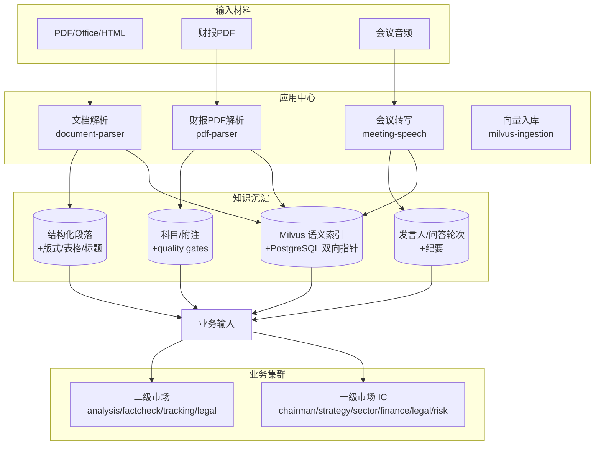

# 应用中心

应用中心提供跨业务复用的基础能力。它把"材料生产"和"知识沉淀"这两类底层能力抽出来，做成可被二级市场和一级市场集群共同调用的应用，避免每个业务智能体各自重复造轮子。

## 应用清单

| 应用 | 代码位置 | Web 入口 | 价值说明 |
| --- | --- | --- | --- |
| 文档解析 | `apps/document-parser` | Web `/documents` | 把 Word / PDF / HTML 等异构文档统一解析成结构化文本与段落，附带版式、表格、标题层级信息，供下游做事实抽取与向量入库 |
| 财报 PDF 解析 | `apps/pdf-parser` | Web `/parse*` | 针对上市公司财报 PDF 做专项解析，识别科目、附注、合并/母公司报表、审计意见等关键字段，并通过 quality gates 校验 |
| 会议转写 | `apps/api` meeting routers、`infra/model-services/meeting-speech` | Web `/meetings` | 把业绩说明会、路演、投委会会议等音视频转写成结构化纪要，区分发言人、问答轮次，并对接向量化与跟踪 |
| 向量入库 | `scripts/vector-index/milvus-ingestion` | Web `/vector-ingest` | 把解析后的段落、纪要、披露片段按统一口径写入 Milvus，维护与 PostgreSQL 的双向指针，支撑语义检索与证据回溯 |

## 应用中心与业务集群的关系

## 每个应用的价值

- **文档解析**：统一了上游材料的入口格式，让下游业务智能体不需要关心原始文件是 Word 还是 PDF，只需要消费结构化段落和元数据。
- **财报 PDF 解析**：上市公司财报是二级市场研究的核心信源，但版式复杂、表格密集。专用解析器保证了科目级别的可回溯性，是 quality gates 能跑起来的前提。
- **会议转写**：业绩说明会和投委会讨论里有大量结构化信息（管理层口径、问答交锋、决议过程）。转写应用把这些信息从一次性音视频变成可检索、可引用的知识资产。
- **向量入库**：所有材料最终都要进入语义检索。统一的向量入库应用保证了入库口径一致、证据指针可回溯，是事实核查和争议回溯的基础。

## 定位说明

应用中心的定位是"材料生产和知识沉淀能力"。

- 它服务于二级市场和一级市场两个业务集群，但不直接替代业务智能体集群。
- 业务智能体（如 `siq_analysis`、`siq_ic_sector_expert`）负责的是"判断"，而应用中心负责的是"把判断所需的材料准备好、把判断产出的结论沉淀下来"。
- 应用中心不持有业务观点，也不做投资判断；它只提供可被业务集群调用的、确定性的材料加工与知识沉淀能力。

这种分层让业务集群可以专注在"研究判断"和"决策"上，而材料加工的复杂性和一致性由应用中心统一兜底。