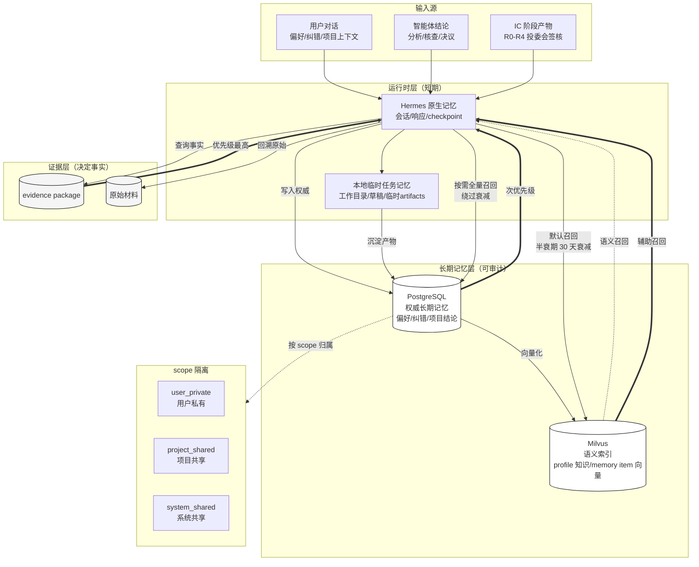
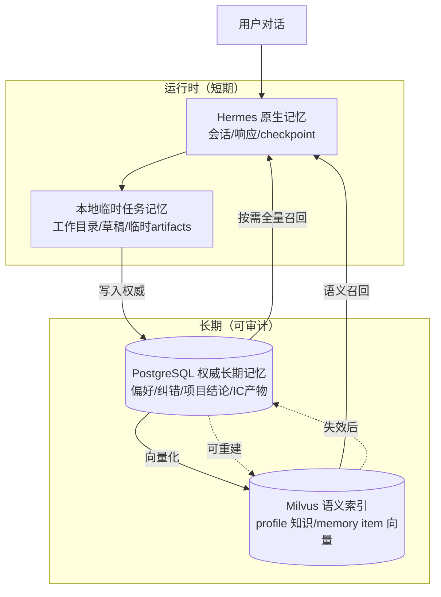
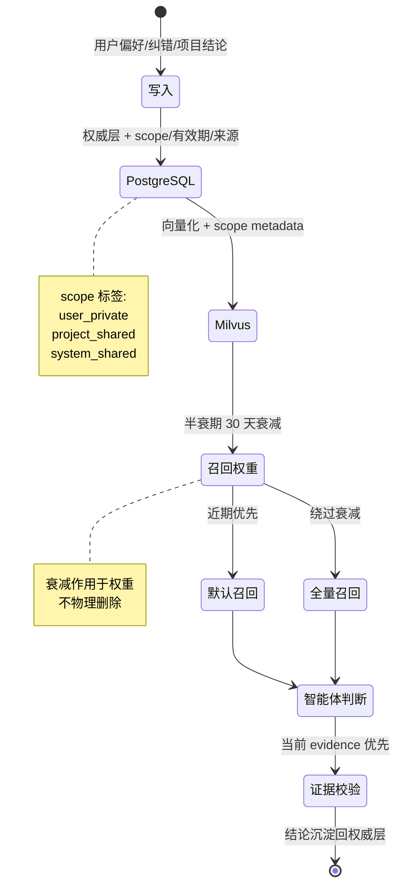
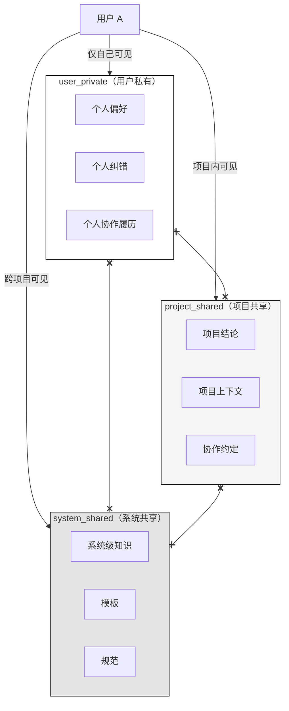
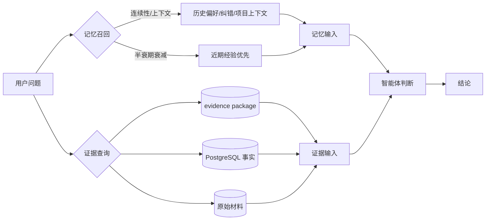

# 拟人化记忆系统

SIQ 的智能体记忆不是简单聊天摘要，而是让研究助手具备"长期共事感"的拟人化记忆系统。通过分层沉淀、衰减召回和证据优先的设计，让助手在长周期投研协作中既能保持连续性，又不会把过时偏好当作既定事实。

## 系统全景

智能体记忆系统由四层存储 + 三种召回路径 + 三类 scope 隔离组成。下方全景图展示记忆的写入、召回、衰减、全量检索四条主路径，以及与证据层之间的优先级关系。

## 四层架构

| 记忆层 | 保存内容 | 作用 |
| --- | --- | --- |
| Hermes 原生记忆 | 会话、响应、profile runtime、checkpoint、短期上下文 | 保持同一 profile 的对话连续性和工具执行状态 |
| 本地临时任务记忆 | 当前任务工作目录、报告草稿、临时 evidence、intermediate artifacts | 支撑长任务分阶段推理、重试和恢复 |
| PostgreSQL 权威长期记忆 | 用户明确偏好、纠错、项目结论、IC 阶段产物、权限、来源和有效期 | 作为可审计、可删除、可授权的长期记忆账本 |
| Milvus 语义索引 | profile 知识 chunk、动态 memory item 向量、scope metadata | 用于语义召回和泛化检索，可从权威层重建 |

## 记忆生命周期

每条记忆项从写入到召回遵循统一的生命周期。半衰期作用于召回权重而非物理删除，超过衰减窗口仍可通过全量检索访问。

## 三个 scope 隔离

记忆按可见性隔离成三个 scope，跨 scope 访问需要显式授权。

- **user_private**（用户私有）：仅对当前用户可见的偏好、纠错和协作履历
- **project_shared**（项目共享）：项目范围内共享的结论、上下文和协作约定
- **system_shared**（系统共享）：跨项目和用户共享的系统级知识、模板和规范

## 关键能力

### 1. 拟人化连续性

助手能记住用户偏好、历史纠错、项目上下文和角色协作方式，但不会把记忆当作未经验证的事实。模型可以引用过往经验来提供建议，但在涉及数字、条款和结论时必须回到当前证据链路，避免"我记得就是这样"覆盖真实材料。

### 2. 全量记忆

长期记忆不是只保留最近几轮摘要，而是按用户、项目、profile、agent group 和可见性沉淀完整记忆项。每条记忆项带有来源、写入时间、scope、有效期和权限标签，构成一份可追溯的协作履历，而非一段被压缩过的对话片段。

### 3. 记忆半衰期 30 天

动态记忆默认按时间衰减，近期经验自然优先，旧偏好不会永久污染新任务。半衰期作用于召回权重而非物理删除——超过衰减窗口的记忆项仍可通过显式全量检索访问，但在默认对话中权重下降，避免陈旧偏好对当前判断产生不当影响。

### 4. 按需全量召回

当用户明确要求"全量检索""完整历史""不要遗忘"时，系统绕过半衰期，但仍保留 ACL、scope 和上下文长度保护。全量召回不等于无差别回灌，系统仍会按可见性和上下文预算裁剪，只是不再用时间衰减作为过滤条件。

## 核心原则

!!! note "记忆提供连续性，证据决定事实"
    对财务数字、法律条款、投资判断和投委会结论，当前 evidence package、数据库事实和原始材料始终优先于模型记忆。记忆提供连续性，证据决定事实。

## 记忆与证据的关系

**记忆提供连续性，证据决定事实。当记忆与证据冲突时，以证据为准。**
