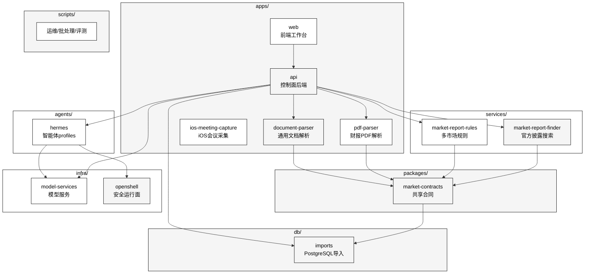

# 仓库地图

| 路径 | 职责 |
| --- | --- |
| `apps/web` | Web 工作台，承载二级市场、一级市场、应用中心和系统管理 |
| `apps/api` | 控制面后端，鉴权、任务、Agent runtime、source access、Deal OS、会议和 OpenShell pool adapter |
| `apps/pdf-parser` | 财报 PDF 解析、质量报告、财务抽取、source map 和人工修正 |
| `apps/document-parser` | 通用文档解析、artifact 合同、table relations、schema extraction 和 source 预览 |
| `apps/ios-meeting-capture` | iOS 原生会议采集候选链路和 Capacitor 插件合同 |
| `services/market-report-finder` | 多市场官方披露搜索、主体解析和原始文件下载 |
| `services/market-report-rules` | 多市场 extraction、validation、load plan 和市场规则注册 |
| `packages/market-contracts` | evidence package shared contract、reader、hash、stable id 和 value polarity |
| `agents/hermes` | 二级市场与一级市场智能体 profiles、共享规则和岗位合同 |
| `db/imports` | PostgreSQL 导入、市场隔离 schema、持久化校验和只读查询 |
| `scripts` | 运维、批处理、评测、Hermes、OpenShell 和向量入库脚本 |
| `infra/model-services` | MinerU、vLLM、embedding、reranker、Nemotron、meeting-speech 等模型服务入口 |
| `infra/openshell` | OpenShell policy、BYOC、provider、broker、schema、patch 和参考文档 |
| `docs` | 架构设计、runbooks、任务书、状态报告和运维说明 |
| `datasets` | 新增稳定样本、fixtures 和可版本化小数据 |
| `eval_datasets` | 历史评测语料和回归集 |
| `data` | 历史兼容运行态和 Wiki 事实资产默认路径 |
| `var` | 新增本地运行态推荐目录，含 OpenShell 私有运行状态 |
| `artifacts` | 构建、测试、评测、批处理和脱敏 OpenShell 证据产物 |

## apps/web 前端工作台

承载四个产品域：

- **二级市场**：分析报告、事实核查、跟踪、法务合规
- **一级市场**：Deal OS、材料中心、投委会工作流、证据、审计
- **应用中心**：文档解析、PDF 解析、会议、向量入库
- **系统管理**：设置、用户、权限

技术栈：React 19 + React Router 7 + Vite 8 + TypeScript 6 + Tailwind CSS 4 + Radix UI。

## apps/api 控制面后端

FastAPI 应用，提供：

- 鉴权（JWT / HttpOnly cookie）
- Agent runtime（Hermes /v1/runs 代理）
- 任务编排和 SSE 流
- source access（官方披露下载代理）
- Deal OS（一级市场投委会 R0-R4 工作流）
- 会议管理（实时/导入转写、导出、保留）
- Agent memory（PostgreSQL + Milvus）
- OpenShell pool adapter（运行面选择）

## apps/pdf-parser 财报 PDF 解析

Flask 应用，将财报 PDF 转成：

- Markdown
- `document_full.json`
- `quality_report.json`
- `financial_data.json`
- `source_map.json`
- page/table evidence

支持市场：CN / HK / US / EU / JP / KR，每个市场有独立的 `*_market_profile.py` 和 `*_quality_adapter.py`。

## apps/document-parser 通用文档解析

Flask 应用，将 PDF、Office、HTML、URL、图片归一为：

- artifact
- source map
- table relations
- schema extraction

支持 MinerU 上游和 simple provider 两种模式。

## services/market-report-finder 官方披露搜索

FastAPI 服务，按市场隔离：

- 实体解析（公司名/代码 → 官方标识）
- 官方查询
- 下载目录
- 限速策略

## services/market-report-rules 多市场规则

FastAPI 服务，把市场差异留在 `markets/<code>` 模块中，输出统一的：

- `financial_data`
- `financial_checks`
- `load_plan`

## packages/market-contracts 共享合同

跨服务合同包，定义：

- evidence package 校验
- summary/detail reader
- stable id
- source map
- value polarity

## agents/hermes 智能体 profiles

按岗位职责建模的 Hermes profiles：

- `siq_analysis` / `siq_assistant` / `siq_factchecker` / `siq_tracking` / `siq_legal`（二级市场）
- `siq_ic_*`（一级市场 IC 集群）

每个 profile 包含 `SOUL.md`（角色定义）、`USER.md`（用户上下文）、`TOOLS.md`（工具合同）。

## db/imports PostgreSQL 导入

市场隔离 schema，提供：

- 持久化校验
- 幂等写入
- 只读查询
- quality gate 阻断

## infra/openshell OpenShell 基础设施

OpenShell policy、BYOC、provider、broker、schema、patch 和参考文档。固定 NVIDIA OpenShell `v0.0.83`。