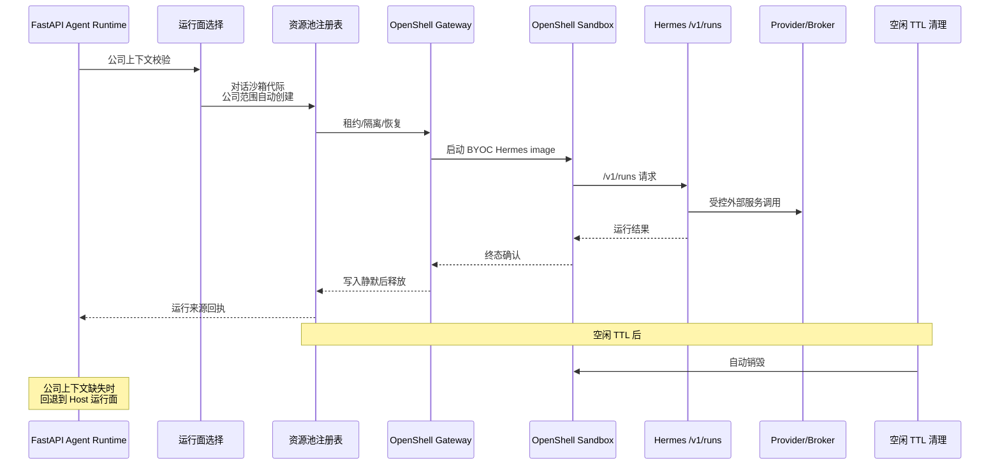

# OpenShell 安全运行面

SIQ 没有安装或运行 NemoClaw / NemoHermes，也没有把 Hermes 简单放进普通 Docker。项目基于 NVIDIA OpenShell `v0.0.83`、上游 commit `e3d26dd3ae0dee247bbc5db368545832757ac493` 和冻结的 Hermes `0.13.0`，构建了直接面向 SIQ 投研契约的原生集成。

## 运行流程

## 保留能力

保留 SIQ 现有 `/v1/runs`、SSE、停止、报告输出路径、公司 Wiki、Hermes profile、业务 Prompt 和工具流程。OpenShell 作为新的运行面接入，不替换既有契约，业务侧调用方式保持稳定，便于灰度和回退。

## 实际使用能力

- OpenShell 网关控制面
- 沙箱数据面
- Landlock 文件边界
- 进程 / seccomp 边界
- Provider 凭据隔离
- 受控服务转发
- 宿主出网 / 数据 broker
- 请求身份
- 当前公司写入边界
- 跨公司拒写探测
- 多沙箱资源池
- 请求级租约
- API 重启恢复
- 运行来源回执
- Host 回退

## 当前状态

有效公司上下文触发自动创建公司级沙箱，同一前端对话内同公司复用沙箱代际，切换公司生成隔离代际。请求结束后租约归零，空闲 TTL 后自动销毁。运行面在公司上下文缺失时拒绝创建沙箱，避免越权写入和跨公司数据混流。

!!! warning "门禁提醒"
    正式生产切流必须等待正式 A/B、人工安全评审和 `check_v06_completion.py` 从 `NO_GO` 进入 `GO`；路线见 `docs/runbooks/openshell/no-go-to-go-readiness-matrix.md`。在门禁通过前，OpenShell 仅用于内测和验证环境，不承载正式投研流量。
