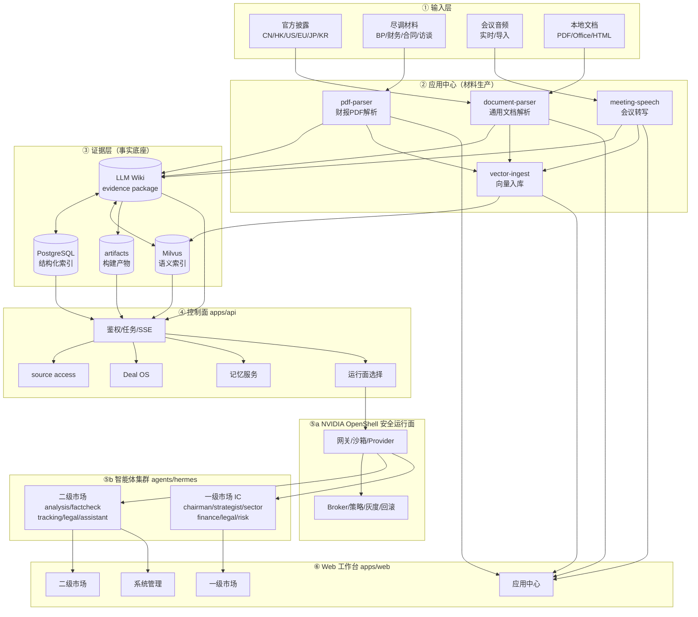
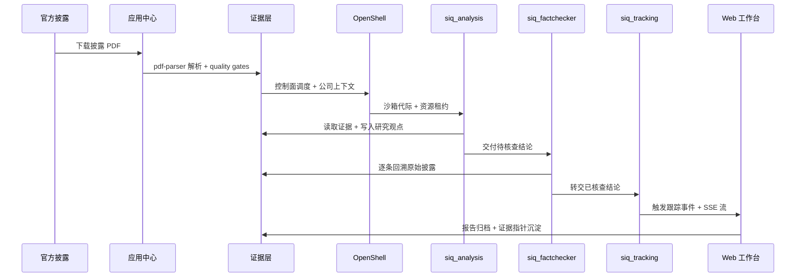
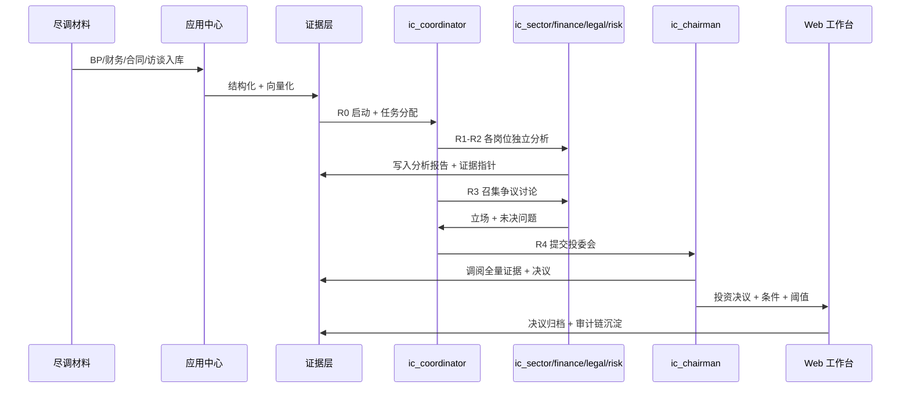
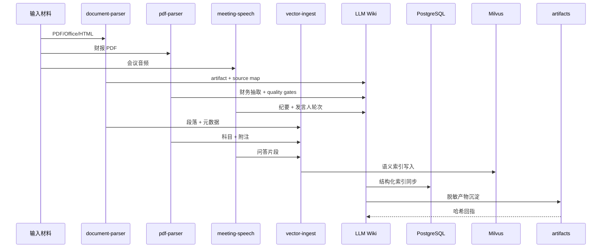
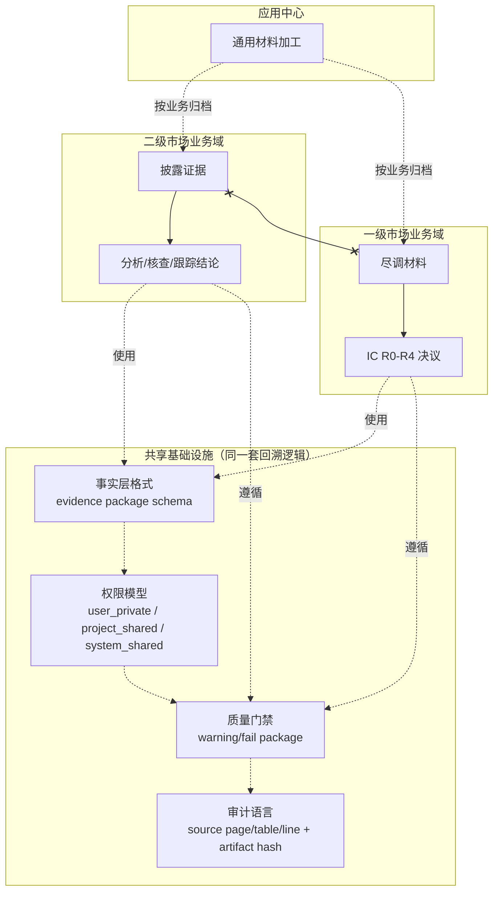

# 产品架构

## 整体架构

SIQ 采用"五层 + 双业务集群 + 一运行面"的分层架构。下方主图按数据流向自上而下展示五层之间的主链路：输入材料经过应用中心加工成证据层事实，控制面在此基础上调度智能体集群在安全运行面内执行研究任务，最终在 Web 工作台汇聚成可签核的研究产物。

## 五层分层细节

整体架构的五层各自承担明确职责。下方细节图按层级展开关键组件，方便对照代码位置。

```mermaid
graph LR
    subgraph Inputs["① 输入层"]
        direction TB
        IN1[官方披露<br/>6 市场]
        IN2[尽调材料<br/>BP/财务/合同]
        IN3[会议音频<br/>实时/导入]
        IN4[本地文档<br/>PDF/Office/HTML]
        IN5[URL]
    end

    subgraph AppCenter["② 应用中心"]
        direction TB
        AP1[document-parser<br/>apps/document-parser]
        AP2[pdf-parser<br/>apps/pdf-parser]
        AP3[meeting-speech<br/>apps/api + infra]
        AP4[vector-ingest<br/>scripts/vector-index]
    end

    subgraph Evidence["③ 证据层"]
        direction TB
        EV1[(LLM Wiki<br/>权威事实包)]
        EV2[(PostgreSQL<br/>结构化索引)]
        EV3[(Milvus<br/>语义索引)]
        EV4[(artifacts<br/>构建产物)]
    end

    subgraph Control["④ 控制面 apps/api"]
        direction TB
        CT1[鉴权 JWT/cookie]
        CT2[任务编排 SSE]
        CT3[source access]
        CT4[Deal OS R0-R4]
        CT5[记忆服务]
        CT6[运行面选择]
    end

    subgraph Agents["⑤ 智能体 + 运行面"]
        direction TB
        AG1[OpenShell 沙箱<br/>infra/openshell]
        AG2[二级市场集群<br/>5 profiles]
        AG3[一级市场 IC 集群<br/>7 profiles]
    end

    subgraph Web["⑥ Web 工作台 apps/web"]
        direction TB
        WB1[二级市场]
        WB2[一级市场]
        WB3[应用中心]
        WB4[系统管理]
    end

    Inputs --> AppCenter
    AppCenter --> Evidence
    Evidence --> Control
    Control --> Agents
    Agents --> Web
```

### 1. 输入层

- 官方披露（CN/HK/US/EU/JP/KR 六市场）
- 尽调材料（BP、财务模型、合同、访谈、第三方报告）
- 会议音频（实时/导入）
- 本地文档（PDF、Office、HTML、图片）
- URL

### 2. 应用中心（材料生产）

- `document-parser` —— 通用文档解析
- `pdf-parser` —— 财报 PDF 解析
- meeting speech —— 会议转写
- vector ingest —— 向量入库

### 3. 证据层（事实底座）

- **LLM Wiki evidence package** —— 文件型证据包，权威事实层
- **PostgreSQL** —— 结构化索引
- **Milvus** —— 可重建的语义索引
- **artifacts** —— 构建产物和脱敏证据

!!! note "核心原则"
    向量库失效可以重建，事实源不丢。Wiki package 是权威事实层，PostgreSQL 是结构化索引，Milvus 是可重建的语义索引。

### 4. 控制面（apps/api）

- 鉴权（JWT / HttpOnly cookie）
- 任务编排
- Agent stream（SSE）
- source access
- Deal OS（一级市场投委会工作流）
- 会议管理
- 记忆服务
- 运行面选择（Host / OpenShell）

### 5. 智能体集群（agents/hermes）

- **二级市场**：analysis / factcheck / tracking / legal / assistant
- **一级市场**：IC chairman / strategist / sector / finance / legal / risk / coordinator

智能体通过 NVIDIA OpenShell 安全运行面执行，所有行动可审计、可回放。

## 数据流

不同业务场景下数据流路径不同。下方按三类典型场景拆分，避免把所有参与者塞进同一个序列图导致难以阅读。

### 场景一：二级市场披露分析流

公开披露文件经过解析、入库、分析、核查、跟踪五段闭环，最终在 Web 形成可下钻到原始段落的研究报告。

### 场景二：一级市场 IC 决策流

尽调材料经 R0-R4 五阶段流转，各岗位在 R2 形成独立分析、R3 形成争议清单、R4 由投委会主席形成带条件决议，全程证据可回溯。

### 场景三：材料解析流

应用中心把异构输入材料统一加工成结构化事实，写入证据层的四个存储介质，向上为业务集群提供一致的输入。

## 跨层共享与市场隔离

三块产品（二级市场、一级市场、应用中心）共享同一套底层基础设施：事实层、权限模型、质量门禁、审计语言。这让跨业务复用、证据回溯、审计复核成为可能。

!!! warning "共享基础设施 ≠ 共享证据"
    三个产品**共享同一套证据链回溯逻辑**（source page/table/line、artifact hash、quality gates），但**一二级市场的证据本身不互相引用**：

    - 二级市场的披露证据 → 仅服务于二级市场分析、核查、跟踪
    - 一级市场的尽调材料 → 仅服务于一级市场 IC R0-R4 流程
    - 会议陈述按所属业务归档，不跨业务混用
    - 智能体判断和最终决策只能引用本业务域内的证据

    同一套回溯机制保证"任何结论都能下钻到原始材料"，但证据本身按业务域隔离，避免一二级市场信息混用。

图例：实线 `-->` 表示证据→结论的生产链；虚线 `-.->` 表示遵循共享基础设施；`x--x` 表示一二级市场证据**互相隔离、不互相引用**。
