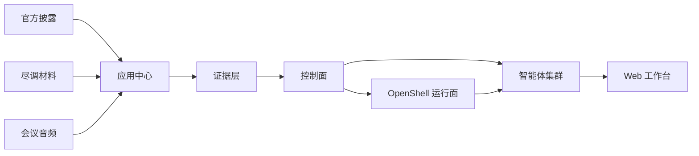

# 产品架构

```text
官方披露 / 尽调材料 / 会议音频 / 本地文档 / URL
  -> 应用中心
       document-parser / pdf-parser / meeting speech / vector ingest
  -> 证据层
       LLM Wiki evidence package / PostgreSQL / Milvus / artifacts
  -> 控制面
       apps/api / 鉴权 / 任务 / 来源访问 / 记忆 / 运行面选择
  -> 智能体集群
       二级市场 analysis/factcheck/tracking/legal/assistant
       一级市场 IC chairman/strategy/sector/finance/legal/risk/coordinator
  -> NVIDIA OpenShell 安全运行面
       网关 / 沙箱 / Provider / Broker / 策略 / 灰度 / 回滚
  -> Web 工作台
       二级市场 / 一级市场 / 应用中心 / 系统管理
```

## 五层架构

### 1. 输入层

- 官方披露（CN/HK/US/EU/JP/KR 六市场）
- 尽调材料（BP、财务模型、合同、访谈、第三方报告）
- 会议音频（实时/导入）
- 本地文档（PDF、Office、HTML、图片）
- URL

### 2. 应用中心（材料生产）

- `document-parser` —— 通用文档解析
- `pdf-parser` —— 财报 PDF 解析
- meeting speech —— 会议转写
- vector ingest —— 向量入库

### 3. 证据层（事实底座）

- **LLM Wiki evidence package** —— 文件型证据包，权威事实层
- **PostgreSQL** —— 结构化索引
- **Milvus** —— 可重建的语义索引
- **artifacts** —— 构建产物和脱敏证据

!!! note "核心原则"
    向量库失效可以重建，事实源不丢。Wiki package 是权威事实层，PostgreSQL 是结构化索引，Milvus 是可重建的语义索引。

### 4. 控制面（apps/api）

- 鉴权（JWT / HttpOnly cookie）
- 任务编排
- Agent stream（SSE）
- source access
- Deal OS（一级市场投委会工作流）
- 会议管理
- 记忆服务
- 运行面选择（Host / OpenShell）

### 5. 智能体集群（agents/hermes）

- **二级市场**：analysis / factcheck / tracking / legal / assistant
- **一级市场**：IC chairman / strategist / sector / finance / legal / risk / coordinator

智能体通过 NVIDIA OpenShell 安全运行面执行，所有行动可审计、可回放。

## 数据流



## 跨层共享

三块产品（二级市场、一级市场、应用中心）共享：

- 同一个事实层（evidence package）
- 同一个权限模型（user_private / project_shared / system_shared）
- 同一个质量门禁（warning/fail package）
- 同一个审计语言（source page/table/line、artifact hash）

二级市场的披露证据、一级市场的尽调材料、会议陈述、智能体判断和最终决策可以在同一套 evidence / source / memory 体系中互相引用。