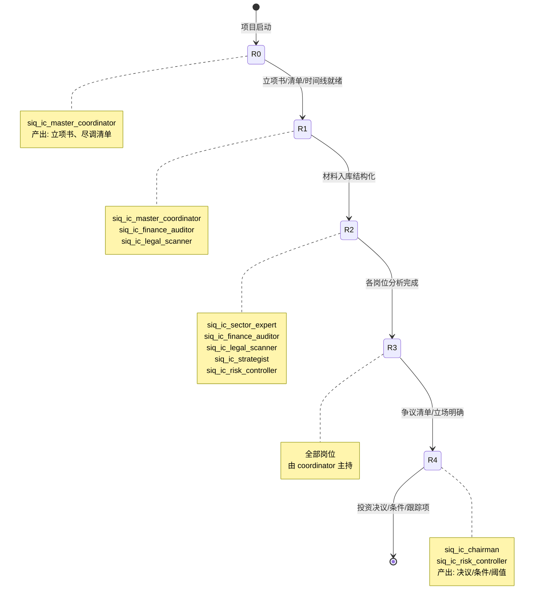

# 一级市场 IC 智能体集群

一级市场集群围绕"材料、证据、专家意见、争议和投委会决策"工作。它把一次投资尽调 + 投委会讨论抽象成 R0-R4 过程模型，让每个阶段都有明确的产出和签核点，最终形成可回放、可签核、可复核的决策链。

## Profiles

| Profile | 职责合同 |
| --- | --- |
| `siq_ic_master_coordinator` | 项目编排：管理 R0-R4 阶段流转，分配任务给各岗位，维护项目状态机与时间线 |
| `siq_ic_chairman` | 投委会裁决：在 R4 阶段主持投委会，汇总各方意见，形成带条件的投资决议 |
| `siq_ic_strategist` | 战略适配：判断项目与基金战略、组合配置、退出路径的契合度 |
| `siq_ic_sector_expert` | 行业判断：对赛道空间、竞争格局、技术路线、行业风险给出独立意见 |
| `siq_ic_finance_auditor` | 财务一致性：核对历史财务、预测口径、关联交易、收入确认等财务一致性 |
| `siq_ic_legal_scanner` | 法务尽调：扫描股权、资质、诉讼、合规、知识产权等法务风险项 |
| `siq_ic_risk_controller` | 风险阈值：对估值、对赌、流动性、集中度等风险指标给出阈值与告警 |

## R0-R4 工作流阶段

| 阶段 | 名称 | 主要产出 | 关键岗位 |
| --- | --- | --- | --- |
| R0 | 项目启动 | 项目立项书、尽调清单、时间线 | `siq_ic_master_coordinator` |
| R1 | 材料收集 | BP / 财务 / 法务 / 业务材料入库与结构化 | `siq_ic_master_coordinator`、`siq_ic_finance_auditor`、`siq_ic_legal_scanner` |
| R2 | 分析 | 行业判断、财务一致性、法务风险、战略适配的独立分析报告 | `siq_ic_sector_expert`、`siq_ic_finance_auditor`、`siq_ic_legal_scanner`、`siq_ic_strategist`、`siq_ic_risk_controller` |
| R3 | 争议讨论 | 争议点清单、各方立场、未决问题与跟进项 | 全部岗位（由 `siq_ic_master_coordinator` 主持） |
| R4 | 投委会决策 | 投资决议、条件清单、跟踪项、风险阈值 | `siq_ic_chairman`、`siq_ic_risk_controller` |

## R0-R4 阶段流转

## 核心价值

一级市场 IC 智能体集群的核心价值在于：把尽调和投委会从散落文档、口头判断，转成可回放、可签核、可复核的决策链。

- **可回放**：每个阶段的输入材料、分析过程、争议讨论、最终决议都被结构化记录，事后可以完整复盘一次投资决策是如何做出的。
- **可签核**：每个岗位在 R0-R4 各阶段的产出都需要签核才能流转，形成明确的责任链。
- **可复核**：投委会决议中的每一条结论都能下钻到原始材料和分析过程，支持事后复核与审计。

这套机制不替代人做投资判断，而是让"人是怎么拍板的"这件事变得透明、可追溯、可被质疑。