# 二级市场智能体集群

二级市场集群围绕"公开披露事实到研究结论"工作。它把一份官方披露文件，逐级加工成可回溯、可签核、可复核的研究报告，并对接跟踪、法律等下游岗位。集群内每个 profile 都是一份明确的岗位合同，而不是多个人格在聊天。

## Profiles

| Profile | 路由 / 入口 | 职责合同 |
| --- | --- | --- |
| `siq_assistant` | `/chat` | 通用问答入口，负责意图识别、路由分发、上下文聚合，回答常见投研问题 |
| `siq_analysis` | `/analysis` | 单标的深度分析，把披露事实组织成结构化研究观点并产出报告 |
| `siq_analysis_multi_market` | 多市场分析 | 跨市场（A 股 / 港股 / 美股等）横向对比分析，统一口径与币种 |
| `siq_factchecker` | `/verify` | 事实核查岗位，对分析结论逐条回溯到原始披露与外部权威源 |
| `siq_factchecker_multi_market` | 多市场核查 | 跨市场语境下的事实核查，处理多语言、多会计准则的差异 |
| `siq_tracking` | `/tracking` | 持续跟踪岗位，按事件、指标、时间窗维护标的状态并触发提醒 |
| `siq_tracking_multi_market` | 多市场跟踪 | 跨市场组合跟踪，处理交易日、披露窗口、汇率口径的同步 |
| `siq_legal` | `/legal` | 法律合规岗位，对披露与结论进行法规适配与风险提示 |

## 典型闭环

```mermaid
graph LR
    A[官方披露下载] --> B[财报解析<br/>apps/pdf-parser<br/>apps/document-parser]
    B --> C[quality gates<br/>结构/字段/数值一致性]
    C --> D[(PostgreSQL + Milvus + Wiki<br/>事实与向量沉淀)]
    D --> E[siq_analysis<br/>siq_analysis_multi_market]
    E --> F[siq_factchecker<br/>siq_factchecker_multi_market]
    F --> G[siq_tracking<br/>siq_legal]
    G --> H[可回溯报告<br/>每条结论可下钻到原始披露段落]

    style A fill:#fff,stroke:#000,color:#000
    style B fill:#f5f5f5,stroke:#000,color:#000
    style C fill:#fff,stroke:#000,color:#000
    style D fill:#f5f5f5,stroke:#000,color:#000
    style E fill:#fff,stroke:#000,color:#000
    style F fill:#f5f5f5,stroke:#000,color:#000
    style G fill:#fff,stroke:#000,color:#000
    style H fill:#f5f5f5,stroke:#000,color:#000
```

## 岗位合同说明

每个 profile 都是一份岗位合同，明确以下四件事：

1. **输入**：必须接收什么样的材料（例如披露原文、解析后的结构化数据、上游结论）。
2. **职责**：在闭环中承担哪一段加工，不允许越权改写其他岗位的结论。
3. **输出**：必须以什么结构产出（例如带证据指针的结论、带时间戳的跟踪事件）。
4. **质量门**：必须通过哪些 quality gates 才能向下游交付。

这里强调的是"岗位合同"而不是"多个人格聊天"。智能体之间不靠自然语言协商，而是靠契约式的输入输出和质量门衔接。这样整个研究链路才能做到可回放、可签核、可复核。