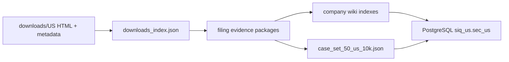

# US SEC Wiki Pipeline Design

## Goal

Build the US market wiki extraction layer from already downloaded SEC HTML/iXBRL filings, while keeping the downstream contract aligned with the existing A-share/HK/JP/KR/EU market evidence package flow. The pipeline must produce replayable wiki artifacts first, then let PostgreSQL ingest from those wiki artifacts rather than from the raw downloads directory. Milvus ingestion is intentionally out of scope for this phase.

## Scope

This design covers local SEC filings under `data/market-report-finder/downloads/US`, currently 51 downloaded HTML/iXBRL annual filings across roughly 50 tickers. The first production target is Form 10-K. The structure must still allow 10-Q and 20-F later without changing downstream table or vector contracts.

This design does not change SEC downloading or PostgreSQL DDL. It prepares the wiki package/index shape that PostgreSQL ingestion consumes. Milvus collection creation and vector ingestion are deferred.

## Package Layout

Each filing remains a self-contained evidence package:

```text
data/wiki/us_sec/<TICKER>/<fiscal_year>/<FORM>_<accession>/
  manifest.json
  README.md
  raw/filing.htm
  raw/filing.metadata.json
  raw/sec_index.json
  sections.json
  sections/*.md
  tables/table_index.json
  tables/table_####.json
  xbrl/facts_raw.json
  xbrl/contexts.json
  xbrl/units.json
  xbrl/labels.json
  xbrl/taxonomy_summary.json
  metrics/financial_data.json
  metrics/financial_checks.json
  metrics/normalized_metrics.json
  metrics/operating_metrics.json
  qa/source_map.json
  qa/quality_report.json
  qa/extraction_warnings.json
```

US packages use `market_evidence_package_v1` in `manifest.json`, with `market=US`, `country=US`, `document_format=ixbrl_html`, `source_id=sec`, `source_tier=official`, and an `artifacts` map whose keys match the shared market package contract. Older `sec_evidence_package_v1` outputs should be regenerated or overwritten by the batch wiki script.

## Company Wiki Layer

The company-level layer is rooted at `data/wiki/us_sec/<TICKER>/` and is derived from package manifests and metrics. It does not duplicate raw filing content.

```text
data/wiki/us_sec/<TICKER>/
  company.json
  company.md
  _index.json
  filings.json
  metrics/latest/financial_data.json
  metrics/latest/financial_checks.json
  metrics/latest/normalized_metrics.json
  metrics/reports/<filing_id_slug>/financial_data.json
  metrics/reports/<filing_id_slug>/financial_checks.json
  metrics/reports/<filing_id_slug>/normalized_metrics.json
```

The latest metrics are chosen from the newest non-fail filing by period end, fiscal year, filing date, and path. `filings.json` is sorted newest first. `_index.json` is optimized for programmatic navigation; `company.md` is a short human-readable overview.

At root level the pipeline writes:

```text
data/wiki/us_sec/_meta/downloads_index.json
data/wiki/us_sec/_meta/package_index.json
data/wiki/us_sec/_meta/quality_summary.json
data/wiki/us_sec/case_set_50_us_10k.json
```

`downloads_index.json` records source files and metadata. `package_index.json` records generated package summaries. `quality_summary.json` aggregates pass/warning/fail counts and extraction counts. `case_set_50_us_10k.json` remains compatible with existing `ingest_sec_case_set.py` and is the curated bridge to PostgreSQL ingestion.

## Scripts

Add three focused scripts and keep the existing single-package builder:

- `scripts/us-sec/discover_sec_downloaded_cases.py` scans downloaded SEC HTML files and writes `_meta/downloads_index.json`.
- `scripts/us-sec/build_sec_wiki_index.py` aggregates generated packages into ticker-level wiki indexes and root metadata files.
- `scripts/us-sec/build_sec_wiki.py` orchestrates discover, package build, and index build.
- `scripts/us-sec/build_sec_evidence_package.py` remains the single filing entrypoint and delegates to `sec_evidence_lib.write_evidence_package`.

Main command:

```bash
apps/api/.venv/bin/python scripts/us-sec/build_sec_wiki.py \
  --downloads-root data/market-report-finder/downloads/US \
  --output-root data/wiki/us_sec \
  --forms 10-K \
  --incremental
```

Use `--force` when the package contract changes and old packages must be regenerated.

## Data Flow



PostgreSQL ingestion should read from package paths in the wiki layer. Evidence identity for US is based on `filing_id`, `accession_number`, `section_id`, `html_anchor`, `context_ref`, and `fact_id`, not PDF page coordinates.

## Evidence And Quality

`qa/source_map.json` must preserve links from normalized metrics to raw XBRL facts and from sections/tables back to the SEC source URL. For US, a metric citation should include `evidence_id`, `raw_fact_id`, `context_ref`, `html_anchor`, and `source_url` when available.

Quality gates are:

- Manifest validates against `market_evidence_package_v1` required fields.
- Raw filing, sections, XBRL facts, metrics, quality report, and source map exist.
- Annual core metrics are checked through the existing rule validation layer.
- Root `quality_summary.json` reports package quality counts and extraction totals.
- Batch script exits non-zero only when builds fail and `--continue-on-error` is not set.

## Testing

Tests cover pure behavior without requiring live SEC or PostgreSQL:

- Discovery parses a temporary downloads tree and returns normalized metadata rows.
- Index builder creates company indexes, latest metrics, package index, quality summary, and case set from synthetic packages.
- Evidence package builder writes the shared `market_evidence_package_v1` manifest fields for a tiny mocked SEC HTML fixture.
- CLI modules import without side effects.

## Implementation Notes

Keep the new scripts small and importable. Shared functions should accept `Path` inputs and return dictionaries or paths so they can be tested directly. Avoid database calls in wiki-building scripts; the existing PostgreSQL ingestion scripts remain responsible for database writes.
